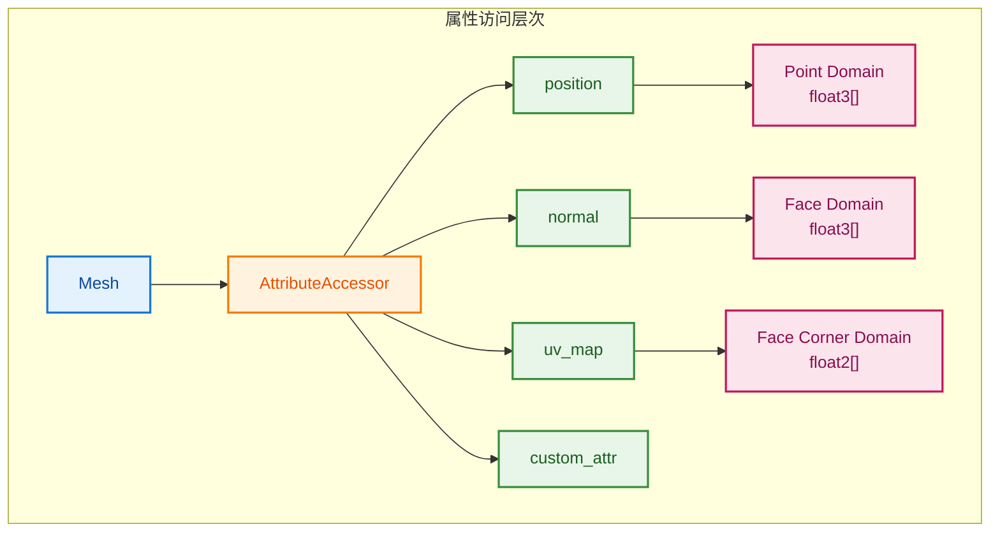

# AttributeAccessor - 属性访问器

> 统一访问和修改几何属性的类型安全接口

---

## 📖 源码注释翻译

**文件：** `source/blender/blenkernel/BKE_attribute.hh`

> 属性访问器提供对几何属性的统一访问接口。它允许以类型安全的方式读取和写入属性数据，而不需要知道底层存储细节。
>
> 属性存储在特定的域（Domain）上，如点、边、面、面角等。每个属性都有名称、类型和域。
>
> 属性访问器支持隐式共享和写时复制，确保修改属性时不会意外影响共享的几何数据。

---

## 🎯 核心概念

### 什么是 AttributeAccessor？

```cpp
// 属性访问器提供统一接口访问几何属性
// 不需要知道属性实际存储在哪里（顶点、边、面等）

// 获取访问器
const Mesh &mesh = ...;
bke::AttributeAccessor attributes = mesh.attributes();

// 读取属性
VArray<float> weights = attributes.lookup<float>("weight", bke::AttrDomain::Point);

// 检查属性是否存在
bool has_uv = attributes.contains("uv_map");
```



---

## 🔧 源码详解

### 属性域（Domain）

```cpp
// BKE_attribute.hh:35
enum class AttrDomain : int8_t {
  Point = 0,       // 顶点/点
  Edge = 1,        // 边
  Face = 2,        // 面
  FaceCorner = 3,  // 面角（每个面的顶点）
  Curve = 4,       // 曲线
  Instance = 5,    // 实例
};
```

### AttributeAccessor 类

```cpp
// BKE_attribute.hh:120
class AttributeAccessor {
 public:
  // 查找属性（只读）
  template<typename T>
  VArray<T> lookup(const StringRef name, const AttrDomain domain) const;
  
  // 查找通用属性（类型擦除）
  GVArray lookup(const StringRef name, const AttrDomain domain) const;
  
  // 检查属性是否存在
  bool contains(const StringRef name) const;
  
  // 获取属性元数据
  std::optional<AttributeMetaData> lookup_meta_data(const StringRef name) const;
  
  // 遍历所有属性
  void for_all(const FunctionRef<void(const StringRef, const AttrDomain, const CPPType &)> callback) const;
};
```

### MutableAttributeAccessor 类

```cpp
// BKE_attribute.hh:150
class MutableAttributeAccessor {
 public:
  // 查找或添加属性
  template<typename T>
  SpanAttributeWriter<T> lookup_or_add_for_write_span(
      const StringRef name,
      const AttrDomain domain);
  
  // 添加属性
  template<typename T>
  bool add(const StringRef name, const AttrDomain domain);
  
  // 移除属性
  bool remove(const StringRef name);
  
  // 清空所有属性
  void clear();
};
```

### SpanAttributeWriter

```cpp
// BKE_attribute.hh:200
template<typename T>
struct SpanAttributeWriter {
  MutableSpan<T> span;  // 可写的属性数据
  
  // 完成写入，提交修改
  void finish();
  
  // 析构时自动调用 finish()
  ~SpanAttributeWriter() { if (!finished_) { finish(); } }
};
```

---

## 💡 使用方法

### 读取属性

```cpp
// 1. 获取访问器
const Mesh &mesh = ...;
bke::AttributeAccessor attributes = mesh.attributes();

// 2. 读取已知类型的属性
VArray<float3> positions = attributes.lookup<float3>("position", bke::AttrDomain::Point);

// 3. 安全读取（检查是否存在）
if (attributes.contains("weight")) {
    VArray<float> weights = attributes.lookup<float>("weight", bke::AttrDomain::Point);
}

// 4. 读取为通用类型（运行时确定类型）
GVArray generic = attributes.lookup("custom_attr", bke::AttrDomain::Point);
if (generic.type() == CPPType::get<float>()) {
    VArray<float> values = generic.typed<float>();
}
```

### 写入属性

```cpp
// 1. 获取可变访问器
Mesh &mesh = ...;
bke::MutableAttributeAccessor attributes = mesh.attributes_for_write();

// 2. 查找或添加属性
bke::SpanAttributeWriter<float> weights = 
    attributes.lookup_or_add_for_write_span<float>("weight", bke::AttrDomain::Point);

// 3. 修改数据
for (int i : weights.span.index_range()) {
    weights.span[i] = calculate_weight(i);
}

// 4. 完成写入
weights.finish();
```

### 遍历所有属性

```cpp
// 遍历所有属性
attributes.for_all([&](const StringRef name, const AttrDomain domain, const CPPType &type) {
    std::cout << "Attribute: " << name << 
              " Domain: " << domain << 
              " Type: " << type.name() << std::endl;
});
```

---

## 🎨 在 Blender 中的实际应用

### 场景：Set Position 节点

```cpp
static void node_geo_exec(GeoNodeExecParams params)
{
    GeometrySet geometry = params.extract_input<GeometrySet>("Geometry"_ustr);
    
    if (Mesh *mesh = geometry.get_mesh_for_write()) {
        // 获取可变属性访问器
        bke::MutableAttributeAccessor attributes = mesh->attributes_for_write();
        
        // 获取位置属性（必须存在）
        bke::SpanAttributeWriter<float3> positions = 
            attributes.lookup_for_write_span<float3>("position");
        
        // 修改位置
        const Field<float3> offset = params.extract_input<Field<float3>>("Offset"_ustr);
        
        const bke::MeshFieldContext context(*mesh, bke::AttrDomain::Point);
        fn::FieldEvaluator evaluator(context, mesh->totvert);
        evaluator.add_with_destination(offset, positions.span);
        evaluator.evaluate();
        
        positions.finish();
    }
    
    params.set_output("Geometry"_ustr, std::move(geometry));
}
```

### 场景：Transfer Attribute 节点

```cpp
static void node_geo_exec(GeoNodeExecParams params)
{
    GeometrySet source = params.extract_input<GeometrySet>("Source"_ustr);
    GeometrySet target = params.extract_input<GeometrySet>("Target"_ustr);
    
    const StringRef attr_name = params.extract_input<StringRef>("Attribute"_ustr);
    
    if (const Mesh *src_mesh = source.get_mesh()) {
        if (Mesh *dst_mesh = target.get_mesh_for_write()) {
            // 读取源属性
            bke::AttributeAccessor src_attrs = src_mesh->attributes();
            GVArray src_values = src_attrs.lookup(attr_name, bke::AttrDomain::Point);
            
            if (src_values) {
                // 添加到目标
                bke::MutableAttributeAccessor dst_attrs = dst_mesh->attributes_for_write();
                
                // 根据源类型创建目标属性
                src_values.type().to_static_type_try<float, float3, int>([&](auto type_tag) {
                    using T = typename decltype(type_tag)::type;
                    
                    bke::SpanAttributeWriter<T> dst_attr = 
                        dst_attrs.lookup_or_add_for_write_span<T>(attr_name, bke::AttrDomain::Point);
                    
                    // 传输数据...
                    
                    dst_attr.finish();
                });
            }
        }
    }
    
    params.set_output("Geometry"_ustr, std::move(target));
}
```

---

## ✅ 总结

| 特性 | 说明 |
|------|------|
| **类型安全** | 模板方法确保属性类型正确 |
| **域支持** | 支持点、边、面、面角等多种域 |
| **隐式共享** | 读取时共享数据，写入时自动复制 |
| **通用访问** | 统一的接口访问所有几何类型的属性 |
| **延迟加载** | 属性数据按需加载 |

**核心类：**

| 类 | 作用 |
|------|------|
| `AttributeAccessor` | 只读属性访问 |
| `MutableAttributeAccessor` | 可写属性访问 |
| `SpanAttributeWriter` | 属性写入辅助类 |
| `VArray<T>` | 只读属性数据视图 |
| `MutableSpan<T>` | 可写属性数据视图 |
