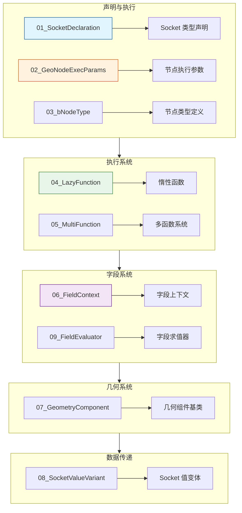
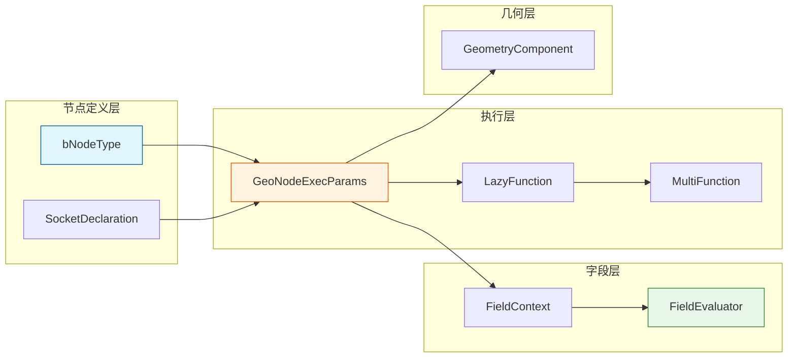

# 几何节点类文档

> 几何节点开发中常用的类和基类详解

---

## 📚 文档导航



---

## 📖 文档列表

### 核心类（必读）

| 文档 | 内容 | 重要程度 |
|-----|------|---------|
| [01_SocketDeclaration.md](01_SocketDeclaration.md) | Socket 声明系统，建造者模式 | ⭐⭐⭐⭐⭐ |
| [02_GeoNodeExecParams.md](02_GeoNodeExecParams.md) | 节点执行参数，输入输出 | ⭐⭐⭐⭐⭐ |
| [03_bNodeType.md](03_bNodeType.md) | 节点类型定义，注册机制 | ⭐⭐⭐⭐⭐ |

### 执行系统

| 文档 | 内容 | 重要程度 |
|-----|------|---------|
| [04_LazyFunction.md](04_LazyFunction.md) | 惰性函数系统，按需计算 | ⭐⭐⭐⭐ |
| [05_MultiFunction.md](05_MultiFunction.md) | 多函数系统，批量处理 | ⭐⭐⭐⭐ |

### 字段系统

| 文档 | 内容 | 重要程度 |
|-----|------|---------|
| [06_FieldContext.md](06_FieldContext.md) | 字段上下文，域信息 | ⭐⭐⭐⭐⭐ |
| [09_FieldEvaluator.md](09_FieldEvaluator.md) | 字段求值器，批量求值 | ⭐⭐⭐⭐⭐ |

### 几何系统

| 文档 | 内容 | 重要程度 |
|-----|------|---------|
| [07_GeometryComponent.md](07_GeometryComponent.md) | 几何组件基类 | ⭐⭐⭐⭐ |

### 数据传递

| 文档 | 内容 | 重要程度 |
|-----|------|---------|
| [08_SocketValueVariant.md](08_SocketValueVariant.md) | Socket 值变体，类型擦除 | ⭐⭐⭐ |

---

## 🎯 学习路径

### 新手入门

```
01_SocketDeclaration → 02_GeoNodeExecParams → 03_bNodeType
```

### 进阶理解

```
04_LazyFunction → 05_MultiFunction → 06_FieldContext
```

### 实战开发

```
09_FieldEvaluator → 07_GeometryComponent
```

---

## 🗺️ 类关系图



---

## 💡 快速参考

### 节点开发流程

| 步骤 | 使用类/函数 | 说明 |
|-----|-----------|------|
| 1. 声明 Socket | `SocketDeclarationBuilder` | 定义输入输出 |
| 2. 注册节点 | `bNodeType` | 注册到系统 |
| 3. 执行节点 | `GeoNodeExecParams` | 获取输入，设置输出 |
| 4. 字段求值 | `FieldEvaluator` | 批量计算字段 |

### 常用类型对照

| 场景 | 使用类 | 头文件 |
|-----|-------|-------|
| Socket 声明 | `decl::Float/Int/Vector/Geometry` | `NOD_socket_declarations.hh` |
| 执行参数 | `GeoNodeExecParams` | `NOD_geometry_exec.hh` |
| 节点类型 | `bNodeType` | `BKE_node.hh` |
| 字段求值 | `FieldEvaluator` | `FN_field.hh` |
| 字段上下文 | `MeshFieldContext` | `BKE_geometry_fields.hh` |

---

## ✅ 学习检查清单

### 基础篇

- [ ] 理解 SocketDeclaration 的建造者模式
- [ ] 掌握 GeoNodeExecParams 的输入输出
- [ ] 了解 bNodeType 的注册流程

### 进阶篇

- [ ] 理解 LazyFunction 的惰性求值
- [ ] 了解 MultiFunction 的批量处理
- [ ] 掌握 FieldContext 的作用

### 实战篇

- [ ] 熟练使用 FieldEvaluator
- [ ] 了解 GeometryComponent 继承体系

---

## 📁 相关链接

- [上级目录：学习节点](../README.md)
- [基础库文档](../基础库/README.md) - 基础数据结构

---

**Happy Coding! 🎨🔧**
