# BLI_vector 深度解析 - Blender 的动态数组

> 基于 `source/blender/blenlib/BLI_vector.hh` 的完整源码分析，评估设计优劣，并与业界 `std::vector`、`llvm::SmallVector`、`fbvector` 等方案对比。

---

## 🗺️ 总览：BLI_vector 是什么？

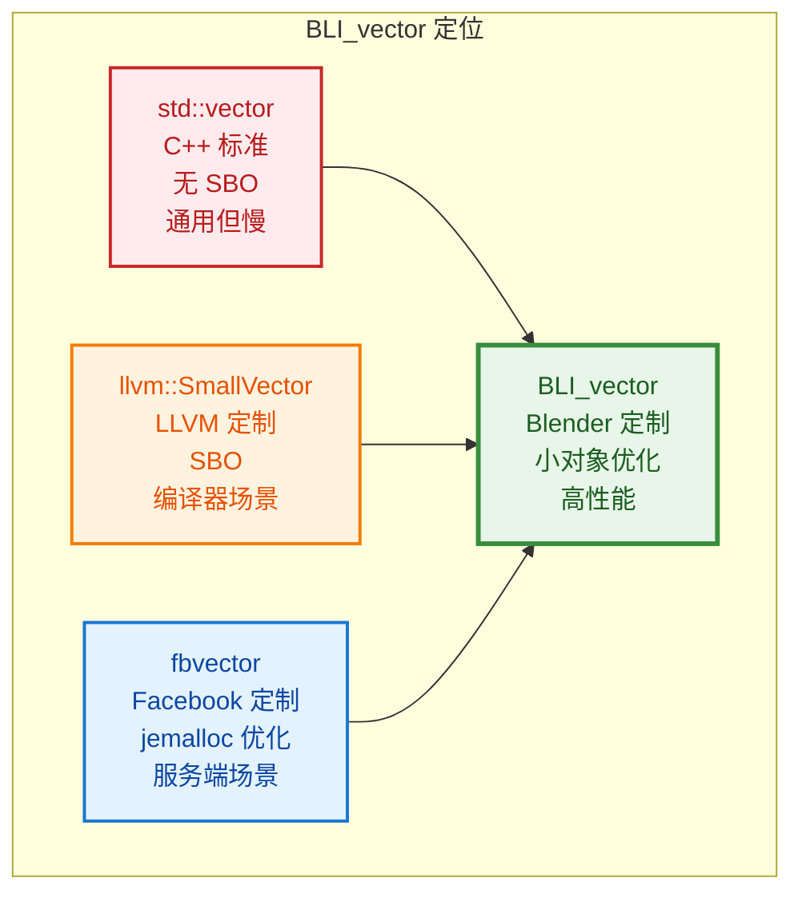

**一句话定义：** `Vector<T>` 是 Blender 为替代 `std::vector` 而设计的动态数组，核心优势是**小对象优化（Small Buffer Optimization, SBO）**——小数据量时完全避免堆分配。

---

## 1️⃣ 内存布局：三指针 + 内联缓冲

### 1.1 核心成员

```cpp
// BLI_vector.hh:88~103
/**
 * Use pointers instead of storing the size explicitly. This reduces the number of instructions
 * in `append`.
 *
 * The pointers might point to the memory in the inline buffer.
 */
T *begin_;              // 指向第一个元素
T *end_;                // 指向最后一个元素的下一个位置
T *capacity_end_;       // 指向容量上限的下一个位置

/** Used for allocations when the inline buffer is too small. */
BLI_NO_UNIQUE_ADDRESS Allocator allocator_;

/** A placeholder buffer that will remain uninitialized until it is used. */
BLI_NO_UNIQUE_ADDRESS TypedBuffer<T, InlineBufferCapacity> inline_buffer_;
```

**注释翻译：** 使用指针而不是显式存储大小。这减少了 `append` 中的指令数。指针可能指向内联缓冲区中的内存。

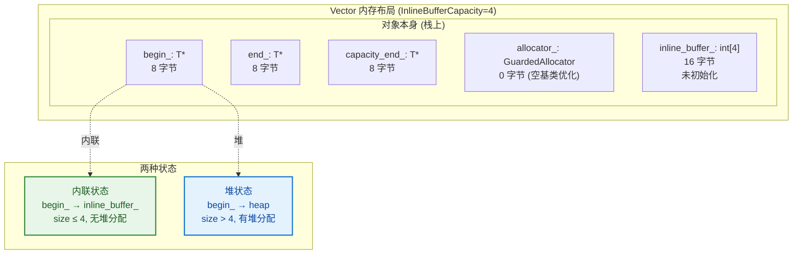

### 1.2 为什么用三指针而不是 `size` + `capacity`？

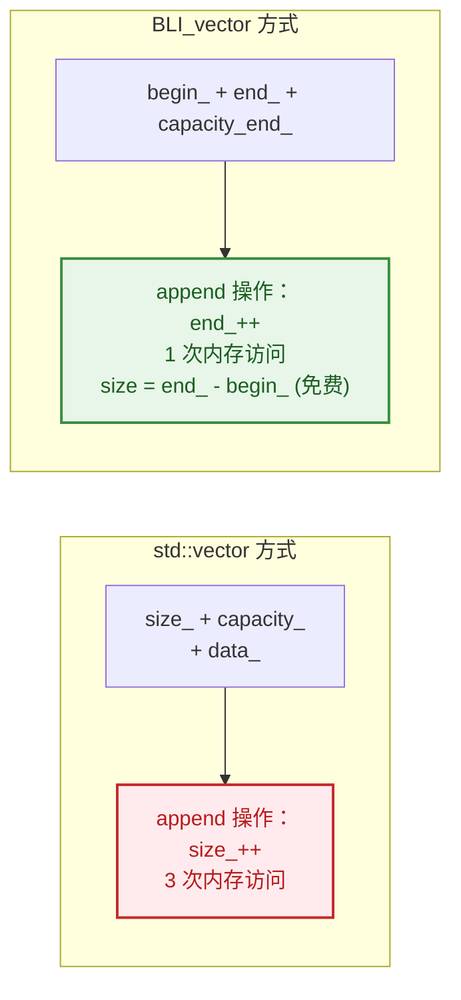

| 操作 | std::vector (size+capacity+data) | BLI_vector (3 pointers) |
|------|----------------------------------|-------------------------|
| `append` | 写 size_ + 可能 realloc | 写 end_ + 可能 realloc |
| `size()` | 读 size_ (1 次) | `end_ - begin_` (寄存器运算) |
| `empty()` | `size_ == 0` | `begin_ == end_` |
| `capacity()` | `capacity_` | `capacity_end_ - begin_` |

**关键洞察：** `size()` 和 `capacity()` 从内存读取变成了指针减法，这在 x86_64 上是一条 `sub` 指令，几乎零成本。

### 1.3 调试辅助：DEBUG 模式显式存储 size

```cpp
// BLI_vector.hh:105~115
/**
 * Store the size of the vector explicitly in debug builds. Otherwise you'd always have to call
 * the `size` function or do the math to compute it from the pointers manually. This is rather
 * annoying. Knowing the size of a vector is often quite essential when debugging some code.
 */
#ifndef NDEBUG
  int64_t debug_size_;
#  define UPDATE_VECTOR_SIZE(ptr) (ptr)->debug_size_ = int64_t((ptr)->end_ - (ptr)->begin_)
#else
#  define UPDATE_VECTOR_SIZE(ptr) ((void)0)
#endif
```

**注释翻译：** 在 debug 构建中显式存储向量的大小。否则你总是得调用 `size` 函数或手动从指针计算。这相当烦人。调试代码时，知道向量的大小通常很关键。

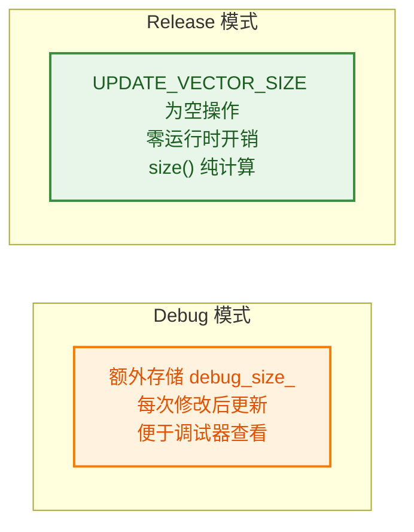

---

## 2️⃣ 小对象优化（SBO）详解

### 2.1 默认内联容量策略

```cpp
// BLI_memory_utils.hh:270~277
/**
 * Inline buffers for small-object-optimization should be disabled by default for large objects.
 * Otherwise we might get large unexpected allocations on the stack.
 */
constexpr int64_t default_inline_buffer_capacity(size_t element_size)
{
  return (int64_t(element_size) < 100) ? 4 : 0;
}
```

**注释翻译：** 小对象优化的内联缓冲区应该对大对象默认禁用。否则我们可能在栈上得到大的意外分配。

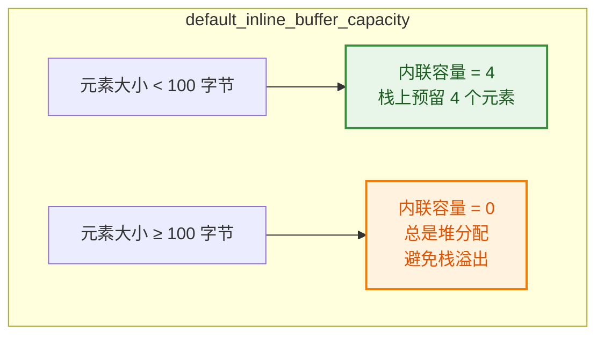

| 类型 | sizeof(T) | 默认内联容量 | 栈上预留内存 |
|------|-----------|-------------|-------------|
| `int` | 4 | 4 | 16 字节 |
| `float3` | 12 | 4 | 48 字节 |
| `std::string` | 32 | 4 | 128 字节 |
| `Vector<int>` (嵌套) | ~40 | 4 | ~160 字节 |
| `char[200]` | 200 | 0 | 0 字节（总是堆分配）|

### 2.2 状态切换：内联 → 堆

```mermaid
flowchart LR
    subgraph 状态机["Vector 状态机"]
        EMPTY["空状态<br/>begin_=end_=inline_buffer_<br/>capacity=InlineBufferCapacity"] -->|append x4| INLINE["内联状态<br/>数据在栈上"]
        INLINE -->|append (满)| HEAP["堆状态<br/>数据在堆上<br/>capacity *= 2"]
        HEAP -->|clear_and_shrink| EMPTY
    end

    style EMPTY fill:#e3f2fd,stroke:#1976d2,stroke-width:2px,color:#0d47a1
    style INLINE fill:#e8f5e9,stroke:#388e3c,stroke-width:2px,color:#1b5e20
    style HEAP fill:#fff3e0,stroke:#f57c00,stroke-width:2px,color:#e65100
```

### 2.3 增长策略：至少翻倍

```cpp
// BLI_vector.hh:1121~1151
BLI_NOINLINE void realloc_to_at_least(const int64_t min_capacity)
{
  if (this->capacity() >= min_capacity) {
    return;
  }

  /* At least double the size of the previous allocation. Otherwise consecutive calls to grow can
   * cause a reallocation every time even though min_capacity only increments. */
  const int64_t min_new_capacity = this->capacity() * 2;

  const int64_t new_capacity = std::max(min_capacity, min_new_capacity);
  const int64_t size = this->size();

  T *new_array = static_cast<T *>(
      allocator_.allocate(size_t(new_capacity) * sizeof(T), alignof(T), AT));
  try {
    uninitialized_relocate_n(begin_, size, new_array);
  }
  catch (...) {
    allocator_.deallocate(new_array);
    throw;
  }

  if (!this->is_inline()) {
    allocator_.deallocate(begin_);
  }

  begin_ = new_array;
  end_ = begin_ + size;
  capacity_end_ = begin_ + new_capacity;
}
```

**注释翻译：** 至少将之前分配的大小翻倍。否则连续的 grow 调用可能导致每次都重新分配，即使 min_capacity 只是递增。

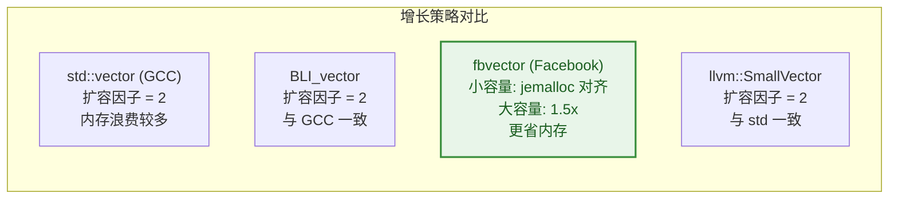

**增长序列对比（从 4 开始）：**

| 步骤 | std::vector (GCC) | BLI_vector | fbvector (大容量) |
|------|-------------------|------------|-------------------|
| 初始 | 4 | 4 | 4 |
| 第 1 次扩容 | 8 | 8 | 6 |
| 第 2 次扩容 | 16 | 16 | 9 |
| 第 3 次扩容 | 32 | 32 | 13 |
| 第 4 次扩容 | 64 | 64 | 19 |
| 累计元素 | 64 | 64 | 19 |
| 浪费内存 | ~50% | ~50% | ~25% |

**BLI_vector 选择 2x 的原因：**
- 简单可靠，摊销 O(1) 插入
- Blender 场景下向量通常不大（几何顶点数），浪费不严重
- 与 jemalloc 配合不如 fbvector 紧密

---

## 3️⃣ 构造与移动：SBO 的复杂性

### 3.1 移动构造：最复杂的操作

```cpp
// BLI_vector.hh:245~307
template<int64_t OtherInlineBufferCapacity>
Vector(Vector<T, OtherInlineBufferCapacity, Allocator> &&other) noexcept(
    is_nothrow_move_constructible())
    : Vector(NoExceptConstructor(), other.allocator_)
{
  if (other.is_inline()) {
    const int64_t size = other.size();

    /* Optimize the case by copying the full inline buffer. */
    constexpr bool other_is_same_type = std::is_same_v<Vector, std::decay_t<decltype(other)>>;
    constexpr size_t max_full_copy_size = 32;
    if constexpr (other_is_same_type && std::is_trivial_v<T> &&
                  sizeof(inline_buffer_) <= max_full_copy_size)
    {
      /* This check is technically optional. However, benchmarking shows that skipping work
       * for empty vectors (which is a common case) is worth the extra check even in the case
       * when the vector is not empty. */
      if (size > 0) {
        /* Copy the full inline buffer instead of only the used parts. This may copy
         * uninitialized values but allows producing more optimal code than when the copy size
         * would depend on a dynamic值. */
        memcpy(inline_buffer_, other.inline_buffer_, sizeof(inline_buffer_));
        this->increase_size_by_unchecked(size);
        /* Reset other vector. */
        other.end_ = other.inline_buffer_;
      }
    }
    else {
      /* ... element-wise move ... */
    }
  }
  else {
    /* Steal the pointer. */
    begin_ = other.begin_;
    end_ = other.end_;
    capacity_end_ = other.capacity_end_;

    /* Reset other vector. */
    other.begin_ = other.inline_buffer_;
    other.end_ = other.inline_buffer_;
    other.capacity_end_ = other.inline_buffer_ + OtherInlineBufferCapacity;
  }
}
```

**注释翻译：**
- 第 258~261 行：这个检查在技术上是可选的。然而，基准测试表明，跳过空向量的工作（这是常见情况）值得额外的检查，即使向量不为空。
- 第 263~265 行：复制整个内联缓冲区而不是仅复制已使用的部分。这可能会复制未初始化的值，但允许生成比复制大小依赖于动态值时更优化的代码。


**关键洞察：SBO 让移动构造复杂了 4 倍**

| 场景 | std::vector | BLI_vector |
|------|-------------|------------|
| 移动构造 | 偷指针，O(1) | 4 种情况，可能 O(n) |
| 迭代器有效性 | 移动后仍有效 | 移动后失效！ |

**为什么迭代器在移动后失效？**
- std::vector：移动只交换指针，数据位置不变
- BLI_vector：如果源是内联而目标也是内联，数据必须逐个 move 到新位置

### 3.2 异常安全：强异常保证

```cpp
// BLI_vector.hh:688~722 (insert 中的异常处理)
for (int64_t i = 0; i < move_amount; i++) {
  const int64_t src_index = insert_index + move_amount - i - 1;
  const int64_t dst_index = new_size - i - 1;
  try {
    new (static_cast<void *>(begin_ + dst_index)) T(std::move(begin_[src_index]));
  }
  catch (...) {
    /* Destruct all values that have been moved already. */
    destruct_n(begin_ + dst_index + 1, i);
    end_ = begin_ + src_index + 1;
    UPDATE_VECTOR_SIZE(this);
    throw;
  }
  begin_[src_index].~T();
}
```

**注释翻译：** 析构所有已经被移动的值。

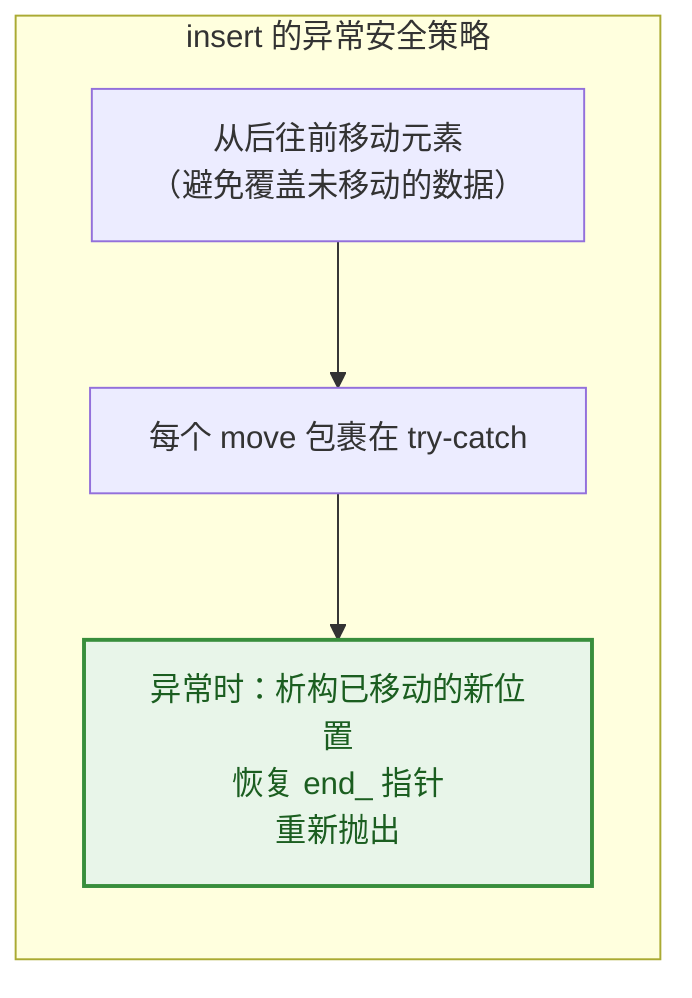

---

## 4️⃣ 分配器系统：Blender 的内存管理

### 4.1 GuardedAllocator

```cpp
// BLI_allocator.hh:37~64
/**
 * Use Blender's guarded allocator (aka MEM_*). This should always be used except there is a
 * good reason not to use it.
 */
class GuardedAllocator {
 public:
  void *allocate(size_t size, size_t alignment, const char *name)
  {
    return MEM_new_uninitialized_aligned(size, alignment, name);
  }
  void deallocate(void *ptr)
  {
    MEM_delete_void(ptr);
  }
};
```

**注释翻译：** 使用 Blender 的受保护分配器（即 MEM_*）。除非有充分理由不使用它，否则应该始终使用它。

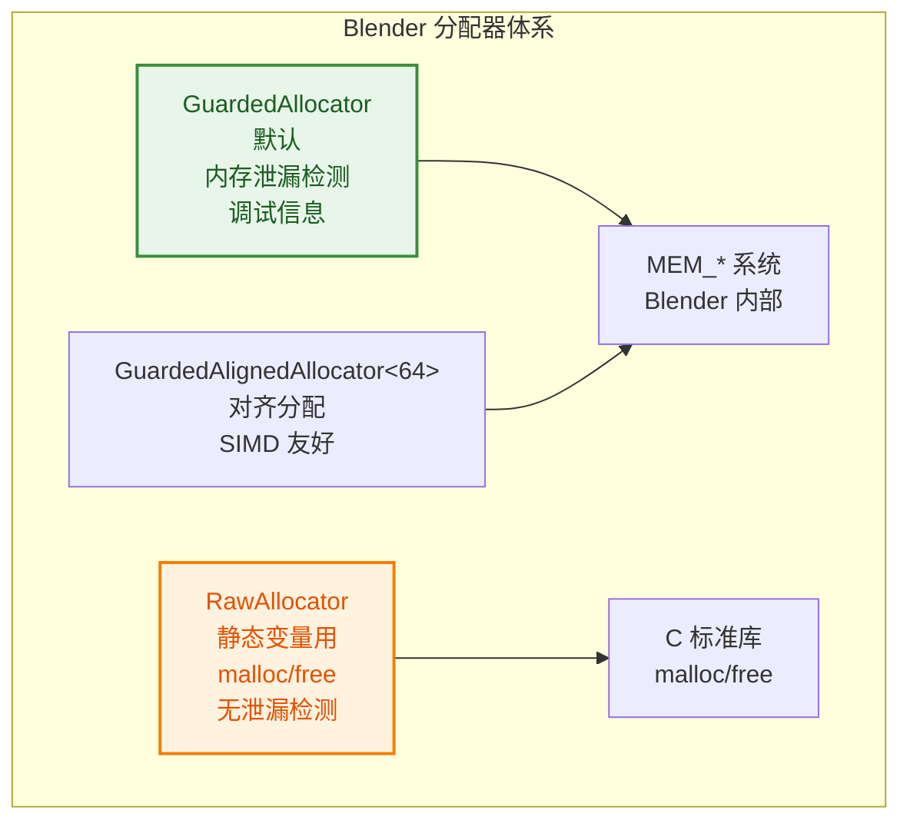

### 4.2 为什么不用 std::allocator？

```cpp
// BLI_allocator.hh:13~26
/**
 * An `Allocator` can allocate and deallocate memory. It is used by containers such as
 * Vector. The allocators defined in this file do not work with standard library
 * containers such as std::vector.
 *
 * We don't use the std::allocator interface, because it does more than is really necessary for an
 * allocator and has some other quirks. It mixes the concepts of allocation and construction. It is
 * essentially forced to be a template, even though the allocator should not care about the type.
 * Also see http://www.open-std.org/jtc1/sc22/wg21/docs/papers/2007/n2271.html#std_allocator.
 */
```

**注释翻译：** 我们不使用 std::allocator 接口，因为它做的比分配器真正需要的更多，还有一些其他怪癖。它混合了分配和构造的概念。即使分配器不应该关心类型，它本质上被迫成为模板。

| 特性 | std::allocator | Blender Allocator |
|------|---------------|-------------------|
| **接口** | `allocate(n)` + `construct(p, args)` | `allocate(size, alignment, name)` |
| **模板** | 必须是模板 | 非模板，类型无关 |
| **构造** | 混合分配和构造 | 纯分配，构造由容器控制 |
| **调试** | 无内置 | MEM_* 泄漏检测、命名 |
| **对齐** | 通过 `allocate(n, hint)` | 显式 `alignment` 参数 |

---

## 5️⃣ 与业界方案的全面对比

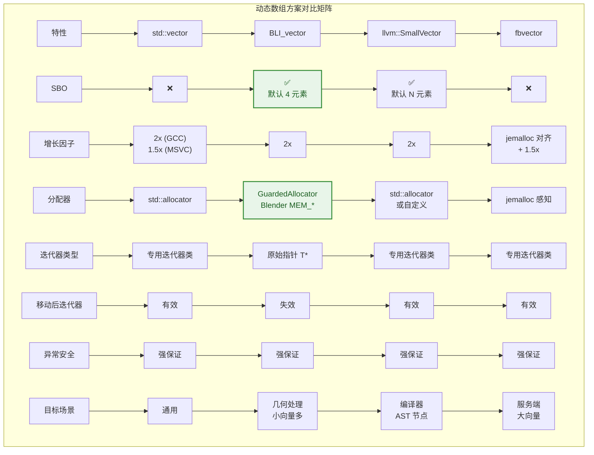

### 5.1 LLVM SmallVector 的 SBO 实现差异

```cpp
// LLVM SmallVector 伪代码
template<typename T, unsigned N>
class SmallVector {
    union {
        T inline_buffer[N];     // 内联存储
        T *heap_begin;          // 堆指针
    };
    T *end_;
    T *capacity_end_;
    bool is_inline_;            // 额外标志位
};
```

| 特性 | LLVM SmallVector | BLI_vector |
|------|------------------|------------|
| **内联检测** | `is_inline_` 标志位 | `begin_ == inline_buffer_` 指针比较 |
| **堆指针存储** | union 复用空间 | 始终三个指针 |
| **空基类优化** | 无 | `BLI_NO_UNIQUE_ADDRESS allocator_` |
| **默认内联大小** | 自动计算（约 64 字节对象） | 固定 4 元素（<100B 类型） |

**BLI_vector 的设计选择：**
- 不用 union：代码更简单，避免 union 的复杂规则
- 指针比较检测内联：不需要额外标志位，但多一次比较
- `BLI_NO_UNIQUE_ADDRESS`：C++20 属性，空分配器不占空间

### 5.2 fbvector 的 jemalloc 优化

```
fbvector 增长策略：
1. 小容量 (< 4KB): 按 jemalloc 大小类对齐
   - 请求 100 → 分配 128
   - 请求 500 → 分配 512
2. 大容量 (> 4KB): 1.5x 增长
   - 避免内存碎片
   - 允许原地 realloc
```

**为什么 BLI_vector 不做 jemalloc 优化？**
- Blender 跨平台（Windows/macOS/Linux），不总是用 jemalloc
- 几何处理场景下向量通常较小（顶点组、材质列表）
- 简单性优先，避免平台相关代码

---

## 6️⃣ 高级特性详解

### 6.1 `BLI_NO_UNIQUE_ADDRESS` - C++20 空基类优化

```cpp
// BLI_vector.hh:99~100
BLI_NO_UNIQUE_ADDRESS Allocator allocator_;
BLI_NO_UNIQUE_ADDRESS TypedBuffer<T, InlineBufferCapacity> inline_buffer_;
```

**语法解释：** `[[no_unique_address]]` 是 C++20 属性，告诉编译器：如果该成员是空类型（如 `GuardedAllocator` 无状态），可以与其他成员共享地址（不占额外空间）。

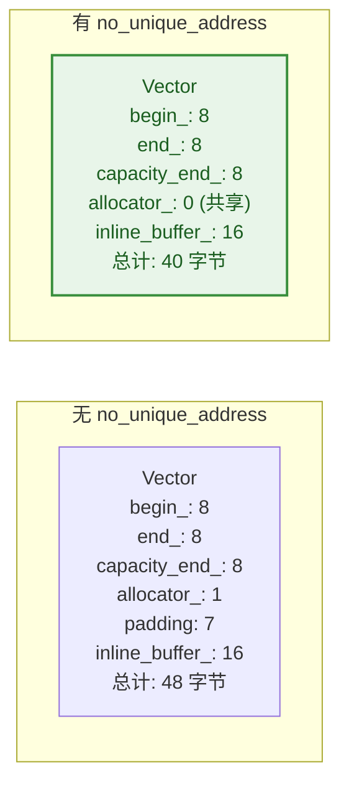

### 6.2 `TypedBuffer` - 类型安全的未初始化存储

```cpp
// BLI_memory_utils.hh:154~220
template<typename T, int64_t Size = 1> class TypedBuffer {
 private:
  static constexpr size_t get_size()
  {
    if constexpr (Size == 0) {
      return 0;
    }
    else {
      return sizeof(T) * size_t(Size);
    }
  }

  static constexpr size_t get_alignment()
  {
    if constexpr (Size == 0) {
      return 1;
    }
    else {
      return alignof(T);
    }
  }

  BLI_NO_UNIQUE_ADDRESS AlignedBuffer<get_size(), get_alignment()> buffer_;

 public:
  operator T *() { return static_cast<T *>(buffer_.ptr()); }
  operator const T *() const { return static_cast<const T *>(buffer_.ptr()); }
};
```

**设计精妙：**
- `Size == 0` 时：大小为 0，对齐为 1，不占空间（空基类优化生效）
- `Size > 0` 时：正确对齐，未初始化（不调用构造函数）
- 隐式转换到 `T*`：使用自然，像普通数组

### 6.3 `uninitialized_relocate_n` - 移动+析构一步完成

```cpp
// BLI_memory_utils.hh:74~84
template<typename T> void initialized_relocate_n(T *src, int64_t n, T *dst)
{
  initialized_move_n(src, n, dst);
  destruct_n(src, n);
}

template<typename T> void uninitialized_relocate_n(T *src, int64_t n, T *dst)
{
  uninitialized_move_n(src, n, dst);
  destruct_n(src, n);
}
```

** relocate 的含义：** 将元素从 `src` 移动到 `dst`，然后析构 `src` 处的原元素。这是 SBO 场景下的关键操作——当从内联缓冲搬到堆时，需要 relocate。

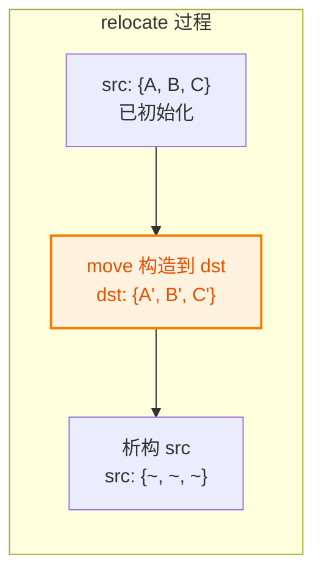

### 6.4 `copy_assign_container` / `move_assign_container` - 异常安全赋值

```cpp
// BLI_memory_utils.hh:284~322
template<typename Container> Container &copy_assign_container(Container &dst, const Container &src)
{
  if (&src == &dst) {
    return dst;
  }
  Container container_copy{src};   // 强异常保证的复制构造
  dst = std::move(container_copy); // noexcept 移动赋值
  return dst;
}

template<typename Container>
Container &move_assign_container(Container &dst, Container &&src) noexcept(...)
{
  if (&dst == &src) {
    return dst;
  }
  dst.~Container();                // 析构旧值
  new (&dst) Container(std::move(src));  //  placement new 移动构造
  return dst;
}
```

**设计模式：拷贝-交换惯用法（Copy-and-Swap Idiom）**

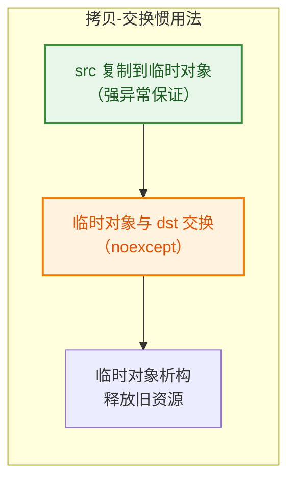

---

## 7️⃣ 使用模式与最佳实践

### 7.1 在 Blender 中的典型使用

```cpp
// 1. 默认构造（无分配）
Vector<int> numbers;  // 内联缓冲已就绪，size=0

// 2. 批量追加（预分配避免多次 realloc）
Vector<float3> positions;
positions.reserve(vertex_count);
for (const auto &v : vertices) {
    positions.append(v.position);
}

// 3. 从 Span 构造（零拷贝视图 → 复制到 Vector）
Span<int> indices = ...;
Vector<int> index_vec(indices);  // 复制数据

// 4. 转换为 Span（不复制，只创建视图）
Span<int> view = index_vec.as_span();

// 5. 快速删除（O(1) 但破坏顺序）
index_vec.remove_and_reorder(2);  // 用最后一个元素填补空洞

// 6. 保持顺序删除（O(n)）
index_vec.remove(2);  // 后面所有元素前移
```

### 7.2 与 Span 的互操作

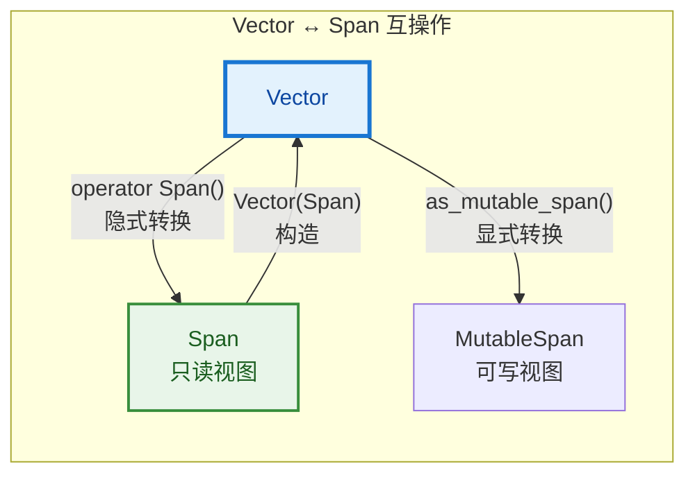

### 7.3 自定义内联容量

```cpp
// 知道最多 16 个元素，完全避免堆分配
Vector<int, 16> small_list;

// 大对象，禁用 SBO（避免栈上过大）
Vector<HeavyObject, 0> big_objects;

// 使用 RawAllocator（静态变量场景）
Vector<int, 4, RawAllocator> static_vector;
```

---

## 8️⃣ 设计评估：优劣总结

### 8.1 优势


### 8.2 劣势与权衡

| 劣势 | 说明 | 缓解方式 |
|------|------|----------|
| **移动后迭代器失效** | SBO 导致数据位置变化 | 文档说明，移动后重新获取迭代器 |
| **SBO 增加代码复杂度** | 移动构造 4 种情况 | 充分测试，benchmark 验证 |
| **增长因子固定 2x** | 不如 fbvector 内存高效 | 场景不同，Blender 向量通常不大 |
| **无 jemalloc 优化** | 无法原地 realloc | 跨平台需求，简单性优先 |
| **C++20 要求** | 需要较新编译器 | Blender 已迁移到 C++20 |
| **与 std 不兼容** | 不能直接用 STL 算法 | 提供 begin()/end()，大部分算法可用 |

### 8.3 复杂度总结

| 操作 | 时间复杂度 | 空间复杂度 | 备注 |
|------|-----------|-----------|------|
| 构造（空） | O(1) | O(1) | 无分配 |
| 构造（size） | O(n) | O(n) | default 构造 |
| `append` | O(1) 摊销 | O(1) | 可能触发 realloc |
| `append_unchecked` | O(1) | O(1) | 无边界检查 |
| `insert` | O(n) | O(n) | 强异常安全 |
| `remove` | O(n) | O(1) | 保持顺序 |
| `remove_and_reorder` | O(1) | O(1) | 不保持顺序 |
| `reserve` | O(n) | O(n) | 可能 realloc+relocate |
| `resize` | O(\|new-old\|) | O(n) | 构造/析构多余元素 |
| `clear` | O(n) | O(1) | 析构所有元素 |
| `clear_and_shrink` | O(n) | O(1) | 释放堆内存 |
| 移动构造 | O(1) 或 O(n) | O(1) | 堆→O(1)，内联→O(n) |
| 复制构造 | O(n) | O(n) | |

---

## 9️⃣ 你应该了解到什么程度？


| 层次 | 目标人群 | 需要掌握 |
|------|----------|----------|
| **L1 使用者** | 写 Blender 节点/工具 | `append`, `extend`, `as_span`, `is_empty` |
| **L2 进阶** | 优化性能瓶颈 | `reserve`, `append_unchecked`, SBO 状态判断 |
| **L3 贡献者** | 给 Blender 提交补丁 | 三指针布局、realloc、异常安全、relocate |
| **L4 设计者** | 设计新容器 | SBO 4 种移动场景、分配器设计、与 std 差异 |

---

## ✅ 总结

**BLI_vector 是 Blender 为几何处理场景量身定制的动态数组。** 它的核心设计决策：

1. **三指针布局**：`size()` 和 `capacity()` 零成本，append 指令更少
2. **小对象优化**：默认 4 元素内联，避免小向量堆分配（几何处理中极常见）
3. **Blender 分配器集成**：GuardedAllocator 提供内存泄漏检测和调试信息
4. **Span 生态统一**：与 Blender 的只读视图系统无缝互操作
5. **强异常安全**：insert/realloc 都有完整的异常回滚机制
6. **C++20 现代化**：concepts、no_unique_address、if constexpr

**与业界方案相比：**
- 比 `std::vector` 快（SBO + 三指针）
- 比 `llvm::SmallVector` 简单（无 union，指针比较检测内联）
- 不如 `fbvector` 内存高效（无 jemalloc 优化），但更简单跨平台

**如果你只记住一件事：** BLI_vector 用 **三指针** 换取了 `size()` 的零成本，用 **SBO** 换取了小向量的零分配，用 **Blender 分配器** 换取了内存调试能力。这三点是它存在的全部理由。

---

## 📁 相关文件

| 文件 | 路径 | 说明 |
|------|------|------|
| `BLI_vector.hh` | `source/blender/blenlib/` | 主头文件（1167 行） |
| `BLI_allocator.hh` | `source/blender/blenlib/` | 分配器系统 |
| `BLI_memory_utils.hh` | `source/blender/blenlib/` | relocate、construct、destruct 工具 |
| `BLI_span.hh` | `source/blender/blenlib/` | Span / MutableSpan |
| `BLI_array.hh` | `source/blender/blenlib/` | Array（固定大小，也含 SBO） |
| `BLI_vector_set.hh` | `source/blender/blenlib/` | VectorSet（有序唯一集合） |
| `BLI_stack.hh` | `source/blender/blenlib/` | Stack（基于 Vector） |
| `BLI_map.hh` | `source/blender/blenlib/` | Map（基于 Vector 的开放寻址） |
| `BLI_set.hh` | `source/blender/blenlib/` | Set（基于 Vector 的开放寻址） |
