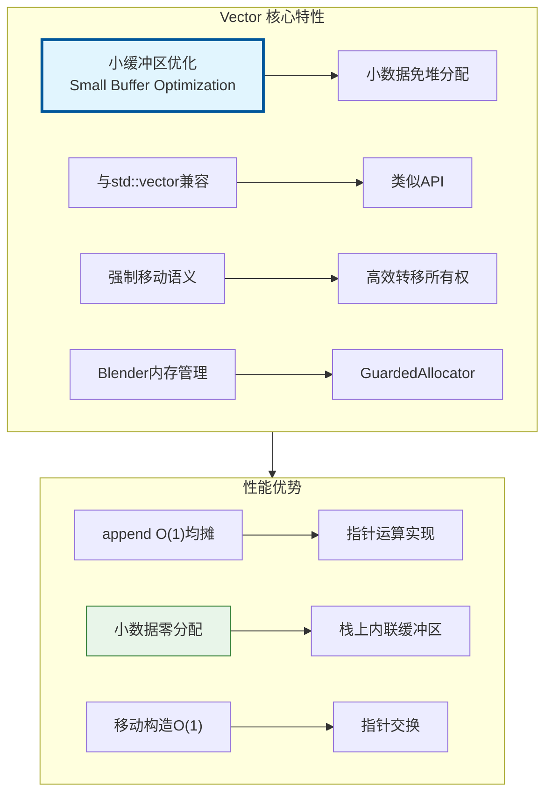
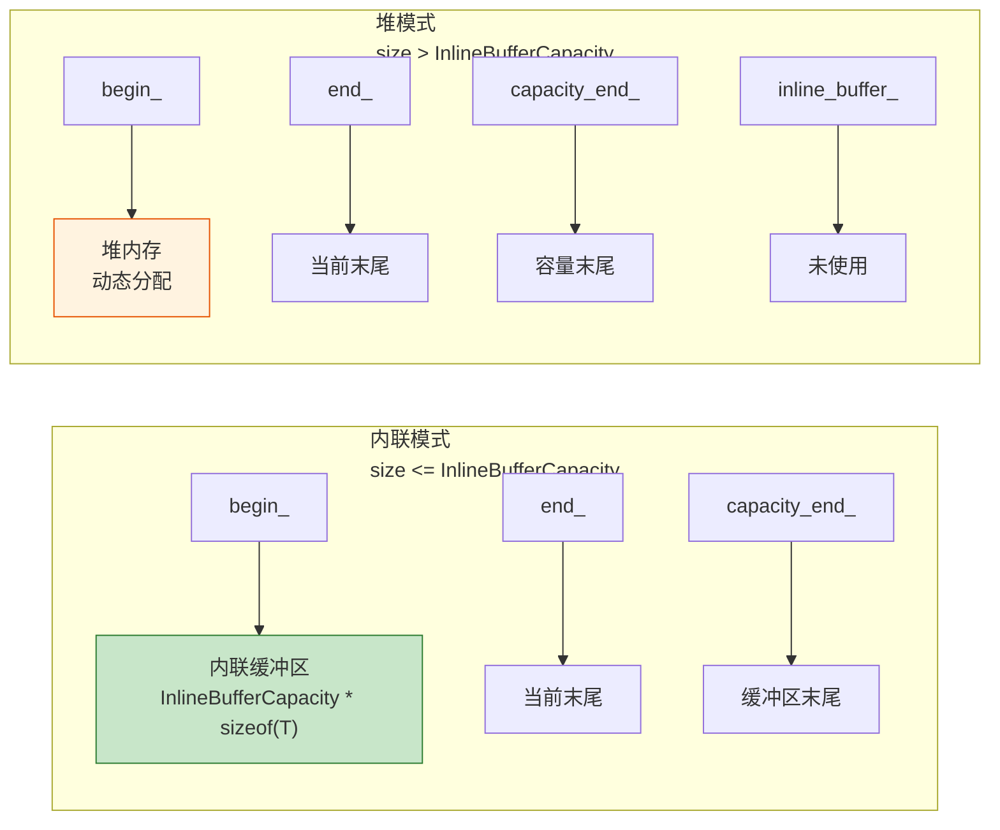
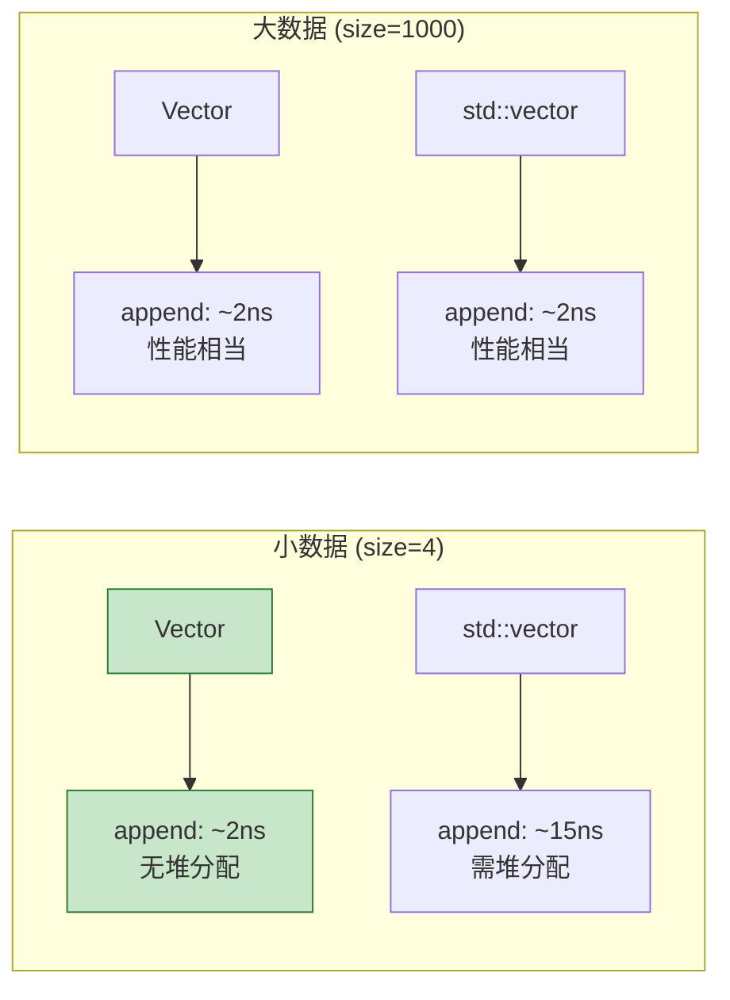

# Vector<T> - 动态数组

> Blender 的 `Vector<T>` 是 `std::vector` 的高性能替代品，支持小缓冲区优化(SBO)

---

## 🎯 核心特性



---

## 📦 内存布局



### 默认内联缓冲区大小

```cpp
// 根据类型大小自动选择
sizeof(T) <= 16  → InlineBufferCapacity = 4
sizeof(T) > 16   → InlineBufferCapacity = 0 (禁用SBO)

// 手动指定
template<typename T, int64_t InlineBufferCapacity = 4>
class Vector { ... };
```

---

## 🚀 常用操作

### 构造

```cpp
#include "BLI_vector.hh"

namespace blender::nodes {

void vector_construct_examples() {
    // 1. 默认构造 - 无分配
    Vector<int> vec1;  // begin_=end_=capacity_end_=inline_buffer_
    
    // 2. 指定大小 - 默认初始化
    Vector<float> vec2(100);  // 100个float，默认初始化为0
    
    // 3. 指定大小和初始值
    Vector<int> vec3(10, 42);  // 10个42
    
    // 4. 从 Span 构造
    Array<float> arr(10);
    Vector<float> vec4(arr);  // 拷贝构造
    
    // 5. 初始化列表
    Vector<int> vec5 = {1, 2, 3, 4, 5};
    
    // 6. 指定内联缓冲区大小
    Vector<float3, 16> positions;  // 16个float3在栈上
    
    // 7. 迭代器范围
    std::vector<int> std_vec = {1, 2, 3};
    Vector<int> vec6(std_vec.begin(), std_vec.end());
}

} // namespace blender::nodes
```

### 添加元素

```cpp
void vector_append_examples() {
    Vector<float3> positions;
    
    // 1. append - 拷贝
    float3 pos1(1, 2, 3);
    positions.append(pos1);
    
    // 2. append - 移动
    positions.append(float3(4, 5, 6));
    
    // 3. append_as - 原地构造
    positions.append_as(7.0f, 8.0f, 9.0f);
    
    // 4. extend - 批量添加
    Vector<float3> more = {{10, 11, 12}, {13, 14, 15}};
    positions.extend(more);
    
    // 5. extend - 从初始化列表
    positions.extend({{16, 17, 18}, {19, 20, 21}});
    
    // 6. insert - 指定位置
    positions.insert(0, float3(0, 0, 0));  // 在开头插入
}
```

### 访问元素

```cpp
void vector_access_examples() {
    Vector<int> vec = {10, 20, 30, 40, 50};
    
    // 1. 索引访问
    int first = vec[0];      // 10
    int last = vec[4];       // 50
    
    // 2. 安全访问（带边界检查）
    int val = vec.first();   // 10
    int lst = vec.last();    // 50
    
    // 3. 指针访问
    const int *data = vec.data();
    int third = data[2];     // 30
    
    // 4. 迭代器
    for (int value : vec) {
        // 遍历: 10, 20, 30, 40, 50
    }
    
    // 5. 反向迭代
    for (auto it = vec.rbegin(); it != vec.rend(); ++it) {
        // 遍历: 50, 40, 30, 20, 10
    }
    
    // 6. 索引范围遍历
    for (int64_t i : vec.index_range()) {
        vec[i] *= 2;  // 修改每个元素
    }
}
```

### 删除元素

```cpp
void vector_remove_examples() {
    Vector<int> vec = {1, 2, 3, 4, 5};
    
    // 1. pop_last - 删除最后一个
    vec.pop_last();  // {1, 2, 3, 4}
    
    // 2. remove - 删除指定位置（保持顺序）
    vec.remove(1);   // {1, 3, 4} - O(n)，移动后续元素
    
    // 3. remove_and_reorder - 快速删除（不保持顺序）
    vec.remove_and_reorder(0);  // {4, 3} - O(1)，与最后一个交换
    
    // 4. clear - 清空
    vec.clear();  // size = 0，容量不变
    
    // 5. resize - 改变大小
    vec.resize(10);        // 扩展到10个元素
    vec.resize(5, 42);     // 缩小到5个，新元素为42
}
```

---

## 🎨 高级用法

### 与 Span 互操作

```cpp
void vector_span_interop() {
    Vector<float3> vec = {{1, 2, 3}, {4, 5, 6}};
    
    // Vector → Span（只读）
    Span<float3> span = vec;
    
    // Vector → MutableSpan（可写）
    MutableSpan<float3> mspan = vec.as_mutable_span();
    mspan[0] = float3(0, 0, 0);  // 修改原Vector
    
    // Span → Vector（拷贝）
    Span<float3> some_span = get_positions();
    Vector<float3> copy(some_span);  // 拷贝构造
}
```

### 内存管理

```cpp
void vector_memory_examples() {
    Vector<int> vec;
    
    // 预分配空间
    vec.reserve(1000);  // 容量至少为1000
    
    // 收缩到合适大小
    vec.reserve(100);
    for (int i = 0; i < 100; i++) vec.append(i);
    vec.shrink_to_fit();  // 释放多余容量
    
    // 获取容量
    int64_t cap = vec.capacity();
    int64_t size = vec.size();
    bool is_inline = vec.is_inline();  // 是否在栈上
    
    // 释放所有权
    VectorData<int, GuardedAllocator> data = vec.release();
    // vec 现在为空
    MEM_freeN(data.data);  // 手动释放
    
    // 从原始数据构造
    int *raw_data = static_cast<int *>(MEM_mallocN(sizeof(int) * 10, __func__));
    Vector<int> vec2 = Vector<int>::from_raw(raw_data, 10, 10);
}
```

### 算法操作

```cpp
void vector_algorithm_examples() {
    Vector<int> vec = {3, 1, 4, 1, 5, 9, 2, 6};
    
    // 排序
    vec.sort();  // 升序: 1, 1, 2, 3, 4, 5, 6, 9
    vec.sort(std::greater<int>());  // 降序
    
    // 去重（需要先排序）
    vec.sort();
    vec.remove_duplicates();  // 1, 2, 3, 4, 5, 6, 9
    
    // 二分查找（需要已排序）
    auto it = vec.find_sorted(4);  // 返回迭代器
    bool exists = vec.contains_sorted(4);
    
    // 线性查找
    int64_t index = vec.first_index_of(5);  // 返回索引
    bool has = vec.contains(5);
}
```

---

## ⚡ 性能对比



### 性能建议

| 场景 | 建议 |
|-----|------|
| 小数组频繁创建 | 使用默认 InlineBufferCapacity |
| 大数组已知大小 | 先 `reserve` 再添加 |
| 函数参数 | 使用 `Span<T>` 或 `const Vector &` |
| 函数返回值 | 直接返回 `Vector<T>`（移动语义） |
| 删除元素 | 不需要顺序用 `remove_and_reorder` |

---

## 🎯 节点开发中的典型用法

### 收集结果

```cpp
static void node_geo_exec(GeoNodeExecParams params)
{
    GeometrySet geometry = params.extract_input<GeometrySet>("Geometry"_ustr);
    
    // 收集所有顶点位置
    Vector<float3> all_positions;
    
    if (const Mesh *mesh = geometry.get_mesh()) {
        Span<float3> positions = mesh->vert_positions();
        all_positions.extend(positions);  // 批量添加
    }
    if (const PointCloud *pc = geometry.get_pointcloud()) {
        all_positions.extend(pc->positions());
    }
    
    // 处理 all_positions ...
}
```

### 批量构造

```cpp
// 生成网格顶点
static Vector<float3> generate_grid_vertices(int x_count, int y_count)
{
    Vector<float3> vertices;
    vertices.reserve(x_count * y_count);  // 预分配
    
    for (int y : IndexRange(y_count)) {
        for (int x : IndexRange(x_count)) {
            vertices.append_as(float(x), float(y), 0.0f);
        }
    }
    
    return vertices;  // 移动返回，无拷贝
}
```

---

## ✅ 检查清单

- [ ] 理解小缓冲区优化(SBO)原理
- [ ] 掌握 `append` vs `append_as` 区别
- [ ] 会用 `extend` 批量添加
- [ ] 理解 `remove` vs `remove_and_reorder` 性能差异
- [ ] 掌握与 `Span` 的互操作
- [ ] 了解预分配 `reserve` 的重要性

---

## 📁 相关文件

| 文件 | 路径 |
|-----|------|
| BLI_vector.hh | `source/blender/blenlib/BLI_vector.hh` |
| 测试文件 | `source/blender/blenlib/tests/BLI_vector_test.cc` |

---

## 🔗 相关文档

- [02_Span.md](02_Span.md) - 非拥有视图
- [03_Array.md](03_Array.md) - 固定大小数组
