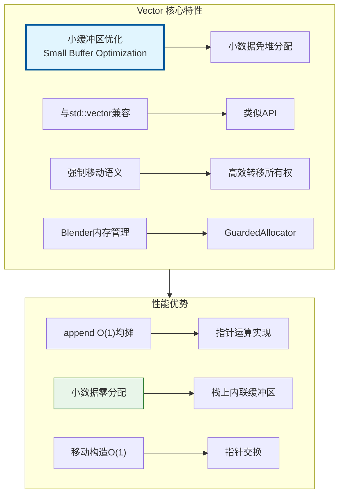
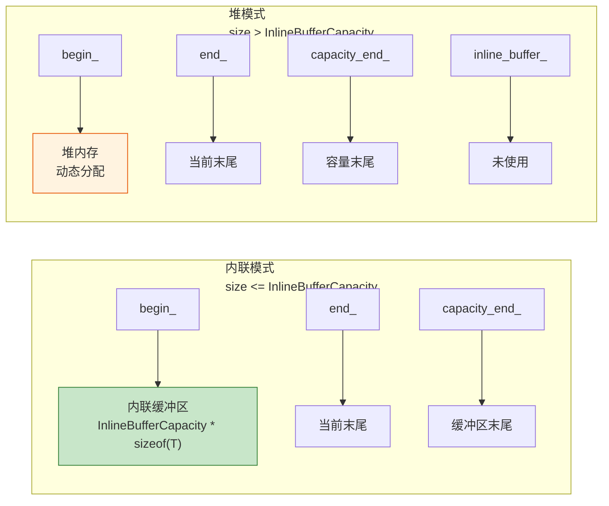
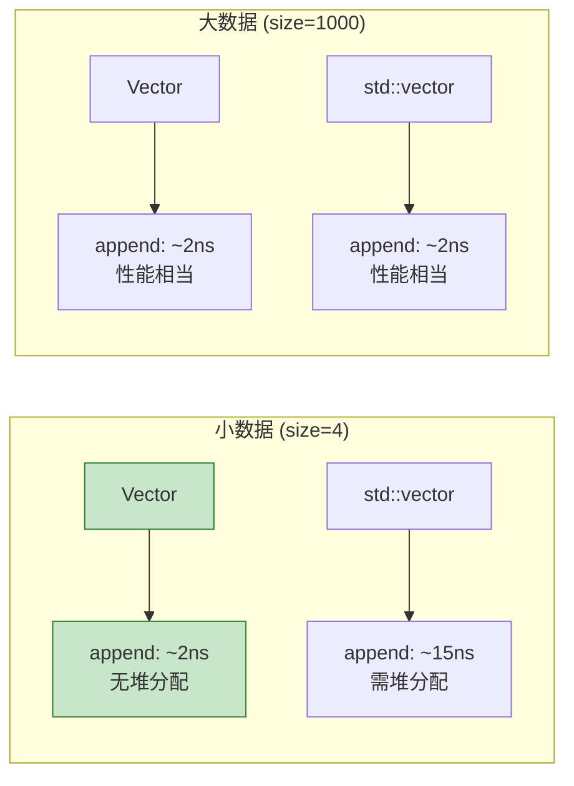

# Vector<T> - 动态数组

> Blender 的 `Vector<T>` 是 `std::vector` 的高性能替代品，支持小缓冲区优化(SBO)

---

## 📖 源码注释翻译与解释

### 文件头注释 (BLI_vector.hh:7~25)

> **原文注释：**
> ```cpp
> /** \file
>  * \ingroup bli
>  *
>  * A `Vector<T>` is a dynamically growing contiguous array for values of type T. It is
>  * designed to be a more convenient and efficient replacement for `std::vector`. Note that the term
>  * "vector" has nothing to do with a vector from computer graphics here.
>  *
>  * A vector supports efficient insertion and removal at the end (O(1) amortized). Removal in other
>  * places takes O(n) time, because all elements afterwards have to be moved. If the order of
>  * elements is not important, `remove_and_reorder` can be used instead of `remove` for better
>  * performance.
>  *
>  * The improved efficiency is mainly achieved by supporting small buffer optimization. As long as
>  * the number of elements in the vector does not become larger than InlineBufferCapacity, no memory
>  * allocation is done. As a consequence, iterators are invalidated when a Vector is moved
>  * (iterators of std::vector remain valid when the vector is moved).
>  *
>  * `Vector` should be your default choice for a vector data structure in Blender.
>  */
> ```

**中文翻译与详细解释：**

| 段落 | 翻译 | 关键要点 |
|------|------|----------|
| **核心定义** | `Vector<T>` 是一个动态增长的连续数组，用于存储类型 T 的值。它被设计为 `std::vector` 的更方便、更高效的替代品。注意这里的术语 "vector" 与计算机图形学中的向量无关。 | 1. 动态增长<br>2. 连续内存<br>3. 与数学向量区分 |
| **操作复杂度** | 向量支持在末尾高效插入和删除（O(1) 均摊）。在其他位置删除需要 O(n) 时间，因为之后所有元素都必须移动。如果元素顺序不重要，可以使用 `remove_and_reorder` 代替 `remove` 以获得更好的性能。 | 1. 尾部操作 O(1)<br>2. 中间删除 O(n)<br>3. `remove_and_reorder` 优化 |
| **小缓冲区优化** | 效率提升主要通过支持小缓冲区优化实现。只要向量中的元素数量不超过 InlineBufferCapacity，就不进行内存分配。因此，当 Vector 被移动时迭代器会失效（而 std::vector 被移动时迭代器保持有效）。 | 1. SBO 免堆分配<br>2. 移动使迭代器失效<br>3. 与 std::vector 行为不同 |
| **使用建议** | `Vector` 应该是你在 Blender 中使用的默认向量数据结构。 | 推荐作为默认选择 |

### VectorData 结构注释 (BLI_vector.hh:46~55)

> **原文：**
> ```cpp
> /**
>  * This is used in #Vector::from_raw and #Vector::release to transfer ownership of the underlying
>  * data-array into and out of the #Vector. Note that this struct does not do any memory management.
>  */
> template<typename T, typename Allocator> struct VectorData {
>   T *data = nullptr;
>   int64_t size = 0;
>   int64_t capacity = 0;
>   BLI_NO_UNIQUE_ADDRESS Allocator allocator;
> };
> ```

**翻译：** 这在 `Vector::from_raw` 和 `Vector::release` 中使用，用于将底层数据数组的所有权转入和转出 `Vector`。注意这个结构体不进行任何内存管理。

**用途：**
- `from_raw`: 从原始数据构造 Vector（接管所有权）
- `release`: 释放 Vector 的数据（转移所有权出去）

### 模板参数注释 (BLI_vector.hh:57~75)

> **原文：**
> ```cpp
> template<
>     /**
>      * Type of the values stored in this vector. It has to be movable.
>      */
>     typename T,
>     /**
>      * The number of values that can be stored in this vector, without doing a heap allocation.
>      * Sometimes it makes sense to increase this value a lot. The memory in the inline buffer is
>      * not initialized when it is not needed.
>      *
>      * When T is large, the small buffer optimization is disabled by default to避免 large
>      * unexpected allocations on the stack. It can still be enabled explicitly though.
>      */
>     int64_t InlineBufferCapacity = default_inline_buffer_capacity(sizeof(T)),
>     /**
>      * The allocator used by this vector. Should rarely be changed, except when you don't want that
>      * MEM_* is used internally.
>      */
>     typename Allocator = GuardedAllocator>
> class Vector {
> ```

**参数说明：**

| 参数 | 默认值 | 说明 |
|------|--------|------|
| `T` | - | 存储值类型，必须是可移动的 |
| `InlineBufferCapacity` | 根据 sizeof(T) 计算 | 内联缓冲区可容纳的元素数，不进行堆分配 |
| `Allocator` | `GuardedAllocator` | 使用的分配器，很少需要修改 |

**InlineBufferCapacity 策略：**
- 小类型（如 int, float）：默认 4 或更多
- 大类型：默认 0（禁用 SBO，避免栈上意外大分配）
- 可显式指定，如 `Vector<int, 16>`

### 成员变量注释 (BLI_vector.hh:88~100)

> **原文：**
> ```cpp
> private:
>   /**
>    * Use pointers instead of storing the size explicitly. This reduces the number of instructions
>    * in `append`.
>    *
>    * The pointers might point to the memory in the inline buffer.
>    */
>   T *begin_;
>   T *end_;
>   T *capacity_end_;
>
>   /** Used for allocations when the inline buffer is too small. */
>   BLI_NO_UNIQUE_ADDRESS Allocator allocator_;
> ```

**翻译：**

**指针设计：**
- 使用指针而不是显式存储大小，这减少了 `append` 中的指令数
- 指针可能指向内联缓冲区中的内存

**成员说明：**

| 成员 | 类型 | 含义 |
|------|------|------|
| `begin_` | `T*` | 指向第一个元素 |
| `end_` | `T*` | 指向最后一个元素之后的位置（size = end_ - begin_）|
| `capacity_end_` | `T*` | 指向容量末尾（capacity = capacity_end_ - begin_）|
| `allocator_` | `Allocator` | 分配器，内联缓冲区不足时使用 |

**为什么用指针而非 size？**

```cpp
// 使用指针（Blender Vector）
void append(const T &value) {
    if (end_ < capacity_end_) {
        *end_ = value;
        ++end_;
    } else {
        grow_and_append(value);
    }
}

// 使用 size（传统实现）
void append(const T &value) {
    if (size_ < capacity_) {
        data_[size_] = value;
        ++size_;
    } else {
        grow_and_append(value);
    }
}
```

指针版本在某些架构上可能更高效，因为避免了额外的加法运算。

---

## 🎯 核心特性



---

## 📦 内存布局



### 默认内联缓冲区大小

```cpp
// 根据类型大小自动选择
sizeof(T) <= 16  → InlineBufferCapacity = 4
sizeof(T) > 16   → InlineBufferCapacity = 0 (禁用SBO)

// 手动指定
template<typename T, int64_t InlineBufferCapacity = 4>
class Vector { ... };
```

---

## 🚀 常用操作

### 构造

```cpp
#include "BLI_vector.hh"

namespace blender::nodes {

void vector_construct_examples() {
    // 1. 默认构造 - 无分配
    Vector<int> vec1;  // begin_=end_=capacity_end_=inline_buffer_
    
    // 2. 指定大小 - 默认初始化
    Vector<float> vec2(100);  // 100个float，默认初始化为0
    
    // 3. 指定大小和初始值
    Vector<int> vec3(10, 42);  // 10个42
    
    // 4. 从 Span 构造
    Array<float> arr(10);
    Vector<float> vec4(arr);  // 拷贝构造
    
    // 5. 初始化列表
    Vector<int> vec5 = {1, 2, 3, 4, 5};
    
    // 6. 指定内联缓冲区大小
    Vector<float3, 16> positions;  // 16个float3在栈上
    
    // 7. 迭代器范围
    std::vector<int> std_vec = {1, 2, 3};
    Vector<int> vec6(std_vec.begin(), std_vec.end());
}

} // namespace blender::nodes
```

### 添加元素

```cpp
void vector_append_examples() {
    Vector<float3> positions;
    
    // 1. append - 拷贝
    float3 pos1(1, 2, 3);
    positions.append(pos1);
    
    // 2. append - 移动
    positions.append(float3(4, 5, 6));
    
    // 3. append_as - 原地构造
    positions.append_as(7.0f, 8.0f, 9.0f);
    
    // 4. extend - 批量添加
    Vector<float3> more = {{10, 11, 12}, {13, 14, 15}};
    positions.extend(more);
    
    // 5. extend - 从初始化列表
    positions.extend({{16, 17, 18}, {19, 20, 21}});
    
    // 6. insert - 指定位置
    positions.insert(0, float3(0, 0, 0));  // 在开头插入
}
```

### 访问元素

```cpp
void vector_access_examples() {
    Vector<int> vec = {10, 20, 30, 40, 50};
    
    // 1. 索引访问
    int first = vec[0];      // 10
    int last = vec[4];       // 50
    
    // 2. 安全访问（带边界检查）
    int val = vec.first();   // 10
    int lst = vec.last();    // 50
    
    // 3. 指针访问
    const int *data = vec.data();
    int third = data[2];     // 30
    
    // 4. 迭代器
    for (int value : vec) {
        // 遍历: 10, 20, 30, 40, 50
    }
    
    // 5. 反向迭代
    for (auto it = vec.rbegin(); it != vec.rend(); ++it) {
        // 遍历: 50, 40, 30, 20, 10
    }
    
    // 6. 索引范围遍历
    for (int64_t i : vec.index_range()) {
        vec[i] *= 2;  // 修改每个元素
    }
}
```

### 删除元素

```cpp
void vector_remove_examples() {
    Vector<int> vec = {1, 2, 3, 4, 5};
    
    // 1. pop_last - 删除最后一个
    vec.pop_last();  // {1, 2, 3, 4}
    
    // 2. remove - 删除指定位置（保持顺序）
    vec.remove(1);   // {1, 3, 4} - O(n)，移动后续元素
    
    // 3. remove_and_reorder - 快速删除（不保持顺序）
    vec.remove_and_reorder(0);  // {4, 3} - O(1)，与最后一个交换
    
    // 4. clear - 清空
    vec.clear();  // size = 0，容量不变
    
    // 5. resize - 改变大小
    vec.resize(10);        // 扩展到10个元素
    vec.resize(5, 42);     // 缩小到5个，新元素为42
}
```

---

## 🎨 高级用法

### 与 Span 互操作

```cpp
void vector_span_interop() {
    Vector<float3> vec = {{1, 2, 3}, {4, 5, 6}};
    
    // Vector → Span（只读）
    Span<float3> span = vec;
    
    // Vector → MutableSpan（可写）
    MutableSpan<float3> mspan = vec.as_mutable_span();
    mspan[0] = float3(0, 0, 0);  // 修改原Vector
    
    // Span → Vector（拷贝）
    Span<float3> some_span = get_positions();
    Vector<float3> copy(some_span);  // 拷贝构造
}
```

### 内存管理

```cpp
void vector_memory_examples() {
    Vector<int> vec;
    
    // 预分配空间
    vec.reserve(1000);  // 容量至少为1000
    
    // 收缩到合适大小
    vec.reserve(100);
    for (int i = 0; i < 100; i++) vec.append(i);
    vec.shrink_to_fit();  // 释放多余容量
    
    // 获取容量
    int64_t cap = vec.capacity();
    int64_t size = vec.size();
    bool is_inline = vec.is_inline();  // 是否在栈上
    
    // 释放所有权
    VectorData<int, GuardedAllocator> data = vec.release();
    // vec 现在为空
    MEM_freeN(data.data);  // 手动释放
    
    // 从原始数据构造
    int *raw_data = static_cast<int *>(MEM_mallocN(sizeof(int) * 10, __func__));
    Vector<int> vec2 = Vector<int>::from_raw(raw_data, 10, 10);
}
```

### 算法操作

```cpp
void vector_algorithm_examples() {
    Vector<int> vec = {3, 1, 4, 1, 5, 9, 2, 6};
    
    // 排序
    vec.sort();  // 升序: 1, 1, 2, 3, 4, 5, 6, 9
    vec.sort(std::greater<int>());  // 降序
    
    // 去重（需要先排序）
    vec.sort();
    vec.remove_duplicates();  // 1, 2, 3, 4, 5, 6, 9
    
    // 二分查找（需要已排序）
    auto it = vec.find_sorted(4);  // 返回迭代器
    bool exists = vec.contains_sorted(4);
    
    // 线性查找
    int64_t index = vec.first_index_of(5);  // 返回索引
    bool has = vec.contains(5);
}
```

---

## ⚡ 性能对比



### 性能建议

| 场景 | 建议 |
|-----|------|
| 小数组频繁创建 | 使用默认 InlineBufferCapacity |
| 大数组已知大小 | 先 `reserve` 再添加 |
| 函数参数 | 使用 `Span<T>` 或 `const Vector &` |
| 函数返回值 | 直接返回 `Vector<T>`（移动语义） |
| 删除元素 | 不需要顺序用 `remove_and_reorder` |

---

## 🎯 节点开发中的典型用法

### 收集结果

```cpp
static void node_geo_exec(GeoNodeExecParams params)
{
    GeometrySet geometry = params.extract_input<GeometrySet>("Geometry"_ustr);
    
    // 收集所有顶点位置
    Vector<float3> all_positions;
    
    if (const Mesh *mesh = geometry.get_mesh()) {
        Span<float3> positions = mesh->vert_positions();
        all_positions.extend(positions);  // 批量添加
    }
    if (const PointCloud *pc = geometry.get_pointcloud()) {
        all_positions.extend(pc->positions());
    }
    
    // 处理 all_positions ...
}
```

### 批量构造

```cpp
// 生成网格顶点
static Vector<float3> generate_grid_vertices(int x_count, int y_count)
{
    Vector<float3> vertices;
    vertices.reserve(x_count * y_count);  // 预分配
    
    for (int y : IndexRange(y_count)) {
        for (int x : IndexRange(x_count)) {
            vertices.append_as(float(x), float(y), 0.0f);
        }
    }
    
    return vertices;  // 移动返回，无拷贝
}
```

---

## ✅ 检查清单

- [ ] 理解小缓冲区优化(SBO)原理
- [ ] 掌握 `append` vs `append_as` 区别
- [ ] 会用 `extend` 批量添加
- [ ] 理解 `remove` vs `remove_and_reorder` 性能差异
- [ ] 掌握与 `Span` 的互操作
- [ ] 了解预分配 `reserve` 的重要性

---

## 📁 相关文件

| 文件 | 路径 |
|-----|------|
| BLI_vector.hh | `source/blender/blenlib/BLI_vector.hh` |
| 测试文件 | `source/blender/blenlib/tests/BLI_vector_test.cc` |

---

## 🔗 相关文档

- [02_Span.md](02_Span.md) - 非拥有视图
- [03_Array.md](03_Array.md) - 固定大小数组
