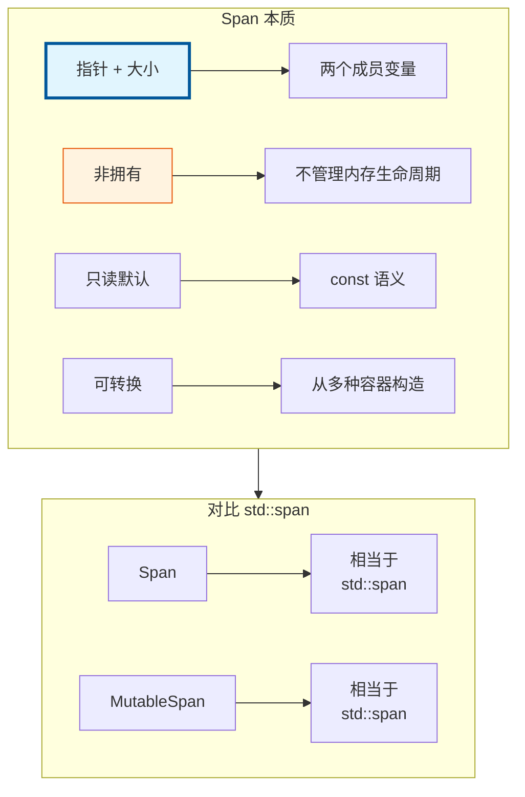
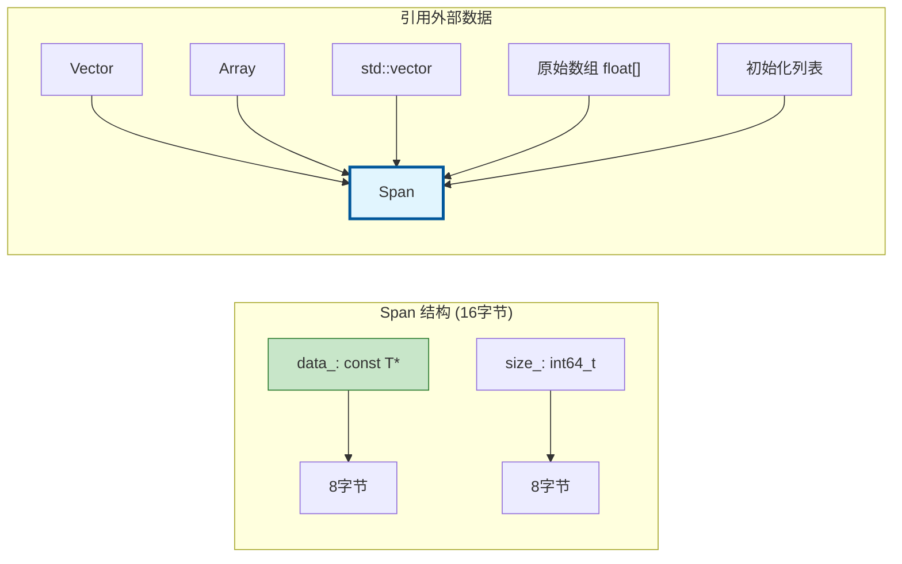
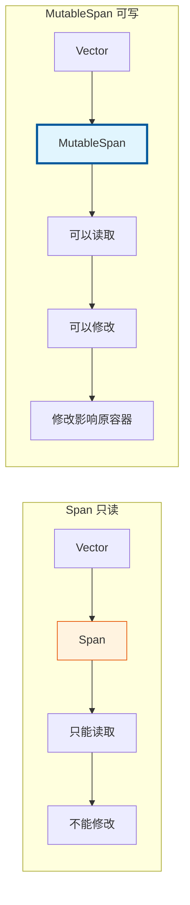
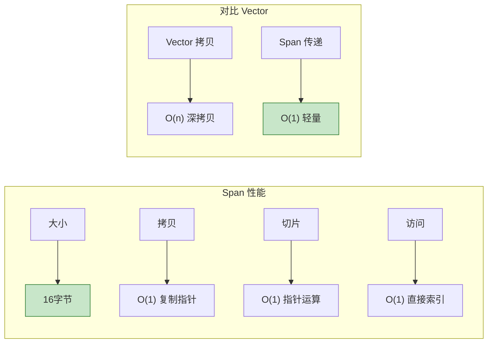
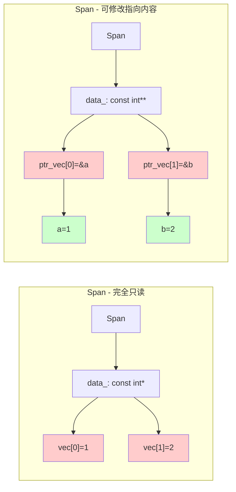
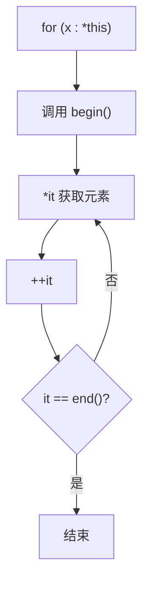
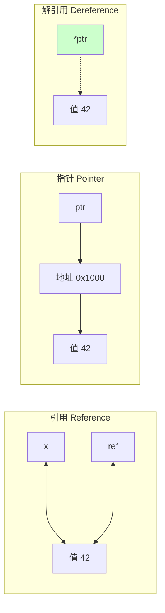

# Span<T> / MutableSpan<T> - 非拥有视图
- [Span / MutableSpan - 非拥有视图](#span--mutablespan---非拥有视图)
  - [📖 源码注释翻译与解释](#-源码注释翻译与解释)
    - [文件头注释 (BLI\_span.hh:7~57)](#文件头注释-bli_spanhh757)
    - [类注释 (BLI\_span.hh:70~72)](#类注释-bli_spanhh7072)
    - [构造函数注释](#构造函数注释)
      - [默认构造 (BLI\_span.hh:89~92)](#默认构造-bli_spanhh8992)
      - [初始化列表构造 (BLI\_span.hh:107~120)](#初始化列表构造-bli_spanhh107120)
    - [切片方法注释](#切片方法注释)
      - [slice (BLI\_span.hh:137~147)](#slice-bli_spanhh137147)
      - [slice\_safe (BLI\_span.hh:154~164)](#slice_safe-bli_spanhh154164)
      - [drop\_front (BLI\_span.hh:171~180)](#drop_front-bli_spanhh171180)
      - [drop\_back (BLI\_span.hh:182~191)](#drop_back-bli_spanhh182191)
      - [take\_front (BLI\_span.hh:193~202)](#take_front-bli_spanhh193202)
      - [take\_back (BLI\_span.hh:204~213)](#take_back-bli_spanhh204213)
    - [数据访问注释](#数据访问注释)
      - [data() (BLI\_span.hh:215~222)](#data-bli_spanhh215222)
  - [🎯 核心概念](#-核心概念)
  - [📦 内存布局](#-内存布局)
  - [🚀 基础用法](#-基础用法)
    - [构造](#构造)
    - [访问元素](#访问元素)
  - [✂️ 切片操作](#️-切片操作)
  - [🔄 MutableSpan - 可变视图](#-mutablespan---可变视图)
  - [🎯 函数参数最佳实践](#-函数参数最佳实践)
    - [为什么使用 Span 作为参数？](#为什么使用-span-作为参数)
    - [实际示例](#实际示例)
  - [🎨 高级用法](#-高级用法)
    - [类型转换](#类型转换)
    - [与算法结合](#与算法结合)
    - [空 Span 检查](#空-span-检查)
  - [⚡ 性能特点](#-性能特点)
    - [性能建议](#性能建议)
  - [🎯 节点开发典型模式](#-节点开发典型模式)
    - [模式 1：处理几何体属性](#模式-1处理几何体属性)
    - [模式 2：字段求值输出](#模式-2字段求值输出)
    - [模式 3：多几何体处理](#模式-3多几何体处理)
  - [🤔 常见问题深度解答](#-常见问题深度解答)
    - [问题 1: "However, if T is a non-const pointer, the pointed-to elements can be modified" 是什么意思？](#问题-1-however-if-t-is-a-non-const-pointer-the-pointed-to-elements-can-be-modified-是什么意思)
    - [问题 2: `using value_type = T;` 等类型别名是干什么的？](#问题-2-using-value_type--t-等类型别名是干什么的)
    - [问题 3: 模板构造函数 `template<typename U> Span(const U *start, int64_t size)` 是干什么的？](#问题-3-模板构造函数-templatetypename-u-spanconst-u-start-int64_t-size-是干什么的)
    - [问题 4: 为什么可以直接 `data_ + start`？](#问题-4-为什么可以直接-data_--start)
    - [问题 5: 为什么大量使用 `constexpr`？](#问题-5-为什么大量使用-constexpr)
    - [问题 6: `for (const T &element : *this)` 为什么能这样用？](#问题-6-for-const-t-element--this-为什么能这样用)
    - [问题 7: `friend bool operator==` 是干什么的？](#问题-7-friend-bool-operator-是干什么的)
    - [问题 8: `sizeof` 和 `reinterpret_cast` 是内置的吗？](#问题-8-sizeof-和-reinterpret_cast-是内置的吗)
      - [`sizeof`](#sizeof)
      - [`reinterpret_cast`](#reinterpret_cast)
    - [问题 9: `hash()` 函数为什么要这样实现？](#问题-9-hash-函数为什么要这样实现)
      - [公式解析](#公式解析)
      - [为什么选择 33？](#为什么选择-33)
      - [为什么用 XOR？](#为什么用-xor)
      - [`get_default_hash` 是什么？](#get_default_hash-是什么)
  - [✅ 检查清单](#-检查清单)
  - [📁 相关文件](#-相关文件)
  - [🔗 相关文档](#-相关文档)

> `Span` 是 Blender 中最重要的参数传递类型，它提供对数组的只读视图，零开销抽象

---

## 📖 源码注释翻译与解释

### 文件头注释 (BLI_span.hh:7~57)

> **原文注释：**
> ```cpp
> /** \file
>  * \ingroup bli
>  *
>  * An `Span<T>` references an array that is owned by someone else. It is just a
>  * pointer and a size. Since the memory is not owned, Span should not be used to transfer
>  * ownership. The array cannot be modified through the Span. However, if T is a non-const
>  * pointer, the pointed-to elements can be modified.
>  *
>  * There is also `MutableSpan<T>`. It is mostly the same as Span, but allows the
>  * array to be modified.
>  *
>  * A (Mutable)Span can refer to data owned by many different data structures including
>  * Vector, Array, VectorSet, std::vector, std::array, std::string,
>  * std::initializer_list and c-style array.
>  *
>  * `Span` is very similar to `std::span` (C++20). However, there are a few differences:
>  * - `Span` is const by default. This is to avoid making things mutable when they don't
>  *   have to be. To get a non-const span, you need to use `MutableSpan`. Below is a list
>  *   of const-behavior-equivalent pairs of data structures:
>  *   - std::span<int>                <==>  MutableSpan<int>
>  *   - std::span<const int>          <==>  Span<int>
>  *   - std::span<int *>              <==>  MutableSpan<int *>
>  *   - std::span<const int *>        <==>  MutableSpan<const int *>
>  *   - std::span<int * const>        <==>  Span<int *>
>  *   - std::span<const int * const>  <==>  Span<const int *>
>  * - `Span` always has a dynamic extent, while `std::span` can have a size that is
>  *   determined at compile time. I did not have a use case for that yet. If we need it, we can
>  *   decide to add this functionality to `Span` or introduce a new type like
>  *   `FixedSpan<T, N>`.
>  *
>  * `Span<T>` should be your default choice when you have to pass a read-only array
>  * into a function. It is better than passing a `const Vector &`, because e.g. then the function
>  * only works for vectors and not arrays. Using Span as function parameter makes it usable in more
>  * contexts, better expresses the intent and does not sacrifice performance. It is also better than
>  * passing a raw pointer and size separately, because it is more convenient and safe.
>  *
>  * `MutableSpan<T>` can be used when a function is supposed to return an array, the
>  * size of which is known before the function is called. One advantage of this approach is that the
>  * caller is responsible for allocation and deallocation. Furthermore, the function can focus on
>  * its task, without having to worry about memory allocation. Alternatively, a function could
>  * return an Array or Vector.
>  *
>  * NOTE: When a function has a MutableSpan<T> output parameter and T is not a trivial type,
>  * then the function has to specify whether the referenced array is expected to be initialized or
>  * not.
>  *
>  * Since the arrays are only referenced, it is generally unsafe to store a Span. When you
>  * store one, you should know who owns the memory.
>  *
>  * Instances of Span and MutableSpan are small and should be passed by value.
>  */
> ```

**中文翻译与详细解释：**

| 段落 | 翻译 | 关键要点 |
|------|------|----------|
| **核心定义** | `Span<T>` 引用一个由其他对象拥有的数组。它只是一个指针和一个大小。由于不拥有内存，Span 不应用于转移所有权。通过 Span 不能修改数组。但如果 T 是非 const 指针，则可以修改指向的元素。 | 1. Span = 指针 + 大小<br>2. 非拥有（不管理内存）<br>3. 默认只读<br>4. 指针类型的特殊行为 |
| **MutableSpan** | `MutableSpan<T>` 与 Span 基本相同，但允许修改数组。 | 明确区分只读和可写两种语义 |
| **兼容性** | (Mutable)Span 可以引用多种数据结构拥有的数据，包括 Vector、Array、VectorSet、std::vector、std::array、std::string、std::initializer_list 和 C 风格数组。 | 统一接口，与容器无关 |
| **与 std::span 对比** | `Span` 与 C++20 的 `std::span` 非常相似，但有几点不同：1) Span 默认是 const，避免不必要地使数据可变；2) Span 总是动态大小，而 std::span 可以有编译时确定的大小。 | 默认 const 是设计决策，更安全 |
| **类型等价表** | 列出了 std::span 和 Span/MutableSpan 的对应关系 | 帮助从 std::span 迁移理解 |
| **使用建议** | 当需要传递只读数组给函数时，`Span<T>` 应该是默认选择。比 `const Vector &` 更好，因为后者只适用于 vector 而不适用于数组。使用 Span 作为参数使其在更多上下文中可用，更好地表达意图，且不牺牲性能。 | 函数参数的最佳实践 |
| **MutableSpan 用途** | 当函数应该返回一个数组，且大小在调用前已知时，可以使用 `MutableSpan<T>`。优点是调用者负责分配和释放，函数可以专注于任务而不用担心内存分配。 | 输出参数模式 |
| **重要注意** | 如果函数有 MutableSpan<T> 输出参数且 T 不是平凡类型，函数必须说明引用的数组是否需要已初始化。 | 非平凡类型的初始化责任 |
| **生命周期警告** | 由于数组只是被引用，存储 Span 通常是不安全的。当你存储 Span 时，应该知道谁拥有这块内存。 | 悬垂引用风险 |
| **传递方式** | Span 和 MutableSpan 的实例很小，应该按值传递。 | 性能优化建议 |

### 类注释 (BLI_span.hh:70~72)

> **原文：**
> ```cpp
> /**
>  * References an array of type T that is owned by someone else. The data in the array cannot be
>  * modified.
>  */
> ```

**翻译：** 引用一个由其他对象拥有的类型 T 的数组。数组中的数据不能被修改。

### 构造函数注释

#### 默认构造 (BLI_span.hh:89~92)

> **原文：**
> ```cpp
> /**
>  * Create a reference to an empty array.
>  */
> constexpr Span() = default;
> ```

**翻译：** 创建一个对空数组的引用。

**解释：** 默认构造的 Span 是空的，`data_` 为 `nullptr`，`size_` 为 0。可以安全地调用 `.is_empty()` 检查。

#### 初始化列表构造 (BLI_span.hh:107~120)

> **原文：**
> ```cpp
> /**
>  * Reference an initializer_list. Note that the data in the initializer_list is only valid until
>  * the expression containing it is fully computed.
>  *
>  * Do:
>  *  call_function_with_array({1, 2, 3, 4});
>  *
>  * Don't:
>  *  Span<int> span = {1, 2, 3, 4};
>  *  call_function_with_array(span);
>  */
> constexpr Span(const std::initializer_list<T> &list) : Span(list.begin(), int64_t(list.size()))
> {
> }
> ```

**翻译：** 引用一个初始化列表。注意初始化列表中的数据只在包含它的表达式完全计算之前有效。

**✅ 正确用法：**
```cpp
call_function_with_array({1, 2, 3, 4});  // 临时使用，安全
```

**❌ 错误用法：**
```cpp
Span<int> span = {1, 2, 3, 4};  // 悬垂引用！
call_function_with_array(span); // span 指向已销毁的临时对象
```

**⚠️ 重要警告：** 初始化列表是临时对象，在语句结束时销毁。不要将其存储到 Span 变量中延后使用。

### 切片方法注释

#### slice (BLI_span.hh:137~147)

> **原文：**
> ```cpp
> /**
>  * Returns a contiguous part of the array. This invokes undefined behavior when the start or size
>  * is negative.
>  */
> constexpr Span slice(int64_t start, int64_t size) const
> {
>   BLI_assert(start >= 0);
>   BLI_assert(size >= 0);
>   BLI_assert(start + size <= size_ || size == 0);
>   return Span(data_ + start, size);
> }
> ```

**翻译：** 返回数组的一个连续部分。当 start 或 size 为负时，这会引发未定义行为。

**解释：**
- 使用 `BLI_assert` 在调试模式下检查参数有效性
- 生产环境中不会检查，调用者需确保参数合法
- 返回新的 Span，O(1) 复杂度，只修改指针和大小

#### slice_safe (BLI_span.hh:154~164)

> **原文：**
> ```cpp
> /**
>  * Returns a contiguous part of the array. This invokes undefined behavior when the start or size
>  * is negative. Clamps the size of the new span so it fits in the current one.
>  */
> constexpr Span slice_safe(const int64_t start, const int64_t size) const
> {
>   BLI_assert(start >= 0);
>   BLI_assert(size >= 0);
>   const int64_t new_size = std::max<int64_t>(0, std::min(size, size_ - start));
>   return Span(data_ ? data_ + start : nullptr, new_size);
> }
> ```

**翻译：** 返回数组的一个连续部分。当 start 或 size 为负时，这会引发未定义行为。将新 span 的大小限制在当前 span 范围内。

**与 slice 的区别：**

| 方法 | 越界行为 | 适用场景 |
|------|----------|----------|
| `slice` | 断言失败（调试模式） | 确定范围合法时，性能更好 |
| `slice_safe` | 自动截断 | 不确定范围时，更安全 |

#### drop_front (BLI_span.hh:171~180)

> **原文：**
> ```cpp
> /**
>  * Returns a new Span with n elements removed from the beginning. This invokes undefined
>  * behavior when n is negative.
>  */
> constexpr Span drop_front(int64_t n) const
> {
>   BLI_assert(n >= 0);
>   const int64_t new_size = std::max<int64_t>(0, size_ - n);
>   return Span(data_ + n, new_size);
> }
> ```

**翻译：** 返回一个新的 Span，从开头移除 n 个元素。当 n 为负时，这会引发未定义行为。

**示例：**
```cpp
Span<int> span = {0, 1, 2, 3, 4, 5};
auto result = span.drop_front(2);  // {2, 3, 4, 5}
```

#### drop_back (BLI_span.hh:182~191)

> **原文：**
> ```cpp
> /**
>  * Returns a new Span with n elements removed from the end. This invokes undefined behavior when
>  * n is negative.
>  */
> constexpr Span drop_back(int64_t n) const
> {
>   BLI_assert(n >= 0);
>   const int64_t new_size = std::max<int64_t>(0, size_ - n);
>   return Span(data_, new_size);
> }
> ```

**翻译：** 返回一个新的 Span，从末尾移除 n 个元素。当 n 为负时，这会引发未定义行为。

#### take_front (BLI_span.hh:193~202)

> **原文：**
> ```cpp
> /**
>  * Returns a new Span that only contains the first n elements. This invokes undefined
>  * behavior when n is negative.
>  */
> constexpr Span take_front(int64_t n) const
> {
>   BLI_assert(n >= 0);
>   const int64_t new_size = std::min<int64_t>(size_, n);
>   return Span(data_, new_size);
> }
> ```

**翻译：** 返回一个新的 Span，只包含前 n 个元素。当 n 为负时，这会引发未定义行为。

#### take_back (BLI_span.hh:204~213)

> **原文：**
> ```cpp
> /**
>  * Returns a new Span that only contains the last n elements. This invokes undefined
>  * behavior when n is negative.
>  */
> constexpr Span take_back(int64_t n) const
> {
>   BLI_assert(n >= 0);
>   const int64_t new_size = std::min<int64_t>(size_, n);
>   return Span(data_ + size_ - new_size, new_size);
> }
> ```

**翻译：** 返回一个新的 Span，只包含后 n 个元素。当 n 为负时，这会引发未定义行为。

### 数据访问注释

#### data() (BLI_span.hh:215~222)

> **原文：**
> ```cpp
> /**
>  * Returns the pointer to the beginning of the referenced array. This may be nullptr when the
>  * size is zero.
>  */
> constexpr const T *data() const
> {
>   return data_;
> }
> ```

**翻译：** 返回被引用数组起始位置的指针。当大小为零时，这可能是 nullptr。

**注意：** 空 Span 的 `data()` 可能返回 `nullptr`，不要假设它总是有效指针。

---

## 🎯 核心概念



---

## 📦 内存布局



---

## 🚀 基础用法

### 构造

```cpp
#include "BLI_span.hh"

namespace blender::nodes {

void span_construct_examples() {
    // 1. 默认构造 - 空 span
    Span<int> empty;
    BLI_assert(empty.is_empty());
    
    // 2. 从指针和大小
    float data[10];
    Span<float> span1(data, 10);
    
    // 3. 从 Vector
    Vector<float3> vec = {{1, 2, 3}, {4, 5, 6}};
    Span<float3> span2 = vec;  // 隐式转换
    
    // 4. 从 Array
    Array<int> arr(100);
    Span<int> span3 = arr;
    
    // 5. 从 std::vector
    std::vector<float> std_vec = {1.0f, 2.0f, 3.0f};
    Span<float> span4 = std_vec;
    
    // 6. 从 std::array
    std::array<int, 5> std_arr = {1, 2, 3, 4, 5};
    Span<int> span5 = std_arr;
    
    // 7. 从初始化列表（临时使用）
    process_values({1, 2, 3, 4, 5});
    
    // 8. 类型转换（支持协变）
    Span<float3> positions;
    Span<const float3> const_positions = positions;  // T* → const T*
}

} // namespace blender::nodes
```

### 访问元素

```cpp
void span_access_examples() {
    Vector<int> vec = {10, 20, 30, 40, 50};
    Span<int> span = vec;
    
    // 1. 索引访问（无边界检查）
    int val = span[2];  // 30
    
    // 2. 安全访问（有边界检查）
    const int *data = span.data();
    int64_t size = span.size();
    
    // 3. 首尾元素
    int first = span.first();  // 10
    int last = span.last();    // 50
    
    // 4. 迭代
    for (int value : span) {
        // 10, 20, 30, 40, 50
    }
    
    // 5. 索引范围
    for (int64_t i : span.index_range()) {
        // i: 0, 1, 2, 3, 4
    }
    
    // 6. 反向遍历
    for (auto it = span.rbegin(); it != span.rend(); ++it) {
        // 50, 40, 30, 20, 10
    }
}
```

---

## ✂️ 切片操作

```mermaid
flowchart LR
    subgraph 原始Span["原始 Span<br/>[0, 1, 2, 3, 4, 5, 6, 7, 8, 9]"]
        A["0"] --> B["1"] --> C["2"] --> D["3"] --> E["4"] --> F["5"] --> G["6"] --> H["7"] --> I["8"] --> J["9"]
    end
    
    subgraph slice["slice(2, 4)"]
        C2["2"] --> D2["3"] --> E2["4"] --> F2["5"]
    end
    
    subgraph drop_front["drop_front(3)"]
        D3["3"] --> E3["4"] --> F3["5"] --> G3["6"] --> H3["7"] --> I3["8"] --> J3["9"]
    end
    
    subgraph take_front["take_front(4)"]
        A4["0"] --> B4["1"] --> C4["2"] --> D4["3"]
    end
    
    style C2 fill:#e1f5fe,stroke:#01579b
    style D3 fill:#e1f5fe,stroke:#01579b
    style A4 fill:#e1f5fe,stroke:#01579b
```



```cpp
void span_slice_examples() {
    Vector<int> vec = {0, 1, 2, 3, 4, 5, 6, 7, 8, 9};
    Span<int> span = vec;
    
    // 1. slice - 指定起始和大小
    Span<int> sub1 = span.slice(2, 4);      // [2, 3, 4, 5]
    Span<int> sub2 = span.slice(IndexRange(2, 4));  // 同上
    
    // 2. slice_safe - 安全切片（自动截断）
    Span<int> sub3 = span.slice_safe(8, 5);  // [8, 9]（不会越界）
    
    // 3. drop_front - 去掉前 n 个
    Span<int> sub4 = span.drop_front(3);    // [3, 4, 5, 6, 7, 8, 9]
    
    // 4. drop_back - 去掉后 n 个
    Span<int> sub5 = span.drop_back(3);     // [0, 1, 2, 3, 4, 5, 6]
    
    // 5. take_front - 只取前 n 个
    Span<int> sub6 = span.take_front(4);    // [0, 1, 2, 3]
    
    // 6. take_back - 只取后 n 个
    Span<int> sub7 = span.take_back(4);     // [6, 7, 8, 9]
    
    // 7. 链式操作
    Span<int> sub8 = span.drop_front(2).take_front(5);  // [2, 3, 4, 5, 6]
}
```

---

## 🔄 MutableSpan - 可变视图



```cpp
void mutable_span_examples() {
    Vector<int> vec = {1, 2, 3, 4, 5};
    
    // 获取可变视图
    MutableSpan<int> mspan = vec.as_mutable_span();
    
    // 修改元素
    mspan[0] = 100;           // vec 变为 {100, 2, 3, 4, 5}
    mspan.first() = 200;      // vec 变为 {200, 2, 3, 4, 5}
    mspan.last() = 500;       // vec 变为 {200, 2, 3, 4, 500}
    
    // 批量填充
    mspan.fill(42);           // vec 全部变为 42
    
    // 拷贝赋值
    Vector<int> src = {10, 20, 30, 40, 50};
    mspan.copy_from(src);     // vec 变为 {10, 20, 30, 40, 50}
    
    // 切片后修改
    MutableSpan<int> sub = mspan.slice(1, 3);
    sub[0] = 999;             // vec 变为 {10, 999, 30, 40, 50}
}
```

---

## 🎯 函数参数最佳实践

### 为什么使用 Span 作为参数？

```cpp
// ❌ 不好：只能接受 Vector
void process_bad(const Vector<float3> &positions);

// ❌ 不好：需要传递指针+大小
void process_c_style(const float3 *data, int64_t size);

// ✅ 好：接受任何连续数组
void process_good(Span<float3> positions);

// ✅ 好：输出参数使用 MutableSpan
void generate_positions(MutableSpan<float3> output);
```

### 实际示例

```cpp
// 计算包围盒
Bounds<float3> calculate_bounds(Span<float3> positions);

// 平移顶点
void translate_vertices(MutableSpan<float3> positions, const float3 &offset);

// 使用示例
void node_geo_exec(GeoNodeExecParams params) {
    GeometrySet geometry = params.extract_input<GeometrySet>("Geometry"_ustr);
    
    if (Mesh *mesh = geometry.get_mesh_for_write()) {
        MutableSpan<float3> positions = mesh->vert_positions_for_write();
        
        // 可以传入 MutableSpan
        translate_vertices(positions, float3(1, 0, 0));
        
        // 也可以转为 Span 传入
        Bounds<float3> bounds = calculate_bounds(positions);
    }
}
```

---

## 🎨 高级用法

### 类型转换

```cpp
void span_cast_examples() {
    // 隐式转换：T* → const T*
    Vector<float3> vec;
    Span<float3> mut_span = vec;
    Span<const float3> const_span = mut_span;  // OK
    
    // 禁止：const T* → T*
    // Span<float3> mut_span2 = const_span;  // 编译错误
    
    // 指针类型转换
    Span<int> int_span;
    // Span<float> float_span = int_span;  // 编译错误，不同类型
}
```

### 与算法结合

```cpp
#include <algorithm>

void span_algorithm_examples() {
    Vector<int> vec = {3, 1, 4, 1, 5, 9, 2, 6};
    Span<int> span = vec;
    MutableSpan<int> mspan = vec.as_mutable_span();
    
    // 标准算法
    std::sort(mspan.begin(), mspan.end());           // 排序
    auto it = std::find(span.begin(), span.end(), 5); // 查找
    int count = std::count(span.begin(), span.end(), 1); // 计数
    
    // Blender 算法
    int sum = span::sum(span);  // 求和
    int min = *std::min_element(span.begin(), span.end());
    int max = *std::max_element(span.begin(), span.end());
}
```

### 空 Span 检查

```cpp
void span_safety_examples() {
    Span<int> span;
    
    // 检查空
    if (span.is_empty()) {
        return;
    }
    
    // 检查大小
    if (span.size() < 3) {
        return;
    }
    
    // 安全访问
    std::optional<int> val = span.try_get(0);  // 越界返回 nullopt
    
    // 断言检查
    BLI_assert(!span.is_empty());
    int first = span.first();
}
```

---

## ⚡ 性能特点



### 性能建议

| 场景 | 推荐类型 | 原因 |
|-----|---------|------|
| 函数只读参数 | `Span<T>` | 轻量、通用 |
| 函数修改参数 | `MutableSpan<T>` | 明确意图、高效 |
| 返回值 | `Vector<T>` | 拥有数据 |
| 临时切片 | `Span<T>` | 零开销 |
| 存储引用 | 避免 | 生命周期问题 |

---

## 🎯 节点开发典型模式

### 模式 1：处理几何体属性

```cpp
static void process_mesh(Mesh &mesh)
{
    // 获取位置属性
    MutableSpan<float3> positions = mesh->vert_positions_for_write();
    
    // 处理
    for (float3 &pos : positions) {
        pos += float3(0, 1, 0);
    }
}
```

### 模式 2：字段求值输出

```cpp
static void evaluate_field(const Field<float> &field,
                           const FieldContext &context,
                           const int64_t size,
                           MutableSpan<float> output)
{
    FieldEvaluator evaluator(context, size);
    evaluator.add_with_destination(field, output);
    evaluator.evaluate();
}
```

### 模式 3：多几何体处理

```cpp
static void process_all_positions(GeometrySet &geometry,
                                  const float3 &offset)
{
    // 处理 Mesh
    if (Mesh *mesh = geometry.get_mesh_for_write()) {
        for (float3 &pos : mesh->vert_positions_for_write()) {
            pos += offset;
        }
    }
    
    // 处理 PointCloud
    if (PointCloud *pc = geometry.get_pointcloud_for_write()) {
        for (float3 &pos : pc->positions_for_write()) {
            pos += offset;
        }
    }
}
```

---

## 🤔 常见问题深度解答

### Span 的命名是什么意思？

**Span** 在英语中的原意是"跨度"、"范围"。在 C++ 编程中，它表示对一段连续内存的**视图（view）**。

**命名由来：**
- 就像一座桥跨越（span）一条河，Span 类"跨越"一段数组
- 它只关注数组的**起始点**和**长度**，不拥有数据

```
数组: [0] [1] [2] [3] [4] [5] [6] [7] [8] [9]
       ^                   ^
       |                   |
     data_              data_ + size_
       |<----- span ----->|
```

**与其他命名的对比：**

| 名称 | 来源 | 含义 |
|------|------|------|
| `Span` | C++20 std::span | 连续序列的视图 |
| `Slice` | Python/Rust | 切片（通常是动态大小） |
| `View` | 通用术语 | 视图（可能不连续） |
| `Range` | 范围库 | 迭代器范围（可能不连续） |

Blender 选择 `Span` 是为了与 C++20 标准保持一致。

---

### 问题 1: "However, if T is a non-const pointer, the pointed-to elements can be modified" 是什么意思？

**源码位置：** `BLI_span.hh:12~13`

**解释：**

这是关于指针类型的特殊情况。Span 本身是只读的（不能修改 `data_` 指针），但如果 `T` 是指针类型，可以通过 Span 修改指针**指向的内容**。

```cpp
// 情况 1: T = int (非指针)
Vector<int> vec = {1, 2, 3};
Span<int> span = vec;
// span[0] = 100;  // ❌ 编译错误！Span<int> 是只读的

// 情况 2: T = int* (指针类型)
int a = 1, b = 2, c = 3;
Vector<int*> ptr_vec = {&a, &b, &c};
Span<int*> ptr_span = ptr_vec;

// 两种写法的区别：
// 写法 A: 直接赋值给 ptr_span[0]
// ptr_span[0] = &c;  // ❌ 编译错误！不能修改指针本身

// 写法 B: 解引用后赋值
*ptr_span[0] = 100;   // ✅ 可以！修改指针指向的内容
// 现在 a = 100
```

**为什么两种写法不同？**

```cpp
// 写法 A: ptr_span[0] = &c;
// 等价于：*(ptr_span.data() + 0) = &c;
// 即：ptr_vec[0] = &c;
// 这是修改指针本身（从指向 a 改为指向 c）
// 但 Span<int*> 的 data_ 是 const int**（指向指针的常量指针）
// 所以不能修改 *data_（即不能修改指针值）

// 写法 B: *ptr_span[0] = 100;
// 分两步：
// 1. ptr_span[0] 获取指向 a 的指针（int*）
// 2. *ptr_span[0] 解引用，得到 a 本身（int）
// 3. = 100 修改 a 的值
// 这是修改指针指向的内容，不是修改指针本身
// 所以是允许的
```

**图示对比：**

```mermaid
flowchart TB
    subgraph "写法 A: ptr_span[0] = &c（非法）"
        A1[ptr_vec[0]] -->|修改| B1[从 &a 改为 &c]
        style A1 fill:#ffcccc
    end
    
    subgraph "写法 B: *ptr_span[0] = 100（合法）"
        A2[ptr_vec[0]] --> B2[&a]
        B2 -->|修改| C2[a 的值从 1 改为 100]
        style C2 fill:#ccffcc
    end
```

**图示：**



---

### 问题 2: `using value_type = T;` 等类型别名是干什么的？

**源码位置：** `BLI_span.hh:76~82`

```cpp
using value_type = T;
using pointer = T *;
using const_pointer = const T *;
using reference = T &;
using const_reference = const T &;
using iterator = const T *;
using size_type = int64_t;
```

**解释：**

这些是**类型别名**（type alias），用于：

1. **标准兼容性**：与 C++ 标准容器（如 `std::vector`）保持一致
2. **泛型编程**：模板代码可以通过这些别名访问类型信息
3. **代码清晰**：使用 `value_type` 比直接使用 `T` 更语义化

**使用示例：**

```cpp
// 泛型函数，适用于任何容器
template<typename Container>
void process(Container &c) {
    // 使用类型别名获取元素类型
    using T = typename Container::value_type;
    
    for (typename Container::size_type i = 0; i < c.size(); i++) {
        T &element = c[i];
        // 处理 element
    }
}

// 可以用于 Span、Vector、std::vector 等
Span<float> span;
Vector<int> vec;
process(span);  // T = float
process(vec);   // T = int
```

**对应关系：**

| 别名 | 含义 | 示例 (T=int) |
|------|------|--------------|
| `value_type` | 元素类型 | `int` |
| `pointer` | 指针类型 | `int*` |
| `const_pointer` | const 指针 | `const int*` |
| `reference` | 引用类型 | `int&` |
| `const_reference` | const 引用 | `const int&` |
| `iterator` | 迭代器类型 | `const int*` |
| `size_type` | 大小类型 | `int64_t` |

---

### 问题 3: 模板构造函数 `template<typename U> Span(const U *start, int64_t size)` 是干什么的？

**源码位置：** `BLI_span.hh:99~105`

```cpp
template<typename U>
constexpr Span(const U *start, int64_t size)
  requires(is_span_convertible_pointer_v<U, T>)
    : data_(static_cast<const T *>(start)), size_(size)
{
  BLI_assert(size >= 0);
}
```

**解释：**

这是一个**类型转换构造函数**，允许从派生类指针构造基类指针的 Span。

```cpp
class Base { /* ... */ };
class Derived : public Base { /* ... */ };

Vector<Derived> derived_vec;
// ...

// ❌ 没有模板构造函数时，这会失败
Span<Base> base_span(derived_vec.data(), derived_vec.size());  // 需要 Derived* -> Base* 转换

// ✅ 有模板构造函数时，这可以工作
Span<Base> base_span = Span<Base>(derived_vec.data(), derived_vec.size());
```

**C++20 `requires` 子句：**

```cpp
requires(is_span_convertible_pointer_v<U, T>)
```

这限制了只有满足 `is_span_convertible_pointer_v<U, T>` 的类型才能使用此构造函数。通常检查 `U*` 是否可以转换为 `T*`。

**为什么需要两种写法？**

```cpp
// 写法 1: 直接构造（可能调用模板构造函数）
Span<Base> base_span(derived_vec.data(), derived_vec.size());

// 写法 2: 拷贝构造（显式指定类型）
Span<Base> base_span = Span<Base>(derived_vec.data(), derived_vec.size());
```

**区别：**

| 写法 | 构造方式 | 适用场景 |
|------|----------|----------|
| `Span<T>(ptr, size)` | 直接构造 | 类型明确，直接构造 |
| `Span<Base> = Span<Base>(...)` | 拷贝构造 | 需要显式类型转换时 |

实际上在 C++17/20 中，这两种写法通常产生相同的机器码（RVO/NRVO 优化消除了临时对象）。

---

### 问题 4: 为什么可以直接 `data_ + start`？

**源码位置：** `BLI_span.hh:146`

```cpp
return Span(data_ + start, size);
```

**解释：**

这是**指针算术**。`data_` 是 `const T*`，`start` 是索引值。

```cpp
const T *data_;  // 指向数组起始
int64_t start;   // 起始索引

// data_ + start 的计算：
// 实际地址 = data_的地址 + start * sizeof(T)
```

**示例：**

```cpp
int arr[10] = {0, 1, 2, 3, 4, 5, 6, 7, 8, 9};
Span<int> span(arr, 10);

// span.data() = 0x1000 (假设)
// slice(3, 4) 时：
// data_ + start = 0x1000 + 3 * sizeof(int) = 0x100C
// 指向 arr[3] = 3
```

**为什么安全：**
- 前面的 `BLI_assert` 确保了 `start >= 0` 且 `start + size <= size_`
- 指针始终在有效范围内

---

### 问题 5: 为什么大量使用 `constexpr`？

**解释：**

`constexpr` 表示**常量表达式**，可以在编译时求值。

**好处：**

| 特性 | 说明 |
|------|------|
| **编译时计算** | 函数在编译时执行，运行时零开销 |
| **用于常量上下文** | 可用于数组大小、模板参数等需要常量的地方 |
| **更好的优化** | 编译器可以内联和优化 |

**示例：**

```cpp
// ✅ constexpr 构造函数
constexpr Span<int> empty_span;  // 编译时创建

// ✅ constexpr 方法
constexpr int64_t size = span.size();  // 编译时计算

// ✅ 用于需要常量的地方
constexpr Span<int> s(data, 5);
static_assert(s.size() == 5);  // 编译时断言

// ✅ 编译时切片
constexpr Span<int> sub = s.slice(1, 3);
static_assert(sub.size() == 3);
```

**实际代码中好像没怎么用 constexpr？**

你说得对！在 Blender 实际代码中，大部分 Span 使用**不需要** `constexpr`：

```cpp
// 典型用法（运行时）
void process_mesh(Mesh &mesh) {
    Span<float3> positions = mesh.vert_positions();  // 运行时获取
    for (float3 &pos : positions) {                  // 运行时遍历
        pos += offset;
    }
}
```

**那为什么还要加 constexpr？**

1. **零成本抽象**：即使不用于编译时计算，`constexpr` 也不会增加运行时开销
2. **未来兼容性**：允许将来的代码在编译时使用 Span
3. **编译器优化提示**：帮助编译器更好地内联和优化
4. **单元测试**：可以在 `static_assert` 中测试 Span 行为

```cpp
// 实际开发中很少这样用，但技术上可行
constexpr int data[] = {1, 2, 3, 4, 5};
constexpr Span<int> s(data, 5);
constexpr int first = s.first();  // first 在编译时已知为 1
```

**编译时 vs 运行时：**

| 场景 | 数据 | Span 类型 | 结果 |
|------|------|-----------|------|
| 编译时 | `constexpr int arr[]` | `constexpr Span` | 编译时计算 |
| 运行时 | 动态分配的数组 | `Span`（无 constexpr） | 运行时计算 |

---

### 问题 6: `for (const T &element : *this)` 为什么能这样用？

**源码位置：** `BLI_span.hh:304~313`

```cpp
constexpr int64_t count(const T &value) const
{
  int64_t counter = 0;
  for (const T &element : *this) {  // <-- 这里
    if (element == value) {
      counter++;
    }
  }
  return counter;
}
```

**解释：**

这是**基于范围的 for 循环**（range-based for loop）。`*this` 是 Span 对象本身。

要让类支持 range-based for，需要定义 `begin()` 和 `end()` 方法：

```cpp
class Span {
public:
  constexpr const T *begin() const { return data_; }
  constexpr const T *end() const { return data_ + size_; }
  
  // 编译器会将：
  //   for (const T &element : *this)
  // 转换为：
  //   for (auto it = this->begin(); it != this->end(); ++it)
  //     const T &element = *it;
};
```

**为什么用 `const T &element` 而不是 `T element`？**

```cpp
// 写法 A: 引用（推荐）
for (const T &element : *this) {
    // element 是原元素的引用，不拷贝
    // 适用于大型对象（如 float3, GeometrySet）
}

// 写法 B: 值（不推荐）
for (T element : *this) {
    // element 是原元素的拷贝
    // 每次循环都调用拷贝构造函数
    // 对于大型对象开销很大
}
```

**对比：**

| 写法 | 拷贝开销 | 能否修改原数据 | 适用场景 |
|------|----------|----------------|----------|
| `const T &element` | 无 | 否（只读） | 只读访问，推荐 |
| `T &element` | 无 | 是（可写） | 需要修改元素 |
| `T element` | 有 | 否（修改的是拷贝） | 小型基本类型（int, float）|

**在 Span 中为什么是 `const T &`？**

因为 Span 是**只读视图**，所以：
- `const T &`：只读引用，不拷贝
- 如果 T 是大型结构体（如 `float3`），避免拷贝很重要

```cpp
// 示例：遍历顶点位置
Span<float3> positions = mesh.vert_positions();

// ✅ 引用 - 无拷贝
for (const float3 &pos : positions) {
    // pos 直接引用 mesh 中的数据
    float length = std::sqrt(pos.x * pos.x + pos.y * pos.y + pos.z * pos.z);
}

// ❌ 值 - 每次循环拷贝 float3（12字节）
for (float3 pos : positions) {
    // pos 是拷贝，浪费性能
}
```

**为什么 `for (T element : *this)` 中 element 是值而不是指针？**

这是一个常见的困惑！让我详细解释：

```cpp
// 基于范围的 for 循环展开：
for (const T &element : *this) {
    // 使用 element
}

// 编译器实际生成的代码：
for (auto it = this->begin(); it != this->end(); ++it) {
    const T &element = *it;  // *it 解引用得到 T&，然后绑定到 const T&
    // 使用 element
}
```

**关键理解：**

| 表达式 | 类型 | 含义 |
|--------|------|------|
| `it` | `const T*` | 指针（迭代器） |
| `*it` | `const T&` | 解引用得到引用 |
| `const T &element = *it` | `const T&` | 引用绑定到元素 |

**为什么不是指针？**

```cpp
// 迭代器（指针）遍历
const T* it = begin();      // it 是指针
const T& elem = *it;        // *it 解引用得到引用，不是指针！

// 对比：
const T* ptr = it;          // ptr 是指针（存地址）
const T& ref = *it;         // ref 是引用（别名，就是元素本身）

// 使用区别：
ptr->x;     // 指针用 ->
ref.x;      // 引用用 .（就像直接操作元素）
```

**图示：**

```
数组内存: [elem0] [elem1] [elem2] [elem3]
             ↑
            it (指针, const T*)
             
解引用 *it:  得到 elem0 本身（不是指针！）
             ↓
const T& element = *it  →  element 就是 elem0 的别名
```

**完整对比：**

```cpp
Span<float3> positions = ...;

// 方式 1: 原始指针遍历（理解原理）
for (const float3* it = positions.begin(); it != positions.end(); ++it) {
    // it 是指针（const float3*）
    float x = it->x;      // 用 -> 访问成员
    float y = (*it).y;    // 或者用 (*it).成员
}

// 方式 2: 基于范围的 for（推荐）
for (const float3 &element : positions) {
    // element 是引用（const float3&），不是指针！
    float x = element.x;  // 直接用 . 访问成员
    float y = element.y;  // 就像操作 float3 对象本身
}

// 方式 3: 值拷贝（避免）
for (float3 element : positions) {
    // element 是 float3 的拷贝（新对象）
    // 修改 element 不会影响原数组！
}
```

**总结：**

```cpp
// for (const T &element : span)
//      ↑           ↑
//      |           |
//      |           +-- 元素类型（不是指针！）
//      +-- 引用修饰（避免拷贝）

// 所以 element 是 "对 T 的引用"，不是 "指向 T 的指针"
// 使用 element.x 而不是 element->x
```

**图示：**



---

### 问题 7: `friend bool operator==` 是干什么的？

**源码位置：** `BLI_span.hh:429~435`

```cpp
friend bool operator==(const Span<T> a, const Span<T> b)
{
  if (a.size() != b.size()) {
    return false;
  }
  return std::equal(a.begin(), a.end(), b.begin());
}
```

**解释：**

`friend` 声明允许非成员函数访问类的私有成员。

**为什么用 `friend`：**

```cpp
// 不用 friend 的方式（对称性不好）
bool operator==(const Span<T> &other) const {
  // this == other，不对称
}

// 用 friend 的方式（完全对称）
friend bool operator==(const Span<T> a, const Span<T> b) {
  // a == b 或 b == a，完全对称
}
```

**实现细节：**

```cpp
// 1. 首先检查大小
if (a.size() != b.size()) return false;  // 大小不同，肯定不相等

// 2. 使用 std::equal 逐个元素比较
return std::equal(
    a.begin(),    // 第一个范围起始
    a.end(),      // 第一个范围结束
    b.begin()     // 第二个范围起始（假设大小相同）
);
```

**使用：**

```cpp
Span<int> a = vec1;
Span<int> b = vec2;

if (a == b) {  // 调用 operator==
  // 元素完全相同
}
```

---

### 问题 8: `sizeof` 和 `reinterpret_cast` 是内置的吗？

**解释：**

#### `sizeof`

- **类型：** 运算符（operator），不是函数
- **作用：** 编译时计算类型或对象的大小（字节数）
- **特点：**
  - 编译时求值，无运行时开销
  - 对数组返回整个数组的大小
  - 对指针返回指针本身的大小

```cpp
sizeof(int);        // 4 (通常)
sizeof(int64_t);    // 8
sizeof(T);          // 编译时确定

int arr[10];
sizeof(arr);        // 40 (10 * 4)
sizeof(arr[0]);     // 4

// 计算数组元素个数
size_t count = sizeof(arr) / sizeof(arr[0]);  // 10
```

#### `reinterpret_cast`

- **类型：** C++ 类型转换运算符
- **作用：** 进行底层的位重新解释转换
- **危险：** 可能破坏类型系统，需要谨慎使用

```cpp
// 典型用途 1: 指针类型转换（不改变位模式）
Span<char> char_span = ...;
Span<int> int_span = char_span.cast<int>();
// 内部使用：
// reinterpret_cast<const int*>(char_span.data())

// 典型用途 2: 指针和整数的转换
void* ptr = ...;
uintptr_t addr = reinterpret_cast<uintptr_t>(ptr);

// ⚠️ 危险用法（避免）
float f = 3.14f;
int i = reinterpret_cast<int&>(f);  // 位模式解释错误！
```

**四种 C++ 类型转换：**

| 转换 | 用途 | 安全性 |
|------|------|--------|
| `static_cast` | 相关类型间转换（如 double->int） | 较安全 |
| `dynamic_cast` | 多态类型间转换 | 运行时检查 |
| `const_cast` | 添加/移除 const | 可能危险 |
| `reinterpret_cast` | 底层位重新解释 | 最危险 |

---

### 补充问题：运算符和函数的区别？

**问题：** `sizeof` 是运算符（operator）不是函数，运算符和函数有什么区别？

**解释：**

| 特性 | 运算符（Operator） | 函数（Function） |
|------|-------------------|-----------------|
| **编译时/运行时** | 大多编译时处理 | 运行时调用 |
| **调用方式** | `a + b`，`sizeof(T)` | `func(a, b)` |
| **参数求值** | 特定规则（如短路求值） | 所有参数先求值 |
| **可重载** | 部分可重载（C++） | 总是可重载 |
| **内置存在** | 语言内置 | 用户定义或库提供 |

**sizeof 为什么是运算符：**

```cpp
// 看起来像是函数调用
sizeof(int);        // ✅ 可以
sizeof(int);        // ✅ 也可以（但很少这样写）

// 但本质不同：
// 1. 编译时计算，无运行时开销
int x = 10;
sizeof(x);          // 编译时就知道是 4（或 8）

// 2. 不对操作数求值（函数会求值）
int i = 0;
sizeof(i++);        // i 不会增加！编译时就知道大小
// 如果是函数，i++ 会执行

// 3. 可以省略括号（对于表达式）
int arr[10];
sizeof arr;         // ✅ 合法，40
sizeof(arr);        // ✅ 也合法

// 但对于类型名必须加括号
sizeof int;         // ❌ 非法
sizeof(int);        // ✅ 合法
```

**常见运算符 vs 函数：**

```cpp
// 运算符（内置）
a + b;              // 加法运算符
sizeof(T);          // 大小运算符
&T;                 // 取地址运算符
*T;                 // 解引用运算符

// 函数（调用）
std::max(a, b);     // 函数调用
get_size();         // 函数调用
T::hash();          // 成员函数调用
```

**为什么区分很重要：**

```cpp
// 运算符的行为可能不同于函数
int a = 5, b = 0;

// && 运算符：短路求值
if (a > 0 && (b = 10) > 0) {  // b = 10 会执行
}
if (a < 0 && (b = 20) > 0) {  // b = 20 不会执行（短路）！
}

// 如果是函数，就没有短路
if (and_func(a > 0, (b = 10) > 0)) {  // 两个参数都会求值
}
```

---

### 补充问题：为什么叫"解引用"（dereference）？

**问题：** `*it` 为什么叫做解引用？`it` 不是指针吗？

**解释：**

**引用（reference）** 和 **解引用（dereference）** 是相对的概念：

```cpp
int x = 42;
int *ptr = &x;      // ptr 存储 x 的地址
int &ref = x;       // ref 是 x 的引用（别名）

// 引用（reference）：通过变量名访问值
// x  <--->  42
// ref <---> 42（x 的别名）

// 解引用（dereference）：通过地址访问值
// ptr --> [地址] --> 42
// *ptr --> 42（通过地址获取值）
```

**图示：**



**为什么叫"解"（de-）：**

- **引用（reference）**：建立变量名到值的关联
- **解引用（dereference）**：从地址"解开"得到值

```cpp
int arr[5] = {10, 20, 30, 40, 50};
int *it = &arr[0];  // it 指向 arr[0]

// 迭代器（指针）的值是地址
// it = 0x1000（假设的地址）

// 解引用：从地址获取实际的值
*it;  // = 10（arr[0] 的值）

// 在 range-based for 中：
for (const int &element : arr) {
    // 编译器生成：
    // for (int *it = begin; it != end; ++it)
    //     const int &element = *it;  // 解引用！
}
```

**`*it` 的类型变化：**

| 表达式 | 类型 | 含义 |
|--------|------|------|
| `it` | `const T*` | 指针（存储地址） |
| `*it` | `const T&` | 解引用后的引用 |
| `&(*it)` | `const T*` | 取地址，回到指针 |

---

### 问题 9: `hash()` 函数为什么要这样实现？

**源码位置：** `BLI_span.hh:410~417`

```cpp
constexpr uint64_t hash() const
{
  uint64_t hash = 0;
  for (const T &value : *this) {
    hash = hash * 33 ^ get_default_hash(value);
  }
  return hash;
}
```

**解释：**

这是**多项式滚动哈希**（Polynomial Rolling Hash），常用于字符串和序列哈希。

#### 公式解析

```
hash = ((((h0 * 33 + h1) * 33 + h2) * 33 + h3) ... )

其中：
- h0 = hash(value[0])
- h1 = hash(value[1])
- 33 = 基数（magic number）
- ^ = XOR（异或）
```

#### 为什么选择 33？

- **33 = 32 + 1 = 2^5 + 1**
- 可以用位移和加法快速计算：`hash * 33 = (hash << 5) + hash`
- 经验证在字符串哈希中分布良好

#### 实际公式 vs 简化公式

**注意：** 我之前给出的简化公式和实际代码**不完全相同**：

```cpp
// 简化公式（用于理解）
hash = ((((h0 * 33 + h1) * 33 + h2) * 33 + h3) ... )

// 实际代码（使用 XOR）
hash = hash * 33 ^ get_default_hash(value);
```

**区别：**
- 简化公式：`* 33 + next_hash`
- 实际代码：`* 33 ^ next_hash`（用 XOR 替代了加法）

**为什么用 XOR 而不是加法？**

XOR 有更好的混合性质：
- `+`：可能保留高位信息
- `^`：高低位都会相互影响

**如果两个 Span 存的值相同呢？**

```cpp
Span<int> a = {1, 2, 3};
Span<int> b = {1, 2, 3};

// a.hash() == b.hash()  ✅ 一定相等

Span<int> c = {3, 2, 1};
// a.hash() != c.hash()  ✅ 大概率不相等（顺序不同）
```

哈希函数的性质：
- **相同输入 → 相同输出**（确定性）
- **不同输入 → 不同输出**（尽量分散，但可能有冲突）

```cpp
// 哈希冲突示例（虽然概率很低）
Span<int> x = {1, 2};
Span<int> y = {3, 4};
// 理论上可能存在 x.hash() == y.hash()，但概率极低
```

#### 哈希溢出问题

**问题：** `((((h0 * 33 + h1) * 33 + h2) * 33 + h3` 这样不是很容易溢出？

**回答：**

**会溢出，而且这是设计上的！**

```cpp
uint64_t hash = 0;
for (const T &value : *this) {
    hash = hash * 33 ^ get_default_hash(value);  // 会溢出！
}
```

**为什么溢出不是问题：**

1. **整数溢出是明确定义的行为（对于无符号整数）**
   ```cpp
   uint64_t x = UINT64_MAX;  // 18446744073709551615
   x = x + 1;                // 溢出后变成 0
   // 这是完全合法的！C++ 标准保证无符号整数溢出会回绕
   ```

2. **哈希值只需要满足确定性**
   ```cpp
   // 溢出后的值虽然"不对"，但只要确定就行
   // 相同的输入总是产生相同的"溢出后"值
   
   Span<int> a = {1, 2, 3};
   Span<int> b = {1, 2, 3};
   
   // 即使计算过程中溢出，a.hash() == b.hash() 仍然成立
   ```

3. **溢出相当于自动取模**
   ```cpp
   // hash = (hash * 33 ^ value) % (2^64)
   // 溢出自动实现了对 2^64 取模
   ```

**图示：**

```
正常计算：
  hash = 12345678901234567890
  hash * 33 = 407407407407407407370  (超过 2^64-1)
  
溢出后：
  hash * 33 = 407407407407407407370 % 2^64
            = 某个在 0~2^64-1 范围内的值
            
只要每次都这样溢出，结果就是确定的！
```

---

#### 哈希冲突会怎样？

**问题：** 如果两个不同的 Span 算出相同的 hash 会怎样？

**回答：**

```cpp
Span<int> a = {1, 2, 3};
Span<int> b = {999, 888, 777};  // 假设 a.hash() == b.hash()

// 1. 在哈希表中
Map<Span<int>, Value> map;
map.add(a, value_a);
map.add(b, value_b);  // 冲突！

// 2. 哈希表处理冲突的方式
// 通常使用"链地址法"或"开放寻址法"
// 即使 hash 相同，也会用 == 运算符比较实际值
```

**哈希表如何处理冲突：**

```cpp
// 简化版哈希表查找
Value* find(const Key &key) {
    size_t index = key.hash() % table_size;
    
    // 遍历该位置的所有元素
    for (Entry &entry : table[index]) {
        // 即使 hash 相同，还要用 == 比较实际值
        if (entry.key == key) {  // 真正的相等比较
            return &entry.value;
        }
    }
    return nullptr;
}
```

**冲突的影响：**

| 场景 | 影响 | 解决方案 |
|------|------|----------|
| 哈希表查找 | 需要额外比较 | 用 == 确认真正的相等 |
| 哈希集合 | 误判为相同元素 | 用 == 区分 |
| 缓存键 | 缓存污染 | 好的哈希函数降低概率 |

**Blender 的做法：**

```cpp
// Map 的实现中，hash 用于快速定位，== 用于精确比较
template<typename Key, typename Value>
class Map {
    bool contains(const Key &key) const {
        uint64_t h = get_default_hash(key);
        // 1. 用 hash 快速定位桶
        // 2. 用 == 精确比较
        for (const auto &entry : buckets_[h % num_buckets_]) {
            if (entry.key == key) {  // 精确比较
                return true;
            }
        }
        return false;
    }
};
```

---

#### hash() 的用途

**问题：** 算出 hash 干什么用的？

**回答：**

**主要用途 1：哈希表键**

```cpp
// 用 Span 作为 Map 的键
Map<Span<int>, std::string> cache;

Span<int> key = data;
cache.add(key, "cached result");  // 需要 key.hash()

// 查找
auto result = cache.lookup(key);  // 需要 key.hash() 定位
```

**主要用途 2：快速比较（预筛选）**

```cpp
// 比较两个大型数组
Span<float> arr1(1000000);  // 100万个元素
Span<float> arr2(1000000);

// 方法 A：逐个元素比较（慢）
bool equal = (arr1 == arr2);  // O(n)

// 方法 B：先比较 hash（快）
if (arr1.hash() != arr2.hash()) {
    // hash 不同，一定不相等！O(1)
    return false;
}
// hash 相同，可能相等，需要进一步比较
return arr1 == arr2;
```

**主要用途 3：数据校验**

```cpp
// 检查数据是否被修改
uint64_t old_hash = compute_hash(data);
// ... 处理数据 ...
if (compute_hash(data) != old_hash) {
    // 数据被修改了
}
```

---

#### 函数名必须叫 hash() 吗？

**问题：** 函数名必须叫 `hash()` 吗？

**回答：**

**不必须，但这是约定！**

```cpp
// Blender 的约定
class MyClass {
public:
    uint64_t hash() const;  // 标准名称
};

// 也可以叫其他名字
class MyClass {
public:
    uint64_t compute_hash() const;  // 不同名
    uint64_t get_hash() const;      // 不同名
};
```

**为什么叫 `hash()`：**

1. **标准约定**：C++ 标准库、Blender、大多数库都用 `hash()`
2. **模板编程**：可以写通用代码
   ```cpp
   template<typename T>
   uint64_t get_hash(const T &value) {
       return value.hash();  // 假设所有类型都有 hash()
   }
   ```
3. **一致性**：代码更易读
   ```cpp
   a.hash();  // 清楚明了
   a.compute_hash_value();  // 冗长
   ```

**Blender 的哈希系统：**

```cpp
// 通用哈希函数
template<typename T>
uint64_t get_default_hash(const T &value) {
    if constexpr (std::is_integral_v<T>) {
        return static_cast<uint64_t>(value);
    } else {
        return value.hash();  // 调用对象的 hash() 方法
    }
}
```

---

#### 为什么用 XOR？

```cpp
// 纯乘法版本（不好）
hash = hash * 33 + get_default_hash(value);

// 乘法 + XOR 版本（更好）
hash = hash * 33 ^ get_default_hash(value);
```

XOR 可以：
- 混合高位和低位的信息
- 减少哈希冲突
- 使分布更均匀

#### `get_default_hash` 是什么？

```cpp
// 为不同类型提供默认哈希函数
template<typename T>
uint64_t get_default_hash(const T &value) {
    // 对基本类型：直接返回值的位模式
    // 对复杂类型：调用 value.hash()
    // 对指针：返回指针地址的哈希
}
```

**示例：**

```cpp
Span<int> span = {1, 2, 3};
uint64_t h = span.hash();

// 计算过程：
// hash = 0
// hash = 0 * 33 ^ hash(1) = hash(1)
// hash = hash(1) * 33 ^ hash(2)
// hash = (hash(1) * 33 ^ hash(2)) * 33 ^ hash(3)
```

**用途：**
- 在哈希表（Map/Set）中使用 Span 作为键
- 快速比较两个 Span 是否可能相等

---

## ✅ 检查清单

- [ ] 理解 Span 是"视图"而非"容器"
- [ ] 掌握所有切片操作（slice/drop/take）
- [ ] 区分 Span（只读）和 MutableSpan（可写）
- [ ] 会用 Span 作为函数参数
- [ ] 了解生命周期安全问题
- [ ] 掌握与 Vector/Array 的互操作

---

### 补充问题：其他类如何实现到 Span 的转换？隐式还是显式？

**问题：** 其他类（Vector、Array 等）是实现到 Span 的隐式转换吗？还是显式 `.as_span()`？

**回答：**

**两种都有！**

Blender 的容器类（Vector、Array、VectorSet 等）同时提供了：
1. **隐式转换** - `operator Span<T>()`
2. **显式方法** - `.as_span()`

**Vector 的实现：**

```cpp
// source/blender/blenlib/BLI_vector.hh:366~369
class Vector {
    // 1. 隐式转换运算符
    operator Span<T>() const {
        return Span<T>(begin_, this->size());
    }
    
    // 2. 显式方法
    Span<T> as_span() const {
        return *this;  // 调用隐式转换
    }
};
```

**Array 的实现：**

```cpp
// source/blender/blenlib/BLI_array.hh:230~257
class Array {
    // 1. 隐式转换运算符
    operator Span<T>() const {
        return Span<T>(data_, size_);
    }
    
    // 2. 显式方法
    Span<T> as_span() const {
        return *this;  // 调用隐式转换
    }
};
```

**使用对比：**

```cpp
Vector<int> vec = {1, 2, 3, 4, 5};

// 方法 1: 隐式转换（自动）
Span<int> span1 = vec;           // ✅ 自动调用 operator Span<T>()
void process(vec);               // 函数参数自动转换

// 方法 2: 显式调用（推荐在复杂场景）
Span<int> span2 = vec.as_span(); // ✅ 明确表达意图
auto span3 = vec.as_span();      // ✅ 类型推导更清晰
```

**为什么同时提供两种？**

| 方式 | 优点 | 适用场景 |
|------|------|----------|
| **隐式转换** | 方便、自然 | 函数参数传递、简单赋值 |
| **显式 `.as_span()`** | 意图明确、可搜索 | 复杂代码、需要明确类型的场景 |

**实际代码中的使用：**

```cpp
// 隐式转换 - 函数参数（最常见）
void process_vertices(Span<float3> positions);

Vector<float3> verts = mesh.vertices();
process_vertices(verts);  // 隐式转换，简洁自然

// 显式调用 - 链式操作或需要明确类型
auto result = some_vector.as_span().slice(1, 10).first();

// 显式调用 - 在模板中避免歧义
template<typename T>
void foo(const T &container) {
    auto span = container.as_span();  // 明确知道是 Span
}
```

**StringRef 的特殊情况：**

```cpp
// StringRef 也可以转 Span<char>
StringRef str = "hello";
Span<char> span = str;           // ✅ 隐式转换
Span<char> span2 = str.as_span(); // ❌ StringRef 没有 as_span() 方法
```

**总结：**
- 隐式转换让代码更简洁（函数传参时）
- 显式方法让意图更清晰（复杂操作时）
- 两者功能相同，选择取决于代码可读性需求

---

## 📁 相关文件

| 文件 | 路径 |
|-----|------|
| BLI_span.hh | `source/blender/blenlib/BLI_span.hh` |
| 测试文件 | `source/blender/blenlib/tests/BLI_span_test.cc` |

---

## 🔗 相关文档

- [01_Vector.md](01_Vector.md) - 动态数组
- [03_Array.md](03_Array.md) - 固定大小数组
