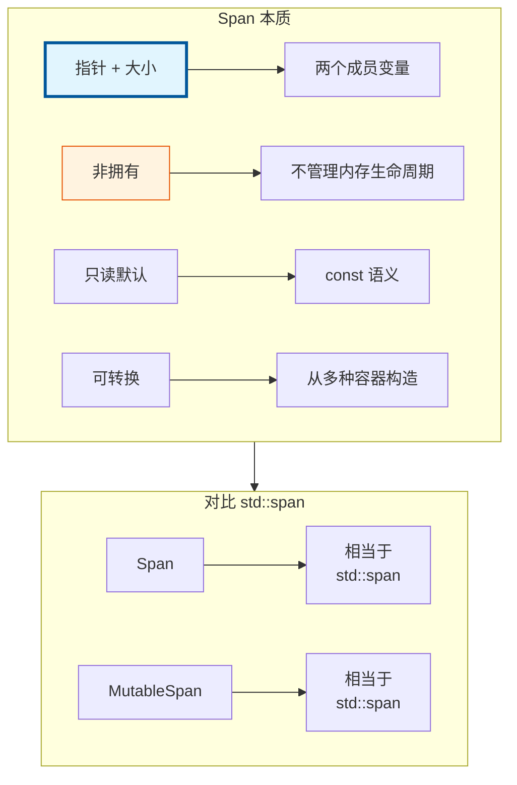
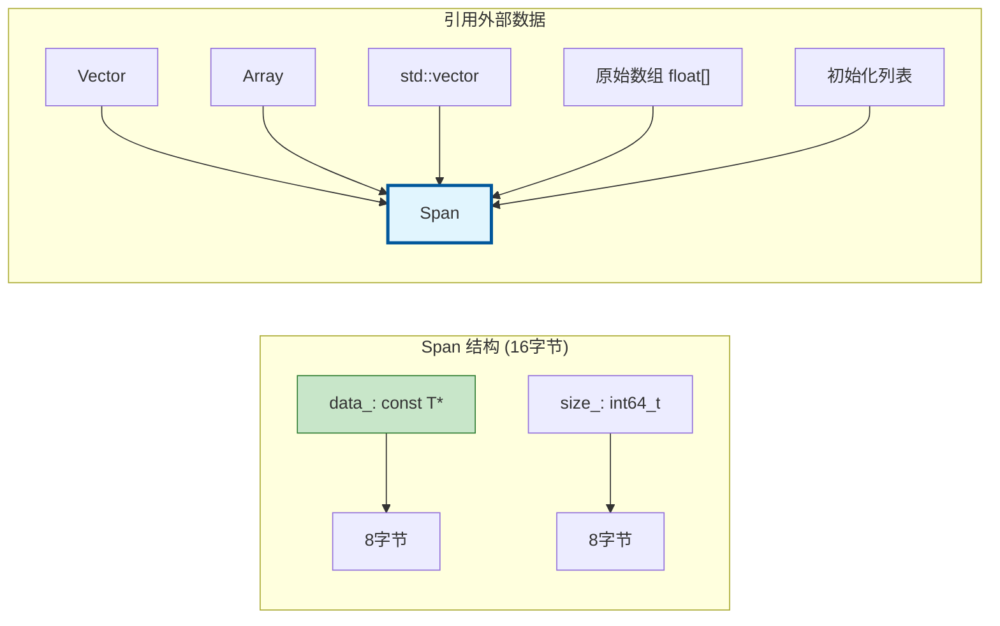
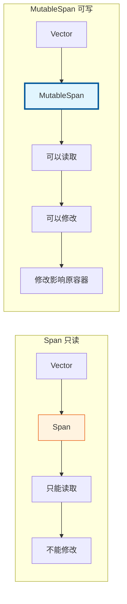
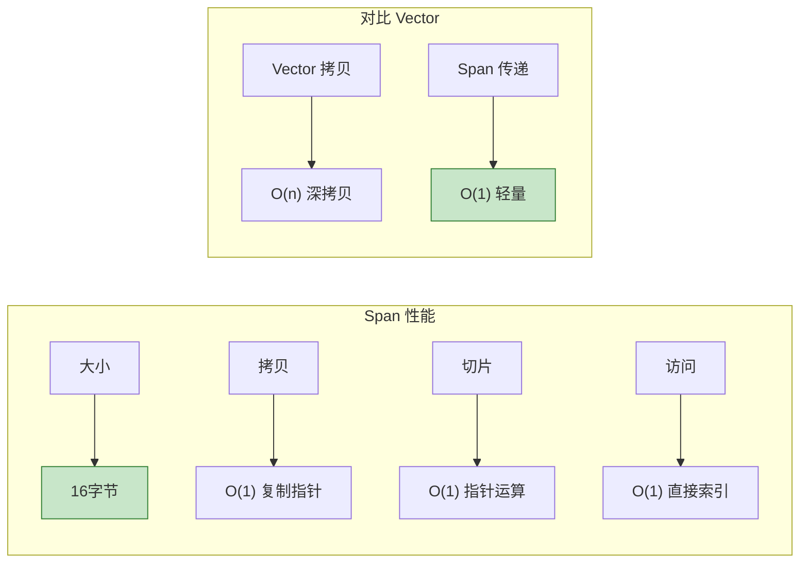

# Span<T> / MutableSpan<T> - 非拥有视图

> `Span` 是 Blender 中最重要的参数传递类型，它提供对数组的只读视图，零开销抽象

---

## 🎯 核心概念



---

## 📦 内存布局



---

## 🚀 基础用法

### 构造

```cpp
#include "BLI_span.hh"

namespace blender::nodes {

void span_construct_examples() {
    // 1. 默认构造 - 空 span
    Span<int> empty;
    BLI_assert(empty.is_empty());
    
    // 2. 从指针和大小
    float data[10];
    Span<float> span1(data, 10);
    
    // 3. 从 Vector
    Vector<float3> vec = {{1, 2, 3}, {4, 5, 6}};
    Span<float3> span2 = vec;  // 隐式转换
    
    // 4. 从 Array
    Array<int> arr(100);
    Span<int> span3 = arr;
    
    // 5. 从 std::vector
    std::vector<float> std_vec = {1.0f, 2.0f, 3.0f};
    Span<float> span4 = std_vec;
    
    // 6. 从 std::array
    std::array<int, 5> std_arr = {1, 2, 3, 4, 5};
    Span<int> span5 = std_arr;
    
    // 7. 从初始化列表（临时使用）
    process_values({1, 2, 3, 4, 5});
    
    // 8. 类型转换（支持协变）
    Span<float3> positions;
    Span<const float3> const_positions = positions;  // T* → const T*
}

} // namespace blender::nodes
```

### 访问元素

```cpp
void span_access_examples() {
    Vector<int> vec = {10, 20, 30, 40, 50};
    Span<int> span = vec;
    
    // 1. 索引访问（无边界检查）
    int val = span[2];  // 30
    
    // 2. 安全访问（有边界检查）
    const int *data = span.data();
    int64_t size = span.size();
    
    // 3. 首尾元素
    int first = span.first();  // 10
    int last = span.last();    // 50
    
    // 4. 迭代
    for (int value : span) {
        // 10, 20, 30, 40, 50
    }
    
    // 5. 索引范围
    for (int64_t i : span.index_range()) {
        // i: 0, 1, 2, 3, 4
    }
    
    // 6. 反向遍历
    for (auto it = span.rbegin(); it != span.rend(); ++it) {
        // 50, 40, 30, 20, 10
    }
}
```

---

## ✂️ 切片操作

```mermaid
flowchart LR
    subgraph 原始Span["原始 Span<br/>[0, 1, 2, 3, 4, 5, 6, 7, 8, 9]"]
        A["0"] --> B["1"] --> C["2"] --> D["3"] --> E["4"] --> F["5"] --> G["6"] --> H["7"] --> I["8"] --> J["9"]
    end
    
    subgraph slice["slice(2, 4)"]
        C2["2"] --> D2["3"] --> E2["4"] --> F2["5"]
    end
    
    subgraph drop_front["drop_front(3)"]
        D3["3"] --> E3["4"] --> F3["5"] --> G3["6"] --> H3["7"] --> I3["8"] --> J3["9"]
    end
    
    subgraph take_front["take_front(4)"]
        A4["0"] --> B4["1"] --> C4["2"] --> D4["3"]
    end
    
    style C2 fill:#e1f5fe,stroke:#01579b
    style D3 fill:#e1f5fe,stroke:#01579b
    style A4 fill:#e1f5fe,stroke:#01579b
```



```cpp
void span_slice_examples() {
    Vector<int> vec = {0, 1, 2, 3, 4, 5, 6, 7, 8, 9};
    Span<int> span = vec;
    
    // 1. slice - 指定起始和大小
    Span<int> sub1 = span.slice(2, 4);      // [2, 3, 4, 5]
    Span<int> sub2 = span.slice(IndexRange(2, 4));  // 同上
    
    // 2. slice_safe - 安全切片（自动截断）
    Span<int> sub3 = span.slice_safe(8, 5);  // [8, 9]（不会越界）
    
    // 3. drop_front - 去掉前 n 个
    Span<int> sub4 = span.drop_front(3);    // [3, 4, 5, 6, 7, 8, 9]
    
    // 4. drop_back - 去掉后 n 个
    Span<int> sub5 = span.drop_back(3);     // [0, 1, 2, 3, 4, 5, 6]
    
    // 5. take_front - 只取前 n 个
    Span<int> sub6 = span.take_front(4);    // [0, 1, 2, 3]
    
    // 6. take_back - 只取后 n 个
    Span<int> sub7 = span.take_back(4);     // [6, 7, 8, 9]
    
    // 7. 链式操作
    Span<int> sub8 = span.drop_front(2).take_front(5);  // [2, 3, 4, 5, 6]
}
```

---

## 🔄 MutableSpan - 可变视图



```cpp
void mutable_span_examples() {
    Vector<int> vec = {1, 2, 3, 4, 5};
    
    // 获取可变视图
    MutableSpan<int> mspan = vec.as_mutable_span();
    
    // 修改元素
    mspan[0] = 100;           // vec 变为 {100, 2, 3, 4, 5}
    mspan.first() = 200;      // vec 变为 {200, 2, 3, 4, 5}
    mspan.last() = 500;       // vec 变为 {200, 2, 3, 4, 500}
    
    // 批量填充
    mspan.fill(42);           // vec 全部变为 42
    
    // 拷贝赋值
    Vector<int> src = {10, 20, 30, 40, 50};
    mspan.copy_from(src);     // vec 变为 {10, 20, 30, 40, 50}
    
    // 切片后修改
    MutableSpan<int> sub = mspan.slice(1, 3);
    sub[0] = 999;             // vec 变为 {10, 999, 30, 40, 50}
}
```

---

## 🎯 函数参数最佳实践

### 为什么使用 Span 作为参数？

```cpp
// ❌ 不好：只能接受 Vector
void process_bad(const Vector<float3> &positions);

// ❌ 不好：需要传递指针+大小
void process_c_style(const float3 *data, int64_t size);

// ✅ 好：接受任何连续数组
void process_good(Span<float3> positions);

// ✅ 好：输出参数使用 MutableSpan
void generate_positions(MutableSpan<float3> output);
```

### 实际示例

```cpp
// 计算包围盒
Bounds<float3> calculate_bounds(Span<float3> positions);

// 平移顶点
void translate_vertices(MutableSpan<float3> positions, const float3 &offset);

// 使用示例
void node_geo_exec(GeoNodeExecParams params) {
    GeometrySet geometry = params.extract_input<GeometrySet>("Geometry"_ustr);
    
    if (Mesh *mesh = geometry.get_mesh_for_write()) {
        MutableSpan<float3> positions = mesh->vert_positions_for_write();
        
        // 可以传入 MutableSpan
        translate_vertices(positions, float3(1, 0, 0));
        
        // 也可以转为 Span 传入
        Bounds<float3> bounds = calculate_bounds(positions);
    }
}
```

---

## 🎨 高级用法

### 类型转换

```cpp
void span_cast_examples() {
    // 隐式转换：T* → const T*
    Vector<float3> vec;
    Span<float3> mut_span = vec;
    Span<const float3> const_span = mut_span;  // OK
    
    // 禁止：const T* → T*
    // Span<float3> mut_span2 = const_span;  // 编译错误
    
    // 指针类型转换
    Span<int> int_span;
    // Span<float> float_span = int_span;  // 编译错误，不同类型
}
```

### 与算法结合

```cpp
#include <algorithm>

void span_algorithm_examples() {
    Vector<int> vec = {3, 1, 4, 1, 5, 9, 2, 6};
    Span<int> span = vec;
    MutableSpan<int> mspan = vec.as_mutable_span();
    
    // 标准算法
    std::sort(mspan.begin(), mspan.end());           // 排序
    auto it = std::find(span.begin(), span.end(), 5); // 查找
    int count = std::count(span.begin(), span.end(), 1); // 计数
    
    // Blender 算法
    int sum = span::sum(span);  // 求和
    int min = *std::min_element(span.begin(), span.end());
    int max = *std::max_element(span.begin(), span.end());
}
```

### 空 Span 检查

```cpp
void span_safety_examples() {
    Span<int> span;
    
    // 检查空
    if (span.is_empty()) {
        return;
    }
    
    // 检查大小
    if (span.size() < 3) {
        return;
    }
    
    // 安全访问
    std::optional<int> val = span.try_get(0);  // 越界返回 nullopt
    
    // 断言检查
    BLI_assert(!span.is_empty());
    int first = span.first();
}
```

---

## ⚡ 性能特点



### 性能建议

| 场景 | 推荐类型 | 原因 |
|-----|---------|------|
| 函数只读参数 | `Span<T>` | 轻量、通用 |
| 函数修改参数 | `MutableSpan<T>` | 明确意图、高效 |
| 返回值 | `Vector<T>` | 拥有数据 |
| 临时切片 | `Span<T>` | 零开销 |
| 存储引用 | 避免 | 生命周期问题 |

---

## 🎯 节点开发典型模式

### 模式 1：处理几何体属性

```cpp
static void process_mesh(Mesh &mesh)
{
    // 获取位置属性
    MutableSpan<float3> positions = mesh->vert_positions_for_write();
    
    // 处理
    for (float3 &pos : positions) {
        pos += float3(0, 1, 0);
    }
}
```

### 模式 2：字段求值输出

```cpp
static void evaluate_field(const Field<float> &field,
                           const FieldContext &context,
                           const int64_t size,
                           MutableSpan<float> output)
{
    FieldEvaluator evaluator(context, size);
    evaluator.add_with_destination(field, output);
    evaluator.evaluate();
}
```

### 模式 3：多几何体处理

```cpp
static void process_all_positions(GeometrySet &geometry,
                                  const float3 &offset)
{
    // 处理 Mesh
    if (Mesh *mesh = geometry.get_mesh_for_write()) {
        for (float3 &pos : mesh->vert_positions_for_write()) {
            pos += offset;
        }
    }
    
    // 处理 PointCloud
    if (PointCloud *pc = geometry.get_pointcloud_for_write()) {
        for (float3 &pos : pc->positions_for_write()) {
            pos += offset;
        }
    }
}
```

---

## ✅ 检查清单

- [ ] 理解 Span 是"视图"而非"容器"
- [ ] 掌握所有切片操作（slice/drop/take）
- [ ] 区分 Span（只读）和 MutableSpan（可写）
- [ ] 会用 Span 作为函数参数
- [ ] 了解生命周期安全问题
- [ ] 掌握与 Vector/Array 的互操作

---

## 📁 相关文件

| 文件 | 路径 |
|-----|------|
| BLI_span.hh | `source/blender/blenlib/BLI_span.hh` |
| 测试文件 | `source/blender/blenlib/tests/BLI_span_test.cc` |

---

## 🔗 相关文档

- [01_Vector.md](01_Vector.md) - 动态数组
- [03_Array.md](03_Array.md) - 固定大小数组
