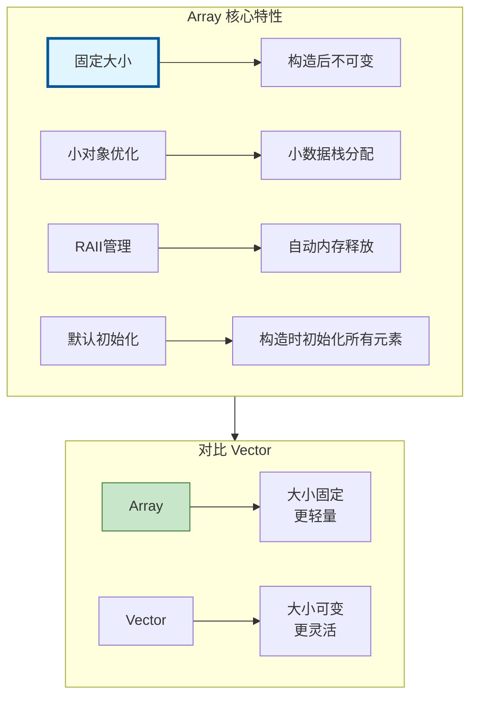
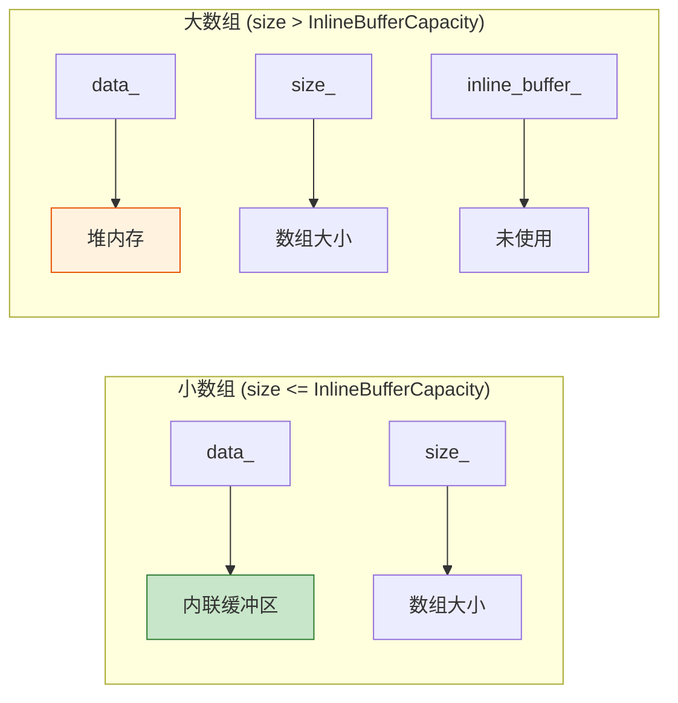

# Array<T> - 固定大小数组

> `Array<T>` 是大小在构造时确定、之后不变的数组容器，比 `Vector` 更轻量

---

## 📖 源码注释翻译与解释

### 文件头注释 (BLI_array.hh:7~26)

> **原文注释：**
> ```cpp
> /** \file
>  * \ingroup bli
>  *
>  * A `Array<T>` is a container for a fixed size array the size of which is NOT known at
>  * compile time.
>  *
>  * If the size is known at compile time, `std::array<T, N>` should be used instead.
>  *
>  * Array should usually be used instead of Vector whenever the number of elements
>  * is known at construction time. Note however, that Array will default construct all
>  * elements when initialized with the size-constructor. For trivial types, this does nothing. In
>  * all other cases, this adds overhead.
>  *
>  * A main benefit of using Array over Vector is that it expresses the intent of the developer
>  * better. It indicates that the size of the data structure is not expected to change. Furthermore,
>  * you can be more certain that an array does not over-allocate.
>  *
>  * Array supports small object optimization to improve performance when the size turns out
>  * to be small at run-time.
>  */
> ```

**中文翻译与详细解释：**

| 段落 | 翻译 | 关键要点 |
|------|------|----------|
| **核心定义** | `Array<T>` 是一个固定大小数组的容器，其大小在**编译时未知**。 | 运行时确定大小，但构造后固定 |
| **与 std::array 对比** | 如果大小在编译时已知，应该使用 `std::array<T, N>` 代替。 | `std::array` 用于编译时已知大小 |
| **使用场景** | 当元素数量在构造时已知时，通常应该使用 Array 代替 Vector。 | 构造时已知大小 → Array |
| **初始化开销** | 注意，Array 使用大小构造函数初始化时会默认构造所有元素。对于平凡类型，这什么都不做。但在其他情况下，这会增加开销。 | 非平凡类型有默认构造开销 |
| **意图表达** | 使用 Array 而非 Vector 的主要好处是更好地表达开发者的意图。它表明数据结构的大小不期望改变。 | 语义清晰：大小固定 |
| **内存效率** | 此外，你可以更确定数组不会过度分配。 | 不会预留额外容量 |
| **小对象优化** | Array 支持小对象优化，以在运行时大小较小时提高性能。 | 同 Vector 的 SBO |

### 模板参数注释 (BLI_array.hh:36~49)

> **原文：**
> ```cpp
> template<
>     /**
>      * The type of the values stored in the array.
>      */
>     typename T,
>     /**
>      * The number of values that can be stored in the array, without doing a heap allocation.
>      */
>     int64_t InlineBufferCapacity = default_inline_buffer_capacity(sizeof(T)),
>     /**
>      * The allocator used by this array. Should rarely be changed, except when you don't want that
>      * MEM_* functions are used internally.
>      */
>     typename Allocator = GuardedAllocator>
> class Array {
> ```

**参数说明：**

| 参数 | 默认值 | 说明 |
|------|--------|------|
| `T` | - | 存储值类型 |
| `InlineBufferCapacity` | 根据 sizeof(T) 计算 | 内联缓冲区可容纳的元素数 |
| `Allocator` | `GuardedAllocator` | 使用的分配器 |

### 成员变量注释 (BLI_array.hh:61~72)

> **原文：**
> ```cpp
> private:
>   /** The beginning of the array. It might point into the inline buffer. */
>   T *data_;
>
>   /** Number of elements in the array. */
>   int64_t size_;
>
>   /** Used for allocations when the inline buffer is too small. */
>   BLI_NO_UNIQUE_ADDRESS Allocator allocator_;
>
>   /** A placeholder buffer that will remain uninitialized until it is used. */
>   BLI_NO_UNIQUE_ADDRESS TypedBuffer<T, InlineBufferCapacity> inline_buffer_;
> ```

**翻译与说明：**

| 成员 | 说明 |
|------|------|
| `data_` | 数组起始指针，可能指向内联缓冲区 |
| `size_` | 元素数量（固定不变） |
| `allocator_` | 分配器，内联缓冲区不足时使用 |
| `inline_buffer_` | 占位缓冲区，使用前保持未初始化状态 |

**与 Vector 的区别：**

```cpp
// Vector: 使用三个指针
T *begin_;
T *end_;           // 用于动态增长
T *capacity_end_;  // 用于动态扩容

// Array: 使用指针 + 大小
T *data_;
int64_t size_;     // 固定大小，不需要 end_ 指针
```

Array 不需要 `end_` 和 `capacity_end_` 指针，因为大小固定，不需要追踪容量和动态增长。

### 构造函数注释 (BLI_array.hh:74~77)

> **原文：**
> ```cpp
> /**
>  * By default an empty array is created.
>  */
> Array(Allocator allocator = {}) noexcept : allocator_(allocator)
> {
>   data_ = inline_buffer_;
> ```

**翻译：** 默认创建一个空数组。

---

## 🎯 核心特性



---

## 📦 内存布局



---

## 🚀 常用操作

### 构造

```cpp
#include "BLI_array.hh"

namespace blender::nodes {

void array_construct_examples() {
    // 1. 默认构造 - 空数组
    Array<int> arr1;
    BLI_assert(arr1.is_empty());
    
    // 2. 指定大小 - 默认初始化
    Array<float> arr2(100);  // 100个float，默认初始化为0
    
    // 3. 指定大小和初始值
    Array<int> arr3(10, 42);  // 10个42
    
    // 4. 从 Span 拷贝
    Vector<float> vec = {1.0f, 2.0f, 3.0f};
    Array<float> arr4(vec);  // 拷贝构造
    
    // 5. 初始化列表
    Array<int> arr5 = {1, 2, 3, 4, 5};
    
    // 6. 指定内联缓冲区大小
    Array<float3, 16> positions(10);  // 10个float3，内联缓冲区16个
}

} // namespace blender::nodes
```

### 访问元素

```cpp
void array_access_examples() {
    Array<int> arr = {10, 20, 30, 40, 50};
    
    // 1. 索引访问
    int val = arr[2];  // 30
    
    // 2. 首尾元素
    int first = arr.first();  // 10
    int last = arr.last();    // 50
    
    // 3. 指针访问
    const int *data = arr.data();
    
    // 4. 迭代
    for (int value : arr) {
        // 10, 20, 30, 40, 50
    }
    
    // 5. 索引范围
    for (int64_t i : arr.index_range()) {
        arr[i] *= 2;
    }
}
```

### 获取信息

```cpp
void array_info_examples() {
    Array<int> arr(100);
    
    // 大小
    int64_t size = arr.size();  // 100
    bool empty = arr.is_empty();  // false
    
    // 容量（Array中等于size）
    int64_t capacity = arr.capacity();  // 100
    
    // 是否在栈上
    bool is_inline = arr.is_inline();  // 取决于大小和InlineBufferCapacity
}
```

---

## 🔄 与 Span/Vector 互操作

```cpp
void array_interop_examples() {
    // Array → Span
    Array<float3> arr(100);
    Span<float3> span = arr;  // 隐式转换
    MutableSpan<float3> mspan = arr.as_mutable_span();
    
    // Array → Vector
    Vector<float3> vec(span);  // 拷贝构造
    
    // Span → Array
    Span<float3> some_span = get_data();
    Array<float3> arr2(some_span);  // 拷贝
}
```

---

## 🎯 节点开发中的典型用法

### 字段求值输出缓冲区

```cpp
static void node_geo_exec(GeoNodeExecParams params)
{
    GeometrySet geometry = params.extract_input<GeometrySet>("Geometry"_ustr);
    const Field<float> field = params.extract_input<Field<float>>("Value"_ustr);
    
    if (Mesh *mesh = geometry.get_mesh()) {
        const int64_t size = mesh->totvert;
        
        // 分配输出缓冲区
        Array<float> result(size);
        
        // 求值字段
        const bke::MeshFieldContext context(*mesh, bke::AttrDomain::Point);
        fn::FieldEvaluator evaluator(context, size);
        evaluator.add_with_destination(field, result.as_mutable_span());
        evaluator.evaluate();
        
        // 使用 result ...
    }
}
```

### 临时计算缓冲区

```cpp
static void process_with_temp_buffer(Span<float> input, MutableSpan<float> output)
{
    // 分配临时缓冲区
    Array<float> temp(input.size());
    
    // 第一阶段计算
    for (int64_t i : input.index_range()) {
        temp[i] = input[i] * 2.0f;
    }
    
    // 第二阶段计算
    for (int64_t i : input.index_range()) {
        output[i] = temp[i] + 1.0f;
    }
}
```

---

## ✅ 检查清单

- [ ] 理解 Array 大小固定
- [ ] 掌握构造方式
- [ ] 了解小对象优化
- [ ] 会用 as_mutable_span()
- [ ] 了解与 Vector 的区别

---

## 📁 相关文件

| 文件 | 路径 |
|-----|------|
| BLI_array.hh | `source/blender/blenlib/BLI_array.hh` |

---

## 🔗 相关文档

- [01_Vector.md](01_Vector.md) - 动态数组
- [02_Span.md](02_Span.md) - 非拥有视图
