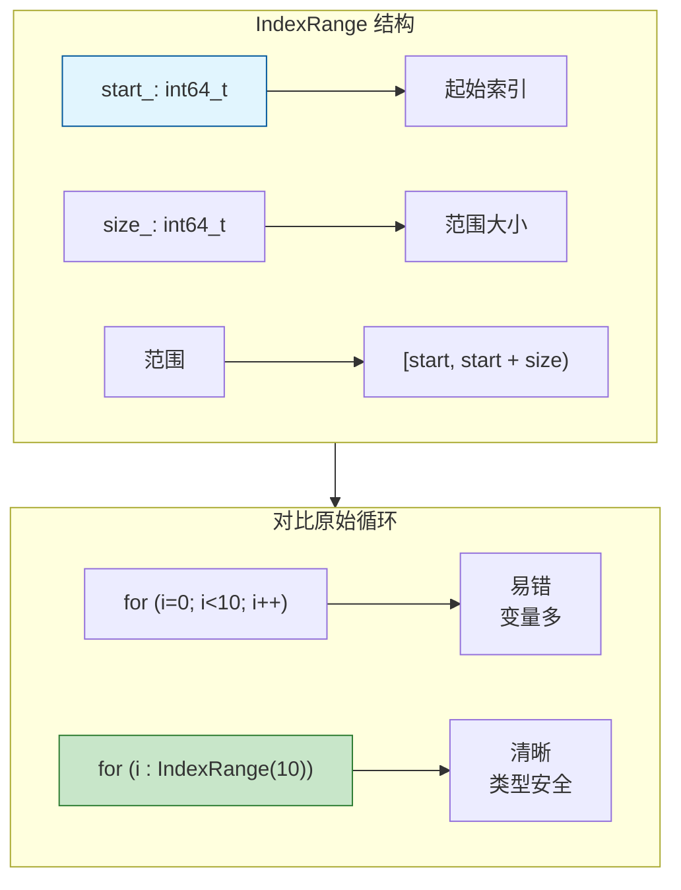
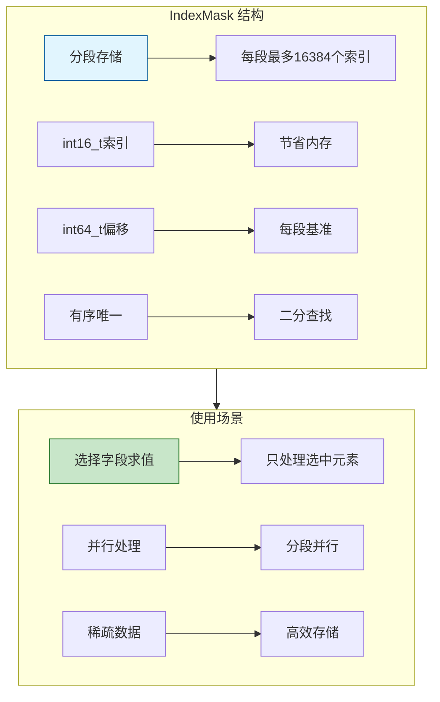
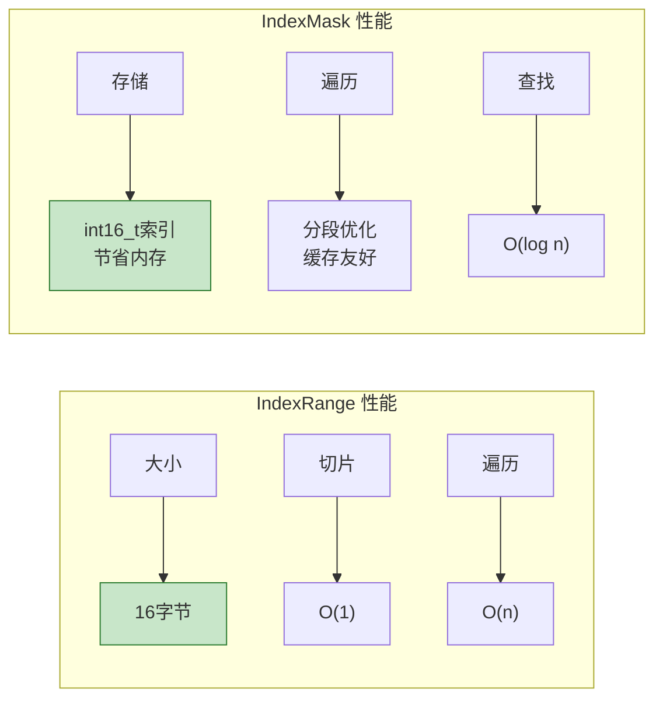

# IndexRange / IndexMask - 索引工具

> 高效处理索引范围和索引掩码，是并行处理和字段求值的核心工具

---

## 🎯 IndexRange - 连续索引范围

### 核心概念



### 构造

```cpp
#include "BLI_index_range.hh"

namespace blender::nodes {

void index_range_construct_examples() {
    // 1. 默认构造 - 空范围
    IndexRange range1;  // [0, 0)
    
    // 2. 从大小构造（从0开始）
    IndexRange range2(100);  // [0, 100)
    
    // 3. 从起始和大小
    IndexRange range3(10, 50);  // [10, 60)
    
    // 4. 从起始和结束
    IndexRange range4 = IndexRange::from_begin_end(10, 60);  // [10, 60)
    
    // 5. 从起始和结束（包含）
    IndexRange range5 = IndexRange::from_begin_end_inclusive(10, 59);  // [10, 60)
    
    // 6. 从结束和大小
    IndexRange range6 = IndexRange::from_end_size(100, 10);  // [90, 100)
    
    // 7. 单元素范围
    IndexRange range7 = IndexRange::from_single(42);  // [42, 43)
}

} // namespace blender::nodes
```

### 遍历

```cpp
void index_range_iteration_examples() {
    // 基础遍历
    for (int64_t i : IndexRange(100)) {
        // i: 0, 1, 2, ..., 99
    }
    
    // 带偏移的遍历
    for (int64_t i : IndexRange(10, 50)) {
        // i: 10, 11, 12, ..., 59
    }
    
    // 嵌套循环（更清晰）
    for (int64_t y : IndexRange(height)) {
        for (int64_t x : IndexRange(width)) {
            int64_t index = y * width + x;
        }
    }
    
    // 同时遍历索引和值（类似 Python enumerate）
    Vector<float> values = get_values();
    for (int64_t i : values.index_range()) {
        float value = values[i];
        // 使用 i 和 value
    }
}
```

### 切片操作

```cpp
void index_range_slice_examples() {
    IndexRange range(0, 100);  // [0, 100)
    
    // 1. slice - 子范围
    IndexRange sub1 = range.slice(10, 20);  // [10, 30)
    
    // 2. take_front - 取前n个
    IndexRange sub2 = range.take_front(10);  // [0, 10)
    
    // 3. take_back - 取后n个
    IndexRange sub3 = range.take_back(10);   // [90, 100)
    
    // 4. drop_front - 去掉前n个
    IndexRange sub4 = range.drop_front(10);  // [10, 100)
    
    // 5. drop_back - 去掉后n个
    IndexRange sub5 = range.drop_back(10);   // [0, 90)
    
    // 6. before - 前面n个
    IndexRange sub6 = range.before(10);      // [-10, 0) - 注意可能负数
    
    // 7. after - 后面n个
    IndexRange sub7 = range.after(10);       // [100, 110)
    
    // 8. shift - 整体偏移
    IndexRange shifted = range.shift(50);    // [50, 150)
}
```

### 查询

```cpp
void index_range_query_examples() {
    IndexRange range(10, 50);  // [10, 60)
    
    // 基本信息
    int64_t start = range.start();   // 10
    int64_t size = range.size();     // 50
    int64_t last = range.last();     // 59
    bool empty = range.is_empty();   // false
    
    // 包含检查
    bool contains1 = range.contains(30);   // true
    bool contains2 = range.contains(5);    // false
    bool contains3 = range.contains(60);   // false（不包含end）
    
    // 索引检查
    int64_t index = 25;
    bool in_range = range[index] == index;  // 检查索引是否在范围内
}
```

---

## 🎭 IndexMask - 索引掩码

### 核心概念



### 构造

```cpp
#include "BLI_index_mask.hh"

namespace blender::nodes {

void index_mask_construct_examples() {
    IndexMaskMemory memory;
    
    // 1. 从 IndexRange 构造（O(1)）
    IndexMask mask1(IndexRange(0, 100));
    
    // 2. 从布尔数组构造
    Array<bool> selection(1000);
    // ... 填充 selection ...
    IndexMask mask2 = IndexMask::from_booleans(selection, memory);
    
    // 3. 从索引数组构造
    Vector<int64_t> indices = {1, 5, 10, 20, 50};
    IndexMask mask3 = IndexMask::from_indices(indices, memory);
    
    // 4. 从位数组构造
    BitSpan bits = get_selection_bits();
    IndexMask mask4 = IndexMask::from_bits(bits, memory);
    
    // 5. 空掩码
    IndexMask empty_mask;
}

} // namespace blender::nodes
```

### 遍历

```cpp
void index_mask_iteration_examples() {
    IndexMask mask = get_selection_mask();
    
    // 1. 基础遍历（按索引）
    mask.foreach_index([&](const int64_t i) {
        // 处理索引 i
        process_element(i);
    });
    
    // 2. 带位置遍历
    mask.foreach_index([&](const int64_t i, const int64_t pos) {
        // i: 原始索引
        // pos: 在掩码中的位置（0, 1, 2, ...）
    });
    
    // 3. 按段遍历（更高效）
    mask.foreach_segment([&](const IndexMaskSegment &segment) {
        // 处理一整段
        for (int64_t i : segment) {
            process_element(i);
        }
    });
    
    // 4. 并行遍历
    mask.foreach_index_optimized<int>(
        [&](const int64_t i) {
            process_element(i);
        },
        exec_mode::grain_size(1024)  // 并行粒度
    );
}
```

### 切片和子集

```cpp
void index_mask_slice_examples() {
    IndexMask mask = get_mask();
    
    // 1. 切片
    IndexMask sub = mask.slice(IndexRange(0, 100));
    
    // 2. 取前n个
    IndexMask front = mask.slice_front(100);
    
    // 3. 取后n个
    IndexMask back = mask.slice_back(100);
    
    // 4. 组合掩码
    IndexMaskMemory memory;
    IndexMask combined = IndexMask::from_union(mask1, mask2, memory);
    IndexMask intersection = IndexMask::from_intersection(mask1, mask2, memory);
    IndexMask difference = IndexMask::from_difference(mask1, mask2, memory);
}
```

### 查询

```cpp
void index_mask_query_examples() {
    IndexMask mask = get_mask();
    
    // 大小
    int64_t size = mask.size();
    bool empty = mask.is_empty();
    
    // 获取单个索引
    int64_t first = mask[0];   // 第一个索引
    int64_t last = mask.last();  // 最后一个索引
    
    // 查找索引位置
    std::optional<int64_t> pos = mask.find(42);  // 查找索引42的位置
    
    // 检查包含
    bool contains = mask.contains(42);
}
```

---

## 🎯 节点开发中的典型用法

### 模式 1：字段求值 + Selection

```cpp
static void node_geo_exec(GeoNodeExecParams params)
{
    GeometrySet geometry = params.extract_input<GeometrySet>("Geometry"_ustr);
    const Field<bool> selection_field = params.extract_input<Field<bool>>("Selection"_ustr);
    
    if (Mesh *mesh = geometry.get_mesh_for_write()) {
        const bke::MeshFieldContext context(*mesh, bke::AttrDomain::Point);
        fn::FieldEvaluator evaluator(context, mesh->totvert);
        evaluator.set_selection(selection_field);
        evaluator.evaluate();
        
        // 获取选中的索引掩码
        const IndexMask &mask = evaluator.get_evaluated_selection_as_mask();
        
        // 只处理选中的顶点
        MutableSpan<float3> positions = mesh->vert_positions_for_write();
        mask.foreach_index_optimized<int>([&](const int64_t i) {
            positions[i] += float3(0, 1, 0);
        });
    }
}
```

### 模式 2：并行处理

```cpp
static void process_in_parallel(Span<float3> input, MutableSpan<float3> output)
{
    const int64_t size = input.size();
    
    // 创建完整掩码
    IndexMask mask(IndexRange(size));
    
    // 并行遍历
    mask.foreach_index_optimized<int>(
        [&](const int64_t i) {
            output[i] = process(input[i]);
        },
        exec_mode::grain_size(1024)  // 每1024个元素一个任务
    );
}
```

### 模式 3：从布尔数组创建掩码

```cpp
static IndexMask create_mask_from_condition(Span<float> values, 
                                            float threshold,
                                            IndexMaskMemory &memory)
{
    // 创建布尔数组
    Array<bool> selection(values.size());
    for (int64_t i : values.index_range()) {
        selection[i] = values[i] > threshold;
    }
    
    // 转换为掩码
    return IndexMask::from_booleans(selection, memory);
}
```

---

## ⚡ 性能特点



---

## ✅ 检查清单

- [ ] 理解 IndexRange 的 [start, start+size) 语义
- [ ] 掌握所有切片操作
- [ ] 理解 IndexMask 的分段存储结构
- [ ] 会用 foreach_index 遍历
- [ ] 了解并行遍历的用法
- [ ] 掌握从布尔数组创建掩码

---

## 📁 相关文件

| 文件 | 路径 |
|-----|------|
| BLI_index_range.hh | `source/blender/blenlib/BLI_index_range.hh` |
| BLI_index_mask.hh | `source/blender/blenlib/BLI_index_mask.hh` |

---

## 🔗 相关文档

- [01_Vector.md](01_Vector.md) - 动态数组
- [02_Span.md](02_Span.md) - 非拥有视图
