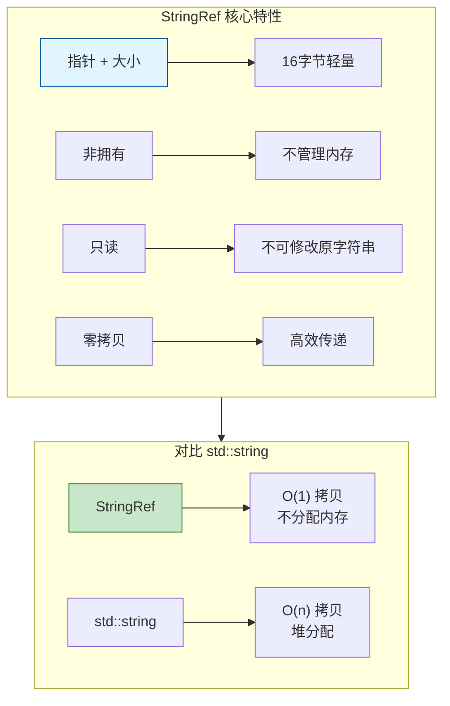

# StringRef - 字符串视图

> 轻量级字符串引用，零拷贝字符串处理

---

## 🎯 核心概念



---

## 🚀 常用操作

### 构造

```cpp
#include "BLI_string_ref.hh"

namespace blender::nodes {

void stringref_construct_examples() {
    // 1. 默认构造 - 空字符串
    StringRef ref1;  // ""
    
    // 2. 从 C 字符串
    StringRef ref2 = "hello world";
    
    // 3. 从 std::string
    std::string str = "hello";
    StringRef ref3 = str;
    
    // 4. 从指针和大小
    const char *data = "hello world";
    StringRef ref4(data, 5);  // "hello"
    
    // 5. 从单个字符
    StringRef ref5('a');  // "a"
    
    // 6. 空字符串常量
    StringRef empty = StringRef::Empty;
}

} // namespace blender::nodes
```

### 访问

```cpp
void stringref_access_examples() {
    StringRef ref = "hello world";
    
    // 1. 大小
    int64_t size = ref.size();  // 11
    bool empty = ref.is_empty();  // false
    
    // 2. 索引访问
    char c = ref[0];  // 'h'
    
    // 3. 首尾字符
    char first = ref.first();  // 'h'
    char last = ref.last();    // 'd'
    
    // 4. 原始指针
    const char *data = ref.data();
}
```

### 查找

```cpp
void stringref_find_examples() {
    StringRef ref = "hello world";
    
    // 1. find - 查找子串
    std::optional<int64_t> pos1 = ref.find("world");  // 6
    std::optional<int64_t> pos2 = ref.find("xyz");    // nullopt
    
    // 2. find_first - 查找字符
    std::optional<int64_t> pos3 = ref.find_first('o');  // 4
    
    // 3. find_last - 反向查找
    std::optional<int64_t> pos4 = ref.find_last('o');  // 7
    
    // 4. contains - 包含检查
    bool has_world = ref.contains("world");  // true
    bool has_xyz = ref.contains("xyz");      // false
    
    // 5. startswith / endswith
    bool starts = ref.startswith("hello");  // true
    bool ends = ref.endswith("world");      // true
}
```

### 切片

```cpp
void stringref_slice_examples() {
    StringRef ref = "hello world";
    
    // 1. substr - 子串
    StringRef sub1 = ref.substr(0, 5);   // "hello"
    StringRef sub2 = ref.substr(6, 5);   // "world"
    
    // 2. drop_front - 去掉前 n 个
    StringRef sub3 = ref.drop_front(6);  // "world"
    
    // 3. drop_back - 去掉后 n 个
    StringRef sub4 = ref.drop_back(6);   // "hello"
    
    // 4. take_front - 取前 n 个
    StringRef sub5 = ref.take_front(5);  // "hello"
    
    // 5. take_back - 取后 n 个
    StringRef sub6 = ref.take_back(5);   // "world"
}
```

### 分割

```cpp
void stringref_split_examples() {
    // 1. 按字符分割
    StringRef ref1 = "a,b,c,d,e";
    Vector<StringRef> parts1 = ref1.split(',');
    // parts1: ["a", "b", "c", "d", "e"]
    
    // 2. 按字符串分割
    StringRef ref2 = "hello::world::test";
    Vector<StringRef> parts2 = ref2.split("::");
    // parts2: ["hello", "world", "test"]
    
    // 3. 限制分割次数
    Vector<StringRef> parts3 = ref1.split(',', 2);
    // parts3: ["a", "b", "c,d,e"]
}
```

### 修剪

```cpp
void stringref_trim_examples() {
    // 1. 修剪空白
    StringRef ref1 = "  hello world  ";
    StringRef trimmed1 = ref1.trim();  // "hello world"
    
    // 2. 修剪左边
    StringRef trimmed2 = ref1.trim_start();  // "hello world  "
    
    // 3. 修剪右边
    StringRef trimmed3 = ref1.trim_end();    // "  hello world"
    
    // 4. 修剪指定字符
    StringRef ref2 = "...hello...";
    StringRef trimmed4 = ref2.trim('.');  // "hello"
}
```

---

## 🎯 节点开发中的典型用法

### 模式 1：属性名处理

```cpp
static void process_attribute_name(StringRef name)
{
    // 检查是否是内置属性
    if (name.startswith(".")) {
        // 内置属性
    }
    
    // 分割命名空间
    if (std::optional<int64_t> pos = name.find_first('.')) {
        StringRef namespace_name = name.substr(0, *pos);
        StringRef attr_name = name.drop_front(*pos + 1);
        // 处理...
    }
}
```

### 模式 2：文件路径处理

```cpp
static StringRef get_file_extension(StringRef path)
{
    if (std::optional<int64_t> pos = path.find_last('.')) {
        return path.drop_front(*pos + 1);
    }
    return StringRef::Empty;
}

static StringRef get_file_name(StringRef path)
{
    // 统一分隔符
    std::string normalized = path;
    std::replace(normalized.begin(), normalized.end(), '\\', '/');
    
    StringRef ref = normalized;
    if (std::optional<int64_t> pos = ref.find_last('/')) {
        return ref.drop_front(*pos + 1);
    }
    return ref;
}
```

### 模式 3：枚举字符串解析

```cpp
static std::optional<int> parse_enum_value(StringRef value,
                                           Span<StringRef> enum_items)
{
    for (int i : enum_items.index_range()) {
        if (enum_items[i] == value) {
            return i;
        }
    }
    return std::nullopt;
}
```

---

## ✅ 检查清单

- [ ] 理解 StringRef 是非拥有视图
- [ ] 掌握 substr / drop / take 操作
- [ ] 会用 split 分割字符串
- [ ] 了解 trim 用法
- [ ] 注意生命周期安全

---

## 📁 相关文件

| 文件 | 路径 |
|-----|------|
| BLI_string_ref.hh | `source/blender/blenlib/BLI_string_ref.hh` |

---

## 🔗 相关文档

- [01_Vector.md](01_Vector.md) - 动态数组
- [02_Span.md](02_Span.md) - 非拥有视图
