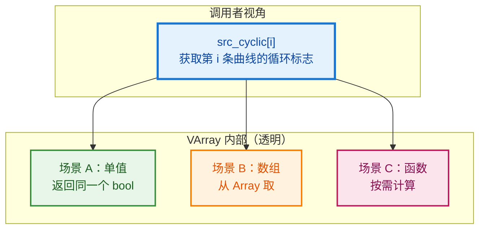
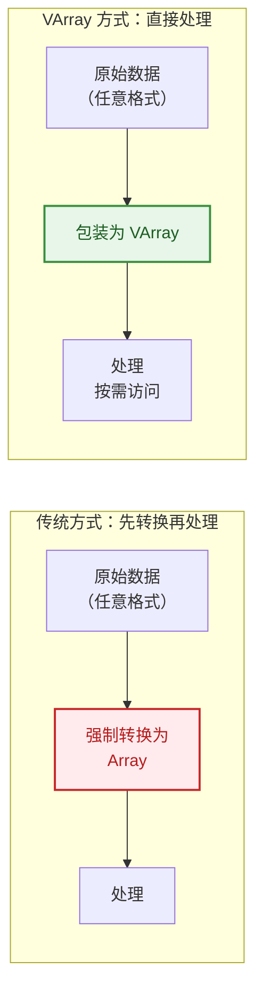
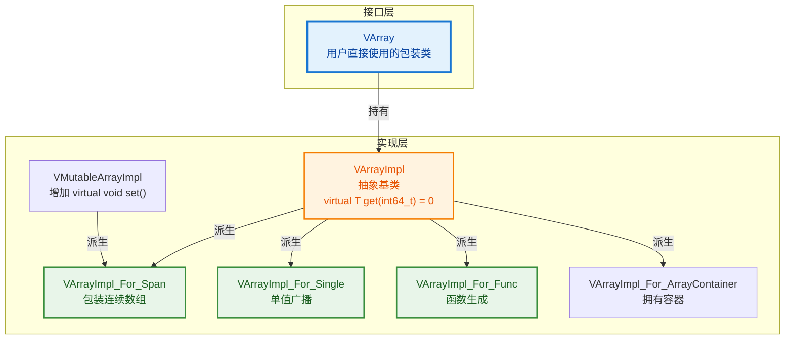
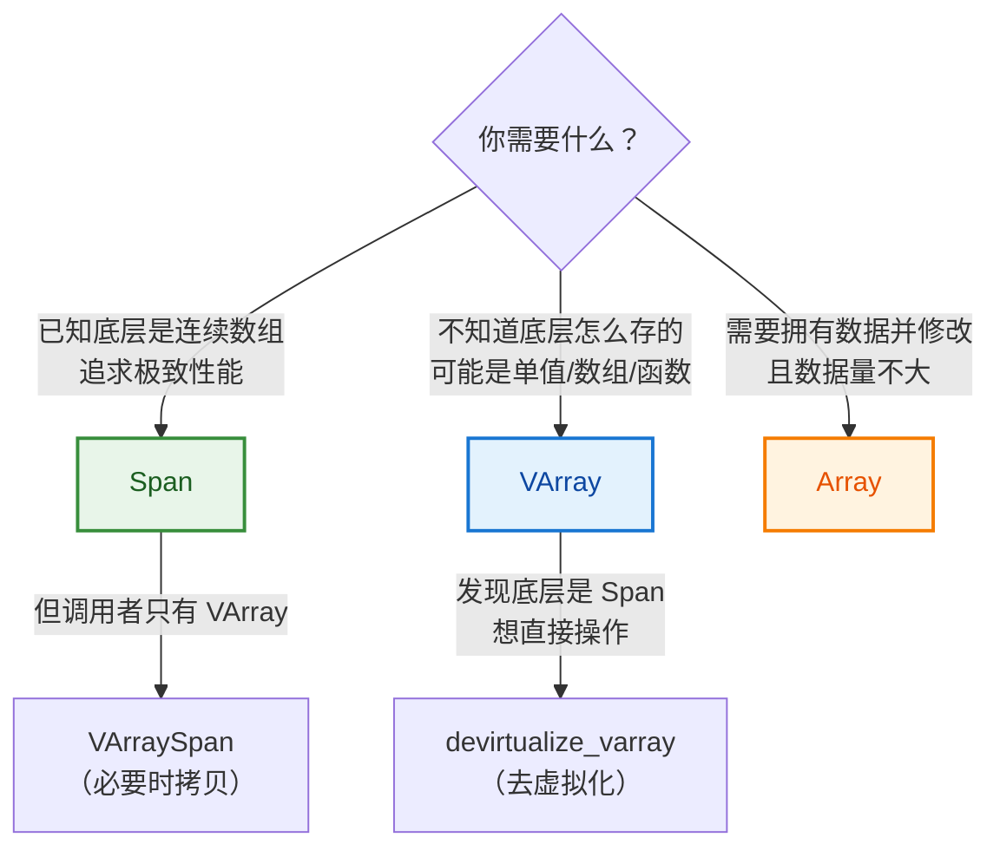
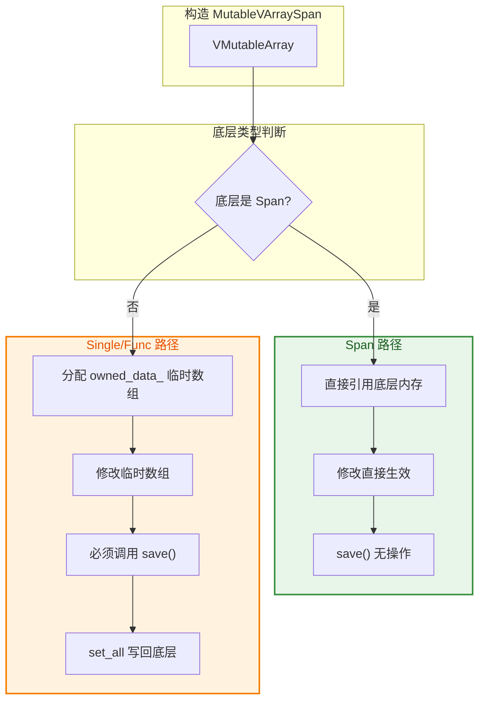

# VArray / GVArray 完全指南

> 从 `curves.cyclic()` 的一行代码出发，彻底理解 Blender 的虚拟数组系统。
>
> 核心源码：`source/blender/blenlib/BLI_virtual_array.hh`

---

## 目录

1. [从一个问题出发](#1-从一个问题出发)
2. [VArray 解决什么痛点](#2-varray-解决什么痛点)
3. [三种底层实现](#3-三种底层实现)
4. [VArray vs Span vs Array](#4-varray-vs-span-vs-array)
5. [源码中的真实用例](#5-源码中的真实用例)
6. [GVArray：类型擦除版](#6-gvarray类型擦除版)
7. [可写版本与辅助类](#7-可写版本与辅助类)
8. [去虚拟化优化](#8-去虚拟化优化)

---

## 1. 从一个问题出发

### 1.1 这行代码在干什么？

```cpp
// source/blender/geometry/intern/curves_remove_and_split.cc:20
const VArray<bool> src_cyclic = curves.cyclic();
```

**直觉问题**：
- 为什么返回 `VArray<bool>`？直接返回 `Array<bool>` 或 `Span<bool>` 不行吗？
- `VArray` 和 `Array` 有什么区别？
- 这行代码背后隐藏了什么设计思想？

### 1.2 先看一下 `CurvesGeometry::cyclic()` 可能返回什么

在 Blender 中，每条曲线有一个 `cyclic` 标志（是否首尾相连形成闭环）。这个数据的存储方式**不是固定的**：

| 场景 | 底层存储 | 示例 |
|------|----------|------|
| **所有曲线都是非循环的** | 单个 `false` 值 | 1000 条曲线，只需要 1 个 bool |
| **所有曲线都是循环的** | 单个 `true` 值 | 1000 条曲线，只需要 1 个 bool |
| **混合情况** | `Array<bool>`，每条曲线一个值 | 曲线 0 循环，曲线 1 不循环... |

**关键洞察**：如果强制返回 `Array<bool>`，前两种场景会浪费 999 个 bool 的内存。如果返回 `Span<bool>`，前两种场景根本无法表示（没有数组可引用）。

**VArray 的解决方案**：统一接口，底层可以是"单值"、"数组"、甚至"函数"，调用者完全不用关心。



---

## 2. VArray 解决什么痛点

### 2.1 痛点一：调用者不想做数据转换

假设你写了一个函数，接受一组浮点数做某种计算：

```cpp
// ❌ 方案 A：接受 Span<float>（太严格）
void process(Span<float> values) {
    for (float v : values) { /* ... */ }
}

// 调用者必须先把数据转成连续数组
Vector<float> vec = {1.0f, 2.0f, 3.0f};
process(vec);  // ✅ 可以

// 但如果是单值广播呢？
process(Span<float>(/* 只有一个 float，没法构造 Span */));  // ❌ 不行！
```

```cpp
// ✅ 方案 B：接受 VArray<float>（灵活）
void process(VArray<float> values) {
    for (int64_t i : values.index_range()) {
        float v = values[i];  // 不管底层是什么，都能访问
    }
}

// 从数组构造
Array<float> arr = {1.0f, 2.0f, 3.0f};
process(VArray<float>::from_span(arr));  // ✅

// 从单值构造（1000 个元素都是 42.0f）
process(VArray<float>::from_single(42.0f, 1000));  // ✅

// 从函数构造
process(VArray<float>::from_func(100, [](int64_t i) { return float(i) * 0.5f; }));  // ✅
```

### 2.2 痛点二：有些数据根本不存在于内存中

字段系统（Field System）的核心特性是**延迟计算**。比如用户输入了一个 `"position"` 字段，它的值不是预先存好的，而是在求值时根据几何体实时计算出来的。

```cpp
// 字段求值结果就是一个 VArray
// 底层根本没有 Array<float3>，只有一个计算函数
VArray<float3> positions = evaluator.get_evaluated<float3>(0);

// 访问 positions[10] 时，才会调用底层函数计算第 10 个点的位置
float3 pos = positions[10];
```

### 2.3 痛点三：性能与灵活性的权衡

```cpp
// 文件头注释的核心思想（BLI_virtual_array.hh:7~26）

/*
 * A virtual array is a data structure that behaves similarly to an array,
 * but its elements are accessed through virtual methods.
 *
 * 优点：调用者不必知道数据怎么存的，甚至不必存于内存中
 * 缺点：访问单个元素有虚函数调用开销
 *
 * 权衡：如果最终只访问少量元素，避免了"把所有数据展开成数组"的昂贵转换
 */
```



---

## 3. 三种底层实现

`VArray<T>` 本身只是一个**包装器**，真正的逻辑在 `VArrayImpl<T>` 的各种子类中。

### 3.1 类层次结构



### 3.2 实现一：VArrayImpl_For_Span（包装数组）

```cpp
// BLI_virtual_array.hh:204~264
template<typename T> class VArrayImpl_For_Span : public VMutableArrayImpl<T> {
 protected:
  T *data_ = nullptr;

 public:
  VArrayImpl_For_Span(const MutableSpan<T> data)
      : VMutableArrayImpl<T>(data.size()), data_(data.data()) {}

  T get(const int64_t index) const final {
    return data_[index];  // 直接数组访问
  }

  void set(const int64_t index, T value) final {
    data_[index] = value;  // 直接数组写入
  }

  CommonVArrayInfo common_info() const override {
    return CommonVArrayInfo(CommonVArrayInfo::Type::Span, true, data_);
  }
};
```

**特点**：
- 底层就是一块连续内存
- `get()` 直接 `data_[index]`，最快
- `common_info()` 返回 `Type::Span`，让外部知道可以优化

### 3.3 实现二：VArrayImpl_For_Single（单值广播）

```cpp
// BLI_virtual_array.hh:314~366
template<typename T> class VArrayImpl_For_Single final : public VArrayImpl<T> {
 private:
  T value_;

 public:
  VArrayImpl_For_Single(T value, const int64_t size)
      : VArrayImpl<T>(size), value_(std::move(value)) {}

  T get(const int64_t /*index*/) const override {
    return value_;  // 不管 index 是什么，返回同一个值
  }

  CommonVArrayInfo common_info() const override {
    return CommonVArrayInfo(CommonVArrayInfo::Type::Single, true, &value_);
  }
};
```

**特点**：
- 所有索引返回同一个值
- 内存占用极小（只有一个 `T`）
- `materialize` 优化：用 `fill` 而不是逐个 `get`

**用例**：`curves.cyclic()` 在所有曲线都是非循环时，底层就是这个实现。

### 3.4 实现三：VArrayImpl_For_Func（函数生成）

```cpp
// BLI_virtual_array.hh:375~423
template<typename T, typename GetFunc> class VArrayImpl_For_Func final : public VArrayImpl<T> {
 private:
  GetFunc get_func_;

 public:
  VArrayImpl_For_Func(const int64_t size, GetFunc get_func)
      : VArrayImpl<T>(size), get_func_(std::move(get_func)) {}

  T get(const int64_t index) const override {
    return get_func_(index);  // 调用函数生成值
  }
};
```

**特点**：
- 没有预存数据，每次 `get()` 都调用函数
- 用于字段求值结果、派生属性等
- 最灵活，但也最慢（每次都有函数调用开销）

### 3.5 CommonVArrayInfo：快速类型探测

```cpp
// BLI_virtual_array.hh:47~71
struct CommonVArrayInfo {
  enum class Type : uint8_t {
    Any,    // 通用类型（如 Func）
    Span,   // 底层是连续数组
    Single, // 底层是单值广播
  };

  Type type = Type::Any;
  bool may_have_ownership = true;
  const void *data;  // 指向底层数据
};
```

**作用**：通过一次虚函数调用 `common_info()`，外部就能知道底层是什么类型，从而选择优化路径。

```cpp
VArray<float> varray = get_some_varray();

// 快速检查底层类型
if (varray.is_single()) {
    // 所有值相同，可以用 fill 优化
    float val = varray.get_internal_single();
    // ...
}
else if (varray.is_span()) {
    // 底层是连续数组，可以直接拿指针
    Span<float> span = varray.get_internal_span();
    // ...
}
```

---

## 4. VArray vs Span vs Array

| 特性 | `Span<T>` | `VArray<T>` | `Array<T>` |
|------|-----------|-------------|------------|
| **只读/可写** | 只读视图 | 只读（`VMutableArray` 可写） | 可写 |
| **底层形态** | 必须是连续数组 | Span / Single / Func 都可以 | 连续数组 |
| **内存拥有** | 不拥有 | 可选（取决于实现） | 拥有 |
| **访问开销** | O(1)，直接指针 | O(1) + 虚函数开销 | O(1)，直接指针 |
| **单值广播** | ❌ 不支持 | ✅ 支持 | ❌ 不支持（浪费内存） |
| **函数生成** | ❌ 不支持 | ✅ 支持 | ❌ 不支持 |
| **适用场景** | 已知底层是数组 | 不知道底层形态 | 需要拥有并修改数据 |

### 选择指南



---

## 5. 源码中的真实用例

### 5.1 用例一：curves.cyclic()（属性读取）

```cpp
// source/blender/geometry/intern/curves_remove_and_split.cc:20
const VArray<bool> src_cyclic = curves.cyclic();

// 后续使用：像普通数组一样索引访问
const bool curve_cyclic = src_cyclic[curve_i];
```

**为什么用 VArray？**
- `cyclic` 属性可能以单值存储（所有曲线相同）
- 也可能以数组存储（每条曲线不同）
- 调用者不需要关心，统一用 `operator[]` 访问

### 5.2 用例二：字段求值结果

```cpp
// node_geo_curve_split.cc:183~187
fn::FieldEvaluator evaluator{field_context, src_curves.points_num()};
evaluator.add(selection_field);
evaluator.evaluate();

const IndexMask selection = evaluator.get_evaluated_as_mask(0);
```

**内部实现**：`FieldEvaluator` 的求值结果底层是 `GVArray`（`VArray` 的类型擦除版），可能来自：
- 直接从几何体属性读取（Span）
- 常量字段（Single）
- 复杂表达式计算（Func）

### 5.3 用例三：函数参数解耦

```cpp
// 某处理函数接受 VArray，不关心底层
void process_curves(const CurvesGeometry &curves,
                    const VArray<bool> &cyclic_flags)  // 可以是 Single 或 Span
{
    for (const int i : curves.curves_range()) {
        if (cyclic_flags[i]) {
            // 处理循环曲线...
        }
    }
}

// 调用方式 1：从 CurvesGeometry 获取（可能是 Single）
process_curves(curves, curves.cyclic());

// 调用方式 2：手动构造 Single（测试用）
process_curves(curves, VArray<bool>::from_single(false, curves.curves_num()));
```

---

## 6. GVArray：类型擦除版

### 6.1 为什么需要 GVArray？

`VArray<T>` 的 `T` 在**编译期**确定。但属性系统的场景是：运行期才知道属性是什么类型（`float`、`float3`、`int`...）。

```cpp
// 属性查找返回 GVArray（类型在运行期确定）
std::optional<GVArray> attribute = attributes.lookup("position");

// 检查类型
if (attribute->type() == CPPType::get<float3>()) {
    // 安全地转回具体类型
    VArray<float3> typed = attribute->typed<float3>();
    float3 pos = typed[0];
}
```

### 6.2 GVArray 与 VArray 的关系

```mermaid
flowchart TB
    subgraph 编译期类型["编译期确定类型"]
        VA_F["VArray<float>"]
        VA_I["VArray<int>"]
        VA_3["VArray<float3>"]
    end

    subgraph 运行期类型["运行期确定类型"]
        GVA["GVArray<br/>持有 CPPType*<br/>+ VArrayImpl<void>*"]
    end

    VA_F -->|擦除类型| GVA
    VA_I -->|擦除类型| GVA
    VA_3 -->|擦除类型| GVA

    GVA -->|typed<float>()| VA_F
    GVA -->|typed<int>()| VA_I

    style GVA fill:#fce4ec,stroke:#c2185b,stroke-width:3px,color:#880e4f
```

### 6.3 类型擦除的代价

```cpp
// GVArray 的 get 需要知道类型大小，返回 void*
void GVArray::get_to_uninitialized(int64_t index, void *r_value) const;

// 对比 VArray<T> 的直接返回值
T VArray<T>::operator[](int64_t index) const;
```

`GVArray` 更通用但使用更麻烦，通常在属性系统、字段系统等需要处理"任意类型"的场景使用。

---

## 7. 可写版本与辅助类

### 7.1 VMutableArray<T>

```cpp
// 可写的虚拟数组
template<typename T> class VMutableArray : public VArrayCommon<T> {
 public:
    void set(int64_t index, T value);  // 写入
    void set_all(Span<T> src);         // 批量写入
    operator VArray<T>() const;        // 隐式转只读
};
```

### 7.2 VArraySpan：VArray → Span 的桥梁

```cpp
// BLI_virtual_array.hh:948~1003
template<typename T> class VArraySpan final : public Span<T> {
 private:
  VArray<T> varray_;
  Array<T> owned_data_;  // 如果底层不是 Span，需要拷贝到这里

 public:
  VArraySpan(VArray<T> &&varray) : varray_(std::move(varray)) {
    const CommonVArrayInfo info = varray_.common_info();
    if (info.type == CommonVArrayInfo::Type::Span) {
      // 底层就是 Span，直接引用，零拷贝！
      this->data_ = static_cast<const T *>(info.data);
    }
    else {
      // 底层是 Single 或 Func，必须拷贝到数组
      owned_data_.~Array();
      new (&owned_data_) Array<T>(varray_.size(), NoInitialization{});
      varray_.materialize_to_uninitialized(owned_data_);
      this->data_ = owned_data_.data();
    }
  }
};
```

**使用场景**：某个 API 只接受 `Span<T>`，但你的数据是 `VArray<T>`。

```cpp
void api_only_accepts_span(Span<float> data);  // 第三方 API

VArray<float> varray = get_varray();
VArraySpan<float> varray_span(varray);  // 如果底层是 Span，零拷贝；否则拷贝
api_only_accepts_span(varray_span);      // ✅
```

### 7.3 MutableVArraySpan：可写版 + save() 机制

```cpp
// BLI_virtual_array.hh:1016~1114
template<typename T> class MutableVArraySpan final : public MutableSpan<T> {
 private:
  VMutableArray<T> varray_;
  Array<T> owned_data_;
  bool save_has_been_called_ = false;

 public:
  MutableVArraySpan(VMutableArray<T> varray) : varray_(std::move(varray)) {
    const CommonVArrayInfo info = varray_.common_info();
    if (info.type == CommonVArrayInfo::Type::Span) {
      this->data_ = const_cast<T *>(static_cast<const T *>(info.data));
    }
    else {
      // 分配临时数组，修改这里
      owned_data_.reinitialize(varray_.size());
      this->data_ = owned_data_.data();
    }
  }

  // 关键：将修改写回底层虚拟数组
  void save() {
    save_has_been_called_ = true;
    if (this->data_ != owned_data_.data()) {
      return;  // 底层就是 Span，修改已直接生效
    }
    varray_.set_all(owned_data_);  // 将临时数组写回
  }

  ~MutableVArraySpan() {
    if (!save_has_been_called_) {
      print_mutable_varray_span_warning();  // 忘记 save 会警告！
    }
  }
};
```

**关键设计**：
- 如果底层是 Span，直接操作底层内存，`save()` 什么都不做
- 如果底层是 Single/Func，修改的是临时数组，必须调用 `save()` 写回
- 析构时检查是否调用了 `save()`，防止忘记写回



---

## 8. 去虚拟化优化

### 8.1 问题：虚函数调用有开销

```cpp
VArray<float> varray = get_varray();
for (int64_t i = 0; i < varray.size(); i++) {
    float v = varray[i];  // 每次都有虚函数调用！
}
```

如果循环 100 万次，虚函数调用的累积开销可能很显著。

### 8.2 解决方案：编译期生成多版本

```cpp
// BLI_virtual_array.hh:1183~1194
template<typename T, typename Func>
inline void devirtualize_varray(const VArray<T> &varray, const Func &func, bool enable = true) {
  if (enable) {
    if (call_with_devirtualized_parameters(
            std::make_tuple(VArrayDevirtualizer<T, true, true>{varray}), func)) {
      return;  // 成功去虚拟化，直接返回
    }
  }
  func(VArrayRef<T>(varray));  // 回退：普通虚函数调用
}
```

**原理**：
1. 检查 `varray.common_info()` 的底层类型
2. 如果是 `Span`，调用 `func(Span<T>())`
3. 如果是 `Single`，调用 `func(SingleAsSpan<T>())`
4. 如果是 `Any`，回退到 `func(VArrayRef<T>())`

```cpp
// 使用示例
devirtualize_varray(varray, [&](auto &&span) {
    // 这里的 span 可能是 Span<T>、SingleAsSpan<T> 或 VArrayRef<T>
    // 编译器会为每种情况生成一份代码
    for (int64_t i = 0; i < span.size(); i++) {
        float v = span[i];  // 如果是 Span，直接内联；如果是 Single，直接返回单值
    }
});
```

### 8.3 注意事项

```cpp
// 文件注释警告（BLI_virtual_array.hh:1176~1182）
/*
 * One has to be careful with nesting multiple devirtualizations,
 * because that results in an exponential number of function instantiations.
 *
 * 嵌套多个去虚拟化会导致指数级代码膨胀！
 * 2 个 varray × 3 种类型 = 9 个版本
 * 3 个 varray × 3 种类型 = 27 个版本
 */
```

---

## 总结速查表

| 概念 | 一句话解释 |
|------|-----------|
| **VArray<T>** | "像数组一样用，但底层可能是数组/单值/函数" |
| **VArrayImpl_For_Span** | 底层包装连续数组，最快 |
| **VArrayImpl_For_Single** | 底层只有一个值，所有索引返回同一个 |
| **VArrayImpl_For_Func** | 底层是函数，按需计算 |
| **CommonVArrayInfo** | 快速探测底层类型，用于优化分支 |
| **GVArray** | VArray 的类型擦除版，运行期才知道 `T` |
| **VArraySpan** | VArray → Span 的适配器，必要时拷贝 |
| **MutableVArraySpan** | 可写适配器，`save()` 写回机制 |
| **devirtualize_varray** | 编译期生成多版本，消除虚函数开销 |

| 场景 | 推荐类型 |
|------|----------|
| 属性读取（如 `curves.cyclic()`） | `VArray<T>` |
| 字段求值结果 | `GVArray` → `typed<T>()` |
| 已知底层是数组，追求性能 | `Span<T>` |
| API 只接受 Span，但数据是 VArray | `VArraySpan<T>` |
| 需要修改 VArray 的数据 | `MutableVArraySpan<T>` + `save()` |
| 处理大量数据，虚函数开销显著 | `devirtualize_varray` |

---

## 相关文件

| 文件 | 路径 |
|------|------|
| `BLI_virtual_array.hh` | `source/blender/blenlib/` |
| `BLI_span.hh` | `source/blender/blenlib/` |
| `BLI_cpp_type.hh` | `source/blender/blenlib/` |
| `curves_remove_and_split.cc` | `source/blender/geometry/intern/` |
| `node_geo_curve_split.cc` | `source/blender/nodes/geometry/nodes/` |
