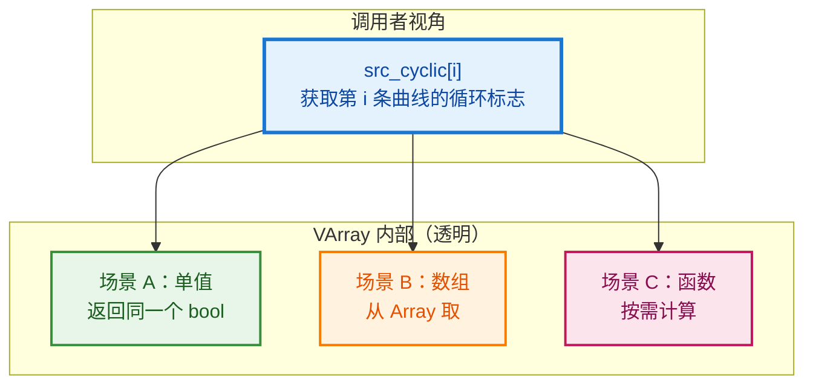
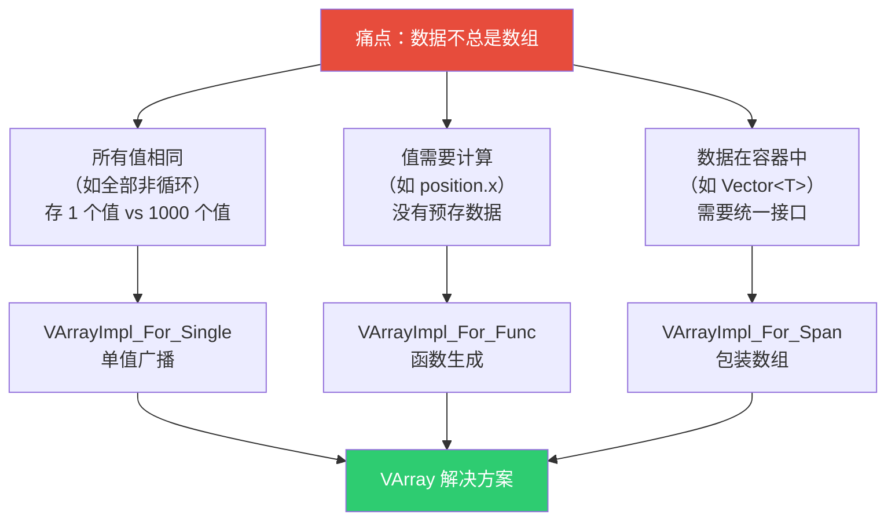
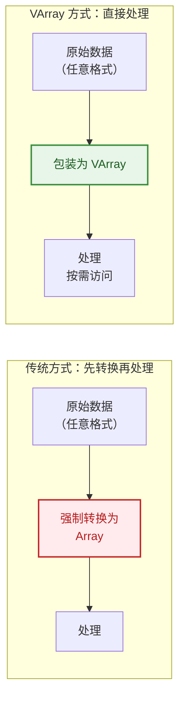
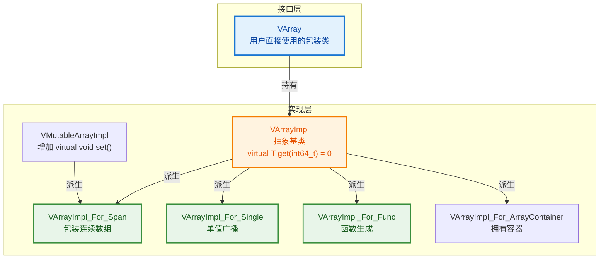
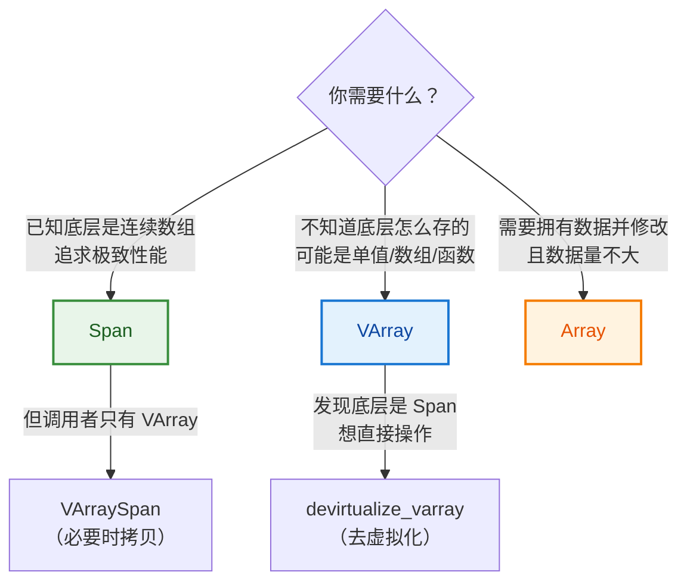
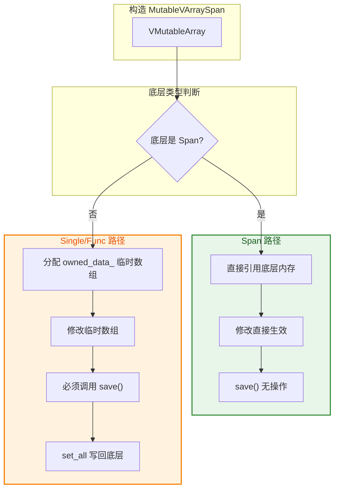

# VArray / GVArray 完全指南

> 从 `curves.cyclic()` 的一行代码出发，彻底理解 Blender 的虚拟数组系统。
>
> 核心源码：`source/blender/blenlib/BLI_virtual_array.hh`

---

## 目录

1. [从一个问题出发](#1-从一个问题出发)
2. [VArray 解决什么痛点](#2-varray-解决什么痛点)
3. [三种底层实现](#3-三种底层实现)
4. [VArray vs Span vs Array](#4-varray-vs-span-vs-array)
5. [源码中的真实用例](#5-源码中的真实用例)
6. [GVArray：类型擦除版](#6-gvarray类型擦除版)
7. [可写版本与辅助类](#7-可写版本与辅助类)
8. [去虚拟化优化](#8-去虚拟化优化)

---

## 1. 从一个问题出发

### 1.1 这行代码在干什么？

```cpp
// source/blender/geometry/intern/curves_remove_and_split.cc:20
const VArray<bool> src_cyclic = curves.cyclic();
```

**直觉问题**：
- 为什么返回 `VArray<bool>`？直接返回 `Array<bool>` 或 `Span<bool>` 不行吗？
- `VArray` 和 `Array` 有什么区别？
- 这行代码背后隐藏了什么设计思想？

### 1.2 先看一下 `CurvesGeometry::cyclic()` 可能返回什么

在 Blender 中，每条曲线有一个 `cyclic` 标志（是否首尾相连形成闭环）。这个数据的存储方式**不是固定的**：

| 场景 | 底层存储 | 示例 |
|------|----------|------|
| **所有曲线都是非循环的** | 单个 `false` 值 | 1000 条曲线，只需要 1 个 bool |
| **所有曲线都是循环的** | 单个 `true` 值 | 1000 条曲线，只需要 1 个 bool |
| **混合情况** | `Array<bool>`，每条曲线一个值 | 曲线 0 循环，曲线 1 不循环... |

**关键洞察**：如果强制返回 `Array<bool>`，前两种场景会浪费 999 个 bool 的内存。如果返回 `Span<bool>`，前两种场景根本无法表示（没有数组可引用）。

**VArray 的解决方案**：统一接口，底层可以是"单值"、"数组"、甚至"函数"，调用者完全不用关心。



---

## 2. VArray 解决什么痛点

### 2.1 文件头注释详解

源码文件 [BLI_virtual_array.hh](../../source/blender/blenlib/BLI_virtual_array.hh) 开头的注释翻译：

> **"A virtual array is a data structure that behaves similarly to an array, but its elements are accessed through virtual methods."**
>
> 虚拟数组是一种行为类似数组的数据结构，但它的元素通过虚方法访问。

> **"Its purpose is to allow code that uses arrays to also work with data that is not actually stored as an array. For example, a virtual array can represent a single value that is used for every index, or it can represent a function that computes a value for each index."**
>
> 它的目的是让使用数组的代码也能处理**实际上不是以数组形式存储的数据**。例如，虚拟数组可以表示"每个索引都返回同一个值"，或者"每个索引通过函数计算值"。

> **"The disadvantage of using a virtual array is that calling a virtual method for every element access has some overhead compared to accessing elements in a plain array. However, in many cases, the overhead is negligible or is offset by the benefits of not having to convert data into an array format first."**
>
> 缺点是：每次元素访问都要调用虚方法，比直接访问数组有额外开销。但在很多场景下，这个开销可以忽略，或者被"不需要先把数据转成数组格式"的优势所抵消。

> **"In some cases, the overhead of virtual method calls can be avoided by "devirtualizing" the virtual array. This means that the code that uses the virtual array is compiled multiple times for different storage types. This is useful when the overhead of virtual method calls is significant."**
>
> 某些情况下，可以通过"去虚拟化"避免虚方法调用开销——即为不同的存储类型编译多份代码。当虚方法开销显著时很有用。



### 2.2 痛点一：调用者不想做数据转换

假设你写了一个函数，接受一组浮点数做某种计算：

```cpp
// ❌ 方案 A：接受 Span<float>（太严格）
void process(Span<float> values) {
    for (float v : values) { /* ... */ }
}

// 调用者必须先把数据转成连续数组
Vector<float> vec = {1.0f, 2.0f, 3.0f};
process(vec);  // ✅ 可以

// 但如果是单值广播呢？
process(Span<float>(/* 只有一个 float，没法构造 Span */));  // ❌ 不行！
```

```cpp
// ✅ 方案 B：接受 VArray<float>（灵活）
void process(VArray<float> values) {
    for (int64_t i : values.index_range()) {
        float v = values[i];  // 不管底层是什么，都能访问
    }
}

// 从数组构造
Array<float> arr = {1.0f, 2.0f, 3.0f};
process(VArray<float>::from_span(arr));  // ✅

// 从单值构造（1000 个元素都是 42.0f）
process(VArray<float>::from_single(42.0f, 1000));  // ✅

// 从函数构造
process(VArray<float>::from_func(100, [](int64_t i) { return float(i) * 0.5f; }));  // ✅
```

### 2.2 痛点二：有些数据根本不存在于内存中

字段系统（Field System）的核心特性是**延迟计算**。比如用户输入了一个 `"position"` 字段，它的值不是预先存好的，而是在求值时根据几何体实时计算出来的。

```cpp
// 字段求值结果就是一个 VArray
// 底层根本没有 Array<float3>，只有一个计算函数
VArray<float3> positions = evaluator.get_evaluated<float3>(0);

// 访问 positions[10] 时，才会调用底层函数计算第 10 个点的位置
float3 pos = positions[10];
```

### 2.3 痛点三：性能与灵活性的权衡

```cpp
// 文件头注释的核心思想（BLI_virtual_array.hh:7~26）

/*
 * A virtual array is a data structure that behaves similarly to an array,
 * but its elements are accessed through virtual methods.
 *
 * 优点：调用者不必知道数据怎么存的，甚至不必存于内存中
 * 缺点：访问单个元素有虚函数调用开销
 *
 * 权衡：如果最终只访问少量元素，避免了"把所有数据展开成数组"的昂贵转换
 */
```



---

## 3. 三种底层实现

`VArray<T>` 本身只是一个**包装器**，真正的逻辑在 `VArrayImpl<T>` 的各种子类中。

### 3.1 类层次结构



### 3.2 VArrayImpl — 抽象基类注释详解

```cpp
// BLI_virtual_array.hh:88~99
template<typename T> class VArrayImpl {
 public:
  virtual ~VArrayImpl() = default;

  /* Get the element at the given index. */
  virtual T get(const int64_t index) const = 0;

  /* Return info about the virtual array implementation that allows for
   * optimizations. For example, it may tell whether the virtual array is
   * stored as a span or as a single value. */
  virtual CommonVArrayInfo common_info() const
  {
    return CommonVArrayInfo{};
  }
  // ...
};
```

> **`get(index)` 注释**："Get the element at the given index."——获取给定索引处的元素。这是所有虚拟数组实现的核心方法——每个子类都必须实现它。
>
> **`common_info()` 注释**："Return info about the virtual array implementation that allows for optimizations. For example, it may tell whether the virtual array is stored as a span or as a single value."——返回虚拟数组实现的信息，用于优化。例如，可以告诉调用者底层是 Span 还是 Single。
>
> **为什么 `common_info()` 有默认实现？** 因为不是所有实现都需要特殊优化。`VArrayImpl_For_Func`（函数生成）就用默认实现（返回 `Type::Any`），因为函数没有可优化的内部结构。而 `VArrayImpl_For_Span` 和 `VArrayImpl_For_Single` 重写了此方法，返回 `Type::Span` 和 `Type::Single`，让调用者可以走快速路径。

### 3.3 实现一：VArrayImpl_For_Span（包装数组）

```cpp
// BLI_virtual_array.hh:204~264
template<typename T> class VArrayImpl_For_Span : public VMutableArrayImpl<T> {
 protected:
  T *data_ = nullptr;

 public:
  VArrayImpl_For_Span(const MutableSpan<T> data)
      : VMutableArrayImpl<T>(data.size()), data_(data.data()) {}

  T get(const int64_t index) const final {
    return data_[index];  // 直接数组访问
  }

  void set(const int64_t index, T value) final {
    data_[index] = value;  // 直接数组写入
  }

  CommonVArrayInfo common_info() const override {
    return CommonVArrayInfo(CommonVArrayInfo::Type::Span, true, data_);
  }
};
```

**特点**：
- 底层就是一块连续内存
- `get()` 直接 `data_[index]`，最快
- `common_info()` 返回 `Type::Span`，让外部知道可以优化

### 3.3 实现二：VArrayImpl_For_Single（单值广播）

```cpp
// BLI_virtual_array.hh:314~366
template<typename T> class VArrayImpl_For_Single final : public VArrayImpl<T> {
 private:
  T value_;

 public:
  VArrayImpl_For_Single(T value, const int64_t size)
      : VArrayImpl<T>(size), value_(std::move(value)) {}

  T get(const int64_t /*index*/) const override {
    return value_;  // 不管 index 是什么，返回同一个值
  }

  CommonVArrayInfo common_info() const override {
    return CommonVArrayInfo(CommonVArrayInfo::Type::Single, true, &value_);
  }
};
```

**特点**：
- 所有索引返回同一个值
- 内存占用极小（只有一个 `T`）
- `materialize` 优化：用 `fill` 而不是逐个 `get`

**用例**：`curves.cyclic()` 在所有曲线都是非循环时，底层就是这个实现。

### 3.5 实现三：VArrayImpl_For_Func（函数生成）

```cpp
// BLI_virtual_array.hh:375~423
template<typename T, typename GetFunc> class VArrayImpl_For_Func final : public VArrayImpl<T> {
```

> **类注释**："This class makes it easy to create a virtual array for an existing function or lambda. The `GetFunc` should take a single `index` argument and return the value at that index."——这个类让为已有函数或 lambda 创建虚拟数组变得容易。`GetFunc` 应该接受一个 `index` 参数并返回该索引处的值。
>
> **为什么用模板参数 `GetFunc` 而非 `std::function<T(int64_t)>`？** 性能！`GetFunc` 是模板参数，编译器可以内联 lambda 的调用。`std::function` 有类型擦除开销（虚函数调用 + 堆分配）。源码也提供了 `from_std_func` 作为慢速替代——注释说："Same as #from_func, but uses a std::function instead of a template. This is slower, but requires less code generation. Therefore this should be used in non-performance critical code."（和 from_func 相同，但用 std::function 代替模板。更慢，但需要更少的代码生成。因此应该用在非性能关键代码中。）

### 3.6 实现四：VArrayImpl_For_DerivedSpan（派生 Span）

```cpp
// BLI_virtual_array.hh:428~495
template<typename StructT,
         typename ElemT,
         ElemT (*GetFunc)(const StructT &),
         void (*SetFunc)(StructT &, ElemT) = nullptr>
class VArrayImpl_For_DerivedSpan final : public VMutableArrayImpl<ElemT> {
```

> **类注释**："This is `final` so that #may_have_ownership can be implemented reliably."——标记为 `final` 以便 `may_have_ownership` 能可靠实现。`final` 阻止进一步继承，确保 `common_info()` 的 `may_have_ownership` 逻辑不会被错误覆盖。
>
> **这是什么？** 一个"转换视图"——底层存储的是 `StructT` 数组，但对外暴露为 `ElemT` 数组。每次 `get(index)` 调用 `GetFunc(data_[index])` 把 `StructT` 转为 `ElemT`。
>
> **模板参数**：
> - `StructT`：底层存储的结构类型（如 `float4`）
> - `ElemT`：对外暴露的元素类型（如 `float3`）
> - `GetFunc`：从 `StructT` 提取 `ElemT` 的函数指针
> - `SetFunc`：将 `ElemT` 写回 `StructT` 的函数指针（可选，`nullptr` 表示只读）
>
> **用例**：Blender 的自定义属性存储为 `float4`（4 字节对齐），但用户访问的是 `float3`（3 字节）。`VArrayImpl_For_DerivedSpan` 提供了一个零拷贝的"视图"——不需要把 `float4[]` 转成 `float3[]`，每次访问时调用转换函数。

```cpp
// BLI_virtual_array.hh:375~423
template<typename T, typename GetFunc> class VArrayImpl_For_Func final : public VArrayImpl<T> {
 private:
  GetFunc get_func_;

 public:
  VArrayImpl_For_Func(const int64_t size, GetFunc get_func)
      : VArrayImpl<T>(size), get_func_(std::move(get_func)) {}

  T get(const int64_t index) const override {
    return get_func_(index);  // 调用函数生成值
  }
};
```

**特点**：
- 没有预存数据，每次 `get()` 都调用函数
- 用于字段求值结果、派生属性等
- 最灵活，但也最慢（每次都有函数调用开销）

### 3.7 CommonVArrayInfo：快速类型探测

```cpp
// BLI_virtual_array.hh:47~71
struct CommonVArrayInfo {
  enum class Type : uint8_t {
    Any,    // 通用类型（如 Func）
    Span,   // 底层是连续数组
    Single, // 底层是单值广播
  };

  Type type = Type::Any;
  bool may_have_ownership = true;
  const void *data;  // 指向底层数据
};
```

> **`may_have_ownership` 注释**（源码中的 `VArrayImpl_For_Span_final` 和 `VArrayImpl_For_DerivedSpan`）："Whether the virtual array implementation may own the memory. This is useful to determine whether the data can be accessed safely even after the original data source has been modified or freed."——虚拟数组实现是否可能拥有内存。用于判断即使原始数据源被修改或释放后，数据是否仍然安全访问。
>
> - `Span` 模式：`may_have_ownership = true`（可能拥有，取决于是否通过 `from_container` 创建）
> - `Single` 模式：`may_have_ownership = true`（拥有单值的拷贝）
> - `Func` 模式：`may_have_ownership = true`（函数可能持有捕获变量的所有权）
>
> **`VArrayImpl_For_DerivedSpan` 特殊处理**：它的 `may_have_ownership = false`——因为它只是一个视图，不拥有底层数据。

**作用**：通过一次虚函数调用 `common_info()`，外部就能知道底层是什么类型，从而选择优化路径。

```cpp
VArray<float> varray = get_some_varray();

// 快速检查底层类型
if (varray.is_single()) {
    // 所有值相同，可以用 fill 优化
    float val = varray.get_internal_single();
    // ...
}
else if (varray.is_span()) {
    // 底层是连续数组，可以直接拿指针
    Span<float> span = varray.get_internal_span();
    // ...
}
```

---

## 4. VArray vs Span vs Array

| 特性 | `Span<T>` | `VArray<T>` | `Array<T>` |
|------|-----------|-------------|------------|
| **只读/可写** | 只读视图 | 只读（`VMutableArray` 可写） | 可写 |
| **底层形态** | 必须是连续数组 | Span / Single / Func 都可以 | 连续数组 |
| **内存拥有** | 不拥有 | 可选（取决于实现） | 拥有 |
| **访问开销** | O(1)，直接指针 | O(1) + 虚函数开销 | O(1)，直接指针 |
| **单值广播** | ❌ 不支持 | ✅ 支持 | ❌ 不支持（浪费内存） |
| **函数生成** | ❌ 不支持 | ✅ 支持 | ❌ 不支持 |
| **适用场景** | 已知底层是数组 | 不知道底层形态 | 需要拥有并修改数据 |

### 选择指南



---

## 5. 源码中的真实用例

### 5.1 用例一：curves.cyclic()（属性读取）

```cpp
// source/blender/geometry/intern/curves_remove_and_split.cc:20
const VArray<bool> src_cyclic = curves.cyclic();

// 后续使用：像普通数组一样索引访问
const bool curve_cyclic = src_cyclic[curve_i];
```

**为什么用 VArray？**
- `cyclic` 属性可能以单值存储（所有曲线相同）
- 也可能以数组存储（每条曲线不同）
- 调用者不需要关心，统一用 `operator[]` 访问

### 5.2 用例二：字段求值结果

```cpp
// node_geo_curve_split.cc:183~187
fn::FieldEvaluator evaluator{field_context, src_curves.points_num()};
evaluator.add(selection_field);
evaluator.evaluate();

const IndexMask selection = evaluator.get_evaluated_as_mask(0);
```

**内部实现**：`FieldEvaluator` 的求值结果底层是 `GVArray`（`VArray` 的类型擦除版），可能来自：
- 直接从几何体属性读取（Span）
- 常量字段（Single）
- 复杂表达式计算（Func）

### 5.3 用例三：函数参数解耦

```cpp
// 某处理函数接受 VArray，不关心底层
void process_curves(const CurvesGeometry &curves,
                    const VArray<bool> &cyclic_flags)  // 可以是 Single 或 Span
{
    for (const int i : curves.curves_range()) {
        if (cyclic_flags[i]) {
            // 处理循环曲线...
        }
    }
}

// 调用方式 1：从 CurvesGeometry 获取（可能是 Single）
process_curves(curves, curves.cyclic());

// 调用方式 2：手动构造 Single（测试用）
process_curves(curves, VArray<bool>::from_single(false, curves.curves_num()));
```

---

## 6. GVArray：类型擦除版

### 6.1 为什么需要 GVArray？

`VArray<T>` 的 `T` 在**编译期**确定。但属性系统的场景是：运行期才知道属性是什么类型（`float`、`float3`、`int`...）。

```cpp
// 属性查找返回 GVArray（类型在运行期确定）
std::optional<GVArray> attribute = attributes.lookup("position");

// 检查类型
if (attribute->type() == CPPType::get<float3>()) {
    // 安全地转回具体类型
    VArray<float3> typed = attribute->typed<float3>();
    float3 pos = typed[0];
}
```

### 6.2 GVArray 与 VArray 的关系

```mermaid
flowchart TB
    subgraph 编译期类型["编译期确定类型"]
        VA_F["VArray<float>"]
        VA_I["VArray<int>"]
        VA_3["VArray<float3>"]
    end

    subgraph 运行期类型["运行期确定类型"]
        GVA["GVArray<br/>持有 CPPType*<br/>+ VArrayImpl<void>*"]
    end

    VA_F -->|擦除类型| GVA
    VA_I -->|擦除类型| GVA
    VA_3 -->|擦除类型| GVA

    GVA -->|typed<float>()| VA_F
    GVA -->|typed<int>()| VA_I

    style GVA fill:#fce4ec,stroke:#c2185b,stroke-width:3px,color:#880e4f
```

### 6.3 类型擦除的代价

```cpp
// GVArray 的 get 需要知道类型大小，返回 void*
void GVArray::get_to_uninitialized(int64_t index, void *r_value) const;

// 对比 VArray<T> 的直接返回值
T VArray<T>::operator[](int64_t index) const;
```

`GVArray` 更通用但使用更麻烦，通常在属性系统、字段系统等需要处理"任意类型"的场景使用。

---

## 7. 可写版本与辅助类

### 7.0 VArrayCommon 注释详解

```cpp
// BLI_virtual_array.hh:504~511
/**
 * Utility class to reduce code duplication for methods available on #VArray and #VMutableArray.
 * Deriving #VMutableArray from #VArray would have some issues:
 * - Static methods on #VArray would also be available on #VMutableArray.
 * - It would allow assigning a #VArray to a #VMutableArray under some circumstances which is not
 *   allowed and could result in hard to find bugs.
 */
template<typename T> class VArrayCommon {
```

> **为什么用 `VArrayCommon` 而非让 `VMutableArray` 继承 `VArray`？** 注释解释了两个问题：
>
> 1. **静态方法泄漏**：如果 `VMutableArray` 继承 `VArray`，`VArray` 的静态方法（如 `VArray::from_single`）也会出现在 `VMutableArray` 上——但 `from_single` 创建的是只读虚拟数组，不应该出现在可写类型上
> 2. **隐式转换风险**：继承会允许在某些情况下把 `VArray` 赋值给 `VMutableArray`——这是不允许的，因为只读数组不能当可写数组用，可能导致难以发现的 bug
>
> 所以 `VArrayCommon` 是**组合**而非继承——`VArray` 和 `VMutableArray` 都继承 `VArrayCommon`，共享通用方法，但各自有独立的接口。

### 7.0.1 VArray 类注释详解

```cpp
// BLI_virtual_array.hh:720~724
/**
 * A #VArray wraps a virtual array implementation and provides easy access to its elements. It can
 * be copied and moved. While it is relatively small, it should still be passed by reference if
 * possible (other than e.g. #Span).
 */
template<typename T> class VArray : public VArrayCommon<T> {
```

> **"It can be copied and moved"**——VArray 可以拷贝和移动。拷贝 VArray 是浅拷贝——只复制 `impl_`（`AnyDerived`），不复制底层数据。底层通过 `shared_ptr` 共享。
>
> **"While it is relatively small, it should still be passed by reference if possible (other than e.g. #Span)"**——虽然 VArray 相对较小（约 32-48 字节），但仍然应该尽量按引用传递。注意 `Span` 不同——`Span` 只有 16 字节（指针+大小），按值传递和按引用传递性能差不多，所以 `Span` 通常按值传递。但 `VArray` 包含 `AnyDerived`，拷贝需要增加引用计数，开销更大。

### 7.0.2 `operator[]` 注释详解

```cpp
// BLI_virtual_array.hh:543~549
/**
 * Get the element at a specific index.
 * \note This can't return a reference because the value may be computed on the fly. This also
 * implies that one can not use this method for assignments.
 */
T operator[](const int64_t index) const
{
  BLI_assert(*this);
  BLI_assert(index >= 0);
  BLI_assert(index < this->size());
  return impl_->get(index);
}
```

> **"This can't return a reference because the value may be computed on the fly"**——不能返回引用，因为值可能是即时计算的。`VArrayImpl_For_Func` 每次调用 `get()` 都计算一个新值，这个值存在临时变量中，函数返回后就没了——无法返回引用。
>
> **"This also implies that one can not use this method for assignments"**——这也意味着不能用 `[]` 赋值。`varray[i] = value` 需要返回引用，但 `operator[]` 返回值（`T`），不是引用（`T&`）。可写版本用 `VMutableArray::set(index, value)` 代替。

### 7.0.3 varray_tag 注释详解

```cpp
// BLI_virtual_array.hh:707~718
/**
 * Various tags to disambiguate constructors of virtual arrays.
 * Generally it is easier to use `VArray::from_*` functions to construct virtual arrays, but
 * sometimes being able to use the constructor can result in better performance. For example, when
 * constructing the virtual array directly in a vector. Without the constructor one would have to
 * construct the virtual array first and then move it into the vector.
 */
namespace varray_tag {
struct span {};
struct single_ref {};
struct single {};
}  // namespace varray_tag
```

> **"Various tags to disambiguate constructors"**——各种标签，用于消除构造函数的歧义。因为 `VArray` 的构造函数可能接受多种参数类型，标签帮助编译器区分。
>
> **"Sometimes being able to use the constructor can result in better performance"**——有时用构造函数比 `from_*` 静态方法性能更好。例如直接在 vector 中构造虚拟数组——用构造函数可以原地构造（`vector.emplace_back(varray_tag::span{}, my_span)`），用 `from_*` 则需要先构造再移动。
>
> | 标签 | 对应 | 等价静态方法 |
> |------|------|------------|
> | `varray_tag::span` | 从 Span 构造 | `VArray::from_span()` |
> | `varray_tag::single` | 从单值构造（拷贝） | `VArray::from_single()` |
> | `varray_tag::single_ref` | 从单值引用构造 | 无直接等价 |

### 7.1 VMutableArray<T>

```cpp
// 可写的虚拟数组
template<typename T> class VMutableArray : public VArrayCommon<T> {
 public:
    void set(int64_t index, T value);  // 写入
    void set_all(Span<T> src);         // 批量写入
    operator VArray<T>() const;        // 隐式转只读
};
```

### 7.2 VArraySpan：VArray → Span 的桥梁

```cpp
// BLI_virtual_array.hh:948~1003
template<typename T> class VArraySpan final : public Span<T> {
 private:
  VArray<T> varray_;
  Array<T> owned_data_;  // 如果底层不是 Span，需要拷贝到这里

 public:
  VArraySpan(VArray<T> &&varray) : varray_(std::move(varray)) {
    const CommonVArrayInfo info = varray_.common_info();
    if (info.type == CommonVArrayInfo::Type::Span) {
      // 底层就是 Span，直接引用，零拷贝！
      this->data_ = static_cast<const T *>(info.data);
    }
    else {
      // 底层是 Single 或 Func，必须拷贝到数组
      owned_data_.~Array();
      new (&owned_data_) Array<T>(varray_.size(), NoInitialization{});
      varray_.materialize_to_uninitialized(owned_data_);
      this->data_ = owned_data_.data();
    }
  }
};
```

**使用场景**：某个 API 只接受 `Span<T>`，但你的数据是 `VArray<T>`。

```cpp
void api_only_accepts_span(Span<float> data);  // 第三方 API

VArray<float> varray = get_varray();
VArraySpan<float> varray_span(varray);  // 如果底层是 Span，零拷贝；否则拷贝
api_only_accepts_span(varray_span);      // ✅
```

### 7.3 MutableVArraySpan：可写版 + save() 机制

```cpp
// BLI_virtual_array.hh:1016~1114
template<typename T> class MutableVArraySpan final : public MutableSpan<T> {
 private:
  VMutableArray<T> varray_;
  Array<T> owned_data_;
  bool save_has_been_called_ = false;

 public:
  MutableVArraySpan(VMutableArray<T> varray) : varray_(std::move(varray)) {
    const CommonVArrayInfo info = varray_.common_info();
    if (info.type == CommonVArrayInfo::Type::Span) {
      this->data_ = const_cast<T *>(static_cast<const T *>(info.data));
    }
    else {
      // 分配临时数组，修改这里
      owned_data_.reinitialize(varray_.size());
      this->data_ = owned_data_.data();
    }
  }

  // 关键：将修改写回底层虚拟数组
  void save() {
    save_has_been_called_ = true;
    if (this->data_ != owned_data_.data()) {
      return;  // 底层就是 Span，修改已直接生效
    }
    varray_.set_all(owned_data_);  // 将临时数组写回
  }

  ~MutableVArraySpan() {
    if (!save_has_been_called_) {
      print_mutable_varray_span_warning();  // 忘记 save 会警告！
    }
  }
};
```

**关键设计**：
- 如果底层是 Span，直接操作底层内存，`save()` 什么都不做
- 如果底层是 Single/Func，修改的是临时数组，必须调用 `save()` 写回
- 析构时检查是否调用了 `save()`，防止忘记写回



---

## 8. 去虚拟化优化

### 8.1 问题：虚函数调用有开销

```cpp
VArray<float> varray = get_varray();
for (int64_t i = 0; i < varray.size(); i++) {
    float v = varray[i];  // 每次都有虚函数调用！
}
```

如果循环 100 万次，虚函数调用的累积开销可能很显著。

### 8.2 解决方案：编译期生成多版本

```cpp
// BLI_virtual_array.hh:1183~1194
template<typename T, typename Func>
inline void devirtualize_varray(const VArray<T> &varray, const Func &func, bool enable = true) {
  if (enable) {
    if (call_with_devirtualized_parameters(
            std::make_tuple(VArrayDevirtualizer<T, true, true>{varray}), func)) {
      return;  // 成功去虚拟化，直接返回
    }
  }
  func(VArrayRef<T>(varray));  // 回退：普通虚函数调用
}
```

**原理**：
1. 检查 `varray.common_info()` 的底层类型
2. 如果是 `Span`，调用 `func(Span<T>())`
3. 如果是 `Single`，调用 `func(SingleAsSpan<T>())`
4. 如果是 `Any`，回退到 `func(VArrayRef<T>())`

```cpp
// 使用示例
devirtualize_varray(varray, [&](auto &&span) {
    // 这里的 span 可能是 Span<T>、SingleAsSpan<T> 或 VArrayRef<T>
    // 编译器会为每种情况生成一份代码
    for (int64_t i = 0; i < span.size(); i++) {
        float v = span[i];  // 如果是 Span，直接内联；如果是 Single，直接返回单值
    }
});
```

### 8.3 注意事项

```cpp
// 文件注释警告（BLI_virtual_array.hh:1176~1182）
/*
 * One has to be careful with nesting multiple devirtualizations,
 * because that results in an exponential number of function instantiations.
 *
 * 嵌套多个去虚拟化会导致指数级代码膨胀！
 * 2 个 varray × 3 种类型 = 9 个版本
 * 3 个 varray × 3 种类型 = 27 个版本
 */
```

---

## 总结速查表

| 概念 | 一句话解释 |
|------|-----------|
| **VArray<T>** | "像数组一样用，但底层可能是数组/单值/函数" |
| **VArrayImpl_For_Span** | 底层包装连续数组，最快 |
| **VArrayImpl_For_Single** | 底层只有一个值，所有索引返回同一个 |
| **VArrayImpl_For_Func** | 底层是函数，按需计算 |
| **CommonVArrayInfo** | 快速探测底层类型，用于优化分支 |
| **GVArray** | VArray 的类型擦除版，运行期才知道 `T` |
| **VArraySpan** | VArray → Span 的适配器，必要时拷贝 |
| **MutableVArraySpan** | 可写适配器，`save()` 写回机制 |
| **devirtualize_varray** | 编译期生成多版本，消除虚函数开销 |

| 场景 | 推荐类型 |
|------|----------|
| 属性读取（如 `curves.cyclic()`） | `VArray<T>` |
| 字段求值结果 | `GVArray` → `typed<T>()` |
| 已知底层是数组，追求性能 | `Span<T>` |
| API 只接受 Span，但数据是 VArray | `VArraySpan<T>` |
| 需要修改 VArray 的数据 | `MutableVArraySpan<T>` + `save()` |
| 处理大量数据，虚函数开销显著 | `devirtualize_varray` |

---

## 相关文件

| 文件 | 路径 |
|------|------|
| `BLI_virtual_array.hh` | `source/blender/blenlib/` |
| `BLI_span.hh` | `source/blender/blenlib/` |
| `BLI_cpp_type.hh` | `source/blender/blenlib/` |
| `curves_remove_and_split.cc` | `source/blender/geometry/intern/` |
| `node_geo_curve_split.cc` | `source/blender/nodes/geometry/nodes/` |
