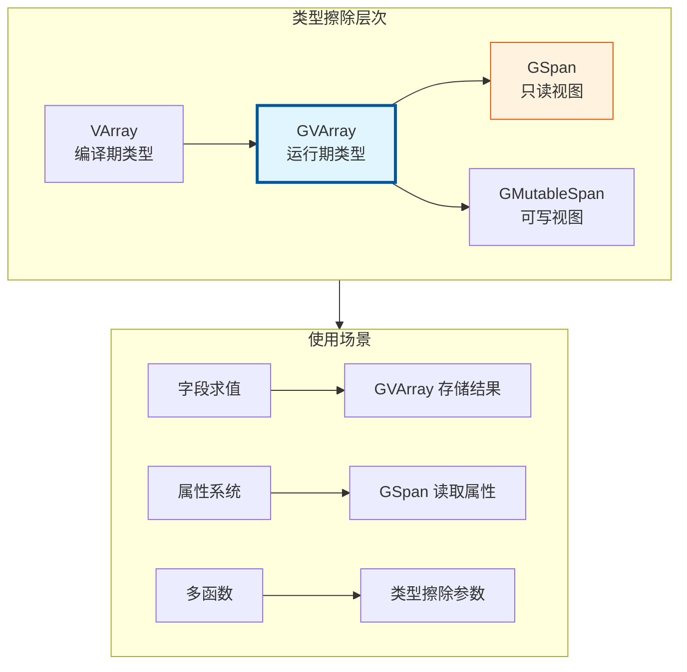
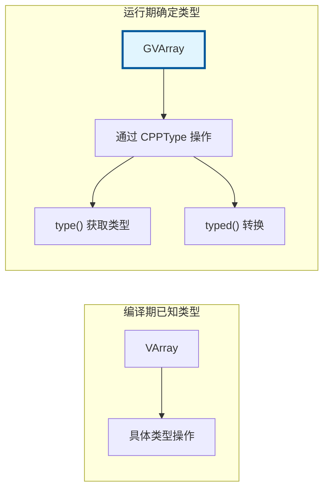
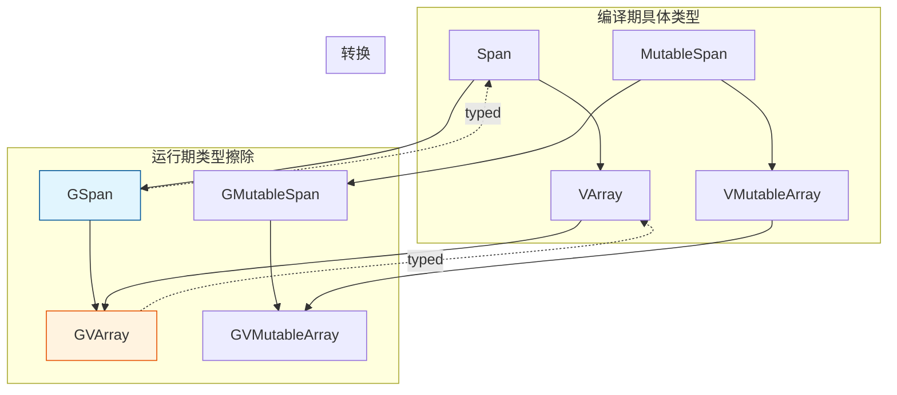

# VArray<T> / GVArray / GSpan - 类型擦除数组

> 在不知道具体类型的情况下操作数组，是字段系统和属性系统的核心

---

## 🎯 核心概念



---

## 📦 VArray<T> - 虚拟数组

### 核心特性

`VArray<T>` 是一个**只读**的虚拟数组接口，底层可以是：
- 实际数组（`Array<T>`、`Vector<T>`）
- 单值广播（所有元素相同）
- 函数生成（按需计算）

```cpp
#include "BLI_virtual_array.hh"

namespace blender::nodes {

void varray_examples() {
    // 1. 从 Vector 构造
    Vector<float> vec = {1.0f, 2.0f, 3.0f, 4.0f, 5.0f};
    VArray<float> varray1 = VArray<float>::ForContainer(vec);
    
    // 2. 单值广播（所有元素都是 42）
    VArray<float> varray2 = VArray<float>::ForSingle(42.0f, 1000);
    
    // 3. 函数生成（按需计算）
    VArray<float> varray3 = VArray<float>::ForFunc(
        100,
        [](const int64_t i) { return float(i) * 0.5f; }
    );
    
    // 4. 访问元素
    float val = varray1[0];  // 1.0f
    
    // 5. 检查是否为单值
    if (varray1.is_single()) {
        float single_val = varray1.get_internal_single();
    }
}

} // namespace blender::nodes
```

### 常用操作

```cpp
void varray_operations() {
    VArray<float> varray = get_varray();
    
    // 大小
    int64_t size = varray.size();
    bool empty = varray.is_empty();
    
    // 索引访问
    float val = varray[10];
    
    // 尝试获取内部数组（如果是实际数组）
    const float *data = varray.try_get_internal_single();
    
    // 遍历
    for (int64_t i : varray.index_range()) {
        float value = varray[i];
    }
    
    // 转换为 Span（如果可能）
    std::optional<Span<float>> span = varray.try_get_internal_span();
}
```

---

## 🌐 GVArray - 类型擦除的 VArray

### 核心概念

`GVArray` 是 `VArray<T>` 的类型擦除版本，在**运行期**才知道元素类型。



### 使用示例

```cpp
#include "BLI_virtual_array.hh"
#include "BLI_cpp_type.hh"

namespace blender::nodes {

void gvarray_examples() {
    // 1. 从 VArray<float3> 构造
    VArray<float3> typed_varray = VArray<float3>::ForSingle(float3(1, 2, 3), 100);
    GVArray gvarray(typed_varray);
    
    // 2. 获取类型
    const CPPType &type = gvarray.type();
    std::cout << "Type: " << type.name << std::endl;
    
    // 3. 类型检查
    if (gvarray.type() == CPPType::get<float3>()) {
        // 安全地转换为具体类型
        VArray<float3> typed = gvarray.typed<float3>();
        float3 val = typed[0];
    }
    
    // 4. 通用访问（类型擦除）
    void *buffer = MEM_mallocN(type.size, __func__);
    gvarray.get_to_uninitialized(0, buffer);  // 获取第0个元素
    type.destruct(buffer);
    MEM_freeN(buffer);
}

} // namespace blender::nodes
```

---

## 📏 GSpan - 类型擦除的 Span

### 核心概念

`GSpan` 是 `Span<T>` 的类型擦除版本，用于**只读**访问类型未知的数组。

```cpp
#include "BLI_span.hh"

namespace blender::nodes {

void gspan_examples() {
    // 1. 从 Span<float3> 构造
    Array<float3> positions(100);
    Span<float3> span = positions;
    GSpan gspan(span);
    
    // 2. 获取类型
    const CPPType &type = gspan.type();
    
    // 3. 类型检查并转换
    if (gspan.type() == CPPType::get<float3>()) {
        Span<float3> typed = gspan.typed<float3>();
        // 使用 typed...
    }
    
    // 4. 大小
    int64_t size = gspan.size();
    
    // 5. 元素访问（类型擦除）
    const void *element = gspan[0];  // 返回 void*
}

} // namespace blender::nodes
```

---

## ✏️ GMutableSpan - 类型擦除的可写 Span

```cpp
#include "BLI_span.hh"

namespace blender::nodes {

void gmutable_span_examples() {
    // 1. 构造
    Array<float> data(100);
    GMutableSpan gspan(CPPType::get<float>(), data.data(), data.size());
    
    // 2. 设置值
    float value = 42.0f;
    gspan.set(0, &value);  // 设置第0个元素
    
    // 3. 批量填充
    gspan.fill(&value);
    
    // 4. 从 GSpan 构造（拷贝）
    GSpan src = get_source_data();
    Array<uint8_t> buffer(src.type().size * src.size());
    GMutableSpan dst(src.type(), buffer.data(), src.size());
    dst.copy_from(src);
}

} // namespace blender::nodes
```

---

## 🎯 节点开发中的典型用法

### 模式 1：字段求值结果

```cpp
static void node_geo_exec(GeoNodeExecParams params)
{
    GeometrySet geometry = params.extract_input<GeometrySet>("Geometry"_ustr);
    const Field<float> field = params.extract_input<Field<float>>("Value"_ustr);
    
    if (Mesh *mesh = geometry.get_mesh()) {
        const bke::MeshFieldContext context(*mesh, bke::AttrDomain::Point);
        fn::FieldEvaluator evaluator(context, mesh->totvert);
        
        // 分配输出缓冲区
        Array<float> result(mesh->totvert);
        evaluator.add_with_destination(field, result.as_mutable_span());
        evaluator.evaluate();
        
        // result 现在包含字段求值结果
    }
}
```

### 模式 2：通用属性读取

```cpp
static void process_generic_attribute(const bke::AttributeAccessor &attributes,
                                      StringRef name)
{
    // 查找属性（返回 GVArray）
    std::optional<GVArray> attribute = attributes.lookup(name);
    if (!attribute) {
        return;
    }
    
    const CPPType &type = attribute->type();
    int64_t size = attribute->size();
    
    // 根据类型处理
    if (type == CPPType::get<float>()) {
        VArray<float> typed = attribute->typed<float>();
        for (int64_t i : typed.index_range()) {
            float value = typed[i];
            // 处理...
        }
    }
    else if (type == CPPType::get<float3>()) {
        VArray<float3> typed = attribute->typed<float3>();
        // 处理...
    }
}
```

### 模式 3：属性写入

```cpp
static void write_generic_attribute(bke::MutableAttributeAccessor &attributes,
                                    StringRef name,
                                    const CPPType &type,
                                    int64_t size)
{
    // 添加属性
    bke::GSpanAttributeWriter writer = attributes.lookup_or_add_for_write(
        name, bke::AttrDomain::Point, type);
    
    if (!writer) {
        return;
    }
    
    // 写入数据
    GMutableSpan span = writer.span;
    for (int64_t i : span.index_range()) {
        // 构造值并写入
        void *value = MEM_mallocN(type.size, __func__);
        type.default_construct(value);
        span.set(i, value);
        type.destruct(value);
        MEM_freeN(value);
    }
    
    writer.finish();
}
```

---

## 🔄 类型转换关系



---

## ✅ 检查清单

- [ ] 理解 VArray 的虚拟数组概念
- [ ] 掌握 GVArray 的类型擦除机制
- [ ] 会用 typed<T>() 进行类型转换
- [ ] 了解 GSpan 和 GMutableSpan 的区别
- [ ] 掌握字段求值中的缓冲区使用

---

## 📁 相关文件

| 文件 | 路径 |
|-----|------|
| BLI_virtual_array.hh | `source/blender/blenlib/BLI_virtual_array.hh` |
| BLI_span.hh | `source/blender/blenlib/BLI_span.hh` |
| BLI_cpp_type.hh | `source/blender/blenlib/BLI_cpp_type.hh` |

---

## 🔗 相关文档

- [09_CPPType.md](09_CPPType.md) - 类型擦除系统
- [10_Field.md](10_Field.md) - 字段系统
