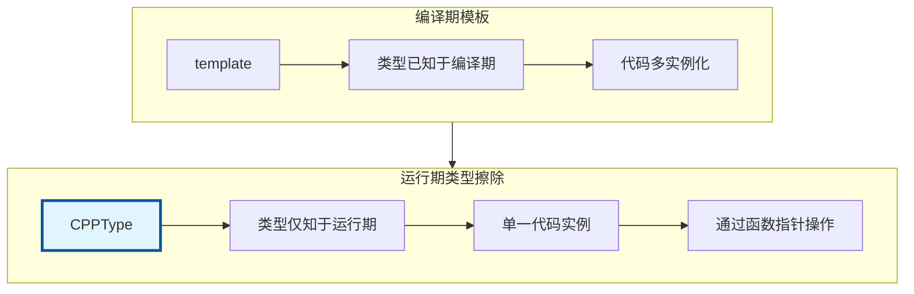
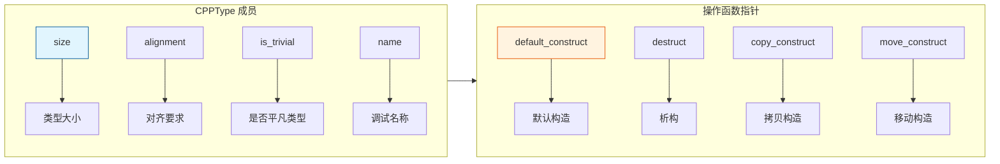

# CPPType - 类型擦除系统

> 在运行期操作任意 C++ 类型的基础设施，是 Blender 泛型编程的核心

---

## 🎯 核心概念



---

## 📦 CPPType 结构



---

## 🚀 获取类型信息

```cpp
#include "BLI_cpp_type.hh"

namespace blender::nodes {

void cpptype_basic_examples() {
    // 1. 获取类型的 CPPType
    const CPPType &float_type = CPPType::get<float>();
    const CPPType &float3_type = CPPType::get<float3>();
    const CPPType &int_type = CPPType::get<int>();
    
    // 2. 查询类型信息
    std::cout << "float size: " << float_type.size << std::endl;           // 4
    std::cout << "float3 size: " << float3_type.size << std::endl;         // 12
    std::cout << "float alignment: " << float_type.alignment << std::endl; // 4
    
    // 3. 检查类型特性
    bool is_trivial = float_type.is_trivial;                          // true
    bool is_destructible = float_type.is_trivially_destructible;      // true
    bool has_special_funcs = float_type.has_special_member_functions; // true
}

} // namespace blender::nodes
```

---

## 🔧 类型操作

### 构造和析构

```cpp
void cpptype_construct_examples() {
    const CPPType &type = CPPType::get<float3>();
    
    // 1. 分配内存
    void *buffer = MEM_mallocN(type.size, __func__);
    
    // 2. 默认构造
    type.default_construct(buffer);  // 相当于 new (buffer) float3()
    
    // 3. 拷贝构造
    float3 source(1, 2, 3);
    type.copy_construct(buffer, &source);  // 相当于 new (buffer) float3(source)
    
    // 4. 使用...
    float3 *value = static_cast<float3 *>(buffer);
    
    // 5. 析构
    type.destruct(buffer);  // 相当于 value->~float3()
    
    // 6. 释放内存
    MEM_freeN(buffer);
}
```

### 批量操作

```cpp
void cpptype_batch_operations() {
    const CPPType &type = CPPType::get<float>();
    int64_t count = 100;
    
    // 分配数组内存
    void *array = MEM_mallocN(type.size * count, __func__);
    
    // 批量默认构造
    type.default_construct_n(array, count);
    
    // 批量填充（用默认值）
    type.fill_default_indices(array, IndexMask(IndexRange(count)));
    
    // 批量析构
    type.destruct_n(array, count);
    
    MEM_freeN(array);
}
```

---

## 🎨 类型比较和哈希

```cpp
void cpptype_comparison_examples() {
    const CPPType &float_type1 = CPPType::get<float>();
    const CPPType &float_type2 = CPPType::get<float>();
    const CPPType &int_type = CPPType::get<int>();
    
    // 类型比较（比较指针即可）
    bool same1 = (&float_type1 == &float_type2);  // true - 同一类型
    bool same2 = (&float_type1 == &int_type);     // false - 不同类型
    
    // 哈希（用于 Map/Set）
    uint64_t hash = float_type1.hash();
}
```

---

## 🎯 类型分发

### to_static_type - 编译期分发

```cpp
// 模板函数
template<typename T>
void process_typed_array(Span<T> data) {
    for (const T &value : data) {
        // 处理...
    }
}

// 类型分发
void process_generic_array(GSpan gspan) {
    const CPPType &type = gspan.type();
    
    // 为常见类型生成优化代码
    type.to_static_type<fn::all_types>([&](auto type_tag) {
        using T = typename decltype(type_tag)::type;
        Span<T> typed = gspan.typed<T>();
        process_typed_array(typed);
    });
}
```

---

## 🎯 节点开发中的典型用法

### 模式 1：创建通用缓冲区

```cpp
static Array<uint8_t> create_buffer(const CPPType &type, int64_t size)
{
    // 分配对齐的内存
    Array<uint8_t> buffer(type.size * size, type.alignment);
    
    // 构造所有元素
    type.default_construct_n(buffer.data(), size);
    
    return buffer;
}
```

### 模式 2：类型安全的属性复制

```cpp
static void copy_attribute_data(const GSpan src, GMutableSpan dst)
{
    BLI_assert(src.type() == dst.type());
    BLI_assert(src.size() == dst.size());
    
    const CPPType &type = src.type();
    
    // 类型擦除的拷贝
    for (int64_t i : src.index_range()) {
        void *temp = MEM_mallocN(type.size, __func__);
        src.type().copy_construct(temp, src[i]);
        dst.set(i, temp);
        type.destruct(temp);
        MEM_freeN(temp);
    }
}
```

### 模式 3：多函数参数准备

```cpp
static void prepare_multifn_params(const CPPType &type,
                                   int64_t size,
                                   void *output_buffer)
{
    // 构造输出缓冲区
    type.default_construct_n(output_buffer, size);
    
    // 准备参数...
}
```

---

## 📊 常用类型对照

| C++ 类型 | 获取方式 | size | alignment |
|---------|---------|------|-----------|
| `float` | `CPPType::get<float>()` | 4 | 4 |
| `int` | `CPPType::get<int>()` | 4 | 4 |
| `float3` | `CPPType::get<float3>()` | 12 | 4 |
| `float4` | `CPPType::get<float4>()` | 16 | 16 |
| `float4x4` | `CPPType::get<float4x4>()` | 64 | 16 |
| `bool` | `CPPType::get<bool>()` | 1 | 1 |
| `ColorGeometry4f` | `CPPType::get<ColorGeometry4f>()` | 16 | 4 |

---

## ✅ 检查清单

- [ ] 理解 CPPType 是单例模式
- [ ] 掌握类型比较（指针比较）
- [ ] 会用 default_construct/destruct
- [ ] 了解 to_static_type 分发机制
- [ ] 掌握通用缓冲区的创建

---

## 📁 相关文件

| 文件 | 路径 |
|-----|------|
| BLI_cpp_type.hh | `source/blender/blenlib/BLI_cpp_type.hh` |
| BLI_cpp_type_make.hh | `source/blender/blenlib/BLI_cpp_type_make.hh` |

---

## 🔗 相关文档

- [08_VArray_GVArray.md](08_VArray_GVArray.md) - 类型擦除数组
- [10_Field.md](10_Field.md) - 字段系统
