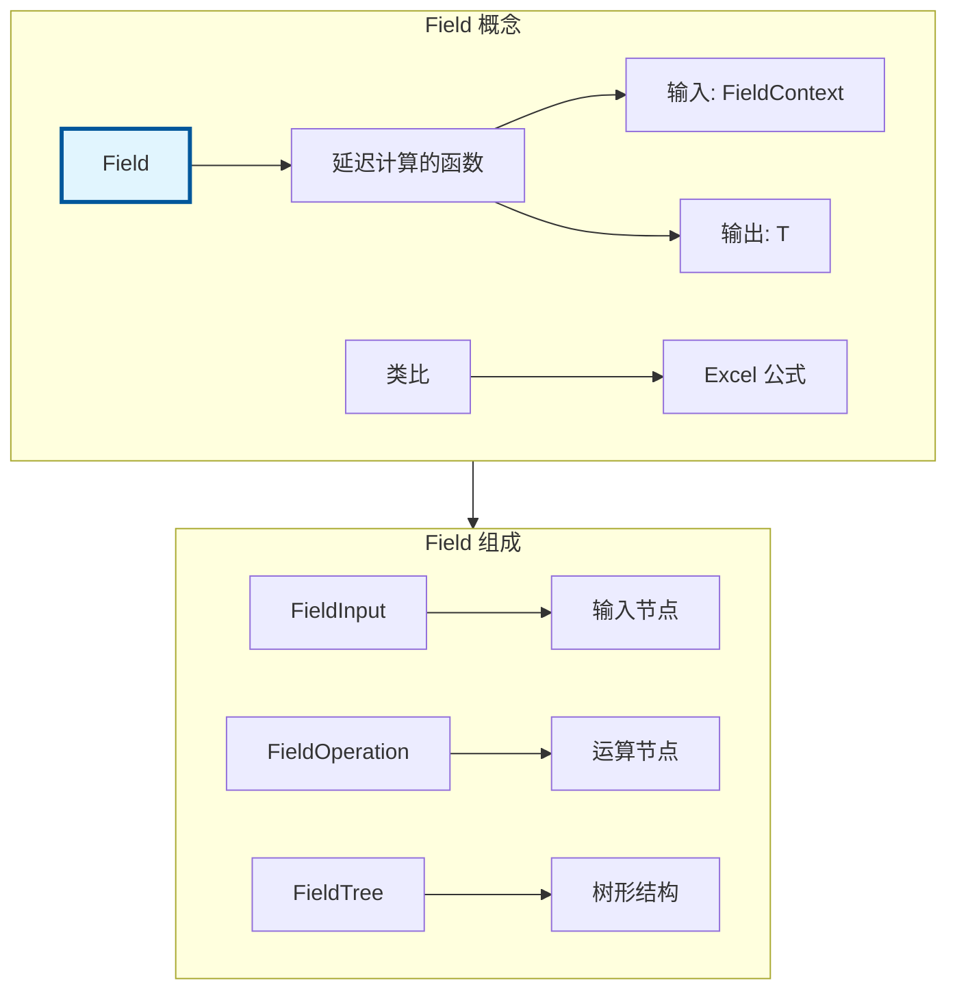
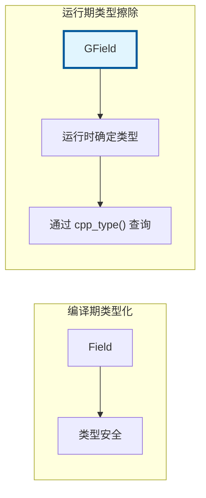

# Field<T> / GField - 字段系统

> 延迟计算的函数系统，几何节点中实现属性计算和传递的核心机制

---

## 🎯 核心概念



---

## 📦 Field<T> - 类型化字段

### 核心特性

```cpp
#include "FN_field.hh"

namespace blender::nodes {

void field_basic_examples() {
    // 1. 常量字段（所有元素都是 42）
    Field<float> const_field{42.0f};
    
    // 2. 属性字段（读取几何体属性）
    Field<float3> position_field{std::make_shared<bke::AttributeFieldInput>(
        "position", CPPType::get<float3>())};
    
    // 3. 字段运算
    Field<float3> offset_field{float3(0, 1, 0)};
    Field<float3> new_position = fn::add_fields(position_field, offset_field);
    
    // 4. 条件字段
    Field<bool> selection_field{true};
}

} // namespace blender::nodes
```

---

## 🌐 GField - 类型擦除字段

### 核心概念



### 使用示例

```cpp
#include "FN_field.hh"

namespace blender::nodes {

void gfield_examples() {
    // 1. 从 Field<T> 构造
    Field<float3> typed_field{float3(1, 2, 3)};
    GField gfield(typed_field);
    
    // 2. 获取类型
    const CPPType &type = gfield.cpp_type();
    
    // 3. 检查输入依赖
    const fn::FieldInputs &inputs = gfield.field_inputs();
    
    // 4. 构建字段运算
    auto operation = std::make_shared<fn::FieldOperation>(
        multi_function,
        Vector<GField>{gfield1, gfield2}
    );
    GField result_field(operation);
}

} // namespace blender::nodes
```

---

## 🔧 字段求值

### FieldEvaluator

```cpp
#include "FN_field.hh"

namespace blender::nodes {

void field_evaluation_examples() {
    // 1. 创建求值器
    const bke::MeshFieldContext context(mesh, bke::AttrDomain::Point);
    fn::FieldEvaluator evaluator(context, mesh.totvert);
    
    // 2. 添加输出目的地
    Array<float3> result(mesh.totvert);
    evaluator.add_with_destination(position_field, result.as_mutable_span());
    
    // 3. 添加选择（可选）
    evaluator.set_selection(selection_mask);
    
    // 4. 执行求值
    evaluator.evaluate();
    
    // result 现在包含求值结果
}

} // namespace blender::nodes
```

### 多字段同时求值

```cpp
void multi_field_evaluation() {
    fn::FieldEvaluator evaluator(context, size);
    
    // 同时求值多个字段（共享子字段计算）
    Array<float> result1(size);
    Array<float> result2(size);
    Array<float3> result3(size);
    
    evaluator.add_with_destination(field1, result1.as_mutable_span());
    evaluator.add_with_destination(field2, result2.as_mutable_span());
    evaluator.add_with_destination(field3, result3.as_mutable_span());
    
    evaluator.evaluate();  // 自动优化共享计算
}
```

---

## 🎯 节点开发中的典型用法

### 模式 1：提取字段输入

```cpp
static void node_geo_exec(GeoNodeExecParams params)
{
    // 提取字段输入
    const Field<float3> position_field = params.extract_input<Field<float3>>("Position"_ustr);
    const Field<float> value_field = params.extract_input<Field<float>>("Value"_ustr);
    const Field<bool> selection_field = params.extract_input<Field<bool>>("Selection"_ustr);
    
    // 使用字段...
}
```

### 模式 2：字段运算

```cpp
static void node_geo_exec(GeoNodeExecParams params)
{
    Field<float3> position = params.extract_input<Field<float3>>("Position"_ustr);
    Field<float3> offset = params.extract_input<Field<float3>>("Offset"_ustr);
    
    // 字段加法
    Field<float3> new_position = fn::add_fields(position, offset);
    
    // 字段乘法
    Field<float> scale = params.extract_input<Field<float>>("Scale"_ustr);
    Field<float3> scaled = fn::multiply_fields(new_position, scale);
    
    // 设置输出
    params.set_output("Position"_ustr, scaled);
}
```

### 模式 3：属性读取字段

```cpp
static void node_geo_exec(GeoNodeExecParams params)
{
    GeometrySet geometry = params.extract_input<GeometrySet>("Geometry"_ustr);
    
    if (Mesh *mesh = geometry.get_mesh()) {
        // 创建属性字段
        const bke::MeshFieldContext context(*mesh, bke::AttrDomain::Point);
        
        // 读取位置属性
        Field<float3> position_field = bke::AttributeFieldInput::Create<float3>("position");
        
        // 读取自定义属性
        Field<float> custom_field = bke::AttributeFieldInput::Create<float>("custom_attr");
        
        // 求值...
    }
}
```

### 模式 4：匿名属性字段

```cpp
static void node_geo_exec(GeoNodeExecParams params)
{
    // 创建匿名属性（输出到属性系统）
    Field<float> computed_field = /* ... */;
    
    // 生成匿名属性的唯一标识
    bke::AnonymousAttributeIDPtr anonymous_id = 
        bke::get_anonymous_attribute_id("Output Attribute");
    
    // 在几何体上存储
    if (Mesh *mesh = geometry.get_mesh_for_write()) {
        bke::try_capture_field_on_geometry(
            geometry,
            anonymous_id,
            bke::AttrDomain::Point,
            computed_field
        );
    }
    
    // 输出匿名属性引用
    params.set_output("Attribute"_ustr, fn::Field<float>(
        std::make_shared<bke::AnonymousAttributeFieldInput>(
            anonymous_id, CPPType::get<float>()
        )
    ));
}
```

---

## 🔄 字段上下文

### FieldContext

```cpp
// 不同类型的字段上下文
const bke::MeshFieldContext mesh_context(mesh, bke::AttrDomain::Point);
const bke::MeshFieldContext face_context(mesh, bke::AttrDomain::Face);
const bke::CurvesFieldContext curves_context(curves_id, bke::AttrDomain::Point);
const bke::PointCloudFieldContext pointcloud_context(pointcloud);
const bke::InstancesFieldContext instances_context(instances);
```

---

## ✅ 检查清单

- [ ] 理解 Field 的延迟计算特性
- [ ] 掌握 FieldEvaluator 的使用
- [ ] 了解 GField 的类型擦除
- [ ] 会用 add_with_destination
- [ ] 掌握属性字段的创建
- [ ] 了解匿名属性机制

---

## 📁 相关文件

| 文件 | 路径 |
|-----|------|
| FN_field.hh | `source/blender/functions/FN_field.hh` |
| FN_field_evaluator.hh | `source/blender/functions/FN_field_evaluator.hh` |
| BKE_geometry_fields.hh | `source/blender/blenkernel/BKE_geometry_fields.hh` |

---

## 🔗 相关文档

- [08_VArray_GVArray.md](08_VArray_GVArray.md) - 类型擦除数组
- [09_CPPType.md](09_CPPType.md) - 类型擦除系统
