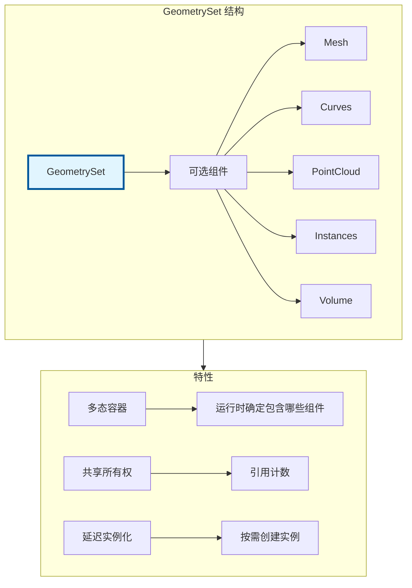

# GeometrySet - 几何体集合

> Blender 几何节点的核心数据类型，封装了所有几何类型（Mesh、Curves、PointCloud、Instances、Volume）

---

## 🎯 核心概念



---

## 📦 基本操作

### 构造和访问

```cpp
#include "BKE_geometry_set.hh"

namespace blender::nodes {

void geometry_set_basic_examples() {
    // 1. 默认构造（空）
    GeometrySet geometry;
    
    // 2. 从 Mesh 构造
    Mesh *mesh = BKE_mesh_new_nomain(100, 0, 0, 0);
    GeometrySet geometry_from_mesh = GeometrySet::from_mesh(mesh);
    
    // 3. 检查包含哪些组件
    bool has_mesh = geometry.has_mesh();
    bool has_curves = geometry.has_curves();
    bool has_pointcloud = geometry.has_pointcloud();
    bool has_instances = geometry.has_instances();
    bool has_volume = geometry.has_volume();
    
    // 4. 获取组件（只读）
    const Mesh *mesh_read = geometry.get_mesh();
    const Curves *curves = geometry.get_curves();
    const PointCloud *pointcloud = geometry.get_pointcloud();
    const bke::Instances *instances = geometry.get_instances();
    
    // 5. 获取组件（可写）- 会触发写时复制
    Mesh *mesh_write = geometry.get_mesh_for_write();
    Curves *curves_write = geometry.get_curves_for_write();
}

} // namespace blender::nodes
```

---

## 🔄 组件操作

### 替换组件

```cpp
void geometry_set_replace_examples() {
    GeometrySet geometry;
    
    // 1. 替换 Mesh
    Mesh *new_mesh = create_mesh();
    geometry.replace_mesh(new_mesh);
    
    // 2. 替换 Curves
    Curves *new_curves = create_curves();
    geometry.replace_curves(new_curves);
    
    // 3. 替换 PointCloud
    PointCloud *new_pointcloud = create_pointcloud();
    geometry.replace_pointcloud(new_pointcloud);
    
    // 4. 替换 Instances
    bke::Instances *new_instances = create_instances();
    geometry.replace_instances(new_instances);
}
```

### 移除组件

```cpp
void geometry_set_remove_examples() {
    GeometrySet geometry = get_geometry();
    
    // 移除特定组件
    geometry.remove_mesh();
    geometry.remove_curves();
    geometry.remove_pointcloud();
    geometry.remove_instances();
    geometry.remove_volume();
    
    // 清空所有
    geometry.clear();
}
```

---

## 🎯 遍历组件

### 访问者模式

```cpp
void geometry_set_foreach_example() {
    GeometrySet geometry = get_geometry();
    
    // 遍历所有组件
    geometry.foreach_geometry_type([&](GeometryComponent::Type type, const GeometryComponent *component) {
        switch (type) {
            case GeometryComponent::Type::Mesh:
                process_mesh(static_cast<const MeshComponent *>(component));
                break;
            case GeometryComponent::Type::Curve:
                process_curves(static_cast<const CurvesComponent *>(component));
                break;
            case GeometryComponent::Type::PointCloud:
                process_pointcloud(static_cast<const PointCloudComponent *>(component));
                break;
            case GeometryComponent::Type::Instance:
                process_instances(static_cast<const InstancesComponent *>(component));
                break;
            default:
                break;
        }
    });
}
```

---

## 🎨 节点开发中的典型用法

### 模式 1：处理所有几何类型

```cpp
static void node_geo_exec(GeoNodeExecParams params)
{
    GeometrySet geometry = params.extract_input<GeometrySet>("Geometry"_ustr);
    
    // 处理 Mesh
    if (Mesh *mesh = geometry.get_mesh_for_write()) {
        MutableSpan<float3> positions = mesh->vert_positions_for_write();
        for (float3 &pos : positions) {
            pos += float3(0, 1, 0);
        }
    }
    
    // 处理 Curves
    if (Curves *curves = geometry.get_curves_for_write()) {
        bke::CurvesGeometry &curves_geom = curves->geometry.wrap();
        MutableSpan<float3> positions = curves_geom.positions_for_write();
        for (float3 &pos : positions) {
            pos += float3(0, 1, 0);
        }
        curves_geom.calculate_bezier_auto_handles();
    }
    
    // 处理 PointCloud
    if (PointCloud *pointcloud = geometry.get_pointcloud_for_write()) {
        MutableSpan<float3> positions = pointcloud->positions_for_write();
        for (float3 &pos : positions) {
            pos += float3(0, 1, 0);
        }
    }
    
    // 处理 Instances
    if (bke::Instances *instances = geometry.get_instances_for_write()) {
        MutableSpan<float4x4> transforms = instances->transforms_for_write();
        for (float4x4 &transform : transforms) {
            transform.location() += float3(0, 1, 0);
        }
    }
    
    params.set_output("Geometry"_ustr, std::move(geometry));
}
```

### 模式 2：获取几何信息

```cpp
static void node_geo_exec(GeoNodeExecParams params)
{
    GeometrySet geometry = params.extract_input<GeometrySet>("Geometry"_ustr);
    
    // 获取总顶点数
    int64_t total_verts = 0;
    if (const Mesh *mesh = geometry.get_mesh()) {
        total_verts += mesh->totvert;
    }
    if (const PointCloud *pc = geometry.get_pointcloud()) {
        total_verts += pc->totpoint;
    }
    if (const Curves *curves = geometry.get_curves()) {
        total_verts += curves->geometry.point_num;
    }
    
    params.set_output("Count"_ustr, int(total_verts));
}
```

### 模式 3：组件过滤

```cpp
static GeometrySet filter_geometry_components(const GeometrySet &geometry,
                                               GeometryComponent::Type type)
{
    GeometrySet result;
    
    geometry.foreach_geometry_type([&](GeometryComponent::Type comp_type,
                                       const GeometryComponent *comp) {
        if (comp_type == type) {
            // 复制组件到结果
            switch (type) {
                case GeometryComponent::Type::Mesh:
                    result.replace_mesh(
                        BKE_mesh_copy_for_eval(static_cast<const Mesh *>(comp)));
                    break;
                // ... 其他类型
                default:
                    break;
            }
        }
    });
    
    return result;
}
```

---

## ✅ 检查清单

- [ ] 理解 GeometrySet 是多态容器
- [ ] 掌握 get_mesh/get_mesh_for_write 的区别
- [ ] 了解写时复制机制
- [ ] 会用 foreach_geometry_type 遍历
- [ ] 掌握所有几何类型的处理方式

---

## 📁 相关文件

| 文件 | 路径 |
|-----|------|
| BKE_geometry_set.hh | `source/blender/blenkernel/BKE_geometry_set.hh` |
| BKE_geometry_set_instances.hh | `source/blender/blenkernel/BKE_geometry_set_instances.hh` |

---

## 🔗 相关文档

- [12_AttributeAccessor.md](12_AttributeAccessor.md) - 属性访问器
