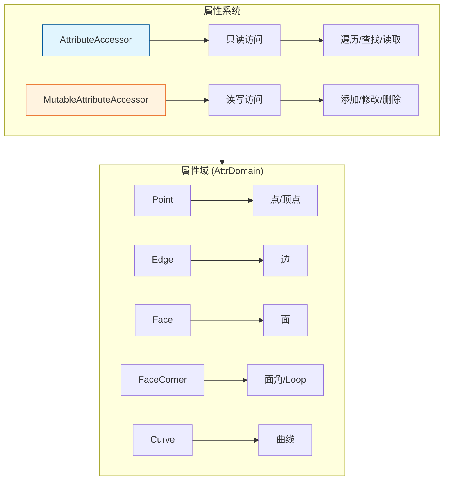

# AttributeAccessor / MutableAttributeAccessor - 属性访问器

> 统一访问几何体属性的接口，支持 Mesh、Curves、PointCloud 等多种几何类型

---

## 🎯 核心概念



---

## 📦 获取访问器

### 从几何体获取

```cpp
#include "BKE_attribute.hh"

namespace blender::nodes {

void attribute_accessor_basic_examples() {
    // 1. 从 Mesh 获取
    Mesh *mesh = get_mesh();
    const bke::AttributeAccessor read_accessor = *mesh->attributes();
    bke::MutableAttributeAccessor write_accessor = mesh->attributes_for_write();
    
    // 2. 从 Curves 获取
    Curves *curves = get_curves();
    const bke::AttributeAccessor curves_read = *curves->attributes();
    bke::MutableAttributeAccessor curves_write = curves->attributes_for_write();
    
    // 3. 从 PointCloud 获取
    PointCloud *pointcloud = get_pointcloud();
    const bke::AttributeAccessor pc_read = *pointcloud->attributes();
    bke::MutableAttributeAccessor pc_write = pointcloud->attributes_for_write();
}

} // namespace blender::nodes
```

---

## 🔍 查找属性

### 只读查找

```cpp
void attribute_lookup_examples() {
    const bke::AttributeAccessor attributes = *mesh->attributes();
    
    // 1. 查找属性（返回 GVArray）
    std::optional<GVArray> position_attr = attributes.lookup("position");
    if (position_attr) {
        // 获取类型
        const CPPType &type = position_attr->type();
        
        // 转换为具体类型
        if (type == CPPType::get<float3>()) {
            VArray<float3> positions = position_attr->typed<float3>();
            // 使用 positions...
        }
    }
    
    // 2. 查找并获取元数据
    std::optional<bke::AttributeMetaData> meta = attributes.lookup_meta_data("custom_attr");
    if (meta) {
        bke::AttrDomain domain = meta->domain;  // 属性域
        eCustomDataType data_type = meta->data_type;  // 数据类型
    }
    
    // 3. 检查属性是否存在
    bool has_attr = attributes.contains("custom_attr");
}
```

---

## 📝 添加和修改属性

### 添加属性

```cpp
void attribute_add_examples() {
    bke::MutableAttributeAccessor attributes = mesh->attributes_for_write();
    
    // 1. 添加 float3 属性（点域）
    bke::SpanAttributeWriter<float3> velocity = 
        attributes.lookup_or_add_for_write_span<float3>("velocity", bke::AttrDomain::Point);
    
    // 填充数据
    for (float3 &v : velocity.span) {
        v = float3(0, 0, 0);
    }
    velocity.finish();  // 必须调用以保存修改
    
    // 2. 添加 float 属性（面域）
    bke::SpanAttributeWriter<float> face_area = 
        attributes.lookup_or_add_for_write_span<float>("area", bke::AttrDomain::Face);
    
    // 计算面积...
    face_area.finish();
    
    // 3. 添加整数属性（边域）
    bke::SpanAttributeWriter<int> edge_id = 
        attributes.lookup_or_add_for_write_span<int>("edge_id", bke::AttrDomain::Edge);
    
    for (int i : edge_id.span.index_range()) {
        edge_id.span[i] = i;
    }
    edge_id.finish();
}
```

### 删除属性

```cpp
void attribute_remove_examples() {
    bke::MutableAttributeAccessor attributes = mesh->attributes_for_write();
    
    // 删除属性
    attributes.remove("velocity");
    
    // 批量删除
    Set<std::string> to_remove = {"temp1", "temp2", "temp3"};
    for (const std::string &name : to_remove) {
        attributes.remove(name);
    }
}
```

---

## 🔄 遍历属性

```cpp
void attribute_foreach_examples() {
    const bke::AttributeAccessor attributes = *mesh->attributes();
    
    // 遍历所有属性
    attributes.foreach_attribute([&](const bke::AttributeIter &iter) {
        const StringRef name = iter.name;
        const eCustomDataType data_type = iter.data_type;
        const bke::AttrDomain domain = iter.domain;
        
        std::cout << "Attribute: " << name << std::endl;
        std::cout << "  Type: " << iter.type->name << std::endl;
        std::cout << "  Domain: " << int(domain) << std::endl;
        
        // 获取属性数据
        GVArray data = iter.get();
        // 处理数据...
    });
}
```

---

## 🎯 节点开发中的典型用法

### 模式 1：读取位置属性

```cpp
static void node_geo_exec(GeoNodeExecParams params)
{
    GeometrySet geometry = params.extract_input<GeometrySet>("Geometry"_ustr);
    
    if (Mesh *mesh = geometry.get_mesh()) {
        const bke::AttributeAccessor attributes = *mesh->attributes();
        
        // 查找位置属性
        std::optional<GVArray> position_attr = attributes.lookup("position");
        if (position_attr) {
            VArray<float3> positions = position_attr->typed<float3>();
            
            // 处理位置...
            for (int64_t i : positions.index_range()) {
                float3 pos = positions[i];
                // 使用 pos...
            }
        }
    }
}
```

### 模式 2：添加自定义属性

```cpp
static void node_geo_exec(GeoNodeExecParams params)
{
    GeometrySet geometry = params.extract_input<GeometrySet>("Geometry"_ustr);
    const float value = params.get_input<float>("Value"_ustr);
    
    if (Mesh *mesh = geometry.get_mesh_for_write()) {
        bke::MutableAttributeAccessor attributes = mesh->attributes_for_write();
        
        // 添加或获取自定义属性
        bke::SpanAttributeWriter<float> custom_attr = 
            attributes.lookup_or_add_for_write_span<float>("custom_value", bke::AttrDomain::Point);
        
        // 填充值
        custom_attr.span.fill(value);
        
        // 保存修改
        custom_attr.finish();
    }
    
    params.set_output("Geometry"_ustr, std::move(geometry));
}
```

### 模式 3：属性域转换

```cpp
static void transfer_attribute_to_points(Mesh &mesh,
                                          StringRef source_name,
                                          StringRef target_name)
{
    const bke::AttributeAccessor read_attrs = *mesh.attributes();
    bke::MutableAttributeAccessor write_attrs = mesh.attributes_for_write();
    
    // 查找源属性（假设是面域）
    std::optional<GVArray> source_attr = read_attrs.lookup(source_name);
    if (!source_attr) return;
    
    // 创建目标属性（点域）
    bke::SpanAttributeWriter<float> target_attr = 
        write_attrs.lookup_or_add_for_write_span<float>(target_name, bke::AttrDomain::Point);
    
    // 插值计算（简化示例）
    VArray<float> source = source_attr->typed<float>();
    for (int i : target_attr.span.index_range()) {
        // 根据拓扑关系计算插值...
        target_attr.span[i] = source[0];  // 简化处理
    }
    
    target_attr.finish();
}
```

---

## 📊 属性域对照

| 域 | 适用几何类型 | 元素数量 |
|---|------------|---------|
| `AttrDomain::Point` | Mesh, Curves, PointCloud | 顶点/点 |
| `AttrDomain::Edge` | Mesh | 边 |
| `AttrDomain::Face` | Mesh | 面 |
| `AttrDomain::FaceCorner` | Mesh | 面角 (loop) |
| `AttrDomain::Curve` | Curves | 曲线 |

---

## ✅ 检查清单

- [ ] 理解 AttributeAccessor 和 MutableAttributeAccessor 的区别
- [ ] 掌握 lookup 和 lookup_or_add_for_write_span 的使用
- [ ] 了解 AttrDomain 的不同类型
- [ ] 记得调用 finish() 保存修改
- [ ] 掌握属性遍历方法

---

## 📁 相关文件

| 文件 | 路径 |
|-----|------|
| BKE_attribute.hh | `source/blender/blenkernel/BKE_attribute.hh` |
| BKE_attribute_access.hh | `source/blender/blenkernel/BKE_attribute_access.hh` |

---

## 🔗 相关文档

- [10_Field.md](10_Field.md) - 字段系统
- [11_GeometrySet.md](11_GeometrySet.md) - 几何体集合
