# Allocator 深度解析

> 源文件：[BLI_allocator.hh](file:///e:/blender-git/blender/source/blender/blenlib/BLI_allocator.hh)

---

## 目录

1. [什么是 Allocator？为什么需要？](#1-什么是-allocator为什么需要)
2. [Blender Allocator 接口设计](#2-blender-allocator-接口设计)
3. [三大 Allocator 详解](#3-三大-allocator-详解)
4. [容器如何使用 Allocator](#4-容器如何使用-allocator)
5. [源码中的真实用例](#5-源码中的真实用例)
6. [语法专题：ul / ULL 后缀](#6-语法专题ul--ull-后缀)
7. [语法专题：MEM_MIN_CPP_ALIGNMENT 宏](#7-语法专题mem_min_cpp_alignment-宏)
8. [Allocator vs std::allocator](#8-allocator-vs-stdallocator)
9. [总结速查表](#9-总结速查表)

---

## 1. 什么是 Allocator？为什么需要？

### 1.1 一句话定义

**Allocator（分配器）** 是容器与底层内存管理之间的**抽象层**——容器说"我要 N 字节内存"，Allocator 决定**怎么给**。

### 1.2 为什么不直接用 malloc/free？

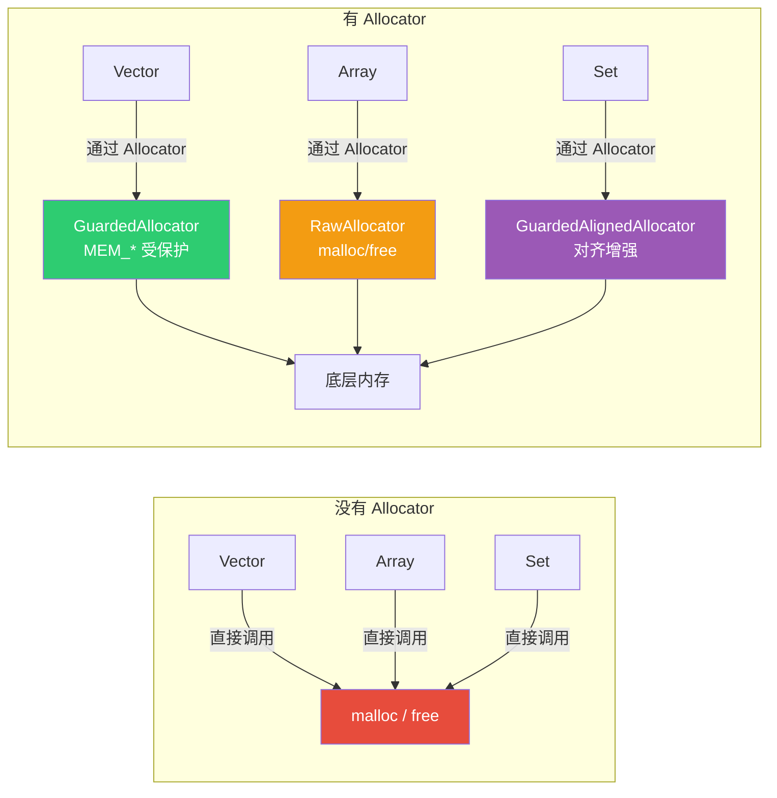

**没有 Allocator 的问题**：

| 问题 | 说明 |
|------|------|
| **无法切换内存策略** | 容器硬编码 malloc/free，无法切换到 Blender 的内存守护分配器 |
| **无法统一调试** | 想追踪内存泄漏？每个容器都得改 |
| **无法定制对齐** | SIMD 指令要 16/32/64 字节对齐，容器无法保证 |
| **无法控制生命周期** | 静态变量的内存不能走 MEM_*（泄漏检测会误报） |

**有 Allocator 的好处**：

| 好处 | 说明 |
|------|------|
| **策略可替换** | 同一个 `Vector<T>` 可以用不同分配器，只需改模板参数 |
| **统一调试** | `GuardedAllocator` 自动追踪所有分配，泄漏一目了然 |
| **对齐可控** | `GuardedAlignedAllocator` 保证最小对齐 |
| **生命周期可控** | `RawAllocator` 绕过泄漏检测，用于静态变量 |

### 1.3 文件头注释翻译

> *An `Allocator` can allocate and deallocate memory. It is used by containers such as Vector. The allocators defined in this file do not work with standard library containers such as std::vector.*
>
> Allocator 可以分配和释放内存。它被 Vector 等容器使用。本文件定义的分配器**不兼容**标准库容器（如 `std::vector`）。

> *Every allocator has to implement two methods:*
> *`void *allocate(size_t size, size_t alignment, const char *name);`*
> *`void deallocate(void *ptr);`*
>
> 每个 Allocator 必须实现两个方法：`allocate` 和 `deallocate`。

> *We don't use the std::allocator interface, because it does more than is really necessary for an allocator and has some other quirks. It mixes the concepts of allocation and construction. It is essentially forced to be a template, even though the allocator should not care about the type.*
>
> 我们不用 `std::allocator` 接口，因为它做了超出分配器职责的事情，还有一些怪癖。它**混淆了"分配"和"构造"的概念**。它被迫成为模板，但分配器其实不应该关心元素类型。

> *The allocator interface dictated by this file is very simplistic, but for now that is all we need. More complexity can be added when it seems necessary.*
>
> 本文件定义的分配器接口非常简洁，但目前够用了。必要时可以增加复杂度。

---

## 2. Blender Allocator 接口设计

### 2.1 最小接口：只需两个方法

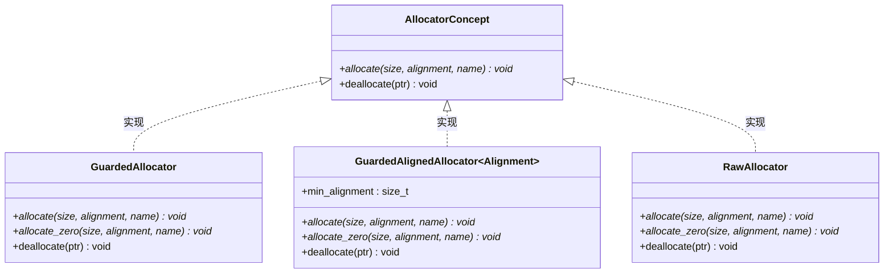

### 2.2 接口参数解读

```cpp
void *allocate(size_t size, size_t alignment, const char *name);
```

| 参数 | 类型 | 含义 |
|------|------|------|
| `size` | `size_t` | 要分配的**字节数**（不是元素数！） |
| `alignment` | `size_t` | 对齐要求（必须是 2 的幂），如 4、8、16、64 |
| `name` | `const char*` | 分配的标识名，用于内存调试（泄漏报告会显示这个名字） |
| **返回值** | `void*` | 指向已分配内存的指针，保证按 `alignment` 对齐 |

```cpp
void deallocate(void *ptr);
```

| 参数 | 类型 | 含义 |
|------|------|------|
| `ptr` | `void*` | 之前 `allocate` 返回的指针 |

### 2.3 为什么不用 std::allocator？

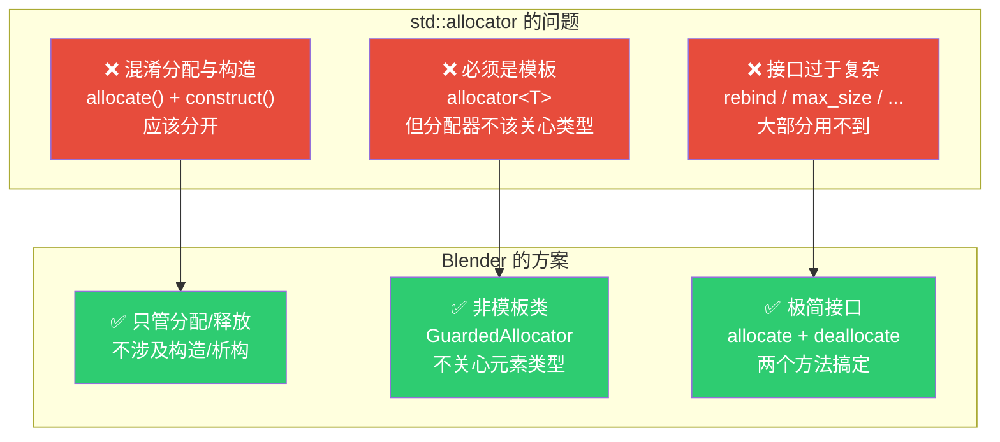

---

## 3. 三大 Allocator 详解

### 3.1 GuardedAllocator — 默认选择

```cpp
class GuardedAllocator {
 public:
  void *allocate(size_t size, size_t alignment, const char *name)
  {
    return MEM_new_uninitialized_aligned(size, alignment, name);
  }
  void *allocate_zero(size_t size, size_t alignment, const char *name)
  {
    if (alignment > MEM_MIN_CPP_ALIGNMENT) {
      void *ptr = this->allocate(size, alignment, name);
      memset(ptr, 0, size);
      return ptr;
    }
    return MEM_new_zeroed(size, name);
  }
  void deallocate(void *ptr)
  {
    MEM_delete_void(ptr);
  }
};
```

> *Use Blender's guarded allocator (aka MEM_*). This should always be used except there is a good reason not to use it.*
>
> 使用 Blender 的受保护分配器（即 MEM_* 函数）。除非有充分理由，否则**应该始终使用它**。

**核心特性**：

| 特性 | 说明 |
|------|------|
| 底层实现 | `MEM_new_uninitialized_aligned` / `MEM_delete_void` |
| 内存守护 | ✅ 所有分配都会被追踪，泄漏时打印报告 |
| 对齐支持 | ✅ 通过 `MEM_new_uninitialized_aligned` 支持任意对齐 |
| 零初始化 | `allocate_zero`：小对齐用 `MEM_new_zeroed`（calloc），大对齐手动 `memset` |
| 内存名 | ✅ `name` 参数出现在泄漏报告中 |

**`allocate_zero` 的分支逻辑**：

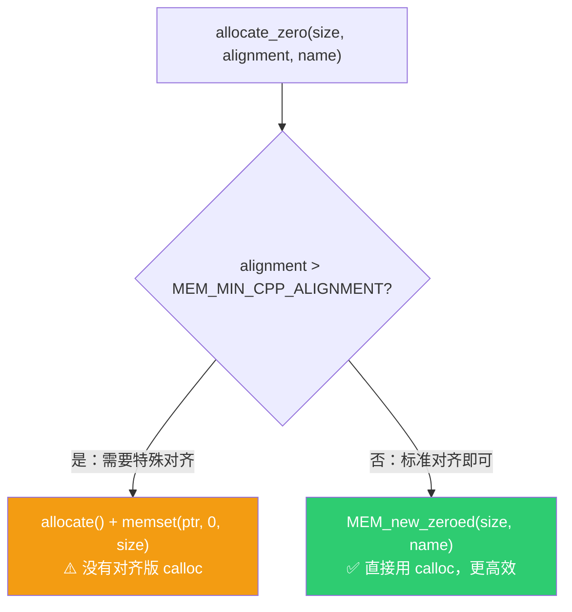

### 3.2 GuardedAlignedAllocator — 对齐增强版

```cpp
template<size_t Alignment = 64ul> class GuardedAlignedAllocator {
 public:
  static constexpr size_t min_alignment = Alignment;

  void *allocate(size_t size, size_t alignment, const char *name)
  {
    return MEM_new_uninitialized_aligned(size, std::max(alignment, min_alignment), name);
  }
  // ...
};
```

> *Like #GuardedAllocator, but makes sure each allocation has a minimum alignment. One use case is reusing an allocation between multiple types that have different alignment requirements. The default alignment template parameter should be large enough for any type in practice.*
>
> 类似 GuardedAllocator，但确保每次分配都有**最小对齐**。一个用例是在多种不同对齐要求的类型之间**复用同一块内存**。默认对齐参数（64 字节）在实践中应该满足任何类型。

**关键设计**：`std::max(alignment, min_alignment)` — 取请求对齐和最小对齐中的**较大者**。

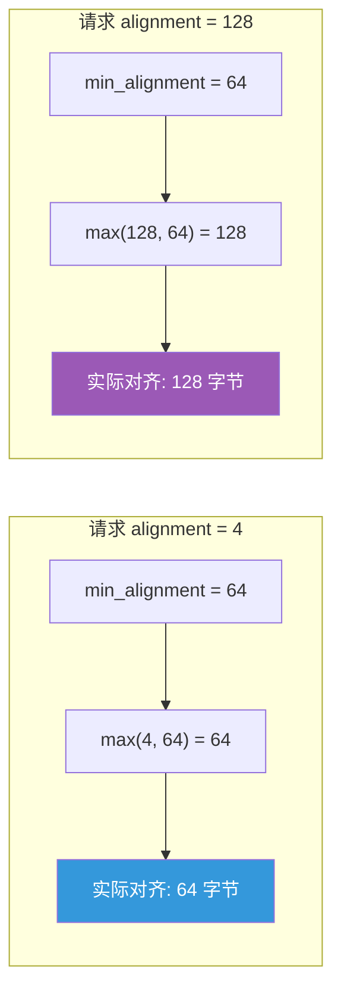

**为什么默认 64 字节？**
- SSE/AVX 需要 16/32 字节对齐
- AVX-512 需要 64 字节对齐
- 64 字节也是常见缓存行大小
- 满足 64 字节对齐 → 自动满足所有更小的对齐要求

### 3.3 RawAllocator — 裸分配器

```cpp
class RawAllocator {
 private:
  struct MemHead {
    int offset;
  };

 public:
  void *allocate(size_t size, size_t alignment, const char * /*name*/)
  {
    BLI_assert(is_power_of_2(int(alignment)));
    void *ptr = malloc(size + alignment + sizeof(MemHead));
    void *used_ptr = reinterpret_cast<void *>(
        uintptr_t(POINTER_OFFSET(ptr, alignment + sizeof(MemHead))) & ~(uintptr_t(alignment) - 1));
    int offset = int(intptr_t(used_ptr) - intptr_t(ptr));
    BLI_assert(offset >= int(sizeof(MemHead)));
    (static_cast<MemHead *>(used_ptr) - 1)->offset = offset;
    return used_ptr;
  }

  void deallocate(void *ptr)
  {
    MemHead *head = static_cast<MemHead *>(ptr) - 1;
    int offset = -head->offset;
    void *actual_pointer = POINTER_OFFSET(ptr, offset);
    free(actual_pointer);
  }
};
```

> *This is a wrapper around malloc/free. Only use this when the GuardedAllocator cannot be used. This can be the case when the allocated memory might live longer than Blender's allocator. For example, when the memory is owned by a static variable.*
>
> 这是对 malloc/free 的封装。**只在无法使用 GuardedAllocator 时才用**。例如内存可能比 Blender 的分配器活得更久——被静态变量拥有时。

**核心难点：对齐 malloc 的实现**

标准 `malloc` 只保证 `alignof(max_align_t)` 对齐（通常 16 字节）。如果需要更大对齐，必须手动实现。RawAllocator 的策略：

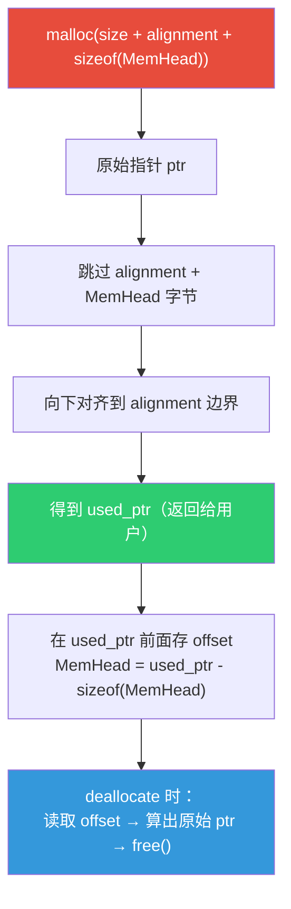

**内存布局**：

```
malloc 返回的原始内存:
┌──────────────────────────────────────────────────────┐
│  padding  │ MemHead(offset) │    用户数据区域         │
│  (浪费)   │  (4 字节)       │    (size 字节)         │
└──────────────────────────────────────────────────────┘
^           ^                 ^
ptr         head              used_ptr (对齐后, 返回给用户)
            = used_ptr - sizeof(MemHead)
```

**为什么需要 MemHead？** 因为 `deallocate` 只收到 `used_ptr`，但 `free()` 需要原始 `ptr`。`MemHead` 存储了偏移量，可以反算出原始指针。

### 3.4 三者对比

| 特性 | GuardedAllocator | GuardedAlignedAllocator | RawAllocator |
|------|-----------------|------------------------|-------------|
| 底层 | MEM_* | MEM_* | malloc/free |
| 内存守护 | ✅ | ✅ | ❌ |
| 泄漏检测 | ✅ | ✅ | ❌ |
| 最小对齐保证 | ❌ | ✅（默认 64B） | ❌ |
| 适用场景 | 通用（默认） | 跨类型复用缓冲区 | 静态变量/长生命周期 |
| 使用频率 | ⭐⭐⭐⭐⭐ | ⭐ | ⭐ |

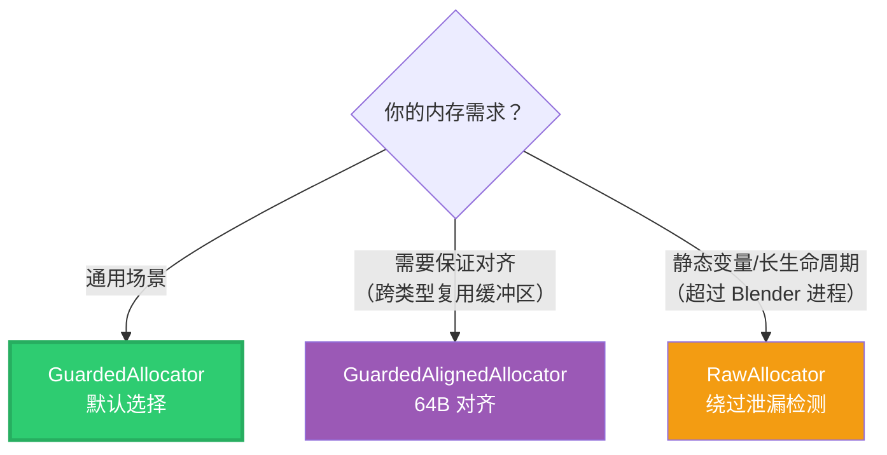

---

## 4. 容器如何使用 Allocator

### 4.1 Vector 中的 Allocator

```cpp
// BLI_vector.hh:71~75
template<
    typename T,
    int64_t InlineBufferCapacity = default_inline_buffer_capacity(sizeof(T)),
    typename Allocator = GuardedAllocator>    // ← 默认 GuardedAllocator
class Vector {
```

> *The allocator used by this vector. Should rarely be changed, except when you don't want that MEM_* is used internally.*
>
> 此 Vector 使用的分配器。**很少需要更改**，除非你不想内部使用 MEM_* 函数。

**使用方式**：

```cpp
// 默认：使用 GuardedAllocator
Vector<int> vec;  // Vector<int, 4, GuardedAllocator>

// 自定义：使用 RawAllocator（用于静态变量）
Vector<int, 0, RawAllocator> raw_vec;

// 自定义：使用 GuardedAlignedAllocator（保证 64B 对齐）
Vector<std::byte, 0, GuardedAlignedAllocator<>> aligned_vec;
```

### 4.2 Array 中的 Allocator

```cpp
// BLI_array.hh:45~49
template<
    typename T,
    int64_t InlineBufferCapacity = default_inline_buffer_capacity(sizeof(T)),
    typename Allocator = GuardedAllocator>    // ← 默认 GuardedAllocator
class Array {
```

> *The allocator used by this array. Should rarely be changed, except when you don't want that MEM_* functions are used internally.*
>
> 此 Array 使用的分配器。很少需要更改，除非你不想内部使用 MEM_* 函数。

### 4.3 GArray 中的 Allocator

```cpp
// BLI_generic_array.hh:25~29
template<
    typename Allocator = GuardedAllocator>    // ← 默认 GuardedAllocator
class GArray {
```

> *The allocator used by this array. Should rarely be changed, except when you don't want that MEM_* functions are used internally.*
>
> 此 GArray 使用的分配器。很少需要更改，除非你不想内部使用 MEM_* 函数。

### 4.4 Allocator 在容器内部的工作流

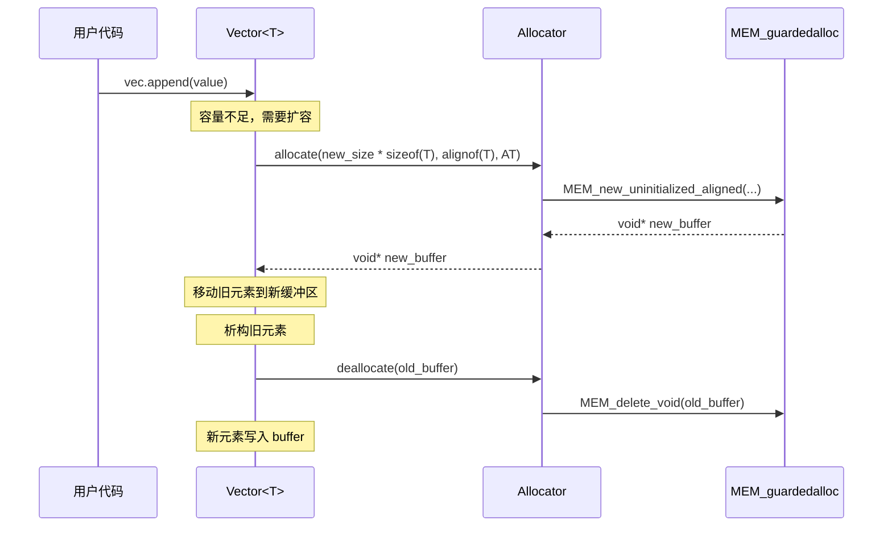

### 4.5 BLI_NO_UNIQUE_ADDRESS 优化

在 `GArray` 中，Allocator 成员使用了 `BLI_NO_UNIQUE_ADDRESS`：

```cpp
class GArray {
 protected:
  const CPPType *type_ = nullptr;
  void *data_ = nullptr;
  int64_t size_ = 0;
  BLI_NO_UNIQUE_ADDRESS Allocator allocator_;  // ← 空类时不占空间
};
```

**原理**：`GuardedAllocator` 和 `RawAllocator` 都是**空类**（无数据成员），按 C++ 规范空类大小 ≥ 1 字节。`[[no_unique_address]]`（即 `BLI_NO_UNIQUE_ADDRESS`）告诉编译器这个成员不需要唯一地址，可以优化为 0 字节。

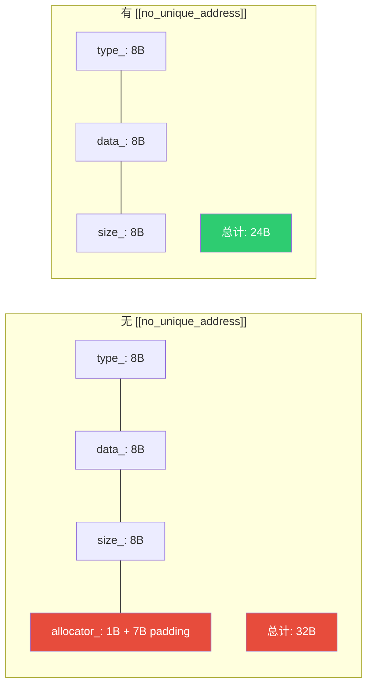

---

## 5. 源码中的真实用例

### 5.1 GuardedAlignedAllocator — 曲线重采样临时缓冲区

[resample_curves.cc](file:///e:/blender-git/blender/source/blender/geometry/intern/resample_curves.cc)：

```cpp
struct EvalDataBuffer {
  using AllocatorType = GuardedAlignedAllocator<>;
  /* Use a default alignment that works for all attribute types, and don't use the inline buffer
   * because it doesn't necessarily have the correct alignment. */
  Vector<std::byte, 0, AllocatorType> heap_allocated;
  alignas(AllocatorType::min_alignment) std::array<std::byte, 1024> inline_buffer;

  template<typename T> MutableSpan<T> resize(const int64_t size)
  {
    const int64_t size_in_bytes = sizeof(T) * size;
    if (size_in_bytes <= this->inline_buffer.size()) {
      return MutableSpan<std::byte>(this->inline_buffer).slice(0, size_in_bytes).cast<T>();
    }
    this->heap_allocated.resize(size_in_bytes);
    return this->heap_allocated.as_mutable_span().cast<T>();
  }
};
```

**为什么用 GuardedAlignedAllocator？** 同一块缓冲区可能被 `float`、`float3`、`int` 等不同类型复用。64 字节对齐满足所有类型的对齐要求，避免未定义行为。

### 5.2 RawAllocator — 线程局部静态变量

[lazy_threading.cc](file:///e:/blender-git/blender/source/blender/blenlib/intern/lazy_threading.cc)：

```cpp
/**
 * This uses a "raw" stack and vector so that it can be destructed after Blender checks for memory
 * leaks. A new list of receivers is created whenever an isolated region is entered to avoid
 * deadlocks.
 */
using HintReceivers = RawStack<RawVector<FunctionRef<void()>, 0>, 0>;
static thread_local HintReceivers hint_receivers = /* ... */;
```

**为什么用 RawAllocator？** 这是 `static thread_local` 变量，生命周期持续到线程结束。如果用 `GuardedAllocator`，Blender 的内存泄漏检查器会在程序退出前检查，此时这个变量还没析构，会误报泄漏。用 `RawAllocator`（malloc/free）则不会被追踪。

### 5.3 GuardedAllocator 显式指定 — VectorSet 的 int32 优化

[mesh_validate.cc](file:///e:/blender-git/blender/source/blender/blenkernel/intern/mesh_validate.cc)：

```cpp
using EdgeMap = VectorSet<OrderedEdge,
                          32,
                          DefaultProbingStrategy,
                          DefaultHash<OrderedEdge>,
                          DefaultEquality<OrderedEdge>,
                          SimpleVectorSetSlot<OrderedEdge, int>,  // ← 用 int 代替 int64_t
                          GuardedAllocator>;                       // ← 被迫显式写出
```

**为什么显式写 GuardedAllocator？** `VectorSet` 有 7 个模板参数，当需要修改第 6 个参数（slot 索引类型从 `int64_t` 改为 `int` 以节省内存）时，必须把所有参数都写出来，包括默认的 `GuardedAllocator`。

### 5.4 类型别名 — Blender 预定义的 Raw 容器

Blender 为 `RawAllocator` 预定义了便捷类型别名，分散定义在各自的头文件中：

| 类型别名 | 定义位置 | 完整定义 |
|---------|---------|---------|
| `RawVector<T>` | [BLI_vector.hh:1161](file:///e:/blender-git/blender/source/blender/blenlib/BLI_vector.hh#L1161) | `Vector<T, InlineBufferCapacity, RawAllocator>` |
| `RawStack<T>` | [BLI_stack.hh:413](file:///e:/blender-git/blender/source/blender/blenlib/BLI_stack.hh#L413) | `Stack<T, InlineBufferCapacity, RawAllocator>` |
| `RawSet<Key>` | [BLI_set.hh:989](file:///e:/blender-git/blender/source/blender/blenlib/BLI_set.hh#L989) | `Set<Key, ..., RawAllocator>` |
| `RawMap<Key, Value>` | [BLI_map.hh:1376](file:///e:/blender-git/blender/source/blender/blenlib/BLI_map.hh#L1376) | `Map<Key, Value, ..., RawAllocator>` |
| `RawVectorSet<Key>` | [BLI_vector_set.hh:1117](file:///e:/blender-git/blender/source/blender/blenlib/BLI_vector_set.hh#L1117) | `VectorSet<Key, ..., RawAllocator>` |

> ⚠️ **没有 `RawArray`**：`Array` 头文件中没有定义 `RawArray` 类型别名。如果需要，可以自己写：
> ```cpp
> template<typename T, int64_t N = default_inline_buffer_capacity(sizeof(T))>
> using RawArray = Array<T, N, RawAllocator>;
> ```

> *Same as a normal Vector, but does not use Blender's guarded allocator. This is useful when allocating memory with static storage duration.* — [BLI_vector.hh:1157](file:///e:/blender-git/blender/source/blender/blenlib/BLI_vector.hh#L1157)
>
> 和普通 Vector 相同，但不使用 Blender 的受保护分配器。适用于**静态存储期**的内存分配。

---

## 6. 语法专题：ul / ULL 后缀

### 6.1 整数字面量后缀一览

| 后缀 | 含义 | 类型 | 示例 |
|------|------|------|------|
| （无） | 十进制整数 | `int` | `42` |
| `u` / `U` | 无符号 | `unsigned int` | `42u` |
| `l` / `L` | long | `long` | `42l` |
| `ul` / `UL` | unsigned long | `unsigned long` | `42ul` |
| `ll` / `LL` | long long | `long long` | `42ll` |
| `ull` / `ULL` | unsigned long long | `unsigned long long` | `42ull` |

### 6.2 `64ul` 是什么？

```cpp
template<size_t Alignment = 64ul> class GuardedAlignedAllocator {
```

- `64ul` = 值为 64 的 **unsigned long** 字面量
- `size_t` 在 64 位 Windows 上是 `unsigned long long`，在 64 位 Linux 上是 `unsigned long`
- `64ul` 可以隐式转换为 `size_t`，不会丢失精度

### 6.3 `16ULL` 是什么？

```cpp
#define MEM_MIN_CPP_ALIGNMENT \
  (__STDCPP_DEFAULT_NEW_ALIGNMENT__ < alignof(void *) ? __STDCPP_DEFAULT_NEW_ALIGNMENT__ : \
   alignof(void *))  // Expands to (16ULL < alignof(void *) ? 16ULL : alignof(void *))
```

- `16ULL` = 值为 16 的 **unsigned long long** 字面量
- 注释说宏展开后 `__STDCPP_DEFAULT_NEW_ALIGNMENT__` 变为 `16ULL`
- `alignof(void*)` 在 64 位系统上是 8，在 32 位系统上也是 8

### 6.4 为什么用 ULL 而不是普通整数？

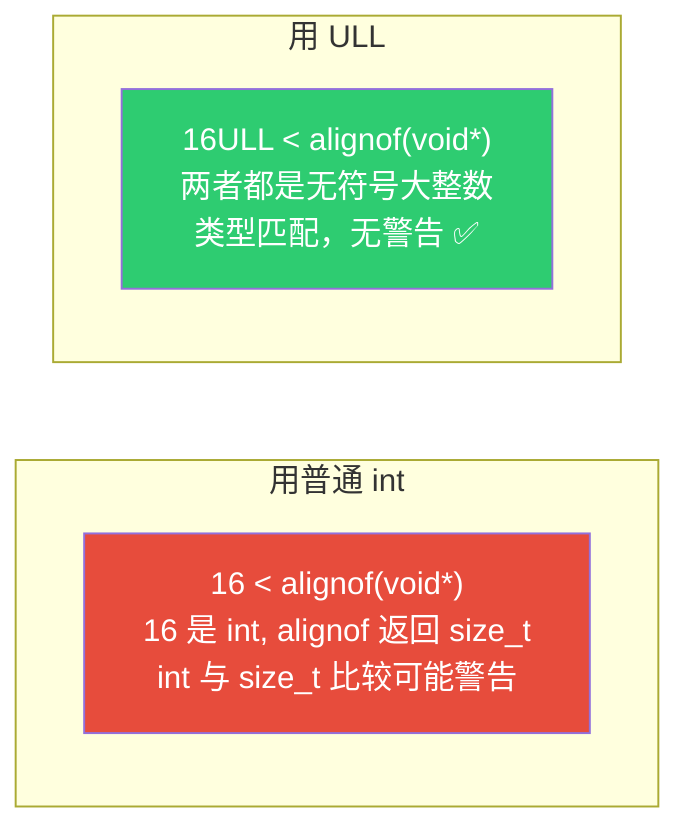

**核心原因**：`alignof()` 返回 `size_t`（无符号类型）。如果用有符号 `int` 与无符号 `size_t` 比较，编译器会发出**有符号/无符号比较警告**。用 `ULL` 后缀确保两边都是无符号类型。

### 6.5 ul vs ULL 的区别

| 后缀 | 类型 | 64 位 Windows | 64 位 Linux |
|------|------|--------------|-------------|
| `ul` | `unsigned long` | 4 字节（32 位） | 8 字节（64 位） |
| `ULL` | `unsigned long long` | 8 字节（64 位） | 8 字节（64 位） |

> ⚠️ **Windows 上的陷阱**：`unsigned long` 在 Windows 上只有 4 字节（即使是 64 位系统）！所以 `64ul` 在 Windows 上是 32 位无符号整数（值 64 没问题），但如果值超过 2³² 就会溢出。`ULL` 在所有平台上都是 64 位，更安全。

---

## 7. 语法专题：MEM_MIN_CPP_ALIGNMENT 宏

### 7.1 宏定义

```cpp
#define MEM_MIN_CPP_ALIGNMENT \
  (__STDCPP_DEFAULT_NEW_ALIGNMENT__ < alignof(void *) \
    ? __STDCPP_DEFAULT_NEW_ALIGNMENT__ \
    : alignof(void *))
```

展开后等价于：

```cpp
#define MEM_MIN_CPP_ALIGNMENT (16ULL < alignof(void *) ? 16ULL : alignof(void *))
```

### 7.2 逐步拆解

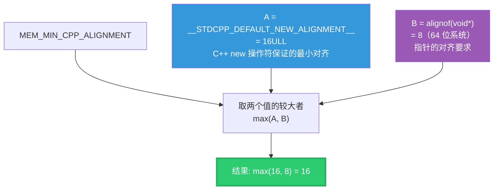

### 7.3 `__STDCPP_DEFAULT_NEW_ALIGNMENT__` 是什么？

这是 C++17 引入的编译器预定义宏，表示 `operator new` 保证的**最小对齐**。

| 编译器 | 值 |
|--------|-----|
| MSVC (x64) | 16 |
| GCC (x64) | 16 |
| Clang (x64) | 16 |
| 32 位平台 | 8 |

### 7.4 为什么取较大者？

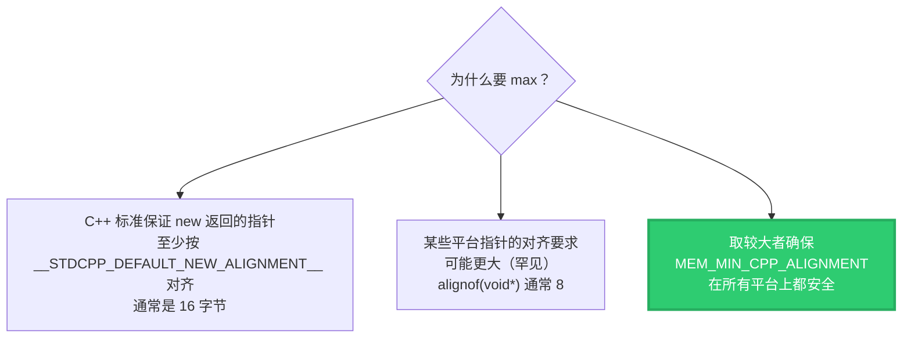

**本质**：`MEM_MIN_CPP_ALIGNMENT` 是"使用标准 `new`/`calloc` 时，返回的指针至少有多大对齐"的保守估计。

### 7.5 在 Allocator 中的作用

```cpp
// GuardedAllocator::allocate_zero
if (alignment > MEM_MIN_CPP_ALIGNMENT) {
  // 请求的对齐 > 标准 new 的保证
  // → 没有对齐版 calloc 可用
  // → 必须手动 allocate + memset
  void *ptr = this->allocate(size, alignment, name);
  memset(ptr, 0, size);
  return ptr;
}
// 请求的对齐 ≤ 标准 new 的保证
// → 可以直接用 MEM_new_zeroed（底层 calloc），更高效
return MEM_new_zeroed(size, name);
```

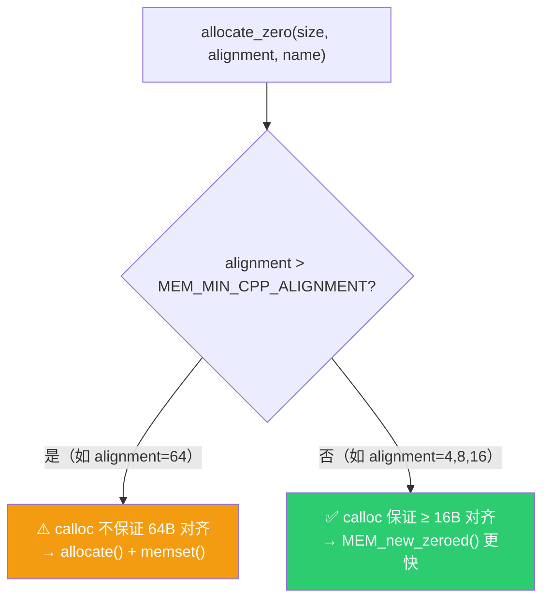

### 7.6 三元运算符实现 max 的原因

为什么不用 `std::max(16ULL, alignof(void*))`？

因为这是**预处理器宏**——在 `#define` 中不能调用函数。三元运算符 `? :` 是语言级表达式，可以在宏中安全使用。

---

## 8. Allocator vs std::allocator

| 特性 | Blender Allocator | std::allocator |
|------|------------------|----------------|
| 接口方法 | `allocate` + `deallocate` | `allocate` + `deallocate` + `construct` + `destroy` |
| 是否模板 | ❌ 非模板 | ✅ `std::allocator<T>` |
| 关心元素类型 | ❌ 不关心 | ✅ 必须知道 T |
| 对齐参数 | ✅ 显式传入 | ❌ 自动推断 |
| 调试名称 | ✅ `const char *name` | ❌ 无 |
| 零初始化 | ✅ `allocate_zero` | ❌ 无 |
| 标准兼容 | ❌ 不兼容 std 容器 | ✅ 标准接口 |
| 复杂度 | 极简 | 复杂（rebind 等） |

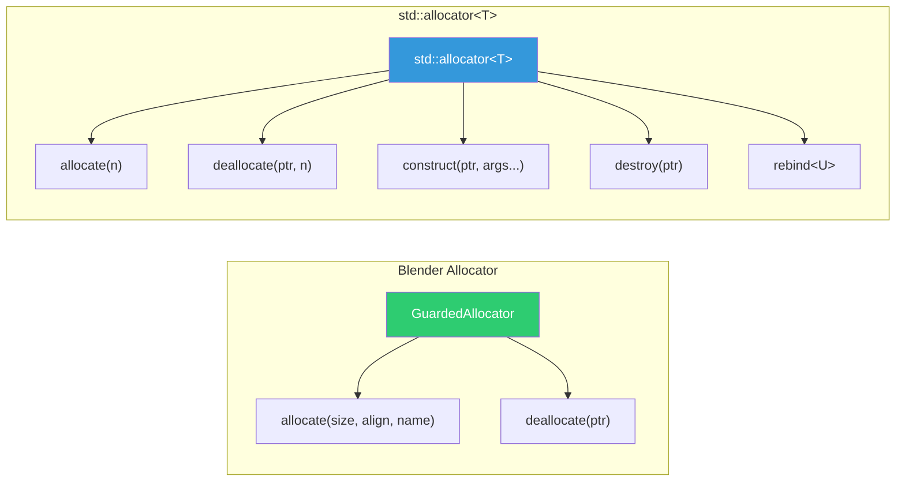

---

## 9. 总结速查表

### Allocator 选择

| 场景 | 推荐 | 原因 |
|------|------|------|
| 通用容器 | `GuardedAllocator` | 默认，内存守护 + 泄漏检测 |
| 跨类型复用缓冲区 | `GuardedAlignedAllocator<>` | 保证 64B 对齐，满足所有类型 |
| 静态/线程局部变量 | `RawAllocator` | 绕过泄漏检测，避免误报 |
| SIMD 向量运算 | `GuardedAlignedAllocator<64>` | AVX-512 需要 64B 对齐 |

### 关键概念

| 概念 | 一句话 |
|------|--------|
| **Allocator** | 容器与内存管理之间的抽象层 |
| **GuardedAllocator** | 默认选择，使用 MEM_* 受保护分配 |
| **GuardedAlignedAllocator** | 增加最小对齐保证，用于类型擦除后的内存复用 |
| **RawAllocator** | malloc/free 封装，绕过泄漏检测 |
| **MEM_MIN_CPP_ALIGNMENT** | 标准 new 保证的最小对齐（通常 16B） |
| **`ul` 后缀** | unsigned long 字面量 |
| **`ULL` 后缀** | unsigned long long 字面量，跨平台安全 |
| **`BLI_NO_UNIQUE_ADDRESS`** | 空类分配器不占容器空间 |

---

## 附录 A：allocate_zero、memset、calloc 详解

### A.1 allocate_zero 是什么？

`allocate_zero` 是 Blender Allocator 提供的**零初始化分配**方法——分配内存后，所有字节自动设为 0。

```cpp
// BLI_allocator.hh:49~58
void *allocate_zero(size_t size, size_t alignment, const char *name)
{
  if (alignment > MEM_MIN_CPP_ALIGNMENT) {
    /* There is no version of calloc with a specific alignment argument. */
    void *ptr = this->allocate(size, alignment, name);
    memset(ptr, 0, size);
    return ptr;
  }
  return MEM_new_zeroed(size, name);
}
```

> *There is no version of calloc with a specific alignment argument.*
>
> 没有带对齐参数的 calloc 版本。

**为什么需要 `allocate_zero`？** 有些场景需要分配的内存初始为全零（而不是随机值），比如：
- 分配结构体，所有字段默认为 0/nullptr/false
- 分配数组，所有元素默认初始化

**与 `allocate` 的区别**：

| 方法 | 分配后内存内容 | 性能 |
|------|--------------|------|
| `allocate` | **未初始化**（随机值） | ⚡ 更快 |
| `allocate_zero` | **全零** | 稍慢（需要写零） |

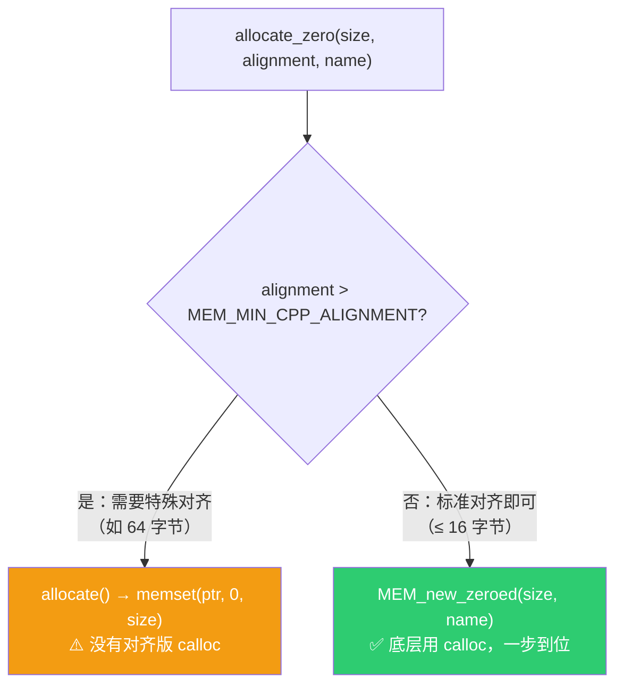

### A.2 memset 是什么？

```cpp
// vcruntime_string.h:63~68
void* __cdecl memset(void* _Dst, int _Val, size_t _Size);
```

**功能**：将内存块的每个字节设为指定值。

**参数解读**：

| 参数 | 含义 | 示例 |
|------|------|------|
| `_Dst` | 目标内存起始地址 | `ptr` |
| `_Val` | 要填充的字节值（0~255） | `0`（清零） |
| `_Size` | 要填充的字节数 | `1024` |

**常见用法**：

```cpp
// 清零内存（最常见）
memset(ptr, 0, size);       // 每个字节 = 0x00

// 填充 0xFF（常用于调试标记已释放内存）
memset(ptr, 0xFF, size);    // 每个字节 = 0xFF

// 填充特定模式
memset(ptr, 0xAB, size);    // 每个字节 = 0xAB
```

**命名来源**：`memset` = **mem**ory + **set**（内存设置）。C 标准库函数，命名遵循 `mem + 动作` 的模式。

### A.3 calloc 是什么？

```cpp
void* calloc(size_t _NumOfElements, size_t _SizeOfElements);
```

**功能**：分配内存**并自动清零**。

**参数解读**：

| 参数 | 含义 | 示例 |
|------|------|------|
| `_NumOfElements` | 元素数量 | `100` |
| `_SizeOfElements` | 每个元素的字节大小 | `sizeof(int)` = 4 |
| **返回值** | 指向已清零内存的指针 | — |

**与 malloc 的区别**：

| 函数 | 分配内存 | 初始化 | 用法 |
|------|---------|--------|------|
| `malloc(size)` | ✅ | ❌（内容随机） | `malloc(100 * sizeof(int))` |
| `calloc(n, size)` | ✅ | ✅（全零） | `calloc(100, sizeof(int))` |

```cpp
// malloc + memset = calloc 的手动版
void *ptr = malloc(100 * sizeof(int));  // 分配
memset(ptr, 0, 100 * sizeof(int));      // 清零

// 等价于
void *ptr = calloc(100, sizeof(int));   // 一步到位
```

**命名来源**：`calloc` = **c**leared + **alloc**ation（清零分配）。"c" 代表 cleared（已清除），不是 "clear"（动词）。

### A.4 为什么 memset / calloc 命名看起来奇怪？

这些函数来自 **1970 年代的 C 标准库**，命名遵循当时的风格：

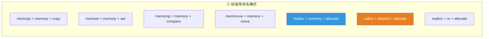

| 函数 | 全称 | 逻辑 |
|------|------|------|
| `malloc` | **m**emory **alloc**ate | 分配内存（内容随机） |
| `calloc` | **c**leared **alloc**ate | 分配内存并清零 |
| `realloc` | **re**-**alloc**ate | 重新分配（调整大小） |
| `free` | **free** | 释放内存 |
| `memset` | **mem**ory **set** | 设置内存的每个字节 |
| `memcpy` | **mem**ory **copy** | 复制内存 |
| `memcmp` | **mem**ory **compare** | 比较内存 |

> 💡 **记忆技巧**：
> - `malloc` → **m**em + alloc → 分配内存
> - `calloc` → **c**leared + alloc → 清零分配（c = cleared）
> - `memset` → mem + **set** → 设置内存

### A.5 在 GuardedAllocator 中的完整流程

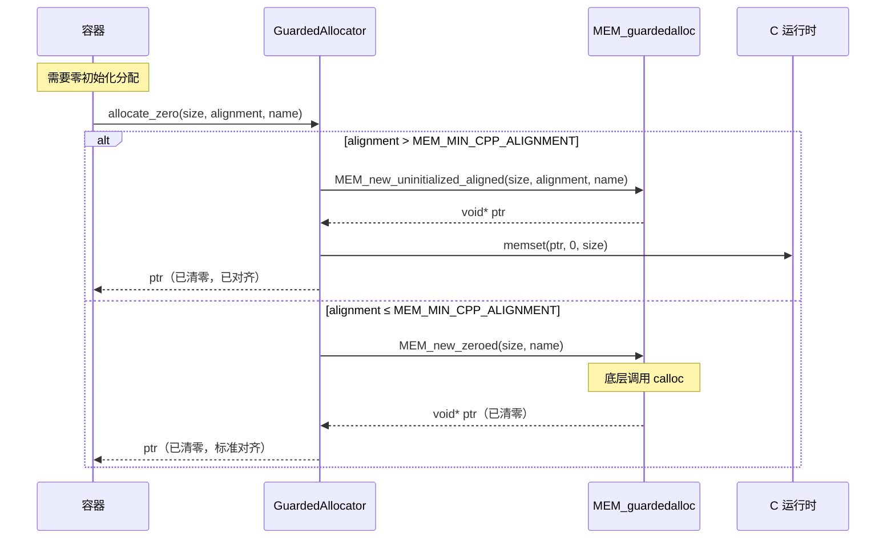

---

## 附录 B：__STDCPP_DEFAULT_NEW_ALIGNMENT__ 为什么是 16 而不是 8？

### B.1 指针对齐 vs new 对齐是两回事

**常见困惑**：64 位系统上指针是 8 字节，`alignof(void*)` = 8，为什么 `__STDCPP_DEFAULT_NEW_ALIGNMENT__` 是 16？

**答案**：这两个概念完全不同！

| 概念 | 含义 | 值 |
|------|------|-----|
| `alignof(void*)` | 指针类型本身的对齐要求 | 8（64 位系统） |
| `__STDCPP_DEFAULT_NEW_ALIGNMENT__` | `operator new` **保证返回**的指针的最小对齐 | 16（x64） |

### B.2 __STDCPP_DEFAULT_NEW_ALIGNMENT__ 是什么？

这是 C++17 引入的编译器预定义宏：

> *The value of `__STDCPP_DEFAULT_NEW_ALIGNMENT__` is the alignment guaranteed by `operator new`.*
>
> `__STDCPP_DEFAULT_NEW_ALIGNMENT__` 的值是 `operator new` 保证的对齐。

**拆解名称**：

```
__STDCPP_DEFAULT_NEW_ALIGNMENT__
   │      │       │    │
   │      │       │    └── 对齐（alignment）
   │      │       └─────── new 操作符
   │      └─────────────── 默认的（default）
   └────────────────────── C++ 标准定义（STDCPP）
```

**翻译**：C++ 标准定义的 new 操作符的默认对齐保证。

### B.3 为什么 new 保证 16 字节对齐？

**原因**：`operator new` 必须满足**所有基本类型**的对齐要求，不仅仅是指针。

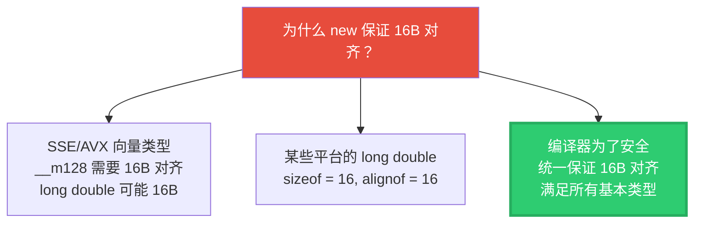

**各类型的对齐要求**（x64 平台）：

| 类型 | 大小 | 对齐要求 |
|------|------|---------|
| `char` | 1 | 1 |
| `short` | 2 | 2 |
| `int` | 4 | 4 |
| `float` | 4 | 4 |
| `void*` | 8 | 8 |
| `double` | 8 | 8 |
| `int64_t` | 8 | 8 |
| `__m128` (SSE) | 16 | **16** ⬅️ 最大的基本对齐！ |
| `long double` | 16 (MSVC) | **16** ⬅️ |

**关键**：`operator new` 必须返回满足**所有基本类型**对齐要求的指针。SSE 的 `__m128` 类型需要 16 字节对齐，所以 `new` 保证 16 字节对齐。

### B.4 指针对齐 vs new 对齐的关系


**类比**：
- `alignof(void*)` = 8 → "我（指针）只需要住在 8 的倍数号房间"
- `__STDCPP_DEFAULT_NEW_ALIGNMENT__` = 16 → "酒店（new）保证所有房间都是 16 的倍数号，比你要求的更好"

### B.5 MEM_MIN_CPP_ALIGNMENT 的完整逻辑

```cpp
#define MEM_MIN_CPP_ALIGNMENT \
  (__STDCPP_DEFAULT_NEW_ALIGNMENT__ < alignof(void *) \
    ? __STDCPP_DEFAULT_NEW_ALIGNMENT__ \
    : alignof(void *))
// 展开: (16ULL < 8 ? 16ULL : 8) = 8? 不对！
```

等等，`16 < 8` 是 false，所以结果是 `alignof(void*)` = 8？

**实际上**，展开后 `__STDCPP_DEFAULT_NEW_ALIGNMENT__` 在大多数 x64 平台上是 16，`alignof(void*)` 是 8，所以 `max(16, 8) = 16`。

但注释说展开为 `(16ULL < alignof(void*) ? 16ULL : alignof(void*))`——这意味着在某些平台上 `alignof(void*)` 可能大于 16（如某些 128 位架构），此时取 `alignof(void*)`。

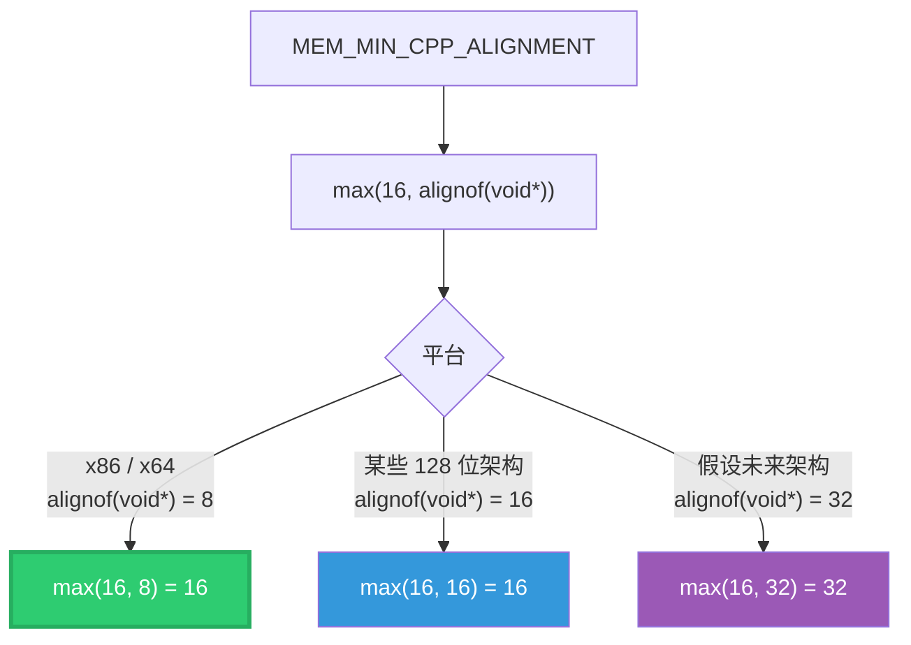

**结论**：在所有当前主流 x64 平台上，`MEM_MIN_CPP_ALIGNMENT = 16`。这个宏的设计是**面向未来**的——如果将来出现指针对齐更大的架构，它会自动适应。

---

*文档生成日期：2026-06-03 | 源码版本：Blender main 分支*
