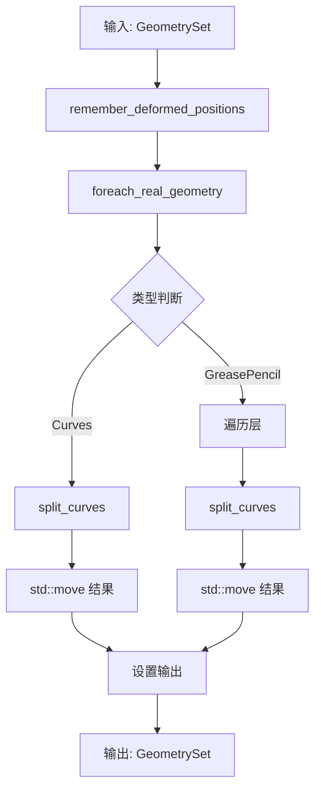

# Split Curve 节点 - 曲线拆分

> 按选中的控制点拆分曲线，或将选中的线段删除

- [Split Curve 节点 - 曲线拆分](#split-curve-节点---曲线拆分)
  - [📖 源码位置](#-源码位置)
  - [🔍 核心问题解答](#-核心问题解答)
    - [问题 1: 为什么声明输入输出在 `node_declare` 中？](#问题-1-为什么声明输入输出在-node_declare-中)
    - [问题 2: 为什么用 `params.extract_input<>()` 获取输入？](#问题-2-为什么用-paramsextract_input-获取输入)
    - [问题 3: `remember_deformed_positions_if_necessary()` 是干什么的？](#问题-3-remember_deformed_positions_if_necessary-是干什么的)
    - [问题 4: 用户问题：为什么用两个 `if` 而不是 `else if`？](#问题-4-用户问题为什么用两个-if-而不是-else-if)
    - [问题 5: 为什么用 `std::move`？](#问题-5-为什么用-stdmove)
    - [问题 6: 为什么分别用了这些容器？](#问题-6-为什么分别用了这些容器)
  - [📊 节点执行流程](#-节点执行流程)
  - [✅ 总结](#-总结)

---

## 📖 源码位置

**文件：** `source/blender/nodes/geometry/nodes/node_geo_curve_split.cc`

**功能：**
- 输入：曲线几何体 + 选择字段
- 处理：在选中的控制点处拆分曲线
- 输出：拆分后的曲线几何体

---

## 🔍 核心问题解答

### 问题 1: 为什么声明输入输出在 `node_declare` 中？

**源码位置：** `node_geo_curve_split.cc:20~37`

```cpp
static void node_declare(NodeDeclarationBuilder &b)
{
  b.use_custom_socket_order();
  b.allow_any_socket_order();
  b.add_input<decl::Geometry>("Curve"_ustr)
      .supported_type({GeometryComponent::Type::Curve, GeometryComponent::Type::GreasePencil})
      .description("Curves to split");
  b.add_output<decl::Geometry>("Curve"_ustr).propagate_all().align_with_previous();
  // ...
}
```

**为什么这样设计？**

```cpp
// 方式1：声明式（Blender 使用）
static void node_declare(NodeDeclarationBuilder &b) {
    b.add_input<decl::Geometry>("Curve"_ustr);
    b.add_input<decl::Bool>("Selection"_ustr);
    b.add_output<decl::Geometry>("Curve"_ustr);
}

// 方式2：直接操作全局变量（不推荐）
static void node_declare(bNode &node) {
    node.inputs[0] = ...;  // ❌ 直接操作内部结构
    node.outputs[0] = ...;
}
```

**声明式的优势：**

| 特性 | 声明式 (`NodeDeclarationBuilder`) | 直接操作 |
|------|----------------------------------|---------|
| **抽象层次** | 高（声明意图） | 低（操作细节） |
| **类型安全** | ✅ 编译期检查 | ❌ 运行时错误 |
| **可维护性** | ✅ 清晰易读 | ❌ 容易出错 |
| **灵活性** | ✅ 支持字段、描述等元数据 | ❌ 需要手动设置 |

**关键设计原则：声明 vs 实现分离**

```cpp
// node_declare: 只声明"有什么"
// 告诉 Blender：这个节点有 3 个输入、1 个输出

// node_geo_exec: 实现"做什么"
// 实际执行：读取输入、处理、设置输出

// 分离的好处：
// 1. UI 可以独立读取声明（不需要执行节点）
// 2. 类型检查在连接时就完成
// 3. 代码更清晰
```

---

### 问题 2: 为什么用 `params.extract_input<>()` 获取输入？

**源码位置：** `node_geo_curve_split.cc:199~202`

```cpp
static void node_geo_exec(GeoNodeExecParams params)
{
  GeometrySet geometry_set = params.extract_input<GeometrySet>("Curve"_ustr);
  const Field<bool> selection_field = params.extract_input<Field<bool>>("Selection"_ustr);
  const bool delete_segment = params.extract_input<bool>("Delete Segment"_ustr);
  // ...
}
```

**为什么不用全局变量？**

用户问的是：为什么声明时用 `"Curve"_ustr` 字符串，而不用当前文件定义的变量？

**澄清：** 在 `node_declare` 中确实使用了字符串字面量：

```cpp
static void node_declare(NodeDeclarationBuilder &b)
{
  b.add_input<decl::Geometry>("Curve"_ustr)  // 字符串字面量
      .supported_type({GeometryComponent::Type::Curve, GeometryComponent::Type::GreasePencil})
      .description("Curves to split");         // 字符串字面量
  b.add_output<decl::Geometry>("Curve"_ustr).propagate_all().align_with_previous();
  b.add_input<decl::Bool>("Selection"_ustr)  // 字符串字面量
      .default_value(true)
      .hide_value()
      .field_on_all()
      .description("Control points used to split curves");  // 字符串字面量
  // ...
}
```

**为什么用字符串字面量而不是变量？**

```cpp
// ❌ 如果用变量（不推荐）
static const char* INPUT_CURVE = "Curve";
static const char* INPUT_SELECTION = "Selection";

static void node_declare(NodeDeclarationBuilder &b) {
    b.add_input<decl::Geometry>(INPUT_CURVE);  // 可以工作，但...
    // 问题：
    // 1. 运行时才能确定字符串值
    // 2. 编译器无法检查字符串是否正确
    // 3. 需要额外的变量定义
}

// ✅ 用字符串字面量 + _ustr 后缀（推荐）
static void node_declare(NodeDeclarationBuilder &b) {
    b.add_input<decl::Geometry>("Curve"_ustr);  // 编译期确定
    // 优势：
    // 1. "Curve"_ustr 是编译期常量（StringRef）
    // 2. 编译器可以内联优化
    // 3. 代码更简洁，一眼就能看到名称
}
```

**`_ustr` 后缀是什么？**

```cpp
// "Curve"_ustr 是一个用户定义字面量（C++11）
// 它创建一个 StringRef 对象，而不是 const char*

// 对比：
"Curve"       // const char[6]（包含 '\0'）
"Curve"_ustr  // StringRef（包含指针和长度，无 '\0'）

// StringRef 的优势：
// 1. 知道长度（O(1) 获取长度，不需要 strlen）
// 2. 可以引用子字符串而不复制
// 3. 比较操作更高效
```

**为什么不用全局变量？**

```cpp
// ❌ 错误方式：全局变量存储输入数据
static GeometrySet g_geometry;  // 全局变量
static Field<bool> g_selection; // 全局变量

static void node_geo_exec(GeoNodeExecParams params) {
    g_geometry = ...;  // 污染全局命名空间
    g_selection = ...; // 线程不安全！
}

// ✅ 正确方式：参数传递，局部变量
static void node_geo_exec(GeoNodeExecParams params) {
    GeometrySet geometry_set = params.extract_input<GeometrySet>("Curve"_ustr);
    // 局部变量，线程安全，作用域清晰
}
```

**`extract_input<>()` 的优势：**

```cpp
// 1. 类型安全：编译期检查类型匹配
GeometrySet geo = params.extract_input<GeometrySet>("Curve"_ustr);      // ✅
int wrong = params.extract_input<int>("Curve"_ustr);                     // ❌ 编译错误！

// 2. 名称检查：确保输入存在
auto val = params.extract_input<GeometrySet>("不存在的输入"_ustr);        // ❌ 运行时错误

// 3. 所有权转移：extract 意味着"取出"（move 语义）
GeometrySet geo = params.extract_input<GeometrySet>("Curve"_ustr);
// geo 拥有数据，params 中不再有此输入（避免复制）
```

**为什么声明类型和取出类型不同？**

```cpp
// 声明时：decl::Geometry 是 socket 类型
b.add_input<decl::Geometry>("Curve"_ustr)

// 取出时：GeometrySet 是实际数据类型
GeometrySet geometry_set = params.extract_input<GeometrySet>("Curve"_ustr);
```

**Socket 类型 vs 数据类型的关系：**

| Socket 类型 (`decl::Xxx`) | 实际数据类型 | 说明 |
|--------------------------|-------------|------|
| `decl::Geometry` | `GeometrySet` | 几何体集合 |
| `decl::Bool` | `Field<bool>` 或 `bool` | 布尔字段或值 |
| `decl::Float` | `Field<float>` 或 `float` | 浮点字段或值 |
| `decl::Int` | `Field<int>` 或 `int` | 整数字段或值 |
| `decl::Vector` | `Field<float3>` | 3D 向量字段 |

**用户问题：为什么声明类型和取出类型不相同或更相近？**

**澄清：** 它们是有对应关系的，但不是完全相同：

```cpp
// 声明时：decl::Xxx 是 Socket 的"类型标识"
b.add_input<decl::Geometry>("Curve"_ustr)
//      ↑ 告诉 Blender：这个 socket 接受几何体

// 取出时：GeometrySet 是实际的"数据类型"
GeometrySet geometry_set = params.extract_input<GeometrySet>("Curve"_ustr);
//          ↑ 实际的数据结构
```

**为什么不设计成完全相同的名称？**

```cpp
// 方案1：完全相同（不推荐）
b.add_input<GeometrySet>("Curve"_ustr);  // 直接用数据类型
// 问题：GeometrySet 是一个复杂的类，不适合做模板参数标识

// 方案2：使用类型别名（当前设计）
b.add_input<decl::Geometry>("Curve"_ustr);  // decl::Geometry 是轻量级标识
// 优势：
// 1. decl::Geometry 是一个空的标签类型，编译期开销为0
// 2. 可以附加元数据（如 .supported_type()）
// 3. 分离"接口声明"和"数据实现"
```

**设计哲学：分离关注点**

```cpp
// decl::Geometry 关注：UI 如何显示这个 socket
// - 颜色（绿色表示几何体）
// - 可以连接什么类型的 socket
// - 在节点编辑器中的行为

// GeometrySet 关注：实际存储什么数据
// - 包含 Curves、Mesh、PointCloud 等
// - 内存布局
// - 操作方法
```

**更详细的对应关系：**

| Socket 声明      | 数据类型        | 为什么这样设计                            |
| ---------------- | --------------- | ----------------------------------------- |
| `decl::Geometry` | `GeometrySet`   | GeometrySet 可能包含多种几何类型          |
| `decl::Bool`     | `Field<bool>`   | 字段可以每点不同，也可以是常量            |
| `decl::Bool`     | `bool`          | 有些布尔输入只是开关（如 Delete Segment） |
| `decl::Float`    | `Field<float>`  | 字段可以是复杂表达式                      |
| `decl::Float`    | `float`         | 有些只是简单数值                          |
| `decl::Int`      | `Field<int>`    | 同上                                      |
| `decl::Int`      | `int`           | 同上                                      |
| `decl::Vector`   | `Field<float3>` | 3D 向量字段                               |

**关键区别：字段 vs 值**

```cpp
// 字段（Field）：可以是每点不同的值
const Field<bool> selection_field = params.extract_input<Field<bool>>("Selection"_ustr);
// selection_field 可能是一个：
// - 常量 true
// - 顶点位置 > 0 的表达式
// - 复杂的几何接近查询

// 值（Value）：单一的值
const bool delete_segment = params.extract_input<bool>("Delete Segment"_ustr);
// delete_segment 只是一个 bool 值（true 或 false）
```

**为什么同一个 decl::Bool 可以取出两种类型？**

```cpp
// 在 node_declare 中：
b.add_input<decl::Bool>("Selection"_ustr)
    .field_on_all()  // ← 标记为字段输入
    
b.add_input<decl::Bool>("Delete Segment"_ustr)
    // 没有 .field_on_all()，表示普通布尔值

// 在 node_geo_exec 中：
// "Selection" 有 .field_on_all()，所以取出 Field<bool>
const Field<bool> selection_field = params.extract_input<Field<bool>>("Selection"_ustr);

// "Delete Segment" 是普通值，所以取出 bool
const bool delete_segment = params.extract_input<bool>("Delete Segment"_ustr);
```

```cpp
// 字段 vs 值的区别：
// 字段（Field）：可以是常量，也可以是每点/每面不同的值
const Field<bool> selection_field = params.extract_input<Field<bool>>("Selection"_ustr);
// selection_field 可能是一个常量 true，也可能是一个复杂的字段表达式

// 值（Value）：单一的值
const bool delete_segment = params.extract_input<bool>("Delete Segment"_ustr);
// delete_segment 只是一个 bool 值
```

---

### 问题 3: `remember_deformed_positions_if_necessary()` 是干什么的？

**源码位置：** `node_geo_curve_split.cc:204`

```cpp
GeometryComponentEditData::remember_deformed_positions_if_necessary(geometry_set);
```

**功能解释：**

```cpp
// 场景：用户在编辑模式下移动了顶点（变形）
//       然后执行了 Split Curve 节点
// 
// 问题：Split 会创建新的曲线，变形信息会丢失！
//
// 解决：在执行节点前，"记住"当前的变形位置
//       这样后续操作可以恢复这些变形

// 具体流程：
// 1. 用户移动顶点 → 产生变形（deformed positions）
// 2. 执行 Split Curve 节点
// 3. remember_deformed_positions_if_necessary() 保存变形
// 4. Split 操作创建新曲线
// 5. 变形信息被保留，可以正确应用
```

**为什么重要？**

```cpp
// 没有 remember：
// 用户移动顶点 → 执行 Split → 变形丢失 → 顶点回到原位 ❌

// 有 remember：
// 用户移动顶点 → remember → 执行 Split → 变形保留 → 顶点保持移动后位置 ✅
```

---

### 问题 4: 用户问题：为什么用两个 `if` 而不是 `else if`？

**源码位置：** `node_geo_curve_split.cc:207~240`

```cpp
geometry::foreach_real_geometry(geometry_set, [&](GeometrySet &geometry_set) {
  if (Curves *curves_id = geometry_set.get_curves_for_write()) {
    // 处理曲线...
  }
  if (GreasePencil *grease_pencil = geometry_set.get_grease_pencil_for_write()) {
    // 处理蜡笔...
  }
});
```

**为什么不用 `else if`？**

```cpp
// ❌ 如果用 else if（错误！）
if (Curves *curves_id = geometry_set.get_curves_for_write()) {
    // 处理曲线
} else if (GreasePencil *grease_pencil = geometry_set.get_grease_pencil_for_write()) {
    // 处理蜡笔
}
// 问题：GeometrySet 可以同时包含曲线和蜡笔！
// 如果是 else if，蜡笔处理永远不会执行

// ✅ 用两个独立的 if（正确）
if (Curves *curves_id = geometry_set.get_curves_for_write()) {
    // 处理曲线
}
if (GreasePencil *grease_pencil = geometry_set.get_grease_pencil_for_write()) {
    // 处理蜡笔
}
// 两者都会检查，都会执行（如果存在）
```

**关键概念：GeometrySet 可以包含多种几何类型**

```cpp
// GeometrySet 不是单一几何体，而是一个"集合"
class GeometrySet {
    // 可能同时包含：
    Mesh *mesh;              // 网格
    Curves *curves;          // 曲线
    PointCloud *point_cloud; // 点云
    GreasePencil *grease_pencil; // 蜡笔
    // ...
};

// 场景1：只有曲线
GeometrySet set1;
set1.add_curves(...);
// get_curves_for_write() 返回指针
// get_grease_pencil_for_write() 返回 nullptr

// 场景2：只有蜡笔
GeometrySet set2;
set2.add_grease_pencil(...);
// get_curves_for_write() 返回 nullptr
// get_grease_pencil_for_write() 返回指针

// 场景3：同时有曲线和蜡笔（可能吗？）
// 在当前节点中不太可能，但 GeometrySet 的设计支持这种可能性
// 用两个独立的 if 确保代码的通用性和健壮性
```

**设计原则：防御性编程**

```cpp
// 即使当前节点不太可能同时有曲线和蜡笔
// 用两个独立的 if 也是更好的做法：
// 1. 代码更清晰：每个 if 处理一种类型
// 2. 更健壮：不假设 GeometrySet 只包含一种类型
// 3. 更容易扩展：添加新类型时只需再加一个 if
```

---

### 问题 5: 为什么用 `std::move`？

**源码位置：** `node_geo_curve_split.cc:216,236,243`

```cpp
curves_id->geometry.wrap() = std::move(dst_curves);
// ...
drawing->strokes_for_write() = std::move(dst_curves);
// ...
params.set_output("Curve"_ustr, std::move(geometry_set));
```

**什么是 `std::move`？**

```cpp
// std::move 不是"移动"数据，而是"转换为右值引用"
// 目的是启用"移动语义"，避免复制

// 没有 std::move（复制）：
bke::CurvesGeometry dst_curves = ...;  // 创建新曲线
// ...
curves_id->geometry.wrap() = dst_curves;  // ❌ 复制！（深拷贝所有数据）

// 有 std::move（移动）：
bke::CurvesGeometry dst_curves = ...;  // 创建新曲线
// ...
curves_id->geometry.wrap() = std::move(dst_curves);  // ✅ 移动！（只复制指针）
```

**移动 vs 复制的区别：**

```cpp
// CurvesGeometry 内部（简化）：
class CurvesGeometry {
    int *points;      // 指向点数据的指针
    int num_points;   // 点数量
    // ... 更多数据
};

// 复制（Copy）：
CurvesGeometry a = b;  // 深拷贝
// 1. 分配新内存
// 2. 复制所有点数据
// 3. 复制所有属性
// O(n) 复杂度，n = 数据量

// 移动（Move）：
CurvesGeometry a = std::move(b);  // 浅拷贝
// 1. 复制指针（8字节）
// 2. 复制数量（4字节）
// 3. 清空 b 的指针（防止双重释放）
// O(1) 复杂度！
```

**为什么这里必须用 `std::move`？**

```cpp
// 场景：Split Curve 创建了大量新曲线数据
bke::CurvesGeometry dst_curves(dst_to_src_point.size(), dst_to_src_curve.size());
// 可能包含数百万个点！

// 如果不使用 std::move：
curves_id->geometry.wrap() = dst_curves;  // 复制数百万个点！慢！

// 使用 std::move：
curves_id->geometry.wrap() = std::move(dst_curves);  // 只复制指针！快！
```

---

### 问题 6: 为什么分别用了这些容器？

**源码位置：** `node_geo_curve_split.cc:42,43,45,48,54,55,187`

```cpp
// 42: OffsetIndices<int> - 曲线到点的索引映射
const OffsetIndices<int> points_by_curve = src_curves.points_by_curve();

// 43: VArray<bool> - 循环标志（虚拟数组）
const VArray<bool> src_cyclic = src_curves.cyclic();

// 45: Array<bool> - 需要拆分的点标记
Array<bool> points_to_split(src_curves.points_num(), false);

// 48,49,50,51: Vector<int> - 动态增长的数组
Vector<int> dst_curve_counts;
Vector<int> dst_to_src_curve;
Vector<bool> dst_cyclic;
Vector<int> dst_to_src_point;

// 54: IndexRange - 索引范围
for (const int curve_i : src_curves.curves_range()) {

// 55: Span<bool> - 只读视图
const Span<bool> curve_points_to_split = points_to_split.as_span().slice(points);

// 187: IndexMask - 选中点的掩码
const IndexMask selection = evaluator.get_evaluated_as_mask(0);
```

**容器选择的原因：**

| 容器 | 用途 | 为什么选择 |
|------|------|-----------|
| `OffsetIndices<int>` | 曲线到点的映射 | 高效存储变长数组的偏移 |
| `VArray<bool>` | 循环标志 | 可能共享数据，延迟求值 |
| `Array<bool>` | 拆分标记 | 固定大小，需要修改 |
| `Vector<int>` | 动态收集结果 | 大小未知，需要 append |
| `IndexRange` | 迭代范围 | 轻量级，表示范围而非数组 |
| `Span<bool>` | 只读切片 | 零拷贝视图 |
| `IndexMask` | 选中点集合 | 高效表示稀疏选择 |

**详细解释：**

```cpp
// 1. OffsetIndices<int> - 变长数组的偏移表
// 用途：每条曲线有不同数量的点
// curves: [A,B,C] [D,E] [F,G,H]
//          0,1,2   3,4   5,6,7
// points_by_curve[0] = IndexRange(0, 3)  // 曲线0：3个点，从索引0开始
// points_by_curve[1] = IndexRange(3, 2)  // 曲线1：2个点，从索引3开始
// 优势：O(1) 访问任意曲线的点范围

// 2. VArray<bool> - 虚拟数组
// 用途：src_cyclic 可能是一个常量（所有曲线都是循环的）
// 或者是一个实际数组（每条曲线有不同的循环设置）
// VArray 统一处理这两种情况，延迟实际数据获取

// 3. Array<bool> - 固定大小数组
// 用途：标记每个点是否需要拆分
// 大小已知（points_num），需要随机访问和修改

// 4. Vector<int> - 动态数组
// 用途：收集拆分后的结果
// 大小未知（取决于选择），需要频繁 append
// Vector 支持高效扩容

// 5. IndexRange - 范围表示
// 用途：表示一段连续的索引
// 轻量级（只有 start 和 size），不拥有数据

// 6. Span<bool> - 只读视图
// 用途：查看 Array 的一部分，不复制数据
// curve_points_to_split 是 points_to_split 的一个切片

// 7. IndexMask - 稀疏集合
// 用途：表示选中的点（可能很少）
// 比 Array<bool> 更节省内存（存储索引而非布尔值）
```

---

## 📊 节点执行流程



---

## ✅ 总结

| 问题 | 答案 |
|------|------|
| 为什么声明式定义？ | 类型安全、UI独立、代码清晰 |
| 为什么用 `extract_input`？ | 类型安全、线程安全、所有权转移 |
| 声明类型 vs 取出类型？ | Socket类型 vs 数据类型，字段 vs 值 |
| `remember_deformed_positions`？ | 保存编辑模式的变形信息 |
| 为什么没用 ELFI？ | 不是字段求值，是立即执行的几何操作 |
| 为什么用 `std::move`？ | 避免深拷贝，提高性能 |
| 容器选择？ | 根据用途选择：固定/动态、只读/可写、稀疏/密集 |
