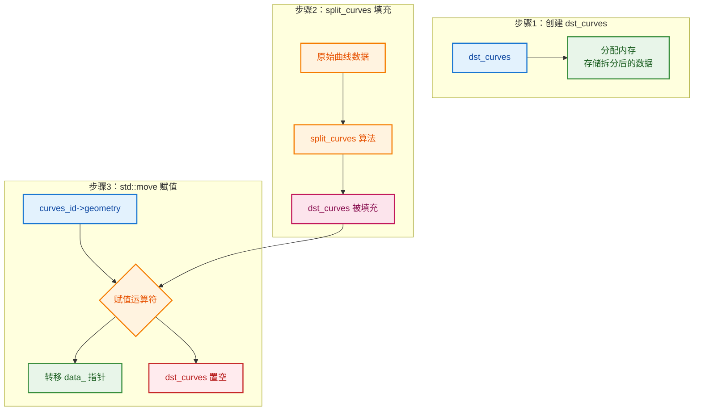

# Curve Split 实现细节

> 深入解释 `curves_id->geometry.wrap()` 和 `std::move` 的使用
- [Curve Split 实现细节](#curve-split-实现细节)
  - [📖 问题来源](#-问题来源)
  - [2. 为什么用 `std::move` 和 `dst_curves`？](#2-为什么用-stdmove-和-dst_curves)
    - [代码流程](#代码流程)
    - [为什么用 `std::move`？](#为什么用-stdmove)
    - [CurvesGeometry 的内部结构](#curvesgeometry-的内部结构)
  - [3. 为什么能直接赋值？](#3-为什么能直接赋值)
    - [赋值运算符的工作原理](#赋值运算符的工作原理)
    - [完整流程可视化](#完整流程可视化)
    - [内存变化](#内存变化)
    - [为什么这样设计？](#为什么这样设计)
    - [完整代码解释](#完整代码解释)
  - [✅ 总结](#-总结)

---

## 📖 问题来源

**用户问题：**
1. 为什么这样访问 `curves_id->geometry.wrap()`？
2. 为什么用 `std::move` 和 `dst_curves`？
3. 为什么能直接赋值 `curves_id->geometry.wrap() = std::move(dst_curves)`？

**涉及代码：** `node_geo_curve_split.cc:209,216`

---

## 2. 为什么用 `std::move` 和 `dst_curves`？

### 代码流程

```cpp
bke::CurvesGeometry dst_curves;  // 1. 创建新的几何数据（在栈上）

if (split_curves(curves_id->geometry.wrap(),  // 2. 传入原始数据
                 ..., 
                 dst_curves))                 // 3. 填充 dst_curves
{
    // 4. 拆分成功，替换原始数据
    curves_id->geometry.wrap() = std::move(dst_curves);
}
```

### 为什么用 `std::move`？

```cpp
// 场景：dst_curves 包含大量数据（数百万个点）

// ❌ 不用 std::move（复制）：
curves_id->geometry.wrap() = dst_curves;
// 发生深拷贝：复制所有点数据！慢！

// ✅ 用 std::move（移动）：
curves_id->geometry.wrap() = std::move(dst_curves);
// 只复制指针（8字节）！快！
```

### CurvesGeometry 的内部结构

```cpp
class CurvesGeometry {
    ImplicitSharingPtr<CurvesGeometryImpl> data_;
    // 包含：点位置、切线、属性等（可能很大）
};

// 复制：深拷贝所有数据
// 移动：只复制指针，原对象置空
```

---

## 3. 为什么能直接赋值？

### 赋值运算符的工作原理

```cpp
// CurvesGeometry 的赋值运算符（简化）
CurvesGeometry &CurvesGeometry::operator=(CurvesGeometry &&other)
{
    // 移动赋值
    data_ = std::move(other.data_);
    // 只转移指针所有权，不复制数据！
    return *this;
}
```

### 完整流程可视化



### 内存变化

```cpp
// 赋值前：
curves_id->geometry.data_  → [原始曲线数据]
dst_curves.data_           → [拆分后的新数据]

// std::move 赋值后：
curves_id->geometry.data_  → [拆分后的新数据]  // 接管了 dst_curves 的数据
dst_curves.data_           → nullptr           // dst_curves 被置空
```

### 为什么这样设计？

| 设计选择 | 原因 |
|---------|------|
| `dst_curves` 在栈上 | 自动管理生命周期，出作用域自动销毁 |
| `std::move` 转移所有权 | 避免深拷贝，提高性能 |
| 直接赋值 | 使用移动赋值运算符，高效转移数据 |

### 完整代码解释

```cpp
// 209 行：传入原始几何数据给 split_curves
split_curves(curves_id->geometry.wrap(),  // 原始曲线（输入）
             bke::CurvesFieldContext(...), // 字段上下文
             selection_field,              // 选择字段
             delete_segment,               // 是否删除线段
             attribute_filter,             // 属性过滤器
             dst_curves)                   // 输出：拆分后的新几何

// 216 行：用拆分后的数据替换原始数据
curves_id->geometry.wrap() = std::move(dst_curves);
//  ↑↑↑↑↑↑↑↑↑↑↑↑
//  将 dst_curves 的数据"移动"给 curves_id->geometry
//  不发生深拷贝，只是转移指针所有权
```

---

## ✅ 总结

| 问题 | 答案 |
|------|------|
| 为什么用 `wrap()`？ | Blender 惯用法，确保可写访问 |
| 为什么用 `std::move`？ | 避免深拷贝，提高性能 |
| 为什么能直接赋值？ | CurvesGeometry 有移动赋值运算符 |
| 赋值后发生了什么？ | 数据所有权从 `dst_curves` 转移到 `curves_id->geometry` |
