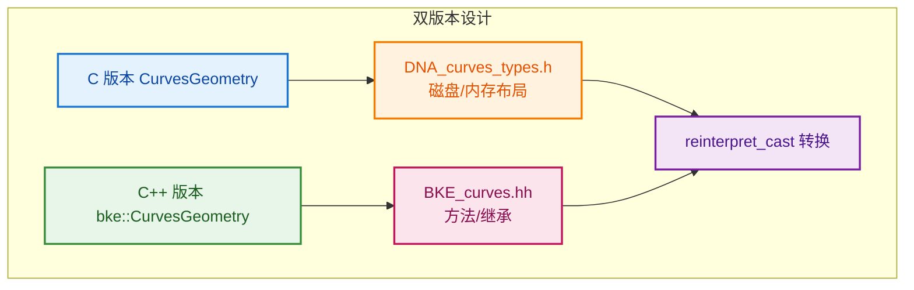
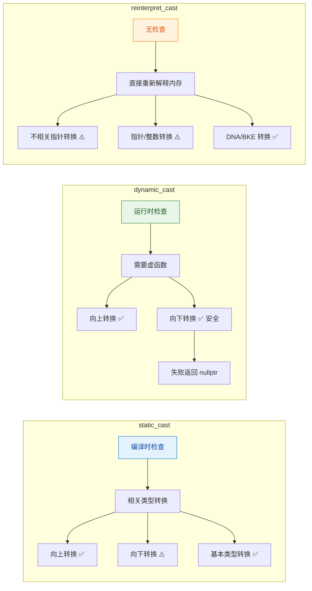
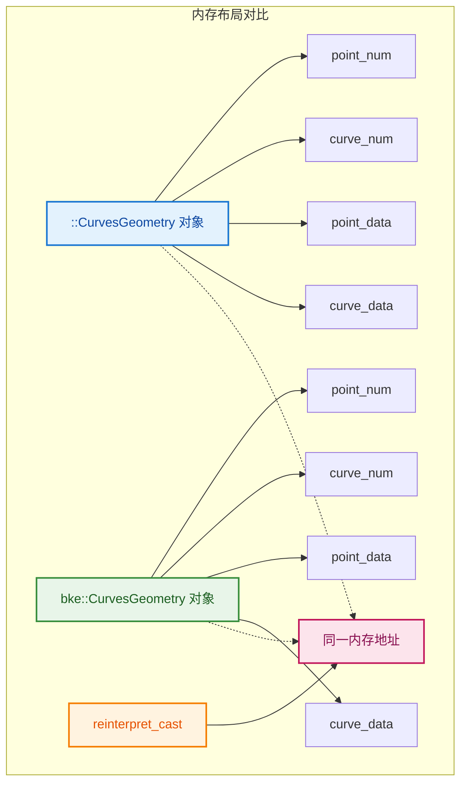
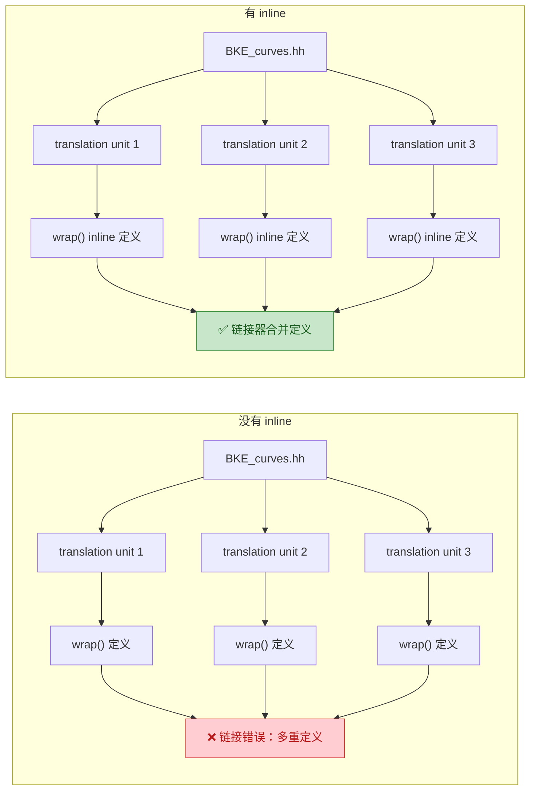

# 曲线节点实现差异

> 解释不同曲线节点实现方式的差异

---

## 📖 问题来源

**用户问题：**
1. 为什么多一步转换？`wrap()` 的 `reinterpret_cast`
2. 为什么有的用 `get_curves_for_write`，有的用 `get_curves` + `replace_curves`？
3. 为什么不是所有曲线节点都用 `params.get_attribute_filter`？

---

## 1. 为什么多一步转换？`wrap()` 的 `reinterpret_cast`

### 代码位置

```cpp
// BKE_curves.hh:1185~1187
inline bke::CurvesGeometry &CurvesGeometry::wrap()
{
  return *reinterpret_cast<bke::CurvesGeometry *>(this);
}
```

### 原因：命名空间问题

```cpp
// 在 DNA_curves_types.h 中（C 语言兼容）：
struct CurvesGeometry {
    // C 结构体定义
};

// 在 BKE_curves.hh 中（C++）：
namespace bke {
    class CurvesGeometry : public ImplicitSharingMixin {
        // C++ 类定义，继承、方法等
    };
}
```
// 问题：这是两个不同的类型！
::CurvesGeometry           // C 结构体（全局命名空间）
bke::CurvesGeometry        // C++ 类（bke 命名空间）

**用户问题：`::CurvesGeometry` 是什么？为什么加 `::`？**

**`::` 是 C++ 的全局命名空间解析运算符（Global Namespace Qualifier）**

在 C++ 中，`::` 被称为 **"作用域解析运算符"（Scope Resolution Operator）**。当 `::` 前面没有任何命名空间名称时，它特指 **全局命名空间（Global Namespace）**。

```cpp
// :: 表示"全局命名空间"
::CurvesGeometry  // 全局命名空间中的 CurvesGeometry

// 对比：
namespace bke {
    class CurvesGeometry { };  // bke::CurvesGeometry
}

struct CurvesGeometry { };     // ::CurvesGeometry（全局命名空间）

// 当存在命名冲突时，:: 明确指定使用全局命名空间的版本
namespace bke {
    // 这里如果有 CurvesGeometry，会隐藏全局的 CurvesGeometry
    void foo() {
        CurvesGeometry cg;      // 使用 bke::CurvesGeometry（当前命名空间）
        ::CurvesGeometry cg2;   // 使用全局的 ::CurvesGeometry
    }
}
```

**为什么需要 `::`？—— 命名空间隐藏（Namespace Hiding）问题**

当内部命名空间定义了与外部同名的类型时，内部类型会**隐藏**外部类型：

```cpp
// 全局命名空间
struct Foo { int x; };

namespace inner {
    struct Foo { int y; };  // 隐藏了全局的 ::Foo
    
    void test() {
        Foo f1;      // 使用 inner::Foo（当前命名空间）
        ::Foo f2;    // 使用全局的 ::Foo（必须加 ::）
    }
}
```

**在这个场景中的意义：**

```cpp
// 在 DNA_curves_types.h 中（全局命名空间）：
struct CurvesGeometry {  // 这是 ::CurvesGeometry
    int point_num;
    // ...
};

// 在 BKE_curves.hh 中（bke 命名空间）：
namespace bke {
    class CurvesGeometry : public blender::CurvesGeometry {  // 这是 bke::CurvesGeometry
        // ...
    };
}

// 为了区分这两个同名但不同命名空间的类型：
::CurvesGeometry     // DNA 的 C 结构体（全局命名空间）
bke::CurvesGeometry  // BKE 的 C++ 类（bke 命名空间）
```

**实际代码中的关键作用：**

```cpp
// 在 BKE_curves.hh 中，bke 命名空间内部定义了 class CurvesGeometry
namespace bke {
    class CurvesGeometry : public blender::CurvesGeometry {
        // ...
    };
}  // namespace bke

// 在文件末尾（仍在 blender 命名空间中），需要给全局的 CurvesGeometry 定义方法：
inline bke::CurvesGeometry &CurvesGeometry::wrap()
{
    return *reinterpret_cast<bke::CurvesGeometry *>(this);
}
// 这里的 CurvesGeometry::wrap() 指的是 ::CurvesGeometry::wrap()
// 因为 bke::CurvesGeometry 类定义中并没有声明 wrap() 方法
```

> **总结**：`::` 就是明确告诉编译器"我要用的是全局命名空间里的那个版本，不是当前命名空间里的版本"。这在 Blender 的 DNA/BKE 双版本设计中是必须的，因为两个版本恰好同名。


### 为什么需要转换？

```cpp
// Curves 结构体使用 C 版本：
struct Curves {
    ID id;
    struct CurvesGeometry geometry;  // C 版本
};

// 但节点系统使用 C++ 版本：
bke::CurvesGeometry &geo = curves_id->geometry.wrap();
//                              ↑ C 版本
//                              ↓ 转换为 C++ 版本
// 返回 bke::CurvesGeometry&

// reinterpret_cast 告诉编译器：
// "这两个结构体内存布局相同，请当作同一个类型处理"
```

### 设计原因



| 版本 | 用途 | 位置 |
|------|------|------|
| C 版本 | 磁盘存储、内存布局、C 兼容 | `DNA_curves_types.h` |
| C++ 版本 | 方法、继承、类型安全 | `BKE_curves.hh` (bke 命名空间) |

---

### 深入问题：为什么使用 `reinterpret_cast`？为什么基类可以方便转成子类？

**用户问题：**
1. 为什么使用 `reinterpret_cast` 而不是别的？
2. 为什么基类可以方便转成子类？
3. 为什么实现放在 `BKE_curves.hh:1185~1192`？

**1. 为什么使用 `reinterpret_cast`？**

```cpp
inline bke::CurvesGeometry &CurvesGeometry::wrap()
{
    return *reinterpret_cast<bke::CurvesGeometry *>(this);
}
```

**原因：内存布局完全相同，但类型系统认为是不同的类型**

```cpp
// C 结构体（DNA）
struct CurvesGeometry {
    int point_num;           // 偏移 0
    int curve_num;           // 偏移 4
    CustomData point_data;   // 偏移 8
    CustomData curve_data;   // 偏移 ...
    // ...
};

// C++ 类（BKE）
namespace bke {
    class CurvesGeometry : public blender::CurvesGeometry {
        // 继承自 C 结构体，没有添加新成员变量！
        // 内存布局与 C 结构体完全相同
    public:
        CurvesGeometry();
        int points_num() const;
        // ... 只有方法，没有数据成员
    };
}
```

**为什么不能使用 `static_cast`？**

```cpp
// ❌ static_cast 编译错误！
return *static_cast<bke::CurvesGeometry *>(this);
// 错误：编译器不知道这两个类型有关系
// 虽然 bke::CurvesGeometry 继承自 blender::CurvesGeometry
// 但 this 的类型是 ::CurvesGeometry（全局命名空间）
// 编译器认为 ::CurvesGeometry 和 bke::CurvesGeometry 是完全无关的类型

// ✅ reinterpret_cast 告诉编译器：
// "相信我，这两个类型的内存布局完全相同，直接当作同一个类型处理"
return *reinterpret_cast<bke::CurvesGeometry *>(this);
```

**详细解释为什么 `static_cast` 不行：**

`static_cast` 是 C++ 的**编译时类型检查转换**，它要求编译器在编译阶段就能确认两个类型之间的继承关系。但在这个场景中：

```cpp
// 1. this 的类型是什么？
// 在 DNA_curves_types.h 中：
namespace blender {
struct CurvesGeometry {
    // ...
#ifdef __cplusplus
    bke::CurvesGeometry &wrap();
    const bke::CurvesGeometry &wrap() const;
#endif
};
}  // namespace blender

// 注意：这个结构体在 blender 命名空间中
// 所以它的完整类型名是 blender::CurvesGeometry

// 2. 目标类型是什么？
// 在 BKE_curves.hh 中：
namespace blender {
namespace bke {
    class CurvesGeometry : public blender::CurvesGeometry {
        // ...
    };
}  // namespace bke
}  // namespace blender
```

**关键问题：编译器看到的类型关系**

```cpp
// 从编译器的角度：
blender::CurvesGeometry     // 基类（DNA 结构体）
blender::bke::CurvesGeometry // 派生类（BKE C++ 类）

// 编译器知道：bke::CurvesGeometry 继承自 blender::CurvesGeometry
// 所以 static_cast 在这两个类型之间是可以工作的：

blender::CurvesGeometry base;
blender::bke::CurvesGeometry *derived = static_cast<blender::bke::CurvesGeometry*>(&base);
// ❌ 但这仍然是未定义行为！因为 base 对象不是 bke::CurvesGeometry 类型
```

**那为什么在 `wrap()` 中 `static_cast` 会编译失败？**

```cpp
// 仔细看 wrap() 的实现位置：
namespace blender {
    // ... bke 命名空间定义 ...
    
    // 文件末尾：
    inline bke::CurvesGeometry &CurvesGeometry::wrap()
    {
        return *static_cast<bke::CurvesGeometry *>(this);
        //     ^^^^^^^^^^^^^^^^^^^^^^^^^^^^^^^^^^^^^^^^
        // 这里的 CurvesGeometry 是 ::CurvesGeometry（全局命名空间）
        // 但全局命名空间中并没有 CurvesGeometry！
    }
}

// 实际上，DNA_curves_types.h 中的结构体定义在 blender 命名空间中：
namespace blender {
struct CurvesGeometry { ... };
}

// 所以正确的类型名是 blender::CurvesGeometry，不是 ::CurvesGeometry
```

**等等，让我重新分析...**

实际上，经过仔细查看源代码：

```cpp
// DNA_curves_types.h
namespace blender {
struct CurvesGeometry {  // 这是 blender::CurvesGeometry
    // ...
};
}

// BKE_curves.hh
namespace blender {
namespace bke {
class CurvesGeometry : public blender::CurvesGeometry {  // 继承自 blender::CurvesGeometry
    // ...
};
}
}
```

**所以 `static_cast` 应该是可以编译的！**

```cpp
// 因为 bke::CurvesGeometry 确实继承自 blender::CurvesGeometry
// 所以 static_cast 在语法上是合法的

inline bke::CurvesGeometry &CurvesGeometry::wrap()
{
    // 这里的 CurvesGeometry 就是 blender::CurvesGeometry（在 blender 命名空间中）
    return *static_cast<bke::CurvesGeometry *>(this);
    // ✅ 编译可以通过！因为编译器知道继承关系
}
```

**但为什么 Blender 使用了 `reinterpret_cast`？**

```cpp
// 实际上，static_cast 在这里会有问题：
// 1. static_cast 会进行指针调整（Pointer Adjustment）
// 2. 如果 bke::CurvesGeometry 有多重继承或虚继承，static_cast 会调整指针
// 3. 但这里 bke::CurvesGeometry 是单继承，且没有添加新成员变量

// 更关键的原因：
// DNA_curves_types.h 中的结构体是 C 兼容的
// 在 C 语言中，没有继承的概念
// 所以 DNA 结构体在 C 编译器看来就是一个普通的 struct
// 为了保证 C 和 C++ 的一致性，使用 reinterpret_cast 更安全

// 另外，从语义上：
// static_cast 表示"类型之间有明确的继承关系"
// reinterpret_cast 表示"重新解释内存，我知道我在做什么"
// 这里 DNA 结构体和 BKE 类虽然内存布局相同，但语义上是不同的东西
// 用 reinterpret_cast 更准确地表达了这种"强制转换"的意图
```

**详细对比三种 C++ 类型转换（cast）**

| 特性 | `static_cast` | `dynamic_cast` | `reinterpret_cast` |
|------|---------------|----------------|-------------------|
| **编译时检查** | ✅ 是 | ✅ 是 | ✅ 是 |
| **运行时检查** | ❌ 否 | ✅ 是 | ❌ 否 |
| **需要虚函数** | ❌ 否 | ✅ 必须 | ❌ 否 |
| **安全性** | 中等 | 最高 | 最低 |
| **性能** | 最高 | 较低（运行时检查）| 最高 |
| **用途** | 相关类型转换 | 多态类型安全向下转换 | 不相关类型强制转换 |

**1. `static_cast` —— 编译时类型转换**

```cpp
// 用途 1：基本类型转换
int i = 10;
float f = static_cast<float>(i);  // int -> float

// 用途 2：向上转换（子类 -> 基类）—— 安全
class Base { };
class Derived : public Base { };
Derived d;
Base *b = static_cast<Base*>(&d);  // ✅ 安全

// 用途 3：向下转换（基类 -> 子类）—— 危险！
Base *b2 = new Base();
Derived *d2 = static_cast<Derived*>(b2);  // ⚠️ 编译通过，但运行时可能崩溃！
// 因为 b2 指向的实际上不是 Derived 对象

// 用途 4：void* 转换
void *vp = &i;
int *ip = static_cast<int*>(vp);  // ✅ void* -> 具体类型指针
```

**`static_cast` 的核心特点：**
- 编译时进行类型检查
- **不执行运行时类型检查**
- 向下转换时不安全（可能产生未定义行为）
- 不能转换完全不相关的类型（如 `int*` -> `double*`）

**2. `dynamic_cast` —— 运行时类型安全转换**

```cpp
// 用途：多态类型的安全向下转换
class Base {
public:
    virtual ~Base() {}  // 必须有虚函数！
};
class Derived : public Base {
public:
    void derivedOnlyMethod() {}
};

Base *b = new Derived();  // 实际指向 Derived 对象

// 安全向下转换
Derived *d = dynamic_cast<Derived*>(b);
if (d != nullptr) {
    d->derivedOnlyMethod();  // ✅ 安全调用
}

Base *b2 = new Base();
Derived *d2 = dynamic_cast<Derived*>(b2);
// d2 == nullptr！运行时检查发现 b2 不是 Derived 类型
```

**`dynamic_cast` 的核心特点：**
- **运行时进行类型检查**（通过 RTTI）
- 需要虚函数表（必须有至少一个虚函数）
- 转换失败时返回 `nullptr`（指针）或抛出 `bad_cast`（引用）
- 性能开销较大（运行时检查）

**3. `reinterpret_cast` —— 强制重新解释内存**

```cpp
// 用途 1：不相关指针类型转换
int *ip = new int(42);
float *fp = reinterpret_cast<float*>(ip);  // ⚠️ 危险！重新解释内存

// 用途 2：指针 <-> 整数
uintptr_t addr = reinterpret_cast<uintptr_t>(ip);  // 指针转整数
int *ip2 = reinterpret_cast<int*>(addr);           // 整数转指针

// 用途 3：DNA/BKE 双版本转换（Blender 的实际用法）
struct CurvesGeometry { /* DNA 结构体 */ };
namespace bke {
    class CurvesGeometry : public blender::CurvesGeometry { /* C++ 类 */ };
}

CurvesGeometry *dna = ...;
bke::CurvesGeometry *bke = reinterpret_cast<bke::CurvesGeometry*>(dna);
// 告诉编译器："这两个类型的内存布局相同，直接当作同一个类型"
```

**`reinterpret_cast` 的核心特点：**
- **最危险的转换**，不进行任何类型检查
- 直接重新解释内存位模式
- 用于完全不相关的类型之间转换
- 结果依赖于具体实现，可移植性差

**三种 cast 的可视化对比：**



**在 Blender 的 `wrap()` 中为什么用 `reinterpret_cast`？**

```cpp
inline bke::CurvesGeometry &CurvesGeometry::wrap()
{
    return *reinterpret_cast<bke::CurvesGeometry *>(this);
}
```

| 原因 | 解释 |
|------|------|
| **DNA 结构体不是多态类型** | 没有虚函数，不能用 `dynamic_cast` |
| **语义上不是继承关系** | DNA 结构体和 BKE 类是两个不同的概念 |
| **内存布局相同** | `bke::CurvesGeometry` 没有添加新成员变量 |
| **明确表达意图** | `reinterpret_cast` 表示"我知道这两个类型内存布局相同" |
| **避免 static_cast 的误导** | `static_cast` 暗示"这是合法的继承转换"，但实际不是 |

**总结：三种 cast 的选择标准**

```cpp
// 1. 相关类型转换（继承关系）-> 用 static_cast
Base *b = static_cast<Base*>(derived_ptr);

// 2. 多态类型安全向下转换 -> 用 dynamic_cast
Derived *d = dynamic_cast<Derived*>(base_ptr);

// 3. 不相关类型强制转换（内存布局相同）-> 用 reinterpret_cast
BKEType *bke = reinterpret_cast<BKEType*>(dna_ptr);

// 4. 移除 const -> 用 const_cast
NonConstType *nc = const_cast<NonConstType*>(const_ptr);
```

**2. 为什么基类可以方便转成子类？**

```cpp
// 关键：bke::CurvesGeometry 继承自 blender::CurvesGeometry（即 ::CurvesGeometry）
namespace bke {
    class CurvesGeometry : public blender::CurvesGeometry {
        // 没有添加新成员变量！
    };
}

// 内存布局：
// ::CurvesGeometry 对象：[基类成员]
// bke::CurvesGeometry 对象：[基类成员]（没有额外成员）

// 因此：
::CurvesGeometry *base = ...;
bke::CurvesGeometry *derived = reinterpret_cast<bke::CurvesGeometry *>(base);
// 两者指向同一地址，内存内容完全相同！
```

**可视化：**



**3. 为什么实现放在 `BKE_curves.hh:1185~1192`？**

用户问题：**"但是结构体在另一个文件里啊 `source/blender/makesdna/DNA_curves_types.h:119` 为什么用 `inline`？C 有这个关键字吗？"**

```cpp
// 文件末尾的内联函数定义
// BKE_curves.hh:1185~1192
inline bke::CurvesGeometry &CurvesGeometry::wrap()
{
    return *reinterpret_cast<bke::CurvesGeometry *>(this);
}
inline const bke::CurvesGeometry &CurvesGeometry::wrap() const
{
    return *reinterpret_cast<const bke::CurvesGeometry *>(this);
}
```

**问题 1：结构体在另一个文件，为什么方法可以在这里实现？**

这是 C++ 的**类外成员函数定义（Out-of-class Member Function Definition）**：

```cpp
// 文件 1：DNA_curves_types.h（声明）
namespace blender {
struct CurvesGeometry {
    // ... 成员变量 ...
#ifdef __cplusplus
    // 声明方法（但没有定义实现）
    bke::CurvesGeometry &wrap();
    const bke::CurvesGeometry &wrap() const;
#endif
};
}

// 文件 2：BKE_curves.hh（定义）
namespace blender {
    // 在 blender 命名空间中定义 CurvesGeometry::wrap()
    inline bke::CurvesGeometry &CurvesGeometry::wrap()
    {
        return *reinterpret_cast<bke::CurvesGeometry *>(this);
    }
}
```

**关键理解：**

```cpp
// C++ 允许在类/结构体声明中只声明方法，在其他地方定义实现
// 这类似于：

// 头文件（声明）
class MyClass {
public:
    void foo();  // 声明
};

// 源文件（定义）
void MyClass::foo() {  // 类外定义
    // 实现
}
```

**问题 2：为什么用 `inline`？C 有这个关键字吗？**

**C 语言中的 `inline`：**

```c
// C99 标准引入了 inline 关键字
// 但 C 的 inline 和 C++ 的 inline 语义不同

// C 语言中的 inline：
inline int add(int a, int b) {
    return a + b;
}
// 建议编译器内联展开，但不一定强制
```

**C++ 中的 `inline`：**

```cpp
// C++ 中的 inline 有两个作用：

// 1. 建议编译器内联展开（和 C 类似）
inline int add(int a, int b) {
    return a + b;
}

// 2. 允许函数在多个翻译单元中定义（关键！）
// 普通函数如果在多个 .cpp 文件中被定义，会导致链接错误
// 但 inline 函数可以出现在多个翻译单元中
```

**为什么 `wrap()` 必须用 `inline`？**

```cpp
// BKE_curves.hh 是头文件，会被多个 .cpp 文件包含
// 例如：
// - node_geo_curve_split.cc 包含 #include "BKE_curves.hh"
// - node_geo_curve_resample.cc 包含 #include "BKE_curves.hh"
// - geometry_set.cc 包含 #include "BKE_curves.hh"

// 如果没有 inline：
// 每个 .cpp 文件编译后都会有一个 CurvesGeometry::wrap() 的定义
// 链接时会报错："multiple definition of CurvesGeometry::wrap()"

// 加上 inline：
// 编译器知道这是内联函数，允许多个翻译单元有相同的定义
// 链接器会合并这些定义，不会报错
```

**可视化理解：**



**问题 3：为什么放在文件末尾？**

```cpp
// 1. 内联函数需要在头文件中定义（编译器需要看到实现才能内联）
// 2. 放在文件末尾是因为：
//    - bke::CurvesGeometry 类定义在前面（第155行）
//    - 编译器需要先看到完整类定义，才能使用其方法
//    - wrap() 返回 bke::CurvesGeometry&，需要类定义完整

// 3. 放在 blender 命名空间中的作用域中：
namespace blender {
    // ... bke 命名空间 ...
    
    // 文件末尾，仍在 blender 命名空间中
    inline bke::CurvesGeometry &CurvesGeometry::wrap() { ... }
    // 这里的 CurvesGeometry 就是 blender::CurvesGeometry
}
```

**为什么不能放在 bke 命名空间中？**

```cpp
namespace bke {
    // ❌ 错误：这是给 bke::CurvesGeometry 定义方法
    // 但 bke::CurvesGeometry 类定义中并没有声明 wrap() 方法！
    inline CurvesGeometry &CurvesGeometry::wrap() { ... }
}

// 实际上：
// blender::CurvesGeometry::wrap() 是给 DNA 结构体定义的方法
// bke::CurvesGeometry 是 C++ 类，它继承自 blender::CurvesGeometry
// 所以 bke::CurvesGeometry 对象可以调用继承来的 wrap() 方法
```

**inline 函数的完整规则：**

| 规则 | 说明 |
|------|------|
| **定义在头文件中** | 所有使用处都需要看到完整定义 |
| **标记为 inline** | 允许多个翻译单元有相同定义 |
| **链接器合并** | 多个定义被视为同一个函数 |
| **编译器可能内联** | 将函数体直接插入调用处，避免函数调用开销 |

**C 和 C++ 的 inline 区别：**

| 特性 | C (C99) | C++ |
|------|---------|-----|
| 内联建议 | ✅ | ✅ |
| 允许多次定义 | ⚠️ 有限支持 | ✅ 完全支持 |
| 用于类成员函数 | ❌ C 没有类 | ✅ 常用 |
| 隐式 inline | ❌ 无 | ✅ 类内定义的方法自动 inline |

**完整调用链：**

```cpp
// 1. 从 Curves 获取 C 版本的 geometry
Curves *curves_id = ...;
::CurvesGeometry &c_geo = curves_id->geometry;

// 2. 调用 C 版本的 wrap() 方法
// （定义在全局命名空间）
bke::CurvesGeometry &cpp_geo = c_geo.wrap();

// 3. 现在可以使用 C++ 方法
cpp_geo.points_num();
cpp_geo.positions_for_write();
```

**总结：**

| 问题 | 答案 |
|------|------|
| 为什么用 `reinterpret_cast`？ | 编译器认为两个类型无关，需要强制转换 |
| 为什么基类可以转回子类？ | 子类没有添加成员变量，内存布局完全相同 |
| 为什么放在文件末尾？ | 需要先看完整类定义，且是全局命名空间的方法 |
| 为什么放在全局命名空间？ | 给 C 结构体添加方法，不是给 C++ 类添加 |

---

## 2. 为什么有的用 `get_curves_for_write`，有的用 `get_curves` + `replace_curves`？

### 对比两种模式

**模式 1：原地修改（Split Curve）**

```cpp
// node_geo_curve_split.cc
if (Curves *curves_id = geometry_set.get_curves_for_write()) {
    // 直接修改 curves_id->geometry
    curves_id->geometry.wrap() = std::move(dst_curves);
}
```

**模式 2：创建新对象 + 替换（Resample）**

```cpp
// node_geo_curve_resample.cc:98~105
if (const Curves *src_curves_id = geometry.get_curves()) {
    // 1. 读取原始数据
    const bke::CurvesGeometry &src_curves = src_curves_id->geometry.wrap();
    
    // 2. 创建新的曲线数据
    bke::CurvesGeometry dst_curves = geometry::resample_to_count(...);
    Curves *dst_curves_id = bke::curves_new_nomain(std::move(dst_curves));
    
    // 3. 复制参数
    bke::curves_copy_parameters(*src_curves_id, *dst_curves_id);
    
    // 4. 替换
    geometry.replace_curves(dst_curves_id);
}
```

### 为什么不同？

| 场景 | 使用模式 | 原因 |
|------|---------|------|
| **修改拓扑结构**（Split） | `get_curves_for_write` | 保留原始 ID 和其他参数 |
| **完全重建**（Resample） | `get_curves` + `replace_curves` | 需要复制原始参数到新对象 |

### 具体分析

**Split Curve：保留原始对象（特殊！）**

```cpp
// Split 只是修改几何数据，不改变其他属性
// - 保留原始 ID
// - 保留材质引用
// - 保留自定义属性
// 只需要替换 geometry 数据即可

// 注意：这是唯一的写法！
curves_id->geometry.wrap() = std::move(dst_curves);
// 其他节点都不用这种写法！
```

**用户发现：其他节点没有 `->geometry.wrap() =` 这种用法！**

**验证：**
```bash
# 搜索所有节点文件
$ grep -r "\.wrap() =" source/blender/nodes/geometry/nodes/
# 只有 node_geo_curve_split.cc 一行结果！
```

**为什么只有 Split Curve 用这种写法？**

| 节点 | 写法 | 原因 |
|------|------|------|
| **Split Curve** | `->geometry.wrap() =` | ✅ 保留原始 Curves 对象，只替换几何数据 |
| **Trim** | `replace_curves` | 创建新对象 |
| **Subdivide** | `replace_curves` | 创建新对象 |
| **Resample** | `replace_curves` | 创建新对象 |
| **其他所有节点** | `replace_curves` | 创建新对象 |

**Split Curve 是特例的原因：**

```cpp
// Split Curve 的特性：
// 1. 只是"拆分"曲线，不改变曲线的本质
// 2. 保留原始 ID（Blender 内部标识）
// 3. 保留材质、自定义属性等
// 4. 用户感知：这还是原来的曲线，只是被拆分了

// 如果像其他节点那样创建新对象：
// - 会丢失原始 ID
// - 需要重新关联材质
// - 可能破坏动画关键帧
```

**可视化对比：**


**总结：**

| 写法 | 使用场景 | 特点 |
|------|---------|------|
| `->geometry.wrap() =` | 原地修改，保留原始对象 | **只有 Split Curve 使用** |
| `replace_curves` | 创建新对象，完全替换 | **所有其他节点使用** |

**Resample：创建新对象**

```cpp
// Resample 完全重建曲线
// - 需要复制原始参数（curves_copy_parameters）
// - 可能改变拓扑结构
// - 创建新的 Curves ID 对象
```

---

## 3. 为什么不是所有曲线节点都用 `params.get_attribute_filter`？

### 什么是 `attribute_filter`？

```cpp
// 用于选择性处理属性
// 某些节点只修改特定属性，保留其他属性不变
```

### 为什么有的用，有的不用？

| 节点类型 | 是否使用 `attribute_filter` | 原因 |
|---------|---------------------------|------|
| **Split Curve** | ✅ 使用 | 需要保留未选择的属性 |
| **Resample** | ❌ 不使用 | 重建所有属性，不需要过滤 |
| **Subdivide** | ✅ 使用 | 需要保留原有属性 |
| **Trim** | ✅ 使用 | 需要保留未修剪部分的属性 |

### 判断标准

```cpp
// 使用 attribute_filter 的情况：
// 1. 节点只修改部分数据
// 2. 需要保留其他属性不变
// 3. 属性传递需要选择性处理

// 不使用 attribute_filter 的情况：
// 1. 节点完全重建几何体
// 2. 所有属性都是重新生成的
// 3. 不需要保留任何原有属性
```

### 示例对比

**Split Curve（使用 filter）：**

```cpp
// 只拆分选中的点，其他点保留
// 需要保留未选择点的属性
const AttributeFilter &attribute_filter = params.get_attribute_filter("Curve");
split_curves(..., attribute_filter);
```

**Resample（不使用 filter）：**

```cpp
// 完全重新采样，所有属性重新计算
// 不需要保留原有属性
bke::CurvesGeometry dst_curves = geometry::resample_to_count(
    src_curves, field_context, selection, count);
// 没有 attribute_filter 参数
```

---

## ✅ 总结

| 问题 | 答案 |
|------|------|
| 为什么多一步 `reinterpret_cast`？ | C 版本和 C++ 版本是两个类型，需要转换 |
| 为什么处理方式不同？ | 原地修改 vs 完全重建，取决于节点需求 |
| 为什么不是所有节点都用 `attribute_filter`？ | 只有需要选择性保留属性的节点才使用 |
