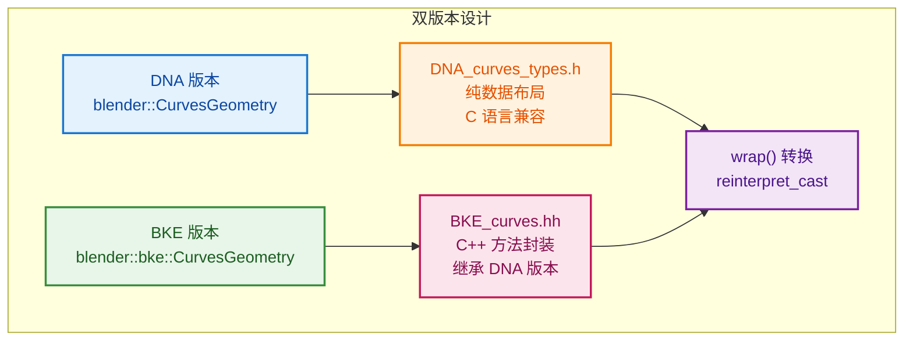

# 曲线节点实现差异

> 解释不同曲线节点实现方式的差异
- [曲线节点实现差异](#曲线节点实现差异)
  - [📖 问题来源](#-问题来源)
  - [1. 为什么多一步转换？`wrap()` 的 `reinterpret_cast`](#1-为什么多一步转换wrap-的-reinterpret_cast)
    - [代码位置](#代码位置)
    - [核心原因：同一个数据结构有两个 C++ 版本](#核心原因同一个数据结构有两个-c-版本)
    - [为什么需要 `wrap()` 转换？](#为什么需要-wrap-转换)
    - [设计原因](#设计原因)
    - [深入问题](#深入问题)
      - [Q1: `DNA_curves_types.h:20~23` 的前向声明是什么？](#q1-dna_curves_typesh2023-的前向声明是什么)
      - [Q2: 为什么声明和定义不在同一个头文件？](#q2-为什么声明和定义不在同一个头文件)
      - [Q3: 为什么使用 `reinterpret_cast` 而不是 `static_cast`？](#q3-为什么使用-reinterpret_cast-而不是-static_cast)
      - [Q4: 为什么实现放在 `BKE_curves.hh:1185~1192`？为什么用 `inline`？](#q4-为什么实现放在-bke_curveshh11851192为什么用-inline)
  - [2. 为什么有的用 `get_curves_for_write`，有的用 `get_curves` + `replace_curves`？](#2-为什么有的用-get_curves_for_write有的用-get_curves--replace_curves)
    - [对比两种模式](#对比两种模式)
    - [为什么不同？](#为什么不同)
    - [具体分析](#具体分析)
  - [3. 为什么不是所有曲线节点都用 `params.get_attribute_filter`？](#3-为什么不是所有曲线节点都用-paramsget_attribute_filter)
    - [什么是 `attribute_filter`？](#什么是-attribute_filter)
    - [为什么有的用，有的不用？](#为什么有的用有的不用)
    - [判断标准](#判断标准)
    - [示例对比](#示例对比)
  - [✅ 总结](#-总结)

---

## 📖 问题来源

**用户问题：**
1. 为什么多一步转换？`wrap()` 的 `reinterpret_cast`
2. 为什么有的用 `get_curves_for_write`，有的用 `get_curves` + `replace_curves`？
3. 为什么不是所有曲线节点都用 `params.get_attribute_filter`？

---

## 1. 为什么多一步转换？`wrap()` 的 `reinterpret_cast`

### 代码位置

```cpp
// BKE_curves.hh:1185~1187
inline bke::CurvesGeometry &CurvesGeometry::wrap()
{
  return *reinterpret_cast<bke::CurvesGeometry *>(this);
}
```

### 核心原因：同一个数据结构有两个 C++ 版本

Blender 中 `CurvesGeometry` 有两个版本：

| 版本 | 完整类型名 | 位置 | 用途 |
|------|-----------|------|------|
| DNA 版本 | `blender::CurvesGeometry` | `DNA_curves_types.h` | C 兼容的数据布局 |
| BKE 版本 | `blender::bke::CurvesGeometry` | `BKE_curves.hh` | C++ 方法封装 |

**注意：两个版本都在 `blender` 命名空间下，BKE 版本只是多了 `bke` 子命名空间。**

```cpp
// ========== DNA_curves_types.h ==========
namespace blender {

// 前向声明：告诉编译器 "bke 命名空间中有这两个类，后面会用到"
namespace bke {
class CurvesGeometry;           // 前向声明
class CurvesGeometryRuntime;    // 前向声明
}

// DNA 结构体定义（纯数据，C 兼容）
struct CurvesGeometry {
  int *curve_offsets = nullptr;
  AttributeStorage attribute_storage;
  CustomData point_data;
  // ... 更多成员 ...

#ifdef __cplusplus
  // 声明 wrap() 方法，但实现不在这个文件
  bke::CurvesGeometry &wrap();
  const bke::CurvesGeometry &wrap() const;
#endif
};

} // namespace blender


// ========== BKE_curves.hh ==========
namespace blender {

namespace bke {

// BKE 版本：继承 DNA 结构体，添加 C++ 方法
class CurvesGeometry : public blender::CurvesGeometry {
 public:
  CurvesGeometry();
  CurvesGeometry(int point_num, int curve_num);
  
  int points_num() const;
  MutableSpan<float3> positions_for_write();
  // ... 大量 C++ 方法 ...
};

} // namespace bke

// 在 blender 命名空间中，给 DNA 结构体定义 wrap() 方法
inline bke::CurvesGeometry &CurvesGeometry::wrap()
{
  return *reinterpret_cast<bke::CurvesGeometry *>(this);
}

} // namespace blender
```

### 为什么需要 `wrap()` 转换？

```cpp
// Curves 结构体嵌入的是 DNA 版本：
struct Curves {
  ID id;
  CurvesGeometry geometry;  // 这是 blender::CurvesGeometry（DNA 版本）
};

// 但节点系统需要 BKE 版本的方法：
Curves *curves_id = ...;

// ❌ 错误：DNA 版本没有 points_num() 方法
curves_id->geometry.points_num();  // 编译错误！

// ✅ 正确：先 wrap() 转换成 BKE 版本
bke::CurvesGeometry &geo = curves_id->geometry.wrap();
geo.points_num();  // 现在可以调用 C++ 方法了
```

### 设计原因



---

### 深入问题

#### Q1: `DNA_curves_types.h:20~23` 的前向声明是什么？

```cpp
namespace bke {
class CurvesGeometry;           // 前向声明（Forward Declaration）
class CurvesGeometryRuntime;    // 前向声明
}
```

**前向声明的作用：**

```cpp
// 问题：DNA 结构体需要声明 wrap() 方法，返回 bke::CurvesGeometry&
// 但此时 bke::CurvesGeometry 的完整定义还没出现（在另一个文件 BKE_curves.hh 中）

struct CurvesGeometry {
  // ...
  bke::CurvesGeometry &wrap();  // 需要知道 bke::CurvesGeometry 是一个类
};

// 解决方案：先告诉编译器 "bke::CurvesGeometry 是一个类，细节后面再告诉你"
namespace bke {
class CurvesGeometry;  // 前向声明："这是个类，先记住名字"
}

// 现在编译器知道 bke::CurvesGeometry 是一个类类型
// 可以声明引用和指针（不需要知道类的大小和成员）
bke::CurvesGeometry &wrap();        // ✅ 引用只需要知道类型名
bke::CurvesGeometry *ptr;           // ✅ 指针只需要知道类型名
bke::CurvesGeometry obj;            // ❌ 错误！需要完整定义才能创建对象
```

**前向声明的使用场景：**

| 场景 | 是否需要完整定义 | 前向声明是否足够 |
|------|----------------|----------------|
| 声明指针/引用 | ❌ 否 | ✅ 是 |
| 函数返回类型/参数 | ❌ 否 | ✅ 是 |
| 创建对象 | ✅ 是 | ❌ 否 |
| 访问成员 | ✅ 是 | ❌ 否 |
| 计算 sizeof | ✅ 是 | ❌ 否 |

#### Q2: 为什么声明和定义不在同一个头文件？

```cpp
// ========== DNA_curves_types.h ==========
// 这个文件的特殊性：
// 1. 被 C 和 C++ 共同包含（DNA 系统需要 C 兼容）
// 2. 被大量文件包含（几乎所有涉及曲线数据的文件）
// 3. 需要保持轻量（编译速度）

// 如果在这里包含 bke::CurvesGeometry 的完整定义：
// - 需要 #include "BKE_curves.hh"
// - BKE_curves.hh 又包含大量其他头文件
// - 导致每个包含 DNA_curves_types.h 的文件都编译变慢

// 解决方案：只声明方法，不定义实现
struct CurvesGeometry {
  // ... 数据成员 ...
#ifdef __cplusplus
  bke::CurvesGeometry &wrap();  // 只声明，实现放在 BKE_curves.hh
#endif
};


// ========== BKE_curves.hh ==========
// 这个文件：
// 1. 只被 C++ 文件包含
// 2. 包含大量 C++ 模板和方法
// 3. 编译更慢，但包含它的文件更少

// 在这里定义 wrap() 的实现
inline bke::CurvesGeometry &CurvesGeometry::wrap()
{
  return *reinterpret_cast<bke::CurvesGeometry *>(this);
}
```

**分离的好处：**

| 方面 | 声明定义分离 | 放在一起 |
|------|-------------|---------|
| DNA 文件大小 | 小（只有声明） | 大（包含完整 C++ 类） |
| 包含 DNA 的编译速度 | 快 | 慢 |
| C 兼容性 | ✅ 保持 | ❌ 破坏 |
| 代码组织 | 清晰分层 | 混杂 |

#### Q3: 为什么使用 `reinterpret_cast` 而不是 `static_cast`？

```cpp
inline bke::CurvesGeometry &CurvesGeometry::wrap()
{
  return *reinterpret_cast<bke::CurvesGeometry *>(this);
}
```

**首先明确：这两个类型的关系**

```cpp
// DNA 版本（基类）
namespace blender {
struct CurvesGeometry {
  int point_num;
  // ... 数据成员 ...
};
}

// BKE 版本（派生类）
namespace blender {
namespace bke {
class CurvesGeometry : public blender::CurvesGeometry {
  // 没有新增数据成员！只有方法
 public:
  int points_num() const;  // 方法
  // ...
};
}
}
```

**`static_cast` 在这两个类型之间是合法的！**

```cpp
// 因为 bke::CurvesGeometry 确实继承自 blender::CurvesGeometry
// 所以 static_cast 在语法上是合法的：

blender::CurvesGeometry *dna = ...;
bke::CurvesGeometry *bke = static_cast<bke::CurvesGeometry *>(dna);  // ✅ 可以编译
```

**但 Blender 选择 `reinterpret_cast` 的原因：**

```cpp
// 1. static_cast 会进行指针调整（Pointer Adjustment）
//    - 如果有多重继承，static_cast 会调整指针偏移
//    - 虽然这里是单继承，但 reinterpret_cast 更明确："不调整，直接 reinterpret"

// 2. 语义表达更准确
//    static_cast  表示 "这是编译器认可的类型转换"
//    reinterpret_cast 表示 "我保证内存布局相同，直接重新解释"
//    
//    这里 DNA 结构体和 BKE 类本质上就是"同一块内存的两种看法"
//    用 reinterpret_cast 更准确表达了这种"重新解释"的意图

// 3. 与 C 语言兼容的考虑
//    DNA 结构体需要被 C 代码使用
//    C 代码中这两个类型完全没有关系（C 没有继承）
//    reinterpret_cast 的语义更接近 C 的强制转换
```

**三种 cast 的对比：**

| cast 类型 | 是否可编译 | 是否安全 | 是否调整指针 | 语义 |
|-----------|-----------|---------|-------------|------|
| `static_cast` | ✅ | ⚠️ 有风险 | ✅ 可能调整 | "编译器认可的转换" |
| `dynamic_cast` | ❌（无虚函数）| ✅ 运行时检查 | ✅ 会调整 | "运行时类型检查" |
| `reinterpret_cast` | ✅ | ⚠️ 程序员负责 | ❌ 不调整 | "直接重新解释内存" |

**为什么 `static_cast` 有风险？**

```cpp
// static_cast 允许基类指针转派生类指针：
blender::CurvesGeometry dna_obj;  // 创建 DNA 版本对象
bke::CurvesGeometry *bke_ptr = static_cast<bke::CurvesGeometry *>(&dna_obj);
// ⚠️ 编译通过！但 dna_obj 实际上不是 bke::CurvesGeometry 类型！
// 如果 bke::CurvesGeometry 有虚函数表，调用虚函数会崩溃！

// reinterpret_cast 同样有这个风险
// 但 reinterpret_cast 明确告诉程序员："我知道我在做什么，后果自负"
```

**总结：**

```cpp
// Blender 使用 reinterpret_cast 的原因：
// 1. 明确表达"内存重新解释"的意图
// 2. 避免 static_cast 的指针调整（虽然这里不需要调整）
// 3. 与 C 代码的强制转换语义一致

// 实际上在这个特定场景下，static_cast 和 reinterpret_cast 结果相同
// 因为：
// - 单继承，没有指针调整
// - 没有虚函数表
// - 内存布局完全相同
```

#### Q4: 为什么实现放在 `BKE_curves.hh:1185~1192`？为什么用 `inline`？

```cpp
// BKE_curves.hh:1185~1192
inline bke::CurvesGeometry &CurvesGeometry::wrap()
{
  return *reinterpret_cast<bke::CurvesGeometry *>(this);
}
inline const bke::CurvesGeometry &CurvesGeometry::wrap() const
{
  return *reinterpret_cast<const bke::CurvesGeometry *>(this);
}
```

**问题 1：结构体在另一个文件，为什么方法可以在这里实现？**

这是 C++ 的**类外成员函数定义**：

```cpp
// 文件 1：声明方法
struct MyStruct {
  void foo();  // 只声明，不定义
};

// 文件 2：定义方法
void MyStruct::foo() {
  // 实现
}
```

C++ 允许在类/结构体中只声明方法，在其他地方定义实现。这是常规做法。

**问题 2：为什么用 `inline`？**

```cpp
// BKE_curves.hh 是头文件，会被多个 .cpp 文件包含：
// - node_geo_curve_split.cc  #include "BKE_curves.hh"
// - node_geo_curve_resample.cc #include "BKE_curves.hh"
// - geometry_set.cc #include "BKE_curves.hh"

// 如果没有 inline：
// 每个 .cpp 文件编译后都会产生一个 CurvesGeometry::wrap() 的定义
// 链接时报错：multiple definition of CurvesGeometry::wrap()

// 加上 inline：
// 告诉链接器："这个函数可能在多个翻译单元中定义，请合并它们"
```

**`inline` 在 C++ 中的两个作用：**

| 作用 | 说明 |
|------|------|
| **1. 链接器层面** | 允许函数在多个翻译单元中定义，避免链接错误 |
| **2. 编译器层面** | 建议编译器将函数体直接插入调用处，减少函数调用开销 |

**注意：作用 1 是强制的（标准规定），作用 2 只是建议（编译器可选择忽略）**

**问题 3：C 语言有 `inline` 吗？**

```c
// C99 引入了 inline 关键字
inline int add(int a, int b) {
  return a + b;
}
```

| 特性 | C (C99) | C++ |
|------|---------|-----|
| 内联建议 | ✅ | ✅ |
| 允许多次定义 | ⚠️ 有限制 | ✅ 完全支持 |
| 用于成员函数 | ❌ C 没有类 | ✅ 常用 |
| 类内定义自动 inline | ❌ 无 | ✅ |

**问题 4：为什么放在文件末尾？**

```cpp
namespace blender {

namespace bke {
// ... bke::CurvesGeometry 类定义（第155行开始）...
} // namespace bke

// 文件末尾，仍在 blender 命名空间中
inline bke::CurvesGeometry &CurvesGeometry::wrap() { ... }
// 这里的 CurvesGeometry 就是 blender::CurvesGeometry

} // namespace blender
```

放在文件末尾的原因：
1. `bke::CurvesGeometry` 类定义在前面，编译器需要先看到完整定义
2. `wrap()` 返回 `bke::CurvesGeometry&`，需要类定义完整
3. 放在 `blender` 命名空间中，给 `blender::CurvesGeometry`（DNA 结构体）定义方法

**为什么不能放在 `bke` 命名空间中？**

```cpp
namespace bke {
  // ❌ 错误：这是给 bke::CurvesGeometry 定义方法
  // 但 bke::CurvesGeometry 类中并没有声明 wrap() 方法！
  inline CurvesGeometry &CurvesGeometry::wrap() { ... }
}
```

**完整的调用链：**

```cpp
// 1. 获取 Curves 对象
Curves *curves_id = geometry_set.get_curves_for_write();

// 2. curves_id->geometry 是 blender::CurvesGeometry（DNA 版本）
//    调用 wrap() 转换为 bke::CurvesGeometry（BKE 版本）
bke::CurvesGeometry &geo = curves_id->geometry.wrap();

// 3. 现在可以使用 C++ 方法
geo.points_num();
geo.positions_for_write();
```

---

## 2. 为什么有的用 `get_curves_for_write`，有的用 `get_curves` + `replace_curves`？

### 对比两种模式

**模式 1：原地修改（Split Curve）**

```cpp
// node_geo_curve_split.cc
if (Curves *curves_id = geometry_set.get_curves_for_write()) {
    // 直接修改 curves_id->geometry
    curves_id->geometry.wrap() = std::move(dst_curves);
}
```

**模式 2：创建新对象 + 替换（Resample）**

```cpp
// node_geo_curve_resample.cc:98~105
if (const Curves *src_curves_id = geometry.get_curves()) {
    // 1. 读取原始数据
    const bke::CurvesGeometry &src_curves = src_curves_id->geometry.wrap();
    
    // 2. 创建新的曲线数据
    bke::CurvesGeometry dst_curves = geometry::resample_to_count(...);
    Curves *dst_curves_id = bke::curves_new_nomain(std::move(dst_curves));
    
    // 3. 复制参数
    bke::curves_copy_parameters(*src_curves_id, *dst_curves_id);
    
    // 4. 替换
    geometry.replace_curves(dst_curves_id);
}
```

### 为什么不同？

| 场景 | 使用模式 | 原因 |
|------|---------|------|
| **修改拓扑结构**（Split） | `get_curves_for_write` | 保留原始 ID 和其他参数 |
| **完全重建**（Resample） | `get_curves` + `replace_curves` | 需要复制原始参数到新对象 |

### 具体分析

**Split Curve：保留原始对象（特殊！）**

```cpp
// Split 只是修改几何数据，不改变其他属性
// - 保留原始 ID
// - 保留材质引用
// - 保留自定义属性
// 只需要替换 geometry 数据即可

// 注意：这是唯一的写法！
curves_id->geometry.wrap() = std::move(dst_curves);
// 其他节点都不用这种写法！
```

**用户发现：其他节点没有 `->geometry.wrap() =` 这种用法！**

**验证：**
```bash
# 搜索所有节点文件
$ grep -r "\.wrap() =" source/blender/nodes/geometry/nodes/
# 只有 node_geo_curve_split.cc 一行结果！
```

**为什么只有 Split Curve 用这种写法？**

| 节点 | 写法 | 原因 |
|------|------|------|
| **Split Curve** | `->geometry.wrap() =` | ✅ 保留原始 Curves 对象，只替换几何数据 |
| **Trim** | `replace_curves` | 创建新对象 |
| **Subdivide** | `replace_curves` | 创建新对象 |
| **Resample** | `replace_curves` | 创建新对象 |
| **其他所有节点** | `replace_curves` | 创建新对象 |

**Split Curve 是特例的原因：**

```cpp
// Split Curve 的特性：
// 1. 只是"拆分"曲线，不改变曲线的本质
// 2. 保留原始 ID（Blender 内部标识）
// 3. 保留材质、自定义属性等
// 4. 用户感知：这还是原来的曲线，只是被拆分了

// 如果像其他节点那样创建新对象：
// - 会丢失原始 ID
// - 需要重新关联材质
// - 可能破坏动画关键帧
```

**可视化对比：**


**总结：**

| 写法 | 使用场景 | 特点 |
|------|---------|------|
| `->geometry.wrap() =` | 原地修改，保留原始对象 | **只有 Split Curve 使用** |
| `replace_curves` | 创建新对象，完全替换 | **所有其他节点使用** |

**Resample：创建新对象**

```cpp
// Resample 完全重建曲线
// - 需要复制原始参数（curves_copy_parameters）
// - 可能改变拓扑结构
// - 创建新的 Curves ID 对象
```

---

## 3. 为什么不是所有曲线节点都用 `params.get_attribute_filter`？

### 什么是 `attribute_filter`？

```cpp
// 用于选择性处理属性
// 某些节点只修改特定属性，保留其他属性不变
```

### 为什么有的用，有的不用？

| 节点类型 | 是否使用 `attribute_filter` | 原因 |
|---------|---------------------------|------|
| **Split Curve** | ✅ 使用 | 需要保留未选择的属性 |
| **Resample** | ❌ 不使用 | 重建所有属性，不需要过滤 |
| **Subdivide** | ✅ 使用 | 需要保留原有属性 |
| **Trim** | ✅ 使用 | 需要保留未修剪部分的属性 |

### 判断标准

```cpp
// 使用 attribute_filter 的情况：
// 1. 节点只修改部分数据
// 2. 需要保留其他属性不变
// 3. 属性传递需要选择性处理

// 不使用 attribute_filter 的情况：
// 1. 节点完全重建几何体
// 2. 所有属性都是重新生成的
// 3. 不需要保留任何原有属性
```

### 示例对比

**Split Curve（使用 filter）：**

```cpp
// 只拆分选中的点，其他点保留
// 需要保留未选择点的属性
const AttributeFilter &attribute_filter = params.get_attribute_filter("Curve");
split_curves(..., attribute_filter);
```

**Resample（不使用 filter）：**

```cpp
// 完全重新采样，所有属性重新计算
// 不需要保留原有属性
bke::CurvesGeometry dst_curves = geometry::resample_to_count(
    src_curves, field_context, selection, count);
// 没有 attribute_filter 参数
```

---

## ✅ 总结

| 问题 | 答案 |
|------|------|
| 为什么多一步 `reinterpret_cast`？ | DNA 结构体和 BKE 类是两个类型，需要转换 |
| 为什么用 `reinterpret_cast` 而不是 `static_cast`？ | 语义更准确：表达"重新解释内存"的意图 |
| 为什么声明定义不在一个文件？ | DNA 文件需要轻量、C 兼容，BKE 文件包含完整 C++ 实现 |
| 为什么用 `inline`？ | 允许多个翻译单元定义同一个函数，避免链接错误 |
| 为什么处理方式不同？ | 原地修改 vs 完全重建，取决于节点需求 |
| 为什么不是所有节点都用 `attribute_filter`？ | 只有需要选择性保留属性的节点才使用 |
