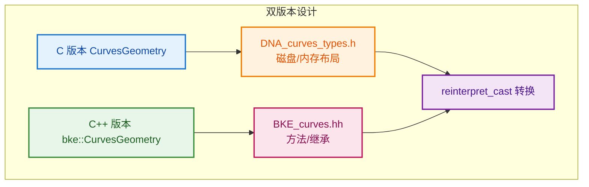

# 曲线节点实现差异

> 解释不同曲线节点实现方式的差异

---

## 📖 问题来源

**用户问题：**
1. 为什么多一步转换？`wrap()` 的 `reinterpret_cast`
2. 为什么有的用 `get_curves_for_write`，有的用 `get_curves` + `replace_curves`？
3. 为什么不是所有曲线节点都用 `params.get_attribute_filter`？

---

## 1. 为什么多一步转换？`wrap()` 的 `reinterpret_cast`

### 代码位置

```cpp
// BKE_curves.hh:1185~1187
inline bke::CurvesGeometry &CurvesGeometry::wrap()
{
  return *reinterpret_cast<bke::CurvesGeometry *>(this);
}
```

### 原因：命名空间问题

```cpp
// 在 DNA_curves_types.h 中（C 语言兼容）：
struct CurvesGeometry {
    // C 结构体定义
};

// 在 BKE_curves.hh 中（C++）：
namespace bke {
    class CurvesGeometry : public ImplicitSharingMixin {
        // C++ 类定义，继承、方法等
    };
}

// 问题：这是两个不同的类型！
::CurvesGeometry           // C 结构体（全局命名空间）
bke::CurvesGeometry        // C++ 类（bke 命名空间）
```

### 为什么需要转换？

```cpp
// Curves 结构体使用 C 版本：
struct Curves {
    ID id;
    struct CurvesGeometry geometry;  // C 版本
};

// 但节点系统使用 C++ 版本：
bke::CurvesGeometry &geo = curves_id->geometry.wrap();
//                              ↑ C 版本
//                              ↓ 转换为 C++ 版本
// 返回 bke::CurvesGeometry&

// reinterpret_cast 告诉编译器：
// "这两个结构体内存布局相同，请当作同一个类型处理"
```

### 设计原因



| 版本 | 用途 | 位置 |
|------|------|------|
| C 版本 | 磁盘存储、内存布局、C 兼容 | `DNA_curves_types.h` |
| C++ 版本 | 方法、继承、类型安全 | `BKE_curves.hh` (bke 命名空间) |

---

## 2. 为什么有的用 `get_curves_for_write`，有的用 `get_curves` + `replace_curves`？

### 对比两种模式

**模式 1：原地修改（Split Curve）**

```cpp
// node_geo_curve_split.cc
if (Curves *curves_id = geometry_set.get_curves_for_write()) {
    // 直接修改 curves_id->geometry
    curves_id->geometry.wrap() = std::move(dst_curves);
}
```

**模式 2：创建新对象 + 替换（Resample）**

```cpp
// node_geo_curve_resample.cc:98~105
if (const Curves *src_curves_id = geometry.get_curves()) {
    // 1. 读取原始数据
    const bke::CurvesGeometry &src_curves = src_curves_id->geometry.wrap();
    
    // 2. 创建新的曲线数据
    bke::CurvesGeometry dst_curves = geometry::resample_to_count(...);
    Curves *dst_curves_id = bke::curves_new_nomain(std::move(dst_curves));
    
    // 3. 复制参数
    bke::curves_copy_parameters(*src_curves_id, *dst_curves_id);
    
    // 4. 替换
    geometry.replace_curves(dst_curves_id);
}
```

### 为什么不同？

| 场景 | 使用模式 | 原因 |
|------|---------|------|
| **修改拓扑结构**（Split） | `get_curves_for_write` | 保留原始 ID 和其他参数 |
| **完全重建**（Resample） | `get_curves` + `replace_curves` | 需要复制原始参数到新对象 |

### 具体分析

**Split Curve：保留原始对象（特殊！）**

```cpp
// Split 只是修改几何数据，不改变其他属性
// - 保留原始 ID
// - 保留材质引用
// - 保留自定义属性
// 只需要替换 geometry 数据即可

// 注意：这是唯一的写法！
curves_id->geometry.wrap() = std::move(dst_curves);
// 其他节点都不用这种写法！
```

**用户发现：其他节点没有 `->geometry.wrap() =` 这种用法！**

**验证：**
```bash
# 搜索所有节点文件
$ grep -r "\.wrap() =" source/blender/nodes/geometry/nodes/
# 只有 node_geo_curve_split.cc 一行结果！
```

**为什么只有 Split Curve 用这种写法？**

| 节点 | 写法 | 原因 |
|------|------|------|
| **Split Curve** | `->geometry.wrap() =` | ✅ 保留原始 Curves 对象，只替换几何数据 |
| **Trim** | `replace_curves` | 创建新对象 |
| **Subdivide** | `replace_curves` | 创建新对象 |
| **Resample** | `replace_curves` | 创建新对象 |
| **其他所有节点** | `replace_curves` | 创建新对象 |

**Split Curve 是特例的原因：**

```cpp
// Split Curve 的特性：
// 1. 只是"拆分"曲线，不改变曲线的本质
// 2. 保留原始 ID（Blender 内部标识）
// 3. 保留材质、自定义属性等
// 4. 用户感知：这还是原来的曲线，只是被拆分了

// 如果像其他节点那样创建新对象：
// - 会丢失原始 ID
// - 需要重新关联材质
// - 可能破坏动画关键帧
```

**可视化对比：**


**总结：**

| 写法 | 使用场景 | 特点 |
|------|---------|------|
| `->geometry.wrap() =` | 原地修改，保留原始对象 | **只有 Split Curve 使用** |
| `replace_curves` | 创建新对象，完全替换 | **所有其他节点使用** |

**Resample：创建新对象**

```cpp
// Resample 完全重建曲线
// - 需要复制原始参数（curves_copy_parameters）
// - 可能改变拓扑结构
// - 创建新的 Curves ID 对象
```

---

## 3. 为什么不是所有曲线节点都用 `params.get_attribute_filter`？

### 什么是 `attribute_filter`？

```cpp
// 用于选择性处理属性
// 某些节点只修改特定属性，保留其他属性不变
```

### 为什么有的用，有的不用？

| 节点类型 | 是否使用 `attribute_filter` | 原因 |
|---------|---------------------------|------|
| **Split Curve** | ✅ 使用 | 需要保留未选择的属性 |
| **Resample** | ❌ 不使用 | 重建所有属性，不需要过滤 |
| **Subdivide** | ✅ 使用 | 需要保留原有属性 |
| **Trim** | ✅ 使用 | 需要保留未修剪部分的属性 |

### 判断标准

```cpp
// 使用 attribute_filter 的情况：
// 1. 节点只修改部分数据
// 2. 需要保留其他属性不变
// 3. 属性传递需要选择性处理

// 不使用 attribute_filter 的情况：
// 1. 节点完全重建几何体
// 2. 所有属性都是重新生成的
// 3. 不需要保留任何原有属性
```

### 示例对比

**Split Curve（使用 filter）：**

```cpp
// 只拆分选中的点，其他点保留
// 需要保留未选择点的属性
const AttributeFilter &attribute_filter = params.get_attribute_filter("Curve");
split_curves(..., attribute_filter);
```

**Resample（不使用 filter）：**

```cpp
// 完全重新采样，所有属性重新计算
// 不需要保留原有属性
bke::CurvesGeometry dst_curves = geometry::resample_to_count(
    src_curves, field_context, selection, count);
// 没有 attribute_filter 参数
```

---

## ✅ 总结

| 问题 | 答案 |
|------|------|
| 为什么多一步 `reinterpret_cast`？ | C 版本和 C++ 版本是两个类型，需要转换 |
| 为什么处理方式不同？ | 原地修改 vs 完全重建，取决于节点需求 |
| 为什么不是所有节点都用 `attribute_filter`？ | 只有需要选择性保留属性的节点才使用 |
