# 拆分曲线节点 - 核心类详解与协作

> 深入解析 `Curves`、`CurvesGeometry`、`CurvesFieldContext`、`FieldContext`、`FieldEvaluator`、`IndexMask` 六大核心类的实现、交互与搭配使用。
>
> 基于源码：`source/blender/nodes/geometry/nodes/node_geo_curve_split.cc:172~219`

---

## 🗺️ 总览：六类协作全景图

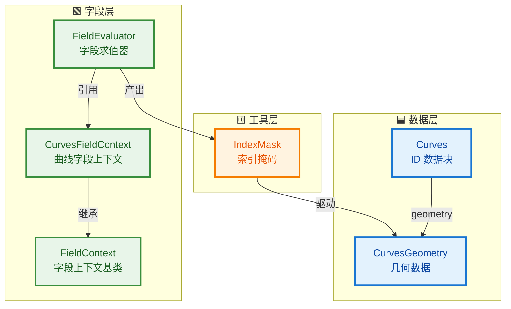

---

## 1️⃣ Curves - Blender ID 数据块

### 📖 源码位置

- `source/blender/makesdna/DNA_curves_types.h:194~248`

### 🎯 核心职责

`Curves` 是 Blender 的 **ID 数据块**，对应用户在场景中看到的一个"曲线对象"。它不只是几何数据，还包含动画、材质、标志等高级元数据。

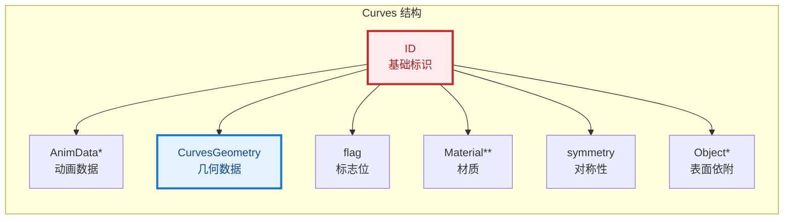

### 🔧 源码详解

```cpp
struct Curves {
#ifdef __cplusplus
    static constexpr ID_Type id_type = ID_CV;  // 标识这是 Curves 类型
#endif

    ID id;                    // Blender 所有数据块的基类（名称、用户计数等）
    struct AnimData *adt;     // 动画数据（必须紧跟 id）

    CurvesGeometry geometry;  // ⭐ 真正的几何数据在这里！

    int flag;                 // 标志位（如 HA_DS_EXPAND）
    char symmetry;            // 对称编辑标志（X/Y/Z）
    char selection_domain;    // 当前选择域（点/曲线）

    struct Object *surface;   // 依附的表面网格（毛发系统用）
    char *surface_uv_map;     // 表面 UV 贴图名称

    draw::CurvesBatchCache *batch_cache;  // 视口绘制缓存
};
```

### 💡 关键设计：为什么分离 `Curves` 和 `CurvesGeometry`？

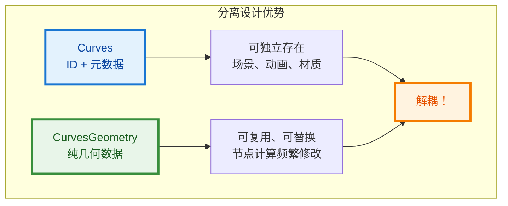

| 特性 | Curves | CurvesGeometry |
|------|--------|----------------|
| **职责** | ID 管理、动画、材质引用 | 纯几何数据存储 |
| **修改频率** | 低（用户重命名、改材质） | 高（每帧节点计算） |
| **复制成本** | 高（关联大量资源） | 可控（仅几何数据） |
| **在节点中的操作** | 保留原对象，只替换 geometry | 被频繁创建、修改、替换 |

### 📝 在拆分曲线节点中的使用

```cpp
// node_geo_curve_split.cc:207~219
if (Curves *curves_id = geometry_set.get_curves_for_write()) {
    bke::CurvesGeometry &src_curves = curves_id->geometry.wrap();  // 获取几何数据
    // ... 拆分计算 ...
    curves_id->geometry.wrap() = std::move(dst_curves);  // 替换几何数据，保留 Curves ID
}
```

**为什么只替换 `geometry` 而不创建新 `Curves`？**

- 保留原始 ID → 动画关键帧不失效
- 保留材质引用 → 不需要重新关联
- 保留自定义属性 → 用户数据不丢失
- **Split Curve 是 Blender 中唯一使用 `->geometry.wrap() =` 这种写法的节点！**

---

## 2️⃣ CurvesGeometry - 曲线几何数据核心

### 📖 源码位置

- C 结构体：`source/blender/makesdna/DNA_curves_types.h:119~187`
- C++ 包装类：`source/blender/blenkernel/BKE_curves.hh:155~`

### 🎯 核心职责

`CurvesGeometry` 是曲线数据的"身体"，存储所有控制点、属性、拓扑信息。它是**字段求值和几何计算的直接操作对象**。

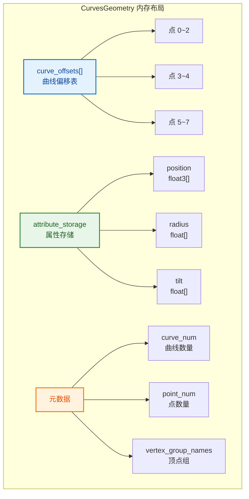

### 🔧 C 结构体（DNA - 磁盘/内存兼容）

```cpp
struct CurvesGeometry {
    int *curve_offsets = nullptr;     // 每条曲线的起始点索引（大小 = curve_num + 1）
    struct AttributeStorage attribute_storage;  // 通用属性存储
    CustomData point_data;            // 顶点组等遗留数据

    int point_num = 0;                // 总控制点数
    int curve_num = 0;                // 曲线数量

    ListBaseT<struct bDeformGroup> vertex_group_names;  // 顶点组名称列表

    bke::CurvesGeometryRuntime *runtime;  // 运行时缓存（求值后点、切线、法线等）
    float *custom_knots;              // NURBS 自定义节点
};
```

### 🔧 C++ 包装类（BKE - 方法封装）

```cpp
namespace blender::bke {

class CurvesGeometry : public blender::CurvesGeometry {
public:
    CurvesGeometry(int point_num, int curve_num);  // 构造：只创建 position 和 offsets

    // 访问器
    int points_num() const;           // 总点数
    int curves_num() const;           // 曲线数
    bool is_empty() const;

    IndexRange points_range() const;  // [0, points_num)
    IndexRange curves_range() const;  // [0, curves_num)

    // 偏移表
    Span<int> offsets() const;        // 只读访问
    MutableSpan<int> offsets_for_write();  // 可写访问
    OffsetIndices<int> points_by_curve() const;  // 曲线 -> 点的范围映射

    // 属性访问
    VArray<int8_t> curve_types() const;
    VArray<bool> cyclic() const;
    MutableSpan<bool> cyclic_for_write();
    Span<float3> positions() const;
    MutableSpan<float3> positions_for_write();

    // 求值相关（缓存）
    int evaluated_points_num() const;
    Span<float3> evaluated_positions() const;
    Span<float3> evaluated_tangents() const;

    // 属性系统
    AttributeAccessor attributes() const;
    MutableAttributeAccessor attributes_for_write();

    // 拓扑变更标记
    void tag_topology_changed();
    void update_curve_types();
    void remove_attributes_based_on_types();
};

} // namespace blender::bke
```

### 💡 关键概念：`curve_offsets` 变长数组编码

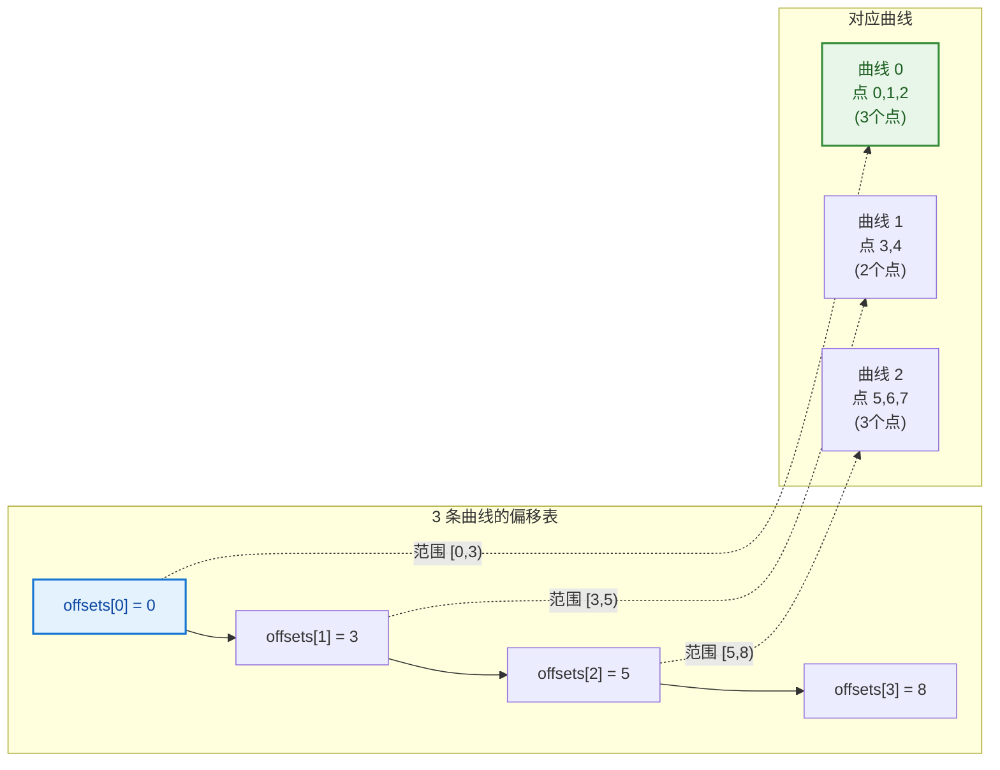

```cpp
// 使用 OffsetIndices 便捷访问
const OffsetIndices<int> points_by_curve = src_curves.points_by_curve();
for (const int curve_i : src_curves.curves_range()) {
    const IndexRange points = points_by_curve[curve_i];  // 获取曲线 i 的点范围
    // points.first() = 起始索引, points.size() = 点数
}
```

### 📝 在拆分曲线节点中的使用

```cpp
// node_geo_curve_split.cc:38~170 (split_points 函数)
static bke::CurvesGeometry split_points(const bke::CurvesGeometry &src_curves,
                                        const IndexMask &mask,
                                        const bke::AttributeFilter &attribute_filter)
{
    const OffsetIndices<int> points_by_curve = src_curves.points_by_curve();  // 获取曲线-点映射
    const VArray<bool> src_cyclic = src_curves.cyclic();  // 循环标志（虚拟数组）

    // 1. 将 IndexMask 转为 bool 数组
    Array<bool> points_to_split(src_curves.points_num(), false);
    mask.to_bools(points_to_split.as_mutable_span());

    // 2. 遍历每条曲线，根据拆分点计算新曲线
    for (const int curve_i : src_curves.curves_range()) {
        const IndexRange points = points_by_curve[curve_i];
        const Span<bool> curve_points_to_split = points_to_split.as_span().slice(points);
        // ... 拆分逻辑 ...
    }

    // 3. 构造新 CurvesGeometry
    bke::CurvesGeometry dst_curves(dst_to_src_point.size(), dst_to_src_curve.size());

    // 4. 复制属性
    bke::gather_attributes(src_attributes, bke::AttrDomain::Curve, ...);
    bke::gather_attributes(src_attributes, bke::AttrDomain::Point, ...);

    dst_curves.update_curve_types();
    dst_curves.remove_attributes_based_on_types();
    dst_curves.tag_topology_changed();

    return dst_curves;
}
```

---

## 3️⃣ FieldContext - 字段上下文基类

### 📖 源码位置

- `source/blender/functions/FN_field.hh:278~285`

### 🎯 核心职责

`FieldContext` 是**字段求值的"环境"**。字段（Field）是延迟计算的表达式，它不知道自己的值从哪里来。`FieldContext` 回答这个问题："给定一个字段输入，在当前几何体上如何获取它的值？"

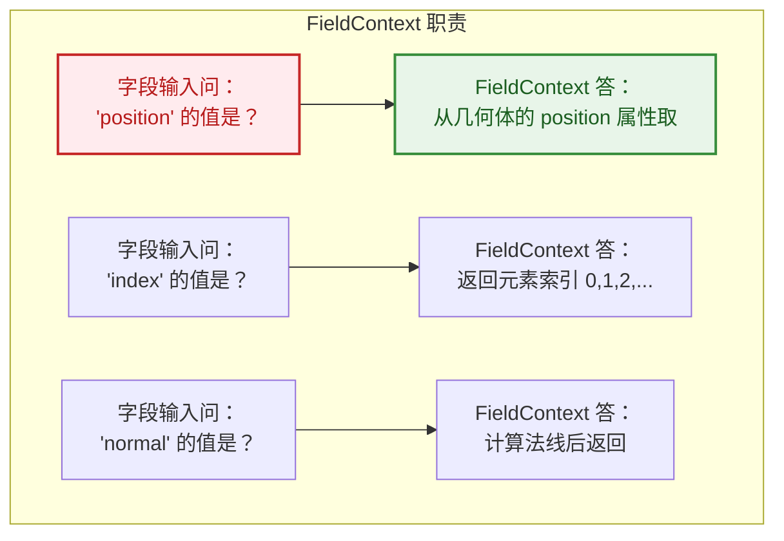

### 🔧 源码详解

```cpp
namespace blender::fn {

/**
 * A field is always evaluated in some context. This context determines the value of the field
 * inputs.
 */
class FieldContext {
public:
    virtual ~FieldContext() = default;

    /**
     * 核心方法：给定一个字段输入，返回对应的虚拟数组
     * @param field_input 字段输入（如 "position" 属性输入）
     * @param mask 需要计算的索引集合
     * @param scope 资源管理器（临时内存）
     * @return 虚拟数组（包含实际值或计算逻辑）
     */
    virtual GVArray get_varray_for_input(const FieldInput &field_input,
                                         const IndexMask &mask,
                                         ResourceScope &scope) const;
};

} // namespace blender::fn
```

### 💡 设计模式：策略模式（Strategy Pattern）

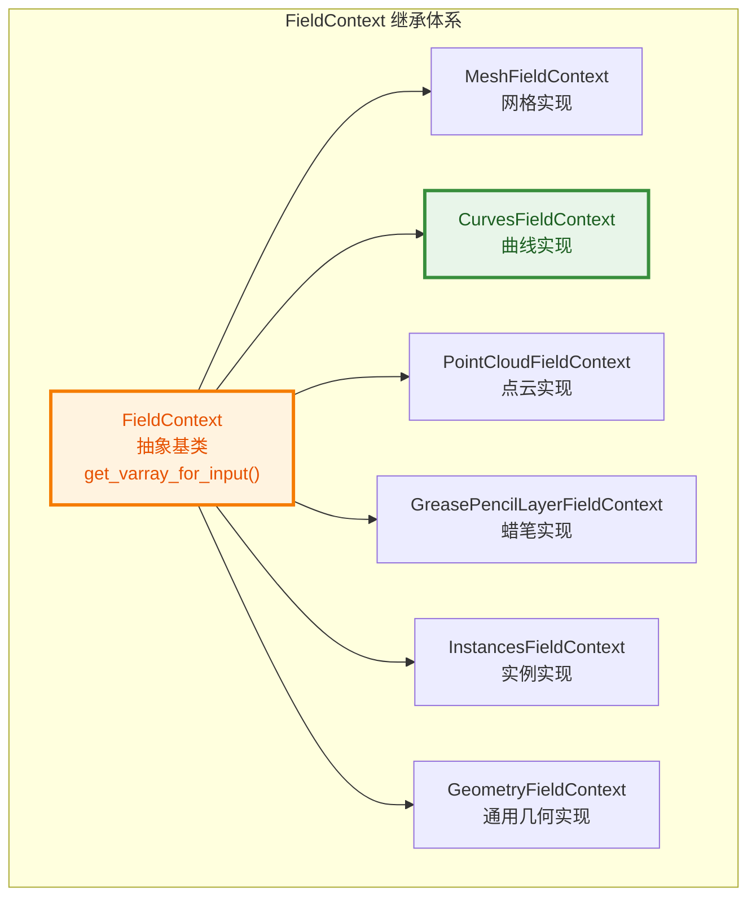

| 子类 | 适用几何 | 特殊处理 |
|------|----------|----------|
| `MeshFieldContext` | 网格 | 支持 Point/Edge/Face/FaceCorner 域 |
| `CurvesFieldContext` | 曲线 | 支持 Point/Curve 域 |
| `PointCloudFieldContext` | 点云 | 仅 Point 域 |
| `GreasePencilLayerFieldContext` | 蜡笔图层 | 需指定 layer_index |
| `InstancesFieldContext` | 实例 | 实例变换、位置 |
| `GeometryFieldContext` | 通用 | 运行时判断几何类型 |

---

## 4️⃣ CurvesFieldContext - 曲线字段上下文

### 📖 源码位置

- `source/blender/blenkernel/BKE_geometry_fields.hh:51~75`

### 🎯 核心职责

`CurvesFieldContext` 是 `FieldContext` 的曲线特化版本。它知道如何从 `CurvesGeometry` 中获取字段输入的值。

### 🔧 源码详解

```cpp
namespace blender::bke {

class CurvesFieldContext : public fn::FieldContext {
private:
    const CurvesGeometry &curves_;    // 引用的曲线几何数据
    AttrDomain domain_;               // 域：Point 或 Curve
    const Curves *curves_id_ = nullptr;  // 可选：指向 ID 数据块

public:
    // 构造方式 1：从 CurvesGeometry + 域
    CurvesFieldContext(const CurvesGeometry &curves, AttrDomain domain);

    // 构造方式 2：从 Curves ID + 域（保留更多上下文）
    CurvesFieldContext(const Curves &curves_id, AttrDomain domain);

    const CurvesGeometry &curves() const { return curves_; }
    const Curves *curves_id() const { return curves_id_; }
    AttrDomain domain() const { return domain_; }

    // 重写基类方法：实现曲线特有的字段输入解析
    GVArray get_varray_for_input(const fn::FieldInput &field_input,
                                 const IndexMask &mask,
                                 ResourceScope &scope) const override;
};

} // namespace blender::bke
```

### 💡 为什么需要 `domain_`？

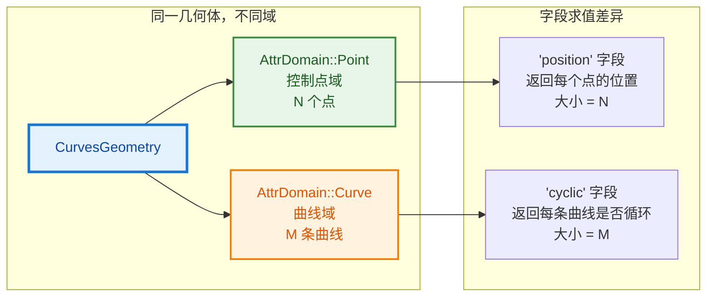

同一个 `CurvesGeometry`，在 **Point 域**求值时字段大小 = 点数；在 **Curve 域**求值时字段大小 = 曲线数。`CurvesFieldContext` 通过 `domain_` 区分这两种场景。

### 📝 在拆分曲线节点中的使用

```cpp
// node_geo_curve_split.cc:209
const bke::CurvesFieldContext field_context{*curves_id, AttrDomain::Point};
//                             ↑ 使用 Curves ID 构造
//                                           ↑ Point 域：按控制点求值

// 为什么用 *curves_id 而不是 src_curves？
// 因为 CurvesFieldContext(const Curves&, AttrDomain) 保留了对 ID 的引用
// 某些字段输入（如材质索引）可能需要访问 Curves ID 级别的数据
```

---

## 5️⃣ FieldEvaluator - 字段求值器

### 📖 源码位置

- `source/blender/functions/FN_field_evaluation.hh:17~164`

### 🎯 核心职责

`FieldEvaluator` 是**将延迟计算的 Field 表达式转换为实际数据**的执行引擎。它接收一个 `FieldContext` 和一个 `IndexMask`，批量求值一个或多个字段。

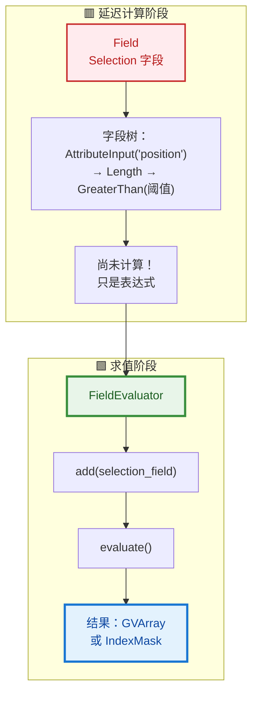

### 🔧 源码详解

```cpp
namespace blender::fn {

class FieldEvaluator : NonMovable, NonCopyable {
private:
    ResourceScope scope_;                    // 临时内存管理器
    const FieldContext &context_;            // 字段上下文（环境）
    const IndexMask &mask_;                  // 求值范围（哪些索引需要计算）
    Vector<GField> fields_to_evaluate_;      // 待求值的字段队列
    Vector<GVArray> evaluated_varrays_;      // 求值结果
    bool is_evaluated_ = false;              // 状态：是否已求值

    std::optional<Field<bool>> selection_field_;  // 可选：选择字段（先求值）
    IndexMask selection_mask_;                    // 选择后的实际求值范围

public:
    // 构造函数 1：给定大小，构造全范围 IndexMask
    FieldEvaluator(const FieldContext &context, const int64_t size)
        : context_(context), mask_(scope_.construct<IndexMask>(size))
    {}

    // 构造函数 2：给定自定义 IndexMask
    FieldEvaluator(const FieldContext &context, const IndexMask *mask)
        : context_(context), mask_(*mask)
    {}

    // 添加字段求值（返回字段索引）
    int add(GField field);

    // 添加字段并指定输出目的地
    int add_with_destination(GField field, GVMutableArray dst);
    template<typename T> int add_with_destination(Field<T> field, VMutableArray<T> dst);

    // 设置选择字段（限制求值范围）
    void set_selection(Field<bool> selection);

    // 执行求值（只能调用一次）
    void evaluate();

    // 获取求值结果
    const GVArray &get_evaluated(int field_index) const;
    template<typename T> VArray<T> get_evaluated(int field_index) const;

    // 将布尔字段结果转为 IndexMask
    IndexMask get_evaluated_as_mask(int field_index);
    IndexMask get_evaluated_selection_as_mask() const;
};

} // namespace blender::fn
```

### 💡 求值流程详解

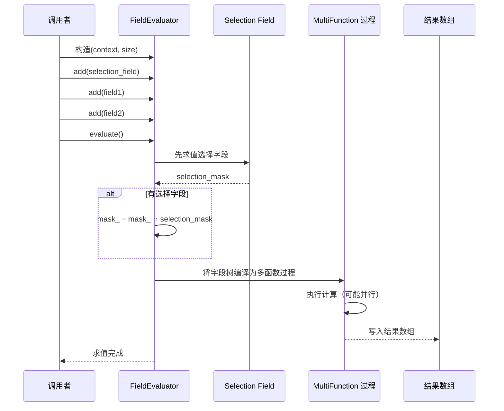

### 📝 在拆分曲线节点中的使用

```cpp
// node_geo_curve_split.cc:183~187
static bool split_curves(const bke::CurvesGeometry &src_curves,
                         const fn::FieldContext &field_context,
                         const Field<bool> &selection_field,
                         ...)
{
    // 1. 创建求值器：在 Point 域上，为所有点求值
    fn::FieldEvaluator evaluator{field_context, src_curves.points_num()};
    //                             ↑ CurvesFieldContext    ↑ 点的数量

    // 2. 添加选择字段
    evaluator.add(selection_field);

    // 3. 执行求值
    evaluator.evaluate();

    // 4. 获取结果为 IndexMask（被选中的点）
    const IndexMask selection = evaluator.get_evaluated_as_mask(0);
    //                              ↑ 字段索引 0（第一个添加的字段）

    if (selection.is_empty()) {
        return false;  // 没有选中任何点
    }

    // 5. 使用 IndexMask 进行几何操作
    dst_curves = delete_segment ? geometry::remove_points_and_split(src_curves, selection)
                                : split_points(src_curves, selection, attribute_filter);
    return true;
}
```

---

## 6️⃣ IndexMask - 高效索引掩码

### 📖 源码位置

- `source/blender/blenlib/BLI_index_mask.hh`

### 🎯 核心职责

`IndexMask` 是**稀疏索引集合的高效表示**。当字段求值结果是布尔值时，转换为 `IndexMask` 可以高效地驱动后续的几何操作。

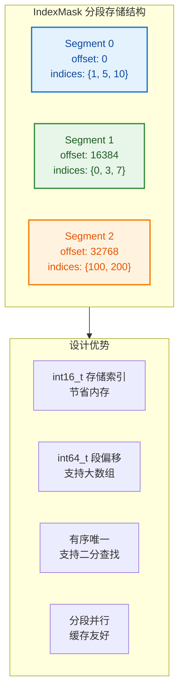

### 🔧 核心设计

```cpp
namespace blender {

class IndexMask : private IndexMaskData {
public:
    // 构造空掩码
    IndexMask();

    // 从范围构造（O(1)）
    explicit IndexMask(int64_t size);        // [0, size)
    IndexMask(IndexRange range);             // [start, start+size)

    // 工厂方法
    static IndexMask from_bools(Span<bool> bools, LinearAllocator<> &memory);
    static IndexMask from_bits(BitSpan bits, LinearAllocator<> &memory);
    static IndexMask from_indices(Span<int64_t> indices, LinearAllocator<> &memory);

    // 查询
    int64_t size() const;           // 索引数量
    bool is_empty() const;          // 是否为空
    bool contains(int64_t index) const;  // O(log n)
    int64_t operator[](int64_t i) const; // 获取第 i 个索引，O(log n)

    // 遍历（推荐方式）
    template<typename Fn> void foreach_index(Fn &&fn) const;
    template<typename Fn> void foreach_segment(Fn &&fn) const;

    // 切片
    IndexMask slice(IndexRange range) const;  // O(log n)

    // 转换
    void to_bools(MutableSpan<bool> r_bools) const;
    void to_bits(MutableBitSpan r_bits) const;
    Vector<IndexRange> to_ranges() const;
};

} // namespace blender
```

### 💡 为什么用分段存储？

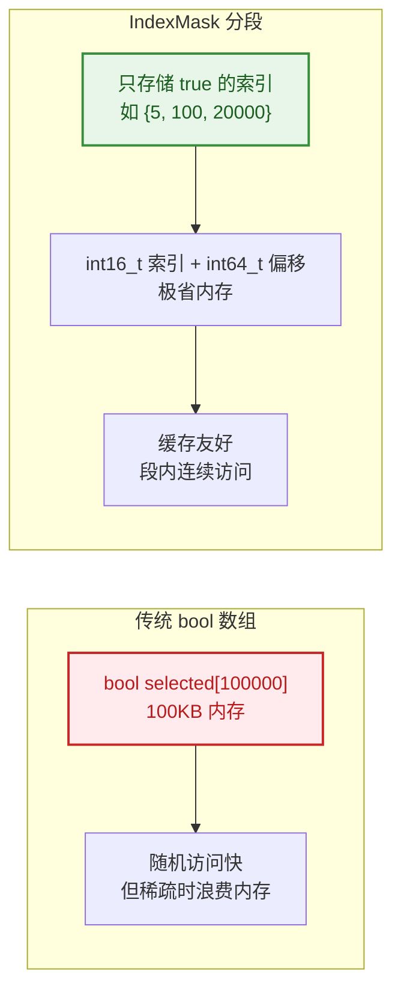

| 特性 | `Array<bool>` | `IndexMask` |
|------|---------------|-------------|
| **内存** | O(N) | O(K)，K = 选中数量 |
| **稀疏场景** | 浪费内存 | 高效 |
| **密集场景** | 高效 | 有额外开销 |
| **遍历** | 需跳过 false | 直接访问 true 索引 |
| **并行** | 需额外处理 | 天然分段并行 |

### 📝 在拆分曲线节点中的使用

```cpp
// node_geo_curve_split.cc:187
const IndexMask selection = evaluator.get_evaluated_as_mask(0);

// 等价逻辑：
// 1. FieldEvaluator 内部有一个 bool 数组结果
// 2. get_evaluated_as_mask 将 true 的索引收集为 IndexMask
// 3. 后续几何操作使用 IndexMask 驱动

// 在 split_points 中：
Array<bool> points_to_split(src_curves.points_num(), false);
mask.to_bools(points_to_split.as_mutable_span());  // IndexMask → bool 数组

// 在 remove_points_and_split 中：
Array<bool> points_to_delete(curves.points_num());
mask.to_bools(points_to_delete.as_mutable_span());  // 标记要删除的点
const int total_points = points_to_delete.as_span().count(false);  // 统计保留点数
```

---

## 🔗 六类协作完整流程

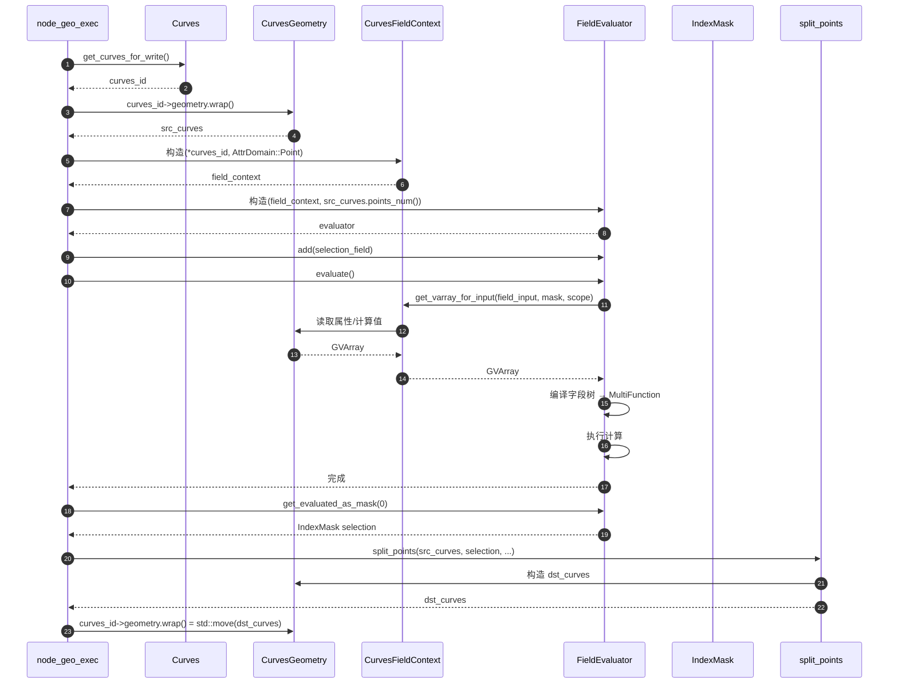

---

## 🎨 彩色 Mermaid 图：完整数据流

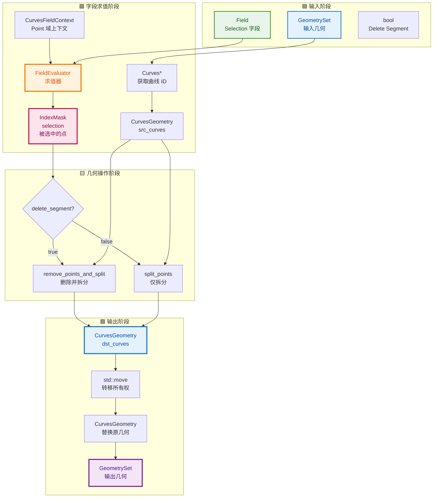

---

## 🧩 扩展：与其他系统的搭配

### 搭配 1：字段系统（Field System）

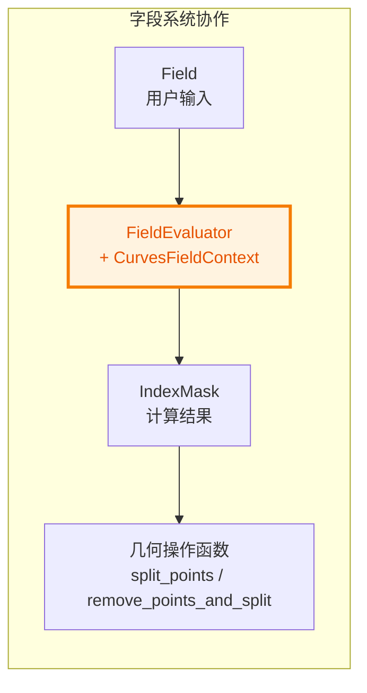

### 搭配 2：属性系统（Attribute System）

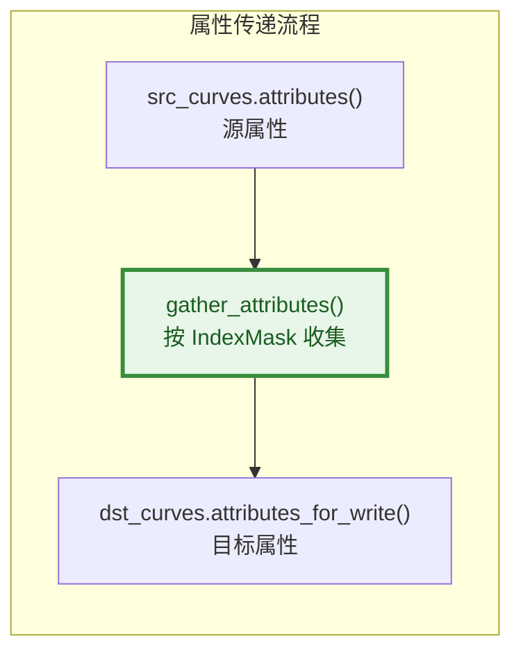

### 搭配 3：隐式共享（Implicit Sharing）

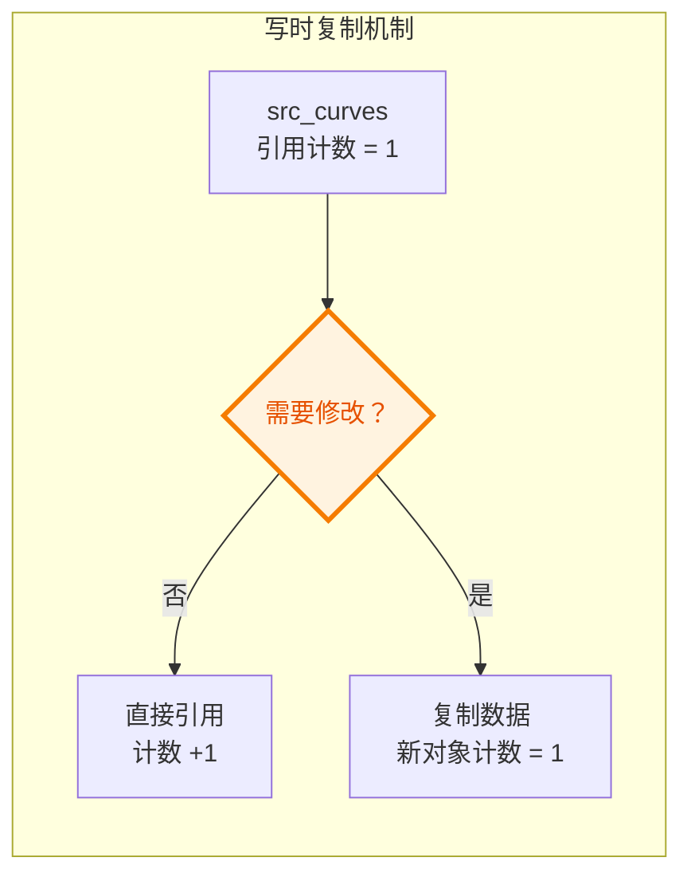

---

## ✅ 总结速查表

| 类 | 职责 | 在拆分曲线节点中的角色 |
|----|------|------------------------|
| **Curves** | ID 数据块，含动画/材质 | 保留原对象，只替换 geometry |
| **CurvesGeometry** | 纯几何数据 | 被拆分/重建的核心数据 |
| **FieldContext** | 字段求值环境基类 | 抽象接口，由子类实现 |
| **CurvesFieldContext** | 曲线字段环境 | 提供曲线几何上的字段解析 |
| **FieldEvaluator** | 字段表达式执行引擎 | 将 Selection 字段转为 IndexMask |
| **IndexMask** | 稀疏索引集合 | 驱动 split/remove 操作 |

---

## 📁 相关文件索引

| 文件 | 路径 | 说明 |
|------|------|------|
| `node_geo_curve_split.cc` | `source/blender/nodes/geometry/nodes/` | 拆分曲线节点实现 |
| `DNA_curves_types.h` | `source/blender/makesdna/` | Curves / CurvesGeometry C 结构 |
| `BKE_curves.hh` | `source/blender/blenkernel/` | CurvesGeometry C++ 包装 |
| `BKE_geometry_fields.hh` | `source/blender/blenkernel/` | CurvesFieldContext 定义 |
| `FN_field.hh` | `source/blender/functions/` | FieldContext / Field 基类 |
| `FN_field_evaluation.hh` | `source/blender/functions/` | FieldEvaluator 定义 |
| `BLI_index_mask.hh` | `source/blender/blenlib/` | IndexMask 实现 |
| `GEO_curves_remove_and_split.hh` | `source/blender/geometry/` | remove_points_and_split 声明 |
