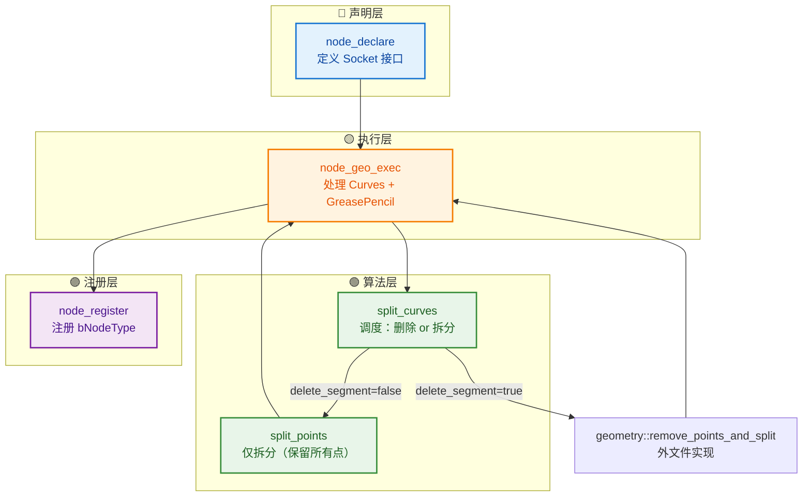
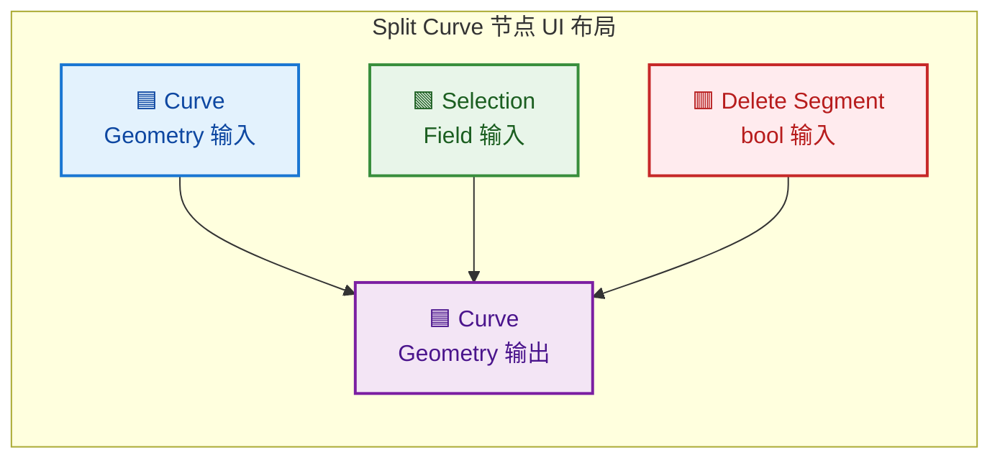
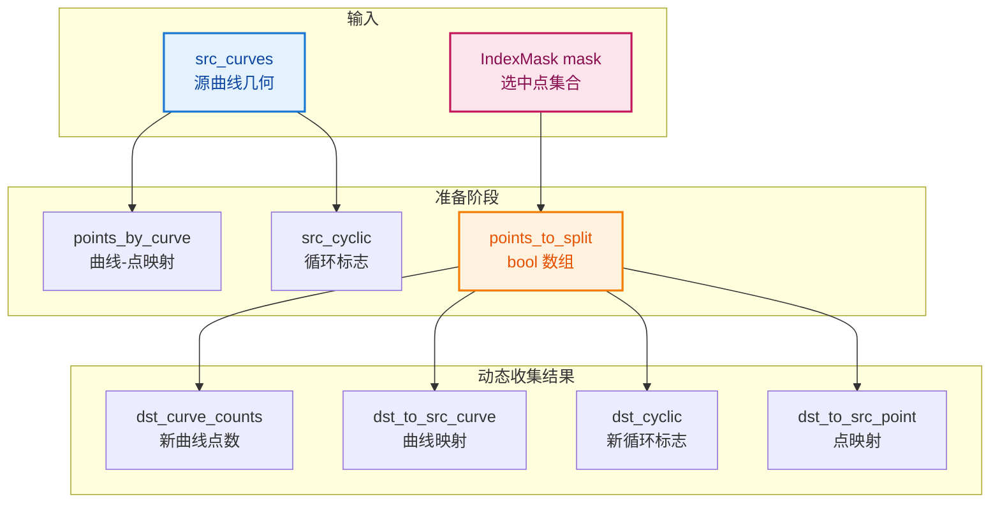
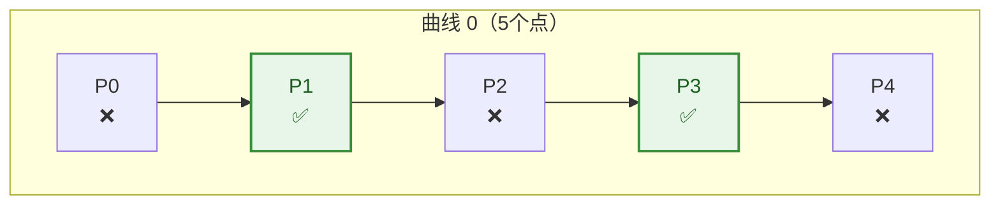
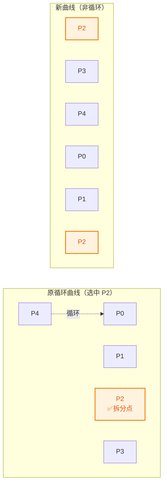
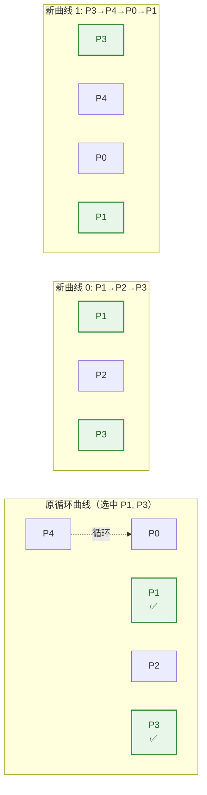
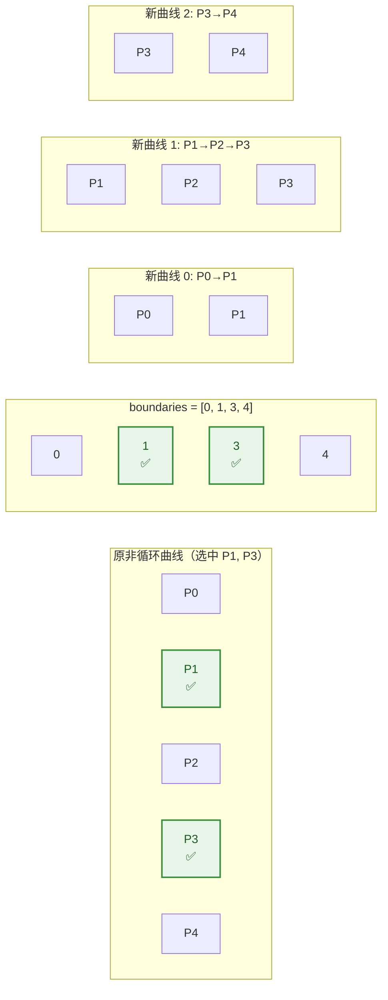
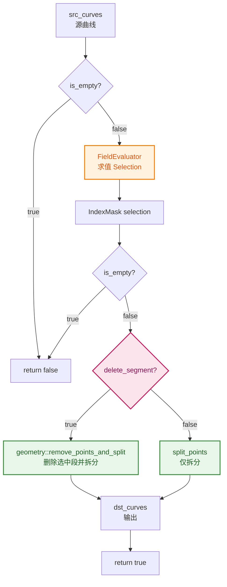
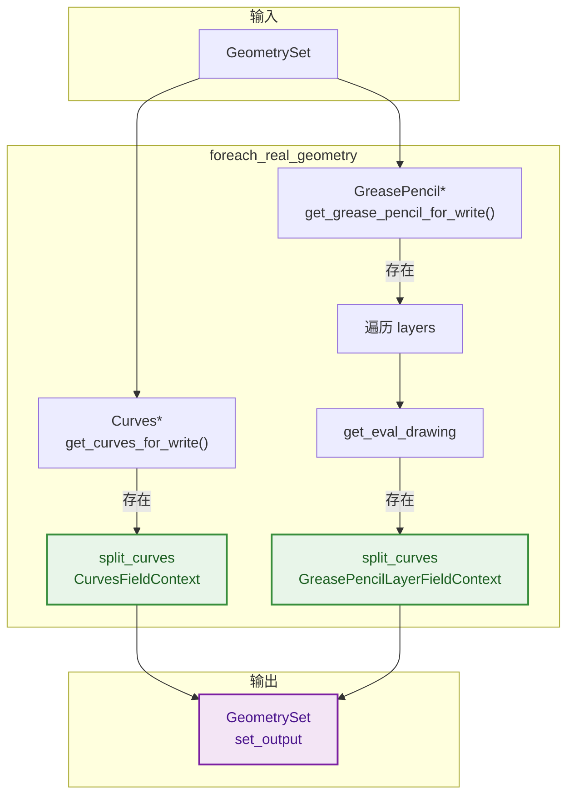
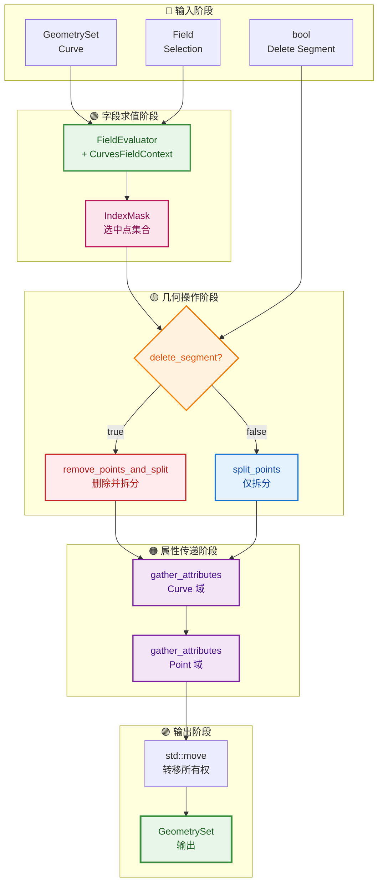

# 拆分曲线节点 - 源码级详解（node_geo_curve_split.cc）

> 逐行精读 `source/blender/nodes/geometry/nodes/node_geo_curve_split.cc`，翻译全部重要注释，解析所有类、函数、容器与“奇怪/非基础”语法。
- [拆分曲线节点 - 源码级详解（node\_geo\_curve\_split.cc）](#拆分曲线节点---源码级详解node_geo_curve_splitcc)
  - [📍 文件总览](#-文件总览)
  - [🗺️ 全文结构 Mermaid 图](#️-全文结构-mermaid-图)
  - [1️⃣ 头文件与命名空间](#1️⃣-头文件与命名空间)
    - [🔍 解析](#-解析)
  - [2️⃣ `node_declare` - Socket 声明](#2️⃣-node_declare---socket-声明)
    - [🔍 逐行解析](#-逐行解析)
    - [🎨 Socket 布局 Mermaid 图](#-socket-布局-mermaid-图)
  - [3️⃣ `split_points` - 仅拆分（保留所有点）](#3️⃣-split_points---仅拆分保留所有点)
    - [🔍 容器与类型解析](#-容器与类型解析)
    - [🎨 数据流 Mermaid 图（split\_points 前半段）](#-数据流-mermaid-图split_points-前半段)
    - [3.1 遍历每条曲线](#31-遍历每条曲线)
    - [🔍 解析](#-解析-1)
    - [🎨 曲线内选中点示意](#-曲线内选中点示意)
    - [3.2 情况 A：没有选中点](#32-情况-a没有选中点)
    - [3.3 情况 B：循环曲线且只有一个选中点](#33-情况-b循环曲线且只有一个选中点)
    - [🔍 解析（关键算法）](#-解析关键算法)
    - [3.4 情况 C：循环曲线且多个选中点](#34-情况-c循环曲线且多个选中点)
    - [🔍 解析（核心算法）](#-解析核心算法)
    - [3.5 情况 D：非循环曲线](#35-情况-d非循环曲线)
    - [🔍 解析](#-解析-2)
    - [3.6 构造新 CurvesGeometry](#36-构造新-curvesgeometry)
    - [🔍 解析](#-解析-3)
    - [3.7 属性传递](#37-属性传递)
    - [🔍 解析](#-解析-4)
    - [3.8 收尾](#38-收尾)
    - [🔍 解析](#-解析-5)
  - [4️⃣ `split_curves` - 调度函数](#4️⃣-split_curves---调度函数)
    - [🔍 解析](#-解析-6)
    - [🎨 split\_curves 调度 Mermaid 图](#-split_curves-调度-mermaid-图)
  - [5️⃣ `node_geo_exec` - 节点执行入口](#5️⃣-node_geo_exec---节点执行入口)
    - [🔍 解析](#-解析-7)
    - [5.1 遍历几何体](#51-遍历几何体)
    - [🔍 解析](#-解析-8)
    - [5.2 处理 GreasePencil](#52-处理-greasepencil)
    - [🔍 解析](#-解析-9)
    - [🎨 双类型处理 Mermaid 图](#-双类型处理-mermaid-图)
  - [6️⃣ `node_register` - 节点注册](#6️⃣-node_register---节点注册)
    - [🔍 解析](#-解析-10)
  - [🎨 完整执行流程彩色 Mermaid 图](#-完整执行流程彩色-mermaid-图)
  - [✅ 总结速查表](#-总结速查表)
  - [📁 相关文件索引](#-相关文件索引)

---

## 📍 文件总览

| 项目 | 内容 |
|------|------|
| **文件路径** | `source/blender/nodes/geometry/nodes/node_geo_curve_split.cc` |
| **命名空间** | `blender::nodes::node_geo_curve_split_cc` |
| **核心函数** | `node_declare` / `split_points` / `split_curves` / `node_geo_exec` / `node_register` |
| **依赖头文件** | `BLI_array_utils.hh`, `BKE_attribute.hh`, `BKE_curves.hh`, `BKE_curves_utils.hh`, `BKE_deform.hh`, `BKE_grease_pencil.hh`, `GEO_curves_remove_and_split.hh`, `GEO_foreach_geometry.hh`, `node_geometry_util.hh` |

---

## 🗺️ 全文结构 Mermaid 图



---

## 1️⃣ 头文件与命名空间

```cpp
/* SPDX-FileCopyrightText: 2026 Blender Authors
 *
 * SPDX-License-Identifier: GPL-2.0-or-later */

#include "BLI_array_utils.hh"

#include "BKE_attribute.hh"
#include "BKE_curves.hh"
#include "BKE_curves_utils.hh"
#include "BKE_deform.hh"
#include "BKE_grease_pencil.hh"

#include "GEO_curves_remove_and_split.hh"
#include "GEO_foreach_geometry.hh"

#include "node_geometry_util.hh"

namespace blender::nodes::node_geo_curve_split_cc {
```

### 🔍 解析

| 头文件 | 提供内容 |
|--------|----------|
| `BLI_array_utils.hh` | `array_utils::copy`, `array_utils::find_all_ranges` 等数组工具 |
| `BKE_attribute.hh` | `AttributeAccessor`, `MutableAttributeAccessor`, `gather_attributes` |
| `BKE_curves.hh` | `bke::CurvesGeometry`, `CurvesFieldContext`, `OffsetIndices` |
| `BKE_curves_utils.hh` | 曲线工具函数（如 `curves_new_nomain`） |
| `BKE_deform.hh` | `BKE_defgroup_copy_list`（顶点组名称列表复制） |
| `BKE_grease_pencil.hh` | `GreasePencil`, `Drawing` 等蜡笔类型 |
| `GEO_curves_remove_and_split.hh` | `geometry::remove_points_and_split` 声明 |
| `GEO_foreach_geometry.hh` | `geometry::foreach_real_geometry` 遍历几何体 |
| `node_geometry_util.hh` | 节点工具宏（如 `geo_node_type_base`, `NOD_REGISTER_NODE`） |

**命名空间三层嵌套**：`blender::nodes::node_geo_curve_split_cc`
- 这是 Blender 节点的惯用命名空间风格：以文件名为后缀的 `cc` 命名空间，防止符号冲突。

---

## 2️⃣ `node_declare` - Socket 声明

```cpp
static void node_declare(NodeDeclarationBuilder &b)
{
  b.use_custom_socket_order();
  b.allow_any_socket_order();
  b.add_input<decl::Geometry>("Curve"_ustr)
      .supported_type({GeometryComponent::Type::Curve, GeometryComponent::Type::GreasePencil})
      .description("Curves to split");
  b.add_output<decl::Geometry>("Curve"_ustr).propagate_all().align_with_previous();
  b.add_input<decl::Bool>("Selection"_ustr)
      .default_value(true)
      .hide_value()
      .field_on_all()
      .description("Control points used to split curves");
  b.add_input<decl::Bool>("Delete Segment"_ustr)
      .default_value(true)
      .description("Delete selected segments instead of only splitting connectivity");
}
```

### 🔍 逐行解析

| 代码 | 含义 |
|------|------|
| `b.use_custom_socket_order()` | 允许自定义 socket 的显示顺序（不按默认的输入在上、输出在下） |
| `b.allow_any_socket_order()` | 允许输入输出交错排列 |
| `.supported_type({...})` | 限制此 Geometry socket 只能连接 Curve 或 GreasePencil 类型 |
| `.propagate_all()` | 输出 socket 继承输入的所有属性（attribute propagation） |
| `.align_with_previous()` | 输出 socket 与上一个输入 socket 对齐（视觉并排） |
| `.default_value(true)` | 默认值 `true` |
| `.hide_value()` | 在节点 UI 中隐藏默认值字段（因为字段输入通常由连线决定） |
| `.field_on_all()` | **标记为字段输入**：表示这个 socket 接受 `Field<bool>`，可以每点不同 |

### 🎨 Socket 布局 Mermaid 图



---

## 3️⃣ `split_points` - 仅拆分（保留所有点）

```cpp
static bke::CurvesGeometry split_points(const bke::CurvesGeometry &src_curves,
                                        const IndexMask &mask,
                                        const bke::AttributeFilter &attribute_filter)
{
  const OffsetIndices<int> points_by_curve = src_curves.points_by_curve();
  const VArray<bool> src_cyclic = src_curves.cyclic();

  Array<bool> points_to_split(src_curves.points_num(), false);
  mask.to_bools(points_to_split.as_mutable_span());

  Vector<int> dst_curve_counts;
  Vector<int> dst_to_src_curve;
  Vector<bool> dst_cyclic;
  Vector<int> dst_to_src_point;
```

### 🔍 容器与类型解析

| 变量 | 类型 | 作用 |
|------|------|------|
| `points_by_curve` | `OffsetIndices<int>` | 曲线 → 点范围的映射表。`points_by_curve[curve_i]` 返回 `IndexRange` |
| `src_cyclic` | `VArray<bool>` | **虚拟数组**：每条曲线是否循环。可能是常量或实际数组，延迟求值 |
| `points_to_split` | `Array<bool>` | 标记每个点是否被选中拆分。`to_bools` 将 `IndexMask` 展开为 bool 数组 |
| `dst_curve_counts` | `Vector<int>` | 每条新曲线的点数（用于构建 `offsets`） |
| `dst_to_src_curve` | `Vector<int>` | 新曲线 → 源曲线索引的映射（属性传递用） |
| `dst_cyclic` | `Vector<bool>` | 新曲线的循环标志 |
| `dst_to_src_point` | `Vector<int>` | 新点 → 源点索引的映射（属性传递用） |

### 🎨 数据流 Mermaid 图（split_points 前半段）



---

### 3.1 遍历每条曲线

```cpp
  for (const int curve_i : src_curves.curves_range()) {
    const IndexRange points = points_by_curve[curve_i];
    const Span<bool> curve_points_to_split = points_to_split.as_span().slice(points);

    Vector<int> selected;
    for (const int point_i : points.index_range()) {
      if (curve_points_to_split[point_i]) {
        selected.append(point_i);
      }
    }
```

### 🔍 解析

| 代码 | 含义 |
|------|------|
| `src_curves.curves_range()` | 返回 `IndexRange(0, curves_num)`，遍历所有曲线索引 |
| `points_by_curve[curve_i]` | 返回该曲线在全局点数组中的范围 `[first, first+size)` |
| `points_to_split.as_span().slice(points)` | `Span` 是只读视图；`slice(points)` 取出子范围，**零拷贝** |
| `points.index_range()` | 返回 `[0, points.size())`，即曲线内局部索引 |
| `selected.append(point_i)` | 收集该曲线上被选中的**局部索引** |

### 🎨 曲线内选中点示意



---

### 3.2 情况 A：没有选中点

```cpp
    if (selected.is_empty()) {
      dst_curve_counts.append(points.size());
      dst_to_src_curve.append(curve_i);
      dst_cyclic.append(src_cyclic[curve_i]);
      for (const int src_point : points) {
        dst_to_src_point.append(src_point);
      }
      continue;
    }
```

**逻辑**：如果这条曲线上没有任何选中点，则整条曲线原样保留。

---

### 3.3 情况 B：循环曲线且只有一个选中点

```cpp
    if (src_cyclic[curve_i]) {
      if (selected.size() == 1) {
        const int split_point = selected.first();
        dst_curve_counts.append(points.size() + 1);
        dst_to_src_curve.append(curve_i);
        dst_cyclic.append(false);

        for (const int point_i : IndexRange(split_point, points.size() - split_point)) {
          dst_to_src_point.append(points[point_i]);
        }
        for (const int point_i : IndexRange(0, split_point + 1)) {
          dst_to_src_point.append(points[point_i]);
        }
        continue;
      }
```

### 🔍 解析（关键算法）

**问题**：循环曲线只有一个拆分点，如何拆分？

**答案**：在拆分点处“剪开”循环曲线，变成一条非循环曲线。由于剪开处需要首尾相接，**新曲线会包含原曲线的所有点 + 重复拆分点一次**，所以长度是 `points.size() + 1`。

**示例**：
- 原循环曲线：P0-P1-P2-P3-P4（循环，即 P4 连回 P0）
- 选中 P2 拆分
- 新曲线：P2-P3-P4-P0-P1-P2（非循环，P2 出现两次作为新首尾）



---

### 3.4 情况 C：循环曲线且多个选中点

```cpp
      for (const int split_i : selected.index_range()) {
        const int start = selected[split_i];
        const int end = selected[(split_i + 1) % selected.size()];
        const int count = end >= start ? (end - start + 1) : (points.size() - start + end + 1);

        dst_curve_counts.append(count);
        dst_to_src_curve.append(curve_i);
        dst_cyclic.append(false);

        int point_i = start;
        while (true) {
          dst_to_src_point.append(points[point_i]);
          if (point_i == end) {
            break;
          }
          point_i = (point_i + 1) % points.size();
        }
      }
      continue;
    }
```

### 🔍 解析（核心算法）

**逻辑**：每两个相邻选中点之间形成一条新曲线。由于是循环曲线，最后一个选中点与第一个选中点也形成一条新曲线。

**关键公式**：
```cpp
const int end = selected[(split_i + 1) % selected.size()];
```
- `% selected.size()` 实现**循环回绕**：最后一个选中点的“下一个”是第一个选中点。

**count 计算**：
```cpp
end >= start ? (end - start + 1) : (points.size() - start + end + 1)
```
- 如果 `end >= start`：直接数中间有多少点（含两端）
- 如果 `end < start`：跨越了循环边界，需要 `points.size() - start + end + 1`

**while 循环**：
```cpp
int point_i = start;
while (true) {
    dst_to_src_point.append(points[point_i]);
    if (point_i == end) break;
    point_i = (point_i + 1) % points.size();  // 循环回绕
}
```
- 从 `start` 出发，逐个走（允许循环回绕），直到遇到 `end`。



---

### 3.5 情况 D：非循环曲线

```cpp
    Vector<int> boundaries;
    boundaries.append(0);
    boundaries.extend(selected);
    boundaries.append(points.size() - 1);

    for (const int boundary_i : boundaries.index_range().drop_back(1)) {
      const int start = boundaries[boundary_i];
      const int end = boundaries[boundary_i + 1];
      const int count = end - start + 1;

      dst_curve_counts.append(count);
      dst_to_src_curve.append(curve_i);
      dst_cyclic.append(false);

      for (const int point_i : IndexRange(start, count)) {
        dst_to_src_point.append(points[point_i]);
      }
    }
  }
```

### 🔍 解析

**逻辑**：非循环曲线的拆分更简单。选中点将曲线切成若干段，每段成为一条新曲线。

**boundaries 构建**：
```cpp
boundaries = [0, selected[0], selected[1], ..., selected[N-1], points.size() - 1]
```
- 头尾固定加上 `0` 和 `points.size() - 1`
- 中间插入所有选中点

**`drop_back(1)`**：
- `boundaries.index_range()` 返回 `[0, boundaries.size())`
- `.drop_back(1)` 返回 `[0, boundaries.size() - 1)`，即**去掉最后一个元素**
- 这样 `boundary_i + 1` 不会越界



---

### 3.6 构造新 CurvesGeometry

```cpp
  if (dst_to_src_curve.is_empty()) {
    return {};
  }

  bke::CurvesGeometry dst_curves(dst_to_src_point.size(), dst_to_src_curve.size());
  BKE_defgroup_copy_list(&dst_curves.vertex_group_names, &src_curves.vertex_group_names);

  MutableSpan<int> new_curve_offsets = dst_curves.offsets_for_write();
  array_utils::copy(dst_curve_counts.as_span(), new_curve_offsets.drop_back(1));
  offset_indices::accumulate_counts_to_offsets(new_curve_offsets);
```

### 🔍 解析

| 代码 | 含义 |
|------|------|
| `return {}` | 返回默认构造的空 `CurvesGeometry`（所有曲线都被删除的情况） |
| `dst_curves(...)` | 构造新几何体：参数是 `(point_num, curve_num)` |
| `BKE_defgroup_copy_list` | 复制顶点组名称列表（ deform group ） |
| `offsets_for_write()` | 获取可写的偏移表（`MutableSpan<int>`） |
| `array_utils::copy(..., new_curve_offsets.drop_back(1))` | 将 `dst_curve_counts` 复制到偏移表的前 `N-1` 个位置 |
| `offset_indices::accumulate_counts_to_offsets` | **前缀和**：将 `[3, 2, 3]` 转为 `[0, 3, 5, 8]` |

**前缀和示例**：
```
dst_curve_counts = [3, 2, 3]
new_curve_offsets（复制后）= [3, 2, 3, ?]
前缀和后 = [0, 3, 5, 8]
```

---

### 3.7 属性传递

```cpp
  const bke::AttributeAccessor src_attributes = src_curves.attributes();
  bke::MutableAttributeAccessor dst_attributes = dst_curves.attributes_for_write();

  bke::gather_attributes(src_attributes,
                         bke::AttrDomain::Curve,
                         bke::AttrDomain::Curve,
                         bke::attribute_filter_with_skip_ref(attribute_filter, {"cyclic"}),
                         dst_to_src_curve.as_span(),
                         dst_attributes);
  array_utils::copy(dst_cyclic.as_span(), dst_curves.cyclic_for_write());

  bke::gather_attributes(src_attributes,
                         bke::AttrDomain::Point,
                         bke::AttrDomain::Point,
                         attribute_filter,
                         dst_to_src_point.as_span(),
                         dst_attributes);
```

### 🔍 解析

**`gather_attributes`**：按索引映射从源属性收集到目标属性。

| 参数 | 含义 |
|------|------|
| `src_attributes` | 源属性访问器 |
| `bke::AttrDomain::Curve` | 源域 = 曲线域 |
| `bke::AttrDomain::Curve` | 目标域 = 曲线域 |
| `attribute_filter_with_skip_ref(..., {"cyclic"})` | 属性过滤器：**跳过 `cyclic` 属性**（因为后面手动设置） |
| `dst_to_src_curve.as_span()` | 曲线索引映射：新曲线 i → 源曲线 `dst_to_src_curve[i]` |
| `dst_attributes` | 目标属性写入器 |

**为什么跳过 `cyclic`？**
- 拆分后的新曲线都是非循环的（`dst_cyclic` 已计算好）
- 如果直接复制源属性的 `cyclic`，会错误地保留循环标志

**第二次 `gather_attributes`**：
- 域 = Point，按 `dst_to_src_point` 映射传递点属性

---

### 3.8 收尾

```cpp
  dst_curves.update_curve_types();
  dst_curves.remove_attributes_based_on_types();
  dst_curves.tag_topology_changed();

  if (src_curves.nurbs_has_custom_knots()) {
    bke::curves::nurbs::update_custom_knot_modes(
        dst_curves.curves_range(), NURBS_KNOT_MODE_NORMAL, NURBS_KNOT_MODE_NORMAL, dst_curves);
  }

  return dst_curves;
}
```

### 🔍 解析

| 代码 | 含义 |
|------|------|
| `update_curve_types()` | 根据控制点数量重新判断曲线类型（如 Bézier / NURBS / Poly） |
| `remove_attributes_based_on_types()` | 删除与新曲线类型不兼容的属性 |
| `tag_topology_changed()` | **标记拓扑已变更**，使依赖缓存失效 |
| `nurbs_has_custom_knots()` | 检查源曲线是否有 NURBS 自定义节点向量 |
| `update_custom_knot_modes(...)` | 将自定义节点重置为普通模式（因为拆分后节点向量已失效） |

---

## 4️⃣ `split_curves` - 调度函数

```cpp
static bool split_curves(const bke::CurvesGeometry &src_curves,
                         const fn::FieldContext &field_context,
                         const Field<bool> &selection_field,
                         const bool delete_segment,
                         const bke::AttributeFilter &attribute_filter,
                         bke::CurvesGeometry &dst_curves)
{
  if (src_curves.is_empty()) {
    return false;
  }

  fn::FieldEvaluator evaluator{field_context, src_curves.points_num()};
  evaluator.add(selection_field);
  evaluator.evaluate();

  const IndexMask selection = evaluator.get_evaluated_as_mask(0);
  if (selection.is_empty()) {
    return false;
  }

  dst_curves = delete_segment ? geometry::remove_points_and_split(src_curves, selection) :
                                split_points(src_curves, selection, attribute_filter);
  return true;
}
```

### 🔍 解析

| 代码 | 含义 |
|------|------|
| `fn::FieldEvaluator evaluator{field_context, src_curves.points_num()}` | 构造求值器：在 `Point` 域上，为所有点求值 |
| `evaluator.add(selection_field)` | 添加选择字段到求值队列 |
| `evaluator.evaluate()` | **执行字段求值**（编译字段树 → 多函数过程 → 并行执行） |
| `evaluator.get_evaluated_as_mask(0)` | 将第 0 个字段（即 selection）的布尔结果转为 `IndexMask` |
| `delete_segment ? ... : ...` | **关键分支**：`true` 走删除逻辑，`false` 走仅拆分逻辑 |

### 🎨 split_curves 调度 Mermaid 图



---

## 5️⃣ `node_geo_exec` - 节点执行入口

```cpp
static void node_geo_exec(GeoNodeExecParams params)
{
  GeometrySet geometry_set = params.extract_input<GeometrySet>("Curve"_ustr);
  const Field<bool> selection_field = params.extract_input<Field<bool>>("Selection"_ustr);
  const bool delete_segment = params.extract_input<bool>("Delete Segment"_ustr);
  const NodeAttributeFilter &attribute_filter = params.get_attribute_filter("Curve"_ustr);

  GeometryComponentEditData::remember_deformed_positions_if_necessary(geometry_set);
```

### 🔍 解析

| 代码 | 含义 |
|------|------|
| `params.extract_input<GeometrySet>("Curve"_ustr)` | 提取 Geometry 输入，**移动语义**（所有权转移） |
| `params.extract_input<Field<bool>>("Selection"_ustr)` | 提取字段输入。因为有 `.field_on_all()`，所以类型是 `Field<bool>` |
| `params.extract_input<bool>("Delete Segment"_ustr)` | 提取普通布尔值。因为没有 `.field_on_all()`，所以类型是 `bool` |
| `params.get_attribute_filter("Curve"_ustr)` | 获取属性过滤器（用于选择性传递属性） |
| `GeometryComponentEditData::remember_deformed_positions_if_necessary(...)` | **保存编辑模式的变形位置**，防止节点操作后变形丢失 |

---

### 5.1 遍历几何体

```cpp
  geometry::foreach_real_geometry(geometry_set, [&](GeometrySet &geometry_set) {
    if (Curves *curves_id = geometry_set.get_curves_for_write()) {
      bke::CurvesGeometry &src_curves = curves_id->geometry.wrap();
      const bke::CurvesFieldContext field_context{*curves_id, AttrDomain::Point};
      bke::CurvesGeometry dst_curves;
      if (split_curves(src_curves,
                       field_context,
                       selection_field,
                       delete_segment,
                       attribute_filter,
                       dst_curves))
      {
        curves_id->geometry.wrap() = std::move(dst_curves);
      }
    }
```

### 🔍 解析

| 代码 | 含义 |
|------|------|
| `geometry::foreach_real_geometry(..., [&](){...})` | 遍历 `geometry_set` 中的“真实”几何体（排除实例引用） |
| `geometry_set.get_curves_for_write()` | 获取可写的 `Curves*`，如果不存在返回 `nullptr` |
| `curves_id->geometry.wrap()` | **DNA → BKE 转换**：`wrap()` 用 `reinterpret_cast` 将 DNA 结构体转为 C++ 类 |
| `bke::CurvesFieldContext{*curves_id, AttrDomain::Point}` | 构造字段上下文：基于 `Curves` ID，在 `Point` 域上求值 |
| `std::move(dst_curves)` | **移动语义**：将新几何数据的所有权转移给 `curves_id->geometry`，避免深拷贝 |

---

### 5.2 处理 GreasePencil

```cpp
    if (GreasePencil *grease_pencil = geometry_set.get_grease_pencil_for_write()) {
      using namespace blender::bke::greasepencil;
      for (const int layer_index : grease_pencil->layers().index_range()) {
        Drawing *drawing = grease_pencil->get_eval_drawing(grease_pencil->layer(layer_index));
        if (drawing == nullptr) {
          continue;
        }

        const bke::CurvesGeometry &src_curves = drawing->strokes();
        const bke::GreasePencilLayerFieldContext field_context{
            *grease_pencil, AttrDomain::Point, layer_index};
        bke::CurvesGeometry dst_curves;
        if (split_curves(src_curves,
                         field_context,
                         selection_field,
                         delete_segment,
                         attribute_filter,
                         dst_curves))
        {
          drawing->strokes_for_write() = std::move(dst_curves);
          drawing->tag_topology_changed();
        }
      }
    }
  });

  params.set_output("Curve"_ustr, std::move(geometry_set));
}
```

### 🔍 解析

| 代码 | 含义 |
|------|------|
| `using namespace blender::bke::greasepencil;` | 引入蜡笔子命名空间，简化后续类型名 |
| `grease_pencil->layers().index_range()` | 遍历所有图层 |
| `grease_pencil->get_eval_drawing(...)` | 获取图层的“求值绘图”（可能为空） |
| `drawing->strokes()` | 蜡笔绘图的笔触也是 `CurvesGeometry`！ |
| `bke::GreasePencilLayerFieldContext{...}` | **蜡笔特有的字段上下文**：需要指定 `layer_index` |
| `drawing->strokes_for_write() = std::move(dst_curves)` | 替换笔触几何数据 |
| `drawing->tag_topology_changed()` | 标记拓扑变更（蜡笔需要额外标记） |
| `params.set_output(..., std::move(geometry_set))` | 设置输出，再次使用移动语义 |

### 🎨 双类型处理 Mermaid 图



---

## 6️⃣ `node_register` - 节点注册

```cpp
static void node_register()
{
  static bke::bNodeType ntype;

  geo_node_type_base(&ntype, "GeometryNodeSplitCurve"_ustr);
  ntype.ui_name = "Split Curve";
  ntype.ui_description = "Split curves by selected control points";
  ntype.nclass = NODE_CLASS_GEOMETRY;
  ntype.declare = node_declare;
  ntype.geometry_node_execute = node_geo_exec;
  bke::node_register_type(ntype);
}
NOD_REGISTER_NODE(node_register)

}  // namespace blender::nodes::node_geo_curve_split_cc
```

### 🔍 解析

| 代码 | 含义 |
|------|------|
| `static bke::bNodeType ntype` | 静态局部变量：只初始化一次，生命周期贯穿程序 |
| `geo_node_type_base(&ntype, "GeometryNodeSplitCurve"_ustr)` | 初始化节点类型基础信息，**ID 字符串**用于序列化（.blend 文件保存） |
| `ntype.ui_name` | 节点在 UI 中显示的名称 |
| `ntype.ui_description` | 鼠标悬停时的提示文本 |
| `ntype.nclass = NODE_CLASS_GEOMETRY` | 节点分类：几何节点 |
| `ntype.declare = node_declare` | 绑定声明函数 |
| `ntype.geometry_node_execute = node_geo_exec` | 绑定执行函数 |
| `bke::node_register_type(ntype)` | 向 Blender 节点系统注册 |
| `NOD_REGISTER_NODE(node_register)` | **宏**：将 `node_register` 加入全局注册列表，启动时自动调用 |

---

## 🎨 完整执行流程彩色 Mermaid 图



---

## ✅ 总结速查表

| 函数/类 | 职责 | 关键语法点 |
|---------|------|------------|
| `node_declare` | 声明 Socket 接口 | `.field_on_all()`, `.propagate_all()`, `_ustr` |
| `split_points` | 仅拆分，保留所有点 | `IndexRange`, `Span::slice`, `Vector::extend`, `drop_back` |
| `split_curves` | 调度：字段求值 → 选择分支 | `FieldEvaluator`, `get_evaluated_as_mask`, 三元运算符分支 |
| `node_geo_exec` | 执行入口，处理双类型 | `foreach_real_geometry`, `wrap()`, `std::move`, lambda |
| `node_register` | 注册节点类型 | `static` 局部变量, `NOD_REGISTER_NODE` 宏 |
| `OffsetIndices<int>` | 变长数组偏移表 | `operator[]` 返回 `IndexRange` |
| `VArray<bool>` | 虚拟数组 | 延迟求值，可能共享底层数据 |
| `IndexMask` | 稀疏索引集合 | `to_bools`, `is_empty`, 分段存储 |
| `FieldEvaluator` | 字段求值引擎 | `add`, `evaluate`, `get_evaluated_as_mask` |
| `gather_attributes` | 属性按索引收集 | `AttributeFilter`, `AttrDomain` |

---

## 📁 相关文件索引

| 文件 | 路径 | 说明 |
|------|------|------|
| `node_geo_curve_split.cc` | `source/blender/nodes/geometry/nodes/` | 本文件：节点实现 |
| `curves_remove_and_split.cc` | `source/blender/geometry/intern/` | `remove_points_and_split` 实现 |
| `DNA_curves_types.h` | `source/blender/makesdna/` | Curves / CurvesGeometry C 结构 |
| `BKE_curves.hh` | `source/blender/blenkernel/` | CurvesGeometry C++ 包装 |
| `BKE_geometry_fields.hh` | `source/blender/blenkernel/` | CurvesFieldContext / GreasePencilLayerFieldContext |
| `FN_field_evaluation.hh` | `source/blender/functions/` | FieldEvaluator |
| `BLI_index_mask.hh` | `source/blender/blenlib/` | IndexMask |
| `BLI_array_utils.hh` | `source/blender/blenlib/` | array_utils 工具 |
