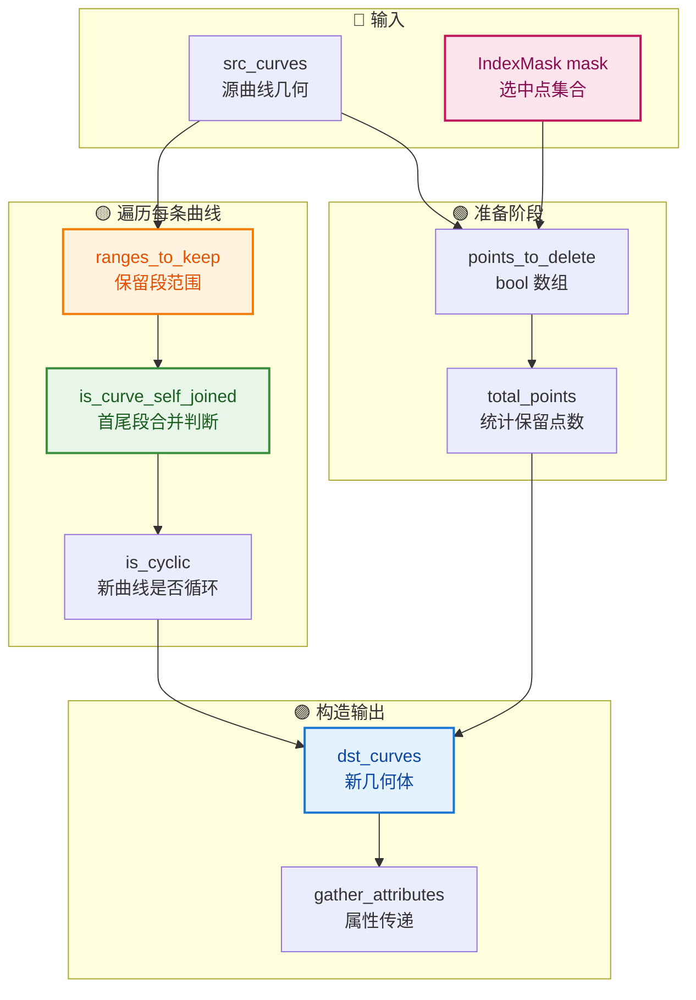
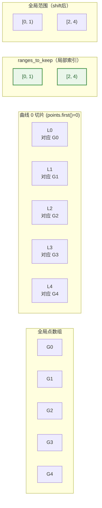
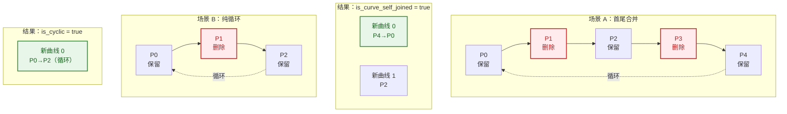
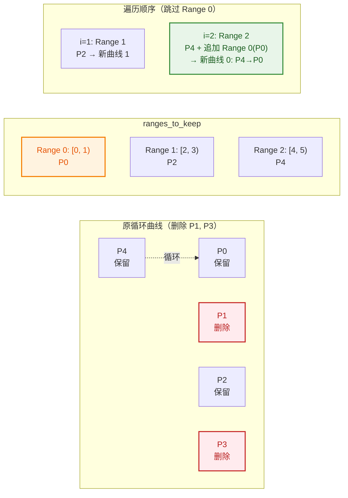
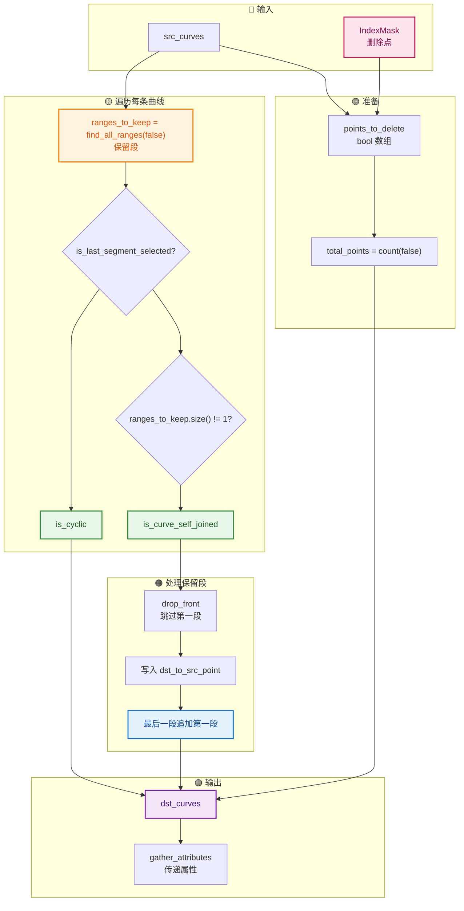
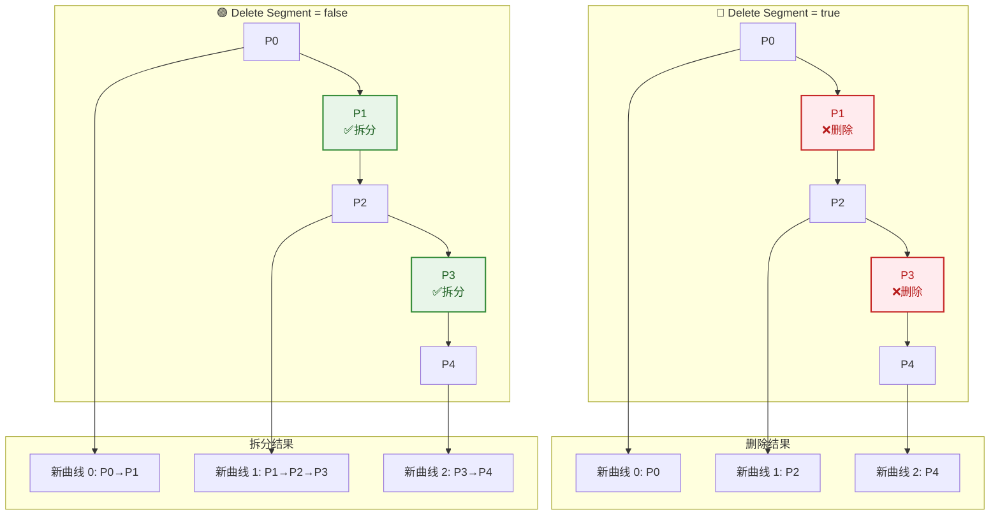

# 拆分曲线节点 - 源码级详解（curves_remove_and_split.cc）

> 逐行精读 `source/blender/geometry/intern/curves_remove_and_split.cc:16~118`，翻译全部重要注释，解析所有类、函数、容器与“奇怪/非基础”语法。
>
> 此文件实现 `geometry::remove_points_and_split`，对应节点中 **Delete Segment = true** 的分支。
- [拆分曲线节点 - 源码级详解（curves\_remove\_and\_split.cc）](#拆分曲线节点---源码级详解curves_remove_and_splitcc)
  - [📍 文件总览](#-文件总览)
  - [🗺️ 全文结构 Mermaid 图](#️-全文结构-mermaid-图)
  - [1️⃣ 头文件与命名空间](#1️⃣-头文件与命名空间)
    - [🔍 解析](#-解析)
  - [2️⃣ `remove_points_and_split` 函数签名](#2️⃣-remove_points_and_split-函数签名)
    - [🔍 解析](#-解析-1)
  - [3️⃣ 准备阶段](#3️⃣-准备阶段)
    - [🔍 逐行解析](#-逐行解析)
    - [⚠️ 奇怪/非基础语法：`Array<bool>()` 默认不初始化](#️-奇怪非基础语法arraybool-默认不初始化)
  - [4️⃣ 遍历每条曲线](#4️⃣-遍历每条曲线)
    - [🔍 容器解析](#-容器解析)
  - [5️⃣ 查找保留段](#5️⃣-查找保留段)
    - [🔍 解析（关键注释翻译）](#-解析关键注释翻译)
  - [6️⃣ 循环曲线首尾合并判断（核心算法）](#6️⃣-循环曲线首尾合并判断核心算法)
    - [🔍 解析（最难理解的部分）](#-解析最难理解的部分)
      - [6.1 `is_last_segment_selected`](#61-is_last_segment_selected)
      - [6.2 `is_curve_self_joined`](#62-is_curve_self_joined)
      - [6.3 `is_cyclic`](#63-is_cyclic)
  - [7️⃣ 遍历保留段](#7️⃣-遍历保留段)
    - [🔍 解析](#-解析-2)
      - [7.1 `range_ids`](#71-range_ids)
      - [7.2 `drop_front(is_curve_self_joined)`](#72-drop_frontis_curve_self_joined)
      - [7.3 `range.shift(points.first())`](#73-rangeshiftpointsfirst)
  - [8️⃣ 首尾段合并](#8️⃣-首尾段合并)
    - [🔍 解析（关键注释翻译）](#-解析关键注释翻译-1)
  - [9️⃣ 构造新 CurvesGeometry](#9️⃣-构造新-curvesgeometry)
    - [🔍 解析](#-解析-3)
  - [🔟 属性传递](#-属性传递)
    - [🔍 解析](#-解析-4)
      - [10.1 `attribute_filter_from_skip_ref` vs `attribute_filter_with_skip_ref`](#101-attribute_filter_from_skip_ref-vs-attribute_filter_with_skip_ref)
      - [10.2 注释翻译](#102-注释翻译)
  - [1️⃣1️⃣ 收尾](#1️⃣1️⃣-收尾)
    - [🔍 解析](#-解析-5)
  - [🎨 完整算法流程彩色 Mermaid 图](#-完整算法流程彩色-mermaid-图)
  - [🆚 `remove_points_and_split` vs `split_points` 对比](#-remove_points_and_split-vs-split_points-对比)
  - [✅ 总结速查表](#-总结速查表)
  - [📁 相关文件索引](#-相关文件索引)

---

## 📍 文件总览

| 项目 | 内容 |
|------|------|
| **文件路径** | `source/blender/geometry/intern/curves_remove_and_split.cc` |
| **命名空间** | `blender::geometry` |
| **核心函数** | `remove_points_and_split` |
| **功能** | 删除选中的控制点，并将剩余部分拆分为独立的曲线段 |

---

## 🗺️ 全文结构 Mermaid 图



---

## 1️⃣ 头文件与命名空间

```cpp
/* SPDX-FileCopyrightText: 2025 Blender Authors
 *
 * SPDX-License-Identifier: GPL-2.0-or-later */

#include "BLI_array_utils.hh"

#include "BKE_attribute.hh"
#include "BKE_curves.hh"
#include "BKE_curves_utils.hh"
#include "BKE_deform.hh"

#include "GEO_curves_remove_and_split.hh"

namespace blender::geometry {
```

### 🔍 解析

| 头文件 | 提供内容 |
|--------|----------|
| `BLI_array_utils.hh` | `array_utils::find_all_ranges`（关键函数：查找所有连续 false 段） |
| `BKE_attribute.hh` | `gather_attributes`, `AttributeAccessor`, `MutableAttributeAccessor` |
| `BKE_curves.hh` | `CurvesGeometry`, `OffsetIndices` |
| `BKE_curves_utils.hh` | 曲线工具函数 |
| `BKE_deform.hh` | `BKE_defgroup_copy_list` |
| `GEO_curves_remove_and_split.hh` | 本函数的头文件声明 |

**命名空间**：`blender::geometry` —— 几何模块的公共命名空间，供节点调用。

---

## 2️⃣ `remove_points_and_split` 函数签名

```cpp
bke::CurvesGeometry remove_points_and_split(const bke::CurvesGeometry &curves,
                                            const IndexMask &mask)
```

### 🔍 解析

| 参数 | 类型 | 含义 |
|------|------|------|
| `curves` | `const bke::CurvesGeometry &` | 源曲线几何（只读） |
| `mask` | `const IndexMask &` | **选中点的掩码** → 这些点将被**删除** |

**注意**：`mask` 在 `split_points` 中表示“拆分点”，在这里表示“删除点”！语义相反但数据结构相同。

---

## 3️⃣ 准备阶段

```cpp
{
  const OffsetIndices<int> points_by_curve = curves.points_by_curve();
  const VArray<bool> src_cyclic = curves.cyclic();

  Array<bool> points_to_delete(curves.points_num());
  mask.to_bools(points_to_delete.as_mutable_span());
  const int total_points = points_to_delete.as_span().count(false);

  /* Return if deleting everything. */
  if (total_points == 0) {
    return {};
  }
```

### 🔍 逐行解析

| 代码 | 含义 |
|------|------|
| `Array<bool> points_to_delete(curves.points_num())` | 构造 `bool` 数组，**默认不初始化**（注意：没有 `false` 默认值！） |
| `mask.to_bools(points_to_delete.as_mutable_span())` | 将 `IndexMask` 展开为 `bool` 数组：`mask` 中的索引设为 `true`，其余保持原值 ⚠️ |
| `points_to_delete.as_span().count(false)` | 统计 `false` 的数量 = **保留的点数** |
| `/* Return if deleting everything. */` | **注释翻译**：如果删除所有点，直接返回空几何体 |

### ⚠️ 奇怪/非基础语法：`Array<bool>()` 默认不初始化

```cpp
Array<bool> points_to_delete(curves.points_num());
// 不是 Array<bool> points_to_delete(curves.points_num(), false);
```

**为什么这样写？**
- `mask.to_bools()` 会**覆盖整个数组**，将 mask 中的索引设为 `true`，其他位置设为 `false`
- 所以不需要默认初始化，`to_bools` 会填充全部元素
- 这是性能优化：避免两次写入（初始化 + 覆盖）

---

## 4️⃣ 遍历每条曲线

```cpp
  int curr_dst_point_id = 0;
  Array<int> dst_to_src_point(total_points);
  Vector<int> dst_curve_counts;
  Vector<int> dst_to_src_curve;
  Vector<bool> dst_cyclic;

  for (const int curve_i : curves.curves_range()) {
    const IndexRange points = points_by_curve[curve_i];
    const Span<bool> curve_points_to_delete = points_to_delete.as_span().slice(points);
    const bool curve_cyclic = src_cyclic[curve_i];
```

### 🔍 容器解析

| 变量 | 类型 | 作用 |
|------|------|------|
| `curr_dst_point_id` | `int` | 当前写入 `dst_to_src_point` 的位置索引（游标） |
| `dst_to_src_point` | `Array<int>` | 新点 → 源点映射。**固定大小 `total_points`**，预先分配 |
| `dst_curve_counts` | `Vector<int>` | 新曲线点数（动态增长） |
| `dst_to_src_curve` | `Vector<int>` | 新曲线 → 源曲线映射 |
| `dst_cyclic` | `Vector<bool>` | 新曲线循环标志 |

**为什么 `dst_to_src_point` 用 `Array` 而其他的用 `Vector`？**
- `total_points` 在循环前就已知（`count(false)`）
- `dst_to_src_point` 大小固定，用 `Array` 更高效（一次分配）
- 其他容器大小取决于拆分结果，事先未知，用 `Vector` 动态增长

---

## 5️⃣ 查找保留段

```cpp
    /* Note, these ranges start at zero and needed to be shifted by `points.first()` */
    const Vector<IndexRange> ranges_to_keep = array_utils::find_all_ranges(curve_points_to_delete,
                                                                           false);

    if (ranges_to_keep.is_empty()) {
      continue;
    }
```

### 🔍 解析（关键注释翻译）

> **注释翻译**：注意，这些范围从 0 开始，需要通过 `points.first()` 进行偏移。

| 代码 | 含义 |
|------|------|
| `array_utils::find_all_ranges(curve_points_to_delete, false)` | 在 `bool` 数组中查找所有 **`false` 的连续段** |
| `false` | 表示查找“不删除”的段 = **保留的段** |

**`find_all_ranges` 示例**：
```
curve_points_to_delete = [false, true, false, false, true]
//                         保留   删除   保留   保留   删除
// ranges_to_keep = [IndexRange(0, 1), IndexRange(2, 2)]
//                   ↑ 从0开始，长度1   ↑ 从2开始，长度2
```

**为什么需要 `shift(points.first())`？**
- `curve_points_to_delete` 是全局数组的一个切片（`slice(points)`）
- `ranges_to_keep` 返回的是**切片内局部索引**（从 0 开始）
- 需要加上 `points.first()` 才能得到**全局索引**



---

## 6️⃣ 循环曲线首尾合并判断（核心算法）

```cpp
    const bool is_last_segment_selected = curve_cyclic && ranges_to_keep.first().first() == 0 &&
                                          ranges_to_keep.last().last() == points.size() - 1;
    const bool is_curve_self_joined = is_last_segment_selected && ranges_to_keep.size() != 1;
    const bool is_cyclic = ranges_to_keep.size() == 1 && is_last_segment_selected;
```

### 🔍 解析（最难理解的部分）

#### 6.1 `is_last_segment_selected`

```cpp
const bool is_last_segment_selected = curve_cyclic &&           // 曲线是循环的
                                      ranges_to_keep.first().first() == 0 &&  // 第一段从 0 开始
                                      ranges_to_keep.last().last() == points.size() - 1;  // 最后一段到最后一个点
```

**含义**：在循环曲线上，如果**第一段从起点开始**且**最后一段到终点结束**，说明“删除的缝隙”恰好把首尾连起来了。

**场景示例**：
```
循环曲线 5 个点：P0 P1 P2 P3 P4（P4 连回 P0）
删除 P1 和 P3：
    curve_points_to_delete = [false, true, false, true, false]
    ranges_to_keep = [IndexRange(0,1), IndexRange(2,1), IndexRange(4,1)]
    // 第一段从 0 开始 ✅
    // 最后一段到 4 结束（points.size()-1 = 4）✅
    // is_last_segment_selected = true
```

#### 6.2 `is_curve_self_joined`

```cpp
const bool is_curve_self_joined = is_last_segment_selected && ranges_to_keep.size() != 1;
```

**含义**：首尾段应该合并成一条曲线（因为它们在循环曲线上是相邻的），**但前提是保留段不止一个**。

如果 `ranges_to_keep.size() == 1`：
- 只有一段保留，首尾自然相连，本身就是循环的
- 不需要“合并”，直接标记为循环即可

#### 6.3 `is_cyclic`

```cpp
const bool is_cyclic = ranges_to_keep.size() == 1 && is_last_segment_selected;
```

**含义**：新曲线是循环的，当且仅当：
1. 只有一段保留（`size == 1`）
2. 这段保留覆盖了整个循环（从 0 到最后一个点）

**即**：删除的点没有真正“打断”循环，只是删除了一些内部点。



---

## 7️⃣ 遍历保留段

```cpp
    IndexRange range_ids = ranges_to_keep.index_range();
    /* Skip the first range because it is joined to the end of the last range. */
    for (const int range_i : ranges_to_keep.index_range().drop_front(is_curve_self_joined)) {
      const IndexRange range = ranges_to_keep[range_i];

      int count = range.size();
      for (const int src_point : range.shift(points.first())) {
        dst_to_src_point[curr_dst_point_id++] = src_point;
      }
```

### 🔍 解析

#### 7.1 `range_ids`

```cpp
IndexRange range_ids = ranges_to_keep.index_range();
// 如果 ranges_to_keep.size() == 3，则 range_ids = IndexRange(0, 3) = [0, 1, 2]
```

**用途**：后面需要引用 `range_ids.first()` 和 `range_ids.last()`。

#### 7.2 `drop_front(is_curve_self_joined)`

```cpp
for (const int range_i : ranges_to_keep.index_range().drop_front(is_curve_self_joined))
```

| `is_curve_self_joined` | 行为 |
|------------------------|------|
| `false` | `drop_front(0)` = 不跳过，遍历所有段 |
| `true` | `drop_front(1)` = **跳过第一段**（因为第一段要合并到最后一段的末尾） |

#### 7.3 `range.shift(points.first())`

```cpp
for (const int src_point : range.shift(points.first())) {
    dst_to_src_point[curr_dst_point_id++] = src_point;
}
```

**`IndexRange::shift(offset)`**：将范围的起点平移 `offset`。

```cpp
// 示例：
range = IndexRange(2, 3)  // [2, 3, 4]（局部索引）
points.first() = 10        // 曲线在全局数组中的起始位置
range.shift(10) = IndexRange(12, 3)  // [12, 13, 14]（全局索引）
```

**`curr_dst_point_id++`**：
- 后置递增：先使用当前值作为索引，再自增
- 等价于：`dst_to_src_point[curr_dst_point_id] = src_point; curr_dst_point_id++;`

---

## 8️⃣ 首尾段合并

```cpp
      /* Join the first range to the end of the last range. */
      if (is_curve_self_joined && range_i == range_ids.last()) {
        const IndexRange first_range = ranges_to_keep[range_ids.first()];
        for (const int src_point : first_range.shift(points.first())) {
          dst_to_src_point[curr_dst_point_id++] = src_point;
        }
        count += first_range.size();
      }

      dst_curve_counts.append(count);
      dst_to_src_curve.append(curve_i);
      dst_cyclic.append(is_cyclic);
    }
  }
```

### 🔍 解析（关键注释翻译）

> **注释翻译**：将第一段合并到最后一段的末尾。

**逻辑**：
1. 遍历跳过第一段（`drop_front`）
2. 处理中间段和最后一段
3. 当处理到**最后一段**时（`range_i == range_ids.last()`），把**第一段**的点追加到末尾
4. 这样第一段和最后一段就连起来了（循环曲线的首尾相连特性）

**为什么 `count += first_range.size()`？**
- 新曲线的点数 = 最后一段的点数 + 第一段的点数
- `dst_curve_counts` 记录的是这条新曲线的总点数



---

## 9️⃣ 构造新 CurvesGeometry

```cpp
  const int total_curves = dst_to_src_curve.size();

  bke::CurvesGeometry dst_curves(total_points, total_curves);

  BKE_defgroup_copy_list(&dst_curves.vertex_group_names, &curves.vertex_group_names);

  MutableSpan<int> new_curve_offsets = dst_curves.offsets_for_write();
  array_utils::copy(dst_curve_counts.as_span(), new_curve_offsets.drop_back(1));
  offset_indices::accumulate_counts_to_offsets(new_curve_offsets);
```

### 🔍 解析

与 `split_points` 中的构造逻辑**几乎相同**：

| 代码 | 含义 |
|------|------|
| `bke::CurvesGeometry dst_curves(total_points, total_curves)` | 构造新几何体 |
| `BKE_defgroup_copy_list(...)` | 复制顶点组名称 |
| `array_utils::copy(..., new_curve_offsets.drop_back(1))` | 复制曲线点数到偏移表 |
| `offset_indices::accumulate_counts_to_offsets(...)` | 前缀和转换为偏移表 |

---

## 🔟 属性传递

```cpp
  bke::MutableAttributeAccessor dst_attributes = dst_curves.attributes_for_write();
  const bke::AttributeAccessor src_attributes = curves.attributes();

  /* Transfer curve attributes. */
  gather_attributes(src_attributes,
                    bke::AttrDomain::Curve,
                    bke::AttrDomain::Curve,
                    bke::attribute_filter_from_skip_ref({"cyclic"}),
                    dst_to_src_curve,
                    dst_attributes);
  array_utils::copy(dst_cyclic.as_span(), dst_curves.cyclic_for_write());

  /* Transfer point attributes. */
  gather_attributes(src_attributes,
                    bke::AttrDomain::Point,
                    bke::AttrDomain::Point,
                    {},
                    dst_to_src_point,
                    dst_attributes);
```

### 🔍 解析

#### 10.1 `attribute_filter_from_skip_ref` vs `attribute_filter_with_skip_ref`

```cpp
// 在 remove_points_and_split 中：
bke::attribute_filter_from_skip_ref({"cyclic"})

// 在 split_points 中：
bke::attribute_filter_with_skip_ref(attribute_filter, {"cyclic"})
```

| 函数 | 用途 |
|------|------|
| `attribute_filter_from_skip_ref({"cyclic"})` | **仅跳过 `cyclic`**，不应用外部过滤器 |
| `attribute_filter_with_skip_ref(attribute_filter, {"cyclic"})` | **外部过滤器 + 额外跳过 `cyclic`** |

**为什么这里不需要外部过滤器？**
- `remove_points_and_split` 是底层几何函数，不直接面对节点系统
- 它只负责删除点并拆分，属性过滤由调用方（节点层）处理
- 所以只需要跳过 `cyclic`（因为循环标志需要重新计算）

#### 10.2 注释翻译

> `/* Transfer curve attributes. */` —— 传递曲线属性。  
> `/* Transfer point attributes. */` —— 传递点属性。

---

## 1️⃣1️⃣ 收尾

```cpp
  dst_curves.update_curve_types();
  dst_curves.remove_attributes_based_on_types();

  if (curves.nurbs_has_custom_knots()) {
    bke::curves::nurbs::update_custom_knot_modes(
        dst_curves.curves_range(), NURBS_KNOT_MODE_NORMAL, NURBS_KNOT_MODE_NORMAL, dst_curves);
  }
  return dst_curves;
}
```

### 🔍 解析

与 `split_points` 的收尾**完全一致**：

| 代码 | 含义 |
|------|------|
| `update_curve_types()` | 重新判断曲线类型 |
| `remove_attributes_based_on_types()` | 删除不兼容属性 |
| `nurbs_has_custom_knots()` | 检查自定义 NURBS 节点 |
| `update_custom_knot_modes(...)` | 重置为普通节点模式 |

**注意**：这里没有 `tag_topology_changed()`！
- 因为 `remove_points_and_split` 返回的是**新构造的** `CurvesGeometry`
- 调用方（`node_geo_exec`）会负责标记变更
- 而 `split_points` 中的 `tag_topology_changed()` 是为了确保替换后缓存失效

---

## 🎨 完整算法流程彩色 Mermaid 图



---

## 🆚 `remove_points_and_split` vs `split_points` 对比

| 特性 | `remove_points_and_split` | `split_points` |
|------|---------------------------|----------------|
| **功能** | 删除选中点，保留未选中点 | 保留所有点，在选中点处拆分 |
| **mask 语义** | `true` = 删除 | `true` = 拆分 |
| **循环曲线单点** | 删除该点，首尾相连 | 剪开循环，重复拆分点 |
| **循环曲线多点** | 保留段，可能首尾合并 | 每两个拆分点之间成新曲线 |
| **非循环曲线** | 保留段成新曲线 | 选中点处切断 |
| **新曲线循环标志** | 可能保留循环（`is_cyclic`） | 全部非循环 |
| **属性过滤器** | 仅跳过 `cyclic` | 应用外部 `attribute_filter` |
| **拓扑标记** | 无（调用方处理） | `tag_topology_changed()` |



---

## ✅ 总结速查表

| 概念 | 说明 |
|------|------|
| `find_all_ranges(bools, false)` | 查找 bool 数组中所有 `false` 的连续段 |
| `is_last_segment_selected` | 循环曲线中，首尾保留段是否恰好相连 |
| `is_curve_self_joined` | 首尾保留段应该合并成一条新曲线 |
| `is_cyclic` | 新曲线是否保持循环（仅一段保留且覆盖全部） |
| `drop_front(1)` | 跳过第一段（因为要和最后一段合并） |
| `range.shift(offset)` | 将局部索引范围转换为全局索引范围 |
| `curr_dst_point_id++` | 后置递增：先写入当前位置，再移动游标 |
| `attribute_filter_from_skip_ref` | 仅跳过指定属性，不应用外部过滤器 |

---

## 📁 相关文件索引

| 文件 | 路径 | 说明 |
|------|------|------|
| `curves_remove_and_split.cc` | `source/blender/geometry/intern/` | 本文件 |
| `node_geo_curve_split.cc` | `source/blender/nodes/geometry/nodes/` | 调用本文件的节点 |
| `BLI_array_utils.hh` | `source/blender/blenlib/` | `find_all_ranges` 定义 |
| `GEO_curves_remove_and_split.hh` | `source/blender/geometry/` | 本函数的头文件声明 |
