# 拆分曲线节点 (Split Curve Node) 用到的类详解

## 概述

`node_geo_curve_split.cc` 文件实现了一个几何节点，用于在选中的控制点处拆分曲线。这个节点展示了 Blender 几何节点系统的复杂架构，需要用到大量的类来协同工作。

---

## 为什么需要这么多类？

Blender 的几何节点系统是一个**高度模块化和分层**的架构：

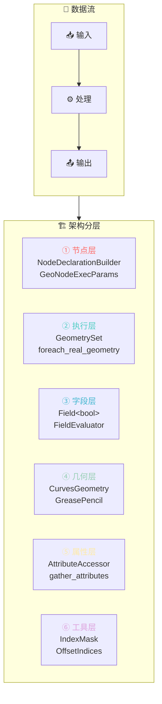

1. **数据层** - 管理底层几何数据（CurvesGeometry, GreasePencil）
2. **属性层** - 管理顶点/边/面等属性（AttributeAccessor, AttributeFilter）
3. **字段层** - 实现延迟求值的字段系统（Field, FieldEvaluator）
4. **执行层** - 管理节点执行上下文（GeoNodeExecParams）
5. **工具层** - 提供通用几何操作（foreach_real_geometry, remove_points_and_split）

每一层都通过特定的类来封装职责，这就是为什么需要这么多类的原因。

---

## 核心类分类详解（按重要程度排序）

### 第一层：节点声明与执行框架

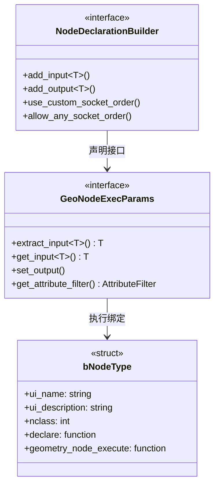

#### 1. `NodeDeclarationBuilder` (最重要)
**所在文件**: 通过 `node_geometry_util.hh` → `NOD_socket_declarations_geometry.hh` 引入

**作用**: 声明节点的输入输出接口。在 `node_declare` 函数中使用：
- `add_input<decl::Geometry>` - 添加几何输入
- `add_output<decl::Geometry>` - 添加几何输出
- `add_input<decl::Bool>` - 添加布尔输入（如 Selection、Delete Segment）

**为什么重要**: 这是节点与外部世界交互的接口定义。

```cpp
static void node_declare(NodeDeclarationBuilder &b)
{
    b.add_input<decl::Geometry>("Curve"_ustr)
        .supported_type({GeometryComponent::Type::Curve, GeometryComponent::Type::GreasePencil});
    b.add_input<decl::Bool>("Selection"_ustr).field_on_all();
}
```

---

#### 2. `GeoNodeExecParams`
**所在文件**: `NOD_geometry_exec.hh` (通过 `node_geometry_util.hh` 引入)

**作用**: 提供节点执行时的参数访问接口：
- `extract_input<T>()` - 提取输入值（消耗性读取）
- `get_input<T>()` - 获取输入值（非消耗性读取）
- `set_output()` - 设置输出值
- `get_attribute_filter()` - 获取属性过滤器

**为什么重要**: 这是节点执行时与系统交互的主要接口。

---

#### 3. `bke::bNodeType`
**所在文件**: `BKE_node.hh` (通过 `node_geometry_util.hh` 引入)

**作用**: 定义节点类型的元数据：
- `ui_name` - 节点显示名称
- `ui_description` - 节点描述
- `nclass` - 节点类别
- `declare` - 声明函数指针
- `geometry_node_execute` - 执行函数指针

---

### 第二层：几何数据核心类

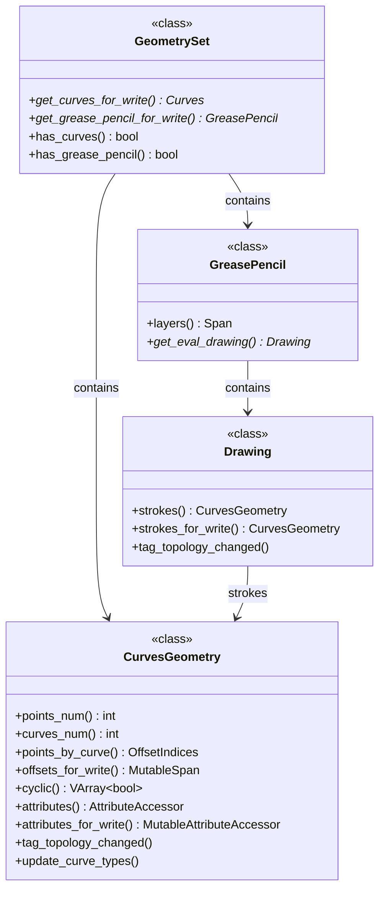

#### 4. `bke::CurvesGeometry` (最重要)
**所在文件**: `BKE_curves.hh`

**作用**: 曲线几何数据的核心封装类，继承自 DNA 的 `CurvesGeometry`：

**关键方法**:
- `points_num()` / `curves_num()` - 获取点/曲线数量
- `points_by_curve()` - 获取每条曲线的点范围
- `offsets_for_write()` - 获取可写的偏移数组
- `cyclic()` / `cyclic_for_write()` - 访问循环属性
- `attributes()` / `attributes_for_write()` - 访问属性
- `tag_topology_changed()` - 标记拓扑变化
- `update_curve_types()` - 更新曲线类型缓存

**为什么重要**: 这是曲线数据的"本体"，所有曲线操作都围绕它进行。

---

#### 5. `GeometrySet`
**所在文件**: `BKE_geometry_set.hh` (通过 `NOD_geometry_exec.hh` 引入)

**作用**: 几何集合，可以包含多种几何类型（网格、曲线、点云、体积等）：
- `get_curves_for_write()` - 获取可写的曲线数据
- `get_grease_pencil_for_write()` - 获取可写的蜡笔数据

**为什么重要**: 几何节点处理的是 GeometrySet，而不是单一几何类型。

---

#### 6. `GeometryComponent::Type`
**作用**: 几何组件类型枚举：
- `Curve` - 曲线
- `GreasePencil` - 蜡笔
- `Mesh` - 网格
- `PointCloud` - 点云
- `Volume` - 体积

---

### 第三层：字段系统 (Field System)

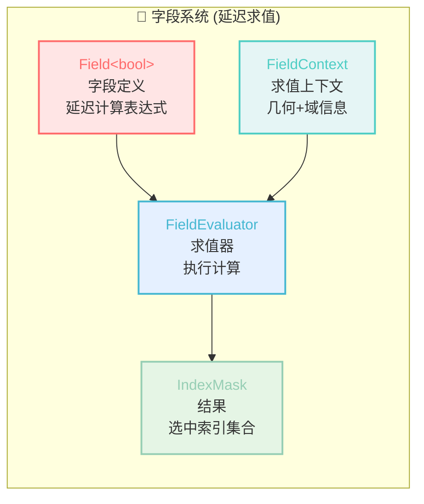

#### 7. `fn::Field<bool>` (非常重要)
**所在文件**: `FN_field.hh` (通过 `NOD_geometry_exec.hh` 引入)

**作用**: 字段系统，实现**延迟求值**。字段是一个函数，可以在给定上下文中求值：

```cpp
const Field<bool> selection_field = params.extract_input<Field<bool>>("Selection"_ustr);
```

**为什么重要**: 几何节点使用字段系统实现灵活的数据流。Selection 可以是常量、属性、或复杂的表达式。

---

#### 8. `fn::FieldContext`
**所在文件**: `FN_field.hh`

**作用**: 字段求值的上下文，包含几何信息和域信息：

```cpp
bke::CurvesFieldContext(*curves_id, AttrDomain::Point)  // 点域上下文
bke::GreasePencilLayerFieldContext(*grease_pencil, AttrDomain::Point, layer_index)
```

**为什么重要**: 字段需要知道在哪个几何上、哪个域（点/边/面）上求值。

---

#### 9. `fn::FieldEvaluator`
**所在文件**: `FN_field_evaluation.hh` (通过 `FN_field.hh` 引入)

**作用**: 字段求值器，将字段转换为实际数据：

```cpp
fn::FieldEvaluator evaluator{field_context, src_curves.points_num()};
evaluator.add(selection_field);
evaluator.evaluate();
const IndexMask selection = evaluator.get_evaluated_as_mask(0);
```

**为什么重要**: 这是将抽象的 Field 转换为具体的 IndexMask 的桥梁。

---

### 第四层：属性系统

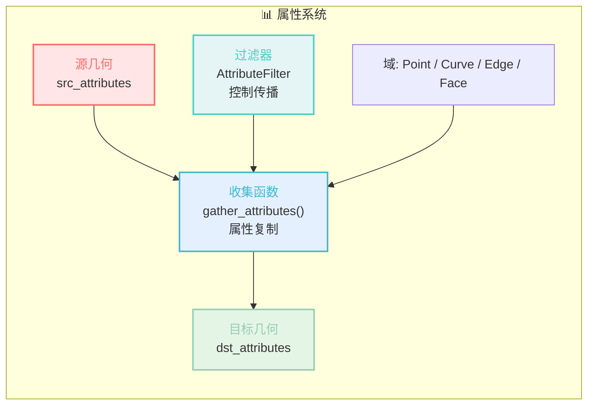

#### 10. `bke::AttributeAccessor` / `bke::MutableAttributeAccessor`
**所在文件**: `BKE_attribute.hh`

**作用**: 属性访问器，提供对几何属性的类型安全访问：

```cpp
const bke::AttributeAccessor src_attributes = src_curves.attributes();
bke::MutableAttributeAccessor dst_attributes = dst_curves.attributes_for_write();
```

**为什么重要**: 属性是几何节点的核心概念，访问器提供了统一的接口。

---

#### 11. `bke::AttributeFilter` / `NodeAttributeFilter`
**所在文件**: `BKE_attribute_filter.hh` / `NOD_geometry_exec.hh`

**作用**: 属性过滤器，控制哪些属性应该被处理/传播：

```cpp
const NodeAttributeFilter &attribute_filter = params.get_attribute_filter("Curve"_ustr);
```

**为什么重要**: 用于优化属性传播，避免不必要的属性复制。

---

#### 12. `bke::AttrDomain`
**所在文件**: `BKE_attribute.hh`

**作用**: 属性域枚举：
- `Point` - 点域
- `Edge` - 边域
- `Face` - 面域
- `Curve` - 曲线域
- `Instance` - 实例域

---

### 第五层：工具类与辅助类

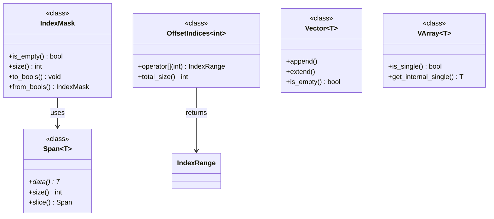

#### 13. `IndexMask`
**所在文件**: `BLI_index_mask.hh` (通过多个头文件引入)

**作用**: 索引掩码，表示一组选中的索引：

```cpp
const IndexMask selection = evaluator.get_evaluated_as_mask(0);
if (selection.is_empty()) { return false; }
```

**为什么重要**: 高效地表示和操作选中的元素集合。

---

#### 14. `OffsetIndices<int>`
**所在文件**: `BLI_offset_indices.hh`

**作用**: 偏移索引，用于将曲线索引映射到点索引范围：

```cpp
const OffsetIndices<int> points_by_curve = src_curves.points_by_curve();
const IndexRange points = points_by_curve[curve_i];  // 获取第 i 条曲线的点范围
```

**为什么重要**: 曲线几何中，每条曲线有不同数量的点，OffsetIndices 高效管理这种变长结构。

---

#### 15. `Vector<T>` / `Array<T>`
**所在文件**: `BLI_vector.hh` / `BLI_array.hh`

**作用**: Blender 的容器类，替代 std::vector：

```cpp
Vector<int> dst_curve_counts;
Vector<int> dst_to_src_curve;
Array<bool> points_to_split(src_curves.points_num(), false);
```

---

#### 16. `Span<T>` / `MutableSpan<T>`
**所在文件**: `BLI_span.hh`

**作用**: 非拥有的数组视图，类似 std::span：

```cpp
const Span<bool> curve_points_to_split = points_to_split.as_span().slice(points);
MutableSpan<int> new_curve_offsets = dst_curves.offsets_for_write();
```

**为什么重要**: 高效、安全的数组访问，避免拷贝。

---

#### 17. `VArray<T>`
**所在文件**: `BLI_virtual_array_fwd.hh`

**作用**: 虚拟数组，可以表示实际数组或常量值：

```cpp
const VArray<bool> src_cyclic = src_curves.cyclic();
```

**为什么重要**: 当所有曲线都是非循环的，cyclic() 可能返回常量 false，而不需要存储数组。

---

### 第六层：几何操作工具

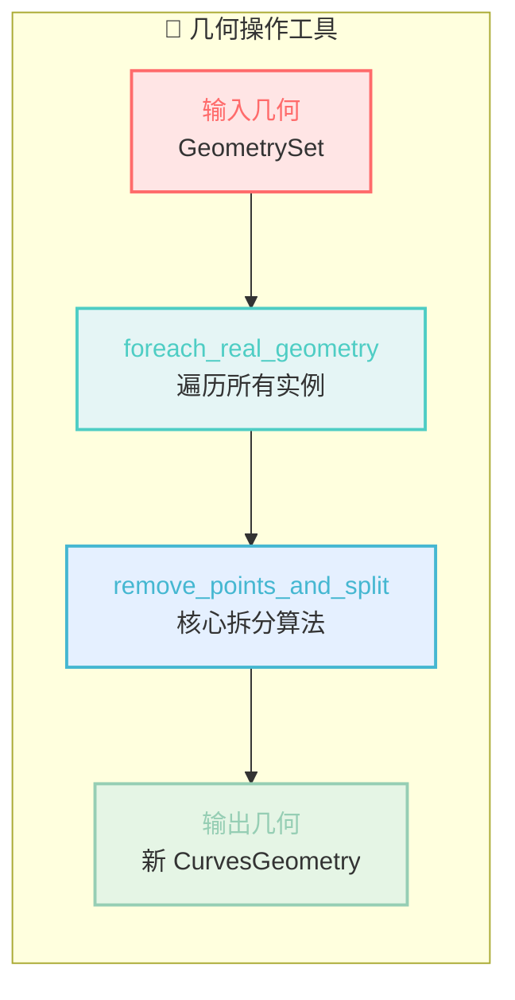

#### 18. `geometry::foreach_real_geometry`
**所在文件**: `GEO_foreach_geometry.hh`

**作用**: 遍历所有实际几何（包括实例中的几何）：

```cpp
geometry::foreach_real_geometry(geometry_set, [&](GeometrySet &geometry_set) {
    if (Curves *curves_id = geometry_set.get_curves_for_write()) {
        // 处理曲线...
    }
});
```

**为什么重要**: 几何节点需要处理实例化的几何，这个工具统一处理所有情况。

---

#### 19. `geometry::remove_points_and_split`
**所在文件**: `GEO_curves_remove_and_split.hh`

**作用**: 核心算法：移除点并在该处拆分曲线：

```cpp
dst_curves = geometry::remove_points_and_split(src_curves, selection);
```

**为什么重要**: 这是"Delete Segment"模式的核心实现。

---

#### 20. `bke::gather_attributes`
**所在文件**: `BKE_attribute.hh`

**作用**: 收集/复制属性到新的几何：

```cpp
bke::gather_attributes(src_attributes,
                       bke::AttrDomain::Curve,
                       bke::AttrDomain::Curve,
                       bke::attribute_filter_with_skip_ref(attribute_filter, {"cyclic"}),
                       dst_to_src_curve.as_span(),
                       dst_attributes);
```

**为什么重要**: 在创建新几何时，需要正确复制属性。

---

### 第七层：蜡笔相关类

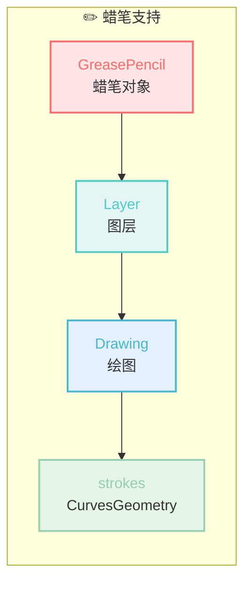

#### 21. `GreasePencil` / `bke::greasepencil::Drawing`
**所在文件**: `BKE_grease_pencil.hh`

**作用**: 蜡笔数据结构和绘图：

```cpp
if (GreasePencil *grease_pencil = geometry_set.get_grease_pencil_for_write()) {
    Drawing *drawing = grease_pencil->get_eval_drawing(grease_pencil->layer(layer_index));
    bke::CurvesGeometry &strokes = drawing->strokes_for_write();
}
```

**为什么重要**: 拆分曲线节点也支持蜡笔的笔画拆分。

---

#### 22. `bke::GreasePencilLayerFieldContext`
**所在文件**: `BKE_geometry_fields.hh` (通过 `NOD_geometry_exec.hh` 引入)

**作用**: 蜡笔图层的字段上下文：

```cpp
bke::GreasePencilLayerFieldContext(*grease_pencil, AttrDomain::Point, layer_index)
```

---

### 第八层：底层工具

#### 23. `array_utils::copy` / `offset_indices::accumulate_counts_to_offsets`
**所在文件**: `BLI_array_utils.hh`

**作用**: 数组工具函数：

```cpp
array_utils::copy(dst_curve_counts.as_span(), new_curve_offsets.drop_back(1));
offset_indices::accumulate_counts_to_offsets(new_curve_offsets);
```

---

#### 24. `bke::curves::nurbs::update_custom_knot_modes`
**所在文件**: `BKE_curves.hh`

**作用**: NURBS 曲线自定义节点更新。

---

## Include 分析：为什么有些类需要显式 include，有些不需要？

### 理解 C++ 的 Include 机制

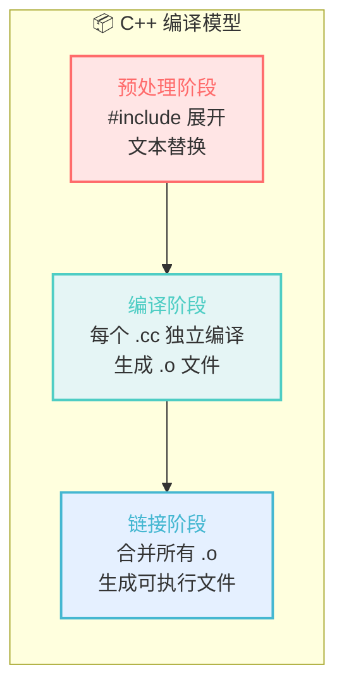

**关键点**：
- 每个 `.cc` 文件是**独立编译**的，它们之间不会共享预编译结果
- 头文件保护（`#pragma once`）只防止**同一个翻译单元内**重复包含
- 不同 `.cc` 文件都会各自解析一遍相同的头文件

### 不需要显式 include 的类（通过间接引入）

| 类名 | 引入路径 |
|------|---------|
| `GeoNodeExecParams` | `node_geometry_util.hh` → `NOD_geometry_exec.hh` |
| `Field<bool>` | `node_geometry_util.hh` → `NOD_geometry_exec.hh` → `FN_field.hh` |
| `FieldEvaluator` | 同上 |
| `GeometrySet` | `node_geometry_util.hh` → `NOD_geometry_exec.hh` |
| `AttributeAccessor` | `node_geometry_util.hh` → `NOD_geometry_exec.hh` → `BKE_geometry_fields.hh` |
| `IndexMask` | 通过 `BKE_curves.hh` → `BLI_index_mask_fwd.hh` |
| `Span`, `Vector`, `VArray` | 通过 `BKE_curves.hh` 引入的各种 `BLI_*.hh` |

### 需要显式 include 的类

| 类名 | 原因 |
|------|------|
| `BLI_array_utils.hh` | 使用 `array_utils::copy` 和 `offset_indices::accumulate_counts_to_offsets`，这些不在 `BKE_curves.hh` 的引入范围内 |
| `BKE_attribute.hh` | 使用 `bke::gather_attributes` 和 `AttributeInit` 等，需要完整定义 |
| `BKE_curves.hh` | 需要 `bke::CurvesGeometry` 的完整定义 |
| `BKE_curves_utils.hh` | 使用 `BKE_defgroup_copy_list` |
| `BKE_deform.hh` | 使用 `BKE_defgroup_copy_list` |
| `BKE_grease_pencil.hh` | 需要 `GreasePencil` 和 `Drawing` 的完整定义 |
| `GEO_curves_remove_and_split.hh` | 使用 `geometry::remove_points_and_split` |
| `GEO_foreach_geometry.hh` | 使用 `geometry::foreach_real_geometry` |

### 关于"重复编译"的问题

**这不是"弱智"设计，而是 C++ 的历史权衡**：

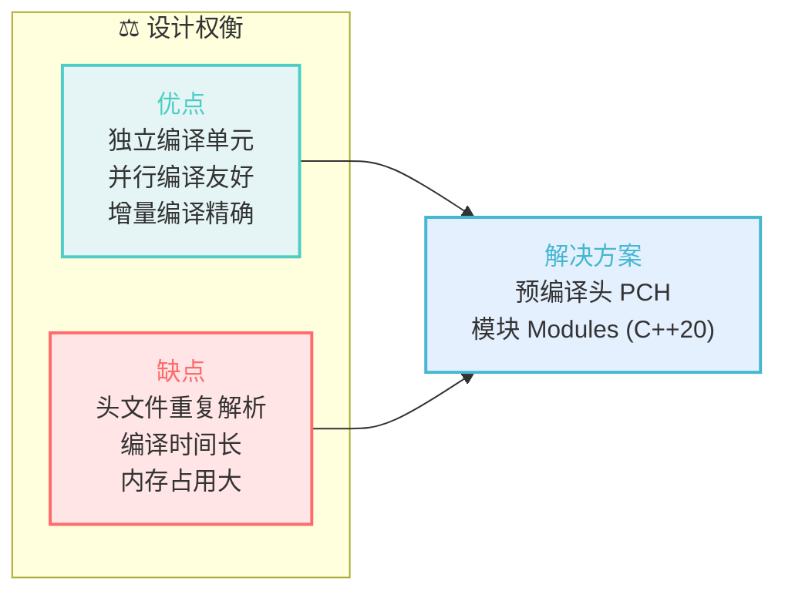

**Blender 的优化策略**：
1. **预编译头 (PCH)** - 将常用头文件预编译，减少重复解析
2. **前向声明** - 使用 `fwd.hh` 文件减少不必要的完整定义
3. **分层包含** - `node_geometry_util.hh` 统一包含常用头文件
4. **IWYU 原则** - 只 include 真正需要的头文件

### 为什么这样设计？

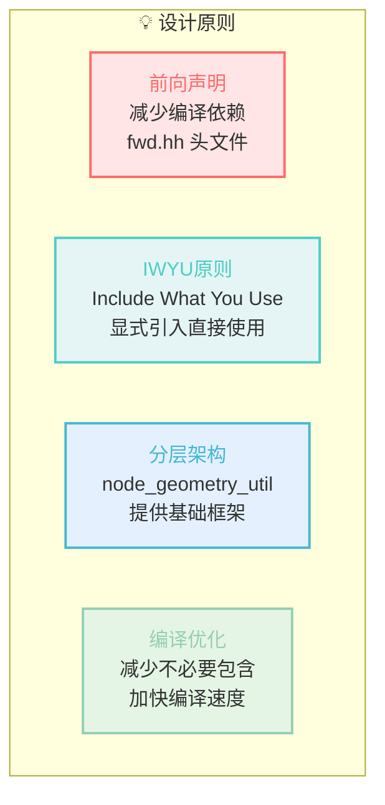

1. **前向声明 (Forward Declaration)**: 很多头文件使用 `fwd.hh` 版本（如 `BLI_index_mask_fwd.hh`）来减少编译依赖

2. **IWYU (Include What You Use)**: Blender 使用 IWYU 原则，每个 `.cc` 文件应该显式 include 它**直接使用且未被其他头文件完整引入**的头文件

3. **分层架构**: 
   - `node_geometry_util.hh` 提供节点开发的基础框架，已经包含了最常用的头文件
   - 只有框架未覆盖的功能才需要显式引入对应的头文件

4. **编译优化**: 
   - 头文件保护（#pragma once）确保同一翻译单元内不会重复包含
   - 但不同 .cc 文件各自独立编译，都会解析相同的头文件
   - 这是 C++ 编译模型的特点，不是"弱智"，而是权衡了编译期与运行期的设计选择

---

## 完整类关系图

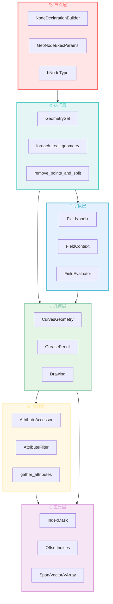

---

## 节点执行流程图

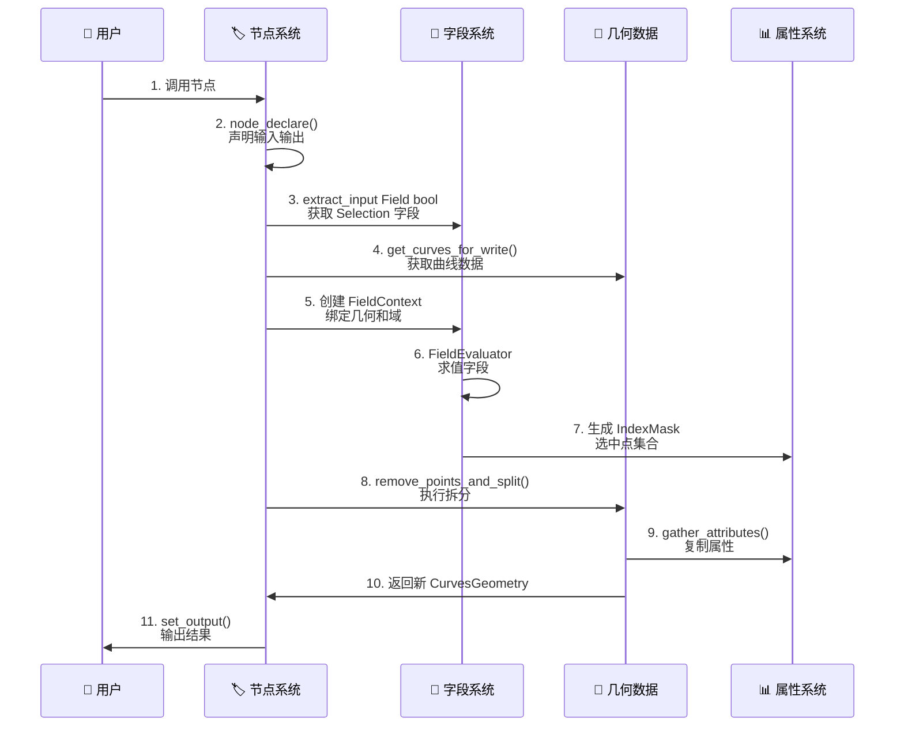

---

## 总结

拆分曲线节点用到的类可以分为 8 个层次：

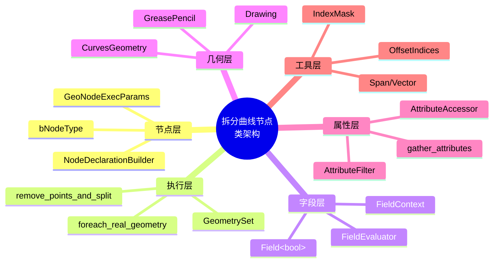

这种分层设计使得 Blender 几何节点系统具有高度的：
- **模块化** - 每个类职责单一
- **可扩展性** - 容易添加新节点和新几何类型
- **性能** - 通过字段系统实现延迟求值和批量计算
- **类型安全** - 大量使用 C++ 类型系统
