# 几何节点设计思想与注册机制详解

## 一、整体架构设计思想

Blender 几何节点的设计遵循了**数据流编程 (Dataflow Programming)** 范式，其核心思想是：

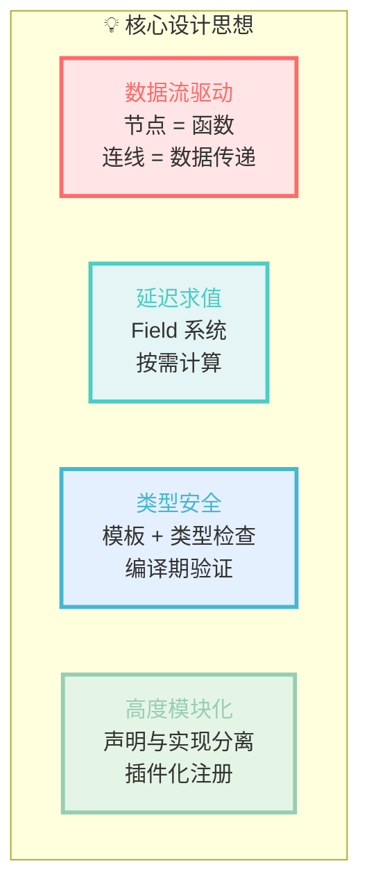

### 1.1 数据流驱动 (Dataflow)

在几何节点编辑器中：
- **节点 (Node)** = 一个纯函数，输入 → 处理 → 输出
- **连线 (Link)** = 数据依赖关系，决定执行顺序
- **节点树 (NodeTree)** = 一个有向无环图 (DAG)，系统自动拓扑排序

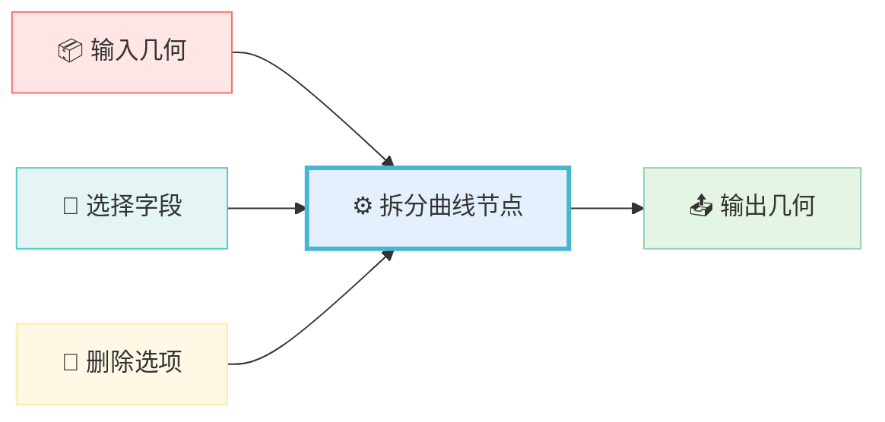

### 1.2 延迟求值 (Lazy Evaluation)

**Field 系统**是 Blender 几何节点最核心的创新之一：

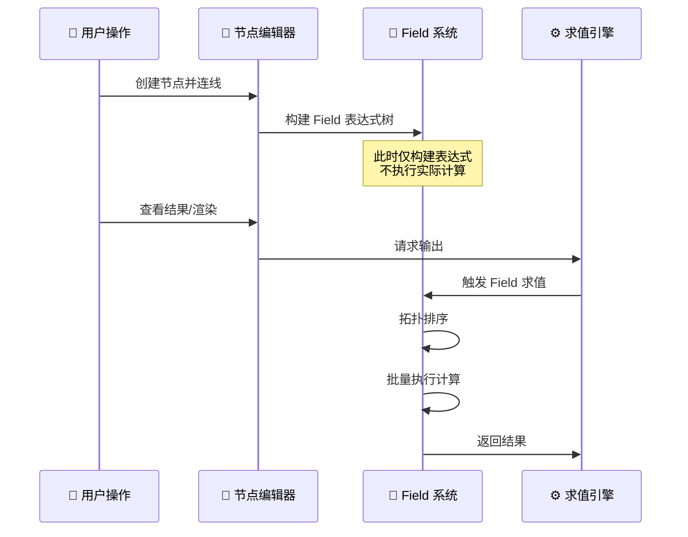

**Field 的优势**：
- 自动合并相同计算（去重）
- 批量处理数据（SIMD 优化）
- 延迟到真正需要时才计算

### 1.3 声明式编程 (Declarative)

节点开发者只需要**声明**节点有什么，而不是**命令**系统怎么做：

```cpp
// 声明式：声明节点有什么输入输出
static void node_declare(NodeDeclarationBuilder &b)
{
    b.add_input<decl::Geometry>("Curve"_ustr)     // 声明几何输入
         .supported_type({GeometryComponent::Type::Curve, 
                          GeometryComponent::Type::GreasePencil});
    b.add_input<decl::Bool>("Selection"_ustr)     // 声明布尔字段输入
         .default_value(true)
         .field_on_all();
    b.add_output<decl::Geometry>("Curve"_ustr);   // 声明几何输出
}

// 命令式：实现具体逻辑
static void node_geo_exec(GeoNodeExecParams params)
{
    // 实现数据处理逻辑
}
```

---

## 二、节点的三层结构

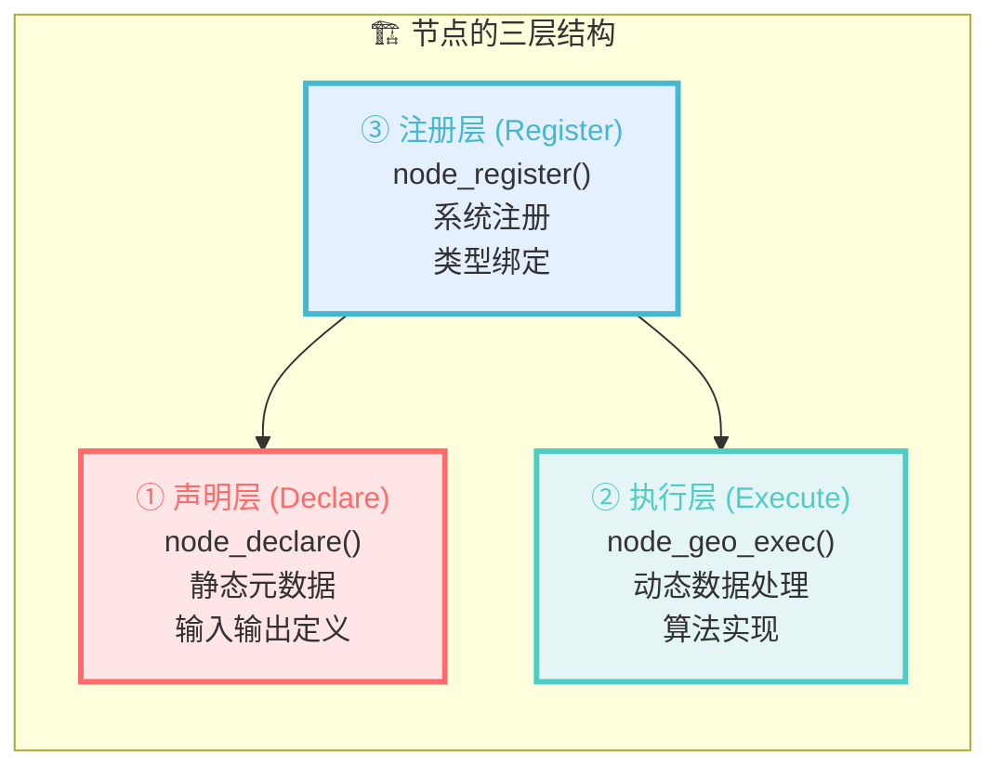

### 2.1 声明层 (Declaration Layer)

```cpp
static void node_declare(NodeDeclarationBuilder &b)
{
    b.use_custom_socket_order();           // 使用自定义 socket 顺序
    b.allow_any_socket_order();            // 允许任意 socket 顺序
    
    // 输入声明
    b.add_input<decl::Geometry>("Curve"_ustr)
        .supported_type({GeometryComponent::Type::Curve, 
                         GeometryComponent::Type::GreasePencil})
        .description("Curves to split");
    
    // 输出声明
    b.add_output<decl::Geometry>("Curve"_ustr)
        .propagate_all()                    // 传播所有属性
        .align_with_previous();             // 与上一个对齐
    
    // 字段输入声明
    b.add_input<decl::Bool>("Selection"_ustr)
        .default_value(true)
        .hide_value()                       // 隐藏默认值
        .field_on_all()                     // 在所有域上作为字段
        .description("Control points used to split curves");
}
```

**设计意图**：
- 将接口定义与实现分离
- 支持 UI 自动生成
- 支持链接搜索和类型检查

### 2.2 执行层 (Execution Layer)

```cpp
static void node_geo_exec(GeoNodeExecParams params)
{
    // 1. 提取输入
    GeometrySet geometry_set = params.extract_input<GeometrySet>("Curve"_ustr);
    const Field<bool> selection_field = params.extract_input<Field<bool>>("Selection"_ustr);
    const bool delete_segment = params.extract_input<bool>("Delete Segment"_ustr);
    
    // 2. 处理数据
    geometry::foreach_real_geometry(geometry_set, [&](GeometrySet &geometry_set) {
        // 处理曲线...
    });
    
    // 3. 设置输出
    params.set_output("Curve"_ustr, std::move(geometry_set));
}
```

**设计意图**：
- 纯函数式设计，无副作用
- 参数化输入输出
- 支持延迟求值

### 2.3 注册层 (Registration Layer)

这是本文重点，详见下一节。

---

## 三、注册机制深度解析 (node_register)

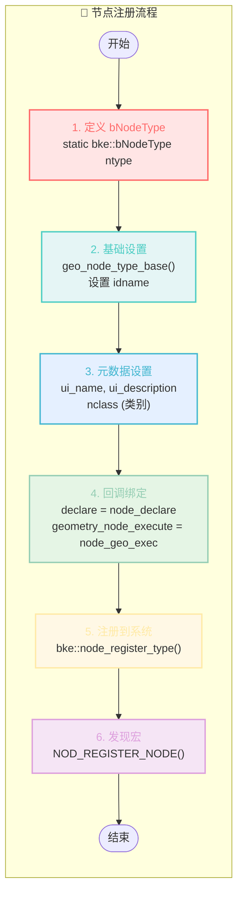

### 3.1 完整注册代码解析

```cpp
static void node_register()              // ① 静态注册函数
{
    static bke::bNodeType ntype;         // ② 静态存储节点类型定义

    // ③ 基础初始化
    geo_node_type_base(&ntype, "GeometryNodeSplitCurve"_ustr);
    
    // ④ UI 元数据
    ntype.ui_name = "Split Curve";                           // 显示名称
    ntype.ui_description = "Split curves by selected control points";  // 描述
    ntype.nclass = NODE_CLASS_GEOMETRY;                      // 节点类别
    
    // ⑤ 功能回调绑定
    ntype.declare = node_declare;                            // 声明函数
    ntype.geometry_node_execute = node_geo_exec;            // 执行函数
    
    // ⑥ 注册到系统
    bke::node_register_type(ntype);
}

// ⑦ 发现宏 - 关键！
NOD_REGISTER_NODE(node_register)
```

### 3.2 逐行详解

#### ① `static void node_register()`


#### ② `static bke::bNodeType ntype`

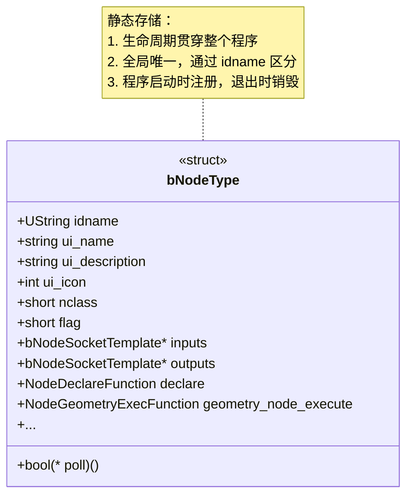

**为什么是 `static`**：
- 生命周期：从注册到程序结束
- 作用域：仅在当前文件可见
- 初始化：零初始化 + 后续代码填充

#### ③ `geo_node_type_base(&ntype, "GeometryNodeSplitCurve"_ustr)`

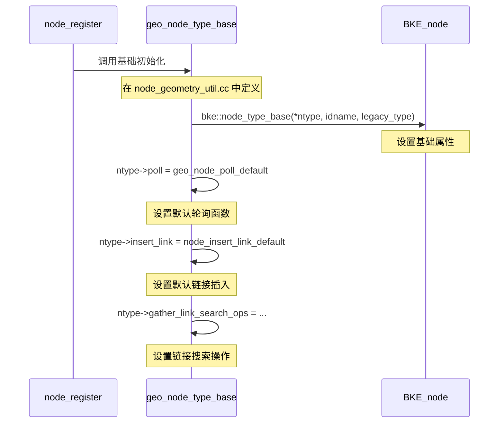

**源码实现**（`source/blender/nodes/geometry/node_geometry_util.cc:136`）：

```cpp
void geo_node_type_base(bke::bNodeType *ntype,
                        UString idname,
                        const std::optional<int16_t> legacy_type)
{
    // 调用更底层的 base 函数
    bke::node_type_base(*ntype, idname, legacy_type);
    
    // 设置几何节点特有的默认值
    ntype->poll = geo_node_poll_default;                    // 默认轮询
    ntype->insert_link = node_insert_link_default;          // 默认链接处理
    ntype->gather_link_search_ops = nodes::search_link_ops_for_basic_node;
}
```

**设计模式**：**模板方法模式 (Template Method)**
- `node_type_base`：通用基础设置
- `geo_node_type_base`：几何节点特有设置
- `geo_cmp_node_type_base`：合成器+几何节点混合设置

#### ④ 元数据设置

```cpp
ntype.ui_name = "Split Curve";                           // 用户看到的名称
ntype.ui_description = "Split curves by selected...";    // 悬停提示
ntype.nclass = NODE_CLASS_GEOMETRY;                      // 节点类别（决定颜色）
```

**节点类别 (nclass)**：

```mermaid
flowchart LR
    subgraph 节点类别["🎨 节点类别与颜色"]
        direction TB
        
        Input["<span style='color:#6B8E23'>NODE_CLASS_INPUT</span><br/>输入 - 绿色"] 
        Output["<span style='color:#CD5C5C'>NODE_CLASS_OUTPUT</span><br/>输出 - 红色"] 
        Geometry["<span style='color:#4169E1'>NODE_CLASS_GEOMETRY</span><br/>几何 - 蓝色"] 
        Attribute["<span style='color:#9932CC'>NODE_CLASS_ATTRIBUTE</span><br/>属性 - 紫色"] 
        Material["<span style='color:#FF8C00'>NODE_CLASS_MATERIAL</span><br/>材质 - 橙色"] 
        Texture["<span style='color:#20B2AA'>NODE_CLASS_TEXTURE</span><br/>纹理 - 青色"] 
    end
    
    style Input fill:#F0FFF0,stroke:#6B8E23
    style Output fill:#FFF0F0,stroke:#CD5C5C
    style Geometry fill:#F0F5FF,stroke:#4169E1,stroke-width:3px
    style Attribute fill:#F5F0FF,stroke:#9932CC
    style Material fill:#FFF8F0,stroke:#FF8C00
    style Texture fill:#F0FFFA,stroke:#20B2AA
```

#### ⑤ 回调绑定

```cpp
ntype.declare = node_declare;                            // 声明回调
ntype.geometry_node_execute = node_geo_exec;            // 执行回调
```

**回调类型定义**（`BKE_node.hh:124, 370`）：

```cpp
// 声明回调：定义节点接口
using NodeDeclareFunction = void (*)(nodes::NodeDeclarationBuilder &builder);

// 执行回调：实现节点逻辑
using NodeGeometryExecFunction = void (*)(nodes::GeoNodeExecParams params);
```

**为什么用函数指针而不是虚函数？**

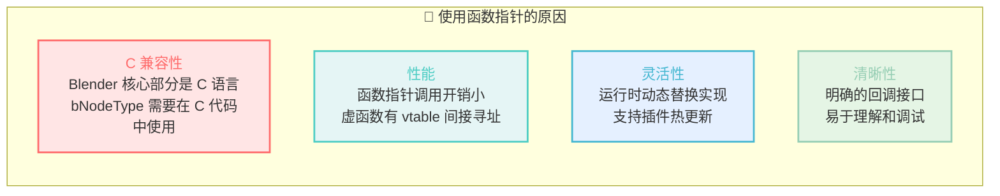

| 特性 | 函数指针 | 虚函数 |
|------|----------|--------|
| C 兼容 | ✅ 可以 | ❌ 不行（C++ 特性） |
| 调用开销 | 直接跳转 | vtable 查找 + 跳转 |
| 动态替换 | ✅ 运行时修改 | ❌ 编译期固定 |
| 代码清晰 | 明确的函数签名 | 隐藏在继承体系中 |
| 调试友好 | 可以直接看到函数地址 | 需要查看 vtable |

#### 为什么函数指针语法这么怪？

**源码位置**：`source/blender/blenkernel/BKE_node.hh:120-125`

```cpp
/* Use `void *` for callbacks that require C++. This is rather ugly, but works well for now. This
 * would not be necessary if we would use bNodeSocketType and bNodeType only in C++ code.
 * However, achieving this requires quite a few changes currently. */
using NodeMultiFunctionBuildFunction = void (*)(nodes::NodeMultiFunctionBuilder &builder);
using NodeGeometryExecFunction = void (*)(nodes::GeoNodeExecParams params);
using NodeDeclareFunction = void (*)(nodes::NodeDeclarationBuilder &builder);
```

**"怪语法"解析**：

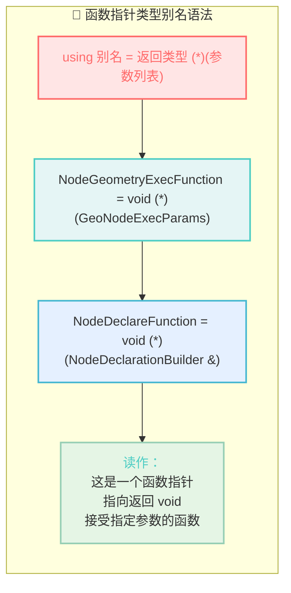

**语法拆解**：

```cpp
using NodeGeometryExecFunction = void (*)(nodes::GeoNodeExecParams params);
//     ^^^^^^^^^^^^^^^^^^^^^^^^   ^^^^  ^  ^^^^^^^^^^^^^^^^^^^^^^^^^^^^^
//            类型别名             返回   |           参数列表
//                                    指针标记
```

**为什么不用更简单的语法？**

| 替代方案 | 代码 | 缺点 |
|----------|------|------|
| `std::function` | `std::function<void(GeoNodeExecParams)>` | 有类型擦除开销，不适合高频调用 |
| 模板 | `template<typename F> void set_callback(F f)` | 需要在头文件暴露实现，编译依赖增加 |
| 虚函数 | `virtual void execute(GeoNodeExecParams)` | 不兼容 C，vtable 开销 |
| **函数指针** | `void (*func)(GeoNodeExecParams)` | ✅ 简单、高效、兼容 C |

**注释中的 `"rather ugly"` 指什么？**

```cpp
/* Use `void *` for callbacks that require C++. This is rather ugly, but works well for now. */
```

这里的 `"ugly"` 指的是：**C++ 代码需要使用 `void*` 来兼容 C 代码的回调**，而不是函数指针语法本身。

```cpp
// C++ 中的理想写法（但无法直接在 C 中使用）
using NodeGeometryExecFunction = void (*)(nodes::GeoNodeExecParams params);

// 为了 C 兼容，有时需要这样写
void* callback;  // "ugly"：丢失了类型安全，需要强制转换
```

**实际使用时的简洁性**：

```cpp
// 定义时：使用类型别名，清晰
ntype.geometry_node_execute = node_geo_exec;

// 调用时：像普通函数一样使用
ntype.geometry_node_execute(params);  // 简洁直观
```

#### ⑥ `bke::node_register_type(ntype)`

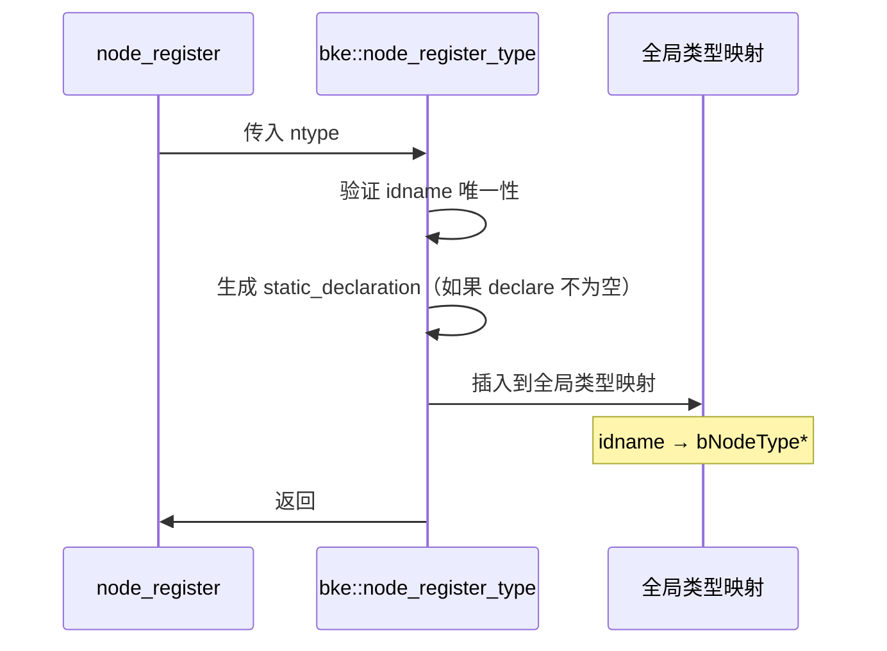

**全局注册表**：
- 存储位置：`bke::nodetypes` 映射表
- 键：节点的 `idname`（如 `"GeometryNodeSplitCurve"`）
- 值：`bNodeType*` 指针

#### ⑦ `NOD_REGISTER_NODE(node_register)` - 最关键的部分

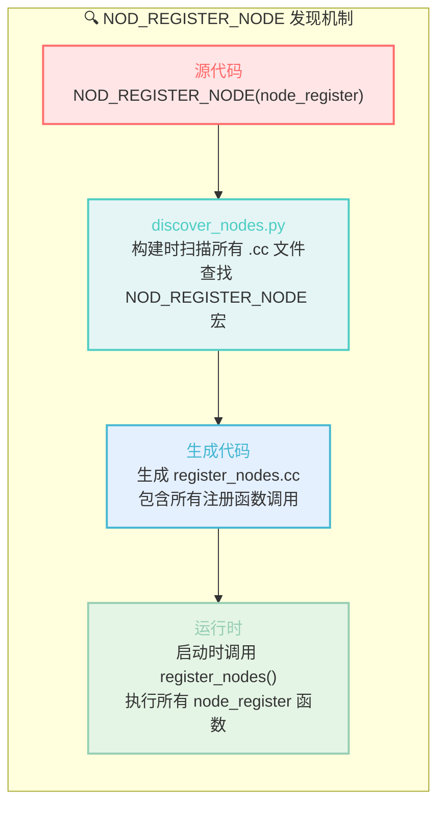

**宏定义**（`NOD_register.hh:37-42`）：

```cpp
#define NOD_REGISTER_NODE(REGISTER_FUNC) \
  void REGISTER_FUNC##_discover(); \           // ① 声明发现函数
  void REGISTER_FUNC##_discover() \            // ② 定义发现函数
  { \
    REGISTER_FUNC(); \                         // ③ 调用实际注册函数
  }
```

**展开后的实际代码**：

```cpp
// 原始代码
NOD_REGISTER_NODE(node_register)

// 预处理器展开后
void node_register_discover();           // 声明oid node_register_discover()            // 定义
{
    node_register();                      // 调用注册
}
```

**为什么需要这个宏？**

1. **发现标记**：`discover_nodes.py` 脚本搜索 `NOD_REGISTER_NODE` 字符串来找到所有需要注册的节点
2. **包装函数**：创建非静态的包装函数 `xxx_discover()`，可以被外部调用
3. **避免魔法**：让代码中明显看出"这里有注册逻辑"，而不是隐式地搜索所有 `node_register` 函数

**构建时流程**：

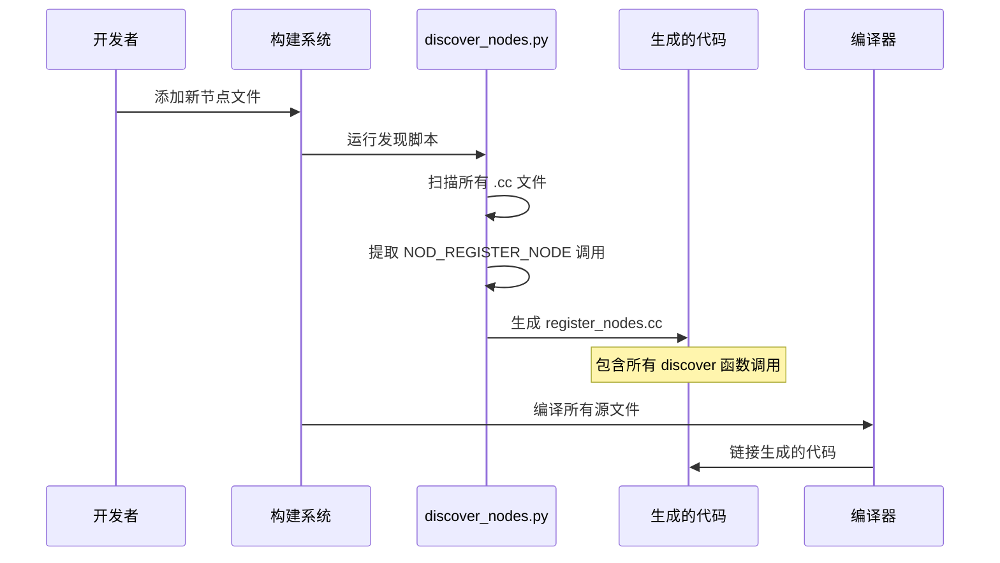

---

## 四、运行时行为

### 4.1 启动时注册

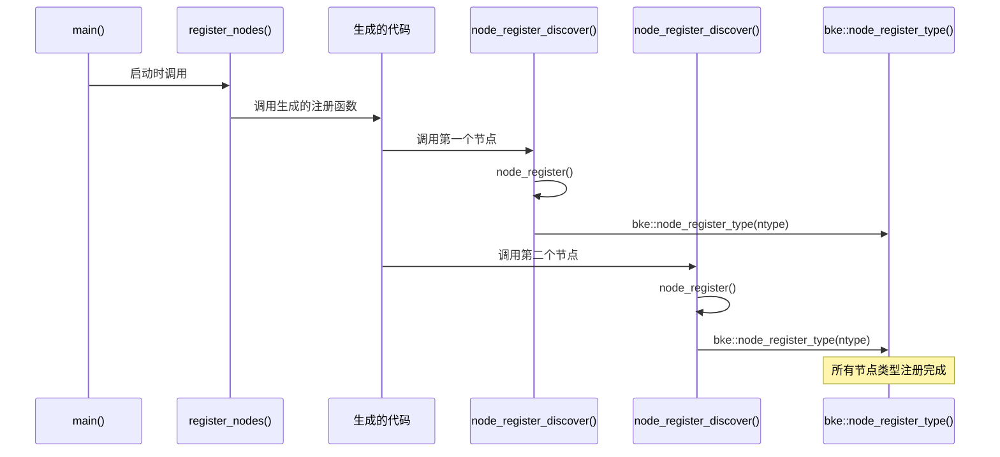

### 4.2 节点创建时

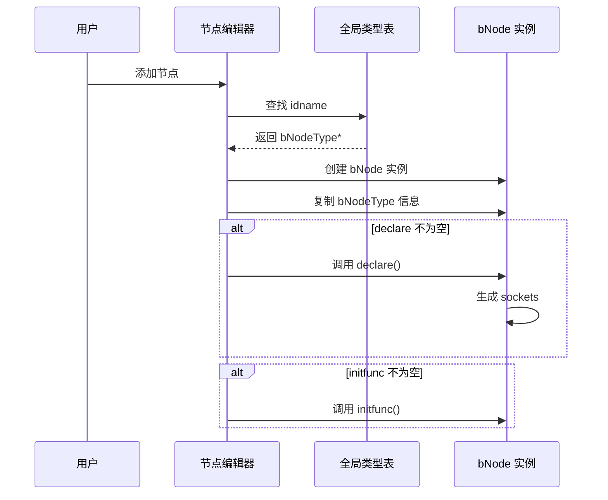

### 4.3 节点执行时

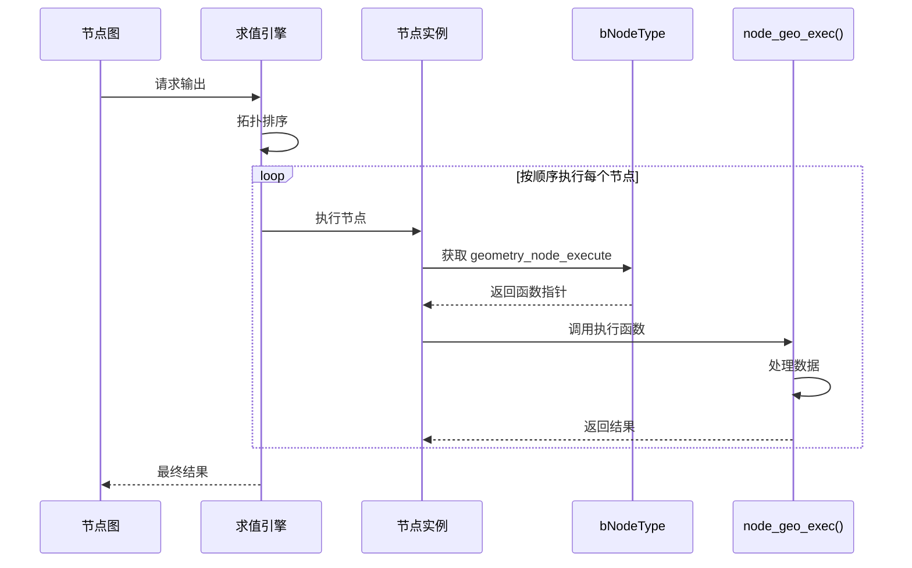

---

## 五、设计模式总结

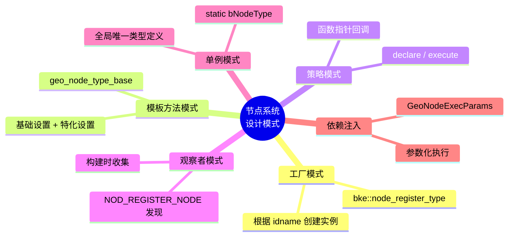

---

## 六、关键代码回顾

### 6.1 最小节点模板

```cpp
/* SPDX-FileCopyrightText: 2026 Blender Authors
 *
 * SPDX-License-Identifier: GPL-2.0-or-later */

#include "node_geometry_util.hh"

namespace blender::nodes::node_geo_example_cc {

// 1. 声明层：定义接口
static void node_declare(NodeDeclarationBuilder &b)
{
    b.add_input<decl::Geometry>("Geometry"_ustr);
    b.add_output<decl::Geometry>("Geometry"_ustr);
}

// 2. 执行层：实现逻辑
static void node_geo_exec(GeoNodeExecParams params)
{
    GeometrySet geometry = params.extract_input<GeometrySet>("Geometry"_ustr);
    // ... 处理 ...
    params.set_output("Geometry"_ustr, std::move(geometry));
}

// 3. 注册层：绑定到系统
static void node_register()
{
    static bke::bNodeType ntype;
    geo_node_type_base(&ntype, "GeometryNodeExample"_ustr);
    ntype.ui_name = "Example";
    ntype.ui_description = "Example node";
    ntype.nclass = NODE_CLASS_GEOMETRY;
    ntype.declare = node_declare;
    ntype.geometry_node_execute = node_geo_exec;
    bke::node_register_type(ntype);
}
NOD_REGISTER_NODE(node_register)

}  // namespace blender::nodes::node_geo_example_cc
```

### 6.2 核心要点

1. **三层分离**：声明、执行、注册各司其职
2. **静态存储**：`bNodeType` 静态存储，程序生命周期内有效
3. **函数指针**：使用 C 风格回调，兼容性和性能兼顾
4. **宏发现**：`NOD_REGISTER_NODE` 实现自动发现
5. **延迟求值**：Field 系统实现按需计算

---

## 七、延伸阅读

- `source/blender/nodes/NOD_register.hh` - 注册宏定义
- `source/blender/nodes/geometry/node_geometry_util.cc` - 几何节点工具函数
- `source/blender/blenkernel/BKE_node.hh` - 节点类型定义
- `source/blender/nodes/intern/node_common.cc` - 通用节点逻辑
- `build_files/cmake/modules/discover_nodes.py` - 节点发现脚本
