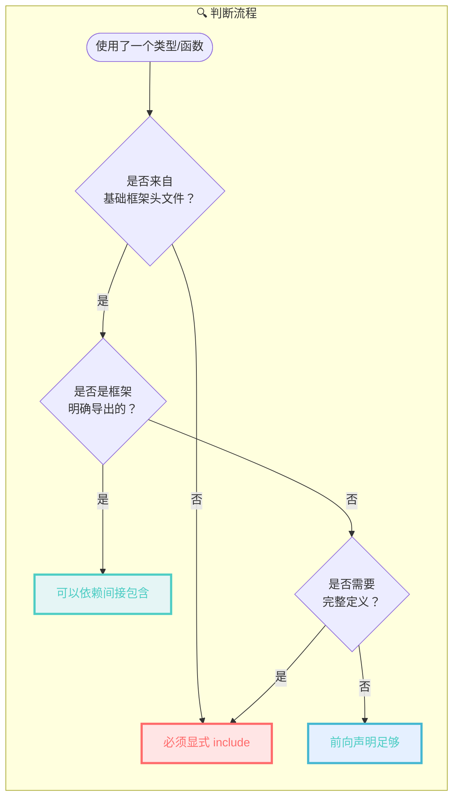
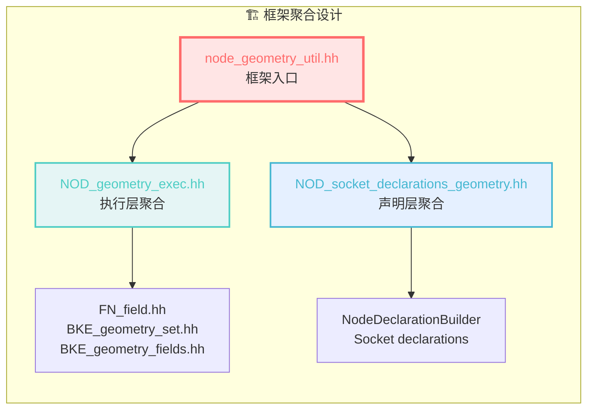
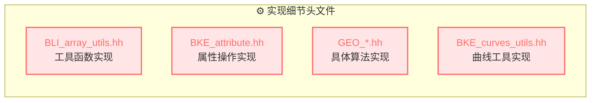
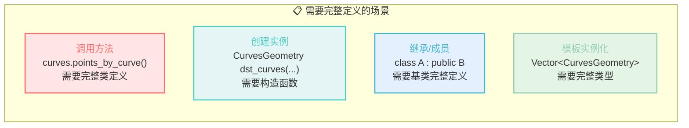
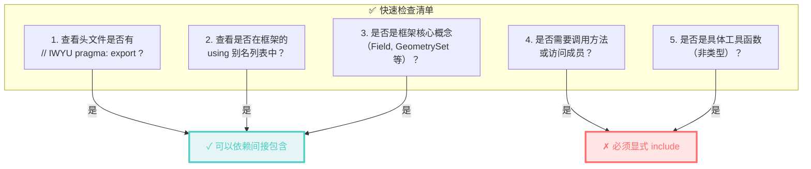
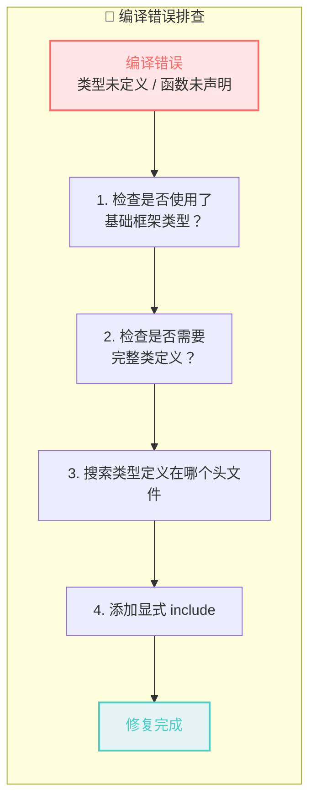
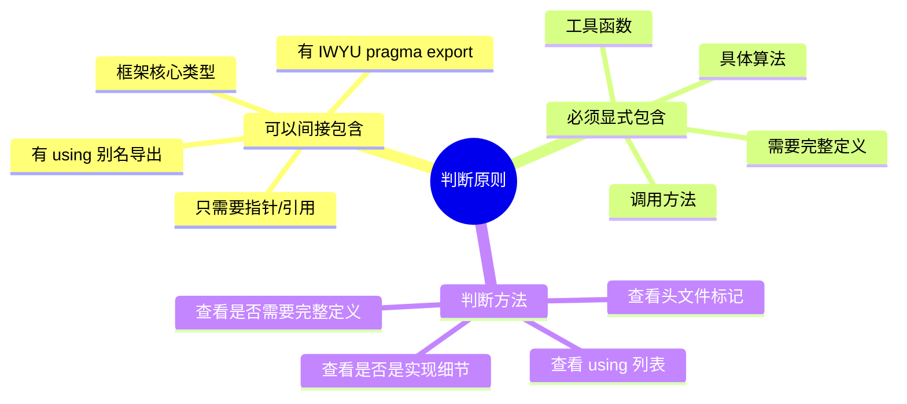

# 如何判断哪些是故意间接包含的？哪些是不应该间接包含的？

## 核心判断原则



---

## 一、故意间接包含的特征

### 1.1 标记：`// IWYU pragma: export`

这是**最明确的信号**！Blender 使用这个标记来表明"这个头文件是故意被导出给使用者用的"。

```cpp
// node_geometry_util.hh 第 8-18 行
#include "MEM_guardedalloc.h"  // IWYU pragma: export
#include "BKE_node_legacy_types.hh"  // IWYU pragma: export
#include "BKE_node_socket_value.hh"  // IWYU pragma: export

#include "NOD_geometry_exec.hh"                 // IWYU pragma: export
#include "NOD_register.hh"                      // IWYU pragma: export
#include "NOD_socket_declarations.hh"           // IWYU pragma: export
#include "NOD_socket_declarations_geometry.hh"  // IWYU pragma: export

#include "node_util.hh"  // IWYU pragma: export
```

#### `// IWYU pragma: export` 是什么？

```mermaid
flowchart TB
    subgraph IWYU解释["📖 IWYU (Include What You Use)"]
        direction TB
        
        Tool["<span style='color:#FF6B6B'>IWYU 工具</span><br/>Google 开发的工具<br/>分析 #include 使用情况"] 
        
        Problem["<span style='color:#4ECDC4'>问题</span><br/>工具会认为间接包含是"错误"<br/>建议添加显式 include"] 
        
        Solution["<span style='color:#45B7D1'>解决方案</span><br/>// IWYU pragma: export<br/>告诉工具：这是故意的！"] 
        
        Result["<span style='color:#96CEB4'>结果</span><br/>工具理解设计意图<br/>不会报告"虚假"错误"]
    end
    
    Tool --> Problem --> Solution --> Result
    
    style Tool fill:#FFE5E5,stroke:#FF6B6B,stroke-width:2px
    style Problem fill:#E5F5F5,stroke:#4ECDC4,stroke-width:2px
    style Solution fill:#E5F0FF,stroke:#45B7D1,stroke-width:2px
    style Result fill:#E5F5E5,stroke:#96CEB4,stroke-width:2px
```

**作用机制**：

| 场景 | 没有 pragma | 有 `// IWYU pragma: export` |
|------|-------------|----------------------------|
| 代码 | `#include "A.h"` → `#include "B.h"` | `#include "A.h" // IWYU pragma: export` → `#include "B.h"` |
| 使用 B 的类型 | IWYU 建议：`#include "B.h"` | IWYU 理解：通过 A.h 故意引入 |
| 意图表达 | 不明确 | **明确表示这是设计意图** |

**含义**：
- 这些头文件是 `node_geometry_util.hh` **故意暴露**给使用者的
- 你可以依赖这些间接包含
- IWYU 工具会知道这是设计意图，不会报错
- **对人**：代码注释，表明设计意图
- **对工具**：指令，抑制不必要的警告

### 1.2 框架聚合头文件



**特征**：
- 文件名通常带有 `util`、`exec`、`declarations` 等聚合性质的后缀
- 包含大量 `// IWYU pragma: export` 标记
- 提供 `using` 别名（如 `NOD_geometry_exec.hh` 中的 33-64 行）

### 1.3 using 别名导出

```cpp
// NOD_geometry_exec.hh 中的设计意图
namespace blender::nodes {

using bke::AttrDomain;           // ← 故意导出
using bke::AttributeAccessor;    // ← 故意导出
using bke::GeometrySet;          // ← 故意导出
using fn::Field;                 // ← 故意导出
using fn::FieldContext;          // ← 故意导出
using fn::FieldEvaluator;        // ← 故意导出

}
```

**含义**：这些 `using` 声明明确表示"这些类型是几何节点框架的标准组成部分"。

---

## 二、不应该间接包含的特征

### 2.1 实现细节头文件



**判断标准**：

| 特征 | 说明 | 例子 |
|------|------|------|
| 工具函数 | 提供具体算法实现 | `array_utils::copy`, `gather_attributes` |
| 具体类型 | 不是框架核心类型 | `CurvesGeometry` 完整定义 |
| 算法头文件 | `GEO_` 前缀 | `GEO_curves_remove_and_split.hh` |
| 工具头文件 | `*_utils.hh` 后缀 | `BKE_curves_utils.hh` |

### 2.2 需要完整定义的场景



**对比示例**：

```cpp
// 场景1：只需要前向声明（可以间接包含）
class CurvesGeometry;  // 前向声明足够
void process(CurvesGeometry* curves);  // 只需要指针

// 场景2：需要完整定义（必须显式 include）
#include "BKE_curves.hh"  // 必须显式包含
void process(CurvesGeometry& curves) {
    curves.points_by_curve();  // 调用方法需要完整定义
}
```

---

## 三、实际判断案例分析

### 案例1：`Field<bool>` - 可以间接包含 ✅

```cpp
// 你的代码
const Field<bool> selection_field = params.extract_input<Field<bool>>("Selection"_ustr);

// 引入路径：
// node_geometry_util.hh (IWYU pragma: export)
//   → NOD_geometry_exec.hh (IWYU pragma: export)
//     → FN_field.hh
//       → Field<T> 定义

// NOD_geometry_exec.hh 中的 using 声明：
using fn::Field;  // ← 明确表示这是框架的一部分
```

**判断**：
- ✅ 有 `IWYU pragma: export` 标记
- ✅ 有 `using` 别名导出
- ✅ 是框架核心概念
- ✅ 通过 `extract_input` 使用，不需要知道 `Field` 的内部实现

### 案例2：`CurvesGeometry` - 必须显式包含 ❌

```cpp
// 你的代码
bke::CurvesGeometry dst_curves(dst_to_src_point.size(), dst_to_src_curve.size());
dst_curves.offsets_for_write();  // 调用方法

// 引入路径：
// 没有通过 node_geometry_util.hh 引入！
// 必须通过 #include "BKE_curves.hh" 显式包含
```

**判断**：
- ❌ 没有 `IWYU pragma: export` 标记
- ❌ 没有 `using` 别名
- ❌ 需要调用方法（需要完整定义）
- ❌ 是具体数据类型，不是框架抽象

### 案例3：`gather_attributes` - 必须显式包含 ❌

```cpp
// 你的代码
bke::gather_attributes(src_attributes, ...);

// 引入路径：
// 必须通过 #include "BKE_attribute.hh" 显式包含
// 虽然 AttributeAccessor 可以通过框架引入
// 但 gather_attributes 函数不行
```

**判断**：
- ❌ 是具体工具函数，不是框架核心类型
- ❌ 不在 `NOD_geometry_exec.hh` 的导出列表中
- ❌ 需要函数完整定义才能调用

---

## 四、快速判断清单



### 4.1 可以依赖间接包含的（绿灯 ✅）

| 类型/函数 | 来源 | 原因 |
|-----------|------|------|
| `GeoNodeExecParams` | `NOD_geometry_exec.hh` | 有 `IWYU pragma: export`，有 `using` |
| `Field<T>` | `FN_field.hh` | 框架核心，通过 `using fn::Field` 导出 |
| `FieldEvaluator` | `FN_field_evaluation.hh` | 框架核心，有 `using` |
| `GeometrySet` | `BKE_geometry_set.hh` | 框架核心，有 `using` |
| `AttributeAccessor` | `BKE_geometry_fields.hh` | 有 `using bke::AttributeAccessor` |
| `NodeDeclarationBuilder` | `NOD_socket_declarations_geometry.hh` | 声明层核心 |

### 4.2 必须显式包含的（红灯 ❌）

| 类型/函数 | 头文件 | 原因 |
|-----------|--------|------|
| `CurvesGeometry` | `BKE_curves.hh` | 需要完整定义调用方法 |
| `GreasePencil` | `BKE_grease_pencil.hh` | 具体类型，非框架核心 |
| `gather_attributes` | `BKE_attribute.hh` | 工具函数 |
| `array_utils::copy` | `BLI_array_utils.hh` | 工具函数 |
| `remove_points_and_split` | `GEO_curves_remove_and_split.hh` | 具体算法 |
| `foreach_real_geometry` | `GEO_foreach_geometry.hh` | 具体算法 |

---

## 五、实际操作建议

### 5.1 编写新节点时的 Include 策略

```cpp
/* 第一步：必须包含的基础框架 */
#include "node_geometry_util.hh"  // 提供 GeoNodeExecParams, Field, GeometrySet 等

/* 第二步：根据功能添加 */
// 处理曲线？
#include "BKE_curves.hh"
#include "BKE_curves_utils.hh"

// 处理网格？
#include "BKE_mesh.hh"

// 处理蜡笔？
#include "BKE_grease_pencil.hh"

// 使用属性操作？
#include "BKE_attribute.hh"

// 使用具体几何算法？
#include "GEO_foreach_geometry.hh"
#include "GEO_curves_remove_and_split.hh"
```

### 5.2 遇到编译错误时的排查步骤



### 5.3 使用工具辅助

**IWYU (Include What You Use)**：
```bash
# 运行 IWYU 检查
include-what-you-use -I. source/blender/nodes/geometry/nodes/node_geo_curve_split.cc

# 它会告诉你哪些 include 是多余的，哪些是缺失的
```

**Clangd 语言服务器**：
- 在 VS Code 中会自动提示缺失的 include
- 鼠标悬停可以查看类型的定义位置

---

## 六、总结



**核心口诀**：
- 框架核心 = 可以间接（有 `IWYU pragma: export` 或 `using`）
- 实现细节 = 必须显式（工具函数、具体算法）
- 完整定义 = 必须显式（需要调用方法）
