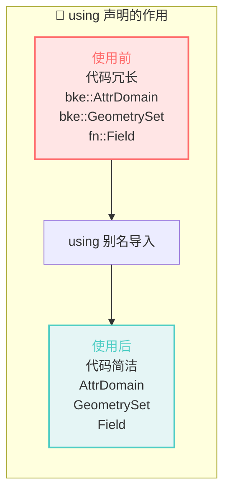
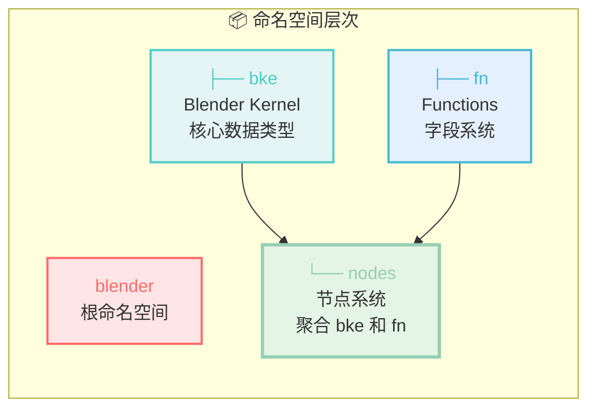
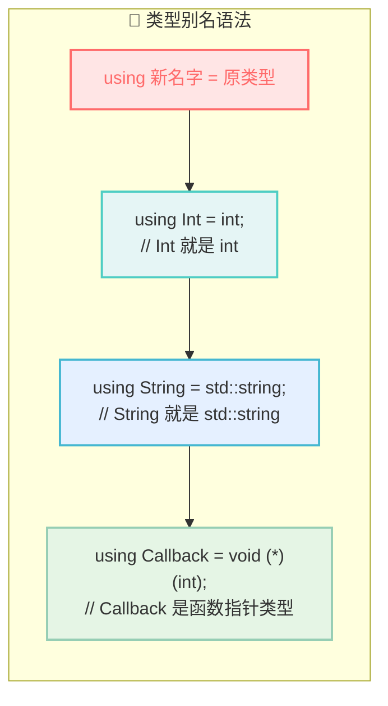
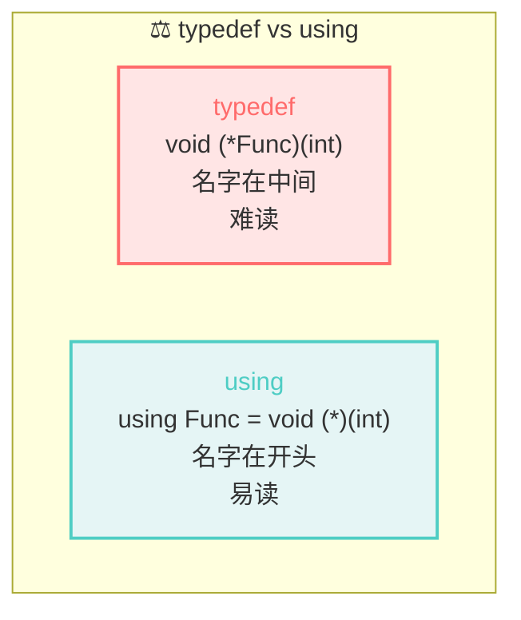
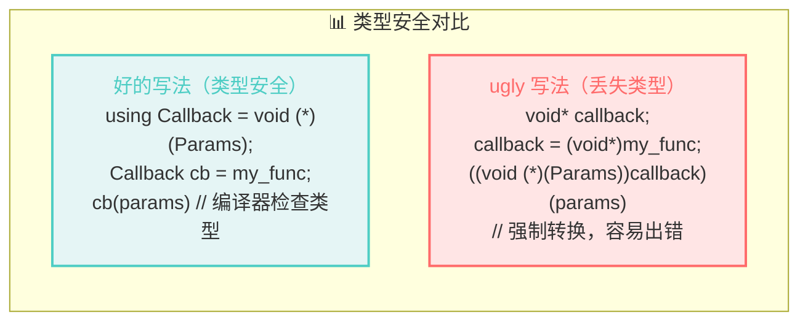

# `using` 别名详解

## 问题1：NOD_geometry_exec.hh:33-41 的 `using` 作用是什么？

```cpp
namespace blender::nodes {

using bke::AttrDomain;           // 第33行
using bke::AttributeAccessor;    // 第34行
using bke::AttributeDomainAndType;
using bke::AttributeFieldInput;
using bke::AttributeFilter;
// ... 更多 using

}
```

### 作用：简化命名空间



### 对比示例

**没有 using 时（冗长）**：
```cpp
static void node_geo_exec(blender::nodes::GeoNodeExecParams params)
{
    blender::bke::GeometrySet geometry_set = 
        params.extract_input<blender::bke::GeometrySet>("Curve"_ustr);
    
    const blender::fn::Field<bool> selection_field = 
        params.extract_input<blender::fn::Field<bool>>("Selection"_ustr);
    
    blender::bke::AttrDomain domain = blender::bke::AttrDomain::Point;
}
```

**有 using 后（简洁）**：
```cpp
static void node_geo_exec(GeoNodeExecParams params)
{
    GeometrySet geometry_set = params.extract_input<GeometrySet>("Curve"_ustr);
    const Field<bool> selection_field = params.extract_input<Field<bool>>("Selection"_ustr);
    AttrDomain domain = AttrDomain::Point;
}
```

### 为什么放在 `blender::nodes` 命名空间？



**设计意图**：
- `bke` 命名空间：核心数据类型（GeometrySet, CurvesGeometry）
- `fn` 命名空间：函数/字段系统（Field, FieldEvaluator）
- `nodes` 命名空间：节点系统，需要同时使用 bke 和 fn 的类型

通过 `using`，`nodes` 命名空间成为**聚合入口**，使用者只需要：
```cpp
#include "NOD_geometry_exec.hh"
using namespace blender::nodes;  // 导入所有常用类型
```

---

## 问题2：`using Callback = void (*)(Params);` 是什么意思？

这是 C++ 的**类型别名（Type Alias）**语法，用来给复杂的类型起一个简单的名字。

### 语法拆解



### 具体例子

```cpp
// 原始写法：函数指针变量
void (*callback)(int);  // 声明一个函数指针变量

// 使用类型别名
using Callback = void (*)(int);  // 定义一个类型别名
Callback callback;               // 使用别名声明变量（更简洁！）
```

### 函数指针类型的读法

```cpp
using NodeGeometryExecFunction = void (*)(nodes::GeoNodeExecParams params);
//     ^^^^^^^^^^^^^^^^^^^^^^^^   ^^^^  ^  ^^^^^^^^^^^^^^^^^^^^^^^^^^^^^
//            类型别名             返回   |           参数
//                                    指针标记(*)
```

**读作**：
> "`NodeGeometryExecFunction` 是一个函数指针类型，指向返回 `void`、接受 `GeoNodeExecParams` 参数的函数。"

### 对比：传统 C 语法 vs C++ 类型别名

| 方式 | 代码 | 可读性 |
|------|------|--------|
| **C 风格** | `typedef void (*Func)(int);` | 难读（名字在中间） |
| **C++ 风格** | `using Func = void (*)(int);` | 易读（名字在左边） |



---

## 问题3：`void* callback` 为什么 "ugly"？

### 上下文

```cpp
/* Use `void *` for callbacks that require C++. This is rather ugly, but works well for now. 
 * This would not be necessary if we would use bNodeSocketType and bNodeType only in C++ code.
 * However, achieving this requires quite a few changes currently. */
```

### 解释



### 为什么需要 `void*`？

**C 语言没有函数指针类型别名**，为了兼容 C 代码，有时不得不用 `void*` 存储回调：

```cpp
// C++ 代码（类型安全）
using NodeGeometryExecFunction = void (*)(GeoNodeExecParams);
NodeGeometryExecFunction callback = node_geo_exec;

// 为了兼容 C，有时需要这样写
void* callback = (void*)node_geo_exec;  // "ugly"：丢失了类型信息！
// 使用时需要强制转换
((void (*)(GeoNodeExecParams))callback)(params);
```

### "ugly" 的具体问题

| 问题 | 说明 |
|------|------|
| **丢失类型** | `void*` 可以是任何指针，编译器无法检查 |
| **强制转换** | 使用时需要 `(void (*)(Params))` 转换，容易出错 |
| **调试困难** | 调试时看到 `void*` 不知道实际是什么函数 |
| **不安全** | 可以传入错误的函数指针，运行时才崩溃 |

### 实际代码中的体现

```cpp
// BKE_node.hh 中的类型定义（类型安全 ✅）
using NodeGeometryExecFunction = void (*)(nodes::GeoNodeExecParams params);

// bNodeType 结构体中的成员（类型安全 ✅）
struct bNodeType {
    NodeGeometryExecFunction geometry_node_execute = nullptr;  // 明确的类型
};

// 使用（简洁安全）
ntype.geometry_node_execute = node_geo_exec;
ntype.geometry_node_execute(params);
```

**注释中的 `"rather ugly"` 指的是**：如果为了兼容 C 而使用 `void*`，就会丢失这种类型安全。

---

## 总结

```mermaid
mindmap
  root((using 详解))
    using 声明
      using bke::AttrDomain
      导入其他命名空间的类型
      简化代码
    类型别名
      using Callback = void (*)(int)
      给复杂类型起简单名字
      函数指针类型
    void指针问题
      丢失类型安全
      需要强制转换
      容易出错
      ugly的原因
```

### 核心要点

1. **`using bke::AttrDomain;`** = 导入 `bke` 命名空间的 `AttrDomain` 到当前命名空间，简化代码

2. **`using Callback = void (*)(Params);`** = 给函数指针类型起别名，让代码更易读

3. **`void* callback` 是 "ugly" 的** = 因为丢失了类型安全，需要强制转换，容易出错

4. **Blender 使用 `using` 类型别名** = 既保持了类型安全，又让代码简洁易读