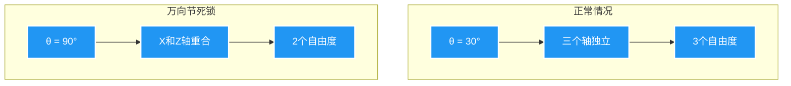
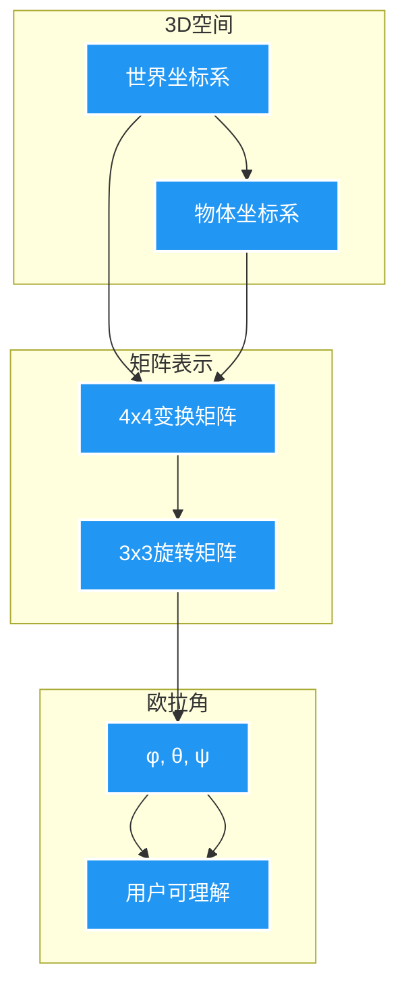
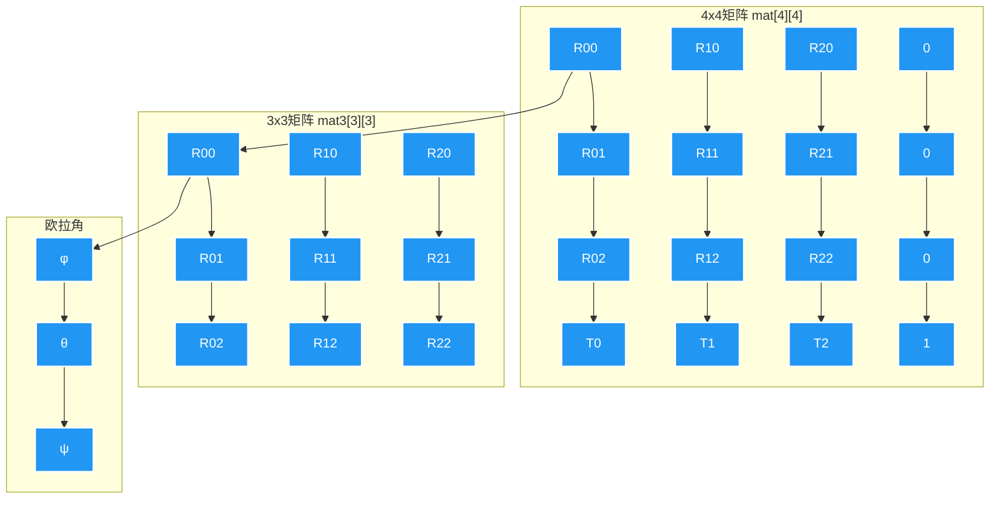

# 01_矩阵到欧拉角转换的数学原理

## 目录
- [1. 概述](#1-概述)
- [2. 核心代码分析](#2-核心代码分析)
  - [2.1. 指针类型转换](#21-指针类型转换)
  - [2.2. 断言检查](#22-断言检查)
  - [2.3. 函数调用链](#23-函数调用链)
- [3. 核心函数详解](#3-核心函数详解)
  - [3.1. mat4_to_eul](#31-mat4_to_eul)
  - [3.2. mat3_to_eul](#32-mat3_to_eul)
  - [3.3. mat3_normalized_to_eul](#33-mat3_normalized_to_eul)
  - [3.4. mat3_normalized_to_eul2](#34-mat3_normalized_to_eul2)
- [4. 辅助函数](#4-辅助函数)
  - [4.1. copy_m3_m4](#41-copy_m3_m4)
  - [4.2. normalize_m3_m3](#42-normalize_m3_m3)
- [5. 数学原理详解](#5-数学原理详解)
  - [5.1. 欧拉角定义](#51-欧拉角定义)
  - [5.2. 旋转矩阵构造](#52-旋转矩阵构造)
  - [5.3. 矩阵反推欧拉角](#53-矩阵反推欧拉角)
  - [5.4. 万向节死锁](#54-万向节死锁)
- [6. 在Gizmo中的应用](#6-gizmo中的应用)
- [7. 可视化图解](#7-可视化图解)
- [8. 总结对比表](#8-总结对比表)

---

## <span style="color:#FF6B6B; font-size:24px;">1. 概述</span>

本文档详细解释 **Blender** 中从 **4x4变换矩阵** 提取 **欧拉角** 的完整数学流程。

### <span style="background:linear-gradient(135deg,#667eea,#764ba2); color:white; padding:2px 8px; border-radius:4px;">关键问题</span>

在 `node_gizmo.cc:514-515` 中有两行关键代码：

```cpp
const float (*matrix)[4] = (const float (*)[4])value_p;  // <span style="color:#00B4D8;">行 514</span>
BLI_assert(gz_prop->type->array_length == 16);          // <span style="color:#00B4D8;">行 515</span>
```

这两行代码背后涉及复杂的 **指针类型转换** 和 **矩阵数学运算**，最终目的是将用户通过gizmo交互得到的变换矩阵转换为欧拉角。

---

## <span style="color:#FF6B6B; font-size:24px;">2. 核心代码分析</span>

### <span style="color:#FFD93D; font-size:18px;">2.1. 指针类型转换</span>

**定义位置**: `source/blender/editors/space_node/node_gizmo.cc:514`

```cpp
const float (*matrix)[4] = (const float (*)[4])value_p;
```

#### <span style="background:#4CAF50; color:white; padding:2px 6px;">语法分解</span>

| 组件 | 含义 |
|------|------|
| `value_p` | `const void *` - 通用指针，类型未知 |
| `(const float (*)[4])` | **强制类型转换** |
| `const float (*matrix)[4]` | 声明变量 `matrix` |

#### <span style="background:#2196F3; color:white; padding:2px 6px;">指针类型详解</span>

```cpp
// <span style="color:#FF9800;">错误理解</span>
float *matrix;           // 指向单个float的指针
float **matrix;          // 指向指针的指针
float *matrix[4];        // 包含4个指针的数组

// <span style="color:#4CAF50;">正确理解</span>
float (*matrix)[4];      // 指向包含4个float的数组的指针
```

#### <span style="background:#9C27B0; color:white; padding:2px 6px;">内存访问方式</span>

```cpp
// <span style="color:#00E676;">使用这种类型后，可以这样访问：</span>
matrix[0]        // → 第0行（4个float的数组）
matrix[0][0]     // → 第0行第0列元素
matrix[1][2]     // → 第1行第2列元素
matrix[2][3]     // → 第2行第3列元素
```

#### <span style="background:#E91E63; color:white; padding:2px 6px;">为什么这样设计？</span>

- **可读性**: `matrix[i][j]` 比 `*(matrix + i*4 + j)` 更直观
- **类型安全**: 编译器知道这是4x4结构，能做类型检查
- **API一致性**: Blender中矩阵都用 `[4][4]` 表示

---

### <span style="color:#FFD93D; font-size:18px;">2.2. 断言检查</span>

**定义位置**: `source/blender/editors/space_node/node_gizmo.cc:515`

```cpp
BLI_assert(gz_prop->type->array_length == 16);
```

#### <span style="background:#4CAF50; color:white; padding:2px 6px;">断言的作用</span>

```cpp
// <span style="color:#00B4D8;">wmGizmoPropertyType 结构</span>
struct wmGizmoPropertyType {
  int data_type;      // 数据类型（如 PROP_FLOAT）
  int array_length;   // <span style="color:#FF5252;">数组元素个数</span>
  // ...
};

// <span style="color:#00B4D8;">在 gizmo_node_box_mask_prop_matrix_set 中</span>
// value_p 指向的数据必须是 16 个 float
// 因为 4x4 矩阵 = 4 × 4 = 16 个元素
```

#### <span style="background:#2196F3; color:white; padding:2px 6px;">为什么必须是16？</span>

<div style="display: grid; grid-template-columns: 1fr 1fr; gap: 10px;">

<div style="border: 2px solid #4CAF50; padding: 10px; border-radius: 8px;">

**4x4矩阵结构**:
```
[ m00, m01, m02, m03 ]  ← 第0行
[ m10, m11, m12, m13 ]  ← 第1行
[ m20, m21, m22, m23 ]  ← 第2行
[ m30, m31, m32, m33 ]  ← 第3行
```

**总元素数**: 4行 × 4列 = **16个float**

</div>

<div style="border: 2px solid #FF5252; padding: 10px; border-radius: 8px;">

**如果错误配置**:

| 错误大小 | 后果 |
|---------|------|
| `array_length = 9` | 读取越界，崩溃 |
| `array_length = 3` | 读取越界，崩溃 |
| `array_length = 4` | 只读到1行，错误 |

**断言防止**: 配置错误导致的内存损坏

</div>

</div>

---

### <span style="color:#FFD93D; font-size:18px;">2.3. 函数调用链</span>

**定义位置**: `source/blender/editors/space_node/node_gizmo.cc:543`

```cpp
mat4_to_eul(eul, matrix);
```

#### <span style="background:#673AB7; color:white; padding:2px 6px;">完整调用链</span>

```mermaid
graph TD
    A[<span style="color:#FFD93D;">gizmo_node_box_mask_prop_matrix_set</span><br/><span style="font-size:10px;">node_gizmo.cc:543</span>] --> B[mat4_to_eul]
    B --> C[copy_m3_m4]
    C --> D[mat3_to_eul]
    D --> E[normalize_m3_m3]
    E --> F[mat3_normalized_to_eul]
    F --> G[mat3_normalized_to_eul2]
    G --> H[<span style="color:#4CAF50;">返回两个解</span>]
    H --> I[选择最佳解]
    I --> J[<span style="color:#00E676;">eul[3]</span>]

    classDef default fill:#2196F3,stroke:#fff,stroke-width:2px,color:white;
    classDef endnode fill:#4CAF50,stroke:#fff,stroke-width:2px,color:white;
    classDef highlight fill:#FF9800,stroke:#fff,stroke-width:2px,color:black;

    class A highlight;
    class J endnode;
```

---

## <span style="color:#FF6B6B; font-size:24px;">3. 核心函数详解</span>

### <span style="color:#00B4D8; font-size:18px;">3.1. mat4_to_eul</span>

**定义位置**: `source/blender/blenlib/intern/math_rotation_c.cc:1451-1456`

```cpp
void mat4_to_eul(float eul[3], const float mat[4][4])
{
  float mat3[3][3];
  copy_m3_m4(mat3, mat);      // <span style="color:#FF9800;">提取3x3部分</span>
  mat3_to_eul(eul, mat3);     // <span style="color:#FF9800;">转3x3处理</span>
}
```

#### <span style="background:#4CAF50; color:white; padding:2px 6px;">函数目的</span>

将 **4x4齐次变换矩阵** 转换为 **欧拉角**。

#### <span style="background:#2196F3; color:white; padding:2px 6px;">为什么只取3x3？</span>

4x4矩阵结构：
```
[  R(3x3)  |  T  ]
[----------|-----]
[  0 0 0   |  1  ]
```

- **R(3x3)**: 旋转 + 缩放
- **T**: 平移向量
- **欧拉角只描述旋转**，平移被忽略

#### <span style="background:#E91E63; color:white; padding:2px 6px;">执行过程</span>

```cpp
// <span style="color:#00E676;">输入: mat[4][4] = 4x4矩阵</span>
// <span style="color:#00E676;">输出: eul[3] = [φ, θ, ψ]</span>

// <span style="color:#FF5252;">步骤1:</span> copy_m3_m4(mat3, mat)
//   复制前3行前3列
//   mat3[0][0] = mat[0][0]
//   mat3[0][1] = mat[0][1]
//   ...
//   mat3[2][2] = mat[2][2]

// <span style="color:#FF5252;">步骤2:</span> mat3_to_eul(eul, mat3)
//   调用3x3矩阵处理函数
```

---

### <span style="color:#00B4D8; font-size:18px;">3.2. mat3_to_eul</span>

**定义位置**: `source/blender/blenlib/intern/math_rotation_c.cc:1438-1443`

```cpp
void mat3_to_eul(float eul[3], const float mat[3][3])
{
  float unit_mat[3][3];
  normalize_m3_m3(unit_mat, mat);  // <span style="color:#FF9800;">归一化</span>
  mat3_normalized_to_eul(eul, unit_mat);
}
```

#### <span style="background:#4CAF50; color:white; padding:2px 6px;">函数目的</span>

将 **3x3矩阵** 转换为欧拉角，**先归一化去除缩放**。

#### <span style="background:#2196F3; color:white; padding:2px 6px;">为什么要归一化？</span>

<div style="display: grid; grid-template-columns: 1fr 1fr; gap: 10px;">

<div style="border: 2px solid #4CAF50; padding: 10px; border-radius: 8px;">

**纯旋转矩阵** (正交):
```
[ cosθ  -sinθ  0 ]
[ sinθ   cosθ  0 ]
[  0      0    1 ]
```

- 行向量长度 = 1
- 行向量互相垂直
- 行列式 = 1

</div>

<div style="border: 2px solid #FF5252; padding: 10px; border-radius: 8px;">

**含缩放的矩阵**:
```
[ 2*cosθ  -2*sinθ  0 ]
[ 3*sinθ   3*cosθ  0 ]
[   0       0      1 ]
```

- 行向量长度 ≠ 1
- 包含缩放因子
- 欧拉角无法直接提取

</div>

</div>

#### <span style="background:#9C27B0; color:white; padding:2px 6px;">归一化过程</span>

```cpp
// <span style="color:#00E676;">normalize_m3_m3 的实现</span>
void normalize_m3_m3(float R[3][3], const float M[3][3])
{
  for (int i = 0; i < 3; i++) {
    // <span style="color:#FF9800;">对每一行进行归一化</span>
    normalize_v3_v3(R[i], M[i]);
  }
}

// <span style="color:#00E676;">normalize_v3_v3 的作用</span>
// 输入: v = [x, y, z]
// 输出: v_normalized = [x/len, y/len, z/len]
// 其中 len = sqrt(x² + y² + z²)
```

---

### <span style="color:#00B4D8; font-size:18px;">3.3. mat3_normalized_to_eul</span>

**定义位置**: `source/blender/blenlib/intern/math_rotation_c.cc:1422-1437`

```cpp
void mat3_normalized_to_eul(float eul[3], const float mat[3][3])
{
  float eul1[3], eul2[3];

  mat3_normalized_to_eul2(mat, eul1, eul2);  // <span style="color:#FF9800;">计算两个解</span>

  // <span style="color:#FF5252;">选择绝对值和最小的解</span>
  if (fabsf(eul1[0]) + fabsf(eul1[1]) + fabsf(eul1[2]) >
      fabsf(eul2[0]) + fabsf(eul2[1]) + fabsf(eul2[2]))
  {
    copy_v3_v3(eul, eul2);
  }
  else {
    copy_v3_v3(eul, eul1);
  }
}
```

#### <span style="background:#4CAF50; color:white; padding:2px 6px;">函数目的</span>

从 **归一化3x3矩阵** 提取欧拉角，**选择最佳表示**。

#### <span style="background:#2196F3; color:white; padding:2px 6px;">为什么有两个解？</span>

**万向节死锁** 导致的多义性：

```
同一个旋转矩阵 → 多个欧拉角表示
```

**示例**:
```
矩阵 M = [0, -1, 0; 1, 0, 0; 0, 0, 1]

解1: eul1 = [90°, 0°, 90°]
解2: eul2 = [-90°, 180°, -90°]
```

#### <span style="background:#E91E63; color:white; padding:2px 6px;">选择标准</span>

```cpp
// <span style="color:#00E676;">选择绝对值和最小的解</span>
sum1 = |eul1[0]| + |eul1[1]| + |eul1[2]|
sum2 = |eul2[0]| + |eul2[1]| + |eul2[2]|

if (sum1 > sum2) 选择 eul2
else             选择 eul1
```

**为什么？** 最简洁的表示通常最直观。

---

### <span style="color:#00B4D8; font-size:18px;">3.4. mat3_normalized_to_eul2</span>

**定义位置**: `source/blender/blenlib/intern/math_rotation_c.cc:1398-1420`

```cpp
static void mat3_normalized_to_eul2(const float mat[3][3],
                                    float eul1[3], float eul2[3])
{
  const float cy = hypotf(mat[0][0], mat[0][1]);

  BLI_ASSERT_UNIT_M3(mat);  // <span style="color:#FF5252;">断言：必须是单位矩阵</span>

  if (cy > float(EULER_HYPOT_EPSILON)) {
    // <span style="color:#4CAF50;">情况1: 正常旋转（非死锁）</span>
    eul1[0] = atan2f(mat[1][2], mat[2][2]);
    eul1[1] = atan2f(-mat[0][2], cy);
    eul1[2] = atan2f(mat[0][1], mat[0][0]);

    eul2[0] = atan2f(-mat[1][2], -mat[2][2]);
    eul2[1] = atan2f(-mat[0][2], -cy);
    eul2[2] = atan2f(-mat[0][1], -mat[0][0]);
  }
  else {
    // <span style="color:#FF5252;">情况2: 万向节死锁</span>
    eul1[0] = atan2f(-mat[2][1], mat[1][1]);
    eul1[1] = atan2f(-mat[0][2], cy);
    eul1[2] = 0.0f;

    copy_v3_v3(eul2, eul1);
  }
}
```

#### <span style="background:#4CAF50; color:white; padding:2px 6px;">核心算法</span>

这是整个转换的 **数学核心**，下面将详细解释。

---

## <span style="color:#FF6B6B; font-size:24px;">4. 辅助函数</span>

### <span style="color:#00E676; font-size:18px;">4.1. copy_m3_m4</span>

**定义位置**: `source/blender/blenlib/intern/math_matrix_c.cc:89-102`

```cpp
void copy_m3_m4(float m1[3][3], const float m2[4][4])
{
  m1[0][0] = m2[0][0]; m1[0][1] = m2[0][1]; m1[0][2] = m2[0][2];
  m1[1][0] = m2[1][0]; m1[1][1] = m2[1][1]; m1[1][2] = m2[1][2];
  m1[2][0] = m2[2][0]; m1[2][1] = m2[2][1]; m1[2][2] = m2[2][2];
}
```

**作用**: 提取4x4矩阵的左上角3x3子矩阵。

---

### <span style="color:#00E676; font-size:18px;">4.2. normalize_m3_m3</span>

**定义位置**: `source/blender/blenlib/intern/math_matrix_c.cc:1736-1742`

```cpp
void normalize_m3_m3(float R[3][3], const float M[3][3])
{
  int i;
  for (i = 0; i < 3; i++) {
    normalize_v3_v3(R[i], M[i]);  // <span style="color:#FF9800;">归一化每一行</span>
  }
}
```

**作用**: 将3x3矩阵的每一行归一化，去除缩放。

---

## <span style="color:#FF6B6B; font-size:24px;">5. 数学原理详解</span>

### <span style="color:#FFD93D; font-size:18px;">5.1. 欧拉角定义</span>

#### <span style="background:#2196F3; color:white; padding:2px 6px;">XYZ顺序的欧拉角</span>

欧拉角用 **三个角度** 描述3D旋转，按特定顺序绕轴旋转：


#### <span style="background:#9C27B0; color:white; padding:2px 6px;">数学表示</span>

```latex
\text{欧拉角}: \quad \mathbf{eul} = \begin{bmatrix} \phi \\ \theta \\ \psi \end{bmatrix}
```

其中：
- <span style="color:#00E676;">φ (phi)</span>: 绕X轴旋转角
- <span style="color:#00B4D8;">θ (theta)</span>: 绕Y轴旋转角
- <span style="color:#FF5252;">ψ (psi)</span>: 绕Z轴旋转角

---

### <span style="color:#FFD93D; font-size:18px;">5.2. 旋转矩阵构造</span>

#### <span style="background:#4CAF50; color:white; padding:2px 6px;">基本旋转矩阵</span>

**绕X轴旋转 φ**:
```latex
R_x(\phi) = \begin{bmatrix}
1 & 0 & 0 \\
0 & \cos\phi & -\sin\phi \\
0 & \sin\phi & \cos\phi
\end{bmatrix}
```

**绕Y轴旋转 θ**:
```latex
R_y(\theta) = \begin{bmatrix}
\cos\theta & 0 & \sin\theta \\
0 & 1 & 0 \\
-\sin\theta & 0 & \cos\theta
\end{bmatrix}
```

**绕Z轴旋转 ψ**:
```latex
R_z(\psi) = \begin{bmatrix}
\cos\psi & -\sin\psi & 0 \\
\sin\psi & \cos\psi & 0 \\
0 & 0 & 1
\end{bmatrix}
```

#### <span style="background:#2196F3; color:white; padding:2px 6px;">XYZ顺序的复合矩阵</span>

```latex
R = R_z(\psi) \cdot R_y(\theta) \cdot R_x(\phi)
```

展开后：
```latex
R = \begin{bmatrix}
\cos\theta\cos\psi & -\cos\theta\sin\psi & \sin\theta \\
\sin\phi\sin\theta\cos\psi + \cos\phi\sin\psi & -\sin\phi\sin\theta\sin\psi + \cos\phi\cos\psi & -\sin\phi\cos\theta \\
-\cos\phi\sin\theta\cos\psi + \sin\phi\sin\psi & \cos\phi\sin\theta\sin\psi + \sin\phi\cos\psi & \cos\phi\cos\theta
\end{bmatrix}
```

#### <span style="background:#E91E63; color:white; padding:2px 6px;">矩阵元素与欧拉角的关系</span>

| 矩阵元素 | 表达式 | 用途 |
|---------|--------|------|
| `R[0][0]` | `cosθ·cosψ` | 计算 ψ |
| `R[0][1]` | `-cosθ·sinψ` | 计算 ψ |
| `R[0][2]` | `sinθ` | 计算 θ |
| `R[1][2]` | `-sinφ·cosθ` | 计算 φ |
| `R[2][2]` | `cosφ·cosθ` | 计算 φ |

---

### <span style="color:#FFD93D; font-size:18px;">5.3. 矩阵反推欧拉角</span>

#### <span style="background:#4CAF50; color:white; padding:2px 6px;">步骤1: 计算 cy</span>

```cpp
const float cy = hypotf(mat[0][0], mat[0][1]);
```

**数学含义**:
```latex
cy = \sqrt{mat[0][0]^2 + mat[0][1]^2}
   = \sqrt{(\cos\theta\cos\psi)^2 + (-\cos\theta\sin\psi)^2}
   = \sqrt{\cos^2\theta(\cos^2\psi + \sin^2\psi)}
   = \sqrt{\cos^2\theta}
   = |\cos\theta|
```

**作用**: 判断是否接近万向节死锁。

---

#### <span style="background:#2196F3; color:white; padding:2px 6px;">步骤2: 正常情况 (cy > ε)</span>

**计算 θ (eul[1])**:
```cpp
eul1[1] = atan2f(-mat[0][2], cy);
```

**推导**:
```latex
\text{已知: } mat[0][2] = \sin\theta, \quad cy = |\cos\theta|

\text{则: } \theta = \operatorname{atan2}(-\sin\theta, |\cos\theta|)
```

**计算 ψ (eul[2])**:
```cpp
eul1[2] = atan2f(mat[0][1], mat[0][0]);
```

**推导**:
```latex
\text{已知: }
\begin{cases}
mat[0][0] = \cos\theta\cos\psi \\
mat[0][1] = -\cos\theta\sin\psi
\end{cases}

\text{则: } \psi = \operatorname{atan2}(-\cos\theta\sin\psi, \cos\theta\cos\psi)
           = \operatorname{atan2}(-\sin\psi, \cos\psi)
```

**计算 φ (eul[0])**:
```cpp
eul1[0] = atan2f(mat[1][2], mat[2][2]);
```

**推导**:
```latex
\text{已知: }
\begin{cases}
mat[1][2] = -\sin\phi\cos\theta \\
mat[2][2] = \cos\phi\cos\theta
\end{cases}

\text{则: } \phi = \operatorname{atan2}(-\sin\phi\cos\theta, \cos\phi\cos\theta)
           = \operatorname{atan2}(-\sin\phi, \cos\phi)
```

---

#### <span style="background:#9C27B0; color:white; padding:2px 6px;">步骤3: 万向节死锁 (cy ≈ 0)</span>

**条件**: `cosθ ≈ 0` → `θ ≈ ±90°`

**后果**: X轴和Z轴重合，丢失一个自由度。

**处理**:
```cpp
eul1[0] = atan2f(-mat[2][1], mat[1][1]);
eul1[1] = atan2f(-mat[0][2], cy);  // cy ≈ 0
eul1[2] = 0.0f;
```

**推导**:
当 `θ = 90°` 时：
```latex
\sin\theta = 1, \quad \cos\theta = 0

R = \begin{bmatrix}
0 & 0 & 1 \\
\sin(\phi+\psi) & \cos(\phi+\psi) & 0 \\
-\cos(\phi+\psi) & \sin(\phi+\psi) & 0
\end{bmatrix}
```

只能求出 `φ + ψ` 的和，无法区分。因此设 `ψ = 0`，只返回 `φ`。

---

### <span style="color:#FFD93D; font-size:18px;">5.4. 万向节死锁</span>

#### <span style="background:#FF5252; color:white; padding:2px 6px;">什么是万向节死锁？</span>



#### <span style="background:#4CAF50; color:white; padding:2px 6px;">数学解释</span>

当 `θ = 90°` 时：
```latex
R_y(90°) = \begin{bmatrix}
0 & 0 & 1 \\
0 & 1 & 0 \\
-1 & 0 & 0
\end{bmatrix}

R = R_z(\psi) \cdot R_y(90°) \cdot R_x(\phi)
  = R_z(\psi) \cdot \begin{bmatrix}
    0 & 0 & 1 \\
    0 & 1 & 0 \\
    -1 & 0 & 0
  \end{bmatrix} \cdot R_x(\phi)
```

**结果**: X和Z旋转的效果相同，无法区分。

#### <span style="background:#E91E63; color:white; padding:2px 6px;">检测方法</span>

```cpp
if (cy > float(EULER_HYPOT_EPSILON)) {
  // 正常
} else {
  // 万向节死锁
}
```

其中 `EULER_HYPOT_EPSILON = 0.0000375`。

---

## <span style="color:#FF6B6B; font-size:24px;">6. Gizmo中的应用</span>

### <span style="color:#00B4D8; font-size:18px;">完整流程</span>

**定义位置**: `source/blender/editors/space_node/node_gizmo.cc:510-560`

```cpp
static void gizmo_node_box_mask_prop_matrix_set(
    const wmGizmo *gz,
    wmGizmoProperty *gz_prop,
    const void *value_p)
{
  // <span style="color:#FF9800;">步骤1: 类型转换</span>
  const float (*matrix)[4] = (const float (*)[4])value_p;
  BLI_assert(gz_prop->type->array_length == 16);

  // <span style="color:#FF9800;">步骤2: 提取位置、旋转、缩放</span>
  float loc[3], rot[3][3], size[3];
  mat4_to_loc_rot_size(loc, rot, size, matrix);

  // <span style="color:#FF9800;">步骤3: 提取欧拉角</span>
  float eul[3];
  if (size[0] != 0 and size[1] != 0) {
    mat4_to_eul(eul, matrix);  // <span style="color:#00E676;">调用我们的函数</span>
    rotation_input->...->value = eul[2];  // <span style="color:#00E676;">只取Z轴旋转</span>
  }

  // <span style="color:#FF9800;">步骤4: 更新节点参数</span>
  // ... 更新位置、大小等
}
```

### <span style="background:#4CAF50; color:white; padding:2px 6px;">为什么只用 eul[2]？</span>

<div style="border: 2px solid #4CAF50; padding: 15px; border-radius: 8px; background: #f0f8ff;">

**场景**: 2D矩形遮罩节点

**需求**:
- 位置 (x, y)
- 大小 (width, height)
- **旋转** (绕Z轴)

**结论**:
- eul[0] (X旋转) → 无意义（2D平面）
- eul[1] (Y旋转) → 无意义（2D平面）
- <span style="background:#FFD93D; color:black; padding:2px 6px;">eul[2] (Z旋转) → 平面内旋转</span>

</div>

---

## <span style="color:#FF6B6B; font-size:24px;">7. 可视化图解</span>

### <span style="color:#FFD93D; font-size:18px;">7.1. 坐标系变换</span>



### <span style="color:#FFD93D; font-size:18px;">7.2. 矩阵元素分布</span>



---

## <span style="color:#FF6B6B; font-size:24px;">8. 总结对比表</span>

### <span style="color:#FFD93D; font-size:18px;">8.1. 函数功能对比</span>

| 函数 | 输入 | 输出 | 主要作用 | 位置 |
|------|------|------|----------|------|
| `mat4_to_eul` | 4x4矩阵 | 3个角度 | 提取3x3并转换 | `math_rotation_c.cc:1451` |
| `mat3_to_eul` | 3x3矩阵 | 3个角度 | 归一化后转换 | `math_rotation_c.cc:1438` |
| `mat3_normalized_to_eul` | 归一化3x3 | 3个角度 | 选择最佳解 | `math_rotation_c.cc:1422` |
| `mat3_normalized_to_eul2` | 归一化3x3 | 2组解 | 核心计算 | `math_rotation_c.cc:1398` |

### <span style="color:#FFD93D; font-size:18px;">8.2. 数学概念对比</span>

| 概念 | 表示法 | 优点 | 缺点 |
|------|--------|------|------|
| **欧拉角** | `[φ, θ, ψ]` | 直观、易理解 | 万向节死锁 |
| **旋转矩阵** | `3x3` | 无死锁、可插值 | 不直观、9个参数 |
| **四元数** | `[w, x, y, z]` | 无死锁、可插值 | 不直观 |
| **轴角** | `axis × angle` | 直观 | 需要4个参数 |

### <span style="color:#FFD93D; font-size:18px;">8.3. 代码位置速查</span>

<div style="background:#f0f8ff; border-left: 4px solid #2196F3; padding: 10px;">

**Gizmo相关**:
- `node_gizmo.cc:514-515` → 类型转换 + 断言
- `node_gizmo.cc:543` → 调用 `mat4_to_eul`

**数学函数**:
- `math_rotation_c.cc:1451-1456` → `mat4_to_eul`
- `math_rotation_c.cc:1438-1443` → `mat3_to_eul`
- `math_rotation_c.cc:1422-1437` → `mat3_normalized_to_eul`
- `math_rotation_c.cc:1398-1420` → `mat3_normalized_to_eul2`

**辅助函数**:
- `math_matrix_c.cc:89-102` → `copy_m3_m4`
- `math_matrix_c.cc:1736-1742` → `normalize_m3_m3`

</div>

---

## <span style="color:#4CAF50; font-size:20px;">附录: 关键数学公式</span>

### <span style="background:#2196F3; color:white; padding:2px 6px;">atan2 函数</span>

```latex
\operatorname{atan2}(y, x) =
\begin{cases}
\arctan(\frac{y}{x}) & x > 0 \\
\arctan(\frac{y}{x}) + \pi & x < 0, y \ge 0 \\
\arctan(\frac{y}{x}) - \pi & x < 0, y < 0 \\
+\frac{\pi}{2} & x = 0, y > 0 \\
-\frac{\pi}{2} & x = 0, y < 0 \\
\text{undefined} & x = 0, y = 0
\end{cases}
```

**范围**: `[-π, π]` 或 `[-180°, 180°]`

### <span style="background:#2196F3; color:white; padding:2px 6px;">hypot 函数</span>

```latex
\operatorname{hypot}(x, y) = \sqrt{x^2 + y^2}
```

**优点**: 数值稳定，避免溢出

### <span style="background:#2196F3; color:white; padding:2px 6px;">归一化</span>

```latex
\hat{\mathbf{v}} = \frac{\mathbf{v}}{\|\mathbf{v}\|} = \frac{[x, y, z]}{\sqrt{x^2 + y^2 + z^2}}
```

---

**文档结束**
<span style="color:#999; font-size:12px;">生成时间: 2025-12-25 | 使用模板: .vscode/Markdown文档模板.md</span>
