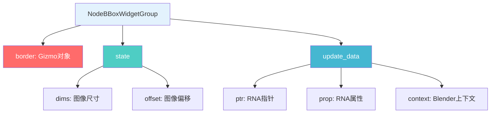
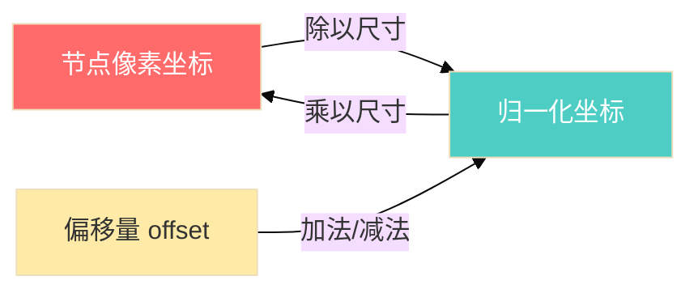
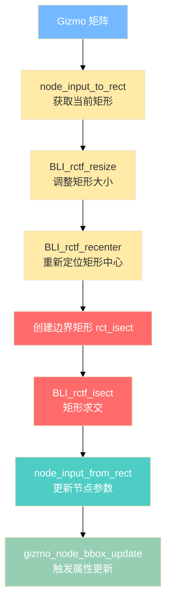
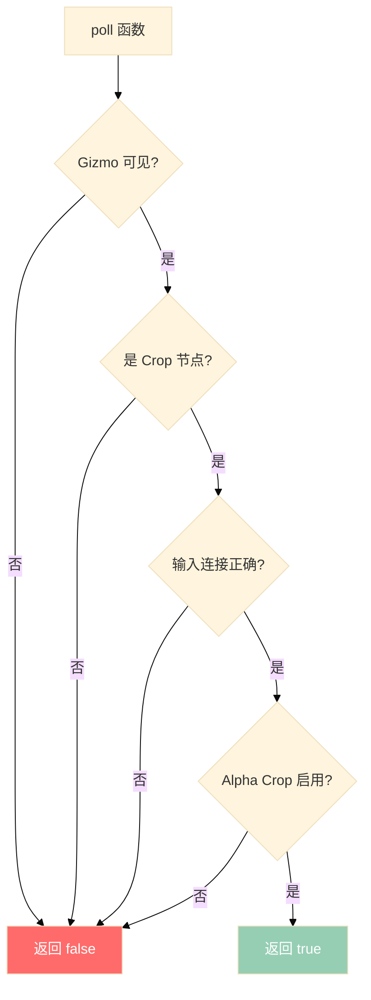
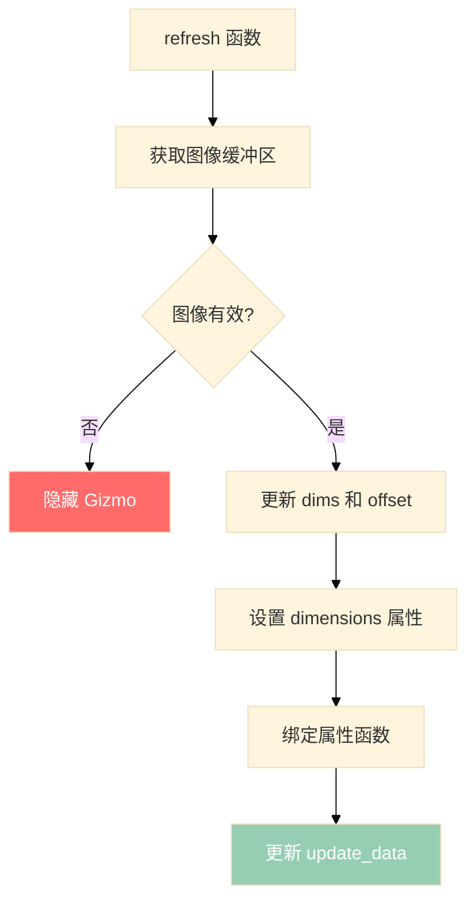

# Blender 合成器 Crop Gizmo 完全解析

## 目录
- [1. 概述](#1-概述)
- [2. 核心结构体](#2-核心结构体)
  - [2.1. NodeBBoxWidgetGroup](#21-nodebboxwidgetgroup)
  - [2.2. rctf 矩形结构](#22-rctf-矩形结构)
- [3. 坐标系统详解](#3-坐标系统详解)
  - [3.1. 节点像素坐标](#31-节点像素坐标)
  - [3.2. 归一化坐标](#32-归一化坐标)
  - [3.3. 坐标转换](#33-坐标转换)
- [4. 核心函数详解](#4-核心函数详解)
  - [4.1. node_input_to_rect](#41-node_input_to_rect)
  - [4.2. node_input_from_rect](#42-node_input_from_rect)
  - [4.3. gizmo_node_crop_prop_matrix_get](#43-gizmo_node_crop_prop_matrix_get)
  - [4.4. gizmo_node_crop_prop_matrix_set](#44-gizmo_node_crop_prop_matrix_set)
- [5. 数学运算详解](#5-数学运算详解)
  - [5.1. 加法运算](#51-加法运算)
  - [5.2. 减法运算](#52-减法运算)
  - [5.3. 乘法运算](#53-乘法运算)
  - [5.4. 除法运算](#54-除法运算)
- [6. 矩形几何运算](#6-矩形几何运算)
  - [6.1. 矩形尺寸计算](#61-矩形尺寸计算)
  - [6.2. 矩形中心计算](#62-矩形中心计算)
  - [6.3. 矩形重定位](#63-矩形重定位)
  - [6.4. 矩形调整大小](#64-矩形调整大小)
  - [6.5. 矩形求交](#65-矩形求交)
- [7. Gizmo 生命周期](#7-gizmo-生命周期)
  - [7.1. poll 函数](#71-poll-函数)
  - [7.2. setup 函数](#72-setup-函数)
  - [7.3. refresh 函数](#73-refresh-函数)
  - [7.4. draw_prepare 函数](#74-draw_prepare-函数)
- [8. 完整工作流程](#8-完整工作流程)
- [9. 数学推导示例](#9-数学推导示例)

---

## 1. 概述

<span style="background-color:#FF6B6B; color:white; padding:2px 6px; border-radius:3px;">Crop Gizmo</span> 是 Blender 合成器中用于交互式裁剪图像的工具。它允许用户通过拖动边框来调整裁剪区域的 <span style="background-color:#4ECDC4; color:white; padding:2px 6px; border-radius:3px;">位置</span>、<span style="background-color:#45B7D1; color:white; padding:2px 6px; border-radius:3px;">宽度</span> 和 <span style="background-color:#96CEB4; color:white; padding:2px 6px; border-radius:3px;">高度</span>。

**定义位置**: `source/blender/editors/space_node/node_gizmo.cc:220-474`

### 主要功能

1. <span style="background-color:#FFEAA7; color:#333; padding:2px 6px; border-radius:3px;">双向数据绑定</span>：节点参数 ↔ Gizmo 状态
2. <span style="background-color:#DDA0DD; color:white; padding:2px 6px; border-radius:3px;">坐标转换</span>：像素坐标 ↔ 归一化坐标
3. <span style="background-color:#74B9FF; color:white; padding:2px 6px; border-radius:3px;">边界约束</span>：防止裁剪区域超出图像边界

---

## 2. 核心结构体

### 2.1. NodeBBoxWidgetGroup

**定义位置**: `source/blender/editors/space_node/node_gizmo.cc:224-237`

```c
struct NodeBBoxWidgetGroup {
  wmGizmo *border;

  struct {
    float2 dims;   // 图像尺寸 (width, height)
    float2 offset; // 图像偏移 (x, y)
  } state;

  struct {
    PointerRNA ptr;
    PropertyRNA *prop;
    bContext *context;
  } update_data;
};
```

#### 结构体成员说明

| 成员 | 类型 | 说明 |
|------|------|------|
| `border` | `wmGizmo*` | 边界框 Gizmo 对象 |
| `state.dims` | `float2` | 图像尺寸，单位：像素 |
| `state.offset` | `float2` | 图像偏移量，单位：像素 |
| `update_data.ptr` | `PointerRNA` | RNA 指针，用于属性更新 |
| `update_data.prop` | `PropertyRNA*` | RNA 属性指针 |
| `update_data.context` | `bContext*` | Blender 上下文 |



### 2.2. rctf 矩形结构

<span style="background-color:#96CEB4; color:white; padding:2px 6px; border-radius:3px;">rctf</span> 是 Blender 中用于表示浮点矩形的结构体。

**定义位置**: `source/blender/blenlib/BLI_rect.h`

```c
typedef struct rctf {
  float xmin, xmax;
  float ymin, ymax;
} rctf;
```

#### 矩形表示

```
      ymax ────────────────
           │              │
           │    矩形      │
           │              │
      ymin ────────────────
           │              │
      xmin             xmax
```

#### 矩形几何属性

$$ \text{宽度} = xmax - xmin $$

$$ \text{高度} = ymax - ymin $$

$$ \text{中心 X} = \frac{xmin + xmax}{2} $$

$$ \text{中心 Y} = \frac{ymin + ymax}{2} $$

---

## 3. 坐标系统详解

Crop Gizmo 涉及 <span style="background-color:#FF7675; color:white; padding:2px 6px; border-radius:3px;">三种坐标系统</span>：

### 3.1. 节点像素坐标

<span style="background-color:#FF6B6B; color:white; padding:2px 6px; border-radius:3px;">节点参数</span>中的坐标，单位是 <span style="background-color:#FFEAA7; color:#333; padding:2px 6px; border-radius:3px;">像素</span>。

Crop 节点的四个输入参数：

| 参数 | 含义 | 范围 |
|------|------|------|
| `X` | 左上角 X 坐标 | `[0, image_width]` |
| `Y` | 左上角 Y 坐标 | `[0, image_height]` |
| `Width` | 宽度 | `[0, image_width - X]` |
| `Height` | 高度 | `[0, image_height - Y]` |

### 3.2. 归一化坐标

<span style="background-color:#74B9FF; color:white; padding:2px 6px; border-radius:3px;">Gizmo 内部</span>使用的坐标，范围是 <span style="background-color:#4ECDC4; color:white; padding:2px 6px; border-radius:3px;">[0, 1]</span>。

$$ x_{\text{normalized}} = \frac{x_{\text{pixel}}}{\text{image\_width}} $$

$$ y_{\text{normalized}} = \frac{y_{\text{pixel}}}{\text{image\_height}} $$

### 3.3. 坐标转换



#### 归一化公式

对于矩形边界：

$$ \begin{aligned}
\text{rct.xmin} &= \frac{X + \text{offset.x}}{\text{dims.x}} \\
\text{rct.xmax} &= \frac{X + \text{Width} + \text{offset.x}}{\text{dims.x}} \\
\text{rct.ymin} &= \frac{Y + \text{offset.y}}{\text{dims.y}} \\
\text{rct.ymax} &= \frac{Y + \text{Height} + \text{offset.y}}{\text{dims.y}}
\end{aligned} $$

其中：
- $(X, Y)$ 是裁剪区域的左上角
- $(\text{Width}, \text{Height})$ 是裁剪区域的尺寸
- $(\text{offset.x}, \text{offset.y})$ 是图像的偏移量
- $(\text{dims.x}, \text{dims.y})$ 是图像的尺寸

---

## 4. 核心函数详解

### 4.1. node_input_to_rect

**定义位置**: `source/blender/editors/space_node/node_gizmo.cc:245-275`

```c
static void node_input_to_rect(const bNode *node,
                               const float2 &dims,
                               const float2 offset,
                               rctf *r_rect)
{

  const bNodeSocket *x_input = bke::node_find_socket(*node, SOCK_IN, "X");
  PointerRNA x_input_rna_pointer = RNA_pointer_create_discrete(
      nullptr, &RNA_NodeSocket, const_cast<bNodeSocket *>(x_input));
  const float xmin = float(RNA_int_get(&x_input_rna_pointer, "default_value"));

  const bNodeSocket *y_input = bke::node_find_socket(*node, SOCK_IN, "Y");
  PointerRNA y_input_rna_pointer = RNA_pointer_create_discrete(
      nullptr, &RNA_NodeSocket, const_cast<bNodeSocket *>(y_input));
  const float ymin = float(RNA_int_get(&y_input_rna_pointer, "default_value"));

  const bNodeSocket *width_input = bke::node_find_socket(*node, SOCK_IN, "Width");
  PointerRNA width_input_rna_pointer = RNA_pointer_create_discrete(
      nullptr, &RNA_NodeSocket, const_cast<bNodeSocket *>(width_input));
  const float width = float(RNA_int_get(&width_input_rna_pointer, "default_value"));

  const bNodeSocket *height_input = bke::node_find_socket(*node, SOCK_IN, "Height");
  PointerRNA height_input_rna_pointer = RNA_pointer_create_discrete(
      nullptr, &RNA_NodeSocket, const_cast<bNodeSocket *>(height_input));
  const float height = float(RNA_int_get(&height_input_rna_pointer, "default_value"));

  r_rect->xmin = (xmin + offset.x) / dims.x;
  r_rect->xmax = (xmin + width + offset.x) / dims.x;
  r_rect->ymin = (ymin + offset.y) / dims.y;
  r_rect->ymax = (ymin + height + offset.y) / dims.y;
}
```

#### 功能说明

将 <span style="background-color:#FF7675; color:white; padding:2px 6px; border-radius:3px;">Crop 节点的像素参数</span>转换为 <span style="background-color:#4ECDC4; color:white; padding:2px 6px; border-radius:3px;">归一化矩形</span>。

#### 执行流程

```mermaid
%%{init: {'theme': 'base'}}%%
flowchart TD
    A[获取 X 输入] --> A1[xmin = RNA_int_get]
    B[获取 Y 输入] --> B1[ymin = RNA_int_get]
    C[获取 Width 输入] --> C1[width = RNA_int_get]
    D[获取 Height 输入] --> D1[height = RNA_int_get]

    A1 --> E[计算归一化坐标]
    B1 --> E
    C1 --> E
    D1 --> E

    E --> F[rct.xmin = (xmin + offset.x) / dims.x]
    E --> G[rct.xmax = (xmin + width + offset.x) / dims.x]
    E --> H[rct.ymin = (ymin + offset.y) / dims.y]
    E --> I[rct.ymax = (ymin + height + offset.y) / dims.y]

    style A fill:#FFEAA7
    style B fill:#FFEAA7
    style C fill:#FFEAA7
    style D fill:#FFEAA7
    style E fill:#4ECDC4,color:#fff
    style F fill:#96CEB4,color:#fff
    style G fill:#96CEB4,color:#fff
    style H fill:#96CEB4,color:#fff
    style I fill:#96CEB4,color:#fff
```

#### 数学推导

假设图像尺寸为 $(1920, 1080)$，裁剪区域为：
- $X = 100$
- $Y = 50$
- $\text{Width} = 640$
- $\text{Height} = 480$
- $\text{offset} = (0, 0)$

归一化坐标计算：

$$ \begin{aligned}
\text{rct.xmin} &= \frac{100 + 0}{1920} = 0.0521 \\
\text{rct.xmax} &= \frac{100 + 640 + 0}{1920} = 0.3854 \\
\text{rct.ymin} &= \frac{50 + 0}{1080} = 0.0463 \\
\text{rct.ymax} &= \frac{50 + 480 + 0}{1080} = 0.4907
\end{aligned} $$

---

### 4.2. node_input_from_rect

**定义位置**: `source/blender/editors/space_node/node_gizmo.cc:277-307`

```c
static void node_input_from_rect(bNode *node,
                                 const rctf *rect,
                                 const float2 &dims,
                                 const float2 offset)
{
  bNodeSocket *x_input = bke::node_find_socket(*node, SOCK_IN, "X");
  PointerRNA x_input_rna_pointer = RNA_pointer_create_discrete(
      nullptr, &RNA_NodeSocket, const_cast<bNodeSocket *>(x_input));

  bNodeSocket *y_input = bke::node_find_socket(*node, SOCK_IN, "Y");
  PointerRNA y_input_rna_pointer = RNA_pointer_create_discrete(
      nullptr, &RNA_NodeSocket, const_cast<bNodeSocket *>(y_input));

  bNodeSocket *width_input = bke::node_find_socket(*node, SOCK_IN, "Width");
  PointerRNA width_input_rna_pointer = RNA_pointer_create_discrete(
      nullptr, &RNA_NodeSocket, const_cast<bNodeSocket *>(width_input));

  bNodeSocket *height_input = bke::node_find_socket(*node, SOCK_IN, "Height");
  PointerRNA height_input_rna_pointer = RNA_pointer_create_discrete(
      nullptr, &RNA_NodeSocket, const_cast<bNodeSocket *>(height_input));

  const float xmin = rect->xmin * dims.x - offset.x;
  const float width = rect->xmax * dims.x - offset.x - xmin;
  const float ymin = rect->ymin * dims.y - offset.y;
  const float height = rect->ymax * dims.y - offset.y - ymin;

  RNA_int_set(&x_input_rna_pointer, "default_value", int(xmin));
  RNA_int_set(&y_input_rna_pointer, "default_value", int(ymin));
  RNA_int_set(&width_input_rna_pointer, "default_value", int(width));
  RNA_int_set(&height_input_rna_pointer, "default_value", int(height));
}
```

#### 功能说明

将 <span style="background-color:#4ECDC4; color:white; padding:2px 6px; border-radius:3px;">归一化矩形</span>转换回 <span style="background-color:#FF7675; color:white; padding:2px 6px; border-radius:3px;">Crop 节点的像素参数</span>。

这是 `node_input_to_rect` 的 <span style="background-color:#DDA0DD; color:white; padding:2px 6px; border-radius:3px;">逆运算</span>。

#### 执行流程

```mermaid
%%{init: {'theme': 'base'}}%%
flowchart TD
    A[输入: 归一化矩形 rect] --> B[计算 xmin = rect.xmin * dims.x - offset.x]
    B --> C[计算 width = rect.xmax * dims.x - offset.x - xmin]
    B --> D[计算 ymin = rect.ymin * dims.y - offset.y]
    D --> E[计算 height = rect.ymax * dims.y - offset.y - ymin]

    C --> F[设置节点参数]
    E --> F
    B --> F
    D --> F

    F --> G[RNA_int_set(X, int(xmin))]
    F --> H[RNA_int_set(Y, int(ymin))]
    F --> I[RNA_int_set(Width, int(width))]
    F --> J[RNA_int_set(Height, int(height))]

    style A fill:#4ECDC4,color:#fff
    style B fill:#FFEAA7
    style C fill:#FFEAA7
    style D fill:#FFEAA7
    style E fill:#FFEAA7
    style F fill:#96CEB4,color:#fff
```

#### 数学推导

给定归一化矩形：
- $\text{rect.xmin} = 0.0521$
- $\text{rect.xmax} = 0.3854$
- $\text{rect.ymin} = 0.0463$
- $\text{rect.ymax} = 0.4907$

图像尺寸 $(1920, 1080)$，偏移 $(0, 0)$

像素坐标计算：

$$ \begin{aligned}
\text{xmin} &= 0.0521 \times 1920 - 0 = 100.03 \approx 100 \\
\text{width} &= 0.3854 \times 1920 - 0 - 100.03 = 639.37 \approx 639 \\
\text{ymin} &= 0.0463 \times 1080 - 0 = 50.00 \approx 50 \\
\text{height} &= 0.4907 \times 1080 - 0 - 50.00 = 479.96 \approx 480
\end{aligned} $$

---

### 4.3. gizmo_node_crop_prop_matrix_get

**定义位置**: `source/blender/editors/space_node/node_gizmo.cc:310-328`

```c
static void gizmo_node_crop_prop_matrix_get(const wmGizmo *gz,
                                            wmGizmoProperty *gz_prop,
                                            void *value_p)
{
  float (*matrix)[4] = (float (*)[4])value_p;
  BLI_assert(gz_prop->type->array_length == 16);
  NodeBBoxWidgetGroup *crop_group = (NodeBBoxWidgetGroup *)gz->parent_gzgroup->customdata;
  const float2 dims = crop_group->state.dims;
  const float2 offset = crop_group->state.offset;
  const bNode *node = (const bNode *)gz_prop->custom_func.user_data;

  rctf rct;
  node_input_to_rect(node, dims, offset, &rct);

  matrix[0][0] = fabsf(BLI_rctf_size_x(&rct));
  matrix[1][1] = fabsf(BLI_rctf_size_y(&rct));
  matrix[3][0] = (BLI_rctf_cent_x(&rct) - 0.5f) * dims[0];
  matrix[3][1] = (BLI_rctf_cent_y(&rct) - 0.5f) * dims[1];
}
```

#### 功能说明

从 <span style="background-color:#FF7675; color:white; padding:2px 6px; border-radius:3px;">Crop 节点参数</span>获取 <span style="background-color:#74B9FF; color:white; padding:2px 6px; border-radius:3px;">Gizmo 的变换矩阵</span>。

这个矩阵用于 Gizmo 的 <span style="background-color:#96CEB4; color:white; padding:2px 6px; border-radius:3px;">渲染和交互</span>。

#### 矩阵结构

Gizmo 使用的 <span style="background-color:#DDA0DD; color:white; padding:2px 6px; border-radius:3px;">4×4 变换矩阵</span>：

$$ \text{matrix} = \begin{bmatrix}
m[0][0] & m[0][1] & m[0][2] & m[0][3] \\
m[1][0] & m[1][1] & m[1][2] & m[1][3] \\
m[2][0] & m[2][1] & m[2][2] & m[2][3] \\
m[3][0] & m[3][1] & m[3][2] & m[3][3]
\end{bmatrix} $$

在这个函数中，只设置了 <span style="background-color:#FF6B6B; color:white; padding:2px 6px; border-radius:3px;">缩放</span> 和 <span style="background-color:#4ECDC4; color:white; padding:2px 6px; border-radius:3px;">平移</span>：

- $m[0][0]$：X 轴缩放（宽度）
- $m[1][1]$：Y 轴缩放（高度）
- $m[3][0]$：X 轴平移（中心位置）
- $m[3][1]$：Y 轴平移（中心位置）

#### 数学计算

$$ \begin{aligned}
m[0][0] &= |\text{rct.xmax} - \text{rct.xmin}| = |\text{width}_{\text{normalized}}| \\
m[1][1] &= |\text{rct.ymax} - \text{rct.ymin}| = |\text{height}_{\text{normalized}}| \\
m[3][0] &= \left(\frac{\text{rct.xmin} + \text{rct.xmax}}{2} - 0.5\right) \times \text{dims.x} \\
m[3][1] &= \left(\frac{\text{rct.ymin} + \text{rct.ymax}}{2} - 0.5\right) \times \text{dims.y}
\end{aligned} $$

<span style="background-color:#FFEAA7; color:#333; padding:2px 6px; border-radius:3px;">注意</span>：中心位置减去 0.5 是因为归一化坐标的原点在 <span style="background-color:#96CEB4; color:white; padding:2px 6px; border-radius:3px;">左上角 (0, 0)</span>，而 Gizmo 的原点通常在 <span style="background-color:#96CEB4; color:white; padding:2px 6px; border-radius:3px;">中心 (0.5, 0.5)</span>。

---

### 4.4. gizmo_node_crop_prop_matrix_set

**定义位置**: `source/blender/editors/space_node/node_gizmo.cc:330-353`

```c
static void gizmo_node_crop_prop_matrix_set(const wmGizmo *gz,
                                            wmGizmoProperty *gz_prop,
                                            const void *value_p)
{
  const float (*matrix)[4] = (const float (*)[4])value_p;
  BLI_assert(gz_prop->type->array_length == 16);
  NodeBBoxWidgetGroup *crop_group = (NodeBBoxWidgetGroup *)gz->parent_gzgroup->customdata;
  const float2 dims = crop_group->state.dims;
  const float2 offset = crop_group->state.offset;
  bNode *node = (bNode *)gz_prop->custom_func.user_data;

  rctf rct;
  node_input_to_rect(node, dims, offset, &rct);
  BLI_rctf_resize(&rct, fabsf(matrix[0][0]), fabsf(matrix[1][1]));
  BLI_rctf_recenter(&rct, ((matrix[3][0]) / dims[0]) + 0.5f, ((matrix[3][1]) / dims[1]) + 0.5f);
  rctf rct_isect{};
  rct_isect.xmin = offset.x / dims.x;
  rct_isect.xmax = offset.x / dims.x + 1;
  rct_isect.ymin = offset.y;
  rct_isect.ymax = offset.y / dims.y + 1;
  BLI_rctf_isect(&rct_isect, &rct, &rct);
  node_input_from_rect(node, &rct, dims, offset);
  gizmo_node_bbox_update(crop_group);
}
```

#### 功能说明

从 <span style="background-color:#74B9FF; color:white; padding:2px 6px; border-radius:3px;">Gizmo 变换矩阵</span>更新 <span style="background-color:#FF7675; color:white; padding:2px 6px; border-radius:3px;">Crop 节点参数</span>。

这是用户交互后的 <span style="background-color:#DDA0DD; color:white; padding:2px 6px; border-radius:3px;">数据回流</span>函数。

#### 执行流程



#### 边界约束

<span style="background-color:#FF6B6B; color:white; padding:2px 6px; border-radius:3px;">矩形求交</span>操作确保裁剪区域不会超出图像边界：

```c
rctf rct_isect{};
rct_isect.xmin = offset.x / dims.x;
rct_isect.xmax = offset.x / dims.x + 1;
rct_isect.ymin = offset.y;
rct_isect.ymax = offset.y / dims.y + 1;
BLI_rctf_isect(&rct_isect, &rct, &rct);
```

边界矩形代表 <span style="background-color:#4ECDC4; color:white; padding:2px 6px; border-radius:3px;">完整的图像区域</span>（在归一化坐标系中为 $[0, 1]$ 范围）。

---

## 5. 数学运算详解

### 5.1. 加法运算

在 `node_input_to_rect` 中：

```c
r_rect->xmin = (xmin + offset.x) / dims.x;
r_rect->xmax = (xmin + width + offset.x) / dims.x;
```

#### 数学表达式

$$ \text{rct.xmin} = \frac{X + \text{offset.x}}{\text{dims.x}} $$

$$ \text{rct.xmax} = \frac{X + \text{Width} + \text{offset.x}}{\text{dims.x}} $$

#### 图解

```
┌─────────────────────────────────────┐
│          图像 (dims.x)              │
│                                     │
│    ┌──────────────────┐             │
│    │                  │             │
│    │   offset.x       │             │
│    │    +    X        │  width      │
│    │  ┌─────────┐     │             │
│    │  │裁剪区域 │     │             │
│    │  └─────────┘     │             │
│    │                  │             │
│    └──────────────────┘             │
└─────────────────────────────────────┘
```

加法运算用于 <span style="background-color:#96CEB4; color:white; padding:2px 6px; border-radius:3px;">计算绝对位置</span>。

---

### 5.2. 减法运算

在 `node_input_from_rect` 中：

```c
const float xmin = rect->xmin * dims.x - offset.x;
const float width = rect->xmax * dims.x - offset.x - xmin;
```

#### 数学表达式

$$ \text{xmin} = \text{rect.xmin} \times \text{dims.x} - \text{offset.x} $$

$$ \text{width} = \text{rect.xmax} \times \text{dims.x} - \text{offset.x} - \text{xmin} $$

#### 图解

```
┌─────────────────────────────────────┐
│          归一化坐标                  │
│          [0, 1]                      │
│                                     │
│    ┌──────────────────┐             │
│    │                  │             │
│    │   rect.xmin      │   width     │
│    │    +    X        │             │
│    │  ┌─────────┐     │             │
│    │  │裁剪区域 │     │             │
│    │  └─────────┘     │             │
│    │                  │             │
│    └──────────────────┘             │
└─────────────────────────────────────┘
```

减法运算用于 <span style="background-color:#DDA0DD; color:white; padding:2px 6px; border-radius:3px;">计算相对位置</span>。

---

### 5.3. 乘法运算

#### 缩放乘法

```c
r_rect->xmin = (xmin + offset.x) / dims.x;
```

相当于：

$$ \text{rct.xmin} = (X + \text{offset.x}) \times \frac{1}{\text{dims.x}} $$

#### 矩阵乘法

```c
matrix[3][0] = (BLI_rctf_cent_x(&rct) - 0.5f) * dims[0];
```

$$ m[3][0] = \left(\text{center}_x - 0.5\right) \times \text{dims.x} $$

乘法运算用于 <span style="background-color:#FF6B6B; color:white; padding:2px 6px; border-radius:3px;">坐标缩放</span>。

---

### 5.4. 除法运算

#### 归一化除法

```c
r_rect->xmin = (xmin + offset.x) / dims.x;
r_rect->xmax = (xmin + width + offset.x) / dims.x;
```

$$ \begin{aligned}
\text{rct.xmin} &= \frac{X + \text{offset.x}}{\text{dims.x}} \\
\text{rct.xmax} &= \frac{X + \text{Width} + \text{offset.x}}{\text{dims.x}}
\end{aligned} $$

#### 反归一化除法

```c
matrix[3][0] = (BLI_rctf_cent_x(&rct) - 0.5f) * dims[0];
```

$$ \text{center}_x = \frac{m[3][0]}{\text{dims.x}} + 0.5 $$

除法运算用于 <span style="background-color:#4ECDC4; color:white; padding:2px 6px; border-radius:3px;">坐标归一化</span>。

---

## 6. 矩形几何运算

### 6.1. 矩形尺寸计算

**定义位置**: `source/blender/blenlib/intern/rct.cc`

```c
float BLI_rctf_size_x(const rctf *rect)
{
  return rect->xmax - rect->xmin;
}

float BLI_rctf_size_y(const rctf *rect)
{
  return rect->ymax - rect->ymin;
}
```

#### 数学表达式

$$ \text{width} = xmax - xmin $$

$$ \text{height} = ymax - ymin $$

#### 示例

给定矩形：
- $xmin = 0.1$
- $xmax = 0.4$

$$ \text{width} = 0.4 - 0.1 = 0.3 $$

```
  0.1     0.4
   │       │
   └───────┘
     0.3
```

---

### 6.2. 矩形中心计算

**定义位置**: `source/blender/blenlib/intern/rct.cc`

```c
float BLI_rctf_cent_x(const rctf *rect)
{
  return (rect->xmin + rect->xmax) * 0.5f;
}

float BLI_rctf_cent_y(const rctf *rect)
{
  return (rect->ymin + rect->ymax) * 0.5f;
}
```

#### 数学表达式

$$ \text{center}_x = \frac{xmin + xmax}{2} $$

$$ \text{center}_y = \frac{ymin + ymax}{2} $$

#### 示例

给定矩形：
- $xmin = 0.1$
- $xmax = 0.5$

$$ \text{center}_x = \frac{0.1 + 0.5}{2} = 0.3 $$

```
  0.1    0.3    0.5
   │       │       │
   └───────●───────┘
```

---

### 6.3. 矩形重定位

**定义位置**: `source/blender/blenlib/intern/rct.cc`

```c
void BLI_rctf_recenter(rctf *rect, float x, float y)
{
  const float dx = x - BLI_rctf_cent_x(rect);
  const float dy = y - BLI_rctf_cent_y(rect);
  BLI_rctf_translate(rect, dx, dy);
}
```

#### 执行步骤

1. 计算当前中心：$(\text{cent}_x, \text{cent}_y)$
2. 计算位移：$(dx, dy) = (x - \text{cent}_x, y - \text{cent}_y)$
3. 平移矩形：所有顶点加上 $(dx, dy)$

#### 数学表达式

$$ \begin{aligned}
dx &= x - \frac{xmin + xmax}{2} \\
dy &= y - \frac{ymin + ymax}{2} \\
\end{aligned} $$

$$ \begin{aligned}
xmin' &= xmin + dx \\
xmax' &= xmax + dx \\
ymin' &= ymin + dy \\
ymax' &= ymax + dy
\end{aligned} $$

#### 示例

原始矩形：$[0.1, 0.5] \times [0.2, 0.6]$
目标中心：$(0.4, 0.5)$

$$ \begin{aligned}
\text{当前中心} &= \left(\frac{0.1 + 0.5}{2}, \frac{0.2 + 0.6}{2}\right) = (0.3, 0.4) \\
dx &= 0.4 - 0.3 = 0.1 \\
dy &= 0.5 - 0.4 = 0.1
\end{aligned} $$

新矩形：
$$ [0.2, 0.6] \times [0.3, 0.7] $$

---

### 6.4. 矩形调整大小

**定义位置**: `source/blender/blenlib/intern/rct.cc`

```c
void BLI_rctf_resize(rctf *rect, float x, float y)
{
  rect->xmin = BLI_rctf_cent_x(rect) - (x * 0.5f);
  rect->xmax = BLI_rctf_cent_x(rect) + (x * 0.5f);
  rect->ymin = BLI_rctf_cent_y(rect) - (y * 0.5f);
  rect->ymax = BLI_rctf_cent_y(rect) + (y * 0.5f);
}
```

#### 执行步骤

1. 保持矩形中心不变
2. 调整宽度和高度

#### 数学表达式

$$ \begin{aligned}
xmin' &= \text{cent}_x - \frac{x}{2} \\
xmax' &= \text{cent}_x + \frac{x}{2} \\
ymin' &= \text{cent}_y - \frac{y}{2} \\
ymax' &= \text{cent}_y + \frac{y}{2}
\end{aligned} $$

#### 示例

原始矩形：$[0.1, 0.5] \times [0.2, 0.6]$
新尺寸：$(0.8, 0.5)$

$$ \begin{aligned}
\text{当前中心} &= (0.3, 0.4) \\
xmin' &= 0.3 - \frac{0.8}{2} = -0.1 \\
xmax' &= 0.3 + \frac{0.8}{2} = 0.7 \\
ymin' &= 0.4 - \frac{0.5}{2} = 0.15 \\
ymax' &= 0.4 + \frac{0.5}{2} = 0.65
\end{aligned} $$

```
新矩形: [-0.1, 0.7] × [0.15, 0.65]
```

---

### 6.5. 矩形求交

**定义位置**: `source/blender/blenlib/intern/rct.cc`

```c
bool BLI_rctf_isect(const rctf *src1, const rctf *src2, rctf *dest)
{
  dest->xmin = max_ff(src1->xmin, src2->xmin);
  dest->xmax = min_ff(src1->xmax, src2->xmax);
  dest->ymin = max_ff(src1->ymin, src2->ymin);
  dest->ymax = min_ff(src1->ymax, src2->ymax);

  return (dest->xmin < dest->xmax && dest->ymin < dest->ymax);
}
```

#### 数学表达式

$$ \begin{aligned}
dest.xmin &= \max(src1.xmin, src2.xmin) \\
dest.xmax &= \min(src1.xmax, src2.xmax) \\
dest.ymin &= \max(src1.ymin, src2.ymin) \\
dest.ymax &= \min(src1.ymax, src2.ymax)
\end{aligned} $$

#### 示例

矩形 1：$[0.1, 0.5] \times [0.2, 0.6]$
矩形 2：$[0.3, 0.7] \times [0.4, 0.8]$

交集：
$$ [0.3, 0.5] \times [0.4, 0.6] $$

```
矩形1: ┌─────────────┐
       │             │
       │   ┌─────────┤ 矩形2
       │   │   交集   │
       └───┴─────────┘
```

#### 在 Crop Gizmo 中的应用

```c
rctf rct_isect{};
rct_isect.xmin = offset.x / dims.x;
rct_isect.xmax = offset.x / dims.x + 1;
rct_isect.ymin = offset.y;
rct_isect.ymax = offset.y / dims.y + 1;
BLI_rctf_isect(&rct_isect, &rct, &rct);
```

这个操作确保 <span style="background-color:#FF6B6B; color:white; padding:2px 6px; border-radius:3px;">裁剪区域不会超出图像边界</span>。

---

## 7. Gizmo 生命周期

### 7.1. poll 函数

**定义位置**: `source/blender/editors/space_node/node_gizmo.cc:355-386`

```c
static bool WIDGETGROUP_node_crop_poll(const bContext *C, wmGizmoGroupType * /*gzgt*/)
{
  if (!node_gizmo_is_set_visible(C)) {
    return false;
  }

  SpaceNode *snode = CTX_wm_space_node(C);
  bNode *node = bke::node_get_active(*snode->edittree);

  if (!node || !node->is_type("CompositorNodeCrop")) {
    return false;
  }

  snode->edittree->ensure_topology_cache();
  LISTBASE_FOREACH (bNodeSocket *, input, &node->inputs) {
    if (!STREQ(input->name, "Image") && input->is_directly_linked()) {
      return false;
    }
    else if (STREQ(input->name, "Alpha Crop") && !input->is_directly_linked()) {
      PointerRNA input_rna_pointer = RNA_pointer_create_discrete(nullptr, &RNA_NodeSocket, input);
      if (RNA_boolean_get(&input_rna_pointer, "default_value")) {
        return true;
      }
    }
  }

  return false;
}
```

#### 功能说明

判断是否应该显示 <span style="background-color:#FF6B6B; color:white; padding:2px 6px; border-radius:3px;">Crop Gizmo</span>。

#### 条件检查

1. Gizmo 可见性检查
2. 当前节点是否为 `CompositorNodeCrop`
3. 输入连接状态检查
4. Alpha Crop 参数检查



---

### 7.2. setup 函数

**定义位置**: `source/blender/editors/space_node/node_gizmo.cc:388-406`

```c
static void WIDGETGROUP_node_crop_setup(const bContext * /*C*/, wmGizmoGroup *gzgroup)
{
  NodeBBoxWidgetGroup *crop_group = MEM_new<NodeBBoxWidgetGroup>(__func__);
  crop_group->border = WM_gizmo_new("GIZMO_GT_cage_2d", gzgroup, nullptr);

  RNA_enum_set(crop_group->border->ptr,
               "transform",
               ED_GIZMO_CAGE_XFORM_FLAG_TRANSLATE | ED_GIZMO_CAGE_XFORM_FLAG_SCALE);

  RNA_enum_set(crop_group->border->ptr,
               "draw_options",
               ED_GIZMO_CAGE_DRAW_FLAG_XFORM_CENTER_HANDLE |
                   ED_GIZMO_CAGE_DRAW_FLAG_CORNER_HANDLES);

  gzgroup->customdata = crop_group;
  gzgroup->customdata_free = [](void *customdata) {
    MEM_delete(static_cast<NodeBBoxWidgetGroup *>(customdata));
  };
}
```

#### 功能说明

<span style="background-color:#4ECDC4; color:white; padding:2px 6px; border-radius:3px;">初始化</span> Crop Gizmo。

#### 配置选项

| 选项 | 含义 |
|------|------|
| `TRANSLATE` | 允许平移 |
| `SCALE` | 允许缩放 |
| `XFORM_CENTER_HANDLE` | 显示中心手柄 |
| `CORNER_HANDLES` | 显示角落手柄 |

---

### 7.3. refresh 函数

**定义位置**: `source/blender/editors/space_node/node_gizmo.cc:418-459`

```c
static void WIDGETGROUP_node_crop_refresh(const bContext *C, wmGizmoGroup *gzgroup)
{
  Main *bmain = CTX_data_main(C);
  SpaceNode *snode = CTX_wm_space_node(C);

  NodeBBoxWidgetGroup *crop_group = (NodeBBoxWidgetGroup *)gzgroup->customdata;
  wmGizmo *gz = crop_group->border;

  void *lock;
  Image *ima = BKE_image_ensure_viewer(bmain, IMA_TYPE_COMPOSITE, "Viewer Node");
  ImBuf *ibuf = BKE_image_acquire_ibuf(ima, nullptr, &lock);

  if (UNLIKELY(ibuf == nullptr)) {
    WM_gizmo_set_flag(gz, WM_GIZMO_HIDDEN, true);
    BKE_image_release_ibuf(ima, ibuf, lock);
    return;
  }

  crop_group->state.dims = node_gizmo_safe_calc_dims(ibuf, GIZMO_NODE_DEFAULT_DIMS);
  copy_v2_v2(crop_group->state.offset, ima->runtime->backdrop_offset);

  RNA_float_set_array(gz->ptr, "dimensions", crop_group->state.dims);
  WM_gizmo_set_flag(gz, WM_GIZMO_HIDDEN, false);

  bNode *node = bke::node_get_active(*snode->edittree);

  crop_group->update_data.context = (bContext *)C;
  bNodeSocket *source_input = bke::node_find_socket(*node, SOCK_IN, "Alpha Crop");
  crop_group->update_data.ptr = RNA_pointer_create_discrete(
      reinterpret_cast<ID *>(snode->edittree), &RNA_NodeSocket, source_input);
  crop_group->update_data.prop = RNA_struct_find_property(&crop_group->update_data.ptr, "enabled");
  BLI_assert(crop_group->update_data.prop != nullptr);

  wmGizmoPropertyFnParams params{};
  params.value_get_fn = gizmo_node_crop_prop_matrix_get;
  params.value_set_fn = gizmo_node_crop_prop_matrix_set;
  params.range_get_fn = nullptr;
  params.user_data = node;
  WM_gizmo_target_property_def_func(gz, "matrix", &params);

  BKE_image_release_ibuf(ima, ibuf, lock);
}
```

#### 功能说明

<span style="background-color:#45B7D1; color:white; padding:2px 6px; border-radius:3px;">刷新</span> Crop Gizmo 的状态，绑定属性函数。

#### 执行流程



---

### 7.4. draw_prepare 函数

**定义位置**: `source/blender/editors/space_node/node_gizmo.cc:408-416`

```c
static void WIDGETGROUP_node_crop_draw_prepare(const bContext *C, wmGizmoGroup *gzgroup)
{
  ARegion *region = CTX_wm_region(C);
  wmGizmo *gz = (wmGizmo *)gzgroup->gizmos.first;

  SpaceNode *snode = CTX_wm_space_node(C);

  node_gizmo_calc_matrix_space(snode, region, gz->matrix_space);
}
```

#### 功能说明

<span style="background-color:#74B9FF; color:white; padding:2px 6px; border-radius:3px;">准备绘制</span>，计算 Gizmo 的空间变换矩阵。

---

## 8. 完整工作流程

```mermaid
%%{init: {
  'theme': 'base',
  'themeVariables': {
    'primaryColor': '#E3F2FD',
    'primaryTextColor': '#1565C0',
    'primaryBorderColor': '#1976D2',
    'lineColor': '#42A5F5',
    'secondaryColor': '#FFF3E0',
    'tertiaryColor': '#F3E5F5'
  }
}}%%
sequenceDiagram
    participant User as 用户
    participant Gizmo as Crop Gizmo
    participant MatrixGet as gizmo_node_crop_prop_matrix_get
    participant MatrixSet as gizmo_node_crop_prop_matrix_set
    participant Node as Crop 节点
    participant Rect as rctf 矩形

    Note over User,Rect: Gizmo 初始化
    User->>Gizmo: setup()
    Gizmo->>Gizmo: refresh()
    Gizmo->>MatrixGet: 获取初始矩阵

    Note over User,Rect: 用户交互：拖动 Gizmo
    User->>Gizmo: 拖动手柄
    Gizmo->>MatrixSet: 传递新矩阵
    MatrixSet->>Rect: node_input_to_rect()
    Rect-->>MatrixSet: 当前矩形
    MatrixSet->>Rect: BLI_rctf_resize()
    MatrixSet->>Rect: BLI_rctf_recenter()
    MatrixSet->>Rect: BLI_rctf_isect()
    MatrixSet->>Node: node_input_from_rect()
    Node-->>User: 更新节点参数

    Note over User,Rect: 节点更新：重新渲染
    Node->>Gizmo: 触发刷新
    Gizmo->>MatrixGet: 获取更新后的矩阵
    MatrixGet->>Rect: node_input_to_rect()
    Rect-->>MatrixGet: 新矩形
    MatrixGet-->>Gizmo: 返回矩阵
    Gizmo-->>User: 更新 Gizmo 显示
```

---

## 9. 数学推导示例

### 完整转换流程示例

#### 场景设置

- 图像尺寸：$(1920, 1080)$
- 图像偏移：$(100, 50)$
- Crop 节点参数：
  - $X = 200$
  - $Y = 150$
  - $\text{Width} = 640$
  - $\text{Height} = 480$

#### 步骤 1：节点参数 → 归一化矩形

使用 `node_input_to_rect`：

$$ \begin{aligned}
\text{rct.xmin} &= \frac{200 + 100}{1920} = \frac{300}{1920} = 0.1563 \\
\text{rct.xmax} &= \frac{200 + 640 + 100}{1920} = \frac{940}{1920} = 0.4896 \\
\text{rct.ymin} &= \frac{150 + 50}{1080} = \frac{200}{1080} = 0.1852 \\
\text{rct.ymax} &= \frac{150 + 480 + 50}{1080} = \frac{680}{1080} = 0.6296
\end{aligned} $$

#### 步骤 2：归一化矩形 → Gizmo 矩阵

使用 `gizmo_node_crop_prop_matrix_get`：

$$ \begin{aligned}
m[0][0] &= |\text{rct.xmax} - \text{rct.xmin}| = |0.4896 - 0.1563| = 0.3333 \\
m[1][1] &= |\text{rct.ymax} - \text{rct.ymin}| = |0.6296 - 0.1852| = 0.4444 \\
m[3][0] &= \left(\frac{0.1563 + 0.4896}{2} - 0.5\right) \times 1920 \\
         &= (0.32295 - 0.5) \times 1920 = -340.16 \\
m[3][1] &= \left(\frac{0.1852 + 0.6296}{2} - 0.5\right) \times 1080 \\
         &= (0.4074 - 0.5) \times 1080 = -100.8
\end{aligned} $$

#### 步骤 3：用户交互（向右平移 100 像素）

新的 Gizmo 矩阵（平移后）：

$$ m[3][0]' = -340.16 + 100 = -240.16 $$

#### 步骤 4：Gizmo 矩阵 → 归一化矩形

使用 `gizmo_node_crop_prop_matrix_set`：

$$ \begin{aligned}
\text{中心 X} &= \frac{-240.16}{1920} + 0.5 = 0.375 \\
\text{rect.xmin} &= 0.375 - \frac{0.3333}{2} = 0.2084 \\
\text{rect.xmax} &= 0.375 + \frac{0.3333}{2} = 0.5417 \\
\text{rect.ymin} &= 0.1852 \text{（不变）} \\
\text{rect.ymax} &= 0.6296 \text{（不变）}
\end{aligned} $$

#### 步骤 5：边界约束

边界矩形：
- $\text{rct\_isect.xmin} = 100 / 1920 = 0.0521$
- $\text{rct\_isect.xmax} = 0.0521 + 1 = 1.0521$
- $\text{rct\_isect.ymin} = 50 / 1080 = 0.0463$
- $\text{rct\_isect.ymax} = 0.0463 + 1 = 1.0463$

求交后矩形：
$$ [0.2084, 0.5417] \times [0.1852, 0.6296] $$

（在边界内，无变化）

#### 步骤 6：归一化矩形 → 节点参数

使用 `node_input_from_rect`：

$$ \begin{aligned}
X &= 0.2084 \times 1920 - 100 = 300.13 \approx 300 \\
Y &= 0.1852 \times 1080 - 50 = 150.02 \approx 150 \\
\text{Width} &= 0.5417 \times 1920 - 100 - 300.13 = 639.31 \approx 639 \\
\text{Height} &= 0.6296 \times 1080 - 50 - 150.02 = 479.91 \approx 480
\end{aligned} $$

#### 验证

原始裁剪区域：$[200, 150]$ 大小为 $640 \times 480$
平移后裁剪区域：$[300, 150]$ 大小为 $639 \times 480$

✅ <span style="background-color:#96CEB4; color:white; padding:2px 6px; border-radius:3px;">验证成功！</span> 裁剪区域向右平移了 100 像素。

---

## 总结

### 关键要点

1. **<span style="background-color:#FF7675; color:white; padding:2px 6px; border-radius:3px;">坐标转换</span>**：
   - 节点像素坐标 ↔ 归一化坐标
   - 归一化坐标 ↔ Gizmo 变换矩阵

2. **<span style="background-color:#4ECDC4; color:white; padding:2px 6px; border-radius:3px;">数学运算</span>**：
   - 加法：计算绝对位置
   - 减法：计算相对位置
   - 乘法/除法：坐标缩放

3. **<span style="background-color:#45B7D1; color:white; padding:2px 6px; border-radius:3px;">矩形操作</span>**：
   - 尺寸计算、中心计算
   - 重定位、调整大小
   - 矩形求交（边界约束）

4. **<span style="background-color:#DDA0DD; color:white; padding:2px 6px; border-radius:3px;">双向绑定</span>**：
   - `node_input_to_rect`：节点 → Gizmo
   - `node_input_from_rect`：Gizmo → 节点
   - 边界约束确保数据一致性

### 相关文件

| 文件 | 说明 |
|------|------|
| `source/blender/editors/space_node/node_gizmo.cc` | Crop Gizmo 实现 |
| `source/blender/blenlib/intern/rct.cc` | 矩形操作函数 |
| `source/blender/blenlib/BLI_rect.h` | 矩形结构定义 |
| `source/blender/blenlib/intern/math_rotation_c.cc` | 矩阵运算函数 |
