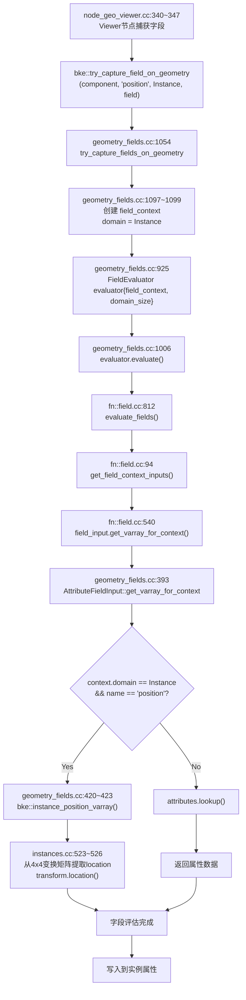

node_geo_viewer.cc:340~347
  ↓
bke::try_capture_field_on_geometry(component, "position", AttrDomain::Instance, field)
  ↓
geometry_fields.cc:1054 try_capture_fields_on_geometry(GeometryComponent &component, ...)
  ↓
geometry_fields.cc:1097 ~1099
  MutableAttributeAccessor attributes = *component.attributes_for_write();
  const GeometryFieldContext field_context{component, domain};  // domain = Instance
  try_capture_fields_on_geometry(attributes, field_context, ...)
  ↓
geometry_fields.cc:925
  fn::FieldEvaluator evaluator{field_context, domain_size};
  evaluator.add(field);  // 添加要评估的字段
  ↓
geometry_fields.cc:1006
  evaluator.evaluate();
  ↓
fn::field.cc:812
  evaluate_fields(scope_, fields, selection_mask_, context_, dst_varrays_)
  ↓
fn::field.cc:94 (get_field_context_inputs)
  context.get_varray_for_input(field_input, mask, scope)
  ↓
fn::field.cc:540 (FieldContext::get_varray_for_input 默认实现)
  field_input.get_varray_for_context(*this, mask, scope)
  ↓
geometry_fields.cc:393
  AttributeFieldInput::get_varray_for_context(context, mask)
  ↓
geometry_fields.cc:420~423
  else if (context.domain() == bke::AttrDomain::Instance && name_ == "position") {
    return bke::instance_position_varray(*context.instances());  // 从变换矩阵提取位置！
  }

步骤	文件位置	关键操作
1   node_geo_viewer.cc:340~347      Viewer节点调用capture
2   geometry_fields.cc:1054         入口函数
3   geometry_fields.cc:1097~1099    创建GeometryFieldContext，domain=Instance
4   geometry_fields.cc:925          创建FieldEvaluator
5   geometry_fields.cc:1006         评估字段
6   fn::field.cc:812                内部evaluate_fields
7   fn::field.cc:94                 获取context输入
8   fn::field.cc:540                调用field_input的get_varray_for_context
9   geometry_fields.cc:393          AttributeFieldInput实现
10  geometry_fields.cc:420~423      关键判断：Instance + position → 从变换矩阵提取
11  instances.cc:523~526            transform.location() 提取位置