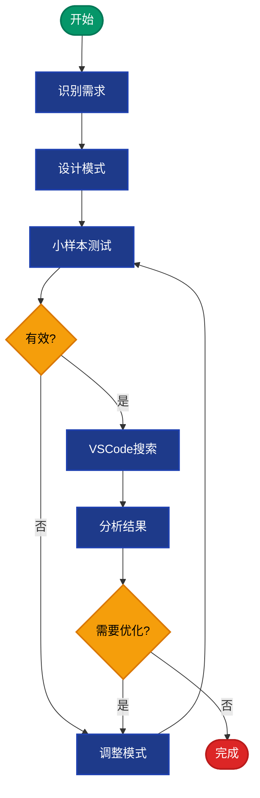
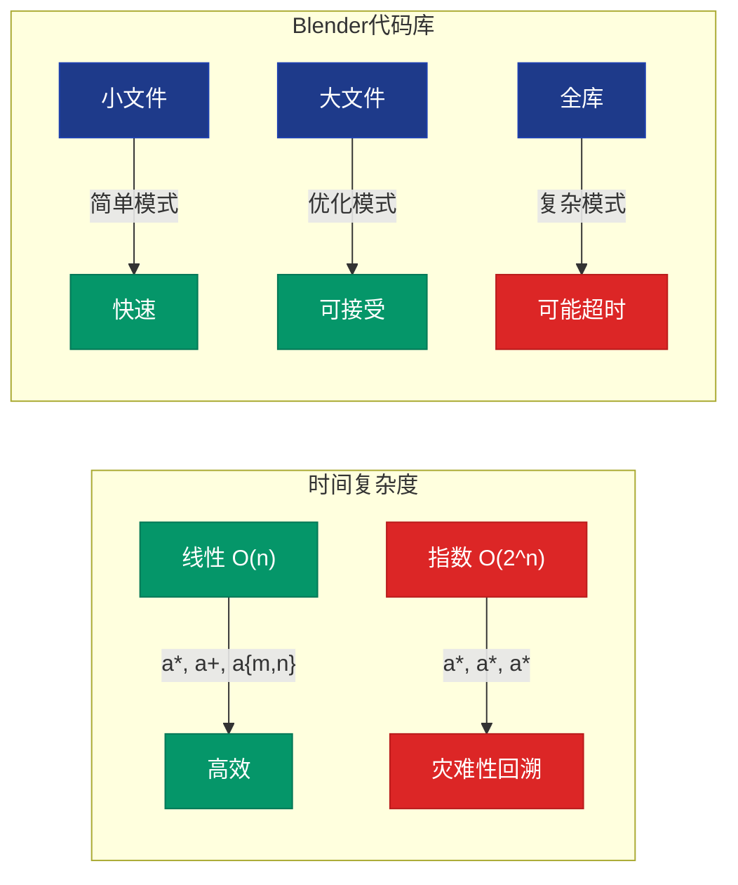
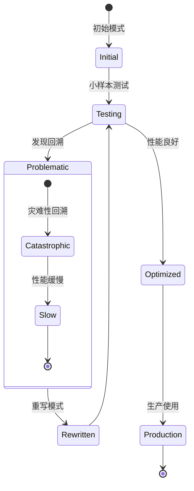

# 正则表达式完全指南 - VSCode与大型代码库高效使用

## 目录
- [1. 概述](#概述)
- [2. 正则表达式核心语法](#正则表达式核心语法)
  - [2.1. 基础元字符](#1-基础元字符)
  - [2.2. 量词与重复](#2-量词与重复)
  - [2.3. 字符类与分组](#3-字符类与分组)
  - [2.4. 锚点与边界](#4-锚点与边界)
  - [2.5. 断言与条件](#5-断言与条件)
- [3. VSCode搜索中的正则表达式](#vscode搜索中的正则表达式)
  - [3.1. 基本搜索模式](#1-基本搜索模式)
  - [3.2. 高级搜索技巧](#2-高级搜索技巧)
  - [3.3. 搜索替换实战](#3-搜索替换实战)
- [4. 大型代码库高效使用场景](#大型代码库高效使用场景)
  - [4.1. C++代码分析](#1-c代码分析)
  - [4.2. Python代码分析](#2-python代码分析)
  - [4.3. Blender源码实战](#3-blender源码实战)
- [5. 实用技巧与最佳实践](#实用技巧与最佳实践)

---

## 概述

<span style="background-color: #1e3a8a; color: white; padding: 2px 8px; border-radius: 4px;">正则表达式</span> (Regular Expression, 简称 regex 或 regexp) 是一种强大的文本匹配工具。在大型代码库如 Blender 的开发中，它能极大提高代码搜索、重构和分析的效率。

<span style="background-color: #f59e0b; color: black; padding: 2px 8px; border-radius: 4px;">核心价值</span>：
- 快速定位代码模式
- 批量重构与替换
- 代码质量检查
- 文档生成辅助

---

## 正则表达式核心语法

### 2.1. 基础元字符

<span style="background-color: #059669; color: white; padding: 2px 8px; border-radius: 4px;">基础匹配</span>：

| 元字符 | 说明 | 示例 | 匹配结果 |
|--------|------|------|----------|
| `.` | 匹配任意单个字符(除换行符) | `a.c` | "abc", "a2c", "a_c" |
| `\d` | 匹配数字 `[0-9]` | `\d+` | "123", "456" |
| `\w` | 匹配单词字符 `[a-zA-Z0-9_]` | `\w+` | "var_name", "func123" |
| `\s` | 匹配空白字符 | `\s+` | " ", "\t", "\n" |
| `\D` | 匹配非数字 | `\D+` | "abc", "!@#" |
| `\W` | 匹配非单词字符 | `\W+` | "!!!", "   " |
| `\S` | 匹配非空白字符 | `\S+` | "text", "123" |

<span style="background-color: #7c3aed; color: white; padding: 2px 8px; border-radius: 4px;">示例代码</span>：
```cpp
// 在 Blender 源码中查找所有函数调用
// 搜索: \w+\(\)
// 匹配: printf(), node_add_socket_from_template(), BKE_node_tree_update()
```

### 2.2. 量词与重复

<span style="background-color: #dc2626; color: white; padding: 2px 8px; border-radius: 4px;">量词控制重复次数</span>：

| 量词 | 说明 | 示例 | 匹配结果 |
|------|------|------|----------|
| `*` | 0次或多次 | `ab*c` | "ac", "abc", "abbc" |
| `+` | 1次或多次 | `ab+c` | "abc", "abbc" (不匹配 "ac") |
| `?` | 0次或1次 | `colou?r` | "color", "colour" |
| `{n}` | 精确n次 | `\d{3}` | "123" (不匹配 "12") |
| `{n,}` | 至少n次 | `\d{2,}` | "12", "123", "1234" |
| `{n,m}` | n到m次 | `\d{2,4}` | "12", "123", "1234" |

<span style="background-color: #0891b2; color: white; padding: 2px 8px; border-radius: 4px;">LaTeX 公式表示</span>：

$$
\text{量词语义} =
\begin{cases}
a^* & \text{匹配 } \{a\}^* = \{\epsilon, a, aa, aaa, \dots\} \\
a^+ & \text{匹配 } \{a\}^+ = \{a, aa, aaa, \dots\} \\
a? & \text{匹配 } \{a\}? = \{\epsilon, a\} \\
a\{n\} & \text{匹配 } a^n \\
a\{n,m\} & \text{匹配 } \{a^n, a^{n+1}, \dots, a^m\}
\end{cases}
$$

### 2.3. 字符类与分组

<span style="background-color: #059669; color: white; padding: 2px 8px; border-radius: 4px;">字符类</span>：

| 语法 | 说明 | 示例 |
|------|------|------|
| `[abc]` | 匹配a、b或c | `[aeiou]` 匹配元音 |
| `[a-z]` | 匹配a到z | `[a-zA-Z]` 匹配所有字母 |
| `[^abc]` | 匹配除a、b、c外的字符 | `[^0-9]` 匹配非数字 |
| `(pattern)` | 捕获分组 | `(abc)+` 匹配 "abc", "abcabc" |
| `(?:pattern)` | 非捕获分组 | `(?:abc)+` 同上但不捕获 |
| `(?<name>pattern)` | 命名捕获组 | `(?<func>\w+)\(\)` |

<span style="background-color: #7c3aed; color: white; padding: 2px 8px; border-radius: 4px;">Blender 源码示例</span>：
```cpp
// 查找所有 DNA 结构体定义
// 搜索: struct\s+(\w+)\s*\{
// 在 source/blender/editors/space_node/node_draw.cc:15-23
// 匹配: struct bNode, struct bNodeTree, struct CompoJob
```

### 2.4. 锚点与边界

<span style="background-color: #dc2626; color: white; padding: 2px 8px; border-radius: 4px;">位置匹配</span>：

| 锚点 | 说明 | 示例 |
|------|------|------|
| `^` | 行首 | `^#include` 匹配行首的 include |
| `$` | 行尾 | `;\s*$` 匹配行尾分号 |
| `\b` | 单词边界 | `\bfunction\b` 精确匹配单词 |
| `\B` | 非单词边界 | `\Btion\b` 匹配 "tion" 但不单独 |
| `\A` | 字符串开头 | `\A#include` |
| `\Z` | 字符串结尾 | `return;\Z` |

### 2.5. 断言与条件

<span style="background-color: #0891b2; color: white; padding: 2px 8px; border-radius: 4px;">高级断言</span>：

| 断言 | 说明 | 示例 |
|------|------|------|
| `(?=pattern)` | 正向先行断言 | `\w+(?=\()` 匹配函数名 |
| `(?!pattern)` | 负向先行断言 | `\w+(?!\()` 匹配非函数名 |
| `(?<=pattern)` | 正向后行断言 | `(?<=struct\s)\w+` 匹配结构体名 |
| `(?<!pattern)` | 负向后行断言 | `(?<!struct\s)\w+` 匹配非结构体名 |
| `(?(cond)yes|no)` | 条件表达式 | `(?(?<=\w)\d)` |

---

## VSCode搜索中的正则表达式

### 3.1. 基本搜索模式

<span style="background-color: #1e3a8a; color: white; padding: 2px 8px; border-radius: 4px;">VSCode 正则搜索快捷键</span>：
- <span style="background-color: #059669; color: white; padding: 2px 6px; border-radius: 3px;">Ctrl+Shift+F</span> 全局搜索
- <span style="background-color: #059669; color: white; padding: 2px 6px; border-radius: 3px;">Alt+R</span> 切换正则模式
- <span style="background-color: #059669; color: white; padding: 2px 6px; border-radius: 3px;">Ctrl+H</span> 替换模式

#### 常用搜索场景

<span style="background-color: #f59e0b; color: black; padding: 2px 8px; border-radius: 4px;">场景1: 查找所有函数定义</span>

```regex
// 模式: ^\w+\s+\w+\([^)]*\)\s*\{
// 示例匹配:
void node_draw(bNode *node) {
int calculate_value(int a, int b) {
```

<span style="background-color: #f59e0b; color: black; padding: 2px 8px; border-radius: 4px;">场景2: 查找所有#include包含</span>

```regex
// 模式: ^#include\s+[<"]
// 匹配:
#include "BKE_node.hh"
#include <algorithm>
```

<span style="background-color: #f59e0b; color: black; padding: 2px 8px; border-radius: 4px;">场景3: 查找指针声明</span>

```regex
// 模式: \w+\s*\*+\s*\w+
// 匹配:
bNode *node
int *ptr
char **argv
```

### 3.2. 高级搜索技巧

#### 捕获组与替换

<span style="background-color: #7c3aed; color: white; padding: 2px 8px; border-radius: 4px;">捕获组语法</span>：
- `$1`, `$2`, `$3` - 引用捕获组
- `$&` - 整个匹配
- `$0` - 同上

<span style="background-color: #059669; color: white; padding: 2px 8px; border-radius: 4px;">实战示例：批量重命名变量</span>

**搜索**: `(\w+)\s*=\s*node_add_socket_from_template`
**替换**: `$1 = node_add_socket_from_template_v2`

**原始代码**:
```cpp
bNodeSocket *sock = node_add_socket_from_template(ntree, node, stemp, in_out);
```

**替换后**:
```cpp
bNodeSocket *sock = node_add_socket_from_template_v2(ntree, node, stemp, in_out);
```

#### 多行搜索

<span style="background-color: #dc2626; color: white; padding: 2px 8px; border-radius: 4px;">使用 `[\s\S]` 匹配多行</span>：

```regex
// 查找多行注释块
/\*[\s\S]*?\*/

// 查找函数体
void\s+\w+\([^)]*\)\s*\{[\s\S]*?\}
```

### 3.3. 搜索替换实战

#### 场景1: 重构命名约定

<span style="background-color: #0891b2; color: white; padding: 2px 8px; border-radius: 4px;">从 snake_case 到 camelCase</span>

**搜索**: `_(\w)`
**替换**: `\U$1` (VSCode需要手动处理)

或者分步：
1. `(\w+)_(\w+)` → `$1$2`
2. 重复直到完成

#### 场景2: 批量添加日志

<span style="background-color: #059669; color: white; padding: 2px 8px; border-radius: 4px;">在函数开头添加调试信息</span>

**搜索**: `^(\s*)(void|int|bool|bNode\*)\s+(\w+)\([^)]*\)\s*\{`
**替换**: `$1$2 $3($4) {\n$1  printf("Entering %s\\n", "$3");`

#### 场景3: 修复注释格式

**搜索**: `//\s*(.*)`
**替换**: `/* $1 */`

---

## 大型代码库高效使用场景

### 4.1. C++代码分析

<span style="background-color: #1e3a8a; color: white; padding: 2px 8px; border-radius: 4px;">Blender C++ 代码模式</span>

#### 查找所有 bNode 相关函数

```regex
// 搜索模式
\b(bNode|bNodeTree)\s*[\w:]+\s*\([^)]*\)

// 在 source/blender/editors/space_node/node_draw.cc:51-56
// 匹配示例:
bNode *node_add_socket_from_template(bNodeTree *ntree, bNode *node, ...)
void node_verify_sockets(bNodeTree *ntree, bNode *node, bool do_id_user)
```

#### 查找内存分配模式

```regex
// 搜索: MEM_.*alloc.*\(
// 匹配:
MEM_guardedalloc.h
MEM_mallocN(size, "name")
MEM_callocN(size, "name")
```

#### 查找 DNA 结构体字段访问

```regex
// 搜索: \b\w+->\w+\b
// 在 node_draw.cc:94-100
// 匹配:
ntree->nodes
node->type
sock->type
```

### 4.2. Python代码分析

<span style="background-color: #059669; color: white; padding: 2px 8px; border-radius: 4px;">Python 特有模式</span>

#### 查找函数定义

```regex
^def\s+\w+\([^)]*\)\s*:
```

#### 查找类定义

```regex
^class\s+\w+\([^)]*\)\s*:
```

#### 查找导入语句

```regex
^from\s+[\w.]+\s+import\s+.*$
^import\s+[\w.]+$
```

### 4.3. Blender源码实战

<span style="background-color: #f59e0b; color: black; padding: 2px 8px; border-radius: 4px;">实际应用案例</span>

#### 案例1: 查找所有节点编辑器相关文件

**搜索模式**: `space_node|nodes/`

**使用场景**: 快速定位相关代码

#### 案例2: 查找函数指针调用

```regex
// 搜索: \(\*\w+\)\s*\(
// 匹配:
(*node->type->draw)(node, ...)
(*callback)(data)
```

#### 案例3: 查找错误处理模式

```regex
// 搜索: if\s*\([^)]*==\s*NULL\)|if\s*\([^)]*!=\s*NULL\)
// 匹配:
if (node == NULL)
if (ntree != NULL)
```

#### 案例4: 查找命名空间使用

```regex
// 搜索: blender::\w+::\w+
// 在 source/blender/nodes/NOD_socket.hh:29-36
// 匹配:
blender::nodes::update_node_declaration_and_sockets
blender::bke::bNodeSocketTemplate
```

#### 案例5: 查找宏定义

```regex
// 搜索: ^#define\s+\w+
// 匹配:
#define USE_ESC_COMPO
#define MEM_guardedalloc.h
```

---

## 实用技巧与最佳实践

### 5.1. 性能优化

<span style="background-color: #dc2626; color: white; padding: 2px 8px; border-radius: 4px;">避免灾难性回溯</span>

**不好的模式**:
```regex
(a*)*  // 可能导致指数级回溯
(a+)*  // 同上
```

**好的模式**:
```regex
a*      // 线性时间
a+      // 线性时间
```

<span style="background-color: #0891b2; color: white; padding: 2px 8px; border-radius: 4px;">LaTeX 表示复杂度</span>：

$$
\text{时间复杂度} =
\begin{cases}
O(n) & \text{优化的正则} \\
O(2^n) & \text{灾难性回溯}
\end{cases}
$$

### 5.2. 调试技巧

<span style="background-color: #7c3aed; color: white; padding: 2px 8px; border-radius: 4px;">逐步测试</span>：

1. 先测试简单模式
2. 逐步添加复杂度
3. 使用捕获组验证
4. 在小样本上测试

### 5.3. 常用速查表

<span style="background-color: #059669; color: white; padding: 2px 8px; border-radius: 4px;">Blender开发常用</span>：

| 用途 | 模式 | 说明 |
|------|------|------|
| 查找函数 | `^\w+\s+\w+\([^)]*\)\s*\{` | C++函数定义 |
| 查找类 | `^class\s+\w+` | C++类定义 |
| 查找头文件 | `^#include\s+["<]` | include语句 |
| 查找指针 | `\w+\s*\*+\s*\w+` | 指针声明 |
| 查找注释 | `//.*$\|/\*[\s\S]*?\*/` | 单行/多行注释 |
| 查找命名空间 | `namespace\s+\w+\s*\{` | 命名空间定义 |
| 查找using声明 | `using\s+\w+\s*=` | using语句 |

### 5.4. 替换技巧

<span style="background-color: #f59e0b; color: black; padding: 2px 8px; border-radius: 4px;">大小写转换</span>：

- `\U$1` - 转大写
- `\L$1` - 转小写
- `\u$1` - 首字母大写
- `\l$1` - 首字母小写

<span style="background-color: #1e3a8a; color: white; padding: 2px 8px; border-radius: 4px;">条件替换</span>：

```regex
// 搜索: (\w+)(\(\))
// 替换: $1_v2$2
// 结果: func() → func_v2()
```

---

## Mermaid 流程图：正则表达式使用流程



## Mermaid 图表：正则表达式复杂度对比



## Mermaid 状态图：搜索优化过程



---

## 总结

<span style="background-color: #1e3a8a; color: white; padding: 2px 8px; border-radius: 4px;">关键要点</span>：

1. **基础语法**：掌握 `.`、`\d`、`\w`、`*`、`+`、`?` 等核心元字符
2. **VSCode集成**：熟练使用 `Ctrl+Shift+F` 和正则模式
3. **性能意识**：避免灾难性回溯，使用优化模式
4. **实际应用**：结合 Blender 源码结构进行针对性搜索
5. **调试技巧**：逐步构建，小样本测试

<span style="background-color: #059669; color: white; padding: 2px 8px; border-radius: 4px;">进阶建议</span>：

- 阅读 [regex101.com](https://regex101.com) 在线测试工具
- 在 Blender 源码中实践上述模式
- 建立个人正则表达式速查表
- 参与代码审查，学习他人使用的模式

<span style="background-color: #7c3aed; color: white; padding: 2px 8px; border-radius: 4px;">数学公式总结</span>：

正则表达式匹配可以形式化为：
$$
L(R) = \{w \in \Sigma^* \mid w \text{ 被正则表达式 } R \text{ 匹配}\}
$$

其中 $\Sigma$ 是字符集，$w$ 是输入字符串。

---

**文档版本**: 1.0
**最后更新**: 2025-12-24
**适用范围**: Blender 开发, C++/Python 代码库
**作者**: mimo
