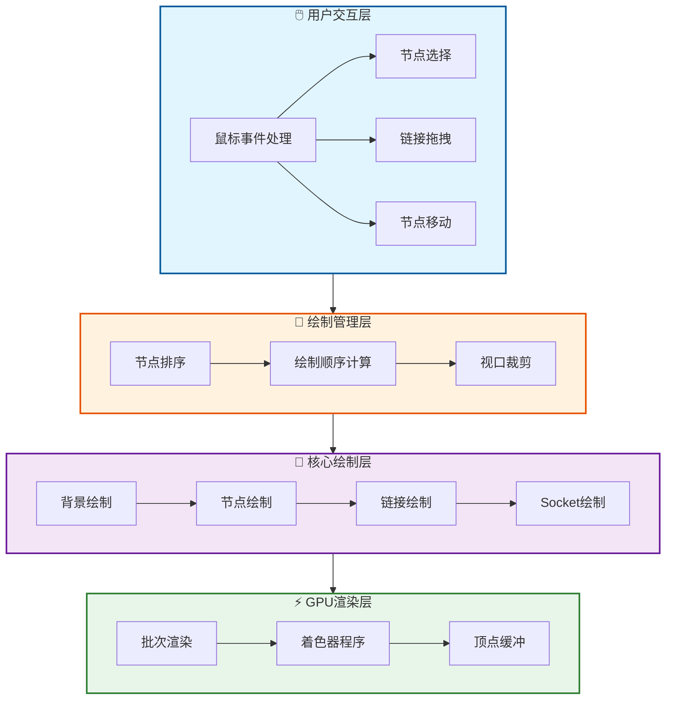
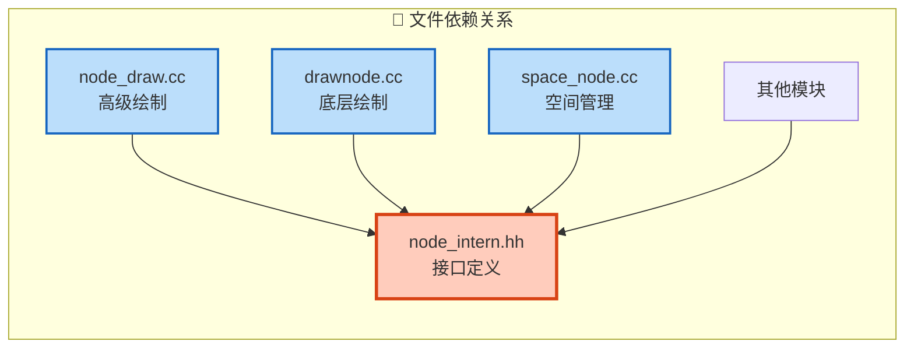
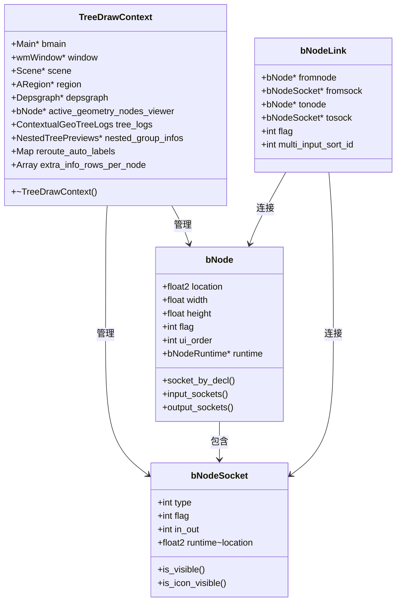
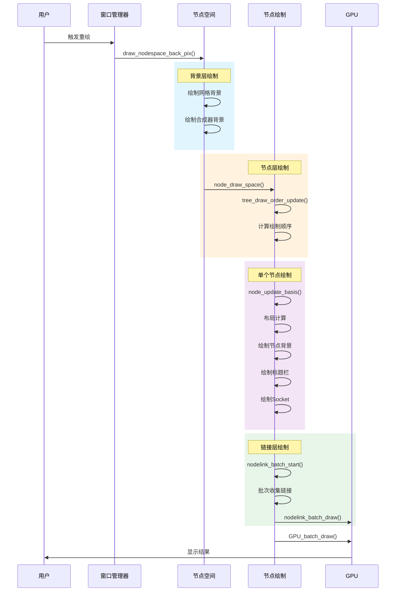
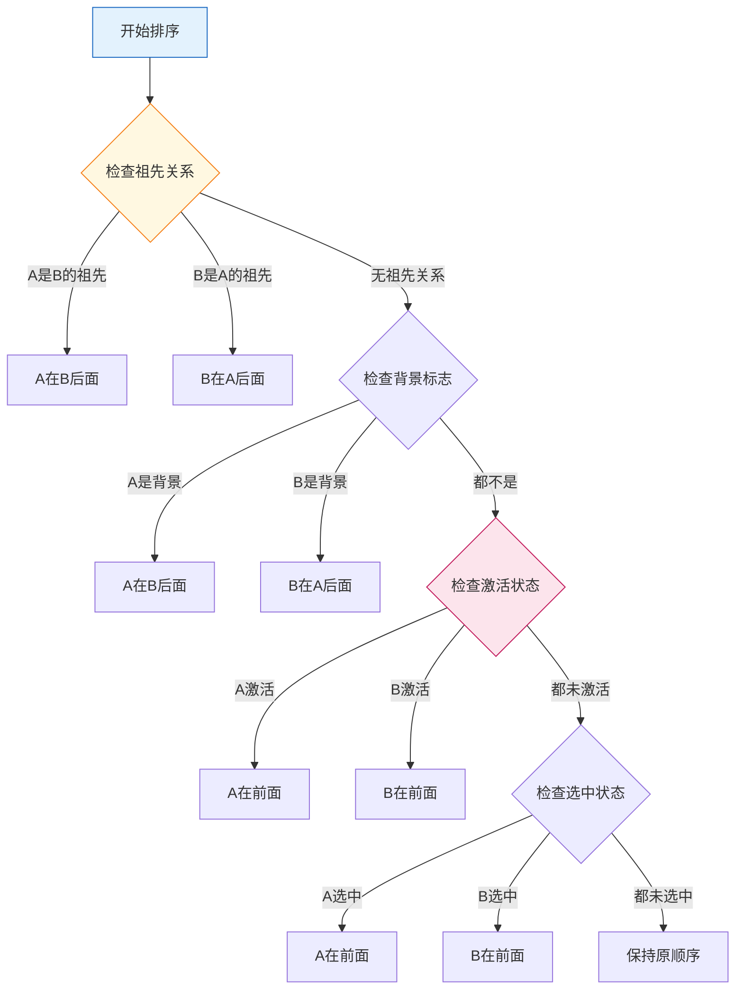
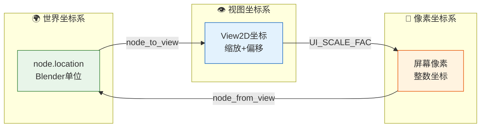
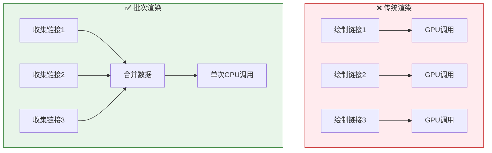
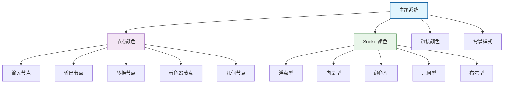
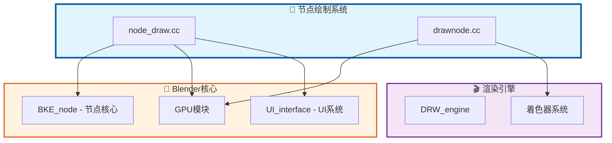

# Blender 节点绘制系统概述

## 1. 系统架构概览

Blender 的节点编辑器绘制系统是一个复杂而精密的图形渲染架构，负责将节点树以可视化的方式呈现给用户。该系统采用分层设计，将绘制逻辑划分为多个层次，每个层次负责特定的渲染任务。



## 2. 核心文件结构

节点绘制系统主要由以下文件组成：

| 文件路径 | 主要职责 | 代码规模 |
|---------|---------|---------|
| `source/blender/editors/space_node/node_draw.cc` | 高级节点绘制逻辑 | ~2500 行 |
| `source/blender/editors/space_node/drawnode.cc` | 底层绘制辅助函数 | ~2440 行 |
| `source/blender/editors/space_node/node_intern.hh` | 内部接口定义 | ~827 行 |
| `source/blender/editors/space_node/space_node.cc` | 空间管理器 | ~400+ 行 |



## 3. 关键数据结构

### 3.1 TreeDrawContext - 绘制上下文

`TreeDrawContext` 是节点绘制的核心上下文结构，贯穿整个绘制流程：

```cpp
struct TreeDrawContext {
    Main *bmain;                    // 主数据库
    wmWindow *window;               // 当前窗口
    Scene *scene;                   // 当前场景
    ARegion *region;                // 绘制区域
    Depsgraph *depsgraph;           // 依赖图
    
    // 几何节点特定数据
    const bNode *active_geometry_nodes_viewer = nullptr;
    geo_log::ContextualGeoTreeLogs tree_logs;
    
    // 预览和缓存
    NestedTreePreviews *nested_group_infos = nullptr;
    
    // 运行时计算数据
    Map<const bNode *, StringRef> reroute_auto_labels;
    Map<const bNode *, const bNode *> menu_switch_source_by_index_switch;
    Array<Vector<NodeExtraInfoRow>> extra_info_rows_per_node;
};
```



## 4. 绘制流程概览

节点绘制的完整流程遵循严格的顺序，确保视觉层次正确：



## 5. 核心绘制函数

### 5.1 主绘制入口

```cpp
// node_draw.cc
void node_draw_space(const bContext &C, ARegion &region)
{
    // 1. 初始化绘制上下文
    TreeDrawContext tree_draw_ctx{...};
    
    // 2. 更新节点绘制顺序
    tree_draw_order_update(ntree);
    
    // 3. 计算节点布局
    for (bNode *node : nodes) {
        node_update_basis(C, tree_draw_ctx, ntree, *node, *block);
    }
    
    // 4. 绘制链接
    nodelink_batch_start(snode);
    for (bNodeLink *link : links) {
        node_draw_link(C, v2d, snode, *link, selected);
    }
    nodelink_batch_end(snode);
    
    // 5. 绘制节点
    for (bNode *node : nodes) {
        node_draw_basis(C, tree_draw_ctx, ntree, *node, *block);
    }
}
```

### 5.2 节点排序算法

节点排序确保正确的视觉层次 - 选中的节点显示在未选中节点之上：



## 6. 坐标系统

节点编辑器使用多重坐标系统，需要精确的转换：



### 坐标转换函数

```cpp
// DPI 缩放的坐标转换
float2 node_to_view(const float2 &co) {
    return co * UI_SCALE_FAC;
}

float2 node_from_view(const float2 &co) {
    return co / UI_SCALE_FAC;
}

// 节点矩形计算
static rctf node_to_rect(const bNode &node) {
    rctf rect{};
    rect.xmin = node.location[0];
    rect.ymin = node.location[1] - node.height;
    rect.xmax = node.location[0] + node.width;
    rect.ymax = node.location[1];
    return rect;
}
```

## 7. 渲染优化策略

### 7.1 批次渲染

为了减少 GPU 调用次数，系统使用批次渲染：



### 7.2 视口裁剪

```cpp
// 链接可见性检测
static bool node_link_draw_is_visible(const View2D &v2d, 
                                       const std::array<float2, 4> &points) {
    if (min_ffff(points[0].x, points[1].x, points[2].x, points[3].x) > v2d.cur.xmax) {
        return false;
    }
    if (max_ffff(points[0].x, points[1].x, points[2].x, points[3].x) < v2d.cur.xmin) {
        return false;
    }
    return true;
}
```

## 8. 主题与样式

节点编辑器支持完整的主题定制：



### Socket 颜色定义

```cpp
// drawnode.cc - 标准Socket颜色映射
static const float std_node_socket_colors[][4] = {
    {0.63, 0.63, 0.63, 1.0}, // SOCK_FLOAT - 灰色
    {0.39, 0.39, 0.78, 1.0}, // SOCK_VECTOR - 蓝色
    {0.78, 0.78, 0.16, 1.0}, // SOCK_RGBA - 黄色
    {0.39, 0.78, 0.39, 1.0}, // SOCK_SHADER - 绿色
    {0.80, 0.65, 0.84, 1.0}, // SOCK_BOOLEAN - 紫色
    {0.35, 0.55, 0.36, 1.0}, // SOCK_INT - 深绿
    {0.44, 0.70, 1.00, 1.0}, // SOCK_STRING - 浅蓝
    {0.00, 0.84, 0.64, 1.0}, // SOCK_GEOMETRY - 青色
    // ... 更多类型
};
```

## 9. 与Blender其他系统的关系



## 10. 总结

Blender 的节点绘制系统展现了优秀的软件架构设计：

1. **分层架构**: 清晰的层次划分，职责明确
2. **性能优化**: 批次渲染、视口裁剪等优化手段
3. **可扩展性**: 支持自定义节点类型和绘制方式
4. **主题支持**: 完整的视觉定制能力
5. **多类型支持**: 统一架构支持着色器、合成器、几何节点等多种类型

这个系统不仅是 Blender 的核心组件，也为其他图形编辑器的设计提供了优秀的参考范例。
