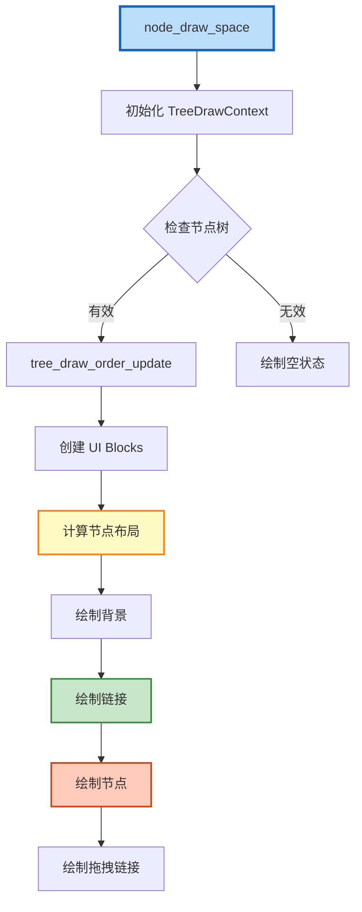
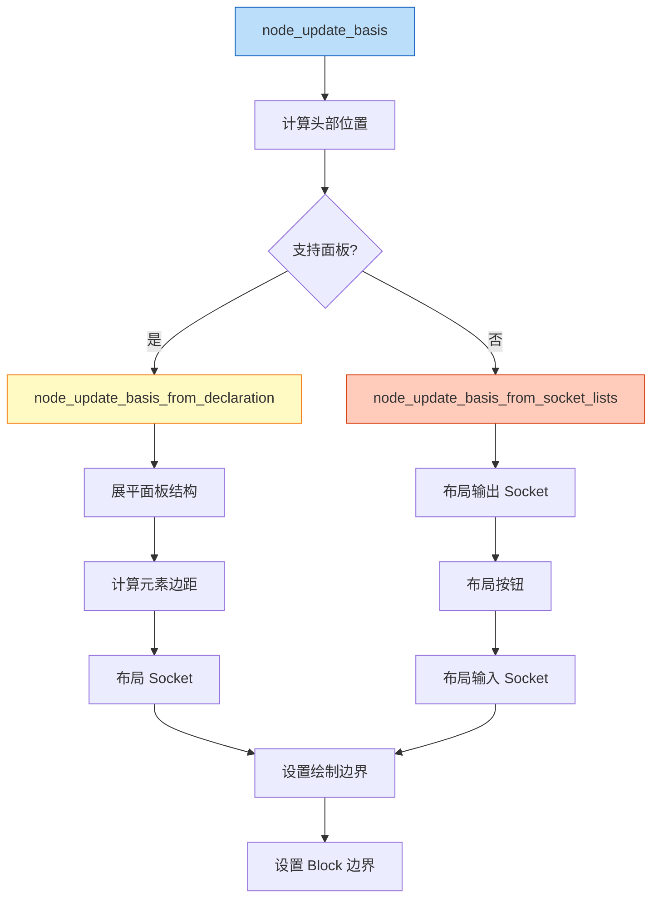
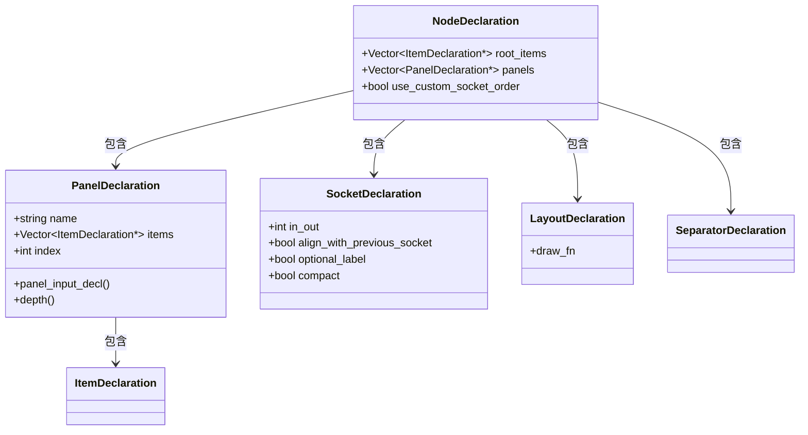
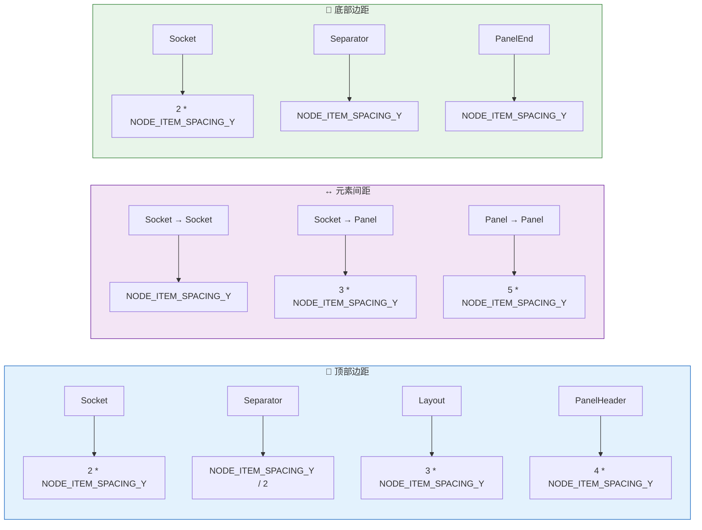
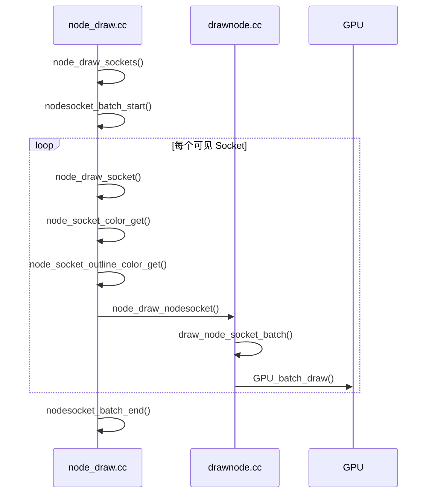
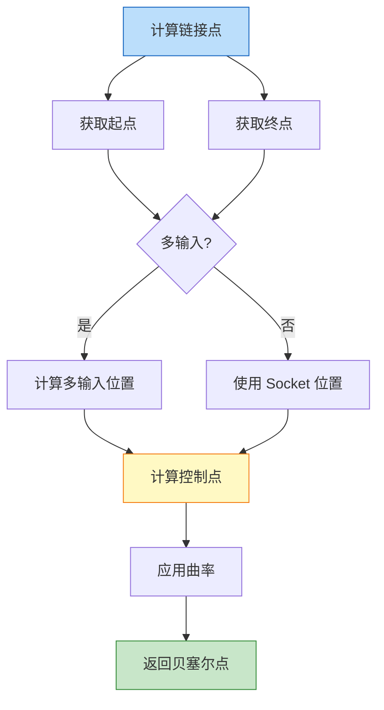
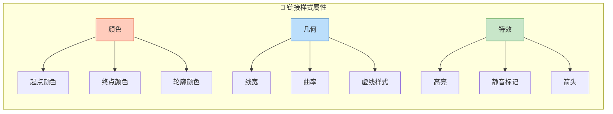
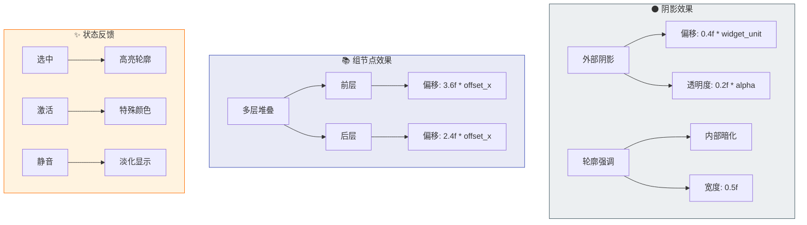
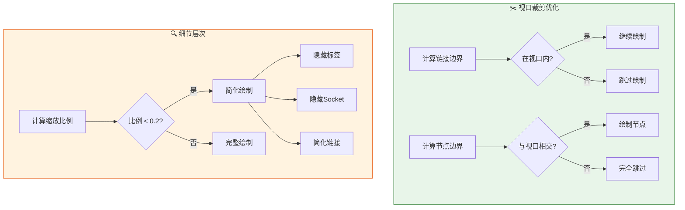
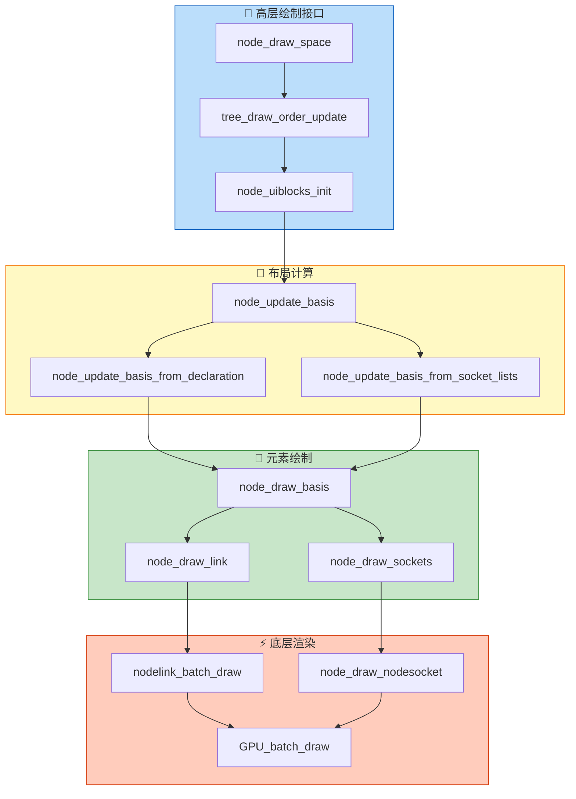

# Blender 节点绘制核心实现详解

## 1. 节点绘制主流程

### 1.1 入口函数 `node_draw_space`

节点绘制的入口位于 `node_draw.cc` 中的 `node_draw_space` 函数。这是整个绘制流程的调度中心：



```cpp
void node_draw_space(const bContext &C, ARegion &region)
{
    SpaceNode *snode = CTX_wm_space_node(&C);
    bNodeTree *ntree = snode->edittree;
    
    // 1. 初始化绘制上下文
    TreeDrawContext tree_draw_ctx{
        .bmain = CTX_data_main(&C),
        .window = CTX_wm_window(&C),
        .scene = CTX_data_scene(&C),
        .region = &region,
        .depsgraph = CTX_data_depsgraph_pointer(&C),
    };
    
    // 2. 更新节点绘制顺序
    tree_draw_order_update(*ntree);
    
    // 3. 获取按绘制顺序排列的节点
    Array<bNode *> nodes = tree_draw_order_calc_nodes(*ntree);
    
    // 4. 初始化 UI Blocks
    Array<ui::Block *> blocks = node_uiblocks_init(C, nodes);
    
    // 5. 计算每个节点的布局
    for (const int i : nodes.index_range()) {
        bNode &node = *nodes[i];
        node_update_basis(C, tree_draw_ctx, *ntree, node, *blocks[i]);
    }
    
    // 6. 绘制链接（在节点下方）
    nodelink_batch_start(*snode);
    for (bNodeLink *link : ntree->all_links()) {
        node_draw_link(C, region.v2d, *snode, *link, is_link_selected(*link));
    }
    nodelink_batch_end(*snode);
    
    // 7. 绘制节点
    for (const int i : nodes.index_range()) {
        node_draw_basis(C, tree_draw_ctx, *ntree, *nodes[i], *blocks[i]);
    }
}
```

### 1.2 节点布局计算 `node_update_basis`

节点布局计算是绘制系统的核心，决定了节点的最终尺寸和内部元素位置：



## 2. 节点布局系统详解

### 2.1 传统布局模式

传统布局采用固定的输出-按钮-输入顺序：

```cpp
static void node_update_basis_from_socket_lists(
    TreeDrawContext &tree_draw_ctx,
    const bContext &C,
    bNodeTree &ntree,
    bNode &node,
    ui::Block &block,
    const int locx,
    int &locy)
{
    /* 顶部留白 */
    locy -= NODE_DYS / 2;
    
    /* 1. 输出 Socket */
    bool add_output_space = false;
    for (bNodeSocket *socket : node.output_sockets()) {
        if (node_update_basis_socket(...)) {
            locy -= NODE_ITEM_SPACING_Y;
            add_output_space = true;
        }
    }
    if (add_output_space) {
        locy -= NODE_DY / 4;
    }
    
    /* 2. 节点按钮 */
    bool add_button_space = node_update_basis_buttons(
        C, ntree, node, node.typeinfo->draw_buttons, block, locy);
    
    /* 3. 输入 Socket */
    bool add_input_space = false;
    for (bNodeSocket *socket : node.input_sockets()) {
        if (node_update_basis_socket(...)) {
            locy -= NODE_ITEM_SPACING_Y;
            add_input_space = true;
        }
    }
    
    /* 底部留白 */
    if (add_input_space || add_button_space) {
        locy -= NODE_DYS / 2;
    }
}
```

### 2.2 声明式布局模式

现代节点使用声明式布局，支持面板和自定义排序：



```cpp
/* 展平节点项目为绘制列表 */
static Vector<FlatNodeItem> make_flat_node_items(bNode &node)
{
    const int panels_num = node.num_panel_states;
    Array<bool> panel_visibility(panels_num, false);
    determine_visible_panels(node, panel_visibility);
    
    Vector<FlatNodeItem> items;
    for (const nodes::ItemDeclaration *item_decl : node.declaration()->root_items) {
        if (const auto *socket_decl = dynamic_cast<const nodes::SocketDeclaration *>(item_decl)) {
            add_flat_items_for_socket(node, *socket_decl, nullptr, prev_socket_decl, items);
        }
        else if (const auto *panel_decl = dynamic_cast<const nodes::PanelDeclaration *>(item_decl)) {
            add_flat_items_for_panel(node, *panel_decl, panel_visibility, items);
        }
        // ... 处理其他类型
    }
    return items;
}
```

### 2.3 边距计算系统

边距系统确保视觉一致性：



## 3. Socket 绘制系统

### 3.1 Socket 布局计算

```cpp
static bool node_update_basis_socket(
    TreeDrawContext &tree_draw_ctx,
    const bContext &C,
    bNodeTree &ntree,
    bNode &node,
    const char *panel_label,
    bNodeSocket *input_socket,
    bNodeSocket *output_socket,
    ui::Block &block,
    const int &locx,
    int &locy)
{
    /* 检查 Socket 可见性 */
    if ((!input_socket || !input_socket->is_visible()) &&
        (!output_socket || !output_socket->is_visible())) {
        return false;
    }
    
    /* 多输入 Socket 高度计算 */
    const bool is_multi_input = (input_socket ? input_socket->flag & SOCK_MULTI_INPUT : false);
    const float multi_input_socket_offset = is_multi_input ?
        std::max(input_socket->runtime->total_inputs - 2, 0) * NODE_MULTI_INPUT_LINK_GAP : 0.0f;
    locy -= multi_input_socket_offset * 0.5f;
    
    /* 创建 UI 布局 */
    ui::Layout &layout = ui::block_layout(&block,
                                          ui::LayoutDirection::Vertical,
                                          ui::LayoutType::Panel,
                                          locx + NODE_DYS,
                                          locy,
                                          NODE_WIDTH(node) - NODE_DY,
                                          NODE_DY,
                                          0,
                                          ui::style_get_dpi());
    
    /* 布局 Socket 内容 */
    if (input_socket) {
        PointerRNA sockptr = RNA_pointer_create_discrete(&ntree.id, RNA_NodeSocket, input_socket);
        draw_socket_layout(tree_draw_ctx, C, *row, *input_socket, ntree, node, nodeptr, sockptr, panel_label);
        
        /* 记录 Socket 位置 */
        input_socket->runtime->location = float2(round(locx), round(locy - NODE_DYS));
    }
    
    if (output_socket) {
        output_socket->runtime->location = float2(round(locx + NODE_WIDTH(node)),
                                                  round(locy - NODE_DYS));
    }
    
    return true;
}
```

### 3.2 Socket 绘制实现



```cpp
void node_draw_nodesocket(const rctf *rect,
                          const float color_inner[4],
                          const float color_outline[4],
                          const float outline_thickness,
                          const int shape,
                          const float aspect)
{
    NodeSocketShaderParameters socket_params = {};
    socket_params.rect[0] = rect->xmin;
    socket_params.rect[1] = rect->xmax;
    socket_params.rect[2] = rect->ymin;
    socket_params.rect[3] = rect->ymax;
    copy_v4_v4(socket_params.color_inner, color_inner);
    copy_v4_v4(socket_params.color_outline, color_outline);
    socket_params.outline_thickness = outline_thickness;
    socket_params.shape = float(shape) + 0.1f;
    socket_params.aspect = aspect;
    
    GPU_blend(GPU_BLEND_ALPHA);
    draw_node_socket_batch(socket_params);
    GPU_blend(GPU_BLEND_NONE);
}
```

## 4. 链接绘制系统

### 4.1 贝塞尔曲线计算

节点链接使用三次贝塞尔曲线实现平滑连接：



```cpp
static std::array<float2, 4> node_link_bezier_points(const bNodeLink &link)
{
    std::array<float2, 4> points;
    points[0] = socket_link_connection_location(*link.fromnode, *link.fromsock, link);
    points[3] = socket_link_connection_location(*link.tonode, *link.tosock, link);
    calculate_inner_link_bezier_points(points);
    return points;
}

static void calculate_inner_link_bezier_points(std::array<float2, 4> &points)
{
    const int curving = ui::theme::get_value_type(TH_NODE_CURVING, SPACE_NODE);
    if (curving == 0) {
        /* 直线: 对齐所有点 */
        points[1] = math::interpolate(points[0], points[3], 1.0f / 3.0f);
        points[2] = math::interpolate(points[0], points[3], 2.0f / 3.0f);
    }
    else {
        const float dist_x = math::distance(points[0].x, points[3].x);
        const float dist_y = math::distance(points[0].y, points[3].y);
        
        /* 当链接端点接近水平时减少手柄偏移 */
        const float slope = math::safe_divide(dist_y, dist_x);
        const float clamp_factor = math::min(1.0f, slope * (4.5f - 0.25f * float(curving)));
        const float handle_offset = curving * 0.1f * dist_x * clamp_factor;
        
        points[1].x = points[0].x + handle_offset;
        points[1].y = points[0].y;
        points[2].x = points[3].x - handle_offset;
        points[2].y = points[3].y;
    }
}
```

### 4.2 批次渲染实现

链接批次渲染大幅提升性能：

```cpp
/* 链接批次数据结构 */
static struct {
    gpu::Batch *batch;
    gpu::StorageBuf *link_buf;
    uint count;
    bool enabled;
    NodeLinkData data[NODELINK_GROUP_SIZE];  // 最大 256 个链接
} g_batch_link;

void nodelink_batch_start(const SpaceNode &snode)
{
    g_batch_link.enabled = true;
}

static void nodelink_batch_add_link(const SpaceNode &snode,
                                    const std::array<float2, 4> &points,
                                    const NodeLinkDrawConfig &draw_config)
{
    NodeLinkData &data = g_batch_link.data[g_batch_link.count++];
    data.bezier_P0 = points[0];
    data.bezier_P1 = points[1];
    data.bezier_P2 = points[2];
    data.bezier_P3 = points[3];
    data.start_color = float4(draw_config.start_color);
    data.end_color = float4(draw_config.end_color);
    data.dim_factor = draw_config.dim_factor;
    data.thickness = draw_config.thickness;
    data.do_muted = draw_config.draw_muted;
    data.do_arrow = draw_config.draw_arrow;
    
    if (g_batch_link.count == NODELINK_GROUP_SIZE) {
        nodelink_batch_draw(snode);  // 批次满，立即绘制
    }
}

void nodelink_batch_end(const SpaceNode &snode)
{
    nodelink_batch_draw(snode);
    g_batch_link.enabled = false;
}
```

### 4.3 链接样式配置



```cpp
struct NodeLinkDrawConfig {
    int th_col1, th_col2, th_col3;           // 主题颜色ID
    ColorTheme4f start_color, end_color;     // 端点颜色
    ColorTheme4f outline_color;              // 轮廓颜色
    bool draw_arrow;                          // 是否绘制箭头
    bool draw_muted;                          // 是否绘制静音标记
    bool highlighted;                         // 是否高亮
    float dim_factor;                         // 淡化因子
    float thickness;                          // 线宽
    float dash_length;                        // 虚线长度
    float dash_factor;                        // 虚线因子
};
```

## 5. 节点基础绘制

### 5.1 节点背景绘制

```cpp
static void node_draw_basis(const bContext &C,
                            TreeDrawContext &tree_draw_ctx,
                            bNodeTree &ntree,
                            bNode &node,
                            ui::Block &block)
{
    const rctf &rct = node.runtime->draw_bounds;
    
    /* 1. 绘制阴影 */
    node_draw_shadow(snode, node, radius, alpha);
    
    /* 2. 绘制节点组指示器 */
    node_draw_node_group_indicator(snode, node, rct, radius, color);
    
    /* 3. 绘制面板背景 */
    if (is_node_panels_supported(node)) {
        node_draw_panels_background(node);
    }
    
    /* 4. 绘制节点主体 */
    node_draw_node_body(snode, node, rct, color, selected, active);
    
    /* 5. 绘制标题栏 */
    node_draw_node_header(snode, node, rct, color, selected, active);
    
    /* 6. 绘制 Socket */
    node_draw_sockets(C, block, snode, ntree, node);
    
    /* 7. 绘制面板 */
    if (is_node_panels_supported(node)) {
        node_draw_panels(ntree, node, block);
    }
    
    /* 8. 绘制预览 */
    if (node.flag & NODE_PREVIEW) {
        node_draw_preview(...);
    }
}
```

### 5.2 节点视觉效果



## 6. 高级绘制特性

### 6.1 面板系统绘制

```cpp
static void node_draw_panels_background(const bNode &node)
{
    float panel_color[4];
    ui::theme::get_color_4fv(TH_PANEL_SUB_BACK, panel_color);
    panel_color[3] *= 1.5f;  // 增加对比度
    
    const rctf &draw_bounds = node.runtime->draw_bounds;
    
    for (const int panel_i : node_decl.panels.index_range()) {
        const bke::bNodePanelRuntime &panel_runtime = node.runtime->panels[panel_i];
        if (!panel_runtime.content_extent.has_value()) {
            continue;
        }
        
        const rctf content_rect = {
            draw_bounds.xmin,
            draw_bounds.xmax,
            panel_runtime.content_extent->min_y,
            panel_runtime.content_extent->max_y
        };
        
        ui::draw_roundbox_corner_set(ui::CNR_NONE);
        ui::draw_roundbox_4fv(&content_rect, true, BASIS_RAD, panel_color);
    }
}
```

### 6.2 预览图像绘制

```cpp
static void node_draw_preview(const Scene *scene, ImBuf *preview, const rctf *prv)
{
    /* 计算缩放 */
    float xscale = BLI_rctf_size_x(prv) / float(preview->x);
    float yscale = BLI_rctf_size_y(prv) / float(preview->y);
    float scale = std::min(xscale, yscale);
    
    /* 居中显示 */
    rctf draw_rect = *prv;
    if (xscale < yscale) {
        float offset = 0.5f * (BLI_rctf_size_y(prv) - float(preview->y) * xscale);
        draw_rect.ymin += offset;
        draw_rect.ymax -= offset;
    } else {
        float offset = 0.5f * (BLI_rctf_size_x(prv) - float(preview->x) * yscale);
        draw_rect.xmin += offset;
        draw_rect.xmax -= offset;
    }
    
    /* 绘制棋盘格背景 */
    node_draw_preview_background(&draw_rect);
    
    /* 绘制预览图像 */
    GPU_blend(GPU_BLEND_ALPHA);
    ED_draw_imbuf(preview, draw_rect.xmin, draw_rect.ymin, false,
                  &scene->view_settings, &scene->display_settings, scale, scale);
    GPU_blend(GPU_BLEND_NONE);
}
```

## 7. GPU 着色器集成

### 7.1 Socket 着色器

```cpp
/* GPU_SHADER_2D_NODE_SOCKET */
struct NodeSocketShaderParameters {
    float rect[4];           // xmin, xmax, ymin, ymax
    float color_inner[4];    // 内部颜色
    float color_outline[4];  // 轮廓颜色
    float outline_thickness; // 轮廓厚度
    float outline_offset;    // 轮廓偏移
    float shape;             // 形状类型
    float aspect;            // 宽高比
};

static void draw_node_socket_batch(const NodeSocketShaderParameters &socket_params)
{
    if (g_batch_nodesocket().enabled) {
        g_batch_nodesocket().params.append(socket_params);
        if (g_batch_nodesocket().params.size() >= MAX_SOCKET_INSTANCE) {
            nodesocket_cache_flush();  // 批次满，刷新
        }
    } else {
        /* 单例绘制 */
        gpu::Batch *batch = nodesocket_batch_init();
        GPU_batch_program_set_builtin(batch, GPU_SHADER_2D_NODE_SOCKET);
        GPU_batch_uniform_4fv_array(batch, "parameters", MAX_SOCKET_PARAMETERS, 
                                    (const float (*)[4])(&socket_params));
        GPU_batch_draw(batch);
    }
}
```

### 7.2 链接着色器

```glsl
/* gpu_shader_2D_nodelink.bsl */
uniform NodeLinkUniformData link_uniforms;

struct NodeLinkData {
    vec2 bezier_P0, bezier_P1, bezier_P2, bezier_P3;  // 贝塞尔控制点
    ivec4 color_ids;                                   // 颜色索引
    vec4 start_color, end_color;                       // 端点颜色
    float dim_factor;                                  // 淡化因子
    float thickness;                                   // 线宽
    float dash_length;                                 // 虚线长度
    float dash_factor;                                 // 虚线因子
    float dash_alpha;                                  // 虚线透明度
    bool do_muted;                                     // 静音标记
    bool do_arrow;                                     // 箭头
    bool has_back_link;                                // 反向链接
};

layout(std430, binding = 0) readonly buffer link_data {
    NodeLinkData links[];
};
```

## 8. 性能优化技术

### 8.1 细节层次控制

```cpp
/* 小比例时不绘制细节 */
#define NODE_TREE_SCALE_SMALL 0.2f

static bool draw_node_details(const SpaceNode &snode)
{
    return node_tree_view_scale(snode) > NODE_TREE_SCALE_SMALL * UI_INV_SCALE_FAC;
}

static float node_tree_view_scale(const SpaceNode &snode)
{
    return (1.0f / snode.runtime->aspect) * UI_SCALE_FAC;
}
```

### 8.2 视口裁剪

```cpp
/* 链接可见性检测 */
static bool node_link_draw_is_visible(const View2D &v2d, const std::array<float2, 4> &points)
{
    /* 完全在视口右侧 */
    if (min_ffff(points[0].x, points[1].x, points[2].x, points[3].x) > v2d.cur.xmax) {
        return false;
    }
    /* 完全在视口左侧 */
    if (max_ffff(points[0].x, points[1].x, points[2].x, points[3].x) < v2d.cur.xmin) {
        return false;
    }
    return true;
}
```



## 9. 代码架构总结



这个核心实现展示了 Blender 节点绘制系统的精密设计，从高层调度到底层 GPU 渲染，每个环节都经过精心优化，确保在处理复杂节点树时仍能保持流畅的用户体验。
