# Blender 节点布局与排版系统

## 1. 布局系统架构

Blender 节点编辑器的布局系统采用双重架构设计，同时支持传统的固定顺序布局和现代的声明式布局。

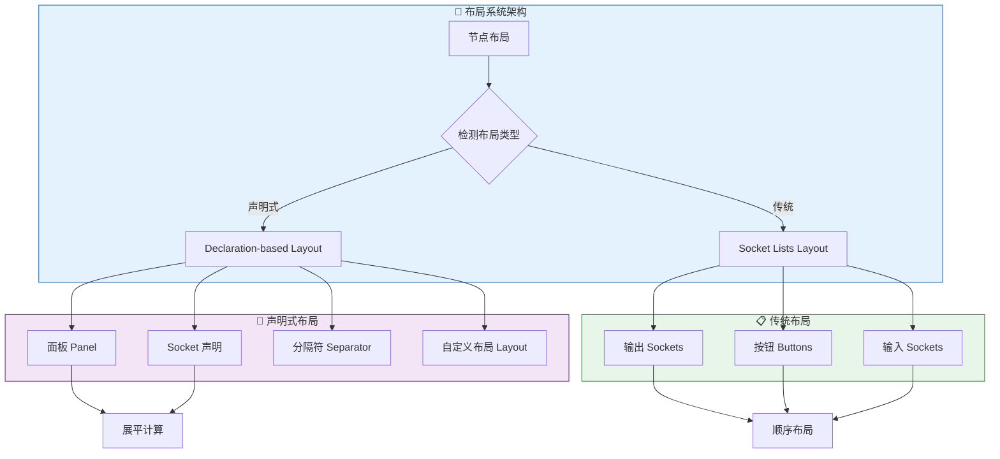

## 2. 声明式布局系统

### 2.1 核心数据结构

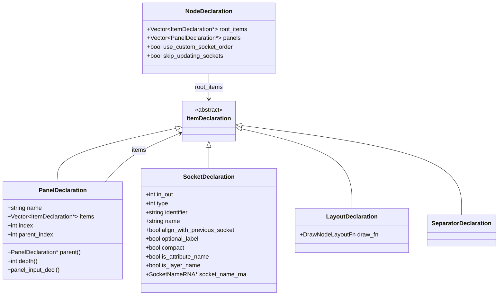

### 2.2 面板层级结构

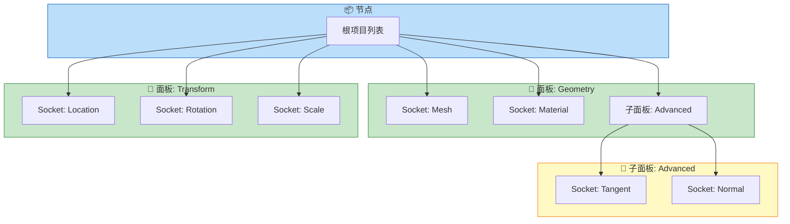

### 2.3 展平算法

声明式布局通过展平算法将层级结构转换为线性绘制列表：

```cpp
/* 展平节点项目类型 */
struct FlatNodeItem {
    std::variant<
        flat_item::Socket,
        flat_item::Separator,
        flat_item::PanelHeader,
        flat_item::PanelContentBegin,
        flat_item::PanelContentEnd,
        flat_item::Layout
    > item;

    flat_item::Type type() const {
        return std::visit([](auto &&item) { return item.type; }, this->item);
    }
};

/* 展平过程 */
static Vector<FlatNodeItem> make_flat_node_items(bNode &node)
{
    /* 1. 确定可见面板 */
    const int panels_num = node.num_panel_states;
    Array<bool> panel_visibility(panels_num, false);
    determine_visible_panels(node, panel_visibility);
    
    /* 2. 遍历根项目 */
    Vector<FlatNodeItem> items;
    for (const nodes::ItemDeclaration *item_decl : node.declaration()->root_items) {
        if (const auto *socket_decl = dynamic_cast<const nodes::SocketDeclaration *>(item_decl)) {
            add_flat_items_for_socket(node, *socket_decl, nullptr, prev_socket_decl, items);
        }
        else if (const auto *panel_decl = dynamic_cast<const nodes::PanelDeclaration *>(item_decl)) {
            add_flat_items_for_panel(node, *panel_decl, panel_visibility, items);
        }
        else if (dynamic_cast<const nodes::SeparatorDeclaration *>(item_decl)) {
            add_flat_items_for_separator(items);
        }
        else if (const auto *layout_decl = dynamic_cast<const nodes::LayoutDeclaration *>(item_decl)) {
            add_flat_items_for_layout(node, *layout_decl, items);
        }
    }
    return items;
}
```

### 2.4 面板可见性计算

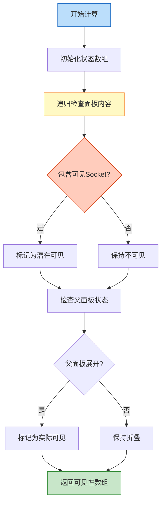

```cpp
/* 确定潜在可见面板 */
static void determine_potentially_visible_panels_recursive(
    const bNode &node, 
    const nodes::PanelDeclaration &panel_decl, 
    MutableSpan<bool> r_result)
{
    bool potentially_visible = false;
    for (const nodes::ItemDeclaration *item_decl : panel_decl.items) {
        if (const auto *socket_decl = dynamic_cast<const nodes::SocketDeclaration *>(item_decl)) {
            const bNodeSocket &socket = node.socket_by_decl(*socket_decl);
            potentially_visible |= socket.is_visible();
        }
        else if (const auto *sub_panel_decl = dynamic_cast<const nodes::PanelDeclaration *>(item_decl)) {
            determine_potentially_visible_panels_recursive(node, *sub_panel_decl, r_result);
            potentially_visible |= r_result[sub_panel_decl->index];
        }
    }
    r_result[panel_decl->index] = potentially_visible;
}

/* 确定实际可见面板 */
static void determine_visible_panels_impl_recursive(
    const bNode &node,
    const nodes::PanelDeclaration &panel_decl,
    const Span<bool> potentially_visible_states,
    MutableSpan<bool> r_result)
{
    if (!potentially_visible_states[panel_decl.index]) {
        return;  // 不包含可见Socket
    }
    r_result[panel_decl.index] = true;
    
    const bNodePanelState &panel_state = node.panel_states_array[panel_decl.index];
    if (panel_state.is_collapsed()) {
        return;  // 折叠状态，子面板不可见
    }
    
    for (const nodes::ItemDeclaration *item_decl : panel_decl.items) {
        if (const auto *sub_panel_decl = dynamic_cast<const nodes::PanelDeclaration *>(item_decl)) {
            determine_visible_panels_impl_recursive(node, *sub_panel_decl, 
                                                     potentially_visible_states, r_result);
        }
    }
}
```

## 3. 边距与间距系统

### 3.1 边距计算策略

边距系统采用上下文相关的计算策略，根据前后元素类型确定合适的间距：

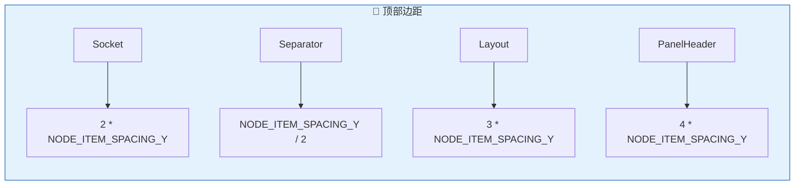

```cpp
/** 获取顶部边距 */
static float get_margin_from_top(const Span<FlatNodeItem> items)
{
    const FlatNodeItem &first_item = items[0];
    const flat_item::Type first_item_type = first_item.type();
    switch (first_item_type) {
        case flat_item::Type::Socket:
            return 2 * NODE_ITEM_SPACING_Y;
        case flat_item::Type::Separator:
            return NODE_ITEM_SPACING_Y / 2;
        case flat_item::Type::Layout:
            return 3 * NODE_ITEM_SPACING_Y;
        case flat_item::Type::PanelHeader:
            return 4 * NODE_ITEM_SPACING_Y;
        default:
            BLI_assert_unreachable();
            return 0;
    }
}

/** 获取元素间边距 */
static float get_margin_between_elements(const Span<FlatNodeItem> items, const int next_index)
{
    const FlatNodeItem &prev = items[next_index - 1];
    const FlatNodeItem &next = items[next_index];
    const Type prev_type = prev.type();
    const Type next_type = next.type();

    switch (prev_type) {
        case Type::Socket: {
            switch (next_type) {
                case Type::Socket:
                    return NODE_ITEM_SPACING_Y;
                case Type::Separator:
                    return 0;
                case Type::Layout:
                    return 2 * NODE_ITEM_SPACING_Y;
                case Type::PanelHeader:
                    return 3 * NODE_ITEM_SPACING_Y;
                case Type::PanelContentEnd:
                    return 2 * NODE_ITEM_SPACING_Y;
            }
            break;
        }
        case Type::PanelHeader: {
            switch (next_type) {
                case Type::Socket:
                    return 4 * NODE_ITEM_SPACING_Y;
                case Type::Separator:
                    return 3 * NODE_ITEM_SPACING_Y;
                case Type::Layout:
                    return 3 * NODE_ITEM_SPACING_Y;
                case Type::PanelHeader:
                    return 5 * NODE_ITEM_SPACING_Y;
                case Type::PanelContentBegin:
                    return 3 * NODE_ITEM_SPACING_Y;
            }
            break;
        }
        // ... 其他组合
    }
}
```

### 3.2 边距矩阵

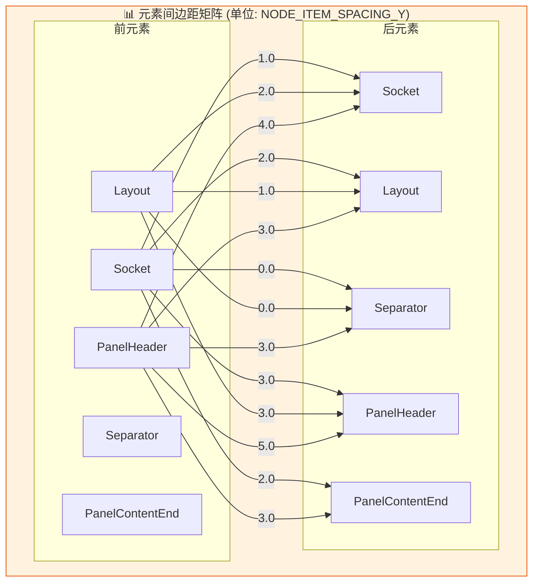

## 4. Socket 布局详解

### 4.1 Socket 对齐策略

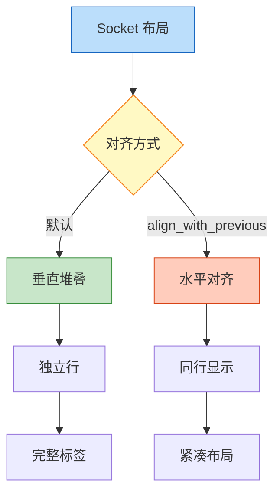

```cpp
static void add_flat_items_for_socket(
    bNode &node,
    const nodes::SocketDeclaration &socket_decl,
    const nodes::PanelDeclaration *panel_decl,
    const nodes::SocketDeclaration *prev_socket_decl,
    Vector<FlatNodeItem> &r_items)
{
    bNodeSocket &socket = node.socket_by_decl(socket_decl);
    if (!socket.is_visible()) {
        return;
    }
    
    /* 对齐策略 */
    if (socket_decl.align_with_previous_socket) {
        if (!prev_socket_decl || !node.socket_by_decl(*prev_socket_decl).is_visible()) {
            r_items.append({flat_item::Socket()});  // 需要新行
        }
        // 否则使用当前行
    }
    else {
        r_items.append({flat_item::Socket()});  // 总是新行
    }
    
    flat_item::Socket &item = std::get<flat_item::Socket>(r_items.last().item);
    if (socket_decl.in_out == SOCK_IN) {
        item.input = &socket;
    }
    else {
        item.output = &socket;
    }
    item.panel_decl = panel_decl;
}
```

### 4.2 多输入 Socket 布局

多输入 Socket 需要特殊处理以容纳多个链接：

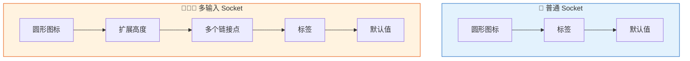

```cpp
/* 多输入 Socket 高度计算 */
float node_socket_calculate_height(const bNodeSocket &socket)
{
    const float base_height = NODE_SOCKSIZE;
    if (!(socket.flag & SOCK_MULTI_INPUT)) {
        return base_height;
    }
    const int total_inputs = std::max(1, socket.runtime->total_inputs);
    const float multi_input_height = (total_inputs - 1) * NODE_MULTI_INPUT_LINK_GAP;
    return base_height + multi_input_height;
}

/* 多输入链接位置计算 */
float2 node_link_calculate_multi_input_position(
    const float2 &socket_position,
    int index,
    int total_inputs)
{
    const int clamped_total_inputs = std::max(1, total_inputs);
    const float offset = (index - (clamped_total_inputs - 1) / 2.0f) * NODE_MULTI_INPUT_LINK_GAP;
    return float2(socket_position.x, socket_position.y - offset);
}
```

## 5. 面板布局系统

### 5.1 面板状态管理

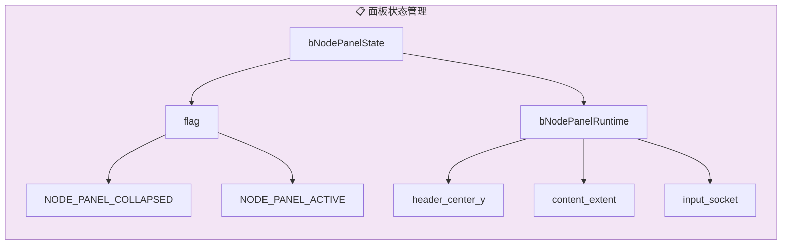

```cpp
/* 面板运行时数据 */
struct bNodePanelRuntime {
    std::optional<float> header_center_y;           // 标题中心 Y 坐标
    std::optional<ContentExtent> content_extent;    // 内容范围
    bNodeSocket *input_socket = nullptr;            // 面板输入 Socket
};

struct ContentExtent {
    float min_y;           // 内容底部
    float max_y;           // 内容顶部
    bool fill_node_end;    // 是否填充到节点底部
};

/* 面板状态 */
struct bNodePanelState {
    int flag;              // NODE_PANEL_COLLAPSED 等
};
```

### 5.2 面板绘制流程

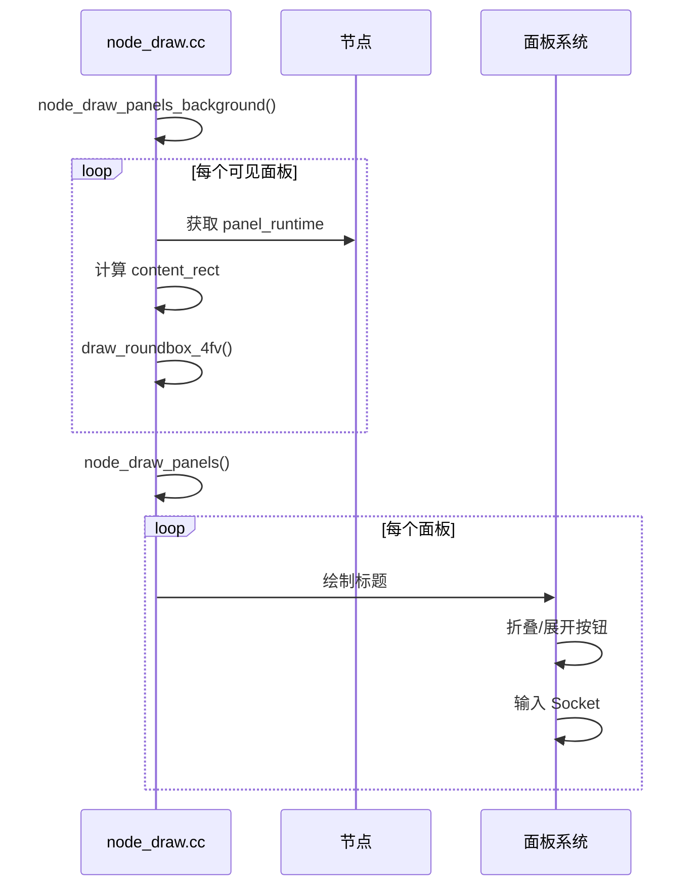

```cpp
static void node_draw_panels(bNodeTree &ntree, const bNode &node, ui::Block &block)
{
    const rctf &draw_bounds = node.runtime->draw_bounds;
    const nodes::NodeDeclaration &node_decl = *node.declaration();
    
    for (const int panel_i : node_decl.panels.index_range()) {
        const nodes::PanelDeclaration &panel_decl = *node_decl.panels[panel_i];
        const bke::bNodePanelRuntime &panel_runtime = node.runtime->panels[panel_i];
        bNodeSocket *input_socket = panel_runtime.input_socket;
        
        if (!panel_runtime.header_center_y.has_value()) {
            continue;  // 面板不可见
        }
        
        /* 绘制面板标题 */
        const float header_y = *panel_runtime.header_center_y;
        const float header_height = NODE_DYS;
        
        /* 折叠按钮 */
        const bNodePanelState &panel_state = node.panel_states_array[panel_i];
        const bool is_collapsed = panel_state.is_collapsed();
        
        /* 绘制面板标题文本 */
        const char *panel_label = CTX_IFACE_(panel_decl.translation_context, 
                                              panel_decl.name.c_str());
        
        /* 如果有输入 Socket，在标题中绘制 */
        if (input_socket) {
            // 绘制 Socket 图标和值
        }
    }
}
```

## 6. 折叠节点布局

### 6.1 折叠状态计算

```mermaid
flowchart TD
    A[折叠节点] --> B[计算最小高度]
    B --> C{输入数量 vs 输出数量}
    C -->|取最大值| D[高度 = max(inputs, outputs, 2) * dy]
    D --> E[重新分布 Socket 位置]
    E --> F[垂直居中排列]

    style A fill:#bbdefb,stroke:#1565c0
    style B fill:#fff9c4,stroke:#f57f17
    style F fill:#c8e6c9,stroke:#388e3c
```

```cpp
static void node_update_collapsed(bNode &node, ui::Block &block)
{
    int totin = 0, totout = 0;
    
    /* 计算可见 Socket 数量 */
    for (const bNodeSocket *socket : node.input_sockets()) {
        if (socket->is_visible()) {
            totin++;
        }
    }
    for (const bNodeSocket *socket : node.output_sockets()) {
        if (socket->is_visible()) {
            totout++;
        }
    }
    
    /* 计算折叠高度 */
    const float dy = NODE_DY * 0.5f;
    const float height = dy * std::max({totin, totout, 2}) + BASIS_RAD * 2.0f;
    const float offset = NODE_DY * -0.5f;  // 保持文本位置一致
    
    /* 设置绘制边界 */
    node.runtime->draw_bounds.xmin = loc.x;
    node.runtime->draw_bounds.xmax = loc.x + NODE_WIDTH(node);
    node.runtime->draw_bounds.ymax = loc.y + height * 0.5f + offset;
    node.runtime->draw_bounds.ymin = loc.y - height * 0.5f + offset;
    
    /* 重新分布输出 Socket */
    const float x = node.runtime->draw_bounds.xmax;
    float y = loc.y + dy * float(totout - 1) * 0.5f + offset;
    for (bNodeSocket *socket : node.output_sockets()) {
        if (socket->is_visible()) {
            socket->runtime->location = {x, y};
            y -= dy;
        }
    }
    
    /* 重新分布输入 Socket */
    // ... 类似输出
}
```

## 7. 布局常量定义

### 7.1 核心常量

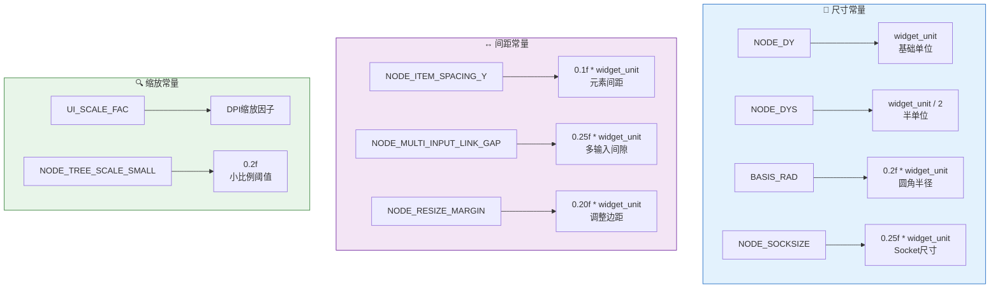

```cpp
/* node_intern.hh - 布局核心常量 */

/* 节点不使用 DPI - 视图缩放是灵活的 */
#define BASIS_RAD (0.2f * U.widget_unit)           // 圆角半径
#define NODE_DYS (U.widget_unit / 2)               // 半单位
#define NODE_DY U.widget_unit                       // 基础单位
#define NODE_ITEM_SPACING_Y (0.1f * U.widget_unit) // 元素间距

/* 节点尺寸计算 */
#define NODE_WIDTH(node) (node.width * UI_SCALE_FAC)
#define NODE_HEIGHT(node) (node.height * UI_SCALE_FAC)

/* Socket 相关 */
#define NODE_SOCKSIZE (0.25f * U.widget_unit)           // Socket 尺寸
#define NODE_MULTI_INPUT_LINK_GAP (0.25f * U.widget_unit) // 多输入间隙

/* 交互相关 */
#define NODE_MARGIN_X (1.2f * U.widget_unit)      // 水平边距
#define NODE_RESIZE_MARGIN (0.20f * U.widget_unit) // 调整大小边距
```

## 8. 响应式布局特性

### 8.1 缩放适配

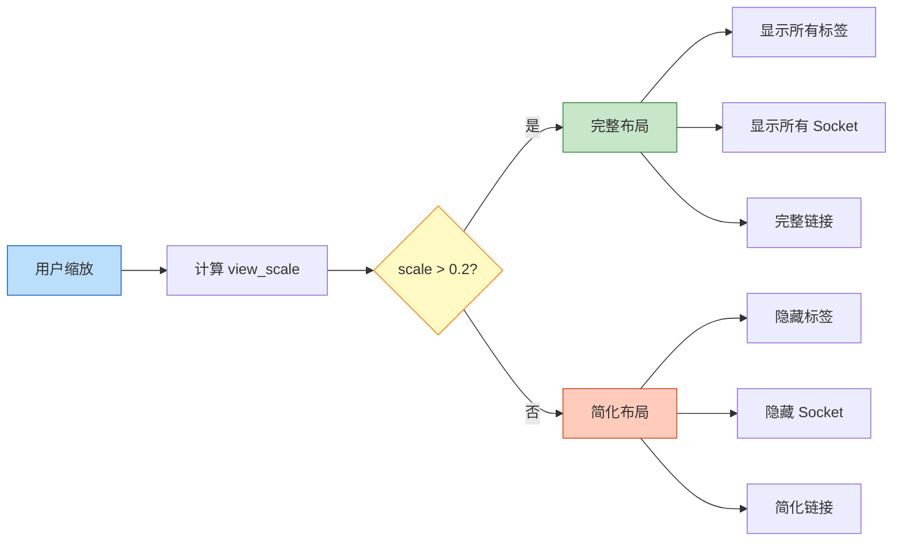

```cpp
/* 小比例时不绘制细节 */
#define NODE_TREE_SCALE_SMALL 0.2f

static bool draw_node_details(const SpaceNode &snode)
{
    return node_tree_view_scale(snode) > NODE_TREE_SCALE_SMALL * UI_INV_SCALE_FAC;
}

/* 节点树缩放比例 */
static float node_tree_view_scale(const SpaceNode &snode)
{
    return (1.0f / snode.runtime->aspect) * UI_SCALE_FAC;
}
```

### 8.2 动态宽度计算

```cpp
/* 节点宽度根据内容动态调整 */
#define NODE_WIDTH(node) (node.width * UI_SCALE_FAC)

/* 布局宽度计算 */
ui::Layout &layout = ui::block_layout(
    &block,
    ui::LayoutDirection::Vertical,
    ui::LayoutType::Panel,
    loc.x + NODE_DYS,                    // 左边缘 + 边距
    locy,
    NODE_WIDTH(node) - NODE_DY,          // 可用宽度
    NODE_DY,                             // 默认高度
    0,
    ui::style_get_dpi()
);
```

## 9. 布局系统总结

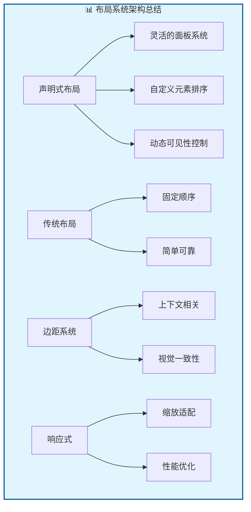

Blender 节点布局系统通过精心设计的双重架构，既保持了向后兼容性，又提供了现代化的声明式布局能力。其边距系统和响应式设计确保了在各种缩放级别下都能提供良好的用户体验。
