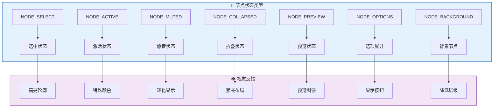
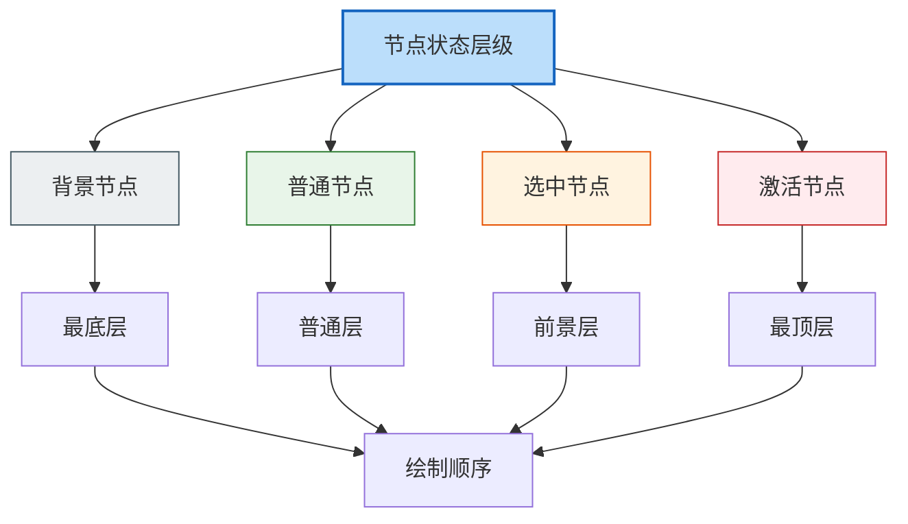
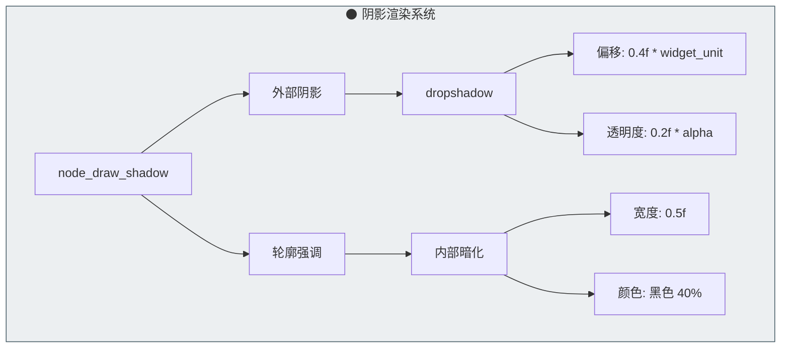
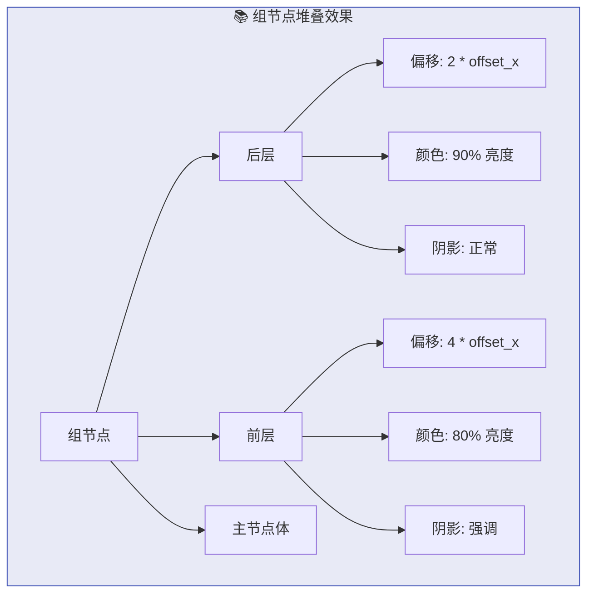
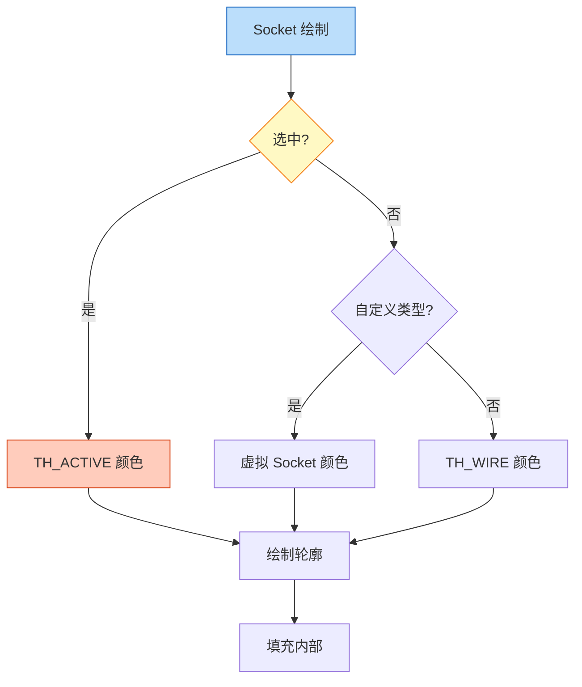
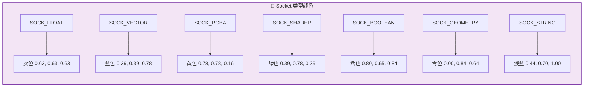
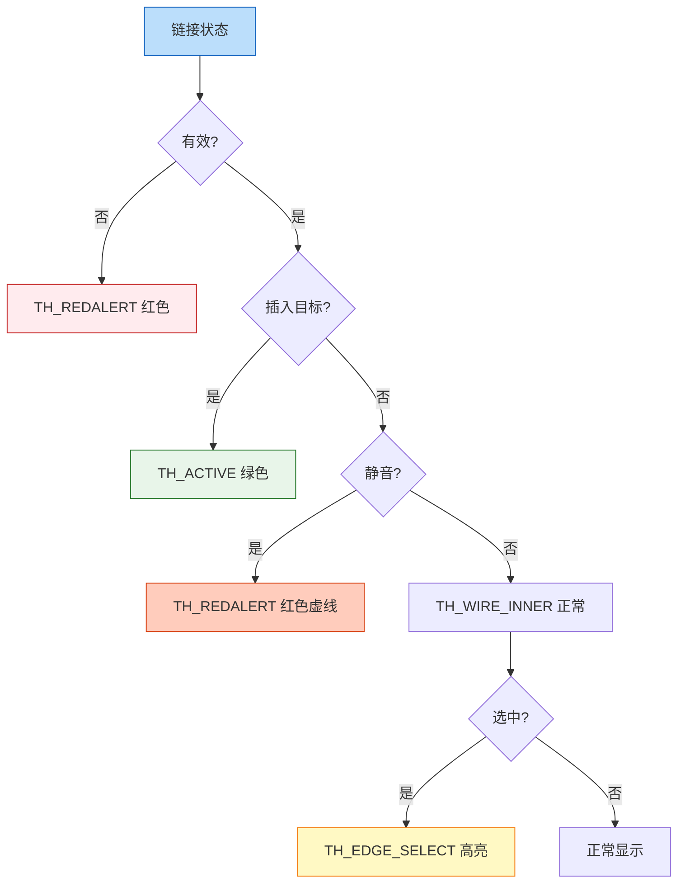
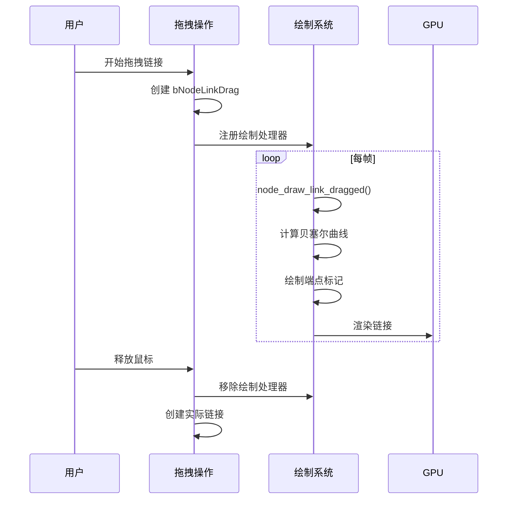
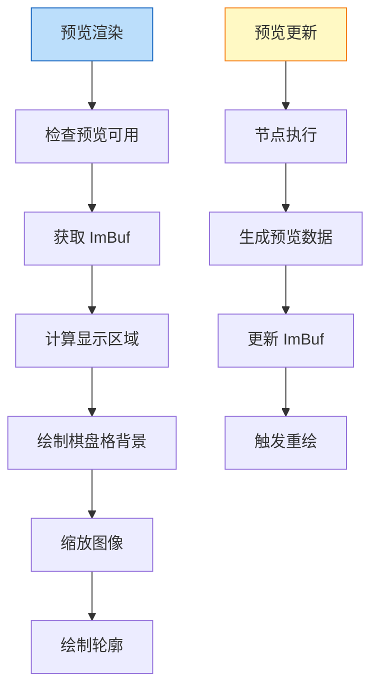
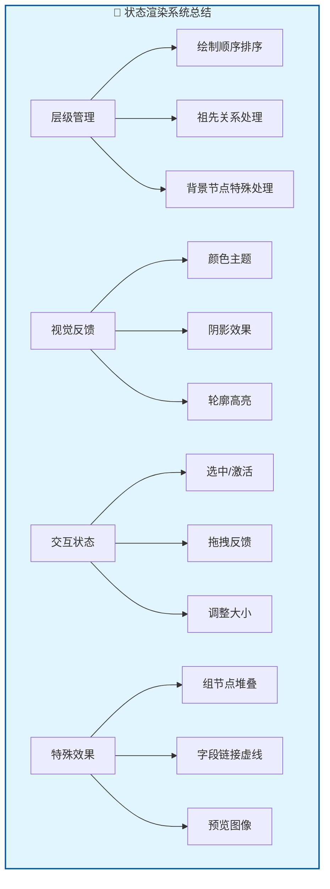

# Blender 节点交互与状态渲染

## 1. 状态系统概述

节点编辑器的状态渲染系统负责将节点的各种交互状态（选中、激活、静音等）以视觉方式呈现给用户。



## 2. 选中与激活状态

### 2.1 状态层级



### 2.2 绘制顺序排序

```cpp
/* 节点深度比较函数 - 决定绘制顺序 */
static bool compare_node_depth(const bNode *a, const bNode *b)
{
    /* 检查选中状态（包括父节点） */
    bool a_select = (a->flag & NODE_SELECT) != 0;
    bool b_select = (b->flag & NODE_SELECT) != 0;
    bool a_active = (a->flag & NODE_ACTIVE) != 0;
    bool b_active = (b->flag & NODE_ACTIVE) != 0;
    
    /* 检查祖先关系 */
    for (bNode *parent = a->parent; parent; parent = parent->parent) {
        if (parent == b) {
            return false;  // B 是 A 的祖先，B 始终在 A 后面
        }
        if (parent->flag & NODE_ACTIVE) a_active = true;
        if (parent->flag & NODE_SELECT) a_select = true;
    }
    
    /* 背景节点优先级 */
    if ((a->flag & NODE_BACKGROUND) && !(b->flag & NODE_BACKGROUND)) {
        return true;  // A 是背景，在后面
    }
    if ((b->flag & NODE_BACKGROUND) && !(a->flag & NODE_BACKGROUND)) {
        return false;  // B 是背景，在后面
    }
    
    /* 激活状态优先级最高 */
    if (a_active && !b_active) return false;
    if (b_active && !a_active) return true;
    
    /* 选中状态次之 */
    if (!b_select && (a_active || a_select)) return false;
    if (!a_select && (b_active || b_select)) return true;
    
    return false;  // 保持原顺序
}

/* 更新绘制顺序 */
void tree_draw_order_update(bNodeTree &ntree)
{
    Array<bNode *> sort_nodes = ntree.all_nodes();
    std::ranges::sort(sort_nodes, [](bNode *a, bNode *b) { 
        return a->ui_order < b->ui_order; 
    });
    std::stable_sort(sort_nodes.begin(), sort_nodes.end(), compare_node_depth);
    for (const int i : sort_nodes.index_range()) {
        sort_nodes[i]->ui_order = i;
    }
}
```

### 2.3 视觉渲染实现

```cpp
/* 节点颜色根据状态确定 */
static int node_get_colorid(TreeDrawContext &tree_draw_ctx, const bNode &node)
{
    const int nclass = (node.typeinfo->ui_class == nullptr) ? 
                       node.typeinfo->nclass : 
                       node.typeinfo->ui_class(&node);
    
    switch (nclass) {
        case NODE_CLASS_INPUT:
            return TH_NODE_INPUT;
        case NODE_CLASS_OUTPUT: {
            if (node.type_legacy == GEO_NODE_VIEWER) {
                return &node == tree_draw_ctx.active_geometry_nodes_viewer ? 
                       TH_NODE_OUTPUT : TH_NODE;
            }
            const bool is_output_node = (node.flag & NODE_DO_OUTPUT) ||
                                        (node.type_legacy == CMP_NODE_OUTPUT_FILE);
            return is_output_node ? TH_NODE_OUTPUT : TH_NODE;
        }
        case NODE_CLASS_CONVERTER:
            return TH_NODE_CONVERTER;
        case NODE_CLASS_OP_COLOR:
            return TH_NODE_COLOR;
        case NODE_CLASS_OP_VECTOR:
            return TH_NODE_VECTOR;
        case NODE_CLASS_OP_FILTER:
            return TH_NODE_FILTER;
        case NODE_CLASS_GROUP:
            return TH_NODE_GROUP;
        case NODE_CLASS_SHADER:
            return TH_NODE_SHADER;
        case NODE_CLASS_GEOMETRY:
            return TH_NODE_GEOMETRY;
        case NODE_CLASS_LAYOUT:
            return node.is_frame() ? TH_NODE_FRAME : TH_NODE;
        default:
            return TH_NODE;
    }
}
```

## 3. 节点视觉效果

### 3.1 阴影效果



```cpp
static void node_draw_shadow(const SpaceNode &snode,
                             const bNode &node,
                             const float radius,
                             const float alpha)
{
    const rctf &rct = node.runtime->draw_bounds;
    draw_roundbox_corner_set(ui::CNR_ALL);
    
    /* 外部阴影 */
    const float shadow_width = 0.4f * U.widget_unit;
    const float shadow_alpha = 0.2f * alpha;
    ui::draw_dropshadow(&rct, radius, shadow_width, snode.runtime->aspect, shadow_alpha);
    
    /* 轮廓强调 - 内部轻微暗化 */
    const float color[4] = {0.0f, 0.0f, 0.0f, 0.4f};
    rctf rect{};
    rect.xmin = rct.xmin - 0.5f;
    rect.xmax = rct.xmax + 0.5f;
    rect.ymin = rct.ymin - 0.5f;
    rect.ymax = rct.ymax + 0.5f;
    ui::draw_roundbox_4fv(&rect, false, radius + 0.5f, color);
}
```

### 3.2 组节点指示器



```cpp
static void node_draw_node_group_indicator(const SpaceNode &snode,
                                           const bNode &node,
                                           const rctf &rect,
                                           const float radius,
                                           const float color[4])
{
    if (node.type_legacy != NODE_GROUP) {
        return;
    }
    
    const bool is_selected = node.flag & NODE_SELECT;
    const bool is_collapsed = node.flag & NODE_COLLAPSED;
    const float offset_x = 3.6f * UI_SCALE_FAC;
    const float offset_y = 2.4f * UI_SCALE_FAC;
    const float dim_collapsed = is_collapsed ? 0.2f : 0.0f;
    
    /* 后层 */
    {
        const rctf rect_group_back = {
            rect.xmin + offset_x * 2,
            rect.xmax - offset_x * 2,
            rect.ymin - offset_y - U.pixelsize,
            rect.ymin + (U.pixelsize * 2),
        };
        
        float fill_color_back[4];
        copy_v4_v4(fill_color_back, color);
        mul_v3_fl(fill_color_back, 0.9f - dim_collapsed);
        
        ui::draw_roundbox_4fv_ex(&rect_group_back,
                                 fill_color_back,
                                 nullptr,
                                 0.0f,
                                 outline_color_back,
                                 outline_width,
                                 radius);
    }
    
    /* 前层 */
    {
        const rctf rect_group_front = {
            rect.xmin + offset_x * 4,
            rect.xmax - offset_x * 4,
            rect.ymin - (offset_y * 2) - U.pixelsize,
            rect.ymin - offset_y + (U.pixelsize * 2),
        };
        
        float fill_color_front[4];
        copy_v4_v4(fill_color_front, color);
        mul_v3_fl(fill_color_front, 0.8f - dim_collapsed);
        
        ui::draw_roundbox_4fv_ex(&rect_group_front,
                                 fill_color_front,
                                 nullptr,
                                 0.0f,
                                 outline_color_front,
                                 outline_width,
                                 radius);
    }
}
```

## 4. Socket 状态渲染

### 4.1 Socket 选中状态



```cpp
static void node_socket_outline_color_get(const bool selected,
                                          const int socket_type,
                                          float r_outline_color[4])
{
    /* 使用节点编辑器主题确保一致性 */
    if (selected) {
        ui::theme::get_color_type_4fv(TH_ACTIVE, SPACE_NODE, r_outline_color);
    }
    else if (socket_type == SOCK_CUSTOM) {
        /* 虚拟 Socket 使用灰色轮廓 */
        copy_v4_v4(r_outline_color, virtual_node_socket_outline_color);
    }
    else {
        ui::theme::get_color_type_4fv(TH_WIRE, SPACE_NODE, r_outline_color);
        r_outline_color[3] = 1.0f;
    }
}

void node_socket_draw(bNodeSocket *sock, const rcti *rect, const float color[4], float scale)
{
    const float radius = NODE_SOCKSIZE * scale;
    const float2 center = {BLI_rcti_cent_x_fl(rect), BLI_rcti_cent_y_fl(rect)};
    const rctf draw_rect = {
        center.x - radius,
        center.x + radius,
        center.y - radius,
        center.y + radius,
    };
    
    ColorTheme4f outline_color;
    node_socket_outline_color_get(sock->flag & SELECT, sock->type, outline_color);
    
    node_draw_nodesocket(&draw_rect,
                         color,
                         outline_color,
                         NODE_SOCKET_OUTLINE * scale,
                         sock->display_shape,
                         1.0 / scale);
}
```

### 4.2 Socket 颜色系统



```cpp
/* 标准 Socket 颜色映射 */
static const float std_node_socket_colors[][4] = {
    {0.63, 0.63, 0.63, 1.0}, /* SOCK_FLOAT - 灰色 */
    {0.39, 0.39, 0.78, 1.0}, /* SOCK_VECTOR - 蓝色 */
    {0.78, 0.78, 0.16, 1.0}, /* SOCK_RGBA - 黄色 */
    {0.39, 0.78, 0.39, 1.0}, /* SOCK_SHADER - 绿色 */
    {0.80, 0.65, 0.84, 1.0}, /* SOCK_BOOLEAN - 紫色 */
    {0.0, 0.0, 0.0, 0.0},    /* 未使用 */
    {0.35, 0.55, 0.36, 1.0}, /* SOCK_INT - 深绿 */
    {0.44, 0.70, 1.00, 1.0}, /* SOCK_STRING - 浅蓝 */
    {0.93, 0.62, 0.36, 1.0}, /* SOCK_OBJECT - 橙色 */
    {0.39, 0.22, 0.39, 1.0}, /* SOCK_IMAGE - 紫红 */
    {0.00, 0.84, 0.64, 1.0}, /* SOCK_GEOMETRY - 青色 */
    {0.96, 0.96, 0.96, 1.0}, /* SOCK_COLLECTION - 白色 */
    {0.62, 0.31, 0.64, 1.0}, /* SOCK_TEXTURE - 粉紫 */
    {0.92, 0.46, 0.51, 1.0}, /* SOCK_MATERIAL - 粉红 */
    {0.65, 0.39, 0.78, 1.0}, /* SOCK_ROTATION - 紫色 */
    {0.40, 0.40, 0.40, 1.0}, /* SOCK_MENU - 深灰 */
    {0.72, 0.20, 0.52, 1.0}, /* SOCK_MATRIX - 玫红 */
};
```

## 5. 链接状态渲染

### 5.1 链接样式状态



```cpp
void node_draw_link(const bContext &C,
                    const View2D &v2d,
                    const SpaceNode &snode,
                    const bNodeLink &link,
                    const bool selected)
{
    int th_col1 = TH_WIRE_INNER, th_col2 = TH_WIRE_INNER, th_col3 = TH_WIRE;
    
    /* 检查链接有效性 */
    if (link.fromsock == nullptr && link.tosock == nullptr) {
        return;
    }
    if (link.tosock->flag & SOCK_UNAVAIL || link.fromsock->flag & SOCK_UNAVAIL) {
        return;
    }
    
    if (link.flag & NODE_LINK_VALID) {
        /* 特殊指示链接 - 放置节点时 */
        if (link.flag & NODE_LINK_INSERT_TARGET && 
            !(link.flag & NODE_LINK_INSERT_TARGET_INVALID)) {
            th_col1 = th_col2 = TH_ACTIVE;
        }
        /* 静音链接 */
        else if (link.flag & NODE_LINK_MUTED) {
            th_col1 = th_col2 = TH_REDALERT;
        }
    }
    else {
        /* 无效链接 */
        th_col1 = th_col2 = th_col3 = TH_REDALERT;
    }
    
    node_draw_link_bezier(C, v2d, snode, link, th_col1, th_col2, th_col3, selected);
}
```

### 5.2 字段链接样式

几何节点中的字段链接使用虚线样式：

```cpp
static bool node_link_is_field_link(const SpaceNode &snode, const bNodeLink &link)
{
    const bNodeTree &tree = *snode.edittree;
    if (tree.type != NTREE_GEOMETRY) {
        return false;
    }
    if (!link.fromsock) {
        return false;
    }
    if (!nodes::socket_type_supports_fields(eNodeSocketDatatype(link.fromsock->type))) {
        return false;
    }
    if (!link.fromsock->may_be_field()) {
        return false;
    }
    return true;
}

static NodeLinkDrawConfig nodelink_get_draw_config(...)
{
    NodeLinkDrawConfig draw_config;
    
    const bool field_link = node_link_is_field_link(snode, link);
    const bool gizmo_link = node_link_is_gizmo_link(snode, link);
    
    /* 字段链接使用虚线 */
    draw_config.dash_factor = field_link ? 0.75f : 1.0f;
    draw_config.dash_length = 10.0f * UI_SCALE_FAC;
    
    /* 字段链接稍细 */
    draw_config.thickness = LINK_WIDTH * max_ff(UI_SCALE_FAC * scale, 1.0f) *
                            (field_link ? 0.7f : 1.0f);
    
    /* Gizmo 链接特殊标记 */
    draw_config.has_back_link = gizmo_link;
    
    return draw_config;
}
```

## 6. 交互反馈

### 6.1 拖拽链接



```cpp
void node_draw_link_dragged(const bContext &C,
                            const View2D &v2d,
                            const SpaceNode &snode,
                            const bNodeLink &link)
{
    if (link.fromsock == nullptr && link.tosock == nullptr) {
        return;
    }
    
    /* 使用光标位置作为动态端点 */
    const std::array<float2, 4> points = node_link_bezier_points_dragged(snode, link);
    
    const NodeLinkDrawConfig draw_config = nodelink_get_draw_config(
        C, v2d, snode, link, TH_WIRE_INNER, TH_WIRE_INNER, TH_WIRE, true);
    
    /* 绘制端点标记轮廓 */
    node_draw_link_end_markers(link, draw_config, points, true);
    /* 绘制链接 */
    node_draw_link_bezier_ex(snode, draw_config, points);
    /* 绘制端点标记填充 */
    node_draw_link_end_markers(link, draw_config, points, false);
}
```

### 6.2 调整大小反馈

```cpp
NodeResizeDirection node_get_resize_direction(const SpaceNode &snode,
                                              const bNode *node,
                                              const int x,
                                              const int y)
{
    const bool node_is_collapsed = node->flag & NODE_COLLAPSED;
    const float size = NODE_RESIZE_MARGIN * math::max(snode.runtime->aspect, 1.0f) *
                       (node_is_collapsed ? 3.0f : 1.0f);
    
    if (node->is_frame()) {
        /* 框架节点四边可调整 */
        NodeFrame *data = static_cast<NodeFrame *>(node->storage);
        if (!(data->flag & NODE_FRAME_RESIZEABLE)) {
            return NODE_RESIZE_NONE;
        }
        // ... 检查四边
    }
    
    const rctf &bounds = node->runtime->draw_bounds;
    NodeResizeDirection dir = NODE_RESIZE_NONE;
    
    /* 右边 */
    if (x >= bounds.xmax - size && x < bounds.xmax && 
        y >= bounds.ymin && y < bounds.ymax) {
        dir |= NODE_RESIZE_RIGHT;
    }
    /* 左边 */
    if (x >= bounds.xmin && x < bounds.xmin + size && 
        y >= bounds.ymin && y < bounds.ymax) {
        dir |= NODE_RESIZE_LEFT;
    }
    
    return dir;
}
```

## 7. 预览系统

### 7.1 预览图像渲染



```cpp
static void node_draw_preview(const Scene *scene, ImBuf *preview, const rctf *prv)
{
    float xrect = BLI_rctf_size_x(prv);
    float yrect = BLI_rctf_size_y(prv);
    float xscale = xrect / float(preview->x);
    float yscale = yrect / float(preview->y);
    
    /* 统一缩放并居中 */
    rctf draw_rect = *prv;
    float scale;
    if (xscale < yscale) {
        float offset = 0.5f * (yrect - float(preview->y) * xscale);
        draw_rect.ymin += offset;
        draw_rect.ymax -= offset;
        scale = xscale;
    } else {
        float offset = 0.5f * (xrect - float(preview->x) * yscale);
        draw_rect.xmin += offset;
        draw_rect.xmax -= offset;
        scale = yscale;
    }
    
    /* 绘制棋盘格背景 */
    node_draw_preview_background(&draw_rect);
    
    /* 绘制预览图像 */
    GPU_blend(GPU_BLEND_ALPHA);
    ED_draw_imbuf(preview,
                  draw_rect.xmin,
                  draw_rect.ymin,
                  false,
                  &scene->view_settings,
                  &scene->display_settings,
                  scale,
                  scale);
    GPU_blend(GPU_BLEND_NONE);
    
    /* 绘制轮廓 */
    float black[4] = {0.0f, 0.0f, 0.0f, 1.0f};
    draw_roundbox_corner_set(ui::CNR_ALL);
    ui::draw_roundbox_4fv(&draw_rect, false, BASIS_RAD / 2, black);
}
```

## 8. 工具提示系统

### 8.1 Socket 工具提示

```cpp
static void node_socket_add_tooltip_in_node_editor(const bNodeSocket &sock, ui::Layout &layout)
{
    uiLayoutSetTooltipCustomFunc(
        &layout,
        [](bContext &C, ui::TooltipData &tip, ui::Button *but, void *argN) {
            const SpaceNode &snode = *CTX_wm_space_node(&C);
            const bNodeTree &ntree = *snode.edittree;
            const int index_in_tree = POINTER_AS_INT(argN);
            ntree.ensure_topology_cache();
            const bNodeSocket &socket = *ntree.all_sockets()[index_in_tree];
            build_socket_tooltip(tip, C, but, ntree, socket);
        },
        POINTER_FROM_INT(sock.index_in_tree()),
        nullptr,
        nullptr);
}

void build_socket_tooltip(ui::TooltipData &tip_data,
                          bContext &C,
                          ui::Button *but,
                          const bNodeTree &tree,
                          const bNodeSocket &socket)
{
    /* 添加 Socket 名称 */
    tip_data.title = bke::node_socket_label(socket);
    
    /* 添加描述 */
    const char *description = node_socket_get_description(&socket);
    if (description) {
        tip_data.description = description;
    }
    
    /* 添加类型信息 */
    tip_data.fields.append({"Type", socket.typeinfo->label});
    
    /* 添加默认值 */
    if (!(socket.flag & SOCK_HIDE_VALUE) && !socket.is_logically_linked()) {
        /* 显示当前值 */
    }
}
```

## 9. 状态渲染总结



Blender 节点编辑器的状态渲染系统通过精心设计的视觉反馈机制，为用户提供了清晰直观的交互体验。从基础的选中高亮到复杂的组节点堆叠效果，每个细节都经过精心打磨，确保用户能够准确理解当前的操作状态。
