# Blender 节点绘制设计思想与最佳实践

## 1. 架构设计哲学

### 1.1 分层架构原则

Blender 节点绘制系统遵循严格的分层架构，每一层都有明确的职责边界：

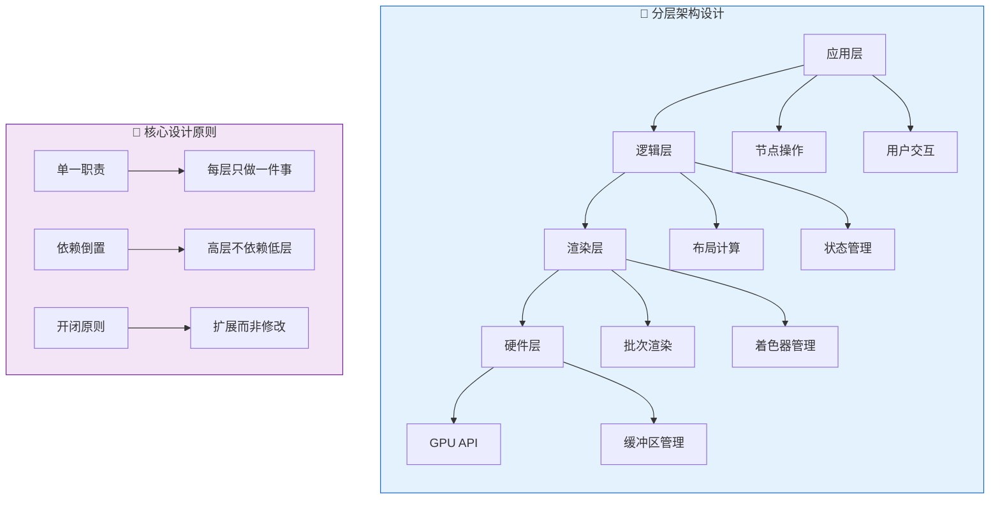

### 1.2 关注点分离

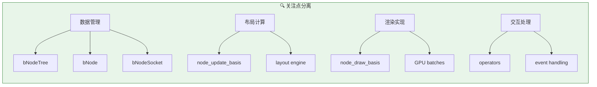

## 2. 性能优化策略

### 2.1 批次渲染模式

批次渲染是节点绘制系统最重要的性能优化手段：

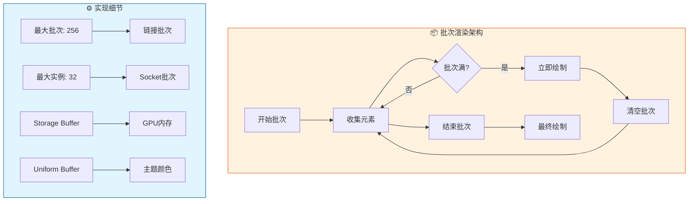

```cpp
/* 链接批次渲染实现 */
#define NODELINK_GROUP_SIZE 256

static struct {
    gpu::Batch *batch;
    gpu::StorageBuf *link_buf;
    uint count;
    bool enabled;
    NodeLinkData data[NODELINK_GROUP_SIZE];
} g_batch_link;

/* 批次添加元素 */
static void nodelink_batch_add_link(const SpaceNode &snode,
                                    const std::array<float2, 4> &points,
                                    const NodeLinkDrawConfig &draw_config)
{
    NodeLinkData &data = g_batch_link.data[g_batch_link.count++];
    // 填充数据...
    
    if (g_batch_link.count == NODELINK_GROUP_SIZE) {
        nodelink_batch_draw(snode);  // 批次满，立即绘制
    }
}

/* 批次绘制 */
static void nodelink_batch_draw(const SpaceNode &snode)
{
    if (g_batch_link.count == 0) return;
    
    GPU_storagebuf_update(g_batch_link.link_buf, g_batch_link.data);
    GPU_batch_program_set_builtin(g_batch_link.batch, GPU_SHADER_2D_NODELINK);
    GPU_batch_uniformbuf_bind(g_batch_link.batch, "link_uniforms", ubo);
    GPU_storagebuf_bind(g_batch_link.link_buf, 0);
    GPU_batch_draw_instance_range(g_batch_link.batch, 0, g_batch_link.count);
    
    nodelink_batch_reset();
}
```

### 2.2 视口裁剪优化

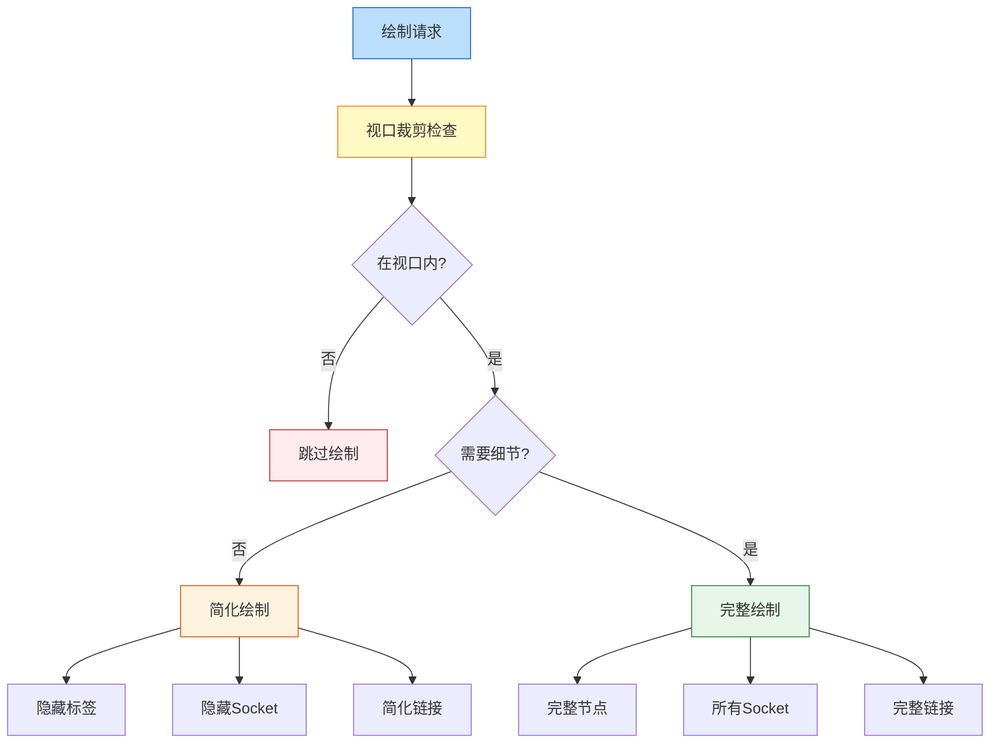

```cpp
/* 视口裁剪检查 */
static bool node_link_draw_is_visible(const View2D &v2d, const std::array<float2, 4> &points)
{
    /* 完全在视口右侧 */
    if (min_ffff(points[0].x, points[1].x, points[2].x, points[3].x) > v2d.cur.xmax) {
        return false;
    }
    /* 完全在视口左侧 */
    if (max_ffff(points[0].x, points[1].x, points[2].x, points[3].x) < v2d.cur.xmin) {
        return false;
    }
    return true;
}

/* 细节层次控制 */
#define NODE_TREE_SCALE_SMALL 0.2f

static bool draw_node_details(const SpaceNode &snode)
{
    return node_tree_view_scale(snode) > NODE_TREE_SCALE_SMALL * UI_INV_SCALE_FAC;
}
```

## 3. 可扩展性设计

### 3.1 声明式布局系统

现代节点系统采用声明式布局，提供强大的可扩展性：

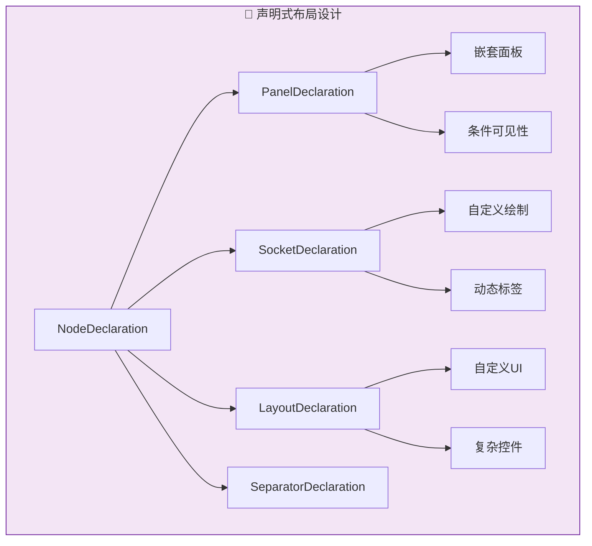

```cpp
/* 声明式布局示例 */
class MyNode : public Node {
public:
    void declare(NodeDeclarationBuilder &b) override
    {
        /* 输入面板 */
        b.add_panel("Input").add_input<decl::Geometry>("Geometry");
        
        /* 参数面板 */
        b.add_panel("Parameters")
            .add_input<decl::Float>("Scale")
            .add_input<decl::Vector>("Offset")
            .add_separator()
            .add_input<decl::Bool>("Use Normals");
        
        /* 高级面板（可折叠）*/
        auto &advanced = b.add_panel("Advanced");
        advanced.add_input<decl::Int>("Iterations");
        advanced.add_input<decl::Float>("Threshold");
        
        /* 输出 */
        b.add_output<decl::Geometry>("Geometry");
    }
};
```

### 3.2 插件扩展机制

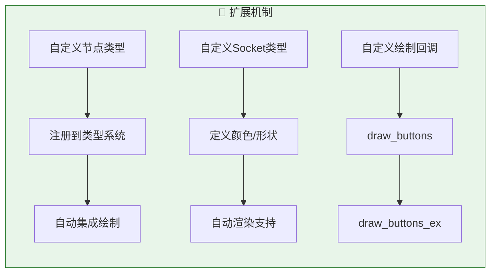

```cpp
/* 自定义节点绘制回调 */
static void node_shader_buts_tex_image(ui::Layout &layout, bContext *C, PointerRNA *ptr)
{
    PointerRNA imaptr = RNA_pointer_get(ptr, "image");
    PointerRNA iuserptr = RNA_pointer_get(ptr, "image_user");
    
    layout.context_ptr_set("image_user", &iuserptr);
    template_id(&layout, C, ptr, "image", "IMAGE_OT_new", "IMAGE_OT_open", nullptr);
    layout.prop(ptr, "interpolation", DEFAULT_FLAGS, "", ICON_NONE);
    layout.prop(ptr, "projection", DEFAULT_FLAGS, "", ICON_NONE);
    
    if (RNA_enum_get(ptr, "projection") == SHD_PROJ_BOX) {
        layout.prop(ptr, "projection_blend", DEFAULT_FLAGS, IFACE_("Blend"), ICON_NONE);
    }
}

/* 注册绘制回调 */
static void node_shader_set_butfunc(bke::bNodeType *ntype)
{
    switch (ntype->type_legacy) {
        case SH_NODE_TEX_IMAGE:
            ntype->draw_buttons = node_shader_buts_tex_image;
            ntype->draw_buttons_ex = node_shader_buts_tex_image_ex;
            break;
        // ... 其他类型
    }
}
```

## 4. 代码组织最佳实践

### 4.1 文件组织原则

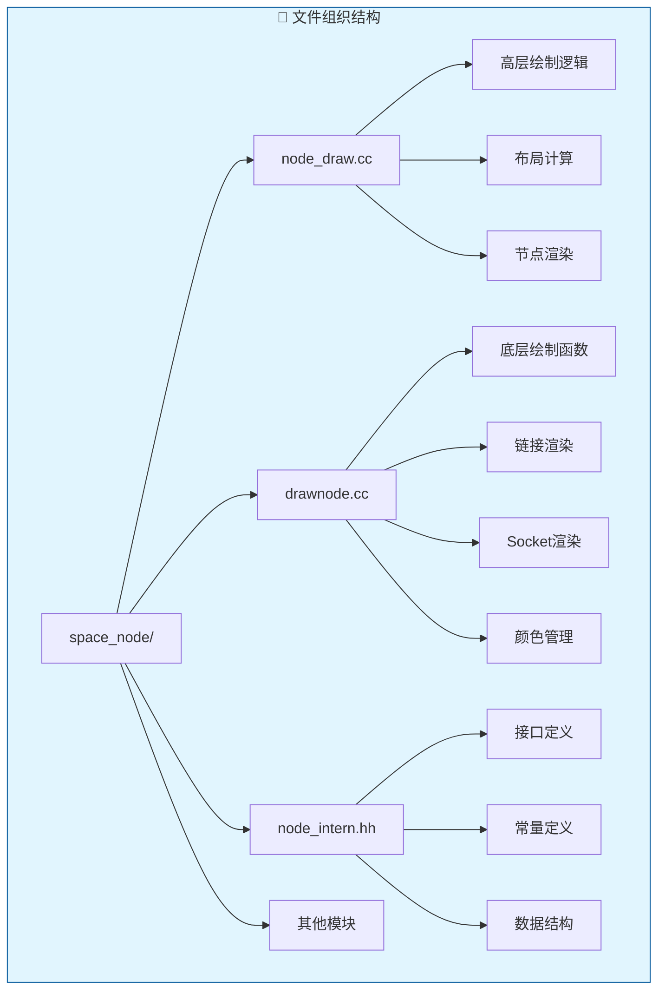

### 4.2 命名规范

| 前缀/模式 | 用途 | 示例 |
|-----------|------|------|
| `node_` | 节点相关函数 | `node_draw_basis`, `node_update_basis` |
| `nodelink_` | 链接相关函数 | `nodelink_batch_start`, `nodelink_batch_draw` |
| `tree_` | 树级别操作 | `tree_draw_order_update`, `tree_update` |
| `std_` | 标准实现 | `std_node_socket_draw`, `std_node_socket_colors` |
| `ED_` | 编辑器接口 | `ED_node_init_butfuncs`, `ED_node_sample_set` |

### 4.3 错误处理策略

```cpp
/* 防御性编程示例 */
static void node_draw_panels_background(const bNode &node)
{
    /* 前置条件检查 */
    BLI_assert(is_node_panels_supported(node));
    if (!node.declaration()) {
        return;
    }
    
    const rctf &draw_bounds = node.runtime->draw_bounds;
    
    for (const int panel_i : node.declaration()->panels.index_range()) {
        const bke::bNodePanelRuntime &panel_runtime = node.runtime->panels[panel_i];
        
        /* 运行时状态检查 */
        if (!panel_runtime.content_extent.has_value()) {
            continue;  // 优雅跳过，而非崩溃
        }
        
        /* 安全计算 */
        const rctf content_rect = {
            draw_bounds.xmin,
            draw_bounds.xmax,
            panel_runtime.content_extent->min_y,
            panel_runtime.content_extent->max_y
        };
        
        /* 有效性验证 */
        if (!BLI_rctf_is_valid(&content_rect)) {
            continue;
        }
        
        ui::draw_roundbox_4fv(&content_rect, true, BASIS_RAD, panel_color);
    }
}
```

## 5. 内存管理策略

### 5.1 运行时数据管理

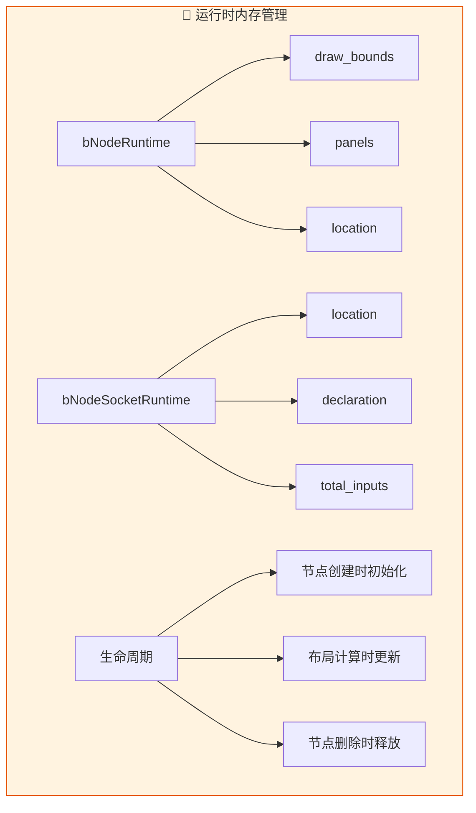

```cpp
/* 运行时数据结构 */
struct bNodeRuntime {
    rctf draw_bounds;                    // 绘制边界（缓存）
    Vector<bke::bNodePanelRuntime> panels;  // 面板运行时数据
};

struct bNodeSocketRuntime {
    float2 location;                     // Socket 位置（缓存）
    const nodes::SocketDeclaration *declaration;  // 声明引用
    int total_inputs;                    // 多输入链接数
};

/* TreeDrawContext 内存管理 */
struct TreeDrawContext {
    // ... 其他成员
    
    ~TreeDrawContext()
    {
        /* 清理动态分配的 tooltip 数据 */
        for (MutableSpan<NodeExtraInfoRow> rows : this->extra_info_rows_per_node) {
            for (NodeExtraInfoRow &row : rows) {
                if (row.tooltip_fn_free_arg) {
                    BLI_assert(row.tooltip_fn_copy_arg);
                    row.tooltip_fn_free_arg(row.tooltip_fn_arg);
                }
            }
        }
    }
};
```

## 6. 主题系统集成

### 6.1 颜色主题架构

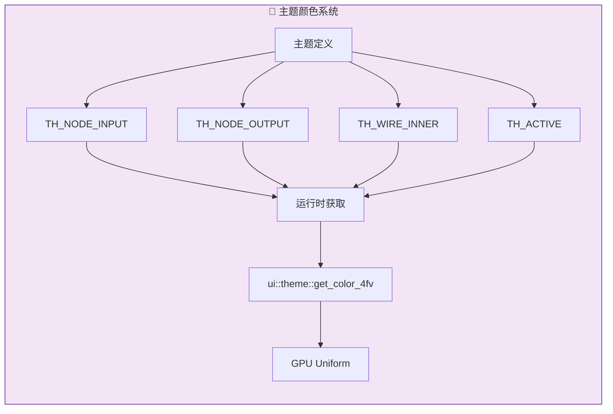

```cpp
/* 主题颜色获取 */
static void nodelink_batch_draw(const SpaceNode &snode)
{
    NodeLinkUniformData node_link_data;
    
    /* 从主题获取颜色 */
    ui::theme::get_color_4fv(TH_WIRE_INNER,
                             node_link_data.colors[nodelink_get_color_id(TH_WIRE_INNER)]);
    ui::theme::get_color_4fv(TH_WIRE,
                             node_link_data.colors[nodelink_get_color_id(TH_WIRE)]);
    ui::theme::get_color_4fv(TH_ACTIVE,
                             node_link_data.colors[nodelink_get_color_id(TH_ACTIVE)]);
    ui::theme::get_color_4fv(TH_EDGE_SELECT,
                             node_link_data.colors[nodelink_get_color_id(TH_EDGE_SELECT)]);
    ui::theme::get_color_4fv(TH_REDALERT,
                             node_link_data.colors[nodelink_get_color_id(TH_REDALERT)]);
    
    /* 上传到 GPU */
    gpu::UniformBuf *ubo = GPU_uniformbuf_create_ex(
        sizeof(node_link_data), &node_link_data, __func__);
    GPU_batch_uniformbuf_bind(g_batch_link.batch, "link_uniforms", ubo);
}
```

## 7. 跨平台兼容性

### 7.1 DPI 适配

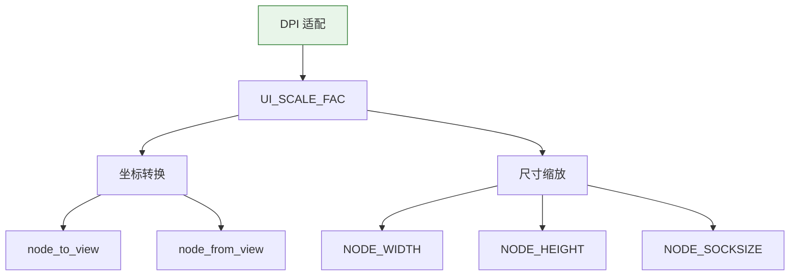

```cpp
/* DPI 感知的设计 */
#define BASIS_RAD (0.2f * U.widget_unit)           // 相对于 widget 单位
#define NODE_DYS (U.widget_unit / 2)
#define NODE_DY U.widget_unit
#define NODE_SOCKSIZE (0.25f * U.widget_unit)

/* 坐标转换 */
float2 node_to_view(const float2 &co) {
    return co * UI_SCALE_FAC;      // 应用 DPI 缩放
}

float2 node_from_view(const float2 &co) {
    return co / UI_SCALE_FAC;      // 还原 DPI 缩放
}

/* 尺寸计算 */
#define NODE_WIDTH(node) (node.width * UI_SCALE_FAC)
#define NODE_HEIGHT(node) (node.height * UI_SCALE_FAC)
```

## 8. 调试与维护

### 8.1 调试支持

```cpp
/* 断言使用 */
BLI_assert(is_node_panels_supported(node));
BLI_assert(node.runtime->panels.size() == node.num_panel_states);
BLI_assert(socket_type >= 0);
BLI_assert(socket_type < std::size(std::node_socket_colors));

/* 防御性检查 */
if (!node.declaration()) {
    return;  // 优雅处理
}

if (!panel_runtime.content_extent.has_value()) {
    continue;  // 跳过无效数据
}

/* 调试绘制（开发时）*/
#ifndef NDEBUG
    /* 绘制边界框 */
    ui::draw_roundbox_4fv(&node.runtime->draw_bounds, false, 1.0f, red_color);
#endif
```

### 8.2 代码文档

```cpp
/**
 * \file
 * \ingroup spnode
 * \brief Higher level node drawing for the node editor.
 * 
 * This file contains the main node drawing logic, including:
 * - Node layout calculation
 * - Socket positioning
 * - Panel management
 * - Preview rendering
 * 
 * \note Coordinate system: All coordinates are in view space (DPI-scaled)
 * \see drawnode.cc for lower-level drawing functions
 */

/**
 * Update node draw order based on selection state.
 * 
 * Unselected nodes are drawn first, then selected nodes,
 * with the active node at the very end. This ensures proper
 * visual layering.
 * 
 * \param ntree: The node tree to update
 */
void tree_draw_order_update(bNodeTree &ntree);

/**
 * Calculate the drawing bounds for a node.
 * 
 * This function computes the final screen-space rectangle
 * for the node based on its content and current state.
 * 
 * \param C: Context
 * \param tree_draw_ctx: Drawing context
 * \param ntree: Node tree
 * \param node: The node to update
 * \param block: UI block for layout
 */
static void node_update_basis(const bContext &C,
                              TreeDrawContext &tree_draw_ctx,
                              bNodeTree &ntree,
                              bNode &node,
                              ui::Block &block);
```

## 9. 设计模式应用

### 9.1 使用的模式

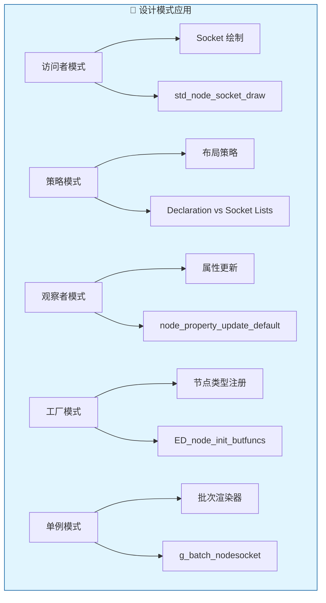

### 9.2 现代 C++ 特性

```cpp
/* 使用现代 C++ 特性 */

// 1. 结构化绑定
for (const auto [i, path] : snode->treepath.enumerate()) {
    // 使用 i 和 path
}

// 2. std::optional
std::optional<float> header_center_y;
if (panel_runtime.header_center_y.has_value()) {
    float y = *panel_runtime.header_center_y;
}

// 3. std::variant
struct FlatNodeItem {
    std::variant<
        flat_item::Socket,
        flat_item::Separator,
        flat_item::PanelHeader,
        // ...
    > item;
};

// 4. Lambda 表达式
std::ranges::sort(sort_nodes, [](bNode *a, bNode *b) { 
    return a->ui_order < b->ui_order; 
});

// 5. 智能指针
std::unique_ptr<bNodeLinkDrag> linkdrag;
std::shared_ptr<asset::AssetItemTree> assets_for_menu;

// 6. 类型推导
auto &panel_runtime = node.runtime->panels[panel_decl.index];
```

## 10. 总结与建议

### 10.1 核心设计原则

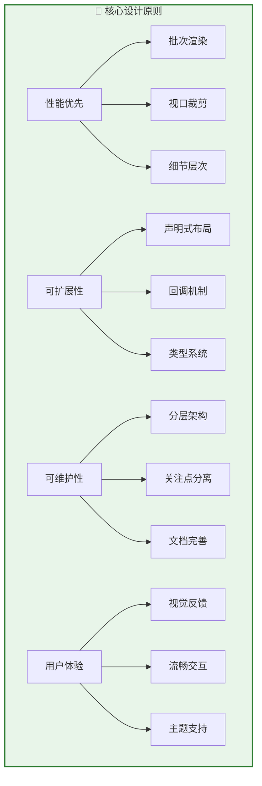

### 10.2 开发建议

1. **性能优化**
   - 始终使用批次渲染处理大量相似元素
   - 实现视口裁剪避免绘制不可见内容
   - 使用细节层次控制在低缩放时的性能

2. **代码组织**
   - 保持绘制逻辑与数据逻辑分离
   - 使用声明式配置替代命令式代码
   - 遵循现有的命名规范和代码风格

3. **可扩展性**
   - 设计时考虑自定义节点类型的需求
   - 提供回调机制供扩展使用
   - 保持 API 的稳定性和向后兼容

4. **调试支持**
   - 添加适当的断言检查
   - 提供调试绘制模式
   - 记录关键性能指标

Blender 节点绘制系统是一个经过长期演进的成熟架构，其设计理念和实现技术对于开发复杂的图形编辑器具有重要的参考价值。
