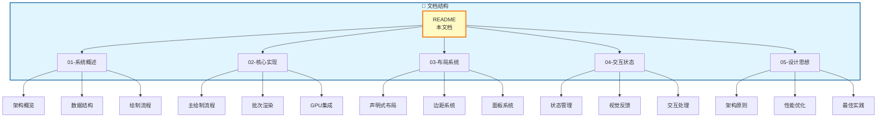
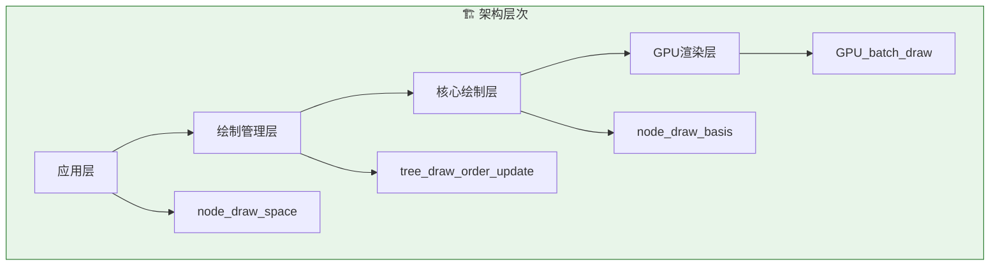
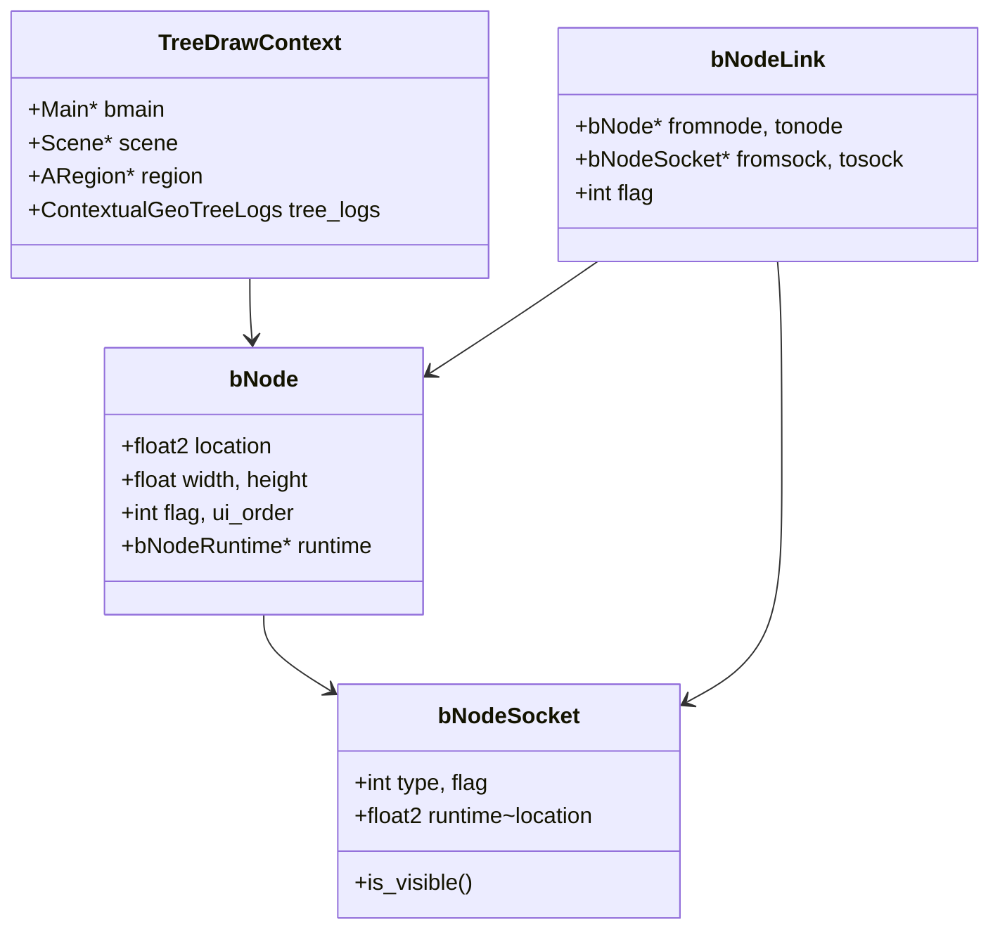

# Blender 节点编辑器绘制系统文档集

## 📚 文档概览

本系列文档深入剖析 Blender 节点编辑器的绘制系统，从架构设计到具体实现，全面展示这一复杂图形系统的内部工作原理。



## 📋 文档清单

| 序号 | 文档名称 | 主要内容 | 适合读者 |
|-----|---------|---------|---------|
| 01 | [节点绘制系统概述](./01-节点绘制系统概述.md) | 系统架构、核心文件、数据结构、整体流程 | 初学者、架构师 |
| 02 | [节点绘制核心实现详解](./02-节点绘制核心实现详解.md) | 主绘制流程、布局计算、Socket绘制、链接渲染 | 开发者、进阶学习 |
| 03 | [节点布局与排版系统](./03-节点布局与排版系统.md) | 声明式布局、边距系统、面板系统、响应式设计 | UI开发者 |
| 04 | [节点交互与状态渲染](./04-节点交互与状态渲染.md) | 状态管理、视觉反馈、交互效果、预览系统 | 交互设计师 |
| 05 | [设计思想与最佳实践](./05-设计思想与最佳实践.md) | 架构原则、性能优化、可扩展性、代码组织 | 架构师、技术负责人 |

## 🎯 核心知识点

### 1. 系统架构



### 2. 关键文件

| 文件路径 | 行数 | 主要职责 |
|---------|------|---------|
| `source/blender/editors/space_node/node_draw.cc` | ~2500 | 高级绘制逻辑、布局计算 |
| `source/blender/editors/space_node/drawnode.cc` | ~2440 | 底层绘制、链接渲染、Socket渲染 |
| `source/blender/editors/space_node/node_intern.hh` | ~827 | 接口定义、常量、数据结构 |

### 3. 核心数据结构



## 🚀 快速开始

### 阅读路径建议

1. **初学者路径**: 01 → 04 → 05
   - 先了解整体架构
   - 理解交互和状态
   - 学习设计思想

2. **开发者路径**: 01 → 02 → 03 → 05
   - 全面了解系统
   - 深入实现细节
   - 掌握布局系统
   - 学习最佳实践

3. **架构师路径**: 01 → 05 → 02 → 03
   - 把握整体架构
   - 理解设计哲学
   - 研究实现技术
   - 了解扩展机制

### 关键代码入口

```cpp
// 1. 主绘制入口
// source/blender/editors/space_node/node_draw.cc
void node_draw_space(const bContext &C, ARegion &region);

// 2. 节点布局计算
static void node_update_basis(const bContext &C,
                              TreeDrawContext &tree_draw_ctx,
                              bNodeTree &ntree,
                              bNode &node,
                              ui::Block &block);

// 3. 链接批次渲染
// source/blender/editors/space_node/drawnode.cc
void node_draw_link(const bContext &C,
                    const View2D &v2d,
                    const SpaceNode &snode,
                    const bNodeLink &link,
                    const bool selected);
```

## 🎨 特色内容

### Mermaid 图表

所有文档都包含丰富的 Mermaid 图表，包括：
- 流程图（Flowchart）
- 类图（Class Diagram）
- 序列图（Sequence Diagram）
- 状态图（State Diagram）

### 代码示例

文档中包含大量来自 Blender 源码的实际代码片段，并配有详细注释。

### 架构分析

深入分析设计决策背后的思考，帮助理解为什么这样实现。

## 📖 相关资源

### 官方资源

- [Blender 官方文档](https://docs.blender.org/)
- [Blender 开发者文档](https://developer.blender.org/)
- [Blender 源码](https://projects.blender.org/blender/blender)

### 源码文件

```
source/blender/editors/space_node/
├── node_draw.cc          # 主要绘制逻辑
├── drawnode.cc           # 底层绘制函数
├── node_intern.hh        # 内部接口
├── space_node.cc         # 空间管理
├── node_edit.cc          # 编辑操作
├── node_select.cc        # 选择操作
├── node_relationships.cc # 链接关系
└── node_view.cc          # 视图操作
```

## 🤝 贡献

这些文档基于 Blender 4.x 版本的源码分析编写。随着 Blender 的更新，部分内容可能需要调整。

## 📝 许可

本文档内容基于 Blender 的 GPL 许可证。Blender 是 Blender Foundation 的注册商标。

## 🎓 学习建议

1. **结合源码阅读**: 文档中的代码片段都标注了来源文件，建议对照源码阅读
2. **动手实验**: 可以尝试修改源码并观察效果，加深理解
3. **关注更新**: Blender 的节点系统在不断演进，关注官方更新日志
4. **社区交流**: 参与 Blender 开发者社区的讨论

---

*本文档集创建于 2026年5月，基于 Blender 源码分析编写*
